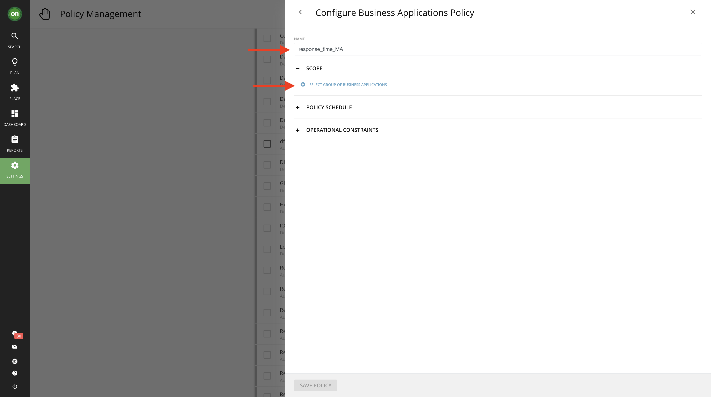
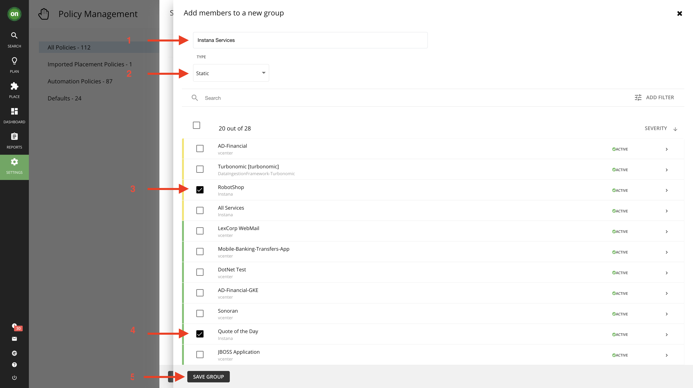
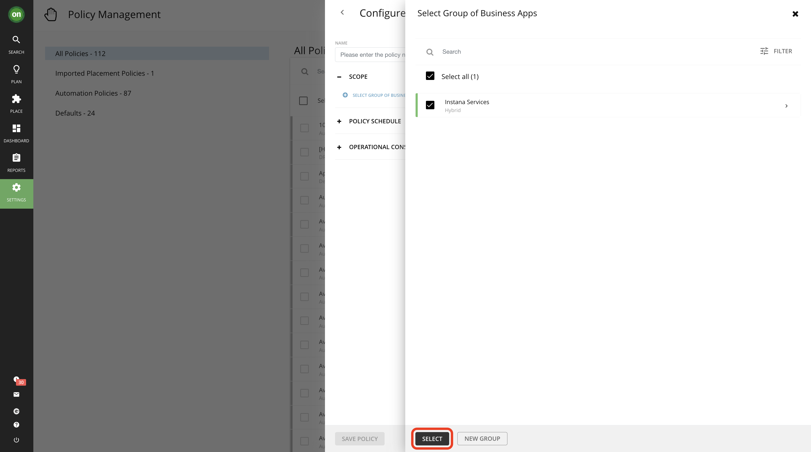
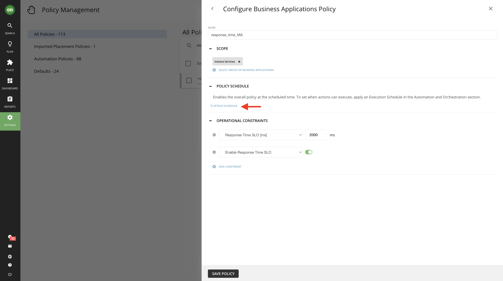
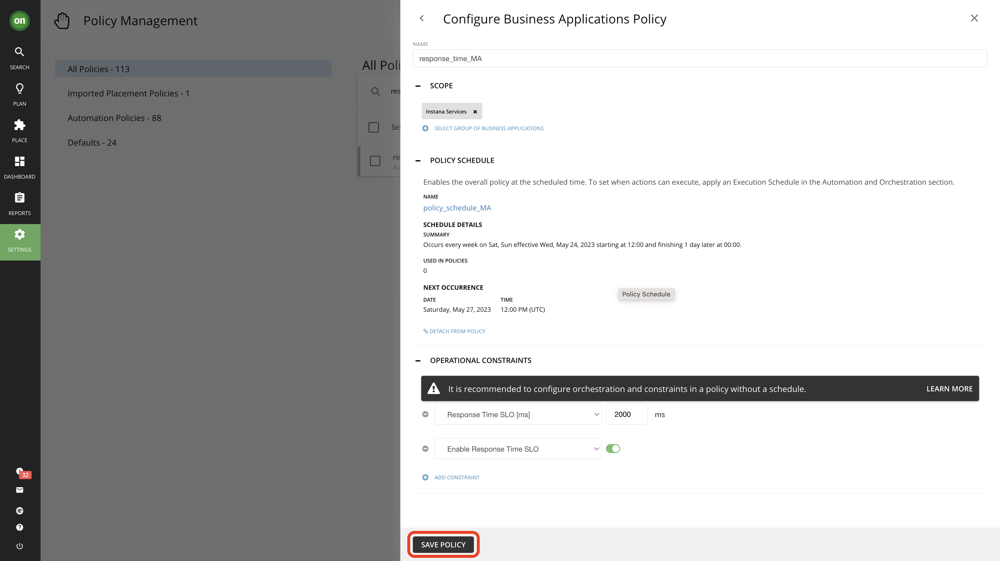

# 106: Acciones y políticas turbonómicas

## Objetivo

En este laboratorio:

*   Explorar diferentes tipos de acciones
*   Explorar las políticas existentes
*   Crear una política de automatización
*   Programar una política de automatización

**Tenga en cuenta que el número y los tipos de acciones pueden variar en función de su entorno**

## Explorar diferentes tipos de acciones

1.  Vaya al panel principal pulsando el botón **On** del navegador. A continuación, seleccione **Mostrar todo** en la sección **Acciones pendientes**.

2.  En esta página verá todas las acciones pendientes, tanto en la nube como en local. Si echa un vistazo a la lista de la izquierda, verá que las acciones están clasificadas por tipo. Dedica unos minutos a explorar las acciones yendo a las pestañas on-prem o cloud.

3.  Mientras exploras las acciones, notarás que cada tipo de acción tiene múltiples entidades a las que afecta. Por ejemplo, el tipo **Scale** - que es básicamente una acción de redimensionamiento para entidades en la nube - afecta a VMs, bases de datos, almacenamiento VM y volúmenes. Echemos un vistazo más de cerca a algunas de estas acciones.

Navegue hasta **Volúmenes** en Tipo de acción de **escala**.

Seleccione la pestaña **Azure**. A continuación, haga clic en **Detalles** para una acción que es **Rendimiento** del mercado y reduce su coste. Es posible que tenga que desplazarse a la derecha para localizar el botón.

Esta página muestra todos los detalles acerca de esta acción, incluyendo por qué se generó, cuál es el impacto si se toma, los costos o ahorros de costos asociados con la toma de esta acción, e información importante acerca de si causará tiempo de inactividad si se toma y si es reversible o no. Echemos un vistazo más de cerca a la información especificada en el detalle de esta acción.

1.  Esta sección le informa de la acción, la entidad a la que afecta, la ubicación en la que existe la entidad y el motivo. En esta imagen, tenemos una acción de volumen de escalado para la entidad denominada **ptericdisks3\_datadisk\_2** en el despliegue denominado **EA - Desarrollo** y el motivo es Congestión de IOPS.

2.  La sección "Aspectos esenciales de la acción" ofrece una visión rápida de lo que necesita saber para emprender esta acción.

    *   La acción puede ser aceptada y ejecutada inmediatamente significa que actualmente no hay restricciones que te impidan tomarla ahora mismo. Exploraremos más a fondo lo que esto significa cuando hablemos de los modos de acción.
    *   Si hay o no tiempo de inactividad asociado a la adopción de esta medida. En nuestro ejemplo, este cambio requiere un periodo de inactividad, por lo que al plantearse tomarlo hay que planificarlo con antelación e informar a los usuarios de este volumen de inactividad previsto.
    *   Si esta acción es o no reversible.

3.  En esta sección aprenderá por qué se genera esta acción. Normalmente, Turbonomic observa la entidad durante un periodo de tiempo y captura el percentil 95 de la misma. Considerando el ejemplo mostrado en la imagen inferior, Turbonomic nos dice que la utilización de IOPS es de aproximadamente el 100% el 95% del tiempo durante un periodo de observación de 30 días. Esto significa que hay una congestión de IOPS en este volumen, por lo que se genera una acción de escalado para esta entidad con el fin de moverla a un volumen más adecuado.

4.  El gráfico del percentil 95 de IOPS.

5.  Gráfico de IOPS medias diarias.

6.  La línea de puntos representa el percentil 95 previsto después de tomar esta medida.

7.  Comparación detallada entre el estado actual de los recursos y el resultado previsto tras la adopción de la medida.

8.  Comparación detallada del ahorro de costes si toma esta medida. Observe cómo el escalado a un volumen diferente se traducirá en mayores IOPS, menor utilización e incluso ahorro de dinero. Entonces, ¿por qué no lo haría?

### Optimizar los recursos locales

En esta sección, tomará acciones que optimizarán sus recursos on-prem a la vez que aseguran el rendimiento. La realización de dichas acciones tendrá como resultado la liberación de recursos por parte de entidades o VMs que no estén utilizando lo que tienen durante el periodo de observación (por defecto 30 días) para que puedan ser asignados a cargas de trabajo que necesiten dichos recursos.

1.  Vaya a la pestaña **On-Prem** de su página de acciones. A continuación, en **Redimensionar**, seleccione **Máquinas virtuales**.
2.  Desplácese por la lista y seleccione una acción para reducir el tamaño de la memoria virtual que tenga **Eficiencia** como categoría de acción. Haga clic en **Detalles**.

3.  Compruebe los detalles, se dará cuenta de que la utilización de la memoria virtual de esta máquina virtual estuvo por debajo del 1% durante el 95% del tiempo a lo largo de 30 días. Esto significa que esta máquina virtual ha sobreasignado memoria que no consume. Por tanto, puede reducir con seguridad la capacidad de memoria sin dejar de ofrecer un rendimiento óptimo. Observe los resultados proyectados de tomar la acción, que aumentará la utilización del 1% al 2%, lo que es perfectamente aceptable.

Una vez que apruebe todos los detalles y se asegure de que esta acción es segura, haga clic en el botón **Ejecutar acción** en la parte inferior de la página de detalles. Una vez que ejecute esta acción, Turbonomic utilizará llamadas a la API para ajustar la memoria virtual de esta máquina virtual por usted. Por lo tanto, no necesitará iniciar sesión en su entorno vCenter. Si la acción se ejecuta correctamente, verá una marca de verificación verde junto a esa acción.

## Políticas turbonómicas

Has aprendido a realizar acciones manualmente. Pero, ¿y si quisiéramos automatizar esto? Una vez que validamos que es seguro y bueno tomar una determinada acción y confiamos en ella, podemos permitir que las entidades actúen según sus propias decisiones.

### Explorar las políticas existentes

*Como recordatorio, por favor asegúrese de que ha iniciado sesión con un usuario **Administrador**. Si no ha iniciado sesión como usuario administrador, no dispondrá de los permisos necesarios para ejecutar los laboratorios.*

1.  Vaya a **Configuración** y, a continuación, a **Políticas**. En esta página, verá una lista de todas las políticas existentes.

2.  En la lista de la izquierda, seleccione **Valores por defecto**. Esto mostrará una lista de todas las políticas por defecto del sistema.

***Consejo**: Estas políticas por defecto permanecen efectivas a menos que el usuario cree una política que afecte a los mismos recursos pero con criterios diferentes. La política definida por el usuario anula la política por defecto.*

3.  Desplácese hacia abajo en la lista de políticas predeterminadas y haga clic en **Valores predeterminados de almacenamiento**. Observe que esta política establece la aceptación de la acción **Redimensionar** en recomendar. Esto hará que todas las acciones de cambio de tamaño generadas para el almacenamiento se establezcan solo como recomendadas y no se puedan ejecutar en Turbonomic.

4.  Respectivamente, para la acción que exploró para una máquina virtual en nube en la que podría aceptarla manualmente y ejecutarla dentro de Turbonomic, hay un conjunto de políticas predeterminado que lo define:

Navegue hasta la política **Virtual Machine Defaults** de la lista de políticas por defecto. Puede ver que todas las acciones de escalado en la nube están configuradas como **Manual**, lo que permite aceptarlas y ejecutarlas (suponiendo que no haya requisitos previos para ellas).

### Crear una política de automatización

Creará una política de automatización para definir cómo desea que Turbonomic trate las acciones a medida que aparecen. Tenga en cuenta que las políticas definidas por el usuario anularán las políticas predeterminadas del sistema que afecten a la misma entidad.

#### Añadir restricciones al objetivo de nivel de servicio (SLO) de tiempo de respuesta

1.  Vaya a **Políticas** desde **Configuración**. A continuación, haga clic en **Nueva política de automatización** en la parte superior derecha de la ventana.

2.  Haga clic en **Aplicación empresarial**. Una vez hecho aparecerá la ventana del Editor de Políticas.

3.  En el editor de políticas, asigne a su política un nombre único como response\_time\_YourInitials. Luego en **Alcance** haga click en **Seleccionar grupo de** aplicaciones de negocio. Esto especificará que grupo de aplicaciones de negocio serán afectadas por esta política.

4.  Una vez que haga clic en **Seleccionar** **grupo de aplicaciones** empresariales, aparecerá la ventana del editor **Seleccionar grupo de aplicaciones** empresariales.

5.  Haga clic en el botón **Nuevo grupo**. Aparecerá la ventana del editor **Añadir miembros a un nuevo** grupo.

6.  (1) Nombra tu grupo **Instana Services**. Cambie el tipo a (2) **Estático** en el menú desplegable **Tipo**. (3) Seleccione **RobotShop** y (4) **Cotización del día**. Luego (5) haga clic en el botón **Guardar grupo**

7.  Seleccione el grupo **Servicios Instana** y haga clic en el botón **Seleccionar**.

8.  En el editor de políticas, añada las restricciones **Habilitar SLO** de tiempo de respuesta y **SLO de tiempo de respuesta (ms)** y, a continuación, haga clic en **Guardar política**. Puede que reciba un mensaje diciendo que la política puede tardar 10 minutos en hacerse efectiva, haga clic en **Sí** para continuar.

9.  Para comprobar si su política está creada, intente buscar el nombre de su política en la lista. también puede realizar cambios y editarla según sea necesario desde aquí.

### Programar una póliza

Puede establecer una programación para una política de automatización, que establece una ventana de tiempo en la que la política entra en vigor. Además, una política programada puede incluir acciones programadas. Cuando la política está en vigor, Turbonomic recomienda o ejecuta automáticamente esas acciones a medida que se generan. Algunas de esas acciones podrían ser perjudiciales, por lo que es posible que desee aplazar su ejecución a una ventana de tiempo no crítica. En este caso, deberá establecer un calendario de ejecución de acciones dentro de la política programada.

1.  Haga clic en la política de automatización, response\_time\_YourInitials, que acabamos de crear.
2.  Expanda el Horario **de la Política** y haga clic en **Adjuntar Horario**. A continuación, haga clic en **Nuevo** calendario

3.  Esta sección definirá cuándo está en vigor su póliza.

    A. Dé a su programa de pólizas un nombre como policy\_schedule\_YourInitials.

    B. Seleccione **Semanal** en Recurrencia.

    C. Configurar para que se repita cada semana sólo los **sábados** y **domingos**.

    D. Seleccione la fecha de hoy como fecha de inicio y **Ninguna** como fecha final.

    E. Establezca las 12:00 como hora de inicio y 12 para las horas de duración. Tenga en cuenta que si usted está completando este laboratorio por la tarde hora local, es posible que desee ajustar este tiempo de 12:00 a unas horas después de su hora actual. La razón es que el sistema no le permitirá crear una política en el pasado.

    F. Seleccione su zona horaria.

    G. Compruebe el Resumen y haga clic en **Enviar**.

4.  Seleccione el horario que acaba de crear y haga clic en **Fijar**

5.  Ahora debería estar de vuelta en la página **Configurar la Política de Aplicaciones Empresariales**. Compruebe toda la información y asegúrese de que es correcta. Una vez hecho esto, haga clic en **Guardar política**.

