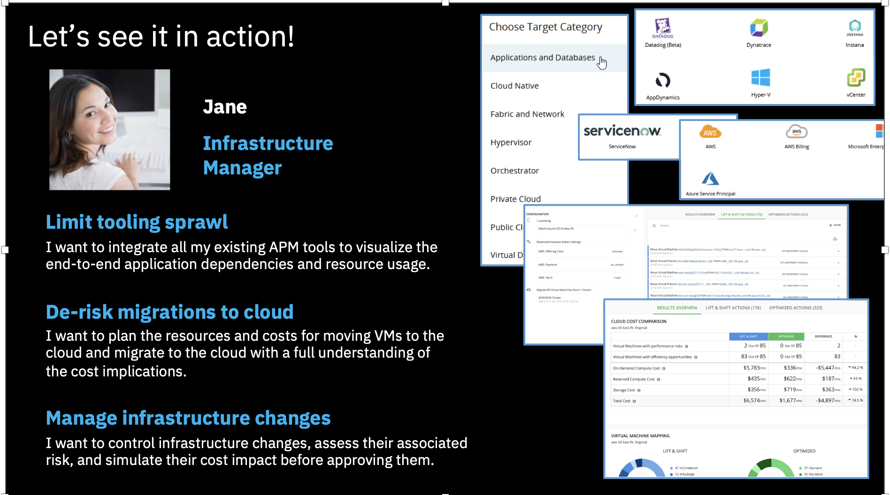

# 111: Infrastructure Changes Planning

let’s look how Turbonomic helps Infrastructure Managers with planning infrastructure changes, optimizations, or cloud migrations

Click the **PLAN** icon in the left menu, then click the **NEW PLAN** button in the top-right corner.

Along with the dashboards that were explored before, Turbonomic provides a dedicated planning tool to help Infrastructure Managers decide infrastructure changes.

You can see there are multiple plan types available, for on-premises infrastructure, for Kubernetes clusters as well as for Public Clouds. 

Let’s see an example plan for optimizing the infrastructure.

1. Click on **NEW PLAN**
2. Select **Optimize On-prem**

3. Select **Host Cluster** and select all listed cluster
4. Click on **Next** buttons and keep default value on all screen.

5. On final screen click on **RUN PLAN**
6. Review the result

