# 101: Introducción y requisitos previos

## Introducción

Como representante de datos, usted está asignado al proyecto de análisis que se ha encargado de hacer un análisis más profundo y la IA para determinar lo que podría estar causando la caída significativa en la satisfacción del cliente durante el último año. Basándose en las métricas disponibles en el panel de instrumentos ejecutivo, la gestión puede ver claramente que había una caída en el cumplimiento de la orden y un aumento de los tiempos de envío y los clientes se han estado quejando de ello en sus encuestas y en el servicio al cliente.

Con el fin de investigar esto más allá, el equipo de análisis está solicitando datos de empleados, datos relacionados con los miembros del personal que trabajan en el almacén, y apoyando los datos de logística relacionados con la disponibilidad y los turnos del personal de almacén. La solicitud de datos especifica que el equipo necesita los siguientes datos para realizar las tareas analíticas y de IA para cumplir sus objetivos de negocio:

| Datos solicitados     | Caso de uso de análisis e IA                                                                                                             |
| --------------------- | ---------------------------------------------------------------------------------------------------------------------------------------- |
| Empleado              | Necesario para el análisis de optimización de decisiones para investigar el personal del almacén y las mejoras del panel de instrumentos |
| ------------------    | -----------------------------------------------------------------------------------------------------------------                        |
| Cambios en el almacén | Necesario para el análisis de optimización de decisiones para investigar el personal del almacén y las mejoras del panel de instrumentos |
| ------------------    | -----------------------------------------------------------------------------------------------------------------                        |
| Personal de almacén   | Necesario para el análisis de optimización de decisiones para investigar el personal del almacén y las mejoras del panel de instrumentos |
| ------------------    | -----------------------------------------------------------------------------------------------------------------                        |
| Personal de almacén   | Necesario para el análisis de optimización de decisiones para investigar el personal del almacén y las mejoras del panel de instrumentos |

Antes de que el equipo de análisis pueda comenzar a hacer análisis de negocio, y crear y entrenar modelos de aprendizaje automático e IA para ayudar a determinar la disminución de la satisfacción del cliente, es importante entender y confiar en los datos. La analítica y los resultados resultantes son tan buenos como los datos. Los mejores datos son los datos que se entienden completamente y son de confianza y solo porque se puede acceder a los datos no significa que esté preparado para casos de uso de IA.

Para satisfacer la solicitud del equipo del proyecto de cumplir sus objetivos analíticos, utilizará el **Gobernanza de datos **capacidades de la solución de tejido de datos de IBM, **Cloud Pak for Data **, que se proporcionan por **Catálogo de conocimientos de Watson **, para asegurar que los datos necesarios sean fácilmente encontrados y accesibles desde una fuente confiable, que el contenido de los datos sea de la más alta calidad, y pueda ser completamente comprendido, y que cualquier información confidencial, personal o sensible sea gobernada y protegida con no riesgo de estar expuesto a aquellos que no tienen la autoridad para acceder o verlo.

Para ello, realizará las tareas siguientes:

1.  Defina y publique los siguientes artefactos de gobierno en el glosario empresarial:

    *   Categorías
    *   Clasificaciones
    *   Clases de datos
    *   Términos de negocio
    *   Datos de referencia
    *   Políticas
    *   Reglas de gobernabilidad de datos
    *   Normas de protección de datos

Las clases de datos y los términos empresariales se pueden aprovechar y asignar durante el proceso de enriquecimiento de metadatos, ya que los activos de datos se perfilan automáticamente, por lo que los consumidores de datos pueden comprender mejor el contenido de los datos y el contexto empresarial.

Existen dos tipos de reglas: **Gobernanza de datos **y **Protección de datos **. Las reglas de gobernabilidad de datos sólo son descriptivas y son **no **ejecutable, se debe asignar a una categoría y se puede importar utilizando un archivo CSV. Las reglas de protección de datos son ejecutables y accionables, no se asignan a una categoría, no se pueden importar y residen fuera de la jerarquía de categorías de artefactos de gobierno. Las normas de protección de datos aplican de forma autónoma las acciones de privacidad de datos, sin intervención humana, para eliminar el riesgo de que la información confidencial, personal y sensible esté expuesta a aquellos que no están autorizados a acceder o a verlo.

2.  Descubrir e importar los activos de datos necesarios utilizando la **Importación de metadatos **proceso.

3.  Enriquecer los metadatos de los activos de datos necesarios utilizando **Enriquecimiento de metadatos **procesos para:

    *   Contenido de datos de perfil
    *   Calidad de datos de acceso
    *   Asignar clasificaciones de datos
    *   Asignar términos empresariales

4.  Publicar los activos de datos en un catálogo gobernado.

5.  Aumente y socialice los activos de datos catalogados.

## Requisitos previos

### 1. Descargue los archivos de laboratorio

En el [Crear el glosario empresarial ](https://vest.buildlab.cloud/en/wkc/102)de este laboratorio, se le indicará que utilice una serie de archivos CSV de artefacto de gobierno. Estos archivos se han predefinido y se proporcionan para usted en un archivo zip que se encuentra en el **Datos de IBM y Live Demos de IA **Repositorio de GitHub. Antes de continuar, haga clic en el siguiente enlace para descargar el archivo zip:

[Data-Governance-Privacy-L3-Tech-Lab.zip](https://github.com/CloudPak-Outcomes/Outcomes-Projects/blob/main/Data-Governance-Privacy-L3-Tech-Lab/Data-Governance-Privacy-L3-Tech-Lab.zip)

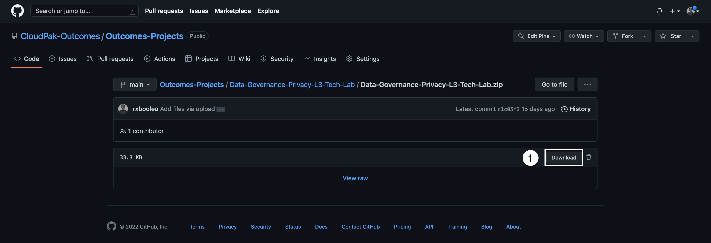

1.  Haga clic en **Descargar **.

Cuando la descarga esté completa, vaya a la ubicación de descarga y descomprima la **Data-Governance-Privacy-L3-Tech-Lab.zip **en el sistema. Recuerde dónde ha extraído los archivos porque se le indicará que los seleccione por nombre en todo el [Crear el glosario empresarial ](https://vest.buildlab.cloud/en/wkc/102)del laboratorio.

Descomprimir el archivo creará un directorio denominado **Data-Governance-Privacy-L3-Tech-Lab **que contendrá los siguientes archivos CSV:

| Nombre de archivo                    | Descripción                                         |
| ------------------------------------ | --------------------------------------------------- |
| governance-rules.csv                 | Reglas de gobernabilidad de datos                   |
| ----------------------------------   | ------------------------------------------          |
| governance-policies.csv              | Políticas de gobernabilidad de datos                |
| ----------------------------------   | ------------------------------------------          |
| governance-categories.csv            | Categorías de gobernanza de datos                   |
| ----------------------------------   | ------------------------------------------          |
| governance-data-classes.csv          | Clases de datos de gobierno de                      |
| ----------------------------------   | ------------------------------------------          |
| gobernance-classifications.csv       | Clasificaciones de gobierno de datos                |
| ----------------------------------   | ------------------------------------------          |
| governance-business-terms.csv        | Términos empresariales de gobierno de datos         |
| ----------------------------------   | ------------------------------------------          |
| governance-referencia-data.csv       | Conjuntos de datos de referencia de gobierno de     |
| ----------------------------------   | ------------------------------------------          |
| governance referencia-position.csv   | Posiciones de datos de referencia de gobierno de    |
| ----------------------------------   | ------------------------------------------          |
| governance referencia-department.csv | Departamentos de datos de referencia de gobierno de |

### 2. Inicie sesión en Cloud Pak for Data

Si todavía no lo ha hecho, utilizando las instrucciones y las capturas de pantalla a continuación, [Inicie sesión en IBM Cloud Pak for Data ](https://dataplatform.cloud.ibm.com/). Usted utilizará **su personal **Cloud Pak for Data como cuenta de servicio en la **Dallas **para hacer el laboratorio.

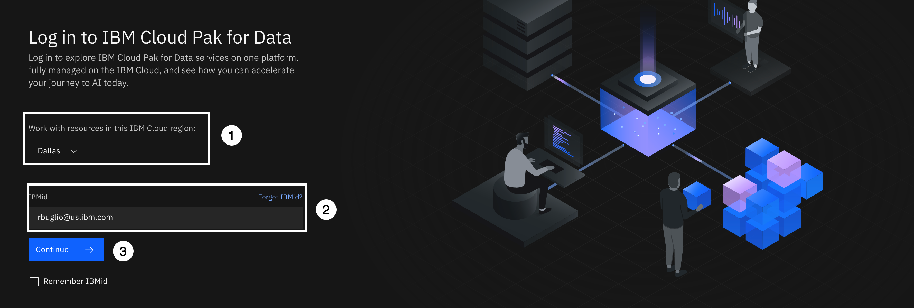

1.  Utilización de la **Trabaje con recursos en esta región de IBM Cloud: **desplegable, seleccione la opción **Dallas **región.

    Esto es **muy importante **porque todos los servicios de nube que se le han indicado que se suministren en el laboratorio de tejido de datos [Cómo empezar ](https://vest.buildlab.cloud/en/wkc/getting-started)debe suministrarse en la sección **Dallas **región.

2.  Introduzca su **ID de IBM **que ha utilizado para registrarse en Cloud Pak for Data.

    Este es su ID de IBM Cloud personal. Si ha iniciado sesión en Cloud Pak for Data anteriormente, y ha comprobado la **Recuerde que IBMid **en el recuadro de selección, puede que ya se haya rellenado para usted. Si tiene varias cuentas de Cloud Pak for Data, puede hacer clic dentro del área de IBM por encima de la **Continuar **y se mostrará una lista de IBM Ids disponibles para que pueda elegir.

3.  Haga clic en **Continuar **.

Si el ID de IBM es reconocido como un IBM w3id (ID interno de intranet de IBM w3), se le solicitará que especifique la contraseña utilizando el diálogo w3id en IBM Security Verify:

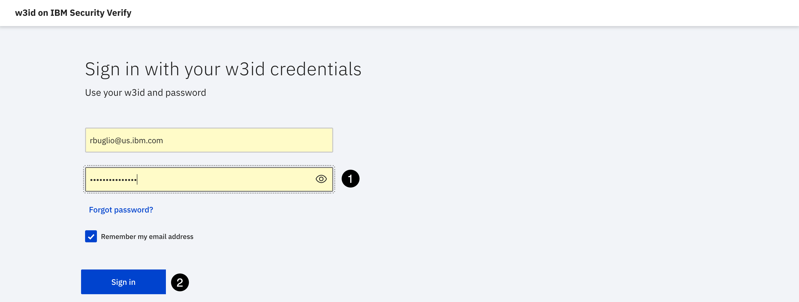

1.  Especifique el valor **contraseña **para su IBM w3id.
2.  Haga clic en **Signo en **.

Si el ID de IBM es **no **un IBM w3id, se le solicitará que especifique su contraseña utilizando el diálogo estándar de IBM Security Verify:

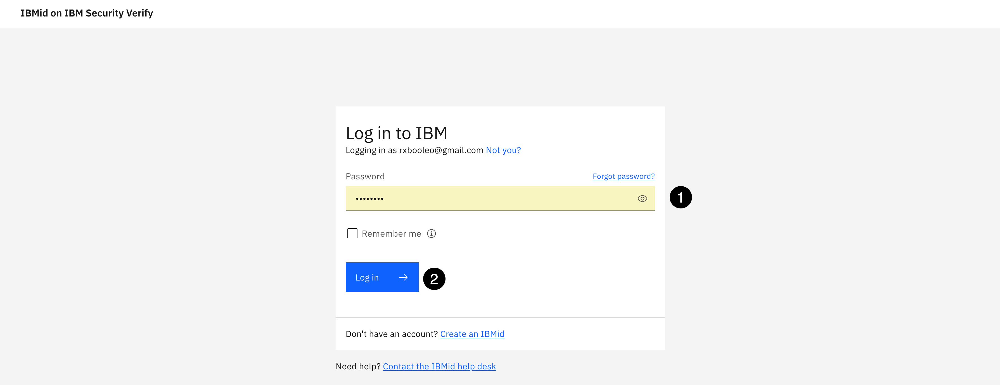

1.  Especifique el valor **contraseña **para su ID de IBM.
2.  Haga clic en **Iniciar sesión **.

### 3. Validar su entorno

Se le llevará a la página de inicio de Cloud Pak for Data. Si en algún momento de estas instrucciones se obtiene un mensaje emergente de **Cloud Pak for Data **pedir que le guíe o le ayude, desestime y simplemente siga los pasos de las instrucciones.

#### Asegúrese de que está en **su **cuenta de nube personal

Puede ser miembro de muchas cuentas en la nube. Este laboratorio se realiza utilizando su cuenta de nube personal, por lo que desea asegurarse de que está en la cuenta correcta antes de continuar con el laboratorio.

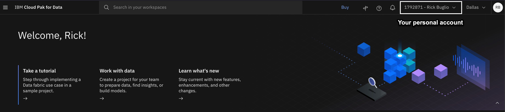

La cuenta que se muestra en la barra de herramientas debe mostrar **Su ID de cuenta de nube-Su nombre **. Por ejemplo, en la pantalla de arriba, la cuenta personal es **1792871-Rick Buglio **. Si su cuenta personal está seleccionada, como la captura de pantalla anterior, puede continuar con el paso siguiente. Si no es así, siga las instrucciones de abajo para cambiar a su cuenta personal.

En la captura de pantalla anterior, el usuario está en el **Resultados de Techzone **Cuenta en la nube y necesita cambiar a su cuenta personal. Este es un escenario común porque los vendedores y socios comerciales de IBM todavía podrían tener una reserva en los datos y la IA Live Demos, **Resultados de Techzone **, cuenta en la nube para realizar las demostraciones de ventas de Data Fabric Level 2. Al iniciar sesión en Cloud Pak for Data, recuerda la última cuenta en la que ha iniciado sesión, por lo que es una buena práctica para comprobar en qué cuenta se encuentra antes de continuar.

Utilización de la **Cuenta de nube **desplegable en la barra de herramientas, seleccione **Tu personal **cuenta de nube.

#### Asegúrese de que está en el **Dallas **región

Esto es **muy importante **. Basado en el [Cómo empezar ](https://vest.buildlab.cloud/en/wkc/getting-started)instrucciones, usted debe tener el **Catálogo de conocimientos de Watson **y **Watson Studio **servicios suministrados en el **Dallas **región. Como mínimo, necesita estos dos servicios suministrados en su cuenta de nube en el **Dallas **para hacer este laboratorio.

Usted **no puede **trabajar a través de las regiones de servicio de nube en Cloud Pak for Data as a Service. Sólo **Global **servicios, como **Almacenamiento de objetos de nube **, se puede utilizar en las regiones de servicio de nube. La mayoría de este laboratorio se realiza utilizando **Catálogo de conocimientos de Watson **, pero también depende en gran medida de un **Watson Studio **para realizar la importación y el enriquecimiento de metadatos, y para publicar activos en un catálogo gobernado. Por lo tanto, debe tener la capacidad de crear proyectos y catálogos, y utilizar todas las características de **Catálogo de conocimientos de Watson **, y poder publicar desde un proyecto en un catálogo que reside en la misma región en la misma cuenta.

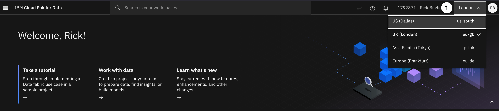

En la captura de pantalla anterior, la región se establece en **Londres **. La región tiene que ser establecida en **Dallas **. Si su región es **no **establecido en **Dallas **, realice los pasos siguientes:

Utilización de la **Región **desplegable en la barra de herramientas, seleccione la **Dallas **región.

### 4. Comprobar los límites del plan Lite

Este laboratorio utiliza el **Lite **plan de servicios de **Catálogo de conocimientos de Watson **. El plan de servicio Lite tiene las siguientes limitaciones:

*   Sólo puede crear 2 catálogos
*   Sólo puede crear 10 categorías
*   Sólo puede crear 300 términos empresariales

Para proporcionarle la introducción más profunda a las capacidades y diferenciadores de **Catálogo de conocimientos de Watson **, necesitará la capacidad de crear **1 **Catálogo, **3 **Categorías, y **150 **Términos de negocio. Los pasos de esta sección le darán instrucciones sobre cómo verificar el catálogo, la categoría y la capacidad de término de negocio en el entorno para completar satisfactoriamente este laboratorio.

Después de realizar los pasos de verificación siguientes, si el entorno **no **cumplir con los requisitos de capacidad, por favor notifique a un miembro del equipo que está apoyando este taller.

#### Verificar capacidad de categoría

El plan Lite de Watson Knowledge Catalog tiene un límite de 10 categorías. Este límite incluye subcategorías y cuenta el **\[uncategorized] **y **Ubicaciones **categorías del sistema, creadas por Watson Knowledge Catalog, como parte del límite de 10 categorías, por lo que realmente sólo tiene la capacidad de crear **8 **nuevas categorías.

El **\[uncategorized] **contiene 165 clases de datos predefinidas y 4 clasificaciones proporcionadas por Watson Knowledge Catalog. El **Ubicaciones **contiene los conjuntos de datos de referencia predefinidos que proporcionan la ubicación física y la ubicación soberana que seleccione al diseñar reglas de ubicación de datos para mover datos de una ubicación a otra. Las reglas de ubicación de datos siguen en el **Experimental **por lo que no serán cubiertos en este laboratorio, sino el **Ubicaciones **la categoría sigue incluida y cuenta para su máximo de 10 categorías.

Este laboratorio importa y crea **3 categorías **para mostrar las dependencias y relaciones de categoría cruzada, y el uso de subcategorías, por lo que puede experimentar la ventaja de utilizar el método de importación automatizado sin tener que crear todo manualmente.

Antes de empezar el laboratorio, siga los pasos siguientes para asegurarse de que tiene suficiente capacidad de categoría disponible:

1.  Seleccione la opción **Navegación **(las 4 líneas horizontales apiladas en la esquina superior izquierda).

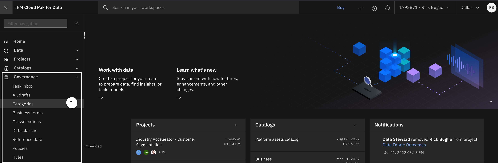

2.  Seleccione **Gobernanza > Categorías **desde el menú.

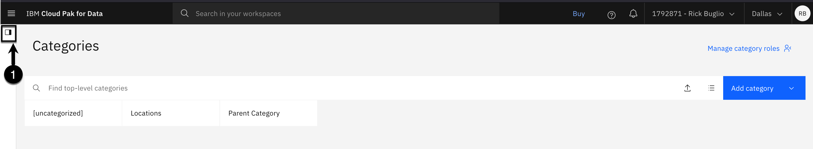

3.  Seleccione la categoría **explorador **en la esquina superior izquierda para abrir la vista de árbol de explorador.

**Nota: **La vista de explorador de categorías no se verá exactamente como el ejemplo de la captura de pantalla anterior, pero podrá determinar cuántas ranuras de categorías abiertas tiene expandiendo completamente todos los niveles de categorías en el árbol para exponer las subcategorías.

En esta cuenta, hay **6 categorías **created. El sistema suministrado **\[uncategorized] **y **Ubicaciones **categorías, una categoría padre y 3 subcategorías. Por lo tanto, tiene la capacidad de importar y crear las 3 nuevas categorías en el archivo CSV proporcionado.

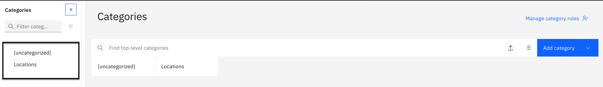

Es muy poco probable que usted **no **tener 3 ranuras de categoría disponibles. Lo más probable es que su entorno se vea como la pantalla de arriba con sólo las 2 categorías de sistema de **\[uncategorized] **y **Ubicaciones **ya que es probable que tenga un recién suministrado **Catálogo de conocimientos de Watson **con un glosario empresarial vacío.

#### Verificar capacidad de término empresarial

El plan Lite de Watson Knowledge Catalog tiene un límite de **300 **términos de negocio. Este laboratorio importa y crea, **150 **Los términos de negocio para tener un glosario empresarial completo y significativo, con un término definido para cada columna de los activos de datos que se añadirán mediante el proceso de importación de metadatos, para que puedan ser aprovechados por el proceso de enriquecimiento de metadatos.

Antes de empezar el laboratorio, siga los pasos siguientes para asegurarse de que tiene suficiente capacidad de término de negocio disponible:

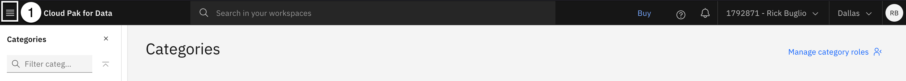

1.  Seleccione la opción **Navegación **(las 4 líneas horizontales apiladas en la esquina superior izquierda).

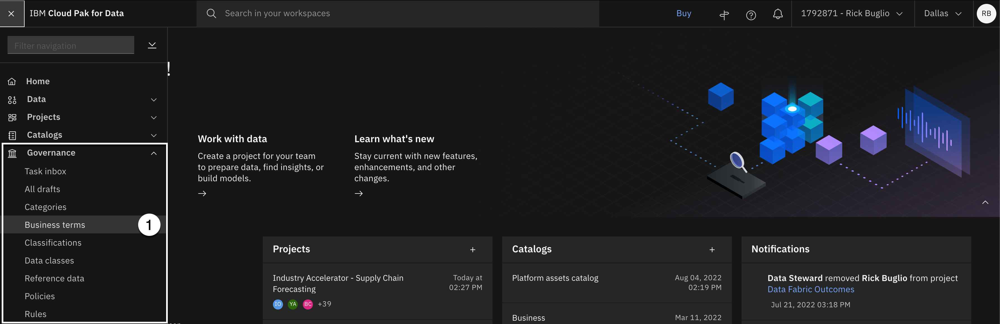

2.  Seleccione **Gobierno > Términos empresariales **desde el menú.

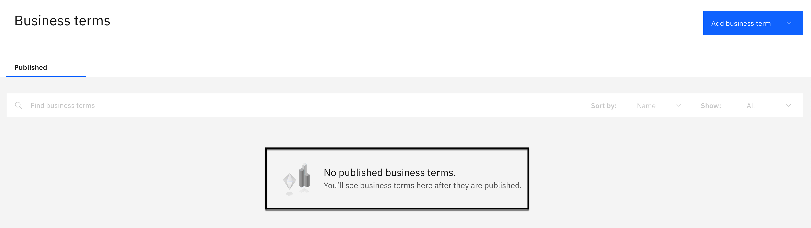

Si tiene un nuevo desplegado **Catálogo de conocimientos de Watson **servicio, su entorno se verá como la captura de pantalla de arriba sin términos de negocio publicados. Si es así, podrá importar y crear correctamente la **150 **nuevos términos de negocio en el [Crear términos empresariales ](https://vest.buildlab.cloud/en/wkc/102#4-create-business-terms)a continuación.

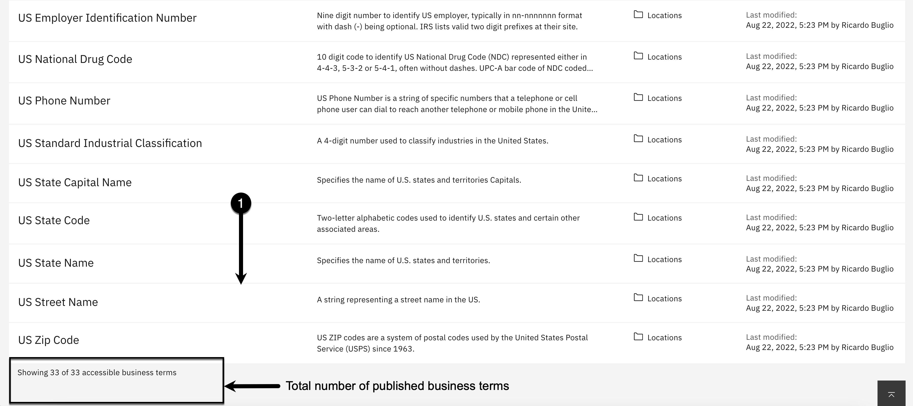

3.  Si el entorno tiene algunos términos empresariales publicados como la captura de pantalla anterior:

    a. Desplácese hasta la parte inferior de la página. b. Mire el número total de términos de negocio accesibles que se publican y haga una nota de cuántos tiene.

Si el número es menor o igual que **150 **podrá importar y crear correctamente el **150 **nuevos términos de negocio en el [Crear términos empresariales ](https://vest.buildlab.cloud/en/wkc/102#4-create-business-terms)a continuación.

#### Verificar capacidad de catálogo

El plan de servicio Lite de Watson Knowledge Catalog sólo permite **2 **los catálogos que se van a crear además de **Catálogo de activos de plataforma **. Este laboratorio crea **1 **nuevo catálogo que contendrá los activos de datos publicados para el laboratorio.

Antes de empezar el laboratorio, siga los pasos siguientes para asegurarse de que tiene suficiente capacidad de catálogo disponible:

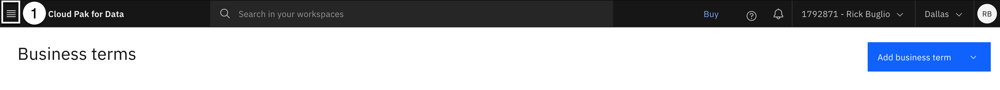

1.  Seleccione la opción **Navegación **(las 4 líneas horizontales apiladas en la esquina superior izquierda).

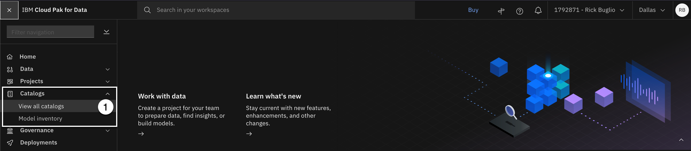

2.  Seleccione **Catálogos > Ver todos los catálogos **desde el menú.

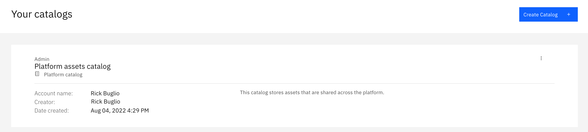

Es más probable que su entorno se vea como la pantalla de arriba con sólo el **Catálogo de activos de plataforma **porque probablemente tenga un recién suministrado **Catálogo de conocimientos de Watson **servicio.

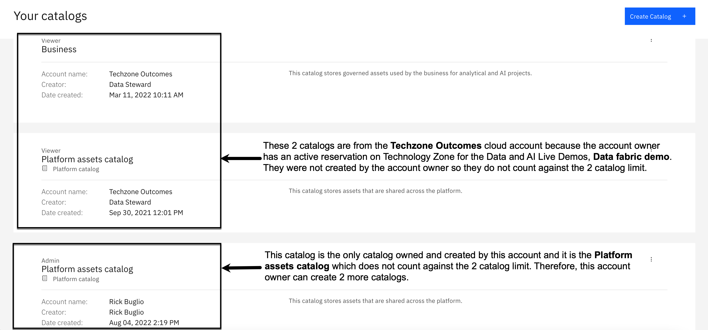

Es posible que el entorno también tenga el aspecto de la captura de pantalla anterior. Este entorno tiene **2 **catálogos de la **Resultados de Techzone **cuenta de nube porque el propietario de la cuenta tiene una reserva activa en la zona de tecnología para el **Demostración del tejido de datos **. El propietario de la cuenta **no **poseer estos catálogos así que **no **recuento contra el **2 **límite de catálogo, y **2 **de los catálogos son **Activo de plataforma **catálogos que no cuentan para el límite de catálogo. Por lo tanto, esta cuenta tiene la capacidad de crear un nuevo catálogo.

Si ya tiene **2 **catálogos, además de los **Catálogo de activos de plataforma **, y usted **no puede **crear uno nuevo, puede hacer lo siguiente:

a. Utilice un catálogo existente que posea y tenga derechos de administración completos para, y muy importante, que tenga el **Gobernados **Distintivo habilitado para que se apliquen las reglas de protección de datos. b. Suprima un catálogo existente, si puede, para dejar espacio para el nuevo catálogo que crea este laboratorio.

Si su entorno cumple todos los requisitos de capacidad, ¡está listo para comenzar el laboratorio! De lo contrario, notifique a un miembro del equipo que está apoyando este taller.
