# 102: Build the Business Glossary

This section creates all the governance artifacts needed to establish a trusted, business ready, analytics foundation. It uses a set of **CSV** files to import and create the artifacts in the upcoming steps, so make sure you have downloaded and unzipped the zip file you were instructed to in the [Download the Lab Files](https://vest.buildlab.cloud/en/wkc/101#1-download-the-lab-files) section above.

It is essential to establish the business glossary first before any data curation, or cataloging of data assets takes place. This is because governance artifacts, like data classes and business terms, can be automatically assigned to data assets during metadata enrichment and cataloging. If not, you would have to do all of those tasks manually, which defeats taking advantage of the automated and built-in data governance capabilities of Watson Knowledge Catalog.

Building a complete and meaningful business glossary can be very labor intensive and time consuming without automated processes in place. Fortunately, **Watson Knowledge Catalog** (WKC) provides governance artifact import capabilities to automate and expedite this process. You will use this feature to methodically create data governance artifacts using prebuilt CSV files to populate the business glossary with all the needed artifacts. There is a specific order that you must follow to create governance artifacts. This lab instructs you on that process (**do not** deviate from the order in which they are defined) to ensure all governance artifacts are defined in the proper sequence to establish proper relationships between them, and to avoid any errors and conflicts.

If at any point during these instructions you get a pop-up message from **Watson Knowledge Catalog** asking to guide or assist you, dismiss it and simply follow the steps in the instructions.

## 1. Create Categories

Categories act as folders or directories to organize governance artifacts and provide access controls to authorize who can author and manage those artifacts. Categories provide the logical structure for all governance artifacts, except data protection rules. You group governance artifacts in categories to make them easy to find and manage, and to control their visibility. Categories can be organized in a hierarchy based on their meaning and relationships to one another. A category can have subcategories, but a subcategory can have only one direct parent category.

In this section, you will import and create the **3** categories (one parent category and two sub-categories) that will provide the logical structure for the governance artifacts you will define in this lab.

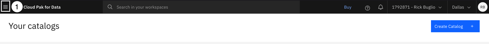

1. Select the **Navigation** menu (the 4 stacked horizontal lines in the upper left corner).

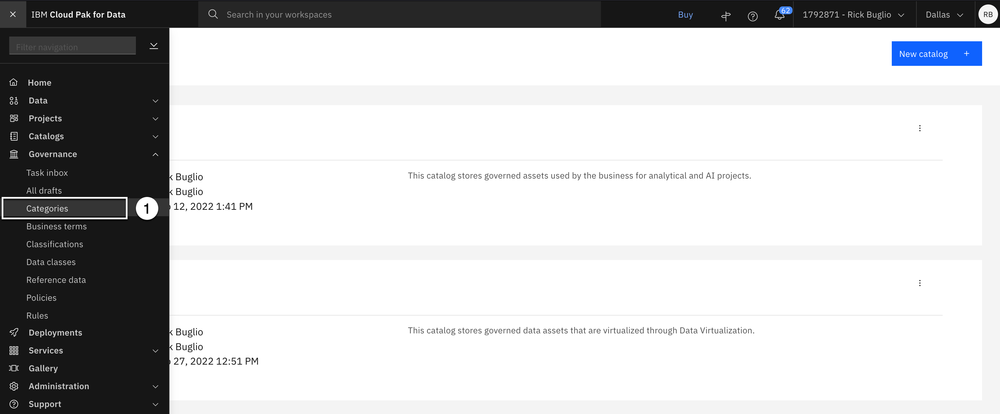

2. Select **Governance > Categories** from the menu.

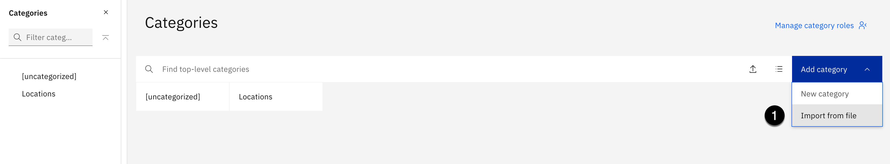

3. Using the **Add category** dropdown, select **Import from file**.

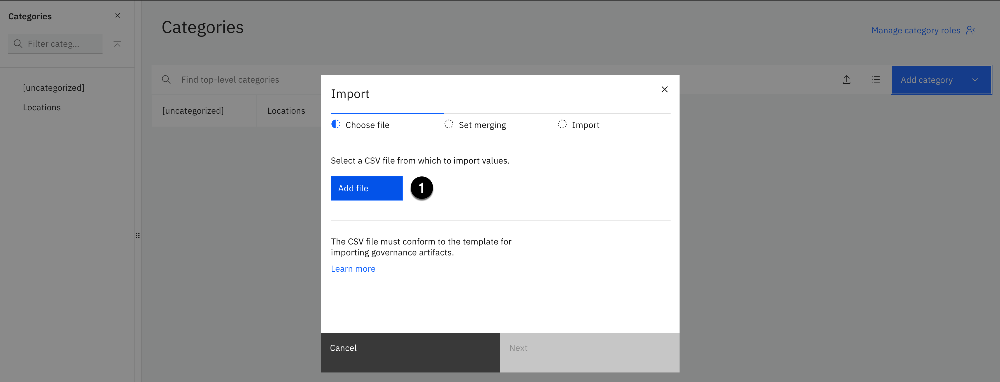

4. Click the **Add file** button.

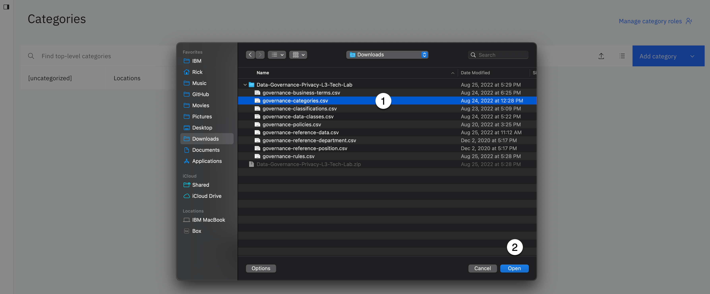

5. Select the **governance-categories.csv** file from your download location.

6. Click the **Open** button.

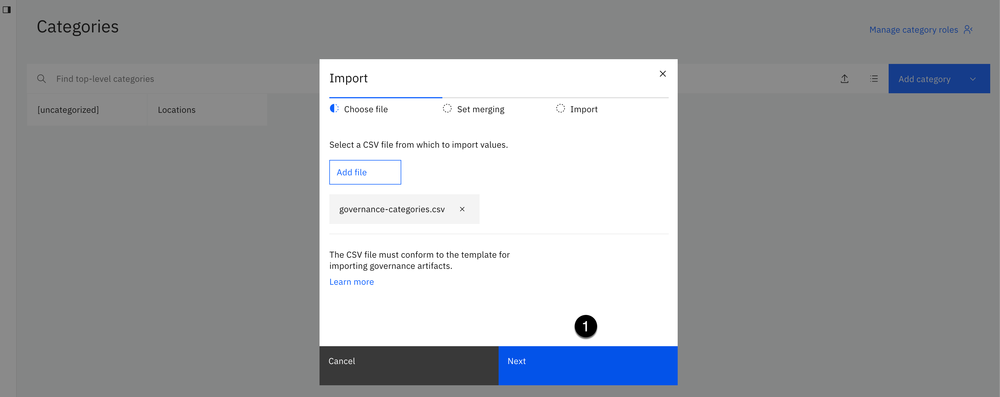

7. Click the **Next** button.

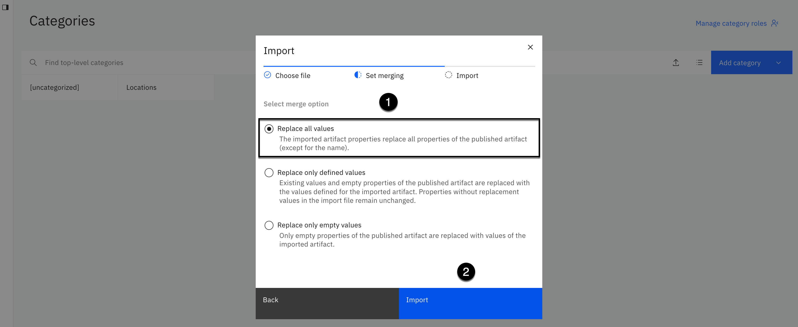

8. Select the **Replace all values** merge option.

9. Click the **Import** button.

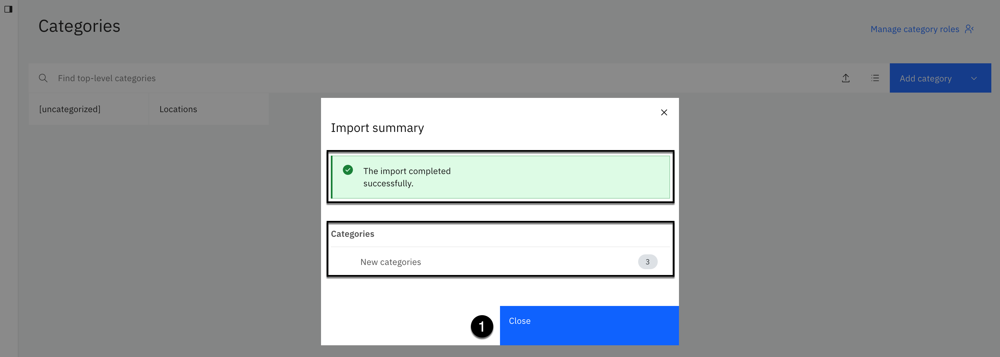

The import should succeed with 3 new categories.

10. Select the **Close** button.

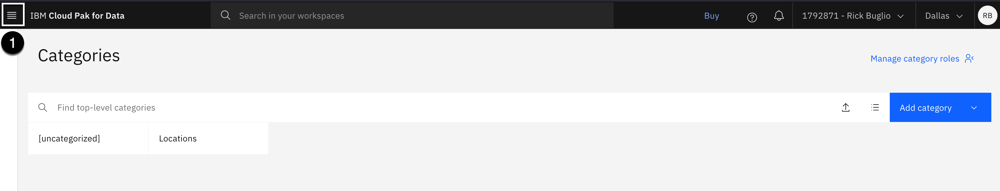

**Note:** If the new categories do not appear in the user interface after a successful import, **refresh** the page in your browser.

To view the new category and sub-categories:

11. Select the **Navigation** menu (the 4 stacked horizontal lines in the upper left corner).

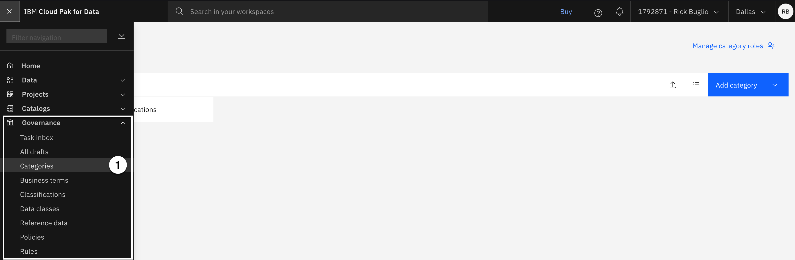

12. Select the **Governance > Categories** menu.

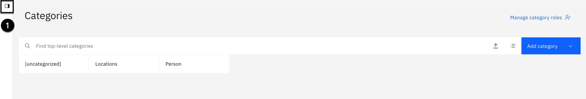

13. Select the **Category explorer** icon in the upper left corner to get a tree view.

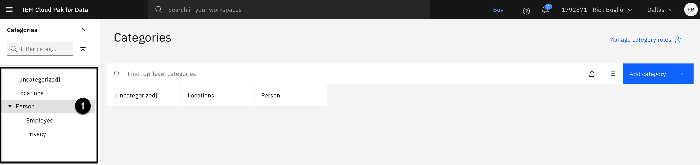

14. Expand the **Person** category to view all sub-categories.

You should see the **[uncategorized]** and **Locations** system categories and the 3 new categories you just imported and created with a parent category named: **Person** and two sub-categories underneath it named: **Employee** and **Privacy**.

## 2. Update Classifications

The default **Classifications** supplied by **Watson Knowledge Catalog** in the **[uncategorized]** category are excellent. They have well written descriptions, so there is no need to create new classifications, but you will update them. You will reassign them to the new **Person > Privacy** sub-category and augment them by adding tags and associating them to secondary categories they apply to: **Person** and **Employee**.

You can change the primary category of the classifications assigned to the **[uncategorized]** category, but you **can not** do it using the import method. You have to update each classification manually to change their primary category. If you attempt to change the primary category of an existing classification, by specifying a new primary category name in the import file, the import ignores the value and creates a new classification assigned to the new primary category you specify in the import file, and leaves the original classifications in the **[uncategorized]** category.

You could delete the existing classifications, and add them back under a different category, but you have to be very careful deleting classifications because they might be referenced by other governance artifacts and cataloged data assets. So, to maintain referential integrity, you will update them using the import method to add the tags and associate them to the secondary categories and then manually change their primary category from the **[uncategorized]** category to the new **Person > Privacy** sub-category. This will save time, educate you on the import method for classifications, how to change their primary category properly, and ensure the classifications can be used by the search engine when users search for information related to a **Person**, **Employee** or **Privacy**.

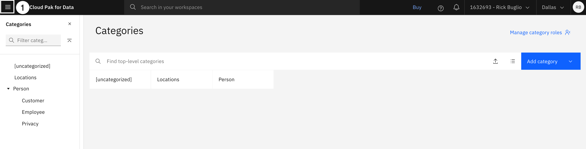

1. Select the **Navigation** menu (the 4 stacked horizontal lines in the upper left corner).

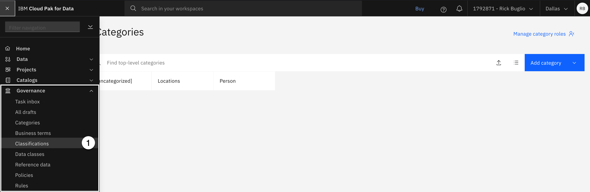

2. Select the **Governance > Classifications** menu.

3. Using the **Add classification** dropdown, select **Import from file**.

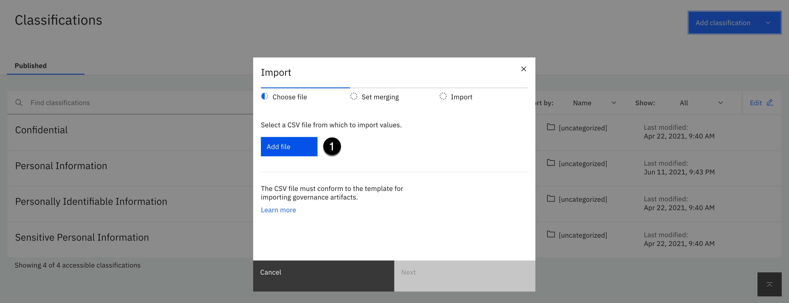

4. Click the **Add file** button.

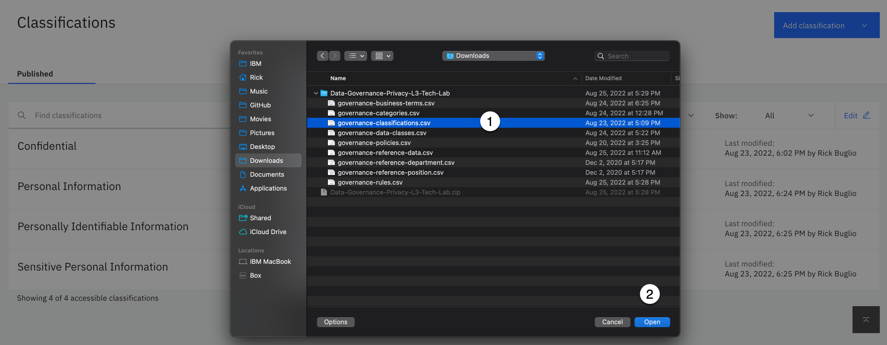

5. Select the **governance-classifications.csv** file from your download location.

6. Click the **Open** button.

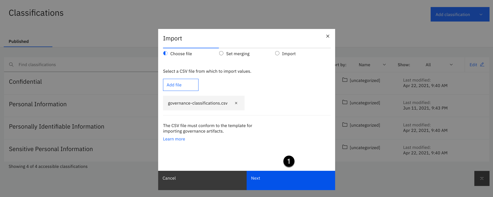

7. Click the **Next** button.

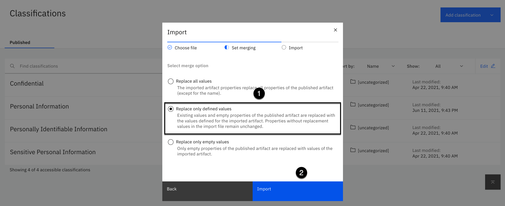

8. Select the **Replace only defined values** merge option.

    **Note:** This option is the best choice when you want to update attributes for existing governance artifacts. It leaves the existing artifact in place and only updates values with new values you supply and leaves all other attributes unchanged.

9. Click the **Import** button.

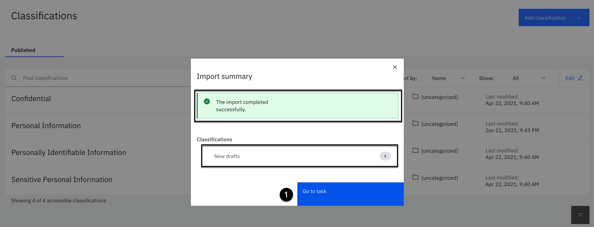

The import should complete successfully with **4** classifications in draft mode.

**Note:** From this point forward, all governance artifacts have to be published. Categories and Data Protection Rules **do not** need to be published but all other governance artifacts you create or update will be in draft mode until you publish them.

10. Click the **Go to task** button.

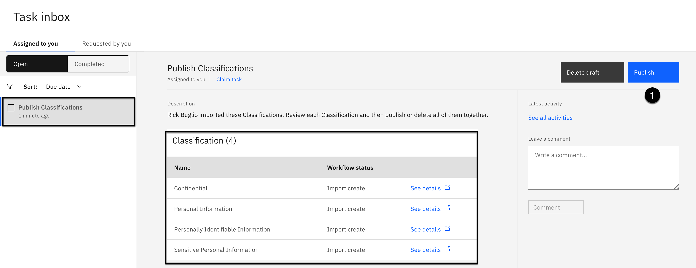

Familiarize yourself with the **Task inbox**. On the left are the open tasks that need to be published and the tasks you have already completed. You are always presented with the details of the task in the middle of the page. Notice that you are publishing 4 classifications with a means to view the details of each one.

11. Click the **Publish** button.

12. Click the **Publish** button again without entering a comment.

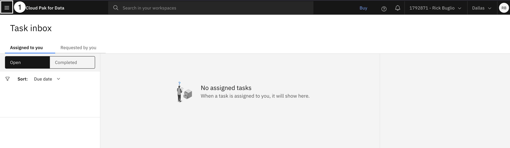

13. Select the **Navigation** menu (the 4 stacked horizontal lines in the upper left corner).

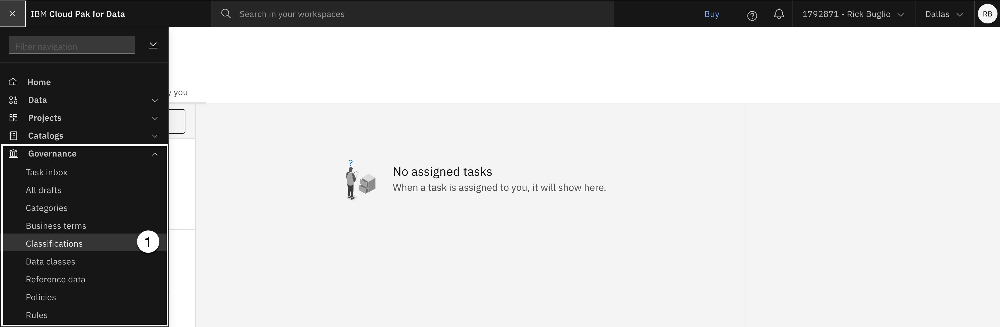

14. Select the **Governance > Classifications** menu.

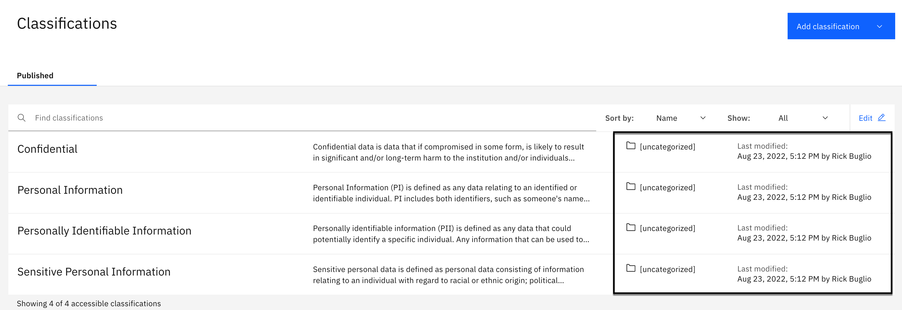

You should now see the 4 original classifications, which are still assigned to the **[uncategorized]** category, but with a **Last Modified date** of today (the day you are doing this lab).

You will now edit each classification and change the primary category to the **Person > Privacy** sub-category. During this process you will see the **Person** and **Employee** secondary categories and tags you just imported.

The instructions below will walk you through updating the **Confidential** classification using screen shots. There **will not** be any screen shots to update the remaining classifications. Follow the same process used to update the **Confidential** classification using the instructions provided for each classification listed.

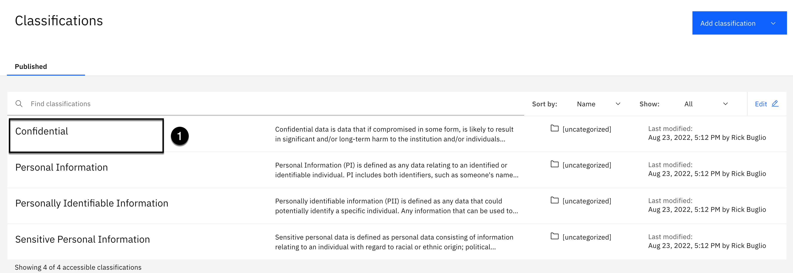

15. Click the **Confidential** classification. The first classification in the list.

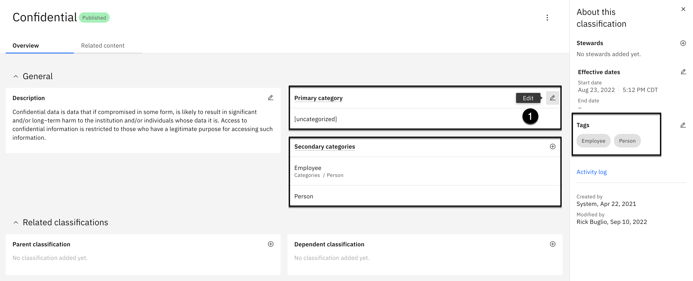

Notice the **Secondary categories** that the classification was assigned to and the **Tags** that were added during the import process.

16. Click the **Edit** button (looks like a pencil) in the **Primacy category** section.

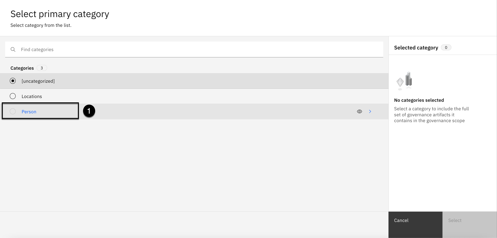

17. Select the **Person** category.

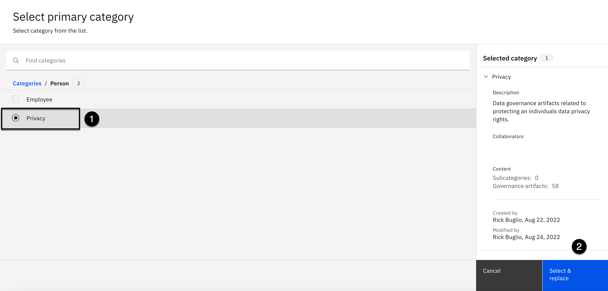

18. Select the **Privacy** sub-category.

19. Click the **Select & replace** button.

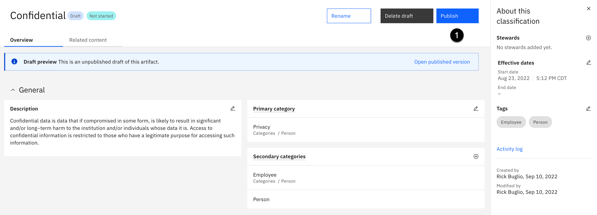

20. Select the **Publish** button.

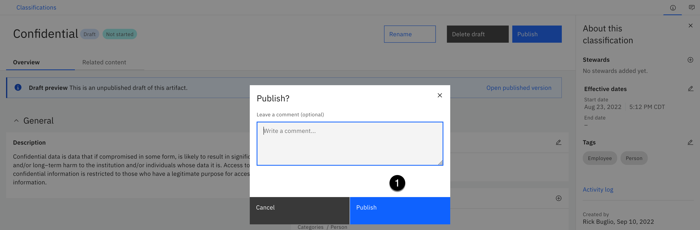

21. Select the **Publish** button again without entering a comment.

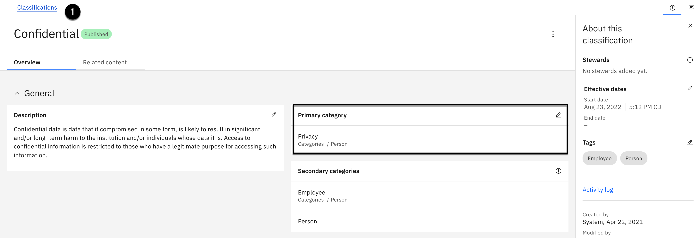

**Notice** that the Primary category is now set to the **Privacy** sub-category of the **Person** parent category.

22. Select the **Classifications** breadcrumb link in the upper left corner to go back to the Classifications home page.

### Update Personal Information

1. Select the **Personal Information** classification from the list.

2. Click the **Edit** button (looks like a pencil) in the **Primacy category** section.

3. Select the **Person** category.

4. Select the **Privacy** sub-category.

5. Click the **Select & replace** button.

6. Select the **Publish** button.

7. Select the **Publish** button again without entering a comment.

8. Select the **Classifications** breadcrumb link in the upper left corner to go back to the Classifications home page.

### Update Personally Identifiable Information

1. Select the **Personally Identifiable Information** classification from the list.

2. Click the **Edit** button (looks like a pencil) in the **Primacy category** section.

3. Select the **Person** category.

4. Select the **Privacy** sub-category.

5. Click the **Select & replace** button.

6. Select the **Publish** button.

7. Select the **Publish** button again without entering a comment.

8. Select the **Classifications** breadcrumb link in the upper left corner to go back to the Classifications home page.

### Update Sensitive Personal Information

1. Select the **Sensitive Personal Information** classification from the list.

2. Click the **Edit** button (looks like a pencil) in the **Primacy category** section.

3. Select the **Person** category.

4. Select the **Privacy** sub-category.

5. Click the **Select & replace** button.

6. Select the **Publish** button.

7. Select the **Publish** button again without entering a comment.

8. Select the **Classifications** breadcrumb link in the upper left corner to go back to the Classifications home page.

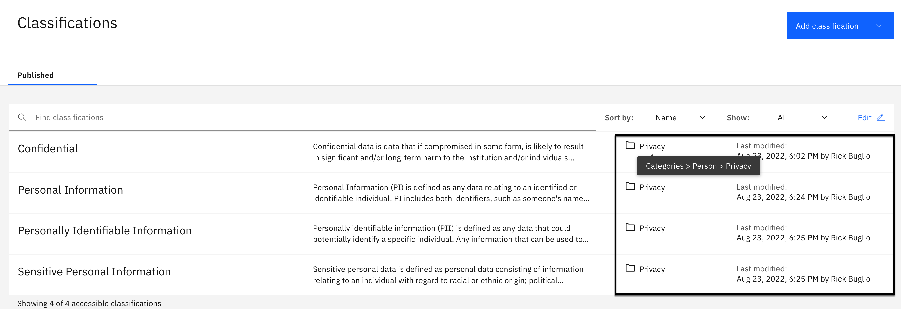

All of the **Classifications** should now be displayed as residing in the **Privacy** category instead of the **[uncategorized]** category. If you hover over each one with your mouse, you will see that the category is actually the **Person > Privacy** sub-category.

## 3. Create Data Classes

Watson Knowledge Catalog supplies **165** data classes out of the box. You will add additional data classes to support the analytics project use case. Unlike **Classifications** and other governance artifacts, Watson Knowledge Catalog has a dependency on data classes residing in the **[uncategorized]** category and only looks for and uses data classes in that category, so you will add the new data classes to the **[uncategorized]** category to ensure they can be used during the metadata enrichment data profiling process.

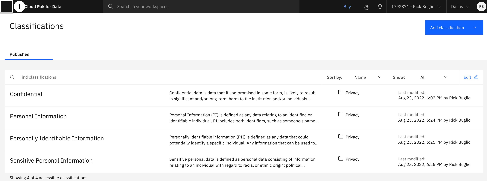

1. Select the **Navigation** menu (the 4 stacked horizontal lines in the upper left corner).

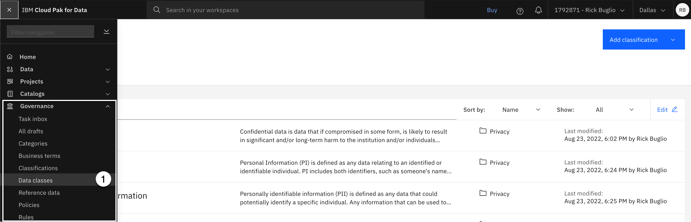

2. Select the **Governance > Data classes** menu.

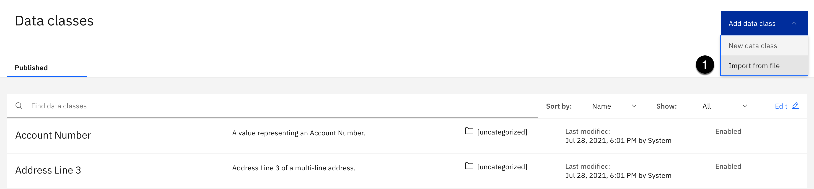

3. Using the **Add data class** dropdown, select Import from file.

4. Click the **Add file** button.

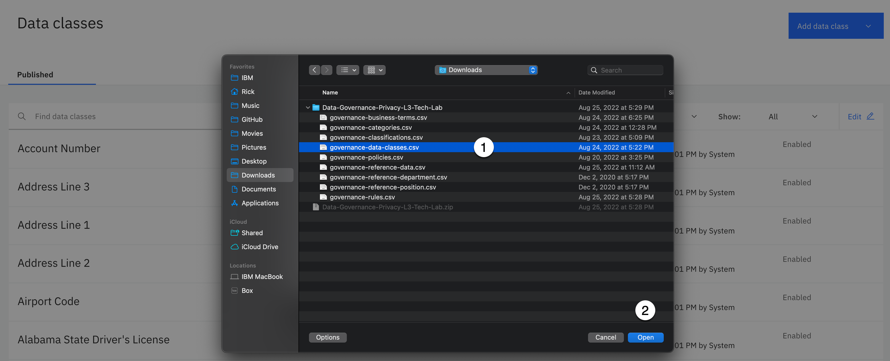

5. Select the **governance-data-classes.csv** file from your download location.

6. Click **Open**.

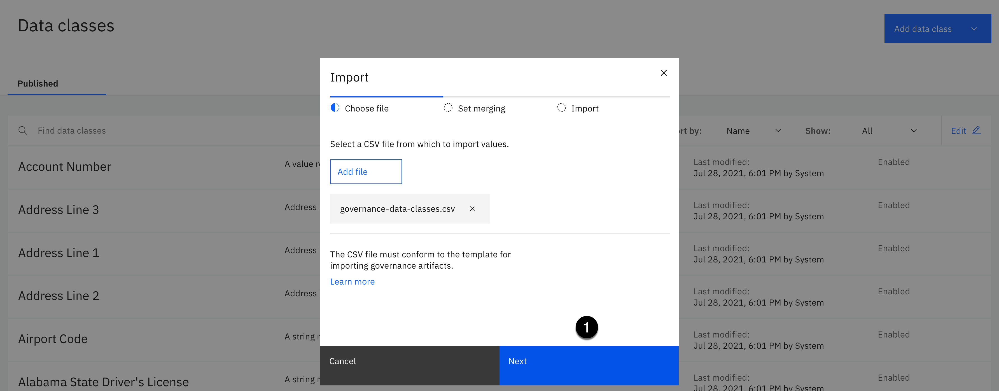

7. Click the **Next** button.

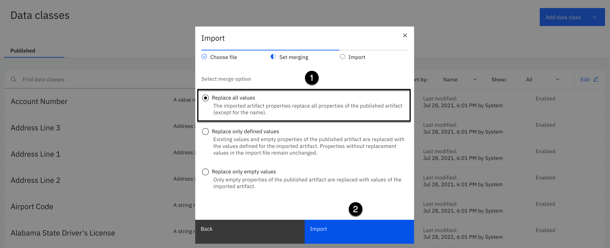

8. Select **Replace all values** merge option.

9. Click the **Import** button.

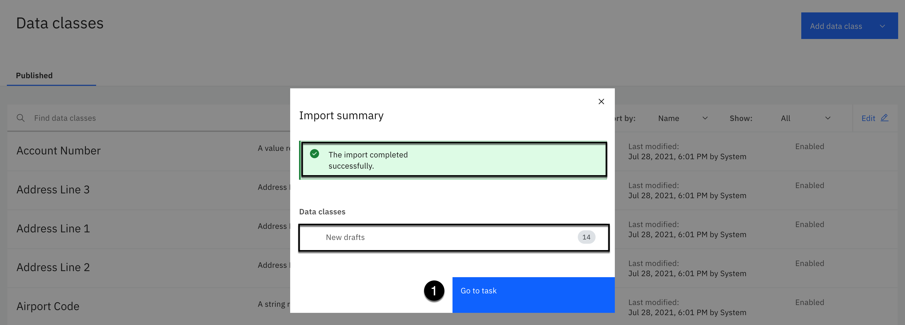

The import should complete successfully with 14 new data classes in draft mode.

10. Click the **Go to task** button.

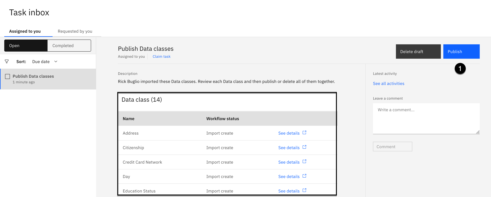

You should see 14 new data classes to publish.

11. Click the **Publish** button.

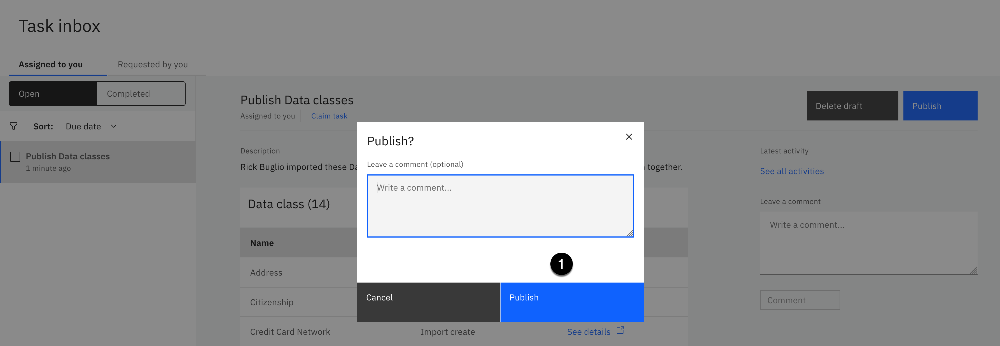

12. Click the **Publish** button again without entering a comment.

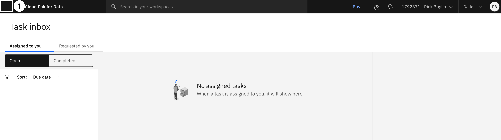

13. Select the **Navigation** menu (the 4 stacked horizontal lines in the upper left corner).

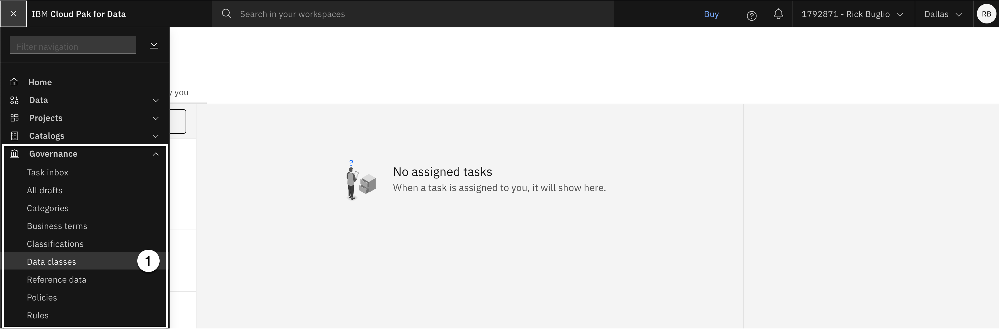

14. Select the **Governance > Data classes** menu.

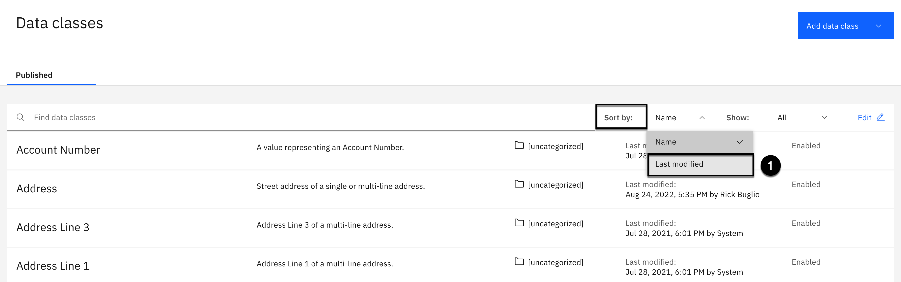

15. Using the **Sort by:** dropdown, select **Last modified**.

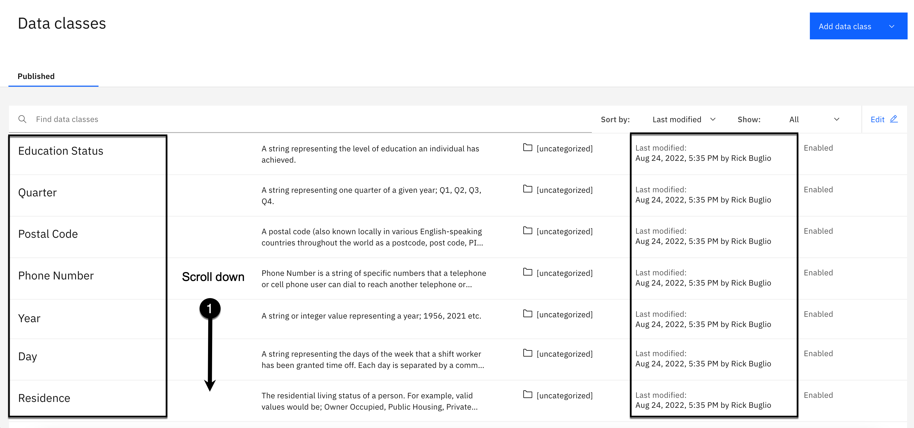

There should be 14 newly published data classes that are assigned to the **[uncategorized]** category with a **Last modified** date of today (the day you are doing this lab). The screen shot above displays the first 7 newly added data classes.

16. Scroll **down** to see the remaining 7 data classes.

## 4. Create Business Terms

Business terms have references to data classes and classifications, and are referenced in governance and data protection rules, so they need to be imported after data classes and classifications but before importing or creating governance or data protection rules. Business terms can also be related to other business terms so they must be imported in a specific order. The business terms in the CSV import file you will use are in the correct order to establish these relationships.

You will import and create **150** business terms. Using the import process for such a large volume of governance artifacts is a prime example of the type of productivity automation that is provided by **Watson Knowledge Catalog**. This is a huge time saver that runs in minutes. Doing this manually would take a data steward hours or days.

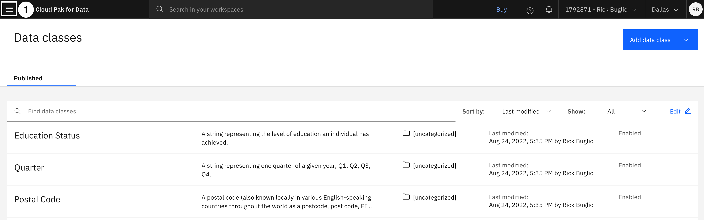

1. Select the **Navigation** menu (the 4 stacked horizontal lines in the upper left corner).

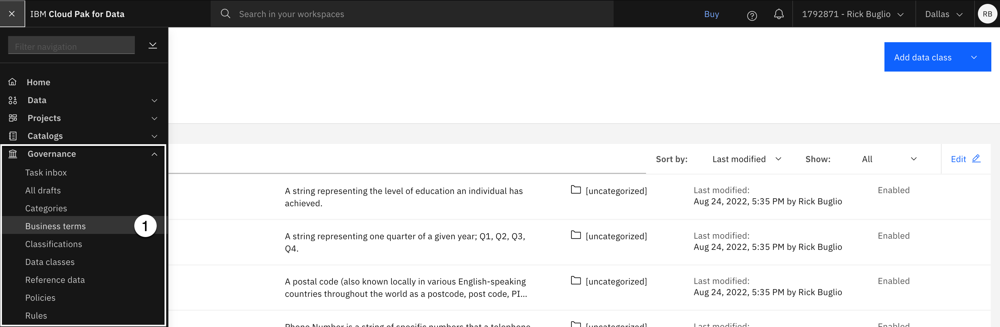

2. Select the **Governance > Business terms** menu.

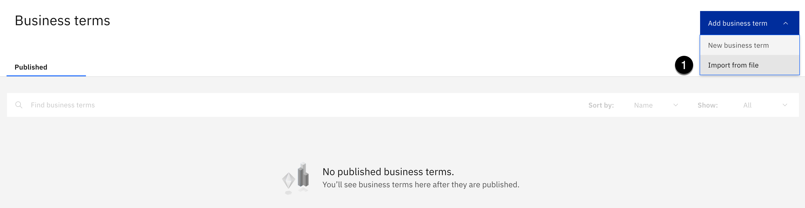

The environment used to create this lab, shown in the screen shot above, does not have any business terms. Your environment might look different. If you have business terms, scroll down to the bottom of the business term page, and make note of the number of business terms you have defined, so you can verify that you have successfully created the **150** business terms this step imports.

3. Using the **Add business term** dropdown, select **Import from file**.

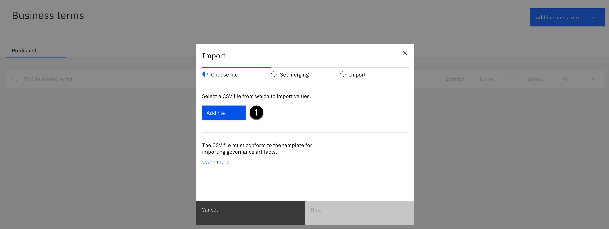

4. Click the **Add file** button.

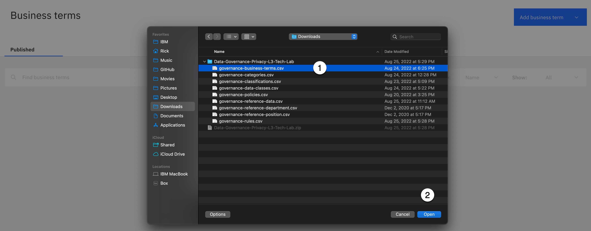

5. Select the **governance-business-terms.csv** file from the download location.

6. Click the **Open** button.

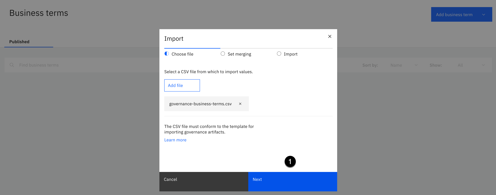

7. Click the **Next** button.


8. Select **Replace all values** as the merge option.

9. Click the **Import** button.


The import should complete successfully with 150 new business terms in draft mode.

10. Click the **Go to task** button.


You should see 150 new business terms to publish.

11. Click the **Publish** button.


12. Click the **Publish** button again without entering a comment.


13. Sometimes it takes more than one try to publish. If you are prompted to retry the publish process:

    a. Click the **Retry publish** button.


    b. Click the **Retry publish** button again to confirm the publish retry.


    **Note:** An error message box may appear. You can ignore it. This is a known issue when publishing governance artifacts.

    c. Click the **X** on the error message box to close it.
    
    d. Select the **Navigation** menu (the 4 stacked horizontal lines in the upper left corner).


14. Select **Governance > Business terms**.


15. Scroll **down** to the bottom of the business term page.

You should see **150** accessible (Published) business terms. **Note:** If you already had business terms published in your environment, your number will be different. Refer back to the number you were instructed to make a note of, and add **150** to that number to verify your total accessible business terms.

16. Click the **Return to Top** button to get back to the top of the page.

**Note:** You will see the **Return to Top** button on pages that have large amounts of artifacts as a quick means to return to the top of the page without having to scroll.

## 5. Create Reference Data

Reference data sets provide logical groupings of code values (reference data values), such as department codes and gender codes. These codes are sets of allowed values that are associated with data fields and can be assigned to business terms. Which is why they need to be created after business terms are created.

You create reference data sets so that enterprise standards can be accessed centrally by users or by consuming applications through APIs. Reference data sets can also be used to provide the matching pattern for data classes, allowing data fields to be automatically classified through data profiling and discovery. These data classes can then be used in data quality analysis to evaluate the quality and consistency of the values in data columns. Which is why you create data classes before you create reference data.

In this section, you will create the **Reference data** sets for the **Department** and **Position** reference data sets with their corresponding data values. The reference data import process **does not** provide the means to supply the reference data values, or a CSV file that contains the reference data values, but you will be able to load the data values using the **CSV** files supplied after they are imported.


1. Select the **Navigation** menu (the 4 stacked horizontal lines in the upper left corner).


2. Select the **Governance > Reference data** menu.

### Import and Create Reference Data Sets

In this step, you will import and create the reference data sets with information about them: **Name**, **Description**, **Tags**, and **Related business terms**.


**Notice** that Watson Knowledge Catalog has predefined two reference data sets that reside in the **Locations** category. These reference data sets provide the physical location and sovereign location that you select when you are designing data location rules to move data from one location to another. Data location rules are in the **experimental** stage so you will not be using these reference data sets in this lab.

1. Using the **Add reference data set** dropdown, select **Import from file**.


2. Click the **Add file** button.


3. Select the **governance-reference-data.csv** file from the download location.

4. Click the **Open** button.


5. Click the **Next** button.


6. Select **Replace all values** as the merge option.

7. Click the **Import** button.

The import should complete successfully with 2 new reference data drafts.

8. Click the **Go to task** button.


You should see 2 reference data sets to publish.

9. Click the **Publish** button.


10. Click the **Publish** button again without entering a comment.

Sometimes it takes more than one try to publish. If you are prompted to retry the publish process:

    a. Click the **Retry publish** button.


    b. Click the **Retry publish** button again to confirm the publish retry.


    **Note:** An error message box may appear. You can ignore it. This is a known issue when publishing governance artifacts.

    c. Click the **X** on the error message box to close it.
    
    d. Select the **Navigation** menu (the 4 stacked horizontal lines in the upper left corner).


11. Select **Governance > Reference data**.


You should see the 2 newly created reference data sets: **Department Lookup** and **Position Lookup** that are assigned to the **Employee** category.

### Upload Department Lookup Data Values

You will now load the data values for the **Department Lookup** reference data set using the **governance-reference-department.csv** files supplied in the lab zip file.


1. Click the **Department Lookup** reference data set in the list.


2. Click the reference data **Task** dropdown (looks like three horizontal dots ...).

3. Select **Upload file** from the list of tasks.


4. Click the **Browse for a file here or browse for a file to upload** link.


5. Select the **governance-reference-department.csv** file from the download location.

6. Click the **Open** button.


7. Click the **Next** button.


**Note:** It should be selected by default, but make sure the **First row as column header** option is turned on.

8. For the **DEPARTMENT\_CODE** column on the left, using the **Select column** Target columns dropdown on the right, select **Code** from the list of values.

9. For the **DEPARTMENT\_EN** column on the left, using the **Select column** Target columns dropdown on the right, select **Value** from the list of values.

10. Select the **Next** button.


11. Click the **Save** button.


12. Click the **Publish** button.


13. Click the **Publish** button again without entering a comment.


When publishing is complete, you will see an informational message of: "**Draft preview** This artifact has a new published version."

14. Click the **Reload artifact** button to see the published version.


You should now be viewing the **Published** version.

15. Select the **Overview** tab.

**Notice** the related business term and tags that were added during the import process.

16. Click the **Reference data** breadcrumb to get back to the reference data home page.

### Upload Position Lookup Data Values

You will now load the data values for the **Position Lookup** reference data set using the **governance-reference-position.csv** files supplied in the lab zip file.


1. Click the **Position Lookup** reference data set in the list.


2. Click the reference data **Task** dropdown (looks like three horizontal dots ...).

3. Select **Upload file** from the list of tasks.


4. Click the **Browse for a file here or browse for a file to upload** link.

5. Click the **Open** button.


6. Select the **governance-reference-position.csv** file from the download location.

7. Click the **Open** button.


8. Click the **Next** button.


**Note:** It should be selected by default, but make sure the **First row as column header** option is turned on.

9. For the **POSITION\_CODE** column on the left, using the **Select column** Target columns dropdown on the right, select **Code** from the list of values.

10. For the **POSITION\_EN** column on the left, using the **Select column** Target columns dropdown on the right, select **Value** from the list of values.

11. Select the **Next** button.


12. Click the **Save** button.


13. Click the **Publish** button.


14. Click the **Publish** button again without entering a comment.


When publishing is complete, you will see an informational message of: "**Draft preview** This artifact has a new published version."

15. Click the **Reload artifact** button to see the published version.


You should now be viewing the **Published** version.

16. Select the **Overview** tab.

**Notice** the related business term and the tag that was added during the import process.

## 6. Create Governance Rules

Unlike data protection rules, governance rules are descriptive only rules and can't be enforced. A governance rule is a description of the criteria used to determine whether information assets are compliant with business objectives and provide the business definition of the required behavior or actions to be taken to implement a given governance policy or subject area such as information quality, retention, privacy, or regulatory compliance.

In this section, you will import and create **4** data governance rules related to information privacy and regulatory compliance to document the business requirements and actions that need to be taken to protect personal and sensitive information.


1. Select the **Navigation** menu (the 4 stacked horizontal lines in the upper left corner).


2. Select the **Governance > Rules** menu.


3. Using the **Add rule** dropdown, select **Import from file**.

4. Click the **Add file** button.


5. Select the **governance-rules.csv** file from the download location.

6. Click the **Open** button.


7. Click the **Next** button.


8. Select the **Replace all values** merge option.

9. Click the **Import** button.


The import should complete successfully with 4 new Governance rule drafts.

10. Click the **Go to task** button.


11. Click the **Publish** button.

12. Click the **Publish** again without entering a comment.

13. Select the **Navigation** menu (the 4 stacked horizontal lines in the upper left corner).


14. Select the **Governance > Rules** menu.


You should see **4** published Governance rules with names that start with **All**.

## 7. Create Data Protection Rules

Data protection rules dynamically control access to data in governed catalogs, and under some conditions, in projects and Data virtualization. Data protection rules are automatically enforced when a catalog member attempts to view or act on a data asset in a governed catalog to prevent unauthorized users from accessing sensitive data. However, if the user who is trying to access the asset is the owner of the asset (by default, the user who created the asset), then access is always granted.

You will create **3** data protection rules that are enforced based on the data class assigned to columns of data assets. The rules will dynamically mask data values for data assets residing in governed catalogs, projects (if the data asset was added from a governed catalog), and virtualized data (if the data protection option is enabled) for the following sensitive information:

* Email Address
* Phone Number
* US Social Security Number

You will use the **Obfuscate** masking method, using some of the advanced data privacy options, to mask data classified as an **Email Address** or a **US Social Security Number**. This will introduce you to the new advanced data privacy capabilities, and demonstrate how the obfuscation masking method maintains the original format of the data, and consistently replaces the original value with fictional values, every time it encounters the same value, to maintain referential integrity. The **3rd** rule will use the **Redaction** method to protect data classified as a **Phone Number**.

**Note:** Even though this lab has you specify advanced data privacy options for two of the data protection rules you create, the **Lite** service plan of **Watson Knowledge Catalog** does not support the use of these advanced options. The instructions that are provided will give you the knowledge on how to use them, but they will be **ignored** when the data is masked. The obfuscation method will mask the data using the standard means for data classified as an **Email Address** or a **US Social Security Numbers** without using the advanced options that are specified.

### Create the **Protect Email Addresses** Rule

In this step, you will create a data protection rule to mask data classified as an **Email Address**. You will use the **Obfuscate** masking method, using some of the advanced data privacy options that are specific to an email address.


1. Using the **Add rule** dropdown, select **New rule**.

2. Select **Data protection rule**.

3. Select the **Next** button.

4. Copy the text below and paste it into the **Name** field:

<CopyText text="Protect Email Addresses"/>

5. Copy the text below and paste it into the **Business definition** field:

<CopyText text="Protect all email addresses using the data privacy advanced masking method."/>

Specify the rule **Criteria** for **Condition 1** as follows:

6. Using the **If** statement dropdown on the left, select **Data class**.

7. Using the **If** statement dropdown on the right, select **contains any**.

8. Copy the text below and paste it into the **Data class** field:

<CopyText text="Email Address"/>

9. Select **Email Address** from the data class list that appears. It should be the first entry in the list.


Specify the rule **Action** as follows:

10. Using the **then** statement **Action** dropdown on the left, select **mask columns**.

11. Using the **then** statement **in columns containing** dropdown on the right, select **Data class**.

12. The **Email Address** data class will automatically be filled in for you.

13. Select **Obfuscate** as the masking method in the **Select masking method** section.

14. Scroll **down** to see the **Advanced masking options** but **Do not Click Create!**.

Specify the rule **Advanced masking options** as follows:

15. Select the checkbox next to **Enable advanced masking options**.

16. Using the **Obfuscate method** dropdown, select **Preserve format**.

17. Select **Generate user name** for the **Username format** option.

18. Select **Original** for the **Domain name** option.

19. Select **Irreversible masking** for the **Reversibility** option.

20. Select **Repeatable** for the **Consistency** option.

21. Select **Input validation** for the **Input Validation** option.

22. Select the **On** position to turn on the **Auto refresh preview**.

23. Click the **Create** button.


You should see a **Successfully created!** message and see the new rule created.

24. Select the **Rules** breadcrumb in the upper left corner to return to Rules main page.

### Create the **Protect Phone Numbers** Rule

In this step, you will create a data protection rule to mask data classified as a **Phone Number** using the **Redaction** masking method. Masking phone numbers is challenging because you have to take into consideration whether they are United States or international phone numbers. If you are confident, and sure of their format, you can create an obfuscation data protection rule to preserve their format and replace the original value with a fictional value. If not, which is the case for this lab, the redaction method is the better choice because the format does not matter. The redaction masking method just replaces the existing values with a set of characters you designate.

**Note:** The **Obfuscate** masking method is unique to a single attribute type because it is dependent on the specific format of the content, so you have to create a separate rule for every attribute type. The **Redaction** and **Substitute** masking methods can mask data for multiple attribute types using the same rule, so you could create one master redaction rule and redact one to many attribute types using the same rule.

1. Using the **Add rule** dropdown, select **New rule**.

2. Select **Data protection rule**.

3. Select the **Next** button.


4. Copy the text below and paste it into the **Name** field:

<CopyText text="Protect Phone Numbers"/>

5. Copy the text below and paste it into the **Business definition** field:

<CopyText text="Protect all phone numbers using the redaction data privacy masking method."/>

Specify the rule **Criteria** for **Condition 1** as follows:

6. Using the **If** statement dropdown on the left, select **Data class**.

7. Using the **If** statement dropdown on the right, select **contains any**.

8. Copy the text below and paste it into the **Data class** field:

<CopyText text="Phone Number"/>

Select **Phone Number** from the data class list that appears. It should be the first entry in the list.


Specify the rule **Action** as follows:

9. Using the **then** statement **Action** dropdown on the left, select **mask columns**.

10. Using the **then** statement **in columns containing** dropdown on the right, select **Data class**.

11. The **Phone Number** data class will automatically be filled in for you.

12. Select **Redaction** as the masking method in the **Select masking method** section.

13. Scroll **down** to see the **Advanced masking options** but **Do not Click Create**.


Notice that there are no **Advanced masking options** available when using the **Redaction** masking method for the **Phone Number** data class. This is not one of the advanced data privacy supported data classes.

14. Click the **Create** button.


You should see a **Successfully created!** message and see the new rule created.

15. Select the **Rules** breadcrumb in the upper left corner to return to Rules main page.

### Create the **Protect US Social Security Numbers** Rule

In this step, you will create a data protection rule to mask data classified as a **US Social Security Number**. You will use the **Obfuscate** masking method, using some of the advanced data privacy options that are specific to a United States social security number.

1. Using the **Add rule** dropdown, select **New rule**.

2. Select **Data protection rule**.

3. Select the **Next** button.


4. Copy the text below and paste it into the **Name** field:

<CopyText text="Protect US Social Security Numbers"/>

5. Copy the text below and paste it into the **Business definition** field:

<CopyText text="Protect all US social security numbers using the data privacy advanced masking method."/>

Specify the rule **Criteria** for **Condition 1** as follows:

6. Using the **If** statement dropdown on the left, select **Data class**.

7. Using the **If** statement dropdown on the right, select **contains any**.

8. Copy the text below and paste it into the **Data class** field:

<CopyText text="US Social Security Number"/>

Select **US Social Security Number** from the data class list that appears. It should be the first entry in the list.


Specify the rule **Action** as follows:

9. Using the **then** statement **Action** dropdown on the left, select **mask columns**.

10. Using the **then** statement **in columns containing** dropdown on the right, select **Data class**.

11. The **US Social Security Number** data class will automatically be filled in for you.

12. Select **Obfuscate** as the masking method in the **Select masking method** section.

13. Scroll **down** to see the **Advanced masking options** but **Do not Click Create!**.


Specify the rule **Advanced masking options** as follows:

14. Select the checkbox next to **Enable advanced masking options**.

15. Using the **Obfuscate method** dropdown, select **Preserve format**.

16. Select **Irreversible masking** for the **Reversibility** option.

17. Select **Repeatable** for the **Consistency** option.

18. Select **No validation** for the **Input Validation** option.

19. Select the **On** position to turn on the **Auto refresh preview**.

20. Click the **Create** button.


You should see a **Successfully created!** message and see the new rule created.

21. Select the **Rules** breadcrumb in the upper left corner to return to Rules main page.


You should now see the **3** new data protection rules with a total of 7 rules: **4** governance rules and **3** data protection rules. You have adhered to the governance rules defined by the business to protect all National Identifiers, Email Addresses and Phone Numbers.

## 8. Create Policies

The policies are created last because they have data protection and governance rules assigned to them. Therefore, the rules have to be created first before the policy so the rules can be assigned to policies. This lab and use case only has one policy but you will still continue to use the import process and then assign the rules to the policy.


1. Select the **Navigation** menu (the 4 stacked horizontal lines in the upper left corner).


2. Select the **Governance > Policies** menu.


**Note:** Your environment may look different than the screen shot above. This environment does not have any policies defined.

3. Using the **Add policy** dropdown, select **Import from file**.


4. Click the **Add file** button.


5. Select the **governance-policies.csv** file from the download location.

6. Click the **Open** button.


7. Click the **Next** button.


8. Select the **Replace all values** merge option.

9. Click the **Import** button.


10. Click the **Go to task** button.


11. Click the **Publish** button.

12. Click the **Publish** again without entering a comment.


13. Select the **Navigation** menu (the 4 stacked horizontal lines in the upper left corner).


14. Select the **Governance > Policies** menu.


You should see **1** published policy named **Protection of Sensitive Personal Information**.

### Assign Data Protection Rules to the Policy

In this step, you will assign all of the data protection rules you just created to the policy so they are cross-referenced in the business glossary, and so everyone in the organization understands the data protection rules that are enforcing the requirements of the governance policy.


1. Click the **Protection of Sensitive Personal Information** policy.


2. Scroll down to the **Data protection rules** section.

3. Click the **Add data protection rules** button.


4. Select the checkbox next to the **Protect Email Addresses** rule.

5. Select the checkbox next to the **Protect Phone Numbers** rule.

6. Select the checkbox next to the **Protect US Social Security Numbers** rule.

7. Click the **Add** button.


8. Click the **Publish** button.


9. Click the **Publish** again without entering a comment.


10. Scroll **down** to the **Data protection rules** section.

All of the data protection rules you just created are now assigned to the policy.

