# 103: Curate the Data

Now that you have a well defined business glossary with a complete set of published governance artifacts, you are ready to begin the data curation process. Data curation is the process of discovering and adding data assets to a project or a catalog, enriching them by assigning classifications, data classes, and business terms, and analyzing and improving the quality of the data.

Curation can be a very labor intensive and time consuming process, and for a lot of organizations, it's mostly done manually where data assets are curated one at a time. Advanced data curation, which is included with **Watson Knowledge Catalog**, and what you will use in this lab, is primarily an automated process where many of the curation tasks are completed automatically for multiple data assets simultaneously.

Depending on the curation tasks you want to perform, you need to work on the data assets in a project, a catalog, or both before the data is ready for use by data consumers. In this lab, you will use both. The majority of the data curation tasks will be done in a project before you publish them to a governed catalog. Once they are published to the catalog, you will do some additional enrichment tasks in the catalog, that are not available from a project. In order to accomplish this, you will perform the following data curation steps.

## 1. Create the Project

In this section, you will create the project that you will use to create and execute the automated **Metadata Import** and **Enrichment** processes to discover, add, and curate the data assets needed by the analytics project team before they are published to the governed **Business** catalog.

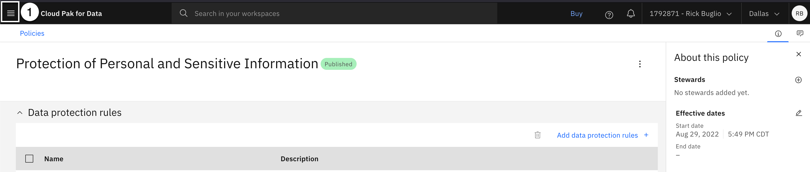

1. Select the **Navigation** menu (the 4 stacked horizontal lines in the upper left corner).

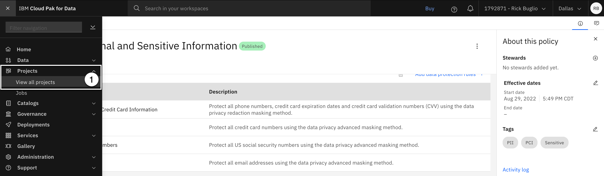

2. Select the **Projects > View all projects** menu.

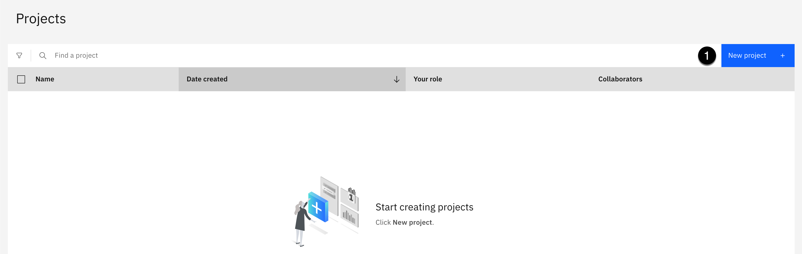

**Note:** Your **Projects** screen may look different than the screen shot above. You might already have projects in your environment. This environment does not have any projects. It is using a newly deployed **Watson Studio** service.

3. Click the **New project+** button.

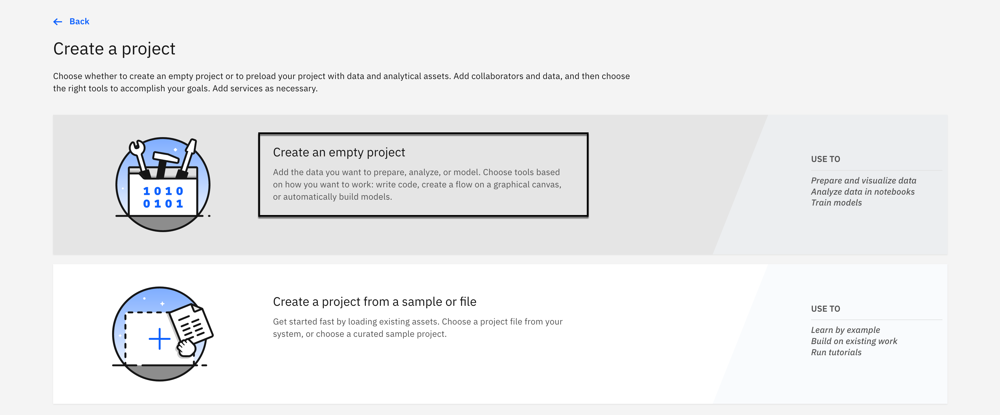

4. Click the **Create an empty project** option.

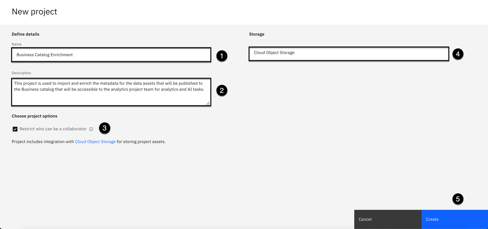

5. Copy the text below and paste it into the **Name** field:

<CopyText text="Business Catalog Enrichment"/>

6. Copy the text below and paste it into the **Description** field:

<CopyText text="This project is used to import and enrich the metadata for the data assets that will be published to the Business catalog that will be accessible to the analytics project team for analytics and AI tasks."/>

7. Select the checkbox to **Restrict who can be a collaborator** (It should be selected by default).

8. Select a Cloud Object **Storage** instance if one is not automatically selected for you.

9. Click the **Create** button.

You will see a dialog box with the message that the **Business Catalog Enrichment project is being created...**

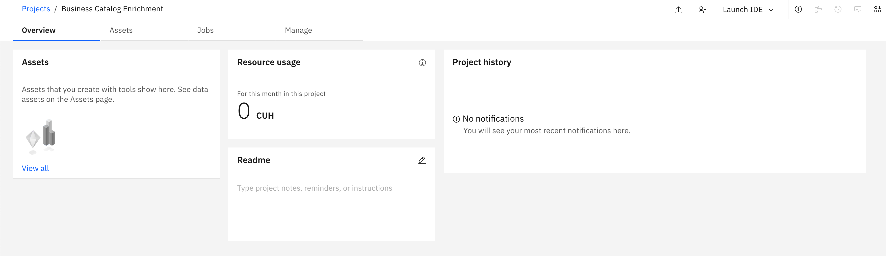

When the project creation is complete, you will be brought into the **Overview** section of the new project.

## 2. Add the Connections

The first step is to add the connections to the project that will be used by **Metadata Import**. These are **Platform connections**, so make sure you have created all of the **Platform connections** you were instructed to create in the **Data fabric lab** [Getting started](https://vest.buildlab.cloud/en/wkc/getting-started) section.

### Add the Object Storage Connection
---

The **Object Storage** data source connections contains the **Warehouse** data that was requested by the analytics project team.

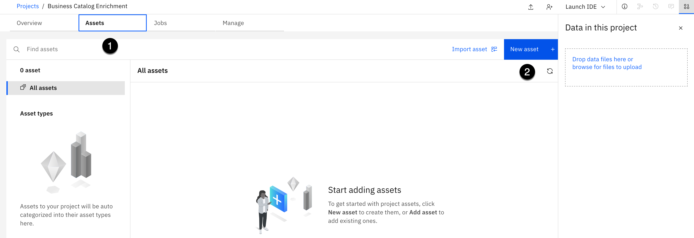

1. Select the **Assets** tab.

2. Click the **New Asset +** button.

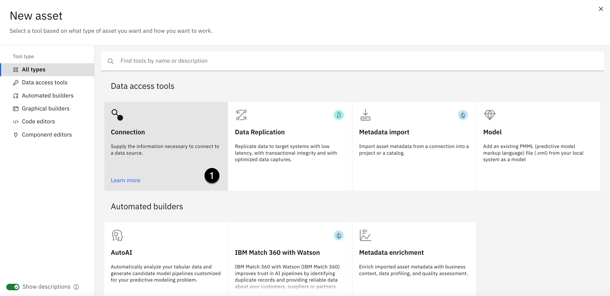

3. Select the **Connection** tile in the Data access tools section.

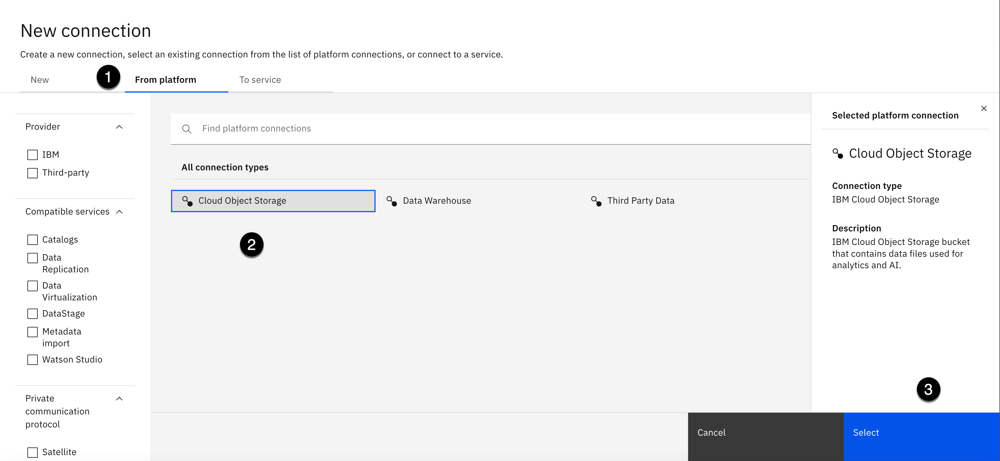

4. Select the **From platform** tab.

5. Select the **Cloud Object Storage** connection.

6. Click the **Select** button.

7. Click the **Create** button.

### Add the Data Warehouse Connection
---

The **Data Warehouse** data source connections contains the **Employee** data that was requested by the analytics project team.

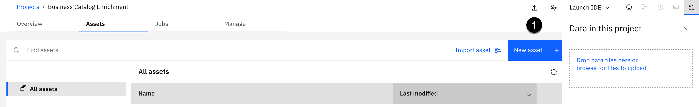

1. Click the **New Asset +** button.

2. Select the **Connection** tile in the Data access tools section.

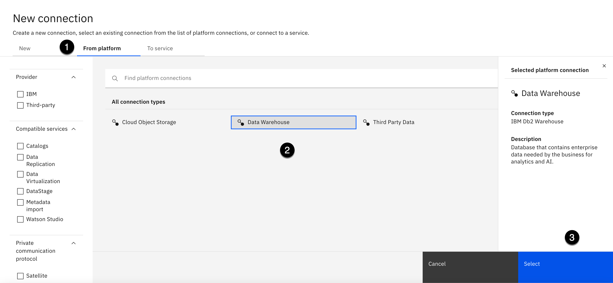

3. Select the **From platform** tab.

4. Select the **Data Warehouse** connection.

5. Click the **Select** button.

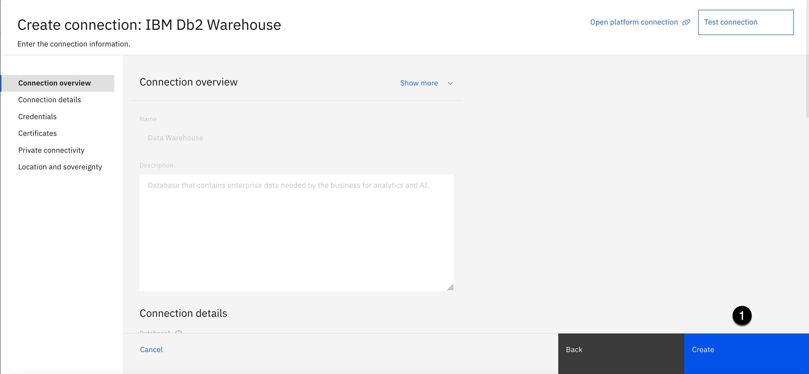

6. Click the **Create** button.

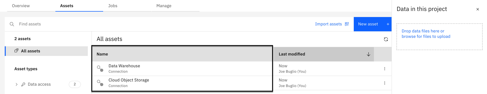

You should now see the two new connections in the project.

## 3. Import the Data

This section uses the automated **Metadata Import** process to quickly, and easily connect to data source connections, discover and select the data assets you are interested in, and add them as data assets into a project or catalog. You will import the data assets into the project you just created, and then use them as input into the **Metadata Enrichment** process. You will discover and import **4** data assets to fulfill the data requested by the analytics project team that reside across the **2** disparate data source connections that you just created.

### Import the Data Warehouse Data
---

In this step, you will create the **Metadata Import** to import the **Employee** data asset from the **Data Warehouse** connection into the project.

1. Click the **New Asset +** button.

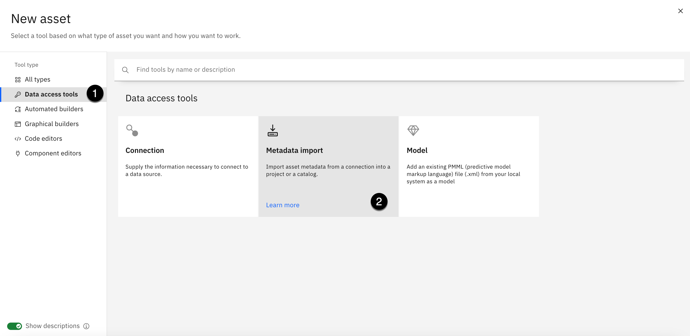

2. Select the **Data access tools** category from the Tools menu on the left.

3. Select the **Metadata import** tile in the Data access tools section.

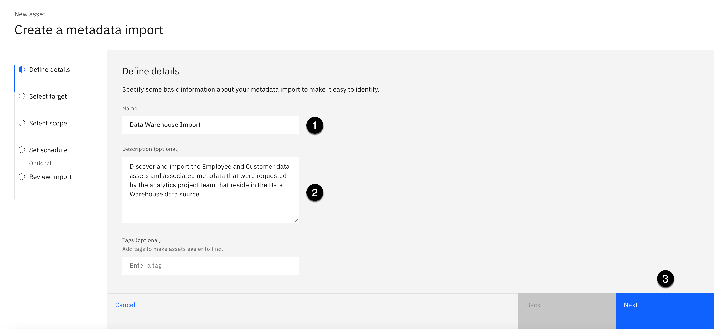

4. Copy the text below and paste it into the **Name** field:

<CopyText text="Data Warehouse Import"/>

5. Copy the text below and paste it into the **Description** field:

<CopyText text="Discover and import the Employee data asset and associated metadata that were requested by the analytics project team that reside in the Data Warehouse data source."/>
    
**Do not** enter any tags. These are metadata import tags, not data asset tags. The import automatically adds the data asset's schema, or folder name, as a tag during the import process.

6. Click the **Next** button.

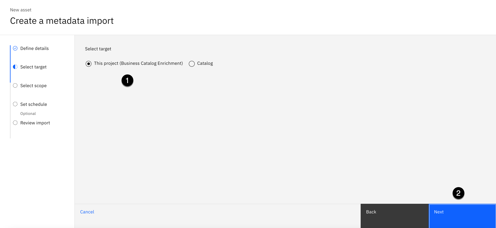

7. Select **This project (Business Catalog Enrichment)** as the target (it should be selected by default).

8. Click the **Next** button.

9. Click the **Select connection** button.

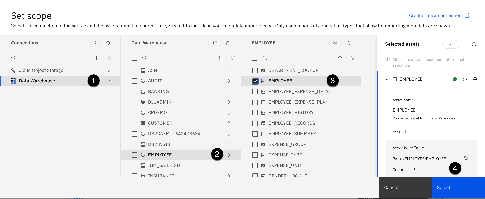

10. Select the **Data Warehouse** connection from the Connections list on the left.

11. Select the **Arrow** on the **EMPLOYEE** schema. **Do not select the checkbox** next to the **EMPLOYEE** schema. Doing so will select all tables in the schema.

12. Select the **EMPLOYEE** table from the list.

13. Click the **Select** button.

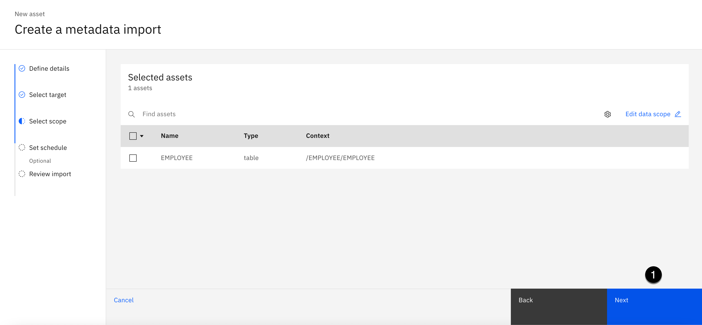

14. Click the **Next** button.

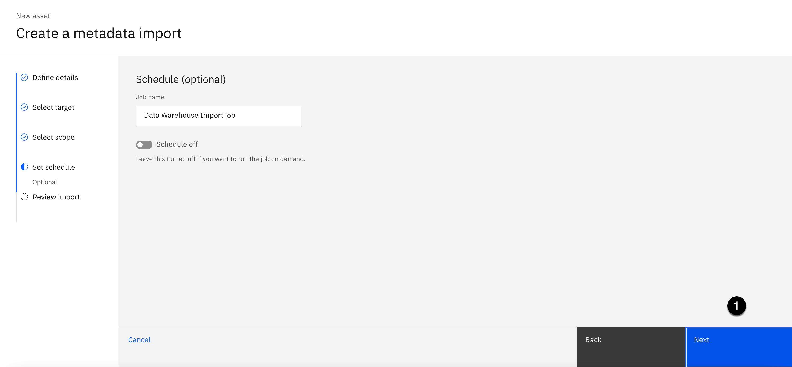

Take the default **Job name** and leave scheduling turned off.

15. Click the **Next** button.

Take the default **Advanced options** that are selected for the Update on reimport actions.

16. Click the **Next** button.

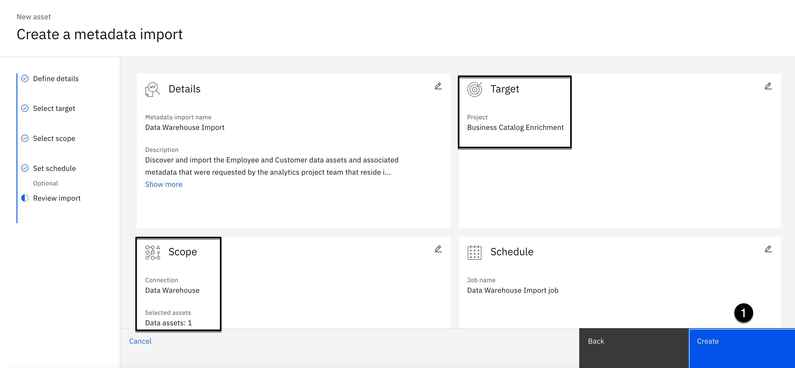

Take a minute to review the import before you create it. Your **Scope** is importing **1** data assets from the **Data Warehouse** connection into the **Business Catalog Enrichment** project as the Target.

17. Click the **Create** button.

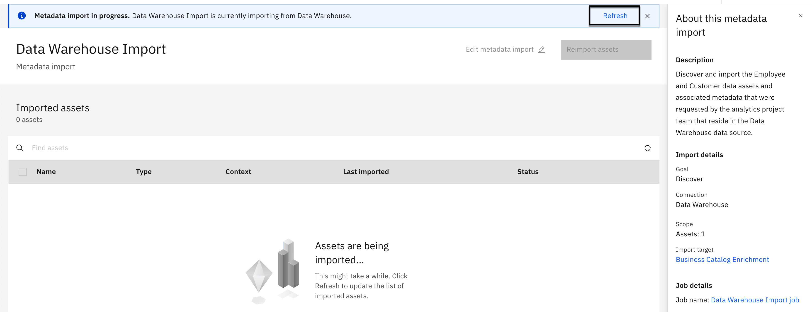

The import process should run quickly. In a few seconds, you should begin seeing the import process adding the data assets you selected to the Imported assets list. You can click on the **Refresh** button at the top of the page to update the results.

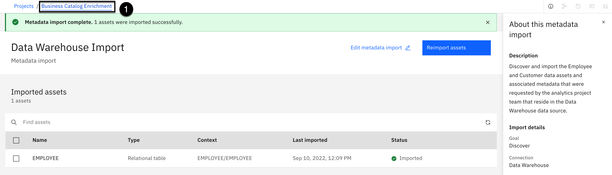

When the import is complete, you should see a message at the top of the page: **Metadata import complete. 1 assets were imported successfully**. The data asset will appear in the Imported assets list and is now added to the project.

18. Select the **Business Catalog Enrichment** project breadcrumb at the top of the page to get back to the project home page.

### Import the Object Storage Data
---

In this step, you will create the **Metadata Import** to import the **Warehouse** data assets from the **Cloud Object Storage** connection into the project.

1. Click the **New Asset +** button.

2. Select the **Data access tools** category from the Tools menu on the left.

3. Select the **Metadata import** tile in the Data access tools section.

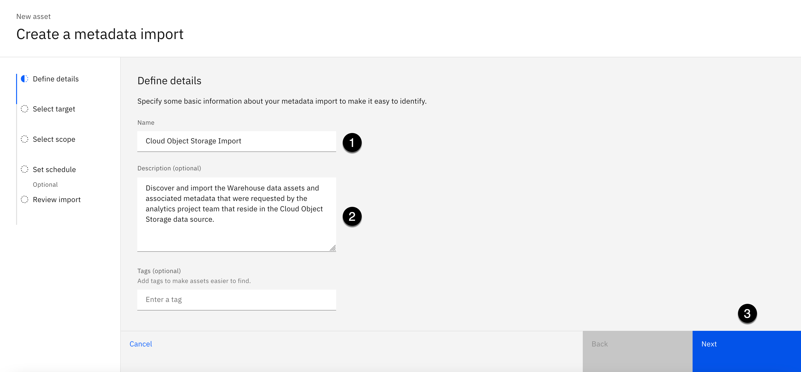

4. Copy the text below and paste it into the **Name** field:

<CopyText text="Cloud Object Storage Import"/>

5. Copy the text below and paste it into the **Description** field:

<CopyText text="Discover and import the Warehouse data assets and associated metadata that were requested by the analytics project team that reside in the Cloud Object Storage data source."/>
    
**Do not** enter any tags. These are metadata import tags, not data asset tags. The import automatically adds the data asset's schema, or folder name, as a tag during the import process.

6. Click the **Next** button.

7. Select **This project (Business Catalog Enrichment)** as the target (It should be selected by default).

8. Click the **Next** button.

9. Click the **Select connection** button.

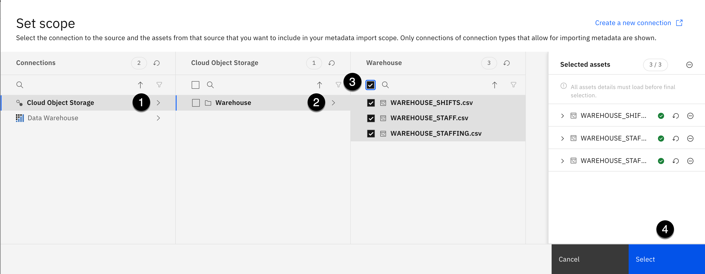

10. Select the **Cloud Object Storage** connection from the Connections list on the left.

11. Select the **Arrow** on the **WAREHOUSE** folder. **Do not select the checkbox** next to the **WAREHOUSE** folder. Doing so will select all files in the folder. This method shows you what files are in the folder so you can see exactly what will be imported.

12. Select the **high level** checkbox at the top of the **Warehouse** list to import all three files in the folder.

13. Click the **Select** button.

14. Click the **Next** button.

Take the default **Job name** and leave scheduling turned off.

15. Click the **Next** button.

Take the default **Advanced options** that are selected for the Update on reimport actions.

16. Click the **Next** button.

Take a minute to review the import before you create it. Your **Scope** is importing **3** data assets from the **Cloud Object Storage** connection into the **Business Catalog Enrichment** project as the Target.

17. Click the **Create** button.

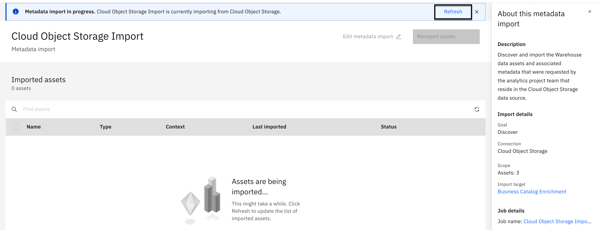

The import process should run quickly. In a few seconds, you should begin seeing the import process adding the data assets you selected to the Imported assets list. You can click on the **Refresh** button at the top of the page to update the results.

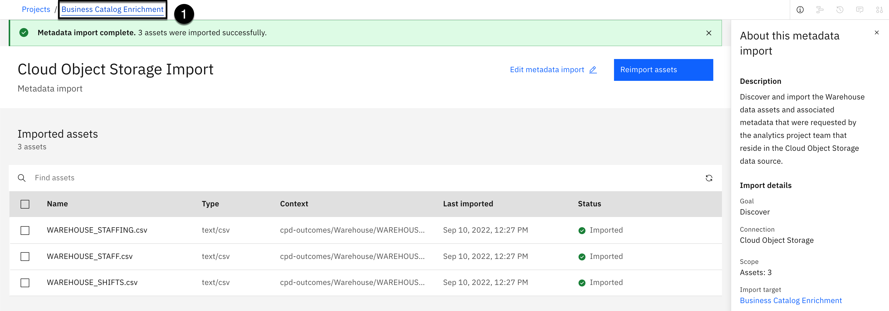

When the import is complete, you should see a message at the top of the page: **Metadata import complete. 3 assets were imported successfully**. The data assets will appear in the Imported assets list and are now added to the project.

18. Select the **Business Catalog Enrichment** breadcrumb at the top of the page to get back to the project home page.

## 4. Enrich the Data

This section uses the automated **Metadata Enrichment** process of a project, provided by **Watson Knowledge Catalog**, to enrich the data assets that were discovered and imported during the **Metadata Import** processes you just completed. Metadata imports can be used as input into **Metadata Enrichment** processes to automatically profile the data, analyze and assess data quality, and assign data classifications and business terms by leveraging governance artifacts defined in the business glossary.

This is where all the work that was done up front building out a complete, meaningful, and cross-referenced business glossary, to establish a business ready analytics foundation, pays dividends. Metadata enrichment can now leverage the data classes, and business terms, and automatically assign them, and make suggestions, during the metadata enrichment process. This saves organizations a tremendous amount of time and resources, by alleviating the manual effort that would have been involved to accomplish the same result.

1. Click the **New Asset +** button.

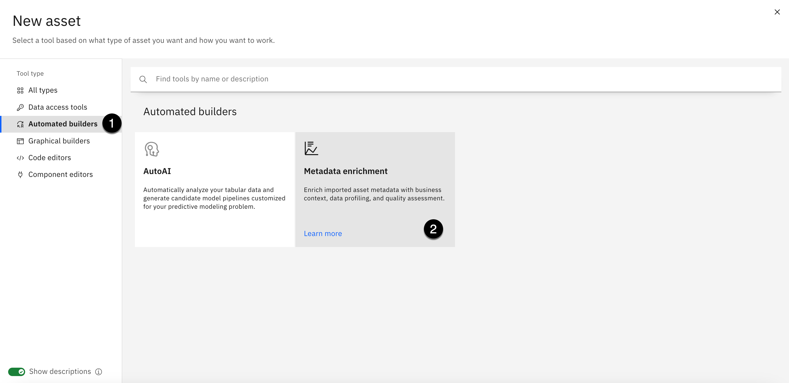

2. Select the **Automated builders** category from the Tools menu on the left.

3. Select the **Metadata Enrichment** tile in the Automated builders tools section.

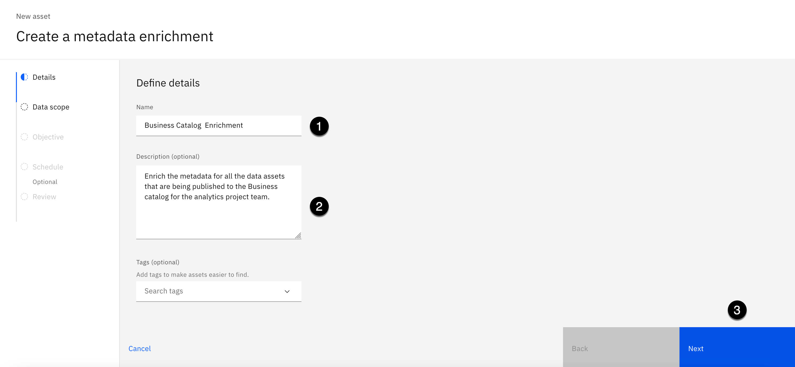

4. Copy the text below and paste it into the **Name** field:

<CopyText text="Business Catalog Enrichment"/>

5. Copy the text below and paste it into the **Description** field:

<CopyText text="Enrich the metadata for all the data assets that are being published to the Business catalog for the analytics project team."/>
    
**Do not** enter any tags. These are metadata enrichment tags, not data asset tags.

6. Click the **Next** button.

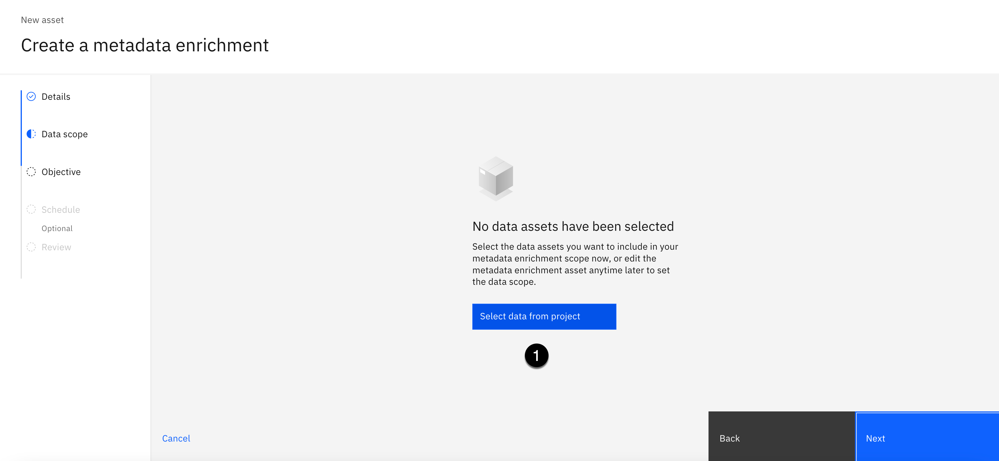

7. Click the **Select data from project** button.

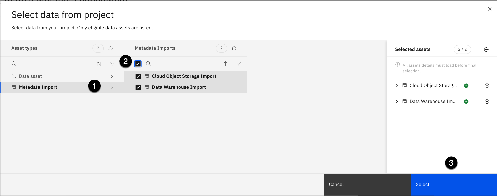

8. Select the **Metadata Import** from the Asset types list on the left.

9. Select the **high level** checkbox in the **Metadata Imports** section to select all the metadata imports you just completed.

10. Click the **Select** button.

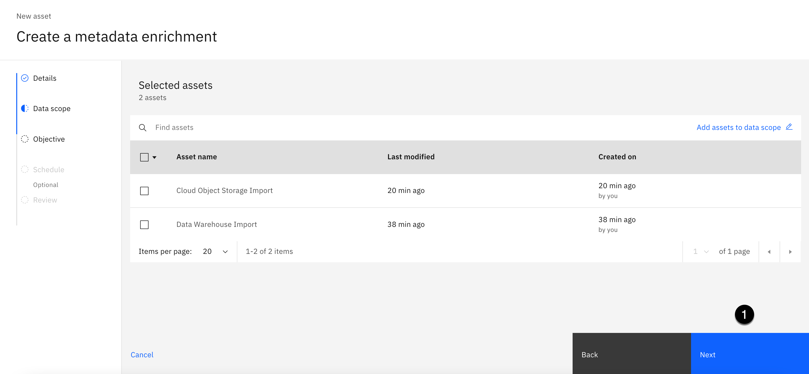

11. Click the **Next** button.

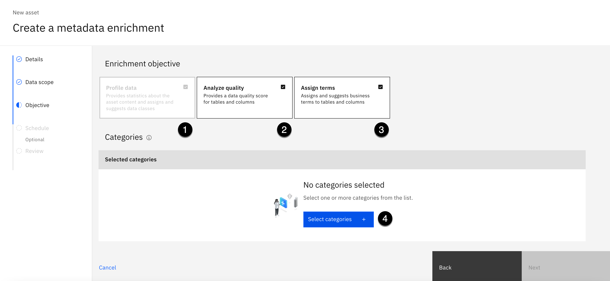

12. Select the checkbox for the **Profile data** Enrichment objective.

13. Select the checkbox for the **Analyze quality** Enrichment objective.

14. Select the checkbox for the **Assign terms** Enrichment objective.

15. Click the **Select categories +** button.

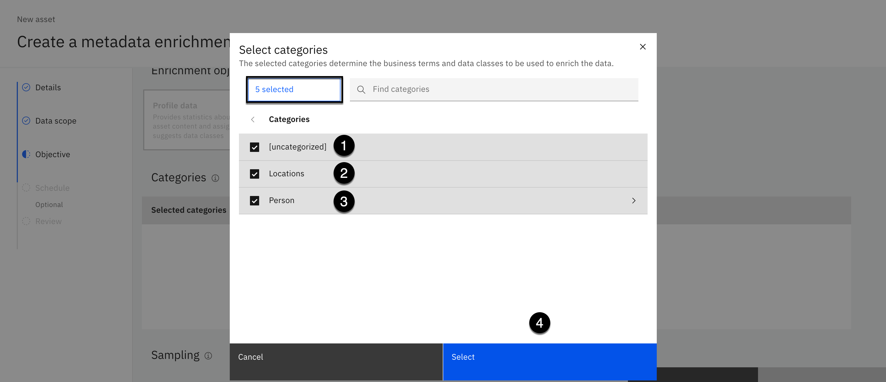

16. Select the checkbox next to the **\[uncategorized\]** category.

17. Select the checkbox next to the **Locations** category.

18. Select the checkbox next to the **Person** category.

**Notice:** that **5** categories have been selected even though you only selected **3**. This is the benefit of using sub-categories. The **Person** parent category was selected and it automatically included the **Employee** and **Privacy** sub-categories.

19. Click the **Select** button.

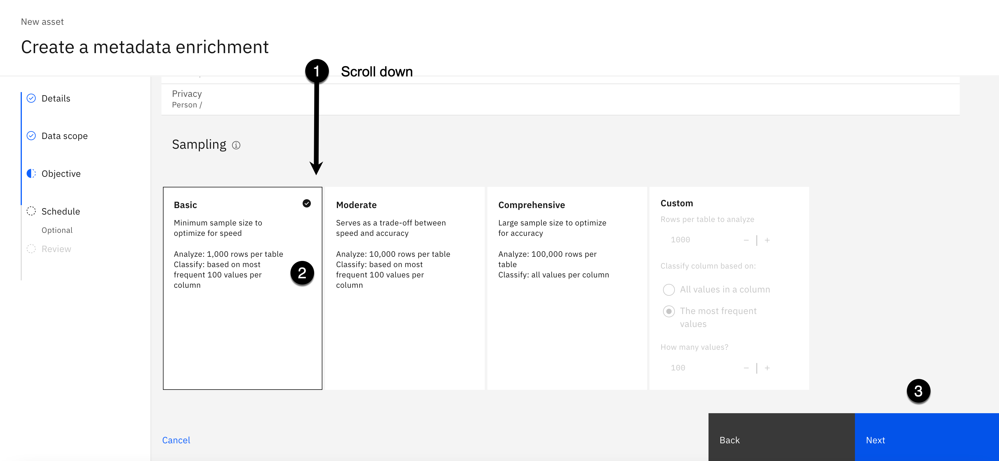

20. Scroll **down** to view the **Sampling** options.
    
You can choose one of the predefined sampling methods, or customize it based on your organization's requirements. For this lab, the **Basic** sampling method will suffice and execute quickly.
    
21. Select the **Basic** sampling method (It should be selected by default).
    
22. Click the **Next** button.

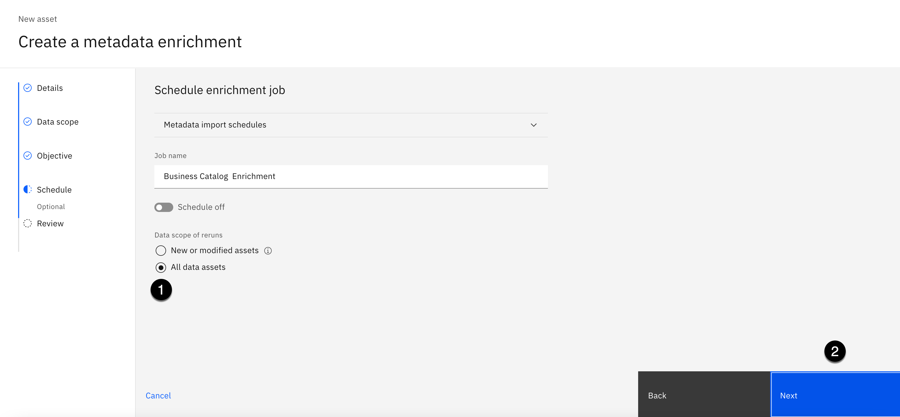

23. Select **All data assets** for the Data scope of reruns option (It should be selected by default).

24. Click the **Next** button.

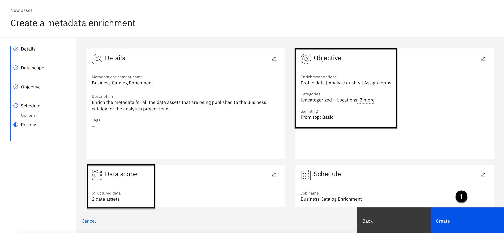

Take a minute to review the metadata enrichment before you create it. The **Data Scope** will be analyzing **2** data assets (these are the 2 metadata imports that contain the 4 data assets that you just created) with an enrichment **Objective** to **Profile data**, **Analyze quality** and **Assign terms** across **5 Categories** using the **Basic** sampling method.

25. Click the **Create** button.

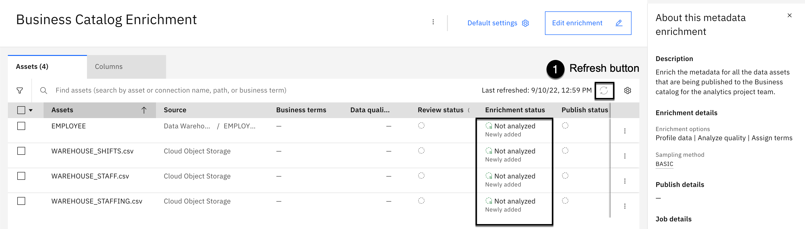

The enrichment process will take approximately 2 minutes to complete. The status will change from **Not analyzed** to **In progress** to **Finished**.

26. Select the **Refresh** button to update the status and monitor the progress.

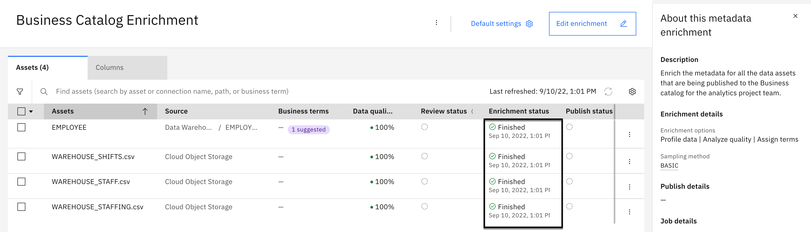

You will eventually get a message notifying you that the **Metadata enrichment completed**. Wait until the **Enrichment status** for all data assets have a status of **Finished**.

## 5. Review Enrichment Results

Now that the enrichment process is complete you can review the **Asset** and **Column** results. The **Metadata Enrichment** process automatically profiled all of the data assets, analyzed data quality at the data asset and column level, assigned and suggested business terms for all the data assets and columns, and assigned data classes for all columns of the data assets.

### Review Asset Results
---

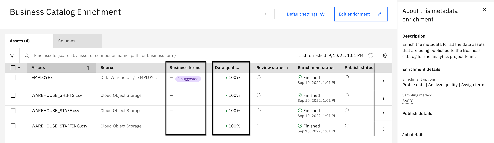

* **All** of the data assets have a data quality score of **100%**.

* No business terms were assigned at the **Asset** level, but the **EMPLOYEE** data assets has 1 suggestion.

This is expected behavior and not a concern at the asset level. It is more important to have business terms assigned at the column level. Especially if business terms are being used to trigger data protection rule actions. Business terms at the data asset level are primarily for informational purposes to notify users that data assets may contain personally identifiable or sensitive data, and to provide additional information about data asset content without users having to view the actual data. You will rectify the business term suggestions in the following [Rectify Asset Results](https://vest.buildlab.cloud/en/wkc/103#6-rectify-asset-results) step below.

**Notice** that data classes do not get assigned at the **Asset** level.

### Review Column Results
---

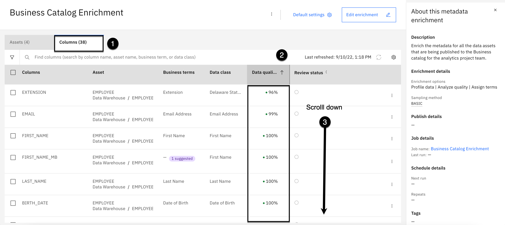

1. Select the **Columns** tab.
    
2. Click the **Data quality** column header to sort the columns in descending order (Arrow pointing up) until the **EXTENSION** column is at the top of the list.
    
* The data quality at the column level is excellent. The **EXTENSION** column has the lowest data quality score at **96%**, and the **EMAIL** column has a data quality score of **99%**. The remaining 36 columns have a data quality score of **100%**. You know this because you sorted them in descending order.

3. Scroll **down** the list of columns to review the data quality score for all the other columns.

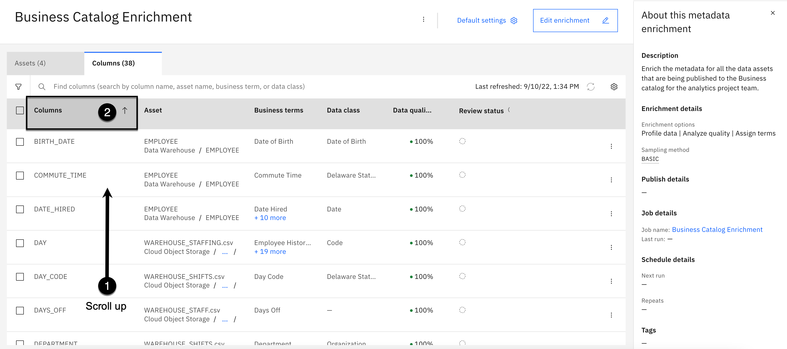

4. Scroll **up** to the first column at the top of the column list.

5. Click the **Columns** column header to sort the columns in ascending order (Arrows pointing up) until **BIRTH\_DATE** is the first column at the top.

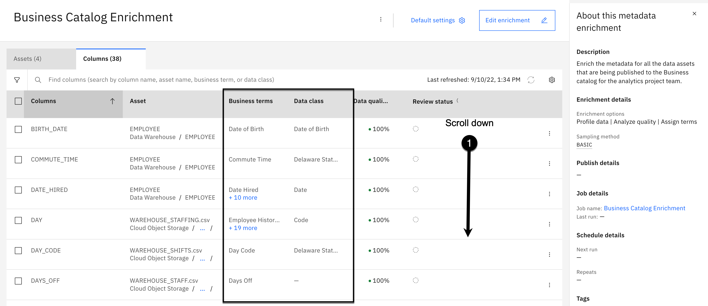

6. Scroll **down** the list of columns to review the following business term and data class observations:
    
* **32** of the 38 columns **(84%)** were assigned the **correct** business term.

* **4** columns have suggested business term assignments, leaving only the **FAX** column without a business term assignment, and the **DAY** column assigned an incorrect business term.

* The **4** columns that have suggested business terms are **correct**, raising the accuracy rate to **95%**, which is outstanding!

* Upon review of the business term suggestions, the suggestion confidence level is consistently at or above **75%**.

* **33** of the 38 columns were assigned a data class, but only **12** of those columns **(31%)** were assigned the **correct** data class, which is disappointing.

* The **EMAIL** and **SSN** columns, that are protected by data protection rules, that are based on data class, were assigned the correct data class.

* The **FAX** and **WORK\_PHONE** columns were **not** assigned a data class, which you will rectify, because they are phone numbers that are also protected by a data protection rule that is based on their data class.
    
This is valuable information for the data steward because it validates the accuracy and completeness of the business glossary. As was stated earlier, the more time and effort invested up front building out a well defined, and accurate business glossary, the better the outcomes will be during the metadata enrichment data curation process. Spending less time rectifying incorrect and missing metadata assignments, results in faster delivery of the data to those that need it when they need it.
    
The business term definitions in the business glossary are accurate. With a few modifications, the accuracy rate of the metadata enrichment business term assignment process could be improved to 100%. Data class assignment could be improved significantly by adding related business terms to more data classes. You added some new data classes, which have related business terms, but the majority of the columns were reliant on the 165 predefined data classes supplied by Watson Knowledge Catalog, which do not have related business terms.
    
## 6. Rectify Asset Results

In this step, you will rectify the missing **Asset** level business term assignments. Metadata enrichment considers suggested business terms as missing until one of the suggested business terms has been accepted.

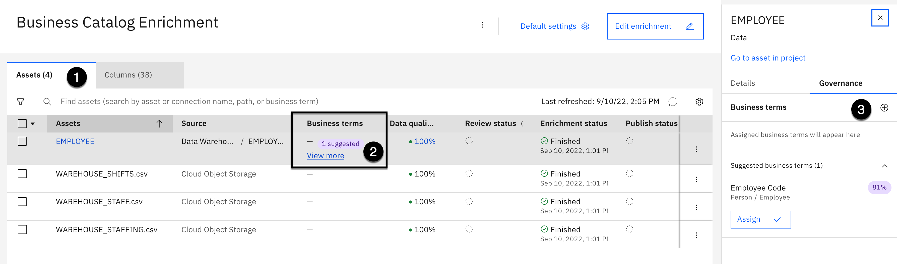

1. Select the **Assets** tab.

2. Hover over the **Business Terms** column of the **EMPLOYEE** asset, click the **View more** link that appears.

3. Click the **+** sign in the **Business terms** section of the **Governance** tab.

**Note:** Selecting the **View more** link automatically opens the **Governance** tab of the information panel on the right. This will happen every time you select the link for a business term or data class for any column.

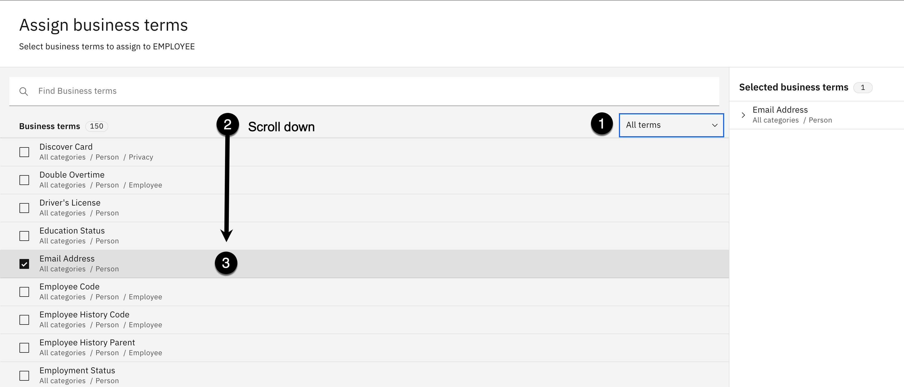

4. Using the **business term type** dropdown, select **All terms**.

5. Scroll **down** the list until you get to the **Email Address** business term.

6. Select the checkbox next to the **Email Address** business term. **Do not** click the **Assign** button until you are instructed.

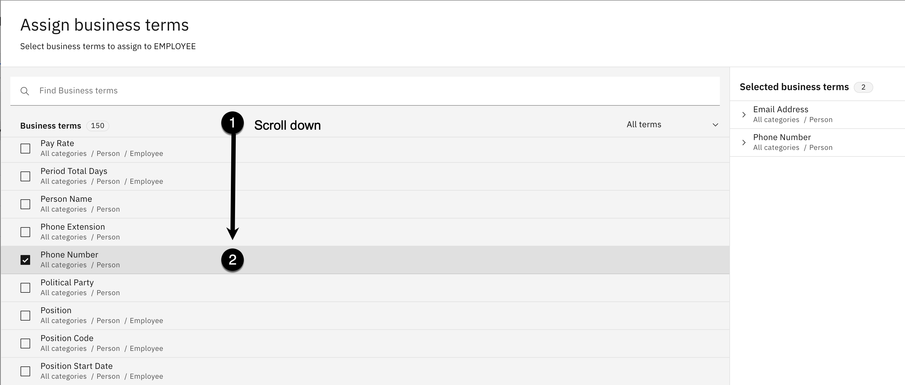

7. Scroll **down** the list until you get to the **Phone Number** business term.

8. Select the checkbox next to the **Phone Number** business term. **Do not** click the **Assign** button until you are instructed.

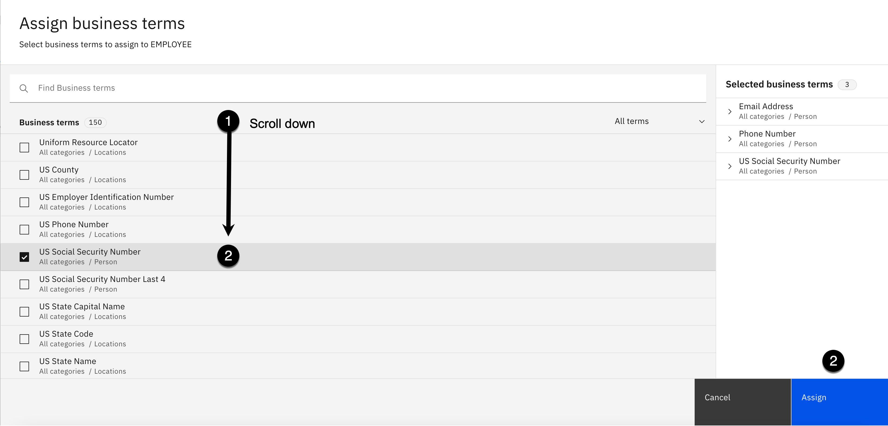

9. Scroll **down** the list until you get to the **US Social Security Number** business term.

10. Select the checkbox next to the **US Social Security Number** business term.

11. Click the **Assign** button.

Multiple dialog boxes will appear notifying you that the business terms were assigned. Repeat this process for the **5** remaining data assets, without screen shots, by following the detailed instructions for each asset below:

### WAREHOUSE\_SHIFTS.csv
---

1. Hover over the **Business Terms** column of the **WAREHOUSE\_SHIFTS.csv** asset, click the **View more** link that appears.

2. Click the **+** sign in the **Business terms** section of the **Governance** tab.

3. Using the **business term type** dropdown, select **All terms**.

4. Using the **search area**, enter the word **shift**.

5. Select the checkbox next to the **Shift Day** business term.

6. Select the checkbox next to the **Shift Duration** business term.

7. Select the checkbox next to the **Shift End Date** business term.

8. Select the checkbox next to the **Shift End Hour** business term.

9. Select the checkbox next to the **Shift Maximum Hour** business term.

10. Select the checkbox next to the **Shift Minimum Hour** business term.

11. Select the checkbox next to the **Shift Start Date** business term.

12. Select the checkbox next to the **Shift Start Hour** business term.

13. Click the **Assign** button.

### WAREHOUSE\_STAFF.csv
---

1. Hover over the **Business Terms** column of the **WAREHOUSE\_STAFF.csv** asset, click the **View more** link that appears.

2. Click the **+** sign in the **Business terms** section of the **Governance** tab.

3. Using the **business term type** dropdown, select **All terms**.

4. Using the **search area**, enter the words **skill**.

5. Select the checkbox next to the **Skill Experience** business term.

6. Select the checkbox next to the **Skill Rating** business term.

7. Select the checkbox next to the **Skill Set** business term.

8. Click the **Assign** button.

### WAREHOUSE\_STAFFING.csv
---

1. Hover over the **Business Terms** column of the **WAREHOUSE\_STAFFING.csv** asset, click the **View more** link that appears.

2. Click the **+** sign in the **Business terms** section of the **Governance** tab.

3. Using the **business term type** dropdown, select **All terms**.

4. Scroll **down** the list until you get to the **Day Code** business term.

5. Select the checkbox next to the **Day Code** business term.

6. Scroll **down** the list until you get to the **Max Shifts** business term.

7. Select the checkbox next to the **Max Shifts** business term.

8. Click the **Assign** button.

This completes the modifications you will make at the **Asset** level. so you will set the status of the **Assets** to **Reviewed**. You now have a correct, meaningful and useful set of business terms assigned to all of the data assets that will provide additional information to help end users understand their content.

1. Select the **X** in the top corner of the information panel to close it and gain more screen real estate.

2. Select the **high level** checkbox to select all **4** assets in the list.

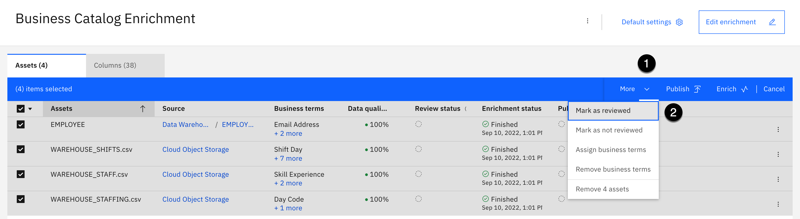

3. Select the **More** action menu on the toolbar.

4. Select then **Mark as reviewed** action.

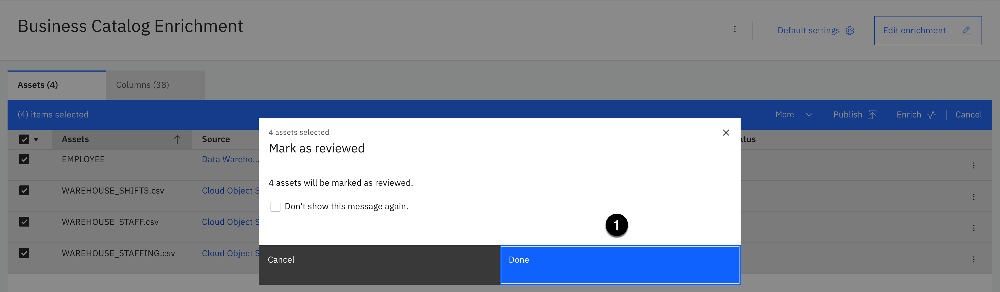

5. Click the **Done** button.

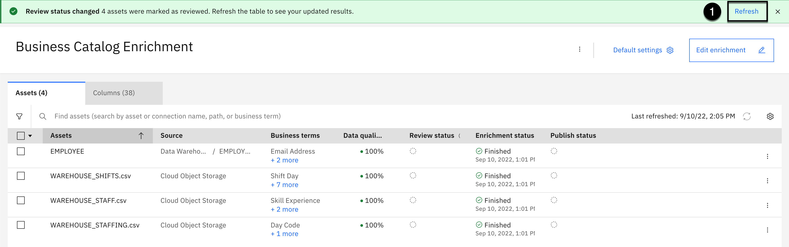

6. Click the **Refresh** button in the top right corner of the message displayed.

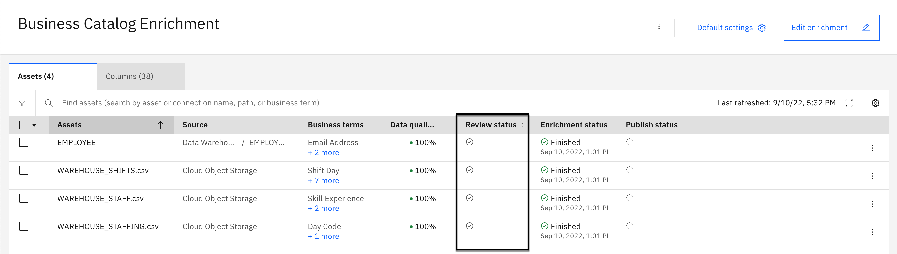

All of the **Assets** now have a **checkmark** next to them in the **Review status** column indicating that they have been reviewed.

## 7. Rectify Column Results

In this section, you will rectify the columns that have incorrect, and missing, business term and data class assignments. The metadata enrichment data class assignment was not as accurate as the business term assignment, with **26** columns needing data class corrections, compared to **6** columns needing business term corrections. This seems like a lot of work, but as you will experience in the following steps, metadata enrichment provides multiple methods to expedite the correction process.

### Rectify Column Business Term Assignments
---

In this step you will assign business terms to the **5** columns that are missing business terms. Even though some columns have suggested business terms, Watson Knowledge Catalog considers suggested business term assignments as missing assignments. You will also assign the correct business term to the **DAY** column.

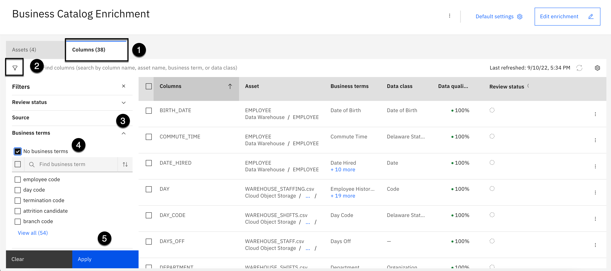

1. Select the **Columns** tab.

2. Click the **filter** button in the upper left corner under the **Assets** tab.

3. Select the **Arrow** on the right of the **Business term** filter section to open it.

4. Select the checkbox next to **No business terms**.

5. Click the **Apply** button.

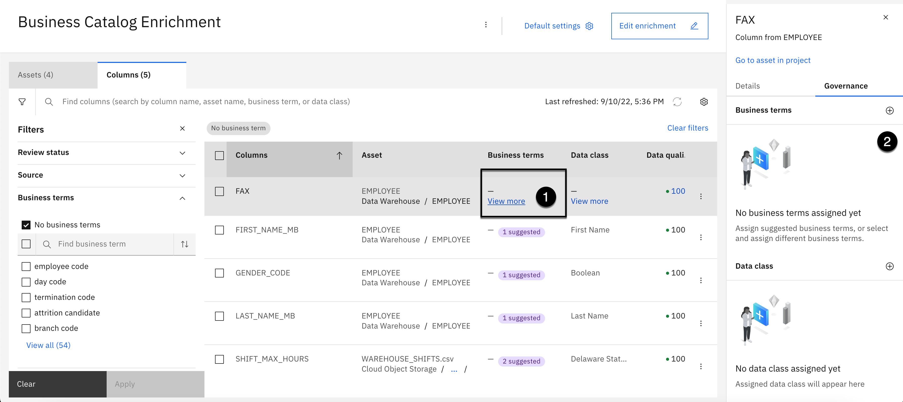

6. Hover over the **Business terms** column of the **FAX** column, click the **View more** link that appears.

7. Click the **+** sign in the **Business terms** section of the **Governance** tab.

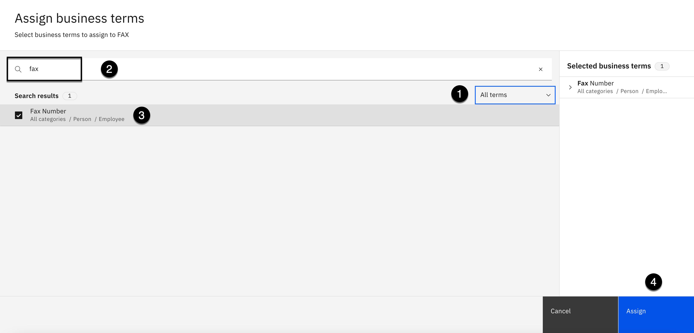

8. Using the **business term type** dropdown, select **All terms**.

9. Using the **search area**, enter the word **fax**.

10. Select the checkbox next to the **Fax Number** business term.

11. Click the **Assign** button.

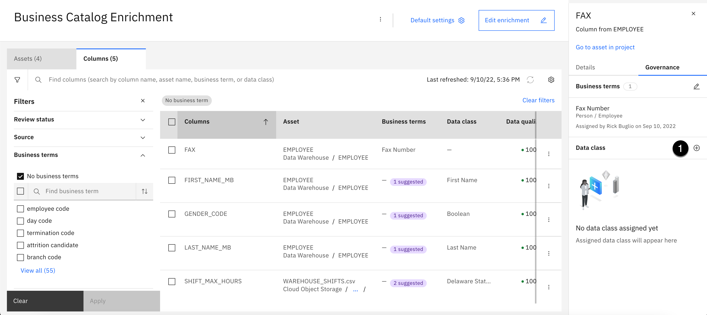

12. Click the **+** plus sign in the **Data class** section of the **Governance** tab.

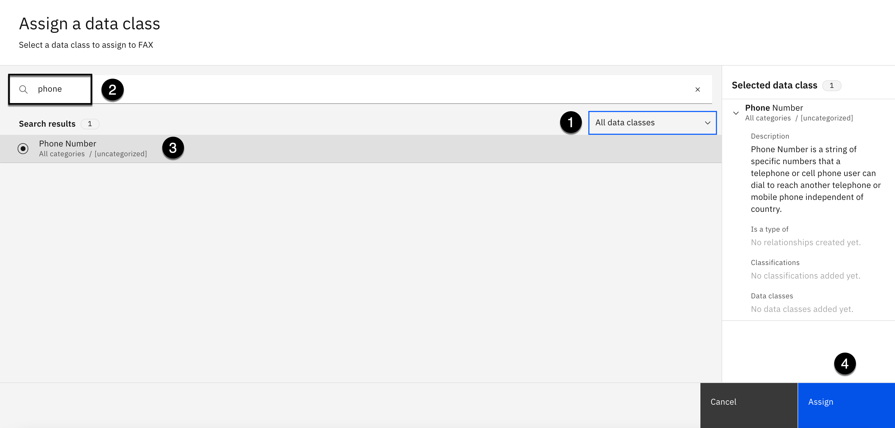

13. Using the **data classes** dropdown, select **All data classes**.

14. Using the **search area**, enter the word **phone**.

15. Select the checkbox next to the **Phone Number** data class.

16. Click the **Assign** button.

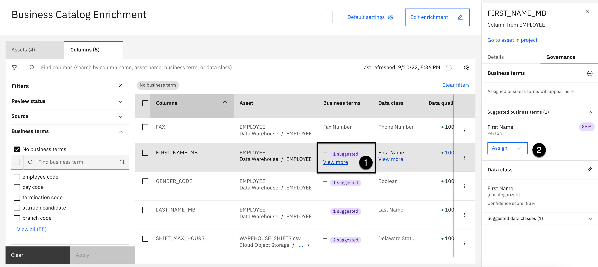

17. Hover over the **Business terms** column of the **FIRST\_NAME\_MB** column, click the **View more** link that appears.

18. Click the **Assign** button under the **First Name** business term in the **Governance** tab.

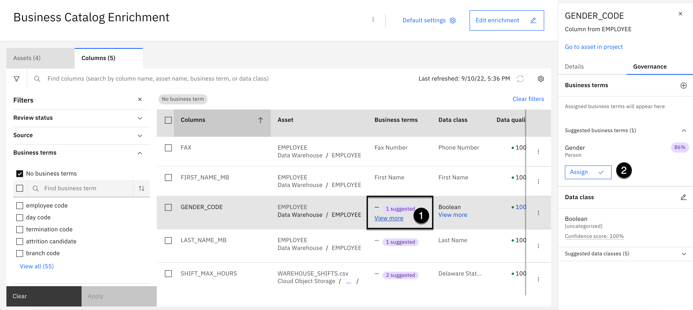

19. Hover over the **Business terms** column of the **GENDER\_CODE** column, click the **View more** link that appears.

20. Click the **Assign** button under the **Gender** business term in the **Governance** tab.

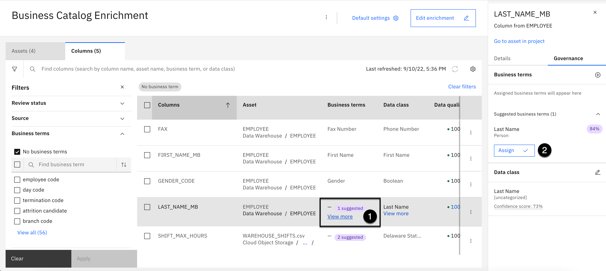

21. Hover over the **Business terms** column of the **LAST\_NAME\_MB** column, click the **View more** link that appears.

22. Click the **Assign** button under the **Last Name** business term in the **Governance** tab.

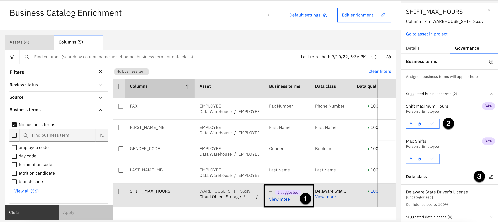

23. Hover over the **Business terms** column of the **SHIFT\_MAX\_HOURS** column, click the **View more** link that appears.

24. Click the **Assign** button under the **Shift Maximum Hours** business term in the **Governance** tab.

25. Click the **edit** button (looks like a pencil), in the **Data class** section of the **Governance** tab.

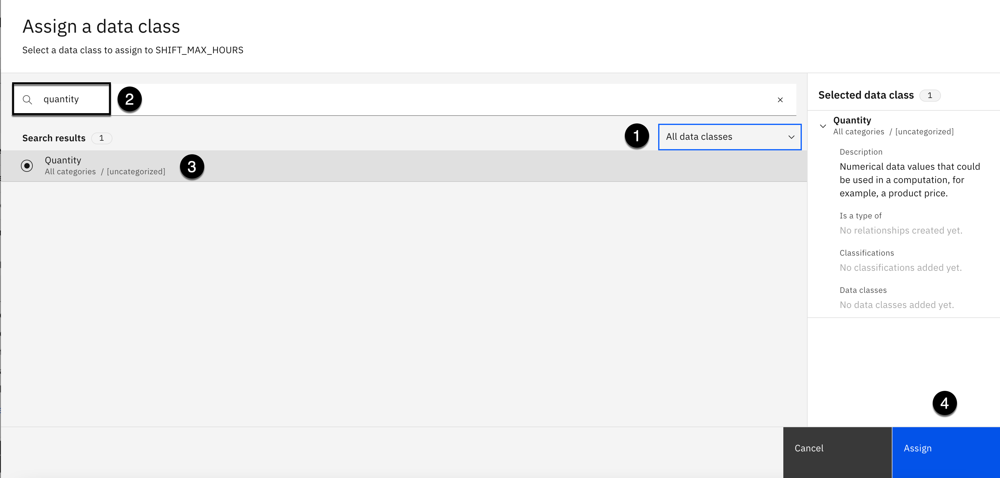

26. Using the **data classes** dropdown, select **All data classes**.

27. Using the **search area**, enter the word **quantity**.

28. Select the checkbox next to the **Quantity** data class.

29. Click the **Assign** button.

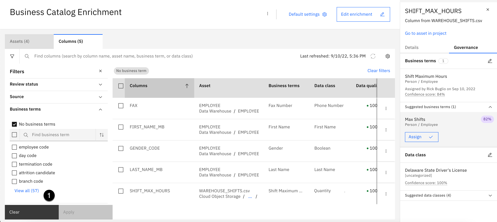

30. Click the **Clear** button to clear all filters.

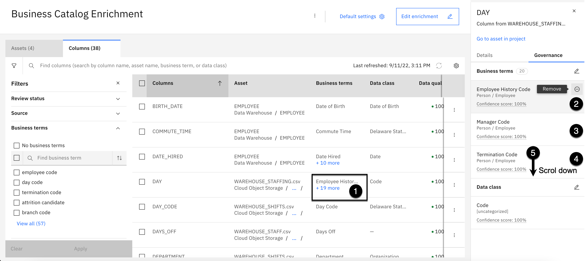

The list of columns should still be sorted by **Columns** in ascending order with **BIRTH\_DATE** as the first column in the list. If not, click on the **Columns** header and sort **Columns** in ascending (Arrow pointing up) until **BIRTH\_DATE** is the first column in the list.

The **DAY** column has **20** (+19) suggested business terms that are all incorrect. The **20** suggestions need to be removed, and the correct business term needs to be assigned. It will be a repetitive process to remove them, because there is **not** a function to remove them all, so follow the instructions carefully to remove them and assign the **Shift Day** business term as the correct business term.

31. Hover over the **Business terms** column of the **DAY** column, click the **\+ View 10 more** link that appears.

32. Hover over the **Employee History Code** business term, select the **\-** minus sign to remove the business term.

33. Hover over the **Manager Code** business term, select the **\-** minus sign to remove the business term.

34. Hover over the **Termination Code** business term, select the **\-** minus sign to remove the business term.

35. Scroll **down** the business term list, select the **\-** minus sign next to each of the remaining **16** business terms in the list to remove them.

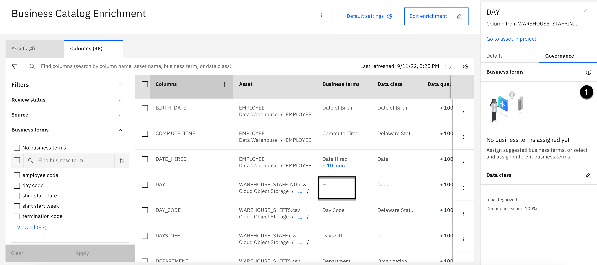

All of the business terms should be removed from the **DAY** column and the **Business terms** column for the **DAY** column should be empty with a **\- dash** in it.

36. Click the **+** plus sign in the **Business terms** section of the **Governance** tab for the **DAY** column.

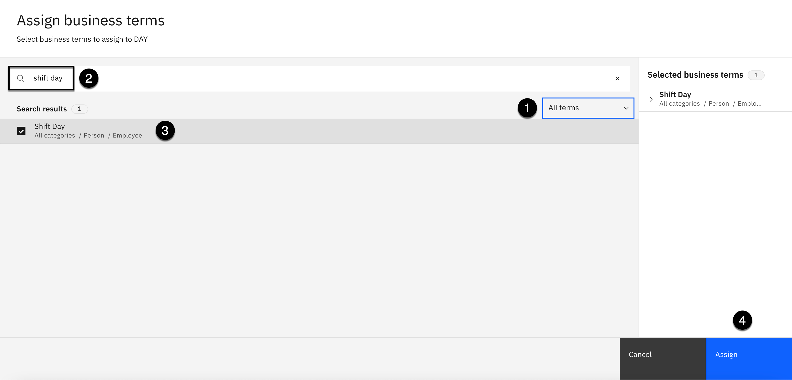

37. Using the **data classes** dropdown, select **All terms**.

38. Using the **search area**, enter the words **shift day**.

39. Select the checkbox next to the **Shift Day** business term.

40. Click the **Assign** button.

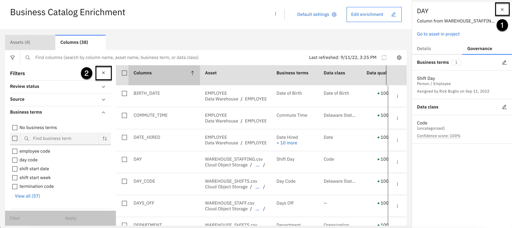

You have successfully completed rectifying the business terms, and now have accurate business term assignments for all **38** columns.

### Rectify Column Data Class Assignments
---

You will now correct the data class assignments. There are **12** columns with correct data class assignments, leaving **26** that need attention. To accomplish this quickly, you will use the **search** and **filter** capabilities of metadata enrichment. Having correct data class assignments is essential for columns that contain sensitive information, because there might be data protection rules that are dependent on a column's data class assignment to mask the data. The **EMAIL** and **SSN** columns in the **EMPLOYEE** data asset, that are protected by data protection rules, have already been assigned the correct data class, but the **FAX** and **WORK\_PHONE** columns that contain phone numbers do not, so they need to be corrected.

1. Select the **X** in the top right corner of the information panel to close it.

2. Select the **X** in the **Filters** section to close it.

3. Copy the text below and paste it into the **search area**:

<CopyText text="employee_code"/>

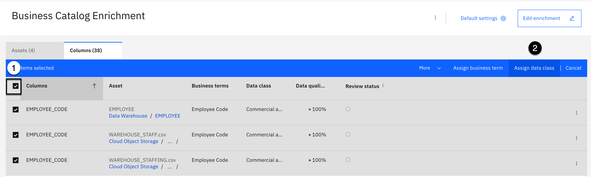

4. Select the **high level** checkbox to select all columns in the list.

5. Click the **Assign data class** button on the toolbar.

6. Using the **search area**, enter the word **identifier**.

7. Select the checkbox next to the **Identifier** data class.

8. Click the **Assign** button.

9. Click the **Refresh** button in the top right corner of the message displayed.

10. Select the **X** in the **search area** to clear it out.

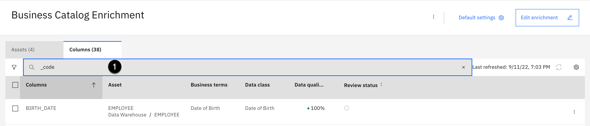

11. Copy the text below and paste it into the **search area**:

<CopyText text="_code"/>

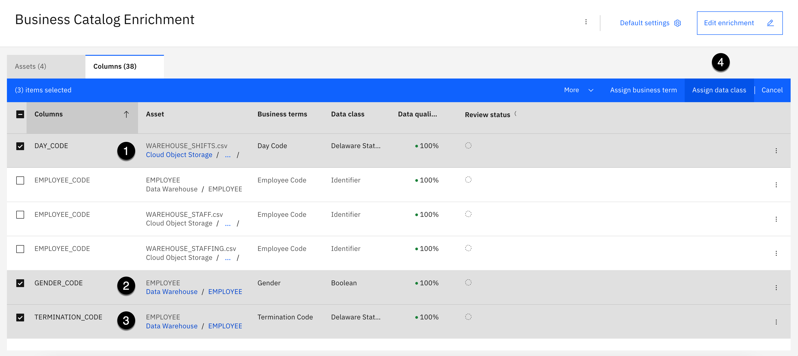

12. Select the checkbox next to **DAY\_CODE** column.

13. Select the checkbox next to **GENDER\_CODE** column.

14. Select the checkbox next to **TERMINATION\_CODE** column.

15. Click the **Assign data class** button on the toolbar.

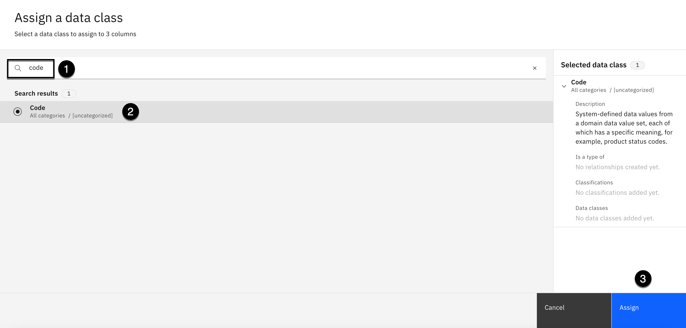

16. Using the **search area**, enter the word **code**.

17. Select the checkbox next to the **Code** data class.

18. Click the **Assign** button.

19. Click the **Refresh** button in the top right corner of the message displayed.

20. Select the **X** in the **search area** to clear it out.

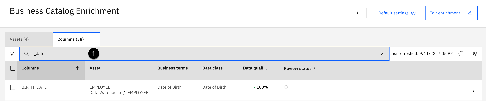

21. Copy the text below and paste it into the **search area**:

<CopyText text="_date"/>

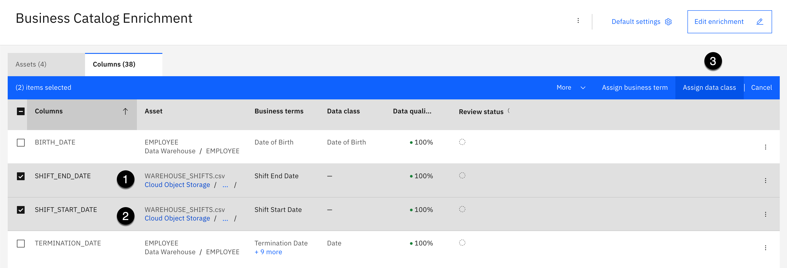

22. Select the checkbox next to **SHIFT\_END\_DATE** column.

23. Select the checkbox next to **SHIFT\_START\_DATE** column.

24. Click the **Assign data class** button on the toolbar.

25. Using the **search area**, enter the word **date**.

26. Select the checkbox next to the **Date** data class.

27. Click the **Assign** button.

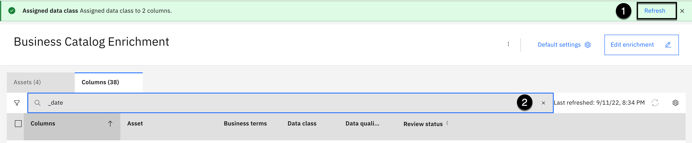

28. Click the **Refresh** button in the top right corner of the message displayed.

29. Select the **X** in the **search area** to clear it out.

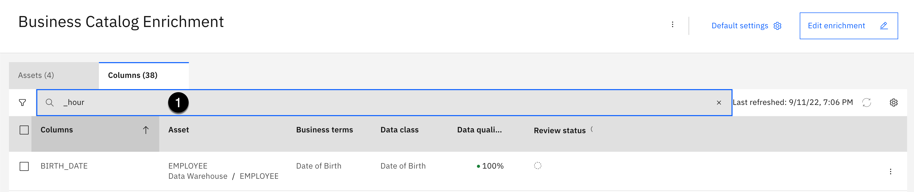

30. Copy the text below and paste it into the **search area**:

<CopyText text="_hour"/>

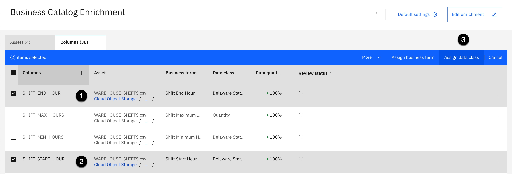

31. Select the checkbox next to **SHIFT\_END\_HOUR** column.

32. Select the checkbox next to **SHIFT\_START\_HOUR** column.

33. Click the **Assign data class** button on the toolbar.

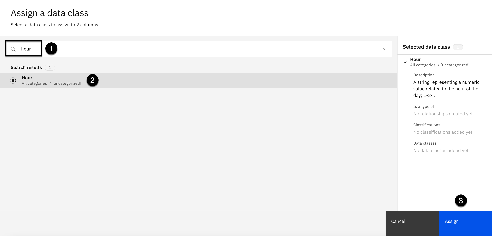

34. Using the **search area**, enter the word **hour**.

35. Select the checkbox next to the **Hour** data class.

36. Click the **Assign** button.

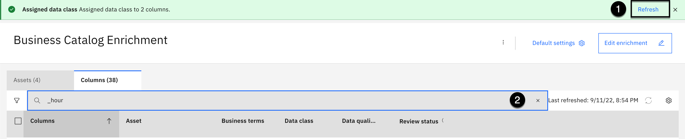

37. Click the **Refresh** button in the top right corner of the message displayed.

38. Select the **X** in the **search area** to clear it out.

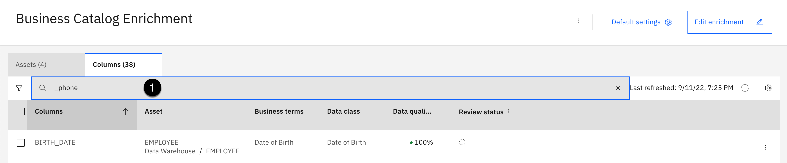

39. Copy the text below and paste it into the **search area**:

<CopyText text="_phone"/>

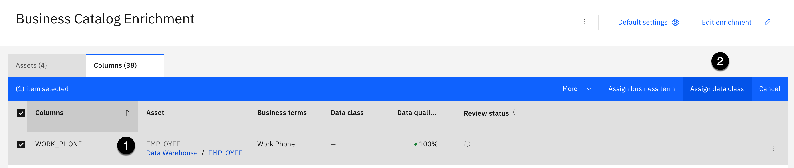

40. Select the checkbox next to **WORK\_PHONE** column.

41. Click the **Assign data class** button on the toolbar.

42. Using the **search area**, enter the word **phone**.

43. Select the checkbox next to the **Phone Number** data class.

44. Click the **Assign** button.

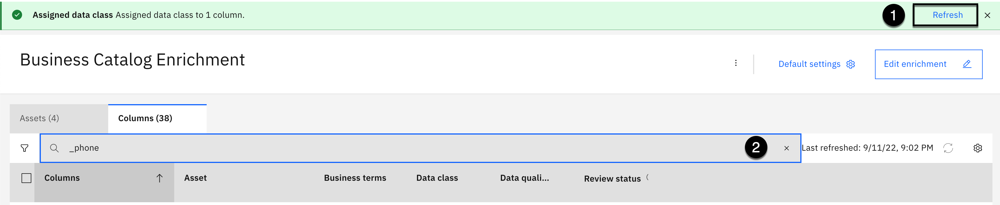

45. Click the **Refresh** button in the top right corner of the message displayed.

46. Select the **X** in the **search area** to clear it out.

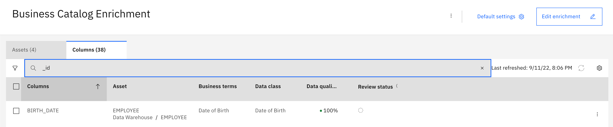

47. Copy the text below and paste it into the **search area**:

<CopyText text="_id"/>

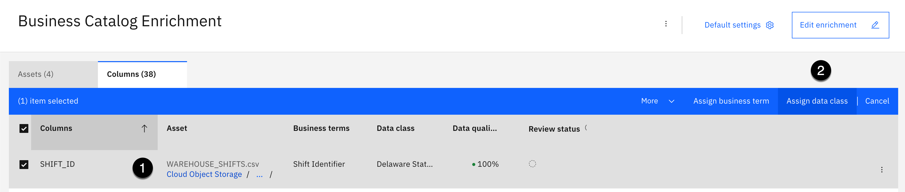

48. Select the checkbox next to **SHIFT\_ID** column.

49. Click the **Assign data class** button on the toolbar.

50. Using the **search area**, enter the word **identifier**.

51. Select the checkbox next to the **Identifier** data class.

52. Click the **Assign** button.

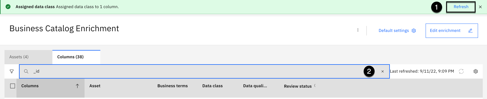

53. Click the **Refresh** button in the top right corner of the message displayed.

54. Select the **X** in the **search area** to clear it out.

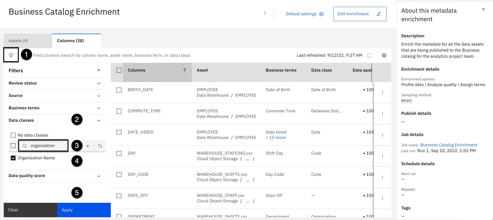

55. Click the **filter** button in the upper left corner under the **Assets** tab.

56. Select the **Arrow** on the right of the **Data class** filter section to open it.

57. Copy the text below and paste it into the **search area**:

<CopyText text="organization"/>

58. Select the checkbox next to the **Organization Name** data class that appears.

59. Click the **Apply** button.

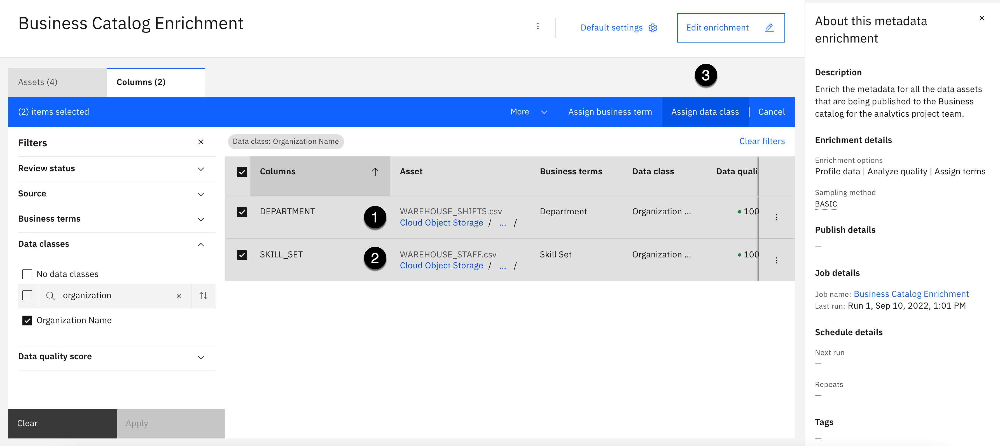

60. Select the checkbox next to **DEPARTMENT** column.

61. Select the checkbox next to **SKILL\_SET** column.

62. Click the **Assign data class** button on the toolbar.

63. Using the **search area**, enter the word **text**.

64. Select the checkbox next to the **Text** data class.

65. Click the **Assign** button.

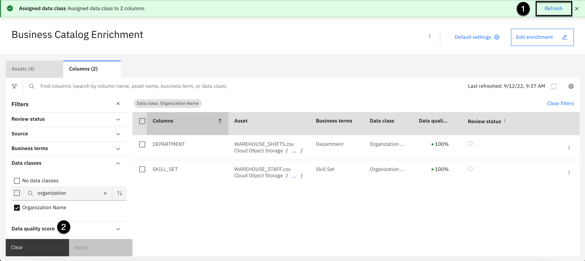

66. Click the **Refresh** button in the top right corner of the message displayed.

67. Select the **Clear** button to clear the filters.

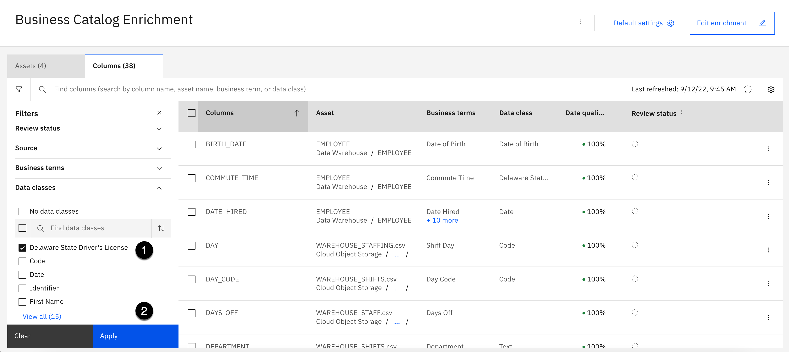

68. Select the checkbox next to the **Delaware State Driver's License** data class.

69. Click the **Apply** button.

70. Select the checkbox next to **COMMUTE\_TIME** column.

71. Select the checkbox next to **SHIFT\_DURATION** column.

72. Select the checkbox next to **SHIFT\_MIN\_HOURS** column.

73. Select the checkbox next to **SKILL\_EXPERIENCE** column.

74. Click the **Assign data class** button on the toolbar.

75. Using the **search area**, enter the word **quantity**.

76. Select the checkbox next to the **Quantity** data class.

77. Click the **Assign** button.

78. Click the **Refresh** button in the top right corner of the message displayed.

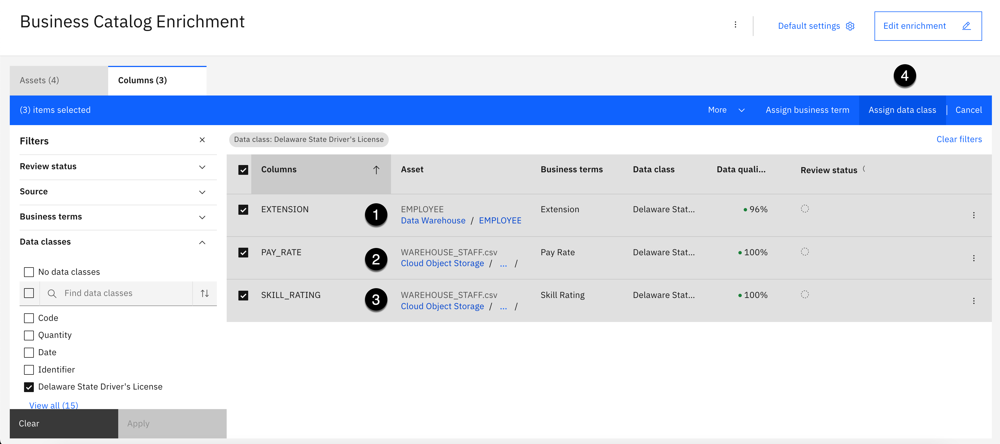

79. Select the checkbox next to **EXTENSION** column.

80. Select the checkbox next to **PAY\_RATE** column.

81. Select the checkbox next to **SKILL\_RATING** column.

82. Click the **Assign data class** button on the toolbar.

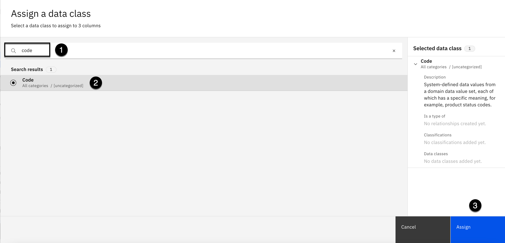

83. Using the **search area**, enter the word **code**.

84. Select the checkbox next to the **Code** data class.

85. Click the **Assign** button.

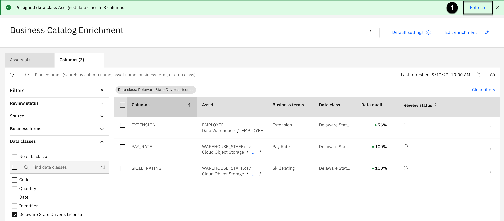

86. Click the **Refresh** button in the top right corner of the message displayed.

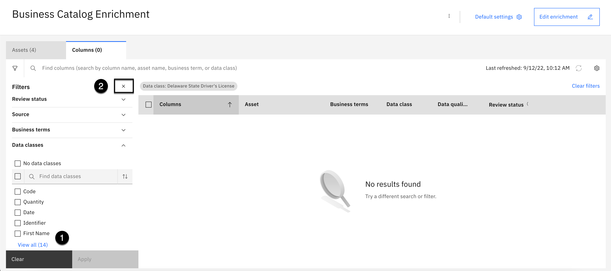

87. Click the **Clear** button to clear all filters.

88. Select the **X** in the **Filters** section to close it.

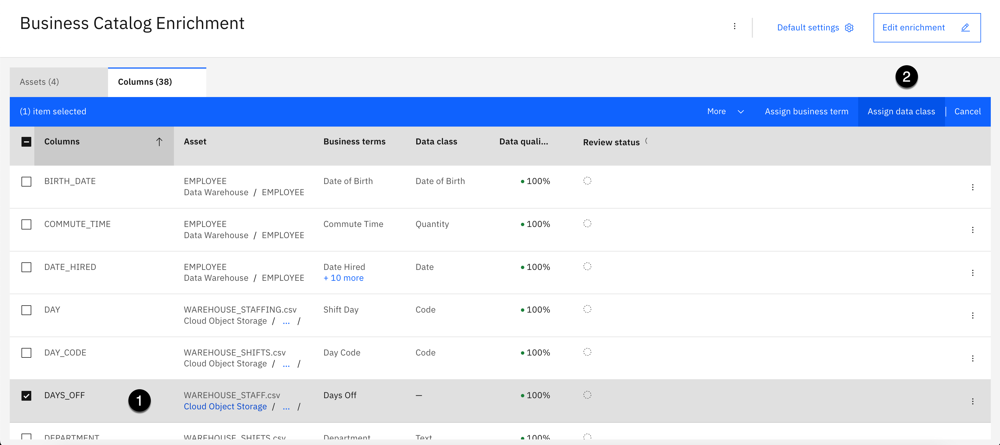

89. Select the checkbox next to **DAYS\_OFF** column.

90. Click the **Assign data class** button on the toolbar.

91. Using the **search area**, enter the word **day**.

92. Select the checkbox next to the **Day** data class.

93. Click the **Assign** button.

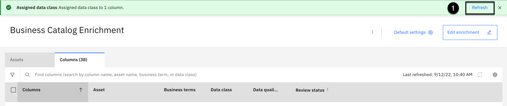

94. Click the **Refresh** button in the top right corner of the message displayed.

You have successfully assigned the correct data classes to all **38** columns. This completes all the modifications you will make at the **Column** level. You now have a correct, meaningful and useful set of business terms and data classes assigned to all of the columns. This will provide additional information to help end users understand their content, and ensure sensitive data is protected by the data protection rules that rely on data class assignment, so you can set the status of the **Columns** to **Reviewed**.

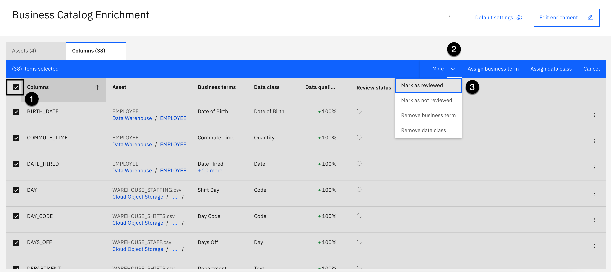

95. Select the **high level** checkbox to select **all columns** in the list.

96. Select the **More** action menu on the toolbar.

97. Select then **Mark as reviewed** action.

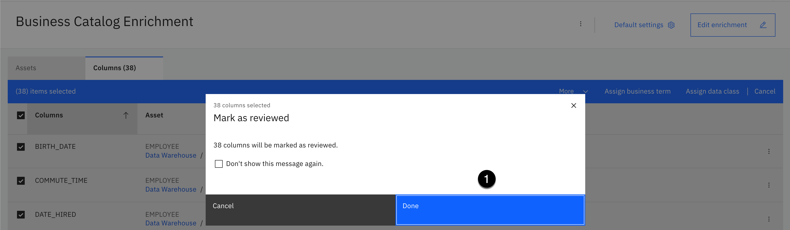

98. Click the **Done** button.

99. Click the **Refresh** button in the top right corner of the message displayed.

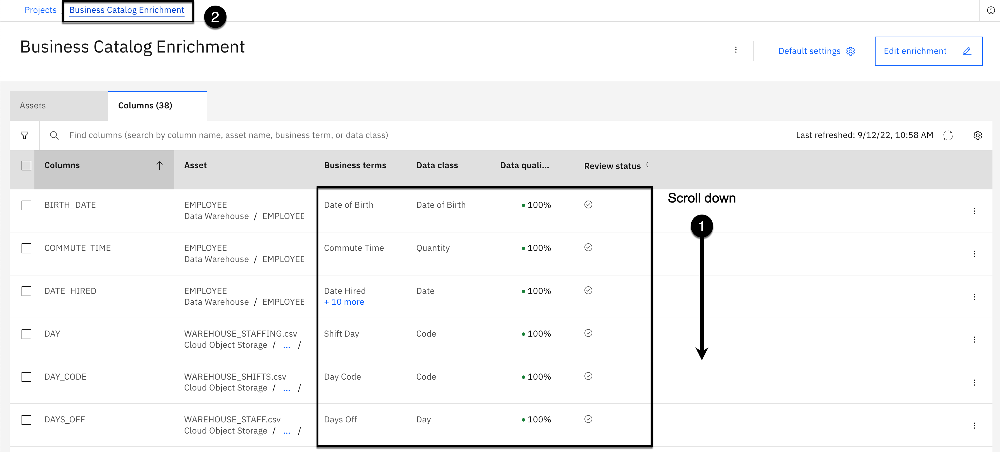

The **Review status** columns now has a **check mark** next to all the columns.

100. Scroll **down** the list of columns to review the business term and data class assignments and the review status for all the columns.

101. Select the **Business Catalog Enrichment** breadcrumb at the top of the page to get back to the project home page.

## 8. Add Additional Metadata

The metadata import and enrichment utilities **do not** allow for descriptions, or additional tags, to be added to data assets as they are imported and enriched. The import automatically adds the data asset's schema or folder name as a tag, but it adds the tag in uppercase, and tags are case sensitive, with no means to the feature off or a means to change the behavior. In this section you will add **descriptions** to all of the data assets, remove their existing tags, and add new **tags** before you publish them to the **Business** catalog. You are removing the existing tags because they were added by the metadata imports in upper case, and the tags that were added to all the governance artifacts in the business glossary were added in mixed case. Tags are case sensitive, and you do not want duplicate and inconsistent tags. Therefore, you will correct the data asset tags to be in mixed case before you publish them.

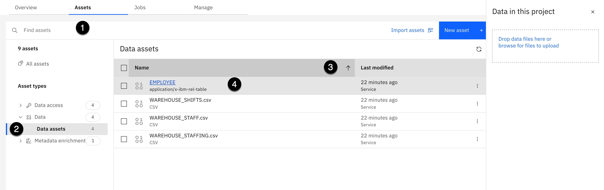

1. Select the **Assets** tab.

2. From the **Data** section, select **Data assets**.

3. Click the **Name** column header to sort the columns in ascending order (Arrow pointing up) until the **EMPLOYEE** data asset is at the top of the list.

4. Click the **EMPLOYEE** data asset.

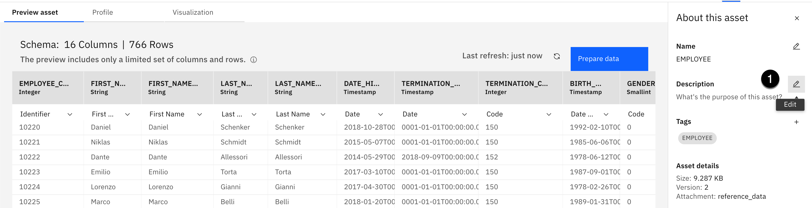

5. Click the **Edit** button (looks like a pencil) for the **Description**.

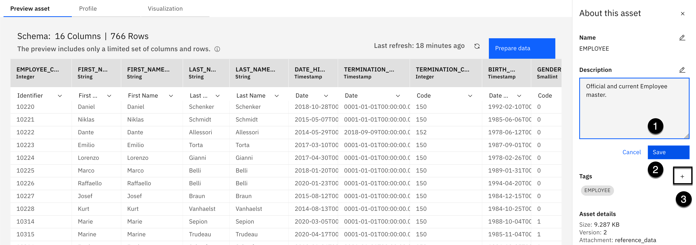

6. Copy the text below and paste it into the **Description** field:

<CopyText text="Official and current Employee master."/>

7. Click the **Save** button.

8. Select the **+** plus sign to Add **Tags**.

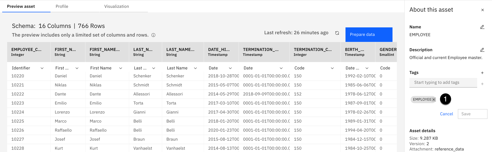

9. Select the **X** on the **EMPLOYEE** tag to remove it.

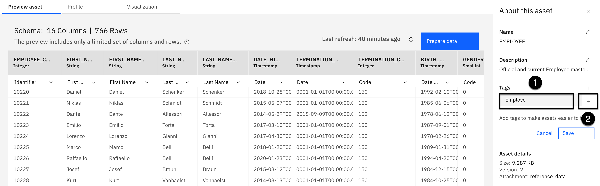

10. Copy the text below and paste it into the **Tag** field:

<CopyText text="Employee"/>

11. Click the **+** plus sign to add the tag.

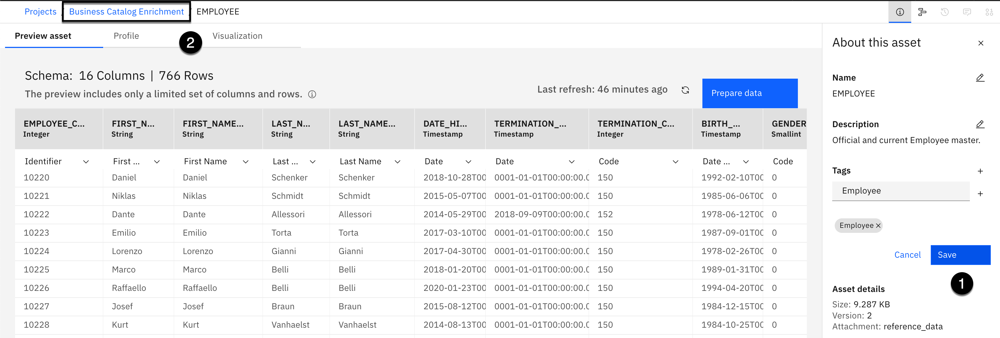

12. Click the **Save** button.

13. Select the **Business Catalog Enrichment** breadcrumb at the top of the page to go back to the project home page.

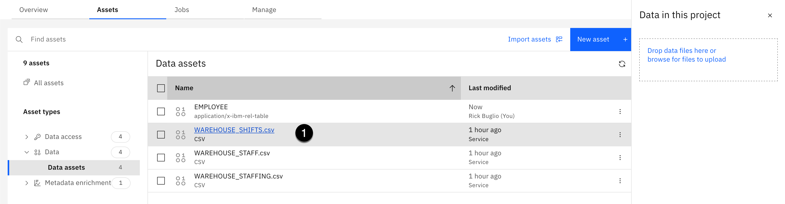

14. Click the **WAREHOUSE\_SHIFTS.csv** data asset.

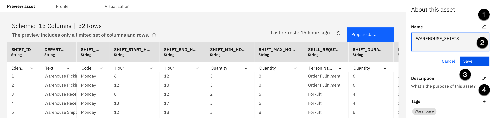

15. Click the **Edit** button (looks like a pencil) for the **Name**.

16. Remove the **.csv** extension from the **Name**.

17. Click the **Save** button.

18. Click the **Edit** button (looks like a pencil) for the **Description**.

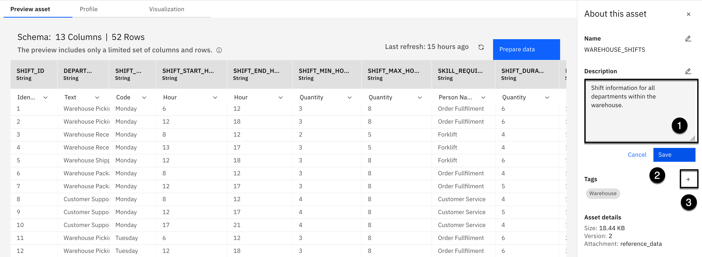

19. Copy the text below and paste it into the **Description** field:

<CopyText text="Shift information for all departments within the warehouse."/>

20. Click the **Save** button.

21. Select the **+** plus sign to Add **Tags**.

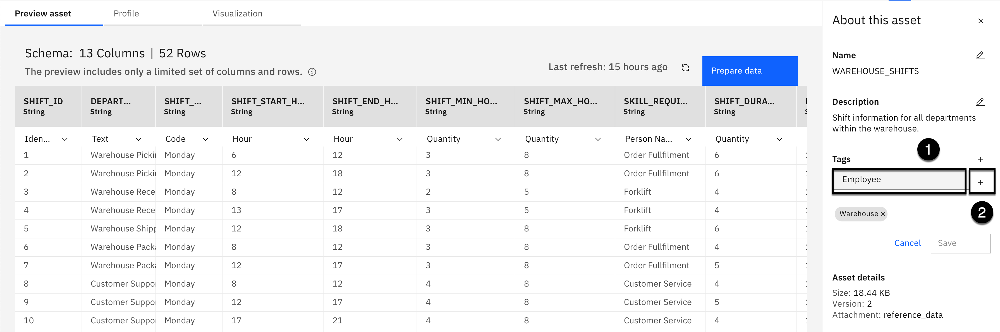

22. Copy the text below and paste it into the **Tag** field:

<CopyText text="Employee"/>

23. Click the **+** plus sign to add the tag.

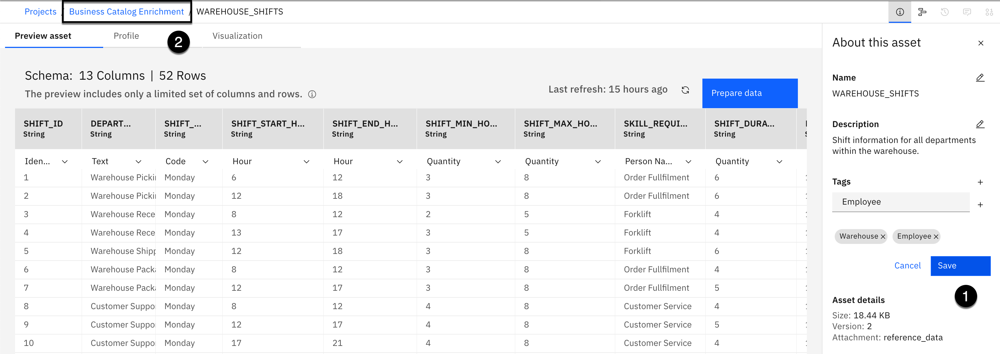

24. Click the **Save** button.

25. Select the **Business Catalog Enrichment** breadcrumb at the top of the page to go back to the project home page.

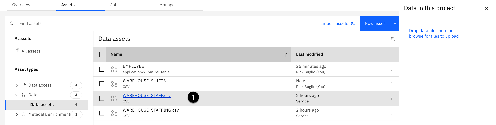

26. Click the **WAREHOUSE\_STAFF.csv** data asset.

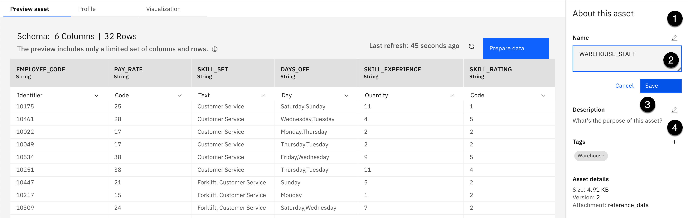

27. Click the **Edit** button (looks like a pencil) for the **Name**.

28. Remove the **.csv** extension from the **Name**.

29. Click the **Save** button.

30. Click the **Edit** button (looks like a pencil) for the **Description**.

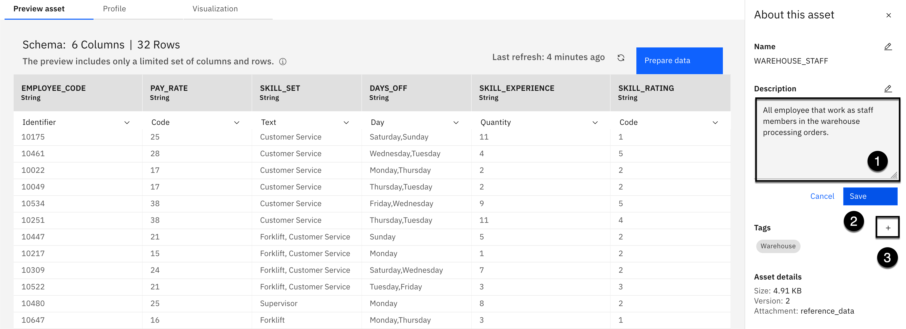

31. Copy the text below and paste it into the **Description** field:

<CopyText text="All employee that work as staff members in the warehouse processing orders."/>

32. Click the **Save** button.

33. Select the **+** plus sign to Add **Tags**.

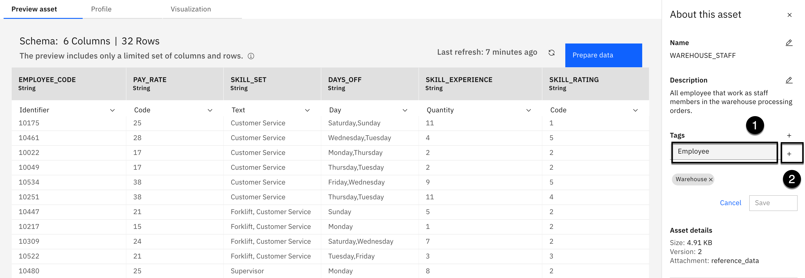

34. Copy the text below and paste it into the **Tag** field:

<CopyText text="Employee"/>

35. Click the **+** plus sign to add the tag.

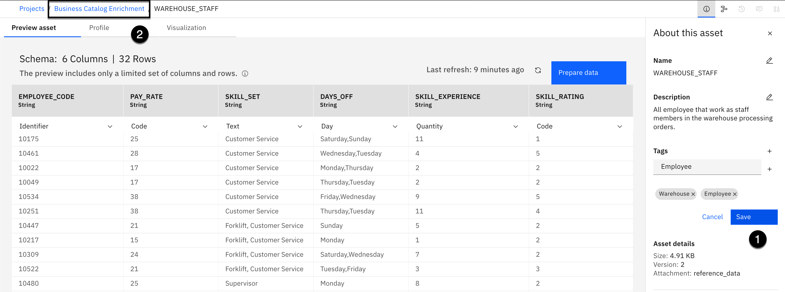

36. Click the **Save** button.

37. Select the **Business Catalog Enrichment** breadcrumb at the top of the page to go back to the project home page.

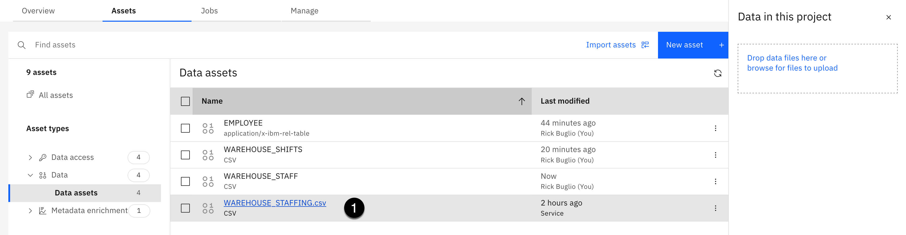

38. Click the **WAREHOUSE\_STAFFING.csv** data asset.

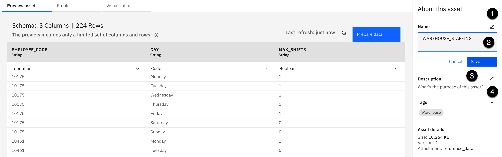

39. Click the **Edit** button (looks like a pencil) for the **Name**.

40. Remove the **.csv** extension from the **Name**.

41. Click the **Save** button.

42. Click the **Edit** button (looks like a pencil) for the **Description**.

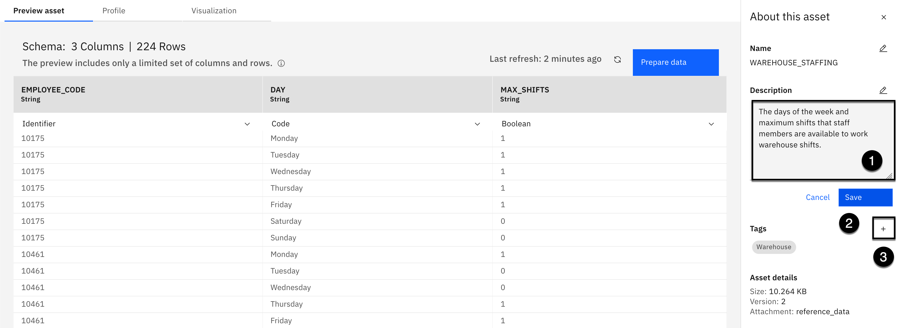

43. Copy the text below and paste it into the **Description** field:

<CopyText text="The days of the week and maximum shifts that staff members are available to work warehouse shifts."/>

44. Click the **Save** button.

45. Select the **+** plus sign to Add **Tags**.

46. Copy the text below and paste it into the **Tag** field:

<CopyText text="Employee"/>

47. Click the **+** plus sign to add the tag.

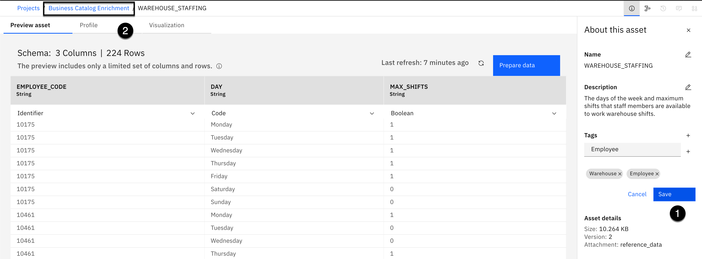

48. Click the **Save** button.

49. Select the **Business Catalog Enrichment** breadcrumb at the top of the page to go back to the project home page.

