# 104: Catálogo de los datos

El proceso de curación de datos se ha completado y ahora está preparado para crear el catálogo gobernado y publicar los activos de datos totalmente enriquecidos en el catálogo para que estén listos para su uso por parte del equipo del proyecto de análisis para llevar a cabo sus datos y análisis de IA objetivos.

## 1. Crear el catálogo

Esta sección crea el **gobernado** El catálogo que utilizará para publicar los activos de datos totalmente enriquecidos que acaba de tener en cuenta. Este catálogo se denominará el **Empresas**, por lo tanto, asegúrese de que no tiene un catálogo en su entorno, que ha creado y propio, con el mismo nombre.

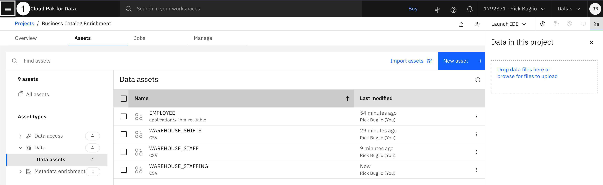

1.  Seleccione la opción **Navegación** (las 4 líneas horizontales apiladas en la esquina superior izquierda).

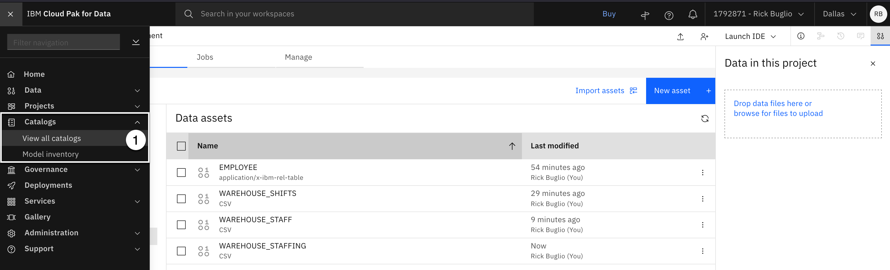

2.  Seleccione la opción **Catálogos > Ver todos los catálogos**.

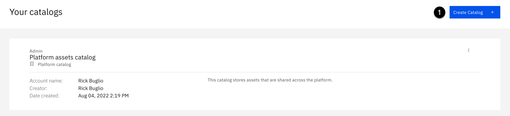

3.  Haga clic en **Crear catálogo**.

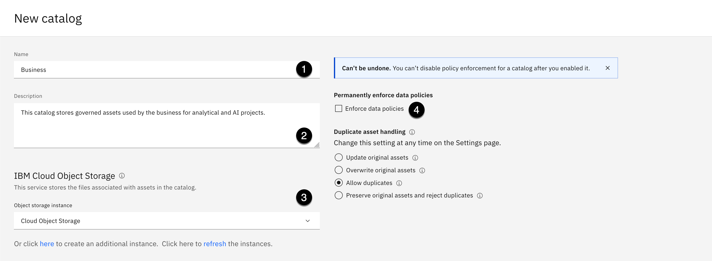

4.  Copie el texto siguiente y péguelo en el **Nombre** :

<CopyText text="Empresas"/>

5.  Copie el texto siguiente y péguelo en el **Descripción** :

<CopyText text="Este catálogo almacena activos gobernados utilizados por la empresa para proyectos de análisis e IA."/>

6.  Utilización de la **Instancia de almacenamiento de objetos** desplegable, seleccione una instancia de Almacenamiento de objetos de nube en el entorno en el que desea crear el catálogo.
7.  Seleccione el recuadro de selección junto a **Aplicar políticas de datos**.

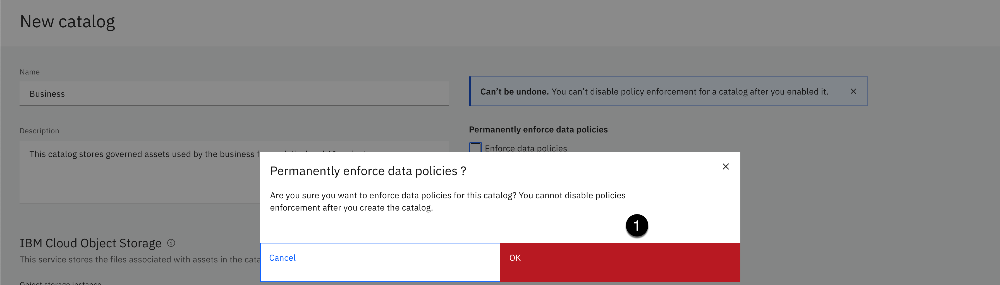

8.  Haga clic en **OK** cuando se le solicite que confirme que desea **¿Aplicar permanentemente políticas de datos?**.

Esto es **obligatorio** y se debe seleccionar para crear un **gobernado** Catálogo

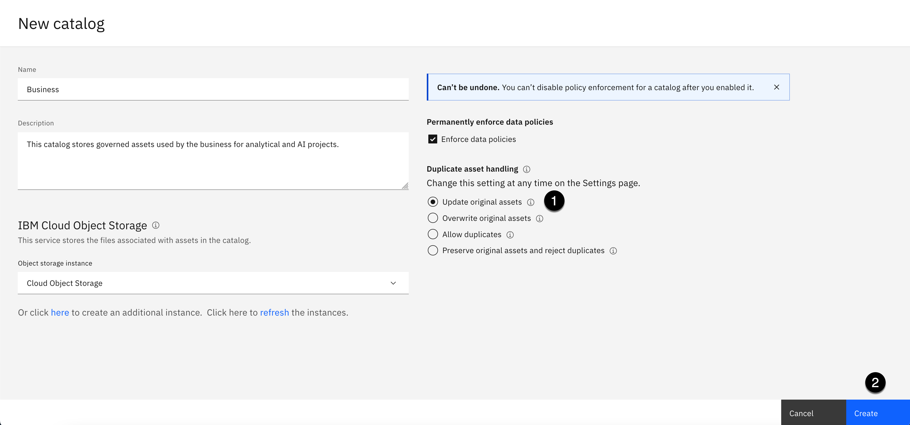

9.  Seleccione la opción **Actualizar activos originales** en la sección de manejo de activos duplicados.
10. Haga clic en **Crear**.

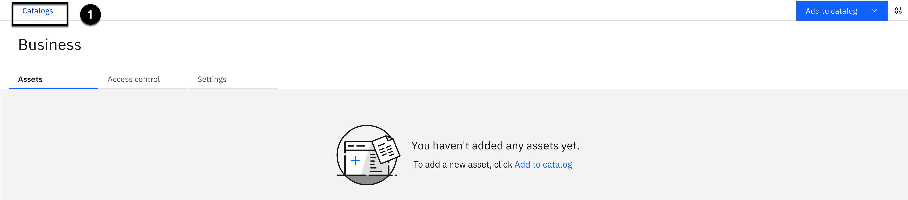

Verá un mensaje: **Creando negocio, esto puede tardar un minuto ...**. Cuando se completa la creación del catálogo, se le lleva a la nueva **Empresas** catálogo.

11. Seleccione la opción **Catálogos** breadcrumb en la parte superior de la página para volver a la página de inicio del catálogo.

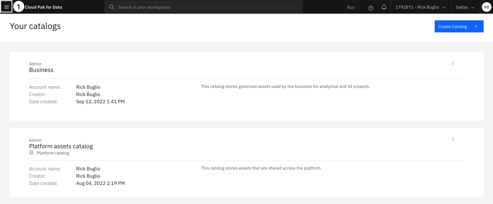

Ahora debería ver el nuevo **Empresas** catálogo, y el **Catálogo de activos de plataforma** se le ha indicado que cree en el **Laboratorio de tejido de datos** [Cómo empezar](https://vest.buildlab.cloud/es/wkc/getting-started).

12. Seleccione la opción **Navegación** (las 4 líneas horizontales apiladas en la esquina superior izquierda).

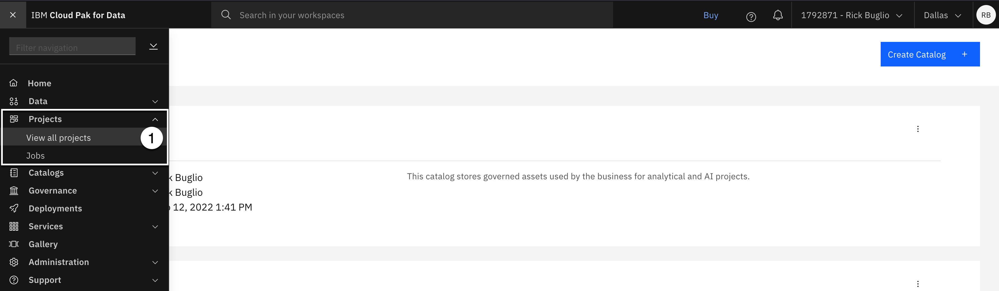

13. Seleccione la opción **Proyectos > Ver todos los proyectos**.

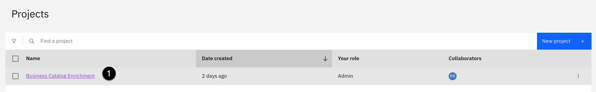

14. Seleccione la opción **Enriquecimiento de catálogo empresarial** proyecto.

## 2. Publicar conexiones

En esta sección, usted publicará las conexiones, una a la vez, y en el orden enumerado en las instrucciones de abajo, a los gobernados **Empresas** antes de publicar los activos de datos. Esto los colocará al final de la **Recientemente añadido** lista de categorías en el catálogo, dejando espacio para que los activos de datos aparezcan delante y en el centro, por orden de importancia, de modo que se encuentren fácilmente y se puedan visualizar.

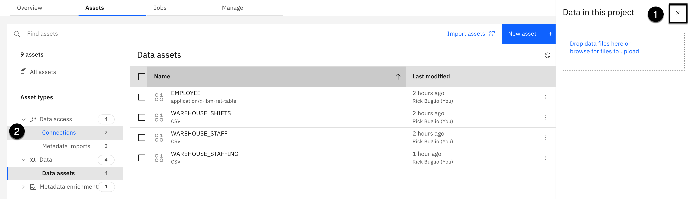

1.  Seleccione la opción **X** en la esquina superior derecha del panel de información para cerrarla.
2.  De la **Tipos de activos** a la izquierda, seleccione **Acceso a datos > Conexiones**.

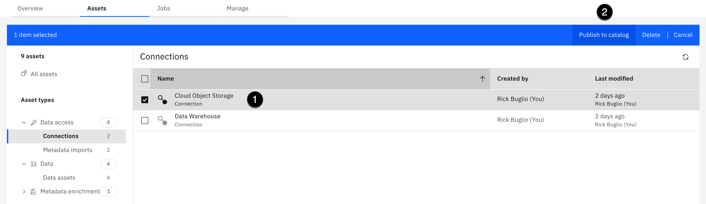

3.  Seleccione la casilla de verificación junto a la **Almacenamiento de objetos de nube** conexión.
4.  Seleccione la opción **Publicar en catálogo** en la barra de herramientas.

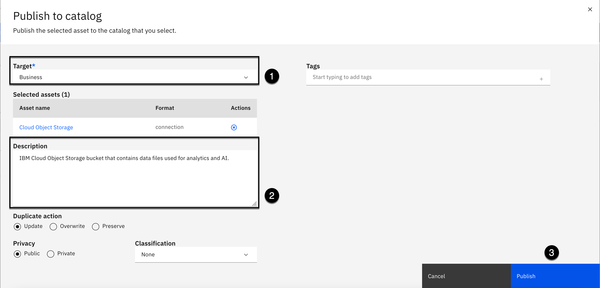

5.  Seleccione la opción **Empresas** catálogo como el **Objetivo** catalog (Debe seleccionarse de forma predeterminada).
6.  Copie el texto siguiente y péguelo en el **Descripción** :

<CopyText text="Grupo de IBM Cloud Object Storage que contiene archivos de datos utilizados para la analítica y la IA."/>

7.  Haga clic en **Publicación**.

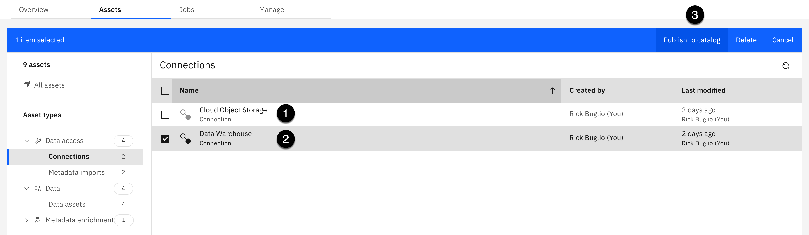

8.  Deseleccione el recuadro de selección junto a la **Almacenamiento de objetos de nube** conexión.
9.  Seleccione la casilla de verificación junto a la **Depósito de datos** conexión.
10. Seleccione la opción **Publicar en catálogo** en la barra de herramientas.

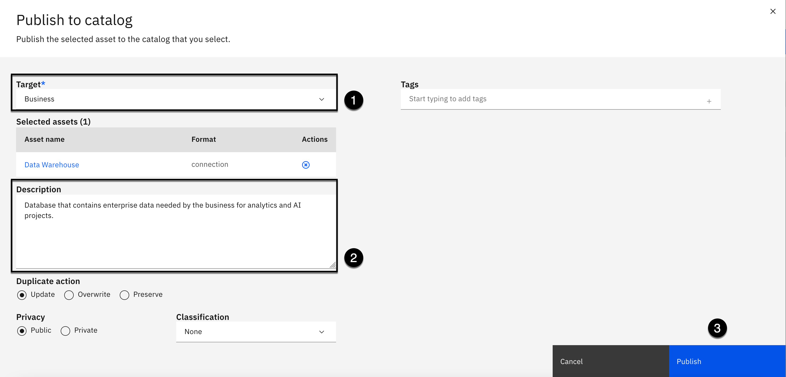

11. Seleccione la opción **Empresas** catálogo como el **Objetivo** catalog (Debe seleccionarse de forma predeterminada).
12. Copie el texto siguiente y péguelo en el **Descripción** :

<CopyText text="Base de datos que contiene datos de empresa necesarios para los proyectos de análisis e IA de la empresa."/>

13. Haga clic en **Publicación**.

## 3. Publicar activos de datos

En esta sección, publicará los activos de datos en el **Empresas** catálogo. Como ha hecho con las conexiones, los activos de datos se publican en un orden específico, de modo que el **Recientemente añadido** en el catálogo se rellena correctamente. Va a publicar el **WAREHOUSE_TURNOS**, **WAREHOUSE_STAFF**, y **WAREHOUSE_PERSONAL** activos de datos juntos, en un paso de publicación, y luego publicar el **EMPLEADO** activo de datos último.

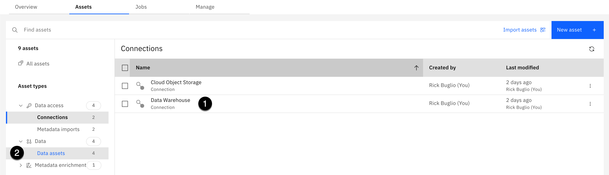

1.  Deseleccione el recuadro de selección junto a la **Depósito de datos** conexión.
2.  De la **Tipos de activos** a la izquierda, seleccione **Datos > Activos de datos**.

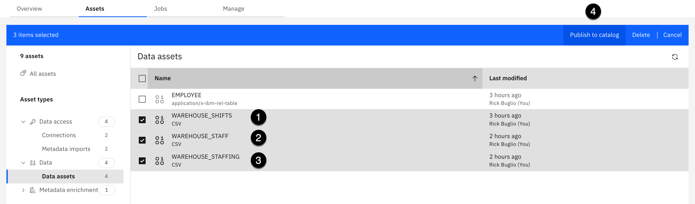

3.  Seleccione la casilla de verificación junto a la **WAREHOUSE_TURNOS** activo de datos.
4.  Seleccione la casilla de verificación junto a la **WAREHOUSE_STAFF** activo de datos.
5.  Seleccione la casilla de verificación junto a la **WAREHOUSE_PERSONAL** activo de datos.
6.  Seleccione la opción **Publicar en catálogo** en la barra de herramientas.

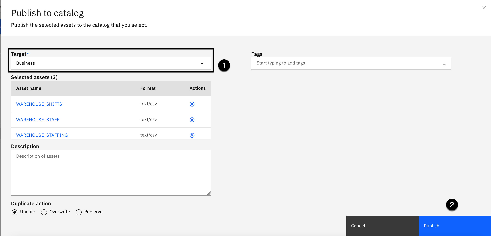

7.  Seleccione la opción **Empresas** catálogo como el **Objetivo** catalog (Debe seleccionarse de forma predeterminada).
8.  Haga clic en **Publicación**.

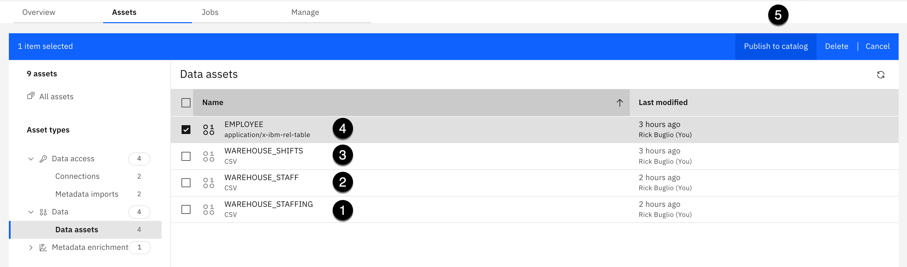

9.  Deseleccione el recuadro de selección junto a la **WAREHOUSE_TURNOS** activo de datos.
10. Deseleccione el recuadro de selección junto a la **WAREHOUSE_STAFF** activo de datos.
11. Deseleccione el recuadro de selección junto a la **WAREHOUSE_PERSONAL** activo de datos.
12. Seleccione la casilla de verificación junto a la **EMPLEADO** activo de datos.
13. Seleccione la opción **Publicar en catálogo** en la barra de herramientas.

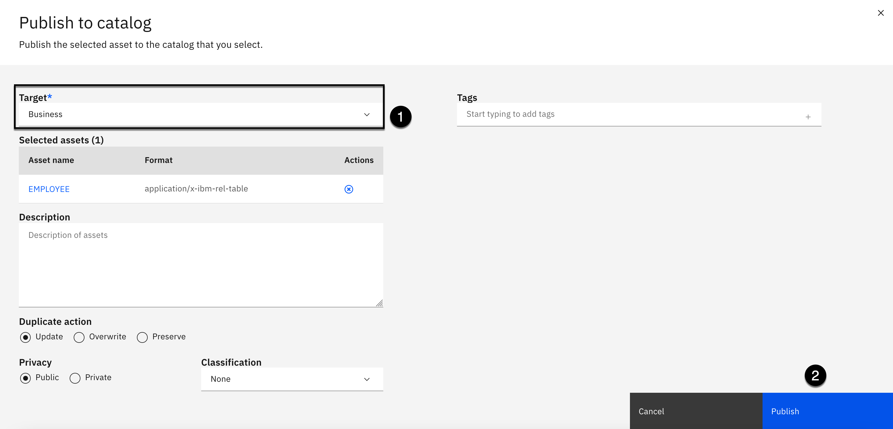

14. Seleccione la opción **Empresas** catálogo como el **Objetivo** catalog (Debe seleccionarse de forma predeterminada).
15. Haga clic en **Publicación**.

Ha publicado correctamente las conexiones y los activos de datos en **Empresas** de catálogo, y han terminado de trabajar desde el proyecto. Este proyecto es muy valioso y reutilizable, y el proceso de curación de datos es repetible. Puede modificar las importaciones de metadatos para añadir o eliminar activos y modificar el proceso de enriquecimiento de metadatos para mejorar el término de negocio y la precisión de asignación de clase de datos y aprender de los resultados. También puede realizar cambios en sentido ascendente, en los artefactos de gobierno del glosario empresarial, para mejorar la precisión de la curación de datos, volver a ejecutar el enriquecimiento de metadatos, revisar los resultados y volver a publicar activos existentes o publicar activos nuevos en el catálogo gobernado. Por lo que se le ha indicado que cambie la **Gestión de activos duplicados** opción a **Actualizar activos originales** cuando haya creado el catálogo.

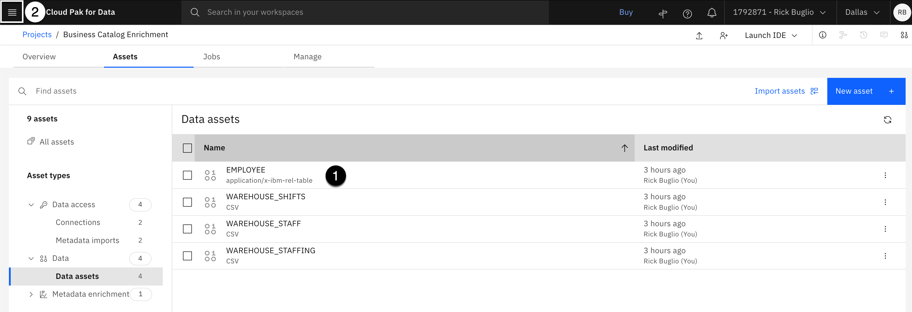

16. Deseleccione el recuadro de selección junto a la **EMPLEADO** activo de datos.
17. Seleccione la opción **Navegación** (las 4 líneas horizontales apiladas en la esquina superior izquierda).

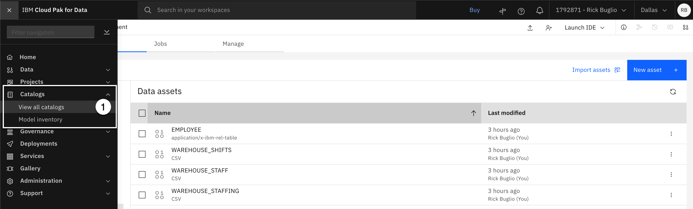

18. Seleccione la opción **Catálogo > Ver todos los catálogos**.

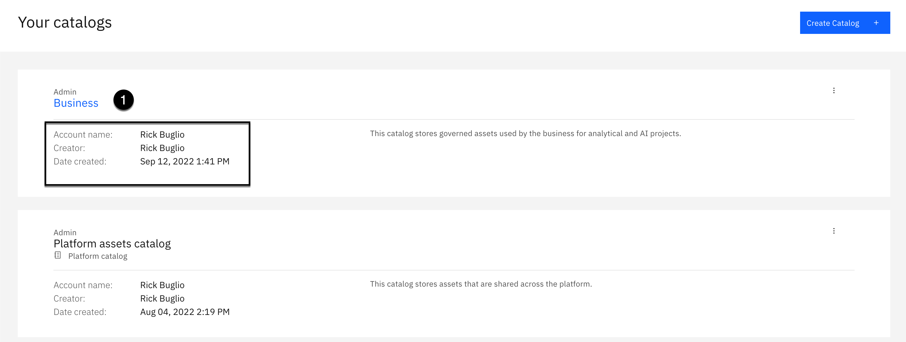

19. Seleccione la opción **Empresas** catalog (Asegúrese de que es el propio y puede administrar).
