# 106: Gestión de datos virtuales

Watson Query puede integrarse con Watson Knowledge Catalog para gobernar los datos virtuales que se publican en un catálogo gobernado. Esta sección es **optativo** para los vendedores técnicos y los business partners que estén interesados en aprender a gobernar los datos virtualizados en **Consulta de Watson** utilización de las características de gobernabilidad de datos de **Catálogo de conocimientos de Watson**. Esta sección utiliza un ejemplo de enmascaramiento muy simple basado en nombres de columna utilizando el **Redacción** método de enmascaramiento, para demostrar la integración entre los dos servicios con la menor cantidad de configuración y configuración. It **no** utilizar el **privacidad de datos avanzada** métodos de enmascaramiento definidos en el [Crear reglas de protección de datos](https://vest.buildlab.cloud/en/wkc/102#7-create-data-protection-rules) sección de este **Gobernanza de datos** laboratorio arriba.

#### Suministrar un servicio de catálogo de conocimientos de Watson
---

Antes de continuar, debe tener un **Catálogo de conocimientos de Watson** servicio suministrado en la misma cuenta de nube y región de nube donde **Consulta de Watson** el servicio se suministra. Si no es así, vaya al **Prestación de los Servicios** paso de la [Cómo empezar](https://vest.buildlab.cloud/en/wkc/getting-started) Sección de la **Laboratorio de tejido de datos** y siga las instrucciones para el suministro de uno.

## 1. Crear autorizaciones de servicio

Con el fin de **Consulta de Watson** para publicar en un catálogo gobernado y hacer cumplir **Catálogo de conocimientos de Watson** reglas de protección de datos, se debe crear un servicio a la autorización de servicio en su cuenta de IBM Cloud utilizando **Identificación y gestión de accesos** (IAM).

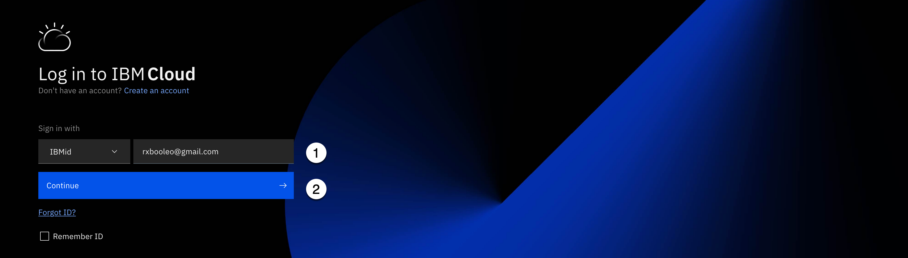

Ir a la [IBM Cloud](https://cloud.ibm.com/login) Iniciar sesión en la página.

1.  Especifique el ID de IBM.
2.  Seleccione la opción **Continuar**.

Cuando se le solicite, especifique la contraseña y las solicitudes de autenticación adicionales que se le presenten.

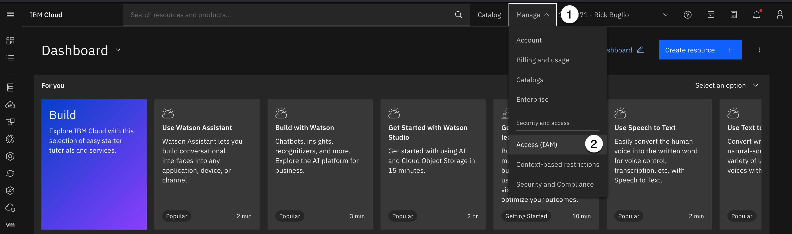

3.  Seleccione la opción **Gestionar** en la barra de herramientas.
4.  Seleccione la opción **Acceso (IAM)** elemento de menú.

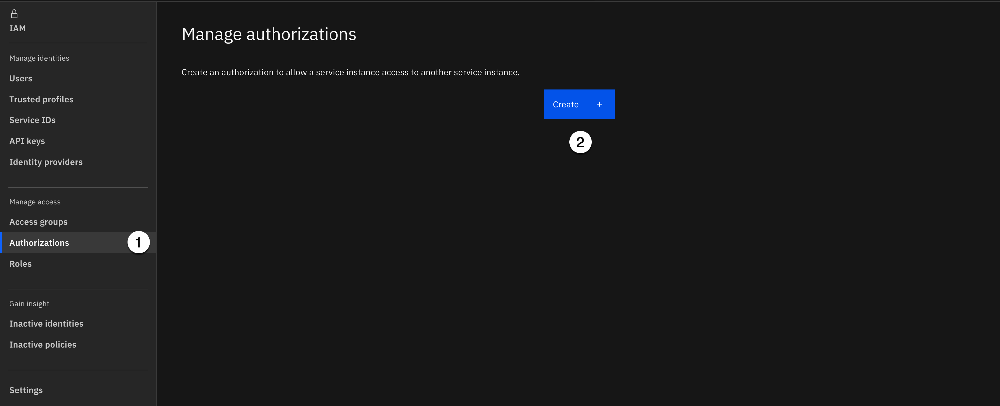

5.  Seleccione la opción **Autorizaciones** elemento de menú de la **Gestionar el acceso** del menú de la izquierda.
6.  Seleccione la opción **Crear**.

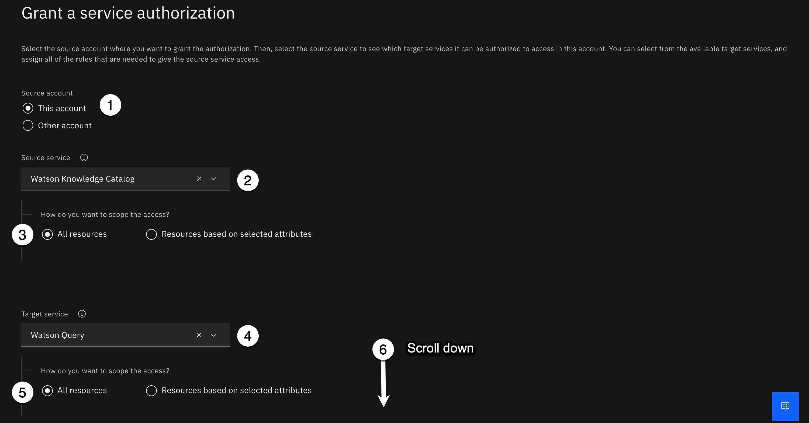

7.  Seleccione **Esta cuenta** como cuenta de origen. (Debe seleccionarse de forma predeterminada).
8.  Utilización de la **Servicio de origen** desplegable, empezar a escribir **Watson sabe** en el área de búsqueda, seleccione **Catálogo de conocimientos de Watson** de la lista de servicios.
9.  Seleccione la opción **Todos los recursos** para ver cómo desea ampliar el ámbito del acceso de servicio de origen.
10. Utilización de la **Servicio de destino** desplegable, seleccione **Consulta de Watson** de la lista de servicios. (Debe ser el único servicio listado).
11. Seleccione la opción **Todos los recursos** para ver cómo desea ampliar el ámbito del acceso de servicio de destino.
12. Desplácese **Abajo** en la parte inferior de la página de autorizaciones.

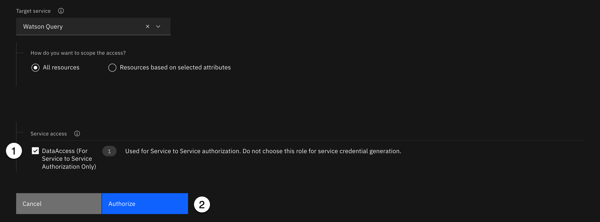

13. Seleccione el recuadro de selección **Acceso de servicio** Sección siguiente **DataAccess (sólo para autorización de servicio a servicio)**.
14. Haga clic en **Autorizar**.

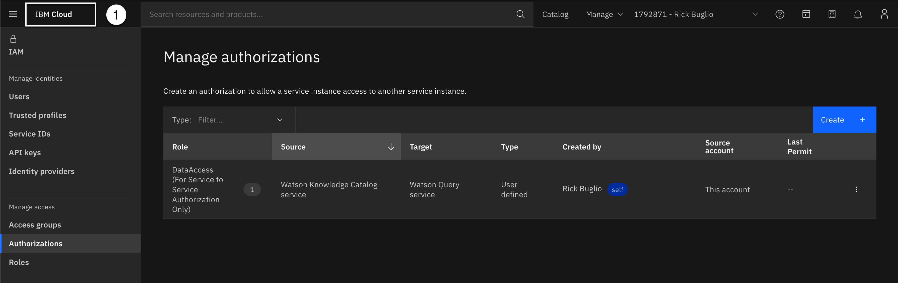

Verá el nuevo servicio a la autorización de servicio en su cuenta de nube en el **Gestionar autorizaciones**.

15. Seleccione la opción **IBM Cloud** en la esquina superior izquierda para volver a la página de inicio.

## 2. Crear catálogo gobernado

Para poder gobernar los datos virtuales en **Consulta de Watson** , usted necesitará un **gobernado** El catálogo que se crea en la misma cuenta que el **Consulta de Watson** El servicio se despliega. Este es un catálogo que se ha creado con el **Aplicar políticas de datos** opción habilitada. No puede utilizar el **Catálogo de activos de plataforma** porque es **no** un catálogo gobernado y no puede modificarse para convertirse en uno.

Si usted ha hecho el **Gobernanza de datos** laboratorio técnico, debe tener un catálogo gobernado creado en su cuenta. Si no es así, puede utilizar un catálogo gobernado existente, en la misma cuenta y región que el **Consulta de Watson** El servicio se despliega o crea un nuevo catálogo gobernado.

Si necesita crear un catálogo gobernado, vaya al [Crear el catálogo](https://vest.buildlab.cloud/en/wkc/104#1-create-the-catalog) de este laboratorio para instrucciones sobre cómo crear uno.

## 3. Crear regla de protección de datos

En este paso, creará una regla de protección de datos para proteger la información de tarjeta de crédito sensible en la **CLIENTE** activo de datos virtual, utilizando el **Redacción** Método de enmascaramiento, por lo que los valores no son visibles para aquellos que no tienen autorización para ver la información. Creará la regla de protección de datos utilizando **Nombre de columna** como criterio de la condición de regla para las columnas nombradas: **CREDIT_CARD_NUMBER**, **CREDIT_CARD_CVV**, y **CREDIT_CARD_EXPIRY**.

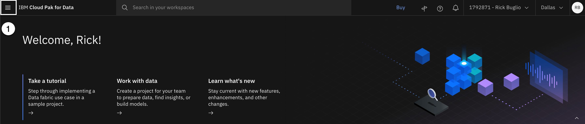

1.  Seleccione la opción **Navegación** (las 4 líneas horizontales apiladas en la esquina superior izquierda).

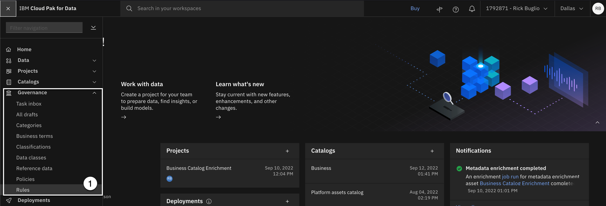

2.  Seleccione la opción **Gobierno > Reglas**.

3.  Utilización de la **Añadir regla** desplegable, seleccione **Nueva norma**.

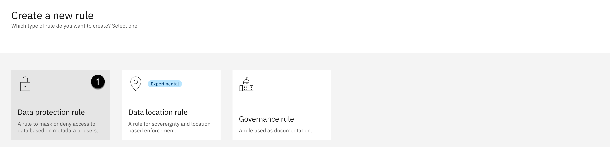

4.  Seleccione **Regla de protección de datos**.

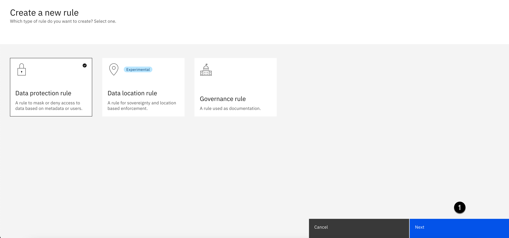

5.  Seleccione la opción **Siguiente**.

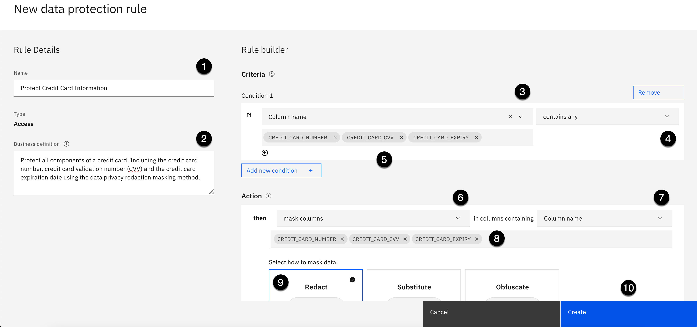

6.  Copie el texto siguiente y péguelo en el **Nombre** :

<CopyText text="Cómo proteger la información de tarjeta"/>

7.  Copie el texto siguiente y péguelo en el **Definición empresarial** :

<CopyText text="Proteger todos los componentes de una tarjeta de crédito. Incluyendo el número de tarjeta de crédito, el número de validación de tarjeta de crédito (CVV) y la fecha de vencimiento de la tarjeta de crédito utilizando el método de enmascaramiento de privacidad de datos."/>

Especificar la regla **Criterios** para **Condición 1** como sigue:

8.  Utilización de la **Si** desplegable de sentencias a la izquierda, seleccione **Nombre de columna**.
9.  Utilización de la **Si** desplegable de sentencias a la derecha, seleccione **contiene cualquiera**.
10. Copie el texto siguiente y péguelo en el **Nombre de columna** :

<CopyText text="CREDIT_CARD_NUMBER, CREDIT_CARD_CVV, CREDIT_CARD_EXPIRY"/>

11. Pulse el botón **Introduzca** o **Retorno** en el teclado.

Especificar la regla **Acción** como sigue:

12. Utilización de la **entonces** Declaración **Acción** desplegable a la izquierda, seleccione **columnas de máscara**.
13. Utilización de la **entonces** Declaración **en columnas que contengan** desplegable a la derecha, seleccione **Nombre de columna**.
14. El **CREDIT_CARD_NUMBER**, **CREDIT_CARD_CVV**, y **CREDIT_CARD_EXPIRY** Las columnas se rellenarán automáticamente para usted.
15. Seleccione **Redact** como método de enmascaramiento en la **Seleccionar método de enmascaramiento**.
16. Haga clic en **Crear**.

Usted debe ver un **¡Creado correctamente!** y vea la nueva regla creada.

17. Seleccione la opción **Normas** La indicación de ruta en la esquina superior izquierda para volver a la página principal de reglas.

El gobierno de datos ahora está configurado para **Consulta de Watson** a utilizar **Catálogo de conocimientos de Watson** para proteger la información sensible de tarjetas de crédito.
