# Technical Lab Preparation

This section instructs you on how to prepare your **IBM Cloud** and **Cloud Pak for Data as a Service** environments to perform the Data and AI **Data fabric labs**.

These tasks are a pre-requisite in order to perform **any** of the **Data fabric labs** successfully. These labs are **not** done in the shared, multi-user, pre-configured **Data and AI Live Demos** environment. That environment, which requires a reservation request, is primarily a read only environment that is used exclusively for the **Data fabric demos**. These technical labs require more flexibility and this is why you have to prepare your own Cloud Pak for Data accounts to do these labs.

You will need an **IBM Cloud** and **IBM Cloud Pak for Data as a Service** account to do these technical **Data fabric labs**. Depending on your account status, follow the steps below so you can use your personal IBM Cloud and Cloud Pak for Data as a Service account. This ensures that there will be zero conflicts with other users and services, that you have the proper cloud and Cloud Pak for Data as a Service privileges, and that no special naming conventions or processing will be needed for you to complete these technical labs.

To prepare your personal IBM Cloud and Cloud Pak for Data environments for these technical labs, you will perform the following steps:

1. Setup your personal IBM Cloud account.

2. Setup your personal IBM Cloud Pak for Data as a Service account.

3. Provision the IBM Cloud and Cloud Pak for Data as a Service **Lite** services.

4. Create the Cloud Pak for Data **Platform assets catalog**.

5. Create the **Platform connections** to the Data and AI Live Demos data sources.

**Warning:** Cloud Pak for Data does not support Apple's **Safari** browser. You must use one of the following supported browsers:

* Mozilla Firefox (recommended) - Version 69 and higher
* Google Chrome - Version 80 and higher
* Microsoft Edge - Version 95 and higher

## Obtain an IBM Cloud Account

**If you have an IBM Cloud account you can skip this step.**

If you **do not** have an IBM Cloud account, [click this link](https://cloud.ibm.com/registration) to create one. After registration, you will be sent an email to activate your account. This can take a few hours to process. Once you receive the confirmation email, follow the instructions provided in the email to activate your account.

## Sign Up for Cloud Pak for Data

The **Data and AI Live Demos** use Cloud Pak for Data services that are provisioned in the IBM cloud **Dallas** service region. This means you must use Cloud Pak for Data in the **Dallas** region, and register you account for a Cloud Pak for Data as a Service account in the **Dallas** region to do the Data fabric labs, **even** if you have an account in another region.

**If you have an IBM Cloud Pak for Data as a Service account in the **Dallas** region you can skip this step.**

If you have **not** signed up for an IBM Cloud Pak for Data as a Service account in the **Dallas** region, [click this link](https://dataplatform.cloud.ibm.com/registration/stepone?context=cpdaas&apps=all) to sign up for one in the **Dallas** region.

Follow the instructions below to complete the account registration process and setup your account in the Dallas region:

1. Use the **Select a region** dropdown to select the **Dallas** region for your Cloud Pak for Data instance.
    
2. Select the **checkbox** to agree to the terms.
    
3. Click the **Log in with your IBMId** button.

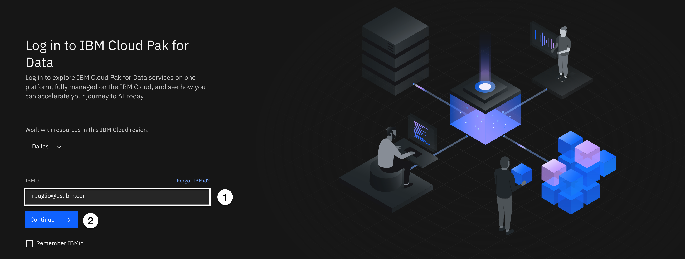

4. Enter your **IBMid**. This should be your IBM Cloud Id.
    
    If you have previously logged in to Cloud Pak for Data and checked the **Remember IBMid** check box, it may already be filled in for you. If you have multiple Cloud Pak for Data accounts, you can click inside the **IBMid** area above the **Continue** button and a list of your available IBM Ids will be displayed for you to choose from.
    
5. Click the **Continue** button.

**Note:** If prompted, and depending on the authentication method you are presented with, enter your IBMId or IBM w3id **password**.

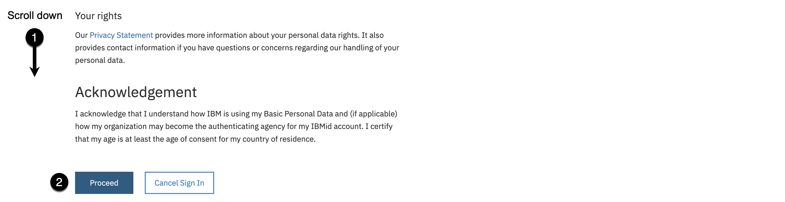

If you have not logged in to Cloud Pak for Data in a while, you might be presented with an IBM Privacy Statement that you have to agree to. If so, follow these steps:

6. Scroll **down** to the bottom of the privacy statement page.

7. Click the **Proceed** button.

You will see the **Provisioning your IBM Cloud Pak for Data core services** screen with a progress bar.

When **Done!** appears above the progress bar with a message of: **Your IBM Cloud Pak for Data apps are ready to use**:

8. Click the **Go to IBM Cloud Pak for Data** button.

If you are presented with a **Welcome to Cloud Pak for Data!** dialog:

9. Click the **Skip for now** button.

Now that you have an activated IBM Cloud account and have registered for a Cloud Pak for Data account in the **Dallas** region, you can proceed to the next step to request a reservation.

## Provision the Services

This step instructs you on how to provision the **free** IBM Cloud and Cloud Pak for Data **Lite** services that you will need to perform the technical **Data fabric labs**. These instructions were created using an empty IBM Cloud and Cloud Pak for Data account with no services provisioned for the benefit of those who have never setup their accounts with provisioned services. Therefore, your environment may look different than the screen shots in these instructions, but the end result should be the same.

Not all of the **Lite** service plans are in every cloud service region. For example, the IBM Match 360 with Watson and Watson OpenScale services are only available in the **Dallas** region. DataStage is only available in the **Dallas** and **Frankfurt** regions. Therefore, as you can imagine, this is a chaotic matrix of service availability. Therefore, to ensure inclusion, consistency, simplicity, and predictability, the **Data fabric labs** requires that **all** of the **Lite** services are provisioned in the **Dallas** region.

Some services take longer than others to provision, so do not be alarmed if a service status does not instantly appear after you provision them, or they have a status of **Provisioning**. By the time you are done provisioning all the required services they should all be in an **Active** status.

Lastly, if you make a mistake and choose a pricing plan other than the **Lite** plan, or assigned a service to the wrong resource group, you can **delete** the service from the Cloud Pak for Data **Services instances** section and re-provision the service again. All other changes, like renaming a service, have to be managed from your IBM Cloud account.

### 1. Required Services

For the technical labs, you will need to provision the following services:

| Service Catalog Category | Service Catalog Service Name  |
| ------------------------ | ----------------------------- |
| AI / Machine Learning    | Watson OpenScale              |
| ------------------------ | ----------------------------- |
| AI / Machine Learning    | Watson Studio                 |
| ------------------------ | ----------------------------- |
| AI / Machine Learning    | Watson Knowledge Catalog      |
| ------------------------ | ----------------------------- |
| AI / Machine Learning    | IBM Match 360 with Watson     |
| ------------------------ | ----------------------------- |
| AI / Machine Learning    | Watson Machine Learning       |
| ------------------------ | ----------------------------- |
| Databases                | Db2                           |
| ------------------------ | ----------------------------- |
| Databases                | Watson Query                  |
| ------------------------ | ----------------------------- |
| Databases                | DataStage                     |
| ------------------------ | ----------------------------- |
| Analytics                | IBM Cognos Embedded Dashboard |
| ------------------------ | ----------------------------- |
| Storage                  | Cloud Object Storage          |

**Note:** If you already have any of the services listed above already provisioned in your cloud account in the **Dallas** region, you can **skip** provisioning that service.

All of the services listed in the table above can be provisioned and maintained directly from the **Services** section of your Cloud Pak for Data account. After provisioning these services, you will remain in your Cloud Pak for Data account **except** when you provision the **Cloud Object Storage** service (which is why you provision it last). Since the **Cloud Object Storage** service is a global cloud service, Cloud Pak for Data will take you to your IBM Cloud account in a new tab (or window) in your browser to provision it.

### 2. DataStage Service

The following instructions walk you through provisioning the **DataStage** service as an example. The remaining service provisioning instructions **do not** supply detailed screen shots. Only the required service properties and suggested names will be supplied to provision the remaining **8** required services. With that in mind, take the time to follow the detailed **DataStage** instructions so the other services will be easy to provision.

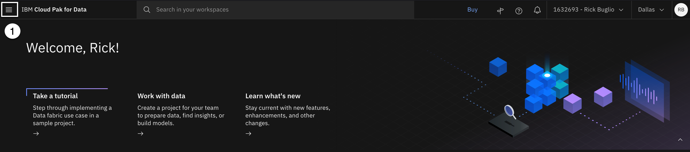

1. In your Cloud Pak for Data home screen, select the **Navigation** menu (the 4 stacked horizontal lines in the upper left corner).

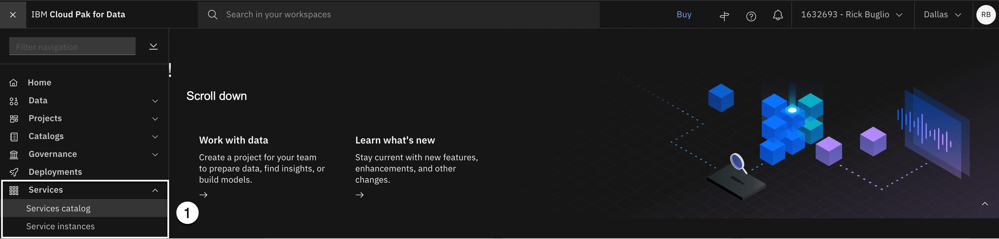

2. Select the **Services > Services catalog** menu item.

3. Select the **Databases** checkbox on the left.
    
4. Click the **DataStage** service tile (it's likely at the bottom).

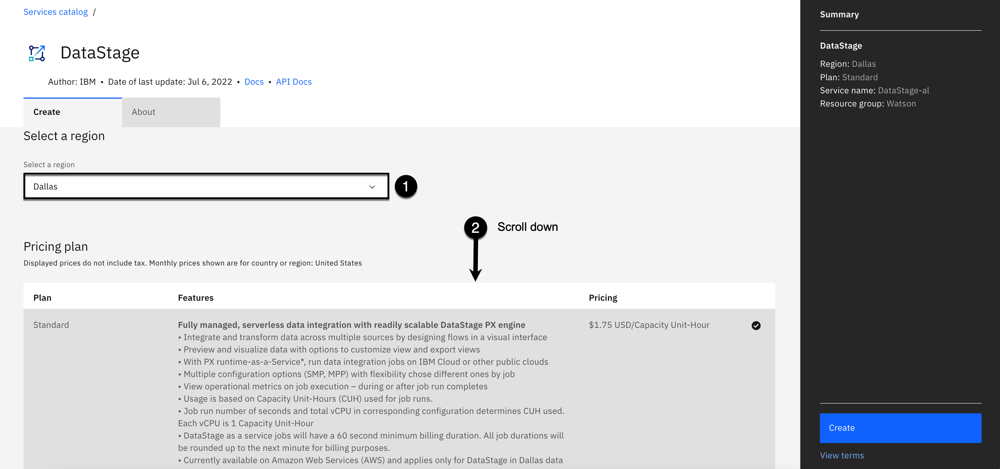

5. Using the **Select a region** dropdown, select the **Dallas** region from the list.

6. Scroll **down** the service page.

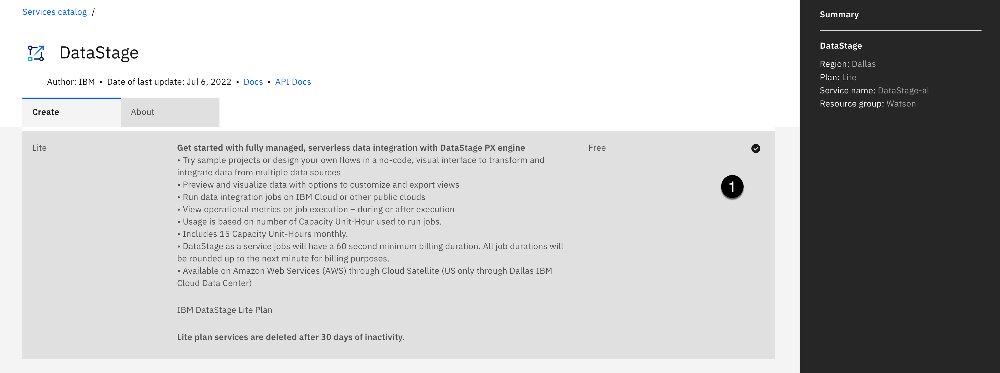

7. Select the **Lite** plan by clicking on this plan's tile. You will see a checkmark appear on the right of the Lite plan.

8. For the **Service name**, enter any name you want or accept the supplied default.
    
    **Note:** This example removes the **\--xx** default characters at the end of the service name and simply names it **DataStage**. You can name the service whatever you want, or take the default name.
    
9. Using the **Select a resource group** dropdown, select a resource group from the list or take the default displayed.
    
    **Note:** Services have to be assigned to a cloud account resource group. IBM Cloud automatically creates a resource group when you register for an IBM Cloud account. This resource group is named **Default**. If you have not created any additional resource groups, or renamed the **Default** resource group, you will only have one resource group and it will be automatically chosen for you and greyed out.
    
    This example shows a resource group named **Cloud Pak for Data** from the list because the cloud account, where these screen shots that were taken from, has multiple resource groups defined.
    
10. Click the **Create** button.

The **Create** button will be greyed out and turn to **Creating**.

Upon successful completion, you will be taken to your Cloud Pak for Data account **Service instances** section. **Make sure** (look at the **highlighted columns** on the screen shot) you deployed a **Lite** service **Plan**, that it was placed in the **Resource Group** you specified, and that the service **Status** is **Active**.

11. Click the **Add service +** button to create any additional required **Data fabric lab** services in the [Required Services](https://vest.buildlab.cloud/en/wkc/getting-started#1-required-services) table above.

Repeat the process you just followed to deploy the **DataStage** service for all the remaining required services using the information for each service. The **Service name** provided in the information for each service is only a recommendation. You can name these services whatever you want and assign them to whatever resource group you want. However, **make sure** you choose the **Lite** plan so you do not get charged for the services you provision.

### 3. AI / Machine Learning Services

You will create 5 services from the **AI / Machine Learning** category. They are listed in the order as they appear in this category in the Cloud Pak for Data interface. Follow the previous instructions for the following services in this category:

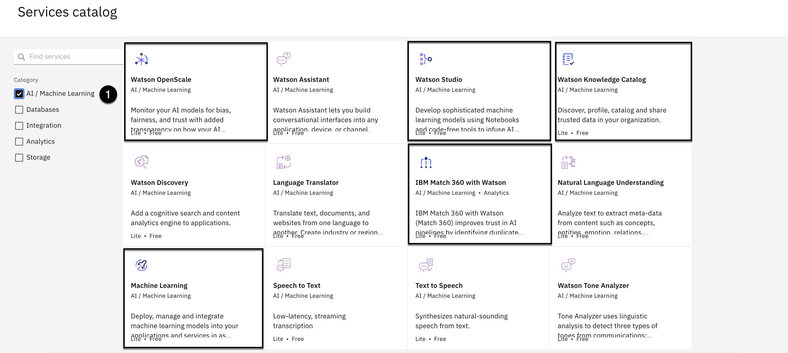

#### Watson OpenScale

1. Select the **AI / Machine Learning** checkbox on the left.

2. Click the **Watson OpenScale** service tile.

3. Using the **Select a region** dropdown, select the **Dallas** region from the list.

4. Click the **Lite** plan tile.

5. Enter a Service name of **Watson OpenScale** or whatever name you prefer.

6. Select the **Resource group** of your choice or take the default.

7. Click the **Create** button.

8. Verify the service was created successfully with the **Lite** plan.

9. Select the **Add service** button to add the next service.

#### Watson Studio

1. Select the **AI / Machine Learning** checkbox on the left.

2. Click the **Watson Studio** service tile.

3. Using the **Select a region** dropdown, select the **Dallas** region from the list.

4. Click the **Lite** plan tile.

5. Enter a Service name of **Watson Studio** or whatever name you prefer.

6. Select the **Resource group** of your choice or take the default.

7. Click the **Create** button.

8. Verify the service was created successfully with the **Lite** plan.

9. Select the **Add service** button to add the next service.

#### Watson Knowledge Catalog

1. Select the **AI / Machine Learning** checkbox on the left.

2. Click the **Watson Knowledge Catalog** service tile.

3. Using the **Select a region** dropdown, select the **Dallas** region from the list.

4. Click the **Lite** plan tile.

5. Enter a Service name of **Watson Knowledge Catalog** or whatever name you prefer.

6. Select the **Resource group** of your choice or take the default.

7. Click the **Create** button.

8. Verify the service was created successfully with the **Lite** plan.

9. Select the **Add service** button to add the next service.

#### IBM Match 360 with Watson

1. Select the **AI / Machine Learning** checkbox on the left.

2. Click the **IBM Match 360 with Watson** service tile.

3. Using the **Select a region** dropdown, select the **Dallas** region from the list.

4. Click the **Lite** plan tile.

5. Enter a Service name of **IBM Match 360 with Watson** or whatever name you prefer.

6. Select the **Resource group** of your choice or take the default.

7. Click the **Create** button.

8. Verify the service was created successfully with the **Lite** plan.

9. Select the **Add service** button to add the next service.

#### Watson Machine Learning

1. Select the **AI / Machine Learning** checkbox on the left.

2. Click the **Watson Machine Learning** service tile.

3. Using the **Select a region** dropdown, select the **Dallas** region from the list.

4. Click the **Lite** plan tile.

5. Enter a Service name of **Machine Learning** or whatever name you prefer.

6. Select the **Resource group** of your choice or take the default.

7. Click the **Create** button.

8. Verify the service was created successfully with the **Lite** plan.

9. Select the **Add service** button to add the next service.

### 4. Database Services

You will create 2 services from the **Databases** category. They are listed in the order as they appear in this category in the Cloud Pak for Data interface. Follow the instructions for the following services in this category:

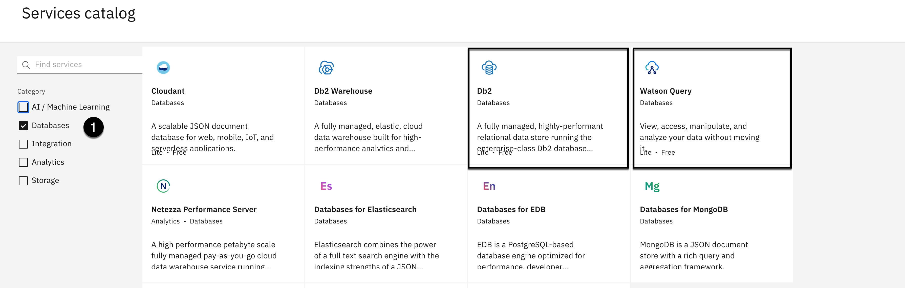

#### Db2

1. Select the **Databases** checkbox on the left.

2. Click the **Db2** service tile.

3. Using the **Select a region** dropdown, select the **Dallas** region from the list.

4. Click the **Lite** plan tile.

5. Enter a Service name of **Db2** or whatever name you prefer.

6. Select the **Resource group** of your choice or take the default.

7. Enter your work **Email** address or leave it blank. This is an **optional** field.

8. Click the **Create** button.

9. Verify the service was created successfully with the **Lite** plan.

10. Select the **Add service** button to add the next service.

#### Watson Query

1. Select the **Databases** checkbox on the left.

2. Select the **Watson Query** service.

3. Using the **Select a region** dropdown, select the **Dallas** region from the list.

4. Select the **Lite** plan.

5. Enter a Service name of **Watson Query** or whatever name you prefer.

6. Select the **Resource group** of your choice or take the default.

7. Leave all the **Node** settings to the default values (You can't change them anyway).

8. Click the **Create** button.

9. Verify the service was created successfully with the **Lite** plan.

10. Select the **Add service** button to add the next service.

### 5. Storage Service

You will create the **Cloud Object Storage** service from the **Storage** category:

1. Select the **Storage** checkbox on the left.

#### Cloud Object Storage

It is very likely that you already have a **Cloud Object Storage** service in your IBM Cloud account because when you sign up for Cloud Pak for Data as a Service, it is supposed to automatically provision a **Cloud Object Storage** service for you. But, this is not always the case. If you have this service, you can skip this section. Otherwise proceed with the instructions below:

1. Click the **Cloud Object Storage** service tile.

**Note:** Remember that this service creation will open up a new tab (or Window, depending on your browser settings) in your browser and take you to your IBM Cloud account. You will need to come back to this **Cloud Pak for Data** tab (or window) in your browser when the service creation is completed (so don't close it):

2. Click the **IBM Cloud** tile under the **Choose an Infrastructure** section.

3. Click the **Lite** plan tile.

4. Enter a Service name of **Cloud Object Storage** or whatever name you prefer.

5. Select the **Resource group** of your choice or take the default.

6. Click the **Create** button.

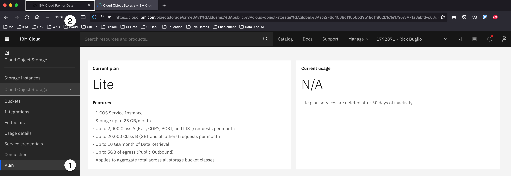

**Note:** Sometimes the **Cloud Object Storage** service takes a while to provision. If you are on the service page with a **spinning** wheel, wait a minute and then refresh the page using your browser's website refresh method. It will eventually show up, so be patient. When it does appear, complete the steps below:

After the service provisions successfully, you will be taken to the home page for the **Cloud Object Storage** service. Before you go back to your Cloud Pak for Data account, that should still be open in a tab (or window) in your browser, it's **critical** to verify that this service was created with the **Lite** plan.

7. Select the **Plan** menu item on the left side menu.
    
    **Make sure** you provisioned the **Lite** plan (the type of plan is prominently displayed on the web page).
    
8. Return to the **Cloud Pak for Data** tab (or window) in your browser to go back to your Cloud Pak for Data account.

## Validate the Services

You browser tab should still be on the **Services catalog** page where you chose to create the **Cloud Object Storage** service before you were taken to your IBM Cloud account.

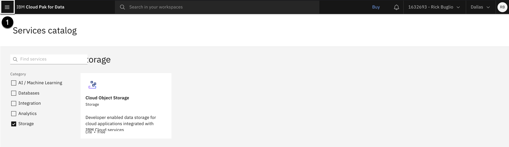

1. Select the **Navigation** menu (the 4 stacked horizontal lines in the upper left corner).

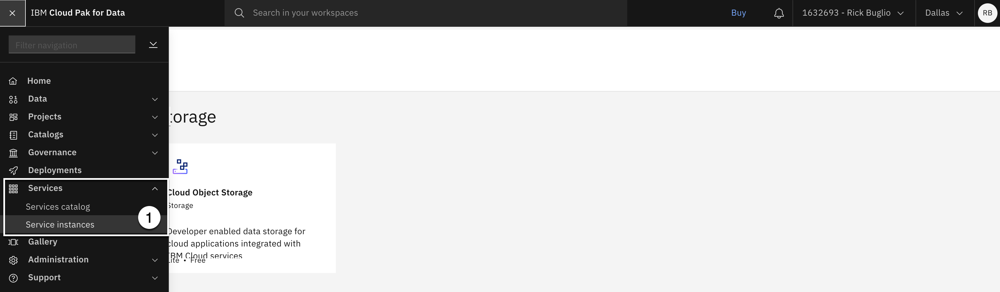

2. Select the **Services > Service instances** menu item.

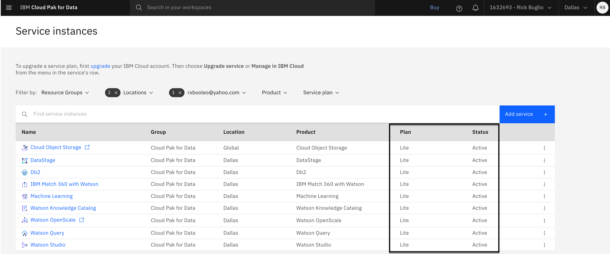

You should see your **9** provisioned **Lite** services in your Cloud Pak for Data account in alphabetical order by name. Make sure they are all **Lite** services with an **Active** status before proceeding to the next section. If you do not see all of your services that you were instructed to provision, they might be provisioned in different locations or under different resource groups. If that is the case, use the filters provided on top of the **Service instances** grid and select the **Locations** and **Resource Groups** you provisioned them in.

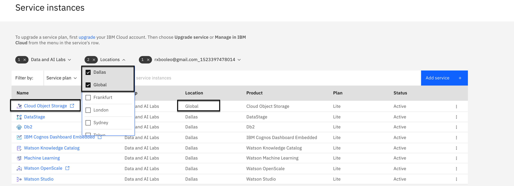

**Note:** Make sure you select the checkbox next to the **Global** location in the **Locations** filter because the **Cloud Object Storage** service is a global service and it will not show up in the service list if you don't select the **Global** location in the **Locations** filter. This is **critical** because if you do not select it from **Locations** filter it **will not** appear in the Cloud Pak for Data interface as a storage choice when you attempt to create a project or catalog.

If you have used Cloud Pak for Data as a Service before, you may have lots of other service instances. You can also use the search area at the top of the grid to dynamically filter your service instances.

**Stay in the Service instances** section to begin the instructions in the next section!

## Create Platform Asset Catalog

In this section you will create the **Platform assets catalog** that is needed by the **Data fabric** labs to house all global **Platform connections**. You will not be able to create **Platform connections** in the next section until you create the **Platform assets catalog**.

The following steps will verify what **catalogs** you have in your environment, and ensures that the **Watson Knowledge Catalog** service in your account is properly initialized, so you can take the appropriate actions if needed.

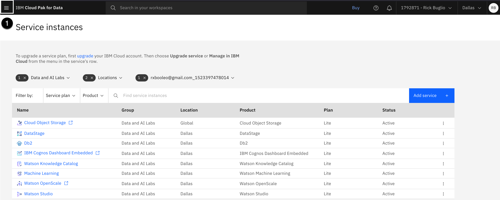

1. Select the **Navigation** menu (the 4 stacked horizontal lines in the upper left corner).

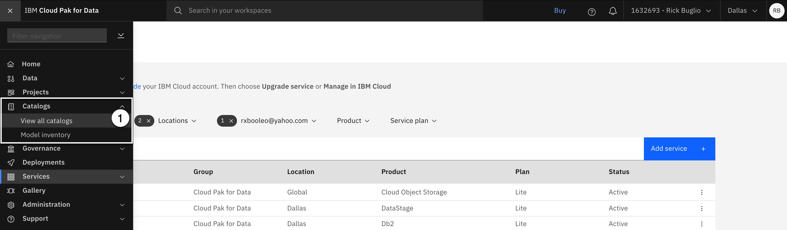

2. Select the **Catalogs > View all catalogs** menu item.

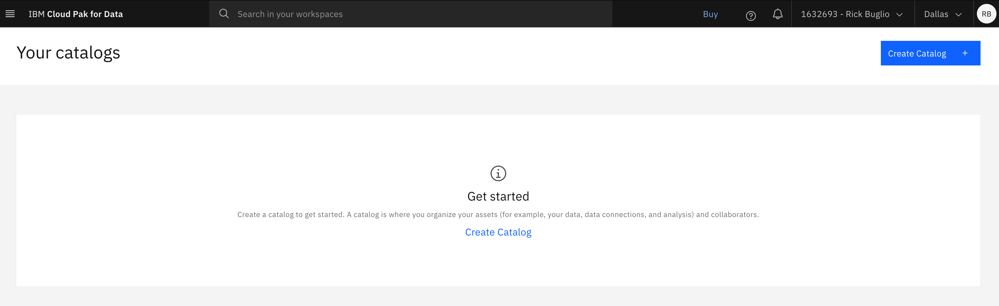

If you are in a new and fresh Cloud Pak for Data as a Service account, the catalog section in your Cloud Pak for Data environment will most likely look like the screen shot above.

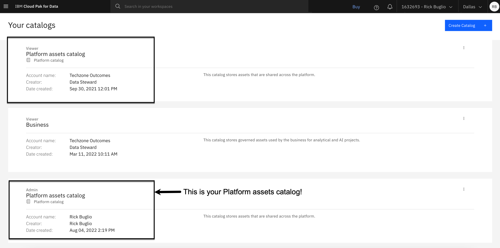

It is very possible that you already have a **Platform assets catalog** or that you have a **Platform assets catalog** from another cloud account and have other catalogs in your environment similar to the screen shot above.

If you have a **Platform assets catalog** like the screen shot above, that is **owned by you** with **Admin** authority, and **for your account** (not for another cloud account like the **Techzone Outcomes** one displayed), you already have a **Platform assets catalog** and do not have to create one. You can proceed to the next step to create platform connections.

If you do not have any catalogs, or do not have a **Platform assets catalog**, follow these steps to create a **Platform assets catalog**:

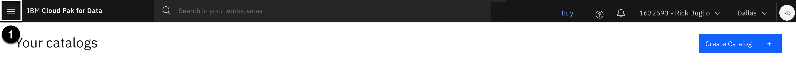

3. Select the **Navigation** menu (the 4 stacked horizontal lines in the upper left corner).

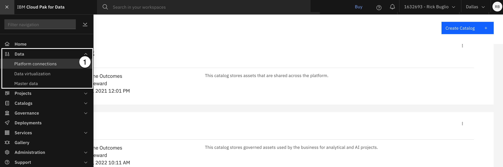

4. Select the **Data > Platform connections** menu item.

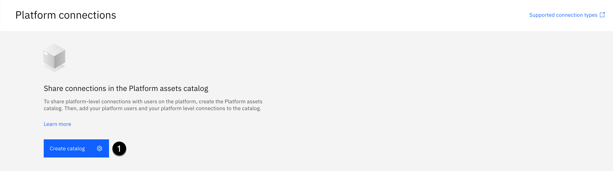

5. Click the **Create catalog** button.

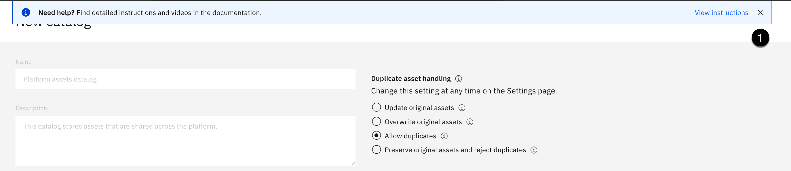

6. Select the **X** on the help message that appears at the top right to close it.

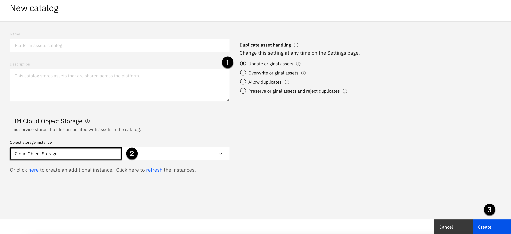

7. Select the **Update original assets** radio button for the asset handling option.
    
    **Note:** This is the recommended option. You can choose the option that works best for your environment. This option keeps any original assets and only updates missing or new values. This setting is dynamic so you can always change it at anytime.
    
8. Use the **Object storage instance** dropdown and select an object storage instance where you want to create the catalog.
    
9. Click the **Create** button.

A message is displayed notifying you that Cloud Pak for Data is creating the platform assets catalog and that it might take a minute.

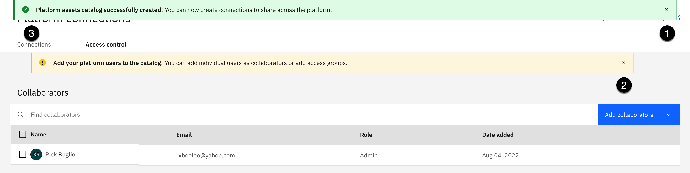

After the creation process is complete:

10. Click the **X** on the **Platform assets catalog successfully created!** message at the top to close it.

11. Click the **X** on the **Add your platform users to the catalog** message to close it.

12. Select the **Connections** tab.

## Create Platform Connections

In this section you will create the **Platform connections** that are used by the **Data fabric** labs. Take the time to define these connections **now** because you will be instructed to use them in the labs. If you don't create them now, they will not show up when you do the labs and you will have to come back to this section to define them because this is the **only** place this information is provided.

You will add 3 platform connections, that are also used by the **Data and AI Live Demos**, to house Employee, Customer, and Warehouse data:

| Name                 | Connection Type          |
| -------------------- | ------------------------ |
| Cloud Object Storage | IBM Cloud Object Storage |
| -------------------- | ------------------------ |
| Data Warehouse       | IBM Db2 Warehouse        |
| -------------------- | ------------------------ |
| Third Party Data     | PostgreSQL EDB           |

The screen shots in this section were captured in a new Cloud Pak for Data as a Service account that does not have any platform connections. If you already have platform connections, your environment may look different but the results should be the same.

### 1. Cloud Object Storage

Create a connection to the Cloud Object Storage bucket that contains the files needed by the Data fabric labs.

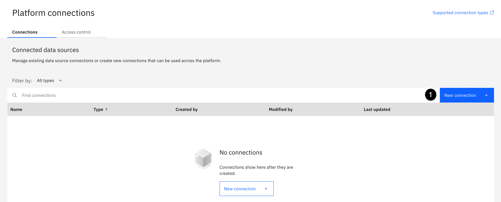

1. Click the **New connection +** button.

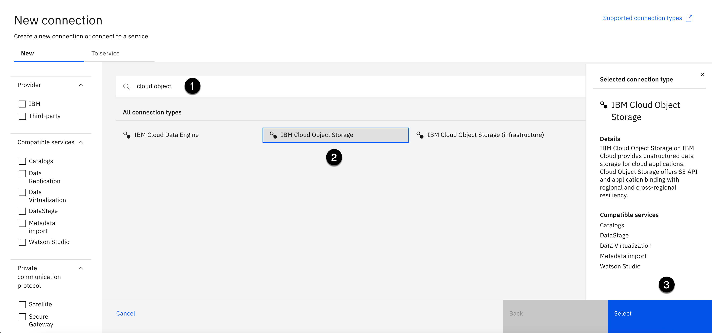

1. Type **cloud object** in the search area.

2. Select the **IBM Cloud Object Storage** connector.

3. Click the **Select** button.

Perform the following steps to complete the creation of the **Cloud Object Storage** connection:

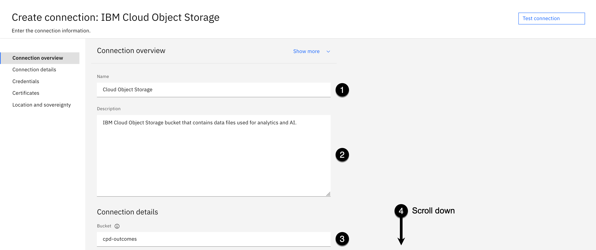

4. Copy the text below and paste it into the **Name** field:

<CopyText text="Cloud Object Storage"/>

2. Copy the text below and paste it into the **Description** field:

<CopyText text="IBM Cloud Object Storage bucket that contains data files used for analytics and AI."/>

3. Copy the text below and paste it into the **Bucket** field:

<CopyText text="cpd-outcomes"/>

4. Scroll **down** the page until the **Login URL** field is at the top of the page.

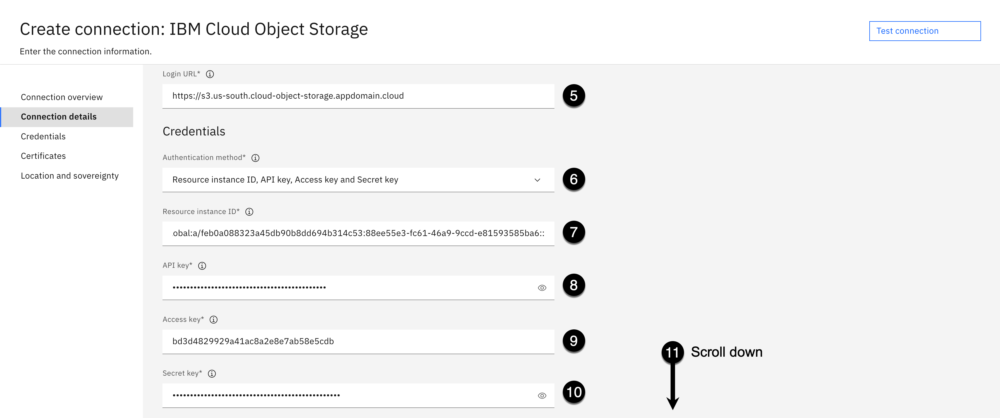

5. Copy the text below and paste it into the **Login URL** field:

<CopyText text="https://s3.us-south.cloud-object-storage.appdomain.cloud"/>

6. Using the **Authentication method** dropdown, select **Resource Instance Id, API Key, Access Key and Secret Key** as the authentication method from the list.

The **Resource instance ID** and **Access key** fields will appear.

7. Copy the text below and paste it into the **Resource instance ID** field:

<CopyText text="crn:v1:bluemix:public:cloud-object-storage:global:a/feb0a088323a45db90b8dd694b314c53:88ee55e3-fc61-46a9-9ccd-e81593585ba6::"/>
    
The **API key** field will appear under the **Resource instance ID** field.

8. Copy the text below and paste it into the **API key** field:

<CopyText text="_-W6DMVd3cQV7YrWIdmExhX29ApoDIBAu4y0C07dCMPB"/>

9. Copy the text below and paste it into the **Access key** field:

<CopyText text="bd3d4829929a41ac8a2e8e7ab58e5cdb"/>

The **Secret key** field will appear below the **Access key** field.

10. Copy the text below and paste it into the **Secret key** field:

<CopyText text="6f3fafc225b2c8527f22d13e2c67034f4da989dc08adffac"/>

11. Scroll **down** the page until you see the **Location and sovereignty** settings.

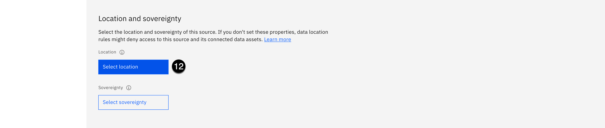

12. Click the **Select location** button.

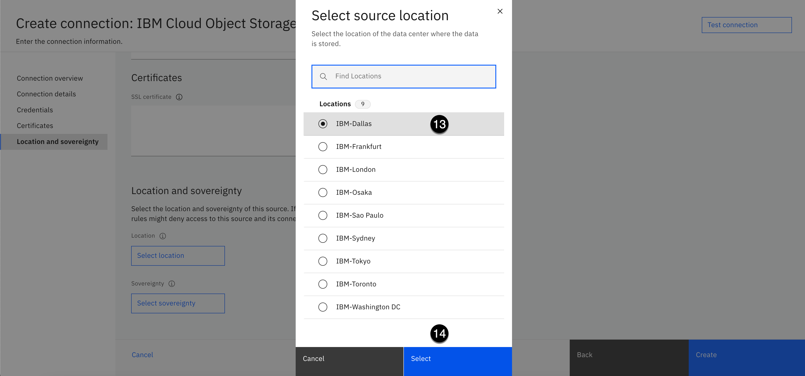

13. Select **IBM-Dallas** from the locations list.

14. Click the **Select** button.

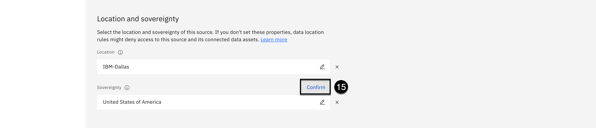

**United States of America** will be automatically filled in as the **Sovereignty**.

15. Click the **Confirm** confirmation link between the **Location** and the **Sovereignty** fields.

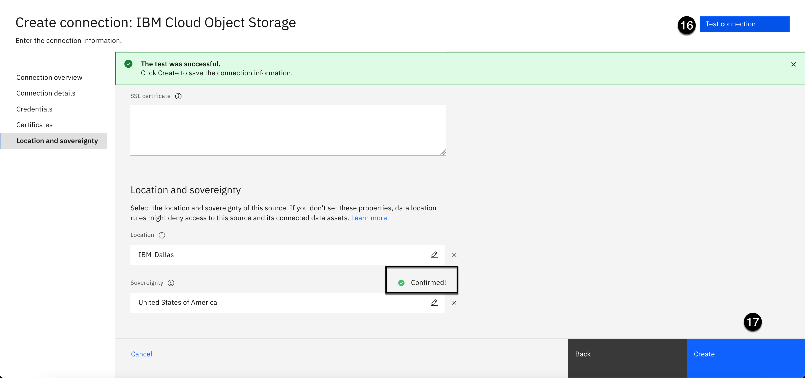

You will see a green check mark with a **Confirmed!** status.

16. Click the **Test connection** button in the upper right corner.

17. When the test is successful, dismiss **The test was successful** message and click on the **Create** button. If the test is **not** successful, loop back through all of the previous steps and make sure you entered everything correctly and try the test again. When it succeeds, select the **Create** button.

### 2. Data Warehouse

Create a connection to the Db2 Warehouse database that contains the data needed by the Data fabric labs.

1. Click the **New connection +** button.

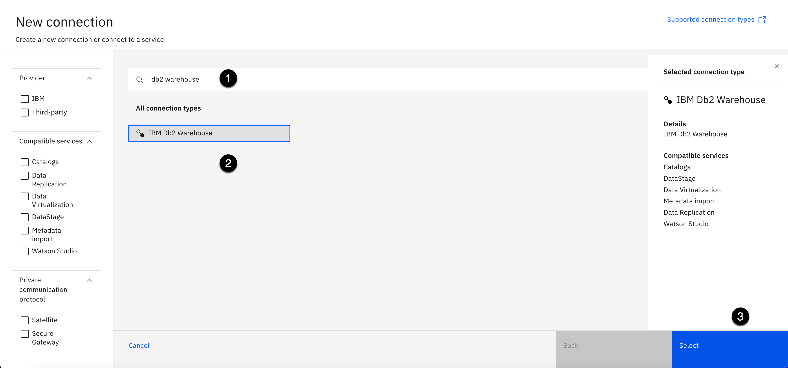

2. Type **db2 warehouse** in the search area.

3. Select the **IBM Db2 Warehouse** connector.

4. Click the **Select** button.

Perform the following steps to complete the creation of the **Data Warehouse** connection:

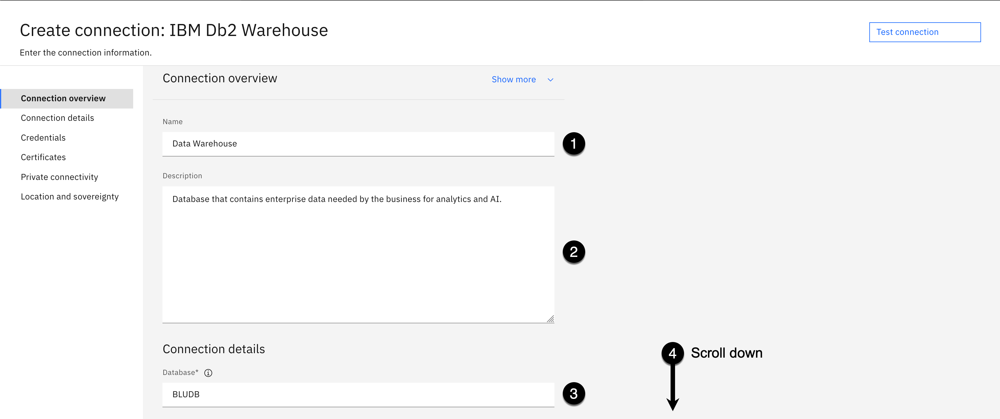

5. Copy the text below and paste it into the **Name** field:

<CopyText text="Data Warehouse"/>

6. Copy the text below and paste it into the **Description** field:

<CopyText text="Database that contains enterprise data needed by the business for analytics and AI."/>

7. Copy the text below and paste it into the **Database** field:

<CopyText text="BLUDB"/>

8. Scroll **down** the page until the **Hostname or IP address** field is at the top of the page.

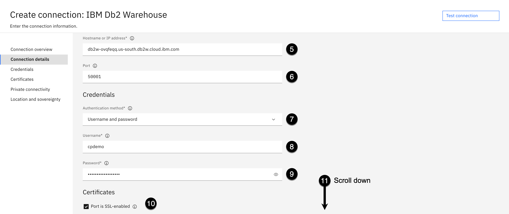

9. Copy the text below and paste it into the **Hostname or IP address** field:

<CopyText text="db2w-ovqfeqq.us-south.db2w.cloud.ibm.com"/>

10. The **Port** should be set to **50001** by default. Leave the default value.

11. Using the **Authentication method** dropdown, select **Username and password** from the list.

12. Copy the text below and paste it into the **Username** field:

<CopyText text="cpdemo"/>

13. Copy the text below and paste it into the **Password** field:

<CopyText text="C!oudP@k4DataDem0s"/>

14. The **Port is SSL-enabled** checkbox should be checked by default. Leave it checked.

15. Scroll **down** the page until you see the **Location and sovereignty** settings.

16. Click the **Select location** button.

17. Select **IBM-Dallas** from the locations list.

18. Click the **Select** button.

**United States of America** will be automatically filled in as the **Sovereignty**.

19. Click the **Confirm** confirmation link between the **Location** and the **Sovereignty** fields.

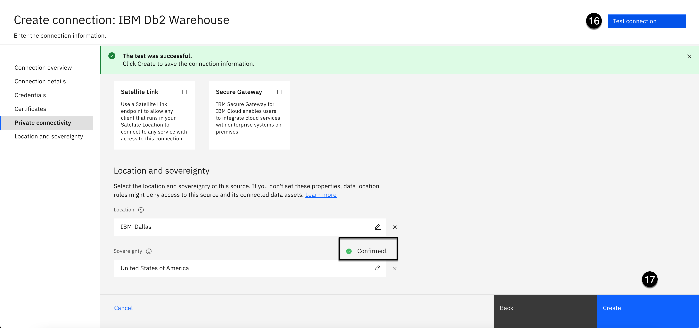

You will see a green check mark with a **Confirmed!** status.

20. Click the **Test connection** button in the upper right corner.

21. When the test is successful, dismiss **The test was successful** message and click on the **Create** button. If the test is **not** successful, loop back through all of the previous steps and make sure you entered everything correctly and try the test again. When it succeeds, select the **Create** button.

### 3. Third Party Data

Create a connection to the PostgreSQL database that contains the data needed by the Data fabric labs.

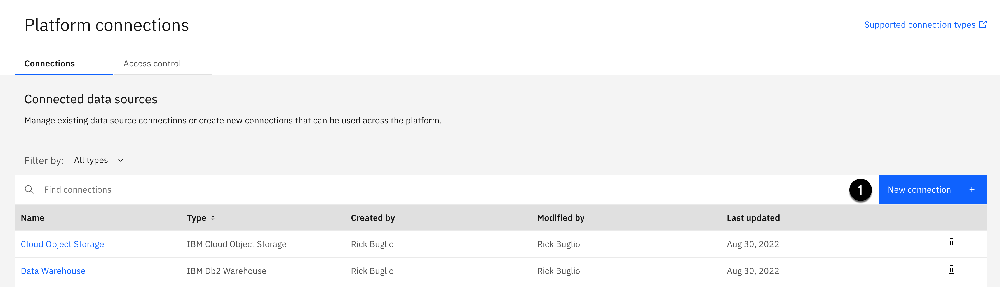

1. Click the **New connection +** button.

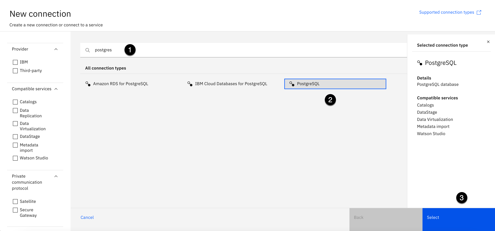

2. Type **postgres** in the search area.

3. Select the **PostgreSQL** connector.

4. Click the **Select** button.

Perform the following steps to complete the creation of the **Third Party Data** connection:

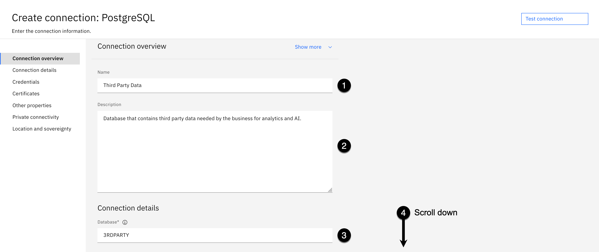

5. Copy the text below and paste it into the **Name** field:

<CopyText text="Third Party Data"/>

6. Copy the text below and paste it into the **Description** field:

<CopyText text="Database that contains third party data needed by the business for analytics and AI."/>

7. Copy the text below and paste it into the **Database** field:

<CopyText text="3RDPARTY"/>

8. Scroll **down** the page until the **Hostname or IP address** field is at the top of the page.

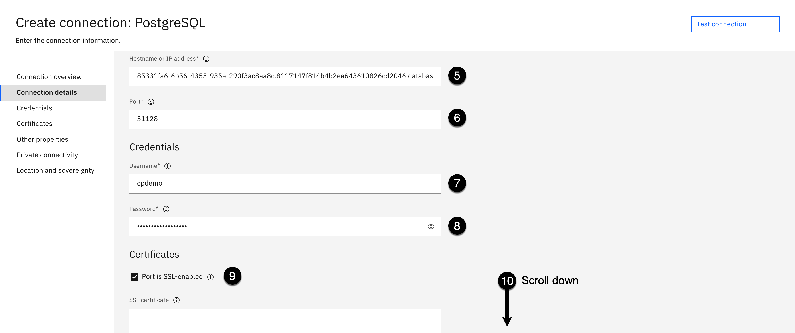

9. Copy the text below and paste it into the **Hostname or IP address** field:

<CopyText text="85331fa6-6b56-4355-935e-290f3ac8aa8c.8117147f814b4b2ea643610826cd2046.databases.appdomain.cloud"/>

10. Copy the text below and paste it into the **Port** field:

<CopyText text="31128"/>

11. Copy the text below and paste it into the **Username** field:

<CopyText text="cpdemo"/>

12. Copy the text below and paste it into the **Password** field:

<CopyText text="C!oudP@k4DataDem0s"/>

13. Select the checkbox next to the **Port is SSL-enabled** option.

14. Scroll **down** the page until you see the **Location and sovereignty** settings.

15. Click the **Select location** button.

16. Select **IBM-Dallas** from the locations list.

17. Click the **Select** button.

**United States of America** will be automatically filled in as the **Sovereignty**.

18. Click the **Confirm** confirmation link between the **Location** and the **Sovereignty** fields.

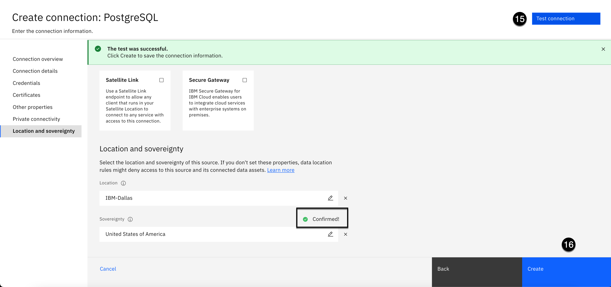

You will see a green check mark with a **Confirmed!** status.

19. Click the **Test connection** button in the upper right corner.

20. When the test is successful, dismiss **The test was successful** message and click on the **Create** button. If the test is **not** successful, loop back through all of the previous steps and make sure you entered everything correctly and try the test again. When it succeeds, select the **Create** button.

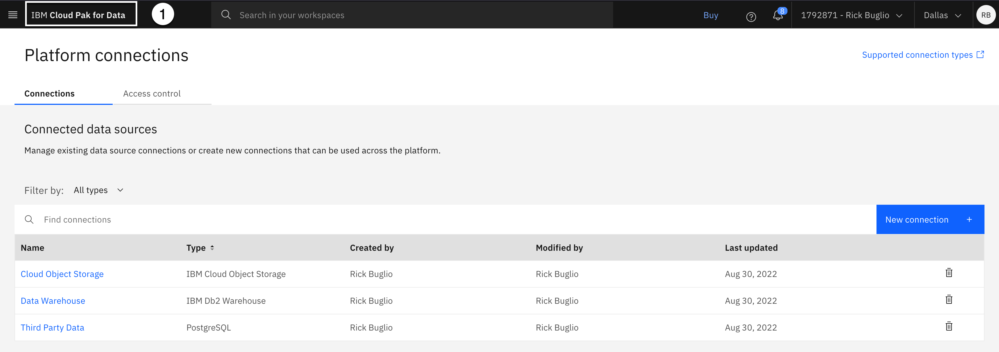

You should now see the **3** new connections in your **Platform connections** list.

21. Click the **IBM Cloud Pak for Data** label on the toolbar to go to the Cloud Pak for Data home page.

Congratulations! You have completed all the preparation steps and are ready to begin the Data fabric labs.

