# 101: Laboratorio práctico del Asistente Watson de IBM

## En esta sección

Explora cómo es un asistente virtual creado con watsonx Assistant desde la perspectiva de varias personas.

## Perspectiva del usuario final

Imagina que eres un usuario final. Vamos a explorar el asistente virtual de Lendyr Bank, construido con watsonx Assistant: [Lendyr.com ](http://lendyr.com/).

Haga clic en **Tell, Do, & Show** azulejo y luego haga clic en el asistente en la esquina inferior derecha. Trabaje a través del tour Tell, Do y Show.

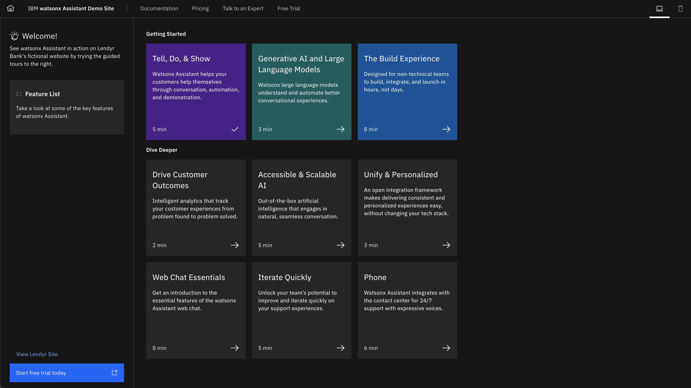

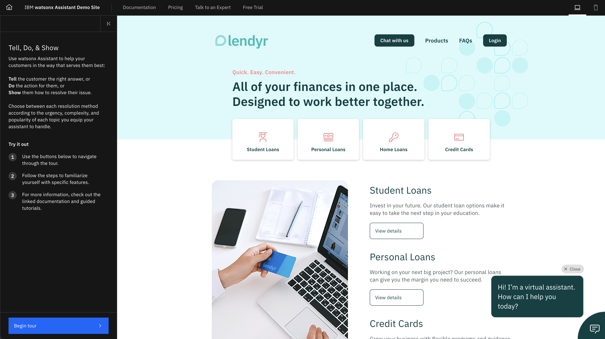

También puede intentar ejecutar algunas de estas conversaciones con el asistente:

| Conversación #1                                                                                                                                  | Conversación #2                                                                                                 | Conversación #3                                                                                                                                    | Conversación #4                   |
| ------------------------------------------------------------------------------------------------------------------------------------------------ | --------------------------------------------------------------------------------------------------------------- | -------------------------------------------------------------------------------------------------------------------------------------------------- | --------------------------------- |
| **Enviar:** Quiero solicitar un préstamo para estudiantes **Enviar:** ¿Cuál es el límite del importe del préstamo? **Enviar:** Vengo del instituto | **Enviar:** Hey, quiero usar la calculadora de hipotecas **Enviar:** 400.000 **Enviar**: en realidad que sean 300.000 | **Enviar:** hey quiero enviarme un millón de dólares a mi mismo **Enviar:** mañana **Enviar:** ¡¡¡¡¡ugh solo dejame hablar con una persona real!!!!! | **Enviar:** solicitud de préstamo |

Toma nota de las características y funcionalidades que veas en el asistente:

- Formular preguntas como usuario final
- Identificar la pregunta que formula el usuario final o la acción que desea realizar
- Permitir que el usuario final interrumpa la conversación
- Hacer algo diferente si el usuario final responde "sí" frente a si responde "no".
- Volver a empezar cuando algo va mal
- Un panel donde el usuario final mantiene la conversación con el asistente
- Sinónimos y contexto (préstamo que viene del instituto = será estudiante universitario)

## Configuración de watsonx Assistant

### Opción 1: IBM TechZone

Si es un empleado de IBM o un socio comercial de IBM, debe suministrar watsonx Assistant en IBM TechZone. Vaya a la [Colección de Watson Enterprise ](https://techzone.ibm.com/collection/watson-enterprise/environments)en TechZone, y haga clic en el **watsonx Assistant, Discovery con watsonx.ai** teja para reservar un entorno. Las secciones 1-6 de este laboratorio sólo utilizarán watsonx Assistant. Sin embargo, en la sección 7, también necesitará Watson Discovery y watsonx. Esa es la razón por la que está seleccionando el entorno con estos tres productos:

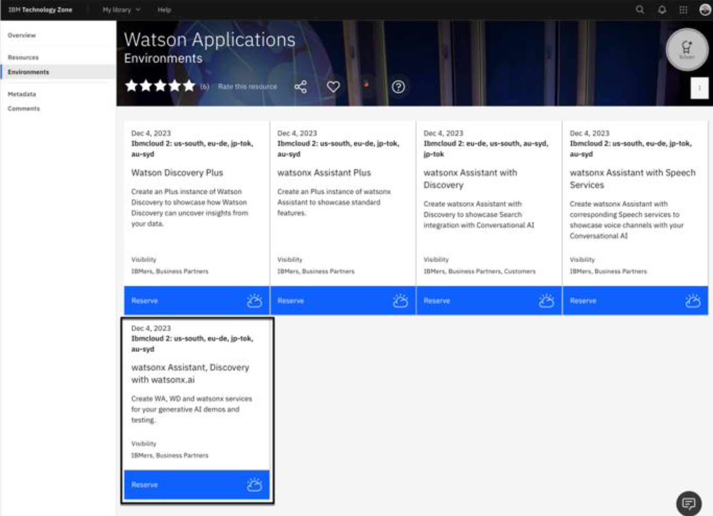

Esto le llevará a la página de reservas.

1.  Especifique un **Nombre** para la reserva que sea significativa para usted.
2.  En **Objeto:** , seleccione la opción **Práctica/Autoeducación** azulejo.
3.  Especifique un **Descripción del propósito**.
4.  Seleccione un **Geografía preferida**.
5.  Usted puede salir **Fecha y hora de finalización** as-is, as it defaults to the maximum of 2 days.
6.  Aceptar el **Términos y condiciones**.
7.  Pulse en **Presentar**.

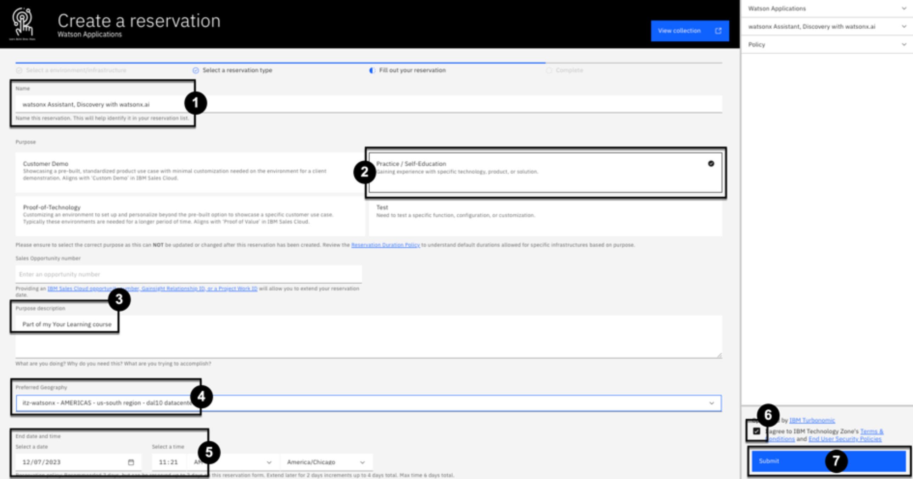

Pronto recibirá un correo electrónico que su entorno está suministrando. Suele tardar entre 10 y 15 minutos para que finalice el aprovisionamiento. Una vez que reciba un correo electrónico notificándole que su entorno TechZone está listo, ábralo y haga clic en **Ver mis reservas**:

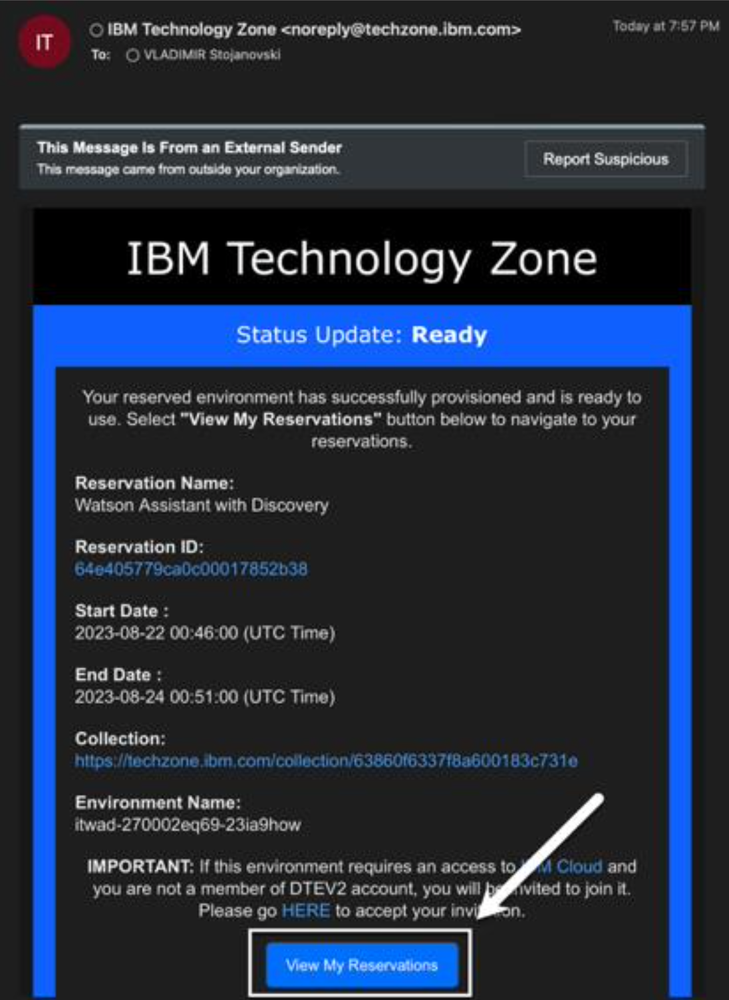

Esto le llevará a la **Mis reservas** página en TechZone. Pulse en el mosaico de la instancia recién suministrado:

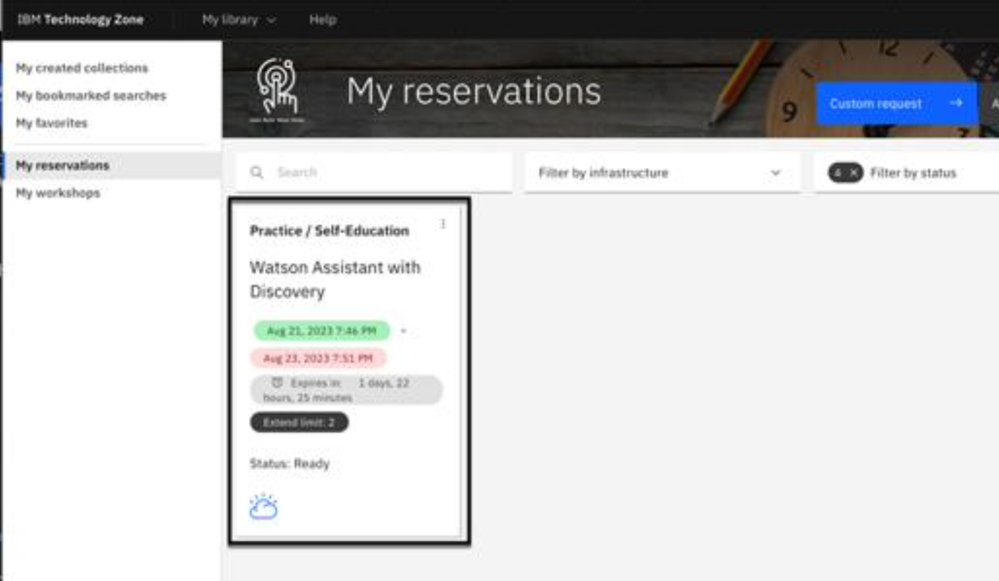

Se muestra la instancia de TechZone, junto con los enlaces a las instancias de Assistant, Discovery y watsonx.ai. Haga clic en **URL de watsonx Assistant** :

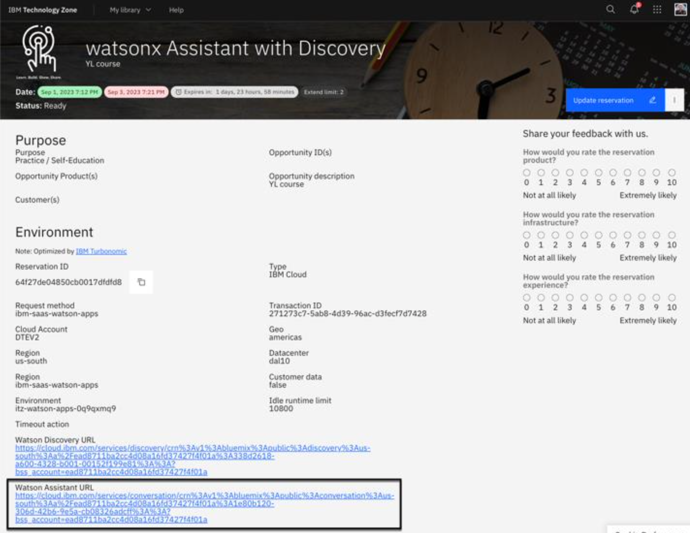

A continuación, como se muestra en la imagen siguiente, pulse el **Iniciar asistente de watsonx** para abrir la página de inicio de watsonx Assistant:

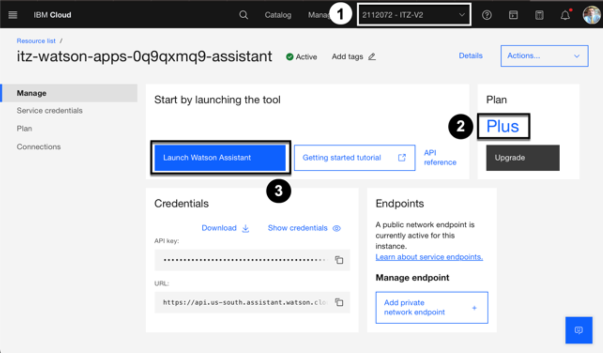

A continuación, puede saltar hacia adelante a la **Configurar el Asistente** a continuación. Un asistente de incorporación le guiará a través de la creación de su primer asistente.

### Opción 2: IBM Cloud

Si no es un empleado de IBM o un Business Partner de IBM, o si prefiere utilizar su cuenta personal de IBM Cloud para suministrar watsonx Assistant, empiece por [IBM Cloud ](https://cloud.ibm.com).

Si ya dispone de una instancia de prueba, Plus o Enterprise de watsonx Assistant, ábrala y cree un nuevo asistente. Si no dispone de una instancia de watsonx Assistant, siga estas instrucciones para crear una instancia de prueba gratuita.

Para crear una instancia de prueba gratuita, busque "watsonx Assistant" en la barra de búsqueda superior y haga clic en **watsonx Assistant** en **Resultados del catálogo**.

Ahora podemos crear nuestro asistente por:

1.  Seleccione la región más cercana a su ubicación.
2.  Seleccione el plan de precios **de prueba**. (Es la versión de prueba del plan de precios Plus).
3.  Acepte las **condiciones** generales.
4.  Haga clic en el botón **Crear** situado en la parte inferior derecha de la página.

Ahora vamos a validar la creación de nuestro nuevo asistente:

1.  Haga clic en el icono de la **lista de recursos** de la barra de navegación de la izquierda.
2.  Ampliar la sección **AI/Aprendizaje automático**
3.  Ahora deberías poder ver tu Asistente Watson recién creado

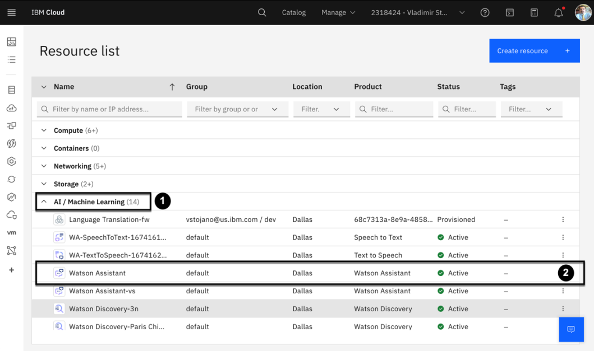

> Nota: El servicio que crees puede tener un sufijo, como "watsonx Assistant-hu". Estos nombres son identificadores para que puedas distinguir entre los múltiples servicios que puedas crear. Puede cambiarlos si lo desea.

Para iniciar watsonx Assistant, haz clic en el nuevo servicio que has creado. A continuación, haz clic en el botón **Iniciar Watson** Assistant para acceder a la página de inicio de watsonx Assistant.

## Configura tu asistente

1.  Introduce cualquier nombre que te guste en el campo **Nombre del asistente**.
2.  Introduzca una breve descripción en el **campo Descripción** (opcional).
3.  Pulse el botón **Siguiente** en la esquina superior derecha de la página.

En la siguiente pantalla, realice estas selecciones:

1.  Seleccione **Web** ya que se accederá a este asistente a través de un canal de navegador web.
2.  Seleccione **Banca y servicios financieros** como sector.
3.  Seleccione **Desarrollador** como nuestra persona constructora.
4.  Seleccione **Quiero dar respuestas seguras a preguntas comunes** como objetivo principal del asistente.
5.  Pulse el botón **Siguiente** en la parte superior derecha.

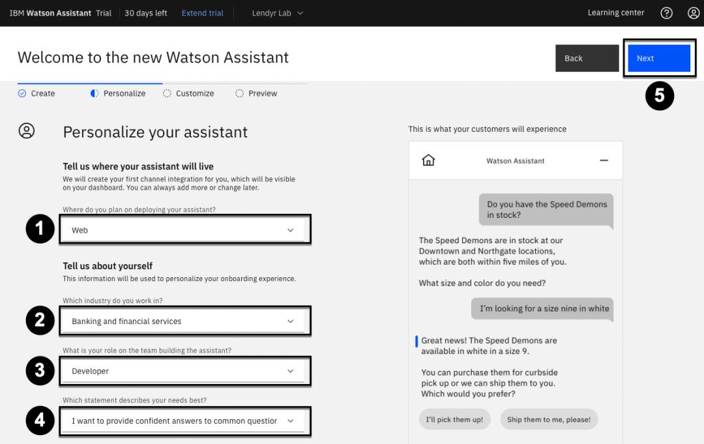

La siguiente pantalla le permitirá personalizar el aspecto de su asistente. Personalícelo ahora o haga clic de nuevo en el botón **Siguiente** de la parte superior derecha.

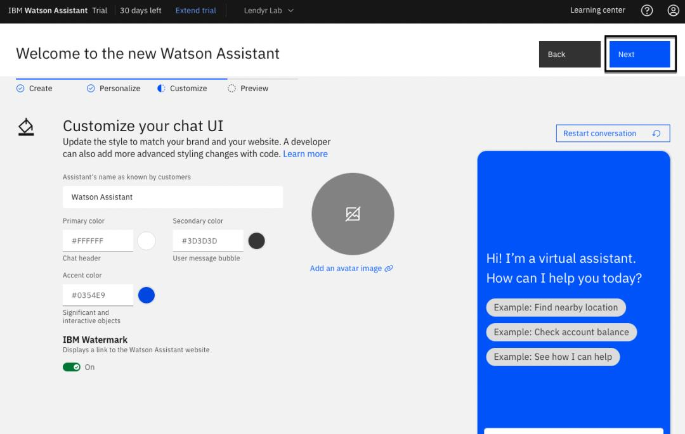

Esta pantalla le permite previsualizar el chat web del asistente. Pulse el botón **Crear** de la parte superior derecha.

Finalmente, como se muestra en la imagen inferior, verás la página de inicio de tu nuevo asistente.

## Perspectiva del constructor

Exploremos la persona del Constructor. Un constructor de conversación es responsable de escribir y mantener los flujos conversacionales existentes. Probablemente han trabajado en el servicio al cliente, la investigación de mercado o un área de enfoque relevante que llevó a este rol.

Para explorar su perspectiva, crearás una copia del asistente de demostración de Lendyr en el nuevo asistente que se ha creado.

En la página de inicio, haga clic en la pestaña **Acciones** del lado izquierdo. Aquí es donde un constructor escribe el contenido que un asistente virtual será entrenado para responder.

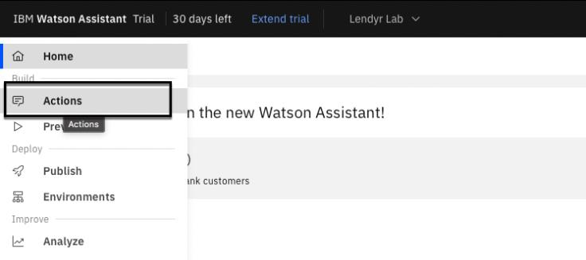

> Las acciones son una representación de las tareas en las que quieres que tu asistente ayude a tus clientes. Cada acción contiene una serie de pasos que representan intercambios individuales con un cliente. Las acciones te permiten construir un asistente que puede conversar fácilmente con un cliente **sin** necesidad de conocimientos de **codificación**.

Haga clic en el icono de engranaje de **Configuración global** en la parte superior derecha. Vamos a añadir algunas acciones predefinidas:

1.  Haga clic en **Cargar/Descargar**.
2.  Descargar [este archivo json ](https://raw.githubusercontent.com/CloudPak-Outcomes/Watson-Asst-Lab/main/action-skills/LendyrActions_v17_Live_lastchecked03Jan2023.json)y selecciónelo para subirlo.
3.  Haga clic en **Carga**.

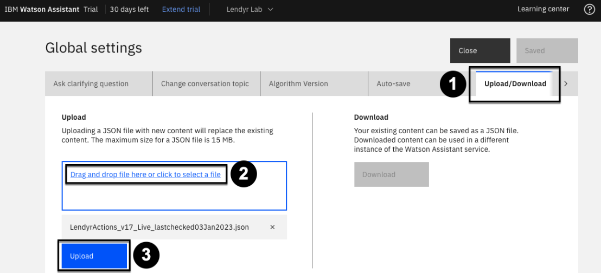

Si aparece una ventana modal, pulse **Cargar y sustituir**.

Ahora debería aparecer una notificación confirmando la carga. Por último, cierra la ventana de configuración global.

Tu asistente es ahora una copia del asistente de Lendyr.com! Siéntase libre de pasar unos minutos explorando la página Acciones.

Tenga en cuenta que el fondo del constructor no es técnico. ¿Qué significa esto para watsonx Assistant? watsonx Assistant está diseñado a propósito para ser accesible a cualquier persona, ya sea que tenga habilidades técnicas o no. Se organiza en torno a un modelo conceptual simple pero potente para las conversaciones. Este modelo facilita a los constructores no técnicos el autor de flujos conversacionales, y se escala bien en casos de uso grandes y complejos.

## Perspectiva del promotor

Vamos a explorar la perspectiva de un desarrollador. Un desarrollador es responsable de dar soporte a soluciones técnicas e innovación con un enfoque en la atención al cliente. Es probable que tengan antecedentes en o se les pidió explorar nueva tecnología de IA, lo que lleva a este proyecto.

Los desarrolladores también pueden trabajar en la página Acciones, pero suelen centrarse en funciones más técnicas. En la página de **inicio**, abre el menú de la izquierda y haz clic en **Integraciones** en la parte inferior izquierda.

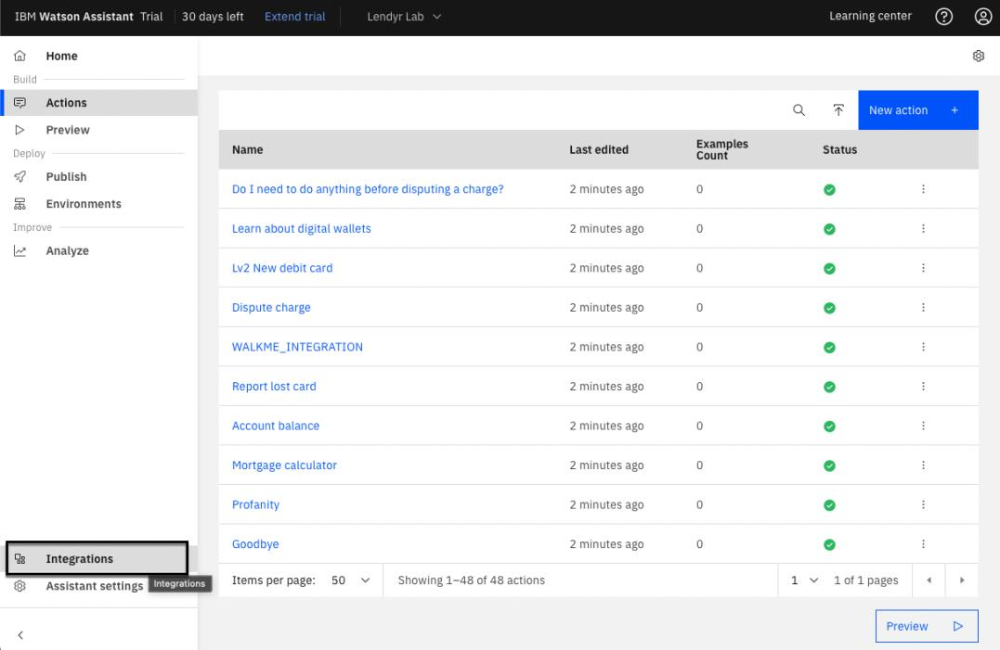

Las integraciones de watsonx Assistant añaden varios canales, extensiones e integraciones de terceros para configurar e implementar fácilmente tu asistente. Dedica unos minutos a explorar la página Integraciones.

Los desarrolladores dedican más tiempo a las características técnicas que a la página Acciones, donde los creadores crean nuevos flujos conversacionales. ¿A qué se debe? Dado que el Asistente Watson está diseñado a propósito para facilitar a los creadores no técnicos la creación de flujos conversacionales, los desarrolladores pueden centrarse en las partes de un asistente virtual que requieren sus conocimientos técnicos, como las integraciones con otras aplicaciones.

## Perspectiva del jefe de producto

Por último, exploremos la perspectiva de un gestor de productos. Un gestor de productos es responsable del éxito general de los asistentes desplegados por la organización. Realizan un seguimiento del rendimiento del asistente, del constructor asistente principal y de los equipos de desarrolladores, y colaboran con todas las partes interesadas.

Los jefes de producto pueden trabajar en las páginas Acciones e Integraciones, pero normalmente se centran en el éxito general, la mejora continua y la expansión. Utilice el menú de la izquierda para explorar las páginas **Publicar**, **Entornos** y **Analizar**.

**Publicación** es una forma de mantener un proceso de gestión de ciclo de vida saludable. Puede crear versiones incrementales del contenido a lo largo del tiempo, lo que facilita la gestión del despliegue de cambios y retrotrae (revertir) a versiones anteriores si es necesario.

**Entornos** son espacios que contienen una versión de su contenido y configuración. Todos los asistentes vienen preestablecidos con un Draft y un entorno Live. El entorno Borrador le permite realizar cambios y probar su asistente, mientras que el entorno Live contiene la versión publicada actual.

El **Analizar** proporciona un resumen de las interacciones entre los usuarios y su asistente. Esto le dará una visión en profundidad de lo que sus clientes están buscando de su asistente, así como lo bien que su asistente está resolviendo sus necesidades actualmente.

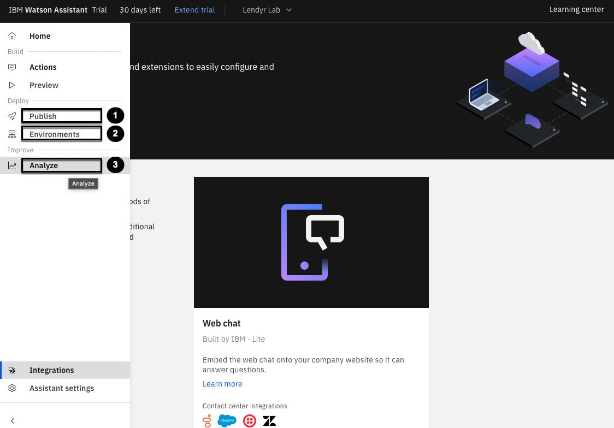

## Conclusión

Al explorar watsonx Assistant a través de estas distintas personas, ha señalado que los desarrolladores pasan más tiempo en las integraciones técnicas, y los constructores pasan más tiempo en la experiencia de creación no técnica.

Al gestor de productos le gusta realmente que watsonx Assistant fomente esta especialización del trabajo. ¿Porqué? Porque es *caro* al personal de un gran equipo técnico para mantener un asistente virtual! Con watsonx Assistant, un gestor de productos puede formar un equipo con constructores no técnicos, que se centran en los flujos conversacionales y los desarrolladores, que se centran en la implementación técnica y las integraciones. De esta forma, el gestor de productos puede crear, mantener y escalar una gran solución con un equipo más pequeño, reduciendo su coste total de propiedad.

A medida que aprendes más sobre watsonx Assistant en este laboratorio, también notarás que watsonx Assistant facilita la colaboración de constructores y desarrolladores. Por ejemplo, los desarrolladores pueden repartir el trabajo de flujo de conversación a los constructores, que pueden crear los flujos sin ningún código. Esto elimina las dependencias entre constructores y desarrolladores, lo que les permite trabajar juntos *más rápido*. Los equipos colaboran más eficazmente con watsonx Assistant, acelerando el tiempo de todos para valorar.

