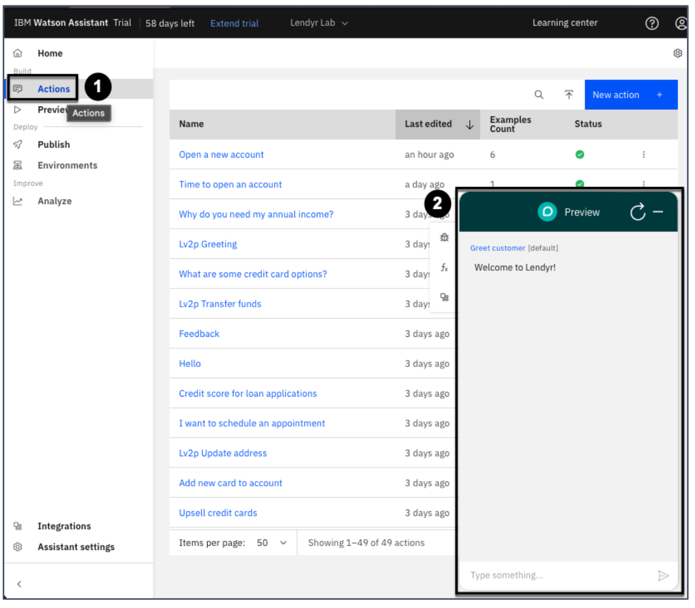
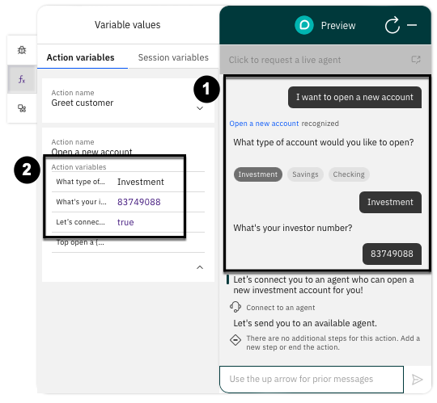

# 103: Inteligencia artificial fuera de la caja

## En esta lección

<QuizAlert text='Atención! Partes de esta sección estarán en el cuestionario.'/>

Más información sobre la inteligencia artificial que se ejecuta de forma automática en watsonx Assistant.

## Requisitos previos

Completa esta sección con el asistente que utilizaste en la sección 102 **o** con tu propio asistente. Si desea utilizar su propio asistente, debe [cargar](https://cloud.ibm.com/docs/watson-assistant?topic=watson-assistant-admin-backup-restore#backup-restore-import) la siguiente [habilidad Acción](https://raw.githubusercontent.com/CloudPak-Outcomes/Watson-Asst-Lab/main/action-skills/begin-103-action-skill.json) que refleja la habilidad después de completar la sección 102. Pero tenga en cuenta que esto sobrescribirá sus acciones existentes.

## Véase Desambiguación en el trabajo

Para ver las puntuaciones de confianza, debe estar en la ventana Vista previa dentro de la página Acciones de su asistente. Vuelva a la página **Acciones** de su asistente y abra la Vista **previa**.

Diga "apertura de cuenta" y anote la pregunta aclaratoria que le hace su asistente en respuesta a la entrada.

Para ver las puntuaciones de confianza de su asistente:

1.  Haz clic en el icono del **modo Depuración**.
2.  Pase el ratón por encima del **icono del dial** que aparece junto al mensaje de "apertura de cuenta".
3.  Esto mostrará las puntuaciones de confianza como porcentajes.

## Autoaprendizaje

Cuando los usuarios finales interactúan con su asistente, le proporcionan muchos datos sobre su comportamiento. watsonx Assistant presta atención a esto y aprende de dichos comportamientos con el tiempo.

Considere la desambiguación. Cuando su asistente formula una pregunta aclaratoria y muestra una lista de acciones sugeridas, si los usuarios finales suelen hacer clic en la misma opción (la nº 2, por ejemplo), su asistente debería aprender (¡y de hecho lo hace!) de esa experiencia.

Aprende que la opción nº 2 es probablemente la mejor respuesta a ese tipo de pregunta. La próxima vez, puede incluir la opción 2 como primera opción, para que los usuarios finales puedan acceder a ella más rápidamente.

Y, si el patrón persiste en el tiempo, el asistente puede cambiar aún más su comportamiento. En lugar de pedir al cliente que elija entre una lista de opciones, elegirá la opción n.º 2 como respuesta, en lugar de pedir aclaraciones.A medida que watsonx Assistant aprende, los usuarios finales obtienen la mejor respuesta más a menudo, en menos clics, ¡y su experiencia mejora!

## Digresión / Cambio de tema de conversación

### ¿Qué es una digresión?

Las personas a menudo nos distraemos o cambiamos de tema durante una conversación. Por ejemplo, imagina que te estoy contando una historia increíblemente interesante sobre ver a mi amigo Arvind con prismáticos. Para ti, puede que no sea ni mucho menos la historia más interesante que hayas oído nunca. Podrías interrumpirme y decir: "¡Vaya! Además, antes de que se me olvide, he conseguido unas entradas baratas para ver a los Jets el mes que viene. ¿Quieres venir conmigo?".

Los usuarios finales también quieren poder cambiar de tema cuando interactúan con un asistente virtual. watsonx Assistant es flexible: puede pasar de una acción a otra sin problemas cuando el usuario final desea un cambio.

### Ver Digresión en el trabajo

He aquí un ejemplo de digresión en la que el Asistente Watson se mueve entre diferentes acciones:

1.  En la **vista previa** escribe "Estoy pensando en solicitar un préstamo para estudios".
2.  Tenga en cuenta que el asistente reconoce la **solicitud de una** acción de **préstamo estudiantil**.
3.  Ahora escribe "¿Cuánto podemos conseguir en préstamos?".
4.  Tenga en cuenta que el asistente se desviará a la acción **Importes de préstamos a estudiantes**.
5.  A continuación, una vez completada la acción **Importes del préstamo** para estudiantes seleccionando "Pregrado", el asistente vuelve a la acción original "Solicitar un préstamo para estudiantes".

## Relleno de ranuras

El término slot-filling hace referencia al almacenamiento de información que el usuario final comparte con el asistente. Se puede pensar que el asistente almacena cada dato en una ranura.

Para verlo en acción:

1.  Abra una vista **previa** del asistente desde la página **Acciones**.

    - Si tiene abierta una vista previa activa, haga clic en el botón Actualizar.

2.  Pulse el botón `fx` para ver las ranuras que mantiene el asistente.

3.  Introduzca algunas de estas expresiones:

    - "Quiero abrir una nueva cuenta"
    - "Inversión"
    - "837479088"

4.  Observe cómo se rellenan los datos en la ventana **Variable de acción**

Esto, por sí mismo, no es una característica de inteligencia artificial. La inteligencia artificial entra en juego cuando el usuario final se corrige a sí mismo o proporciona información fuera de orden o antes de tiempo.

Pulsa **Actualizar** y di "Quiero abrir una cuenta nueva y mi cuenta de inversor es 8875888", y luego selecciona "inversión" para el tipo de cuenta. Tenga en cuenta que el Asistente Watson coloca el número de inversor en su ranura, aunque usted le haya dicho previamente al Asistente Watson que lo espere en un paso posterior.

## Desactivar la digresión y la desambiguación

<QuizAlert/>

Aunque la digresión y la desambiguación están activadas por defecto para todas las acciones, los constructores pueden activar o desactivar la desambiguación y la digresión, ya sea en todo el asistente o para acciones específicas.

Cuando la desambiguación está desactivada en todo el asistente, éste nunca pedirá aclaraciones. Pasará a una acción o dirá al usuario final que no entiende su mensaje. Cuando la desambiguación está desactivada para una acción específica, el asistente nunca sugerirá esa acción como una opción potencial para que el usuario final elija.

Cuando la digresión está desactivada en todo el asistente, éste nunca permitirá al usuario final cambiar de tema. El usuario final debe finalizar su acción actual antes de pasar a un nuevo tema. Cuando la digresión está desactivada para una acción específica, el asistente no permitirá que el usuario final cambie de tema hacia o desde esa acción específica.

Tómate un minuto para pensar por qué un constructor podría querer desactivar la desambiguación en todo el asistente. ¿Qué tal desactivarla en algunas acciones específicas? ¿Por qué no desactivar la digresión en todo el asistente? ¿Qué tal si deshabilitamos la digresión para algunas acciones específicas?

Ahora practique desactivando la desambiguación y la digresión para su asistente. Como se muestra a continuación, vaya a la página **Acciones (1)** y, a continuación, haga clic en el icono de engranaje de la parte superior derecha para abrir la **Configuración global (2)**.

La ventana de configuración global se abre directamente en la pestaña **Hacer una pregunta aclaratoria (** 1). Aquí puede activar o desactivar la desambiguación (2) para todas las acciones. Por ahora, déjela activada.

A continuación, vaya a la pestaña **Cambiar tema de conversación (1)**, que se muestra a continuación. Aquí es donde puedes **activar o desactivar** la digresión **(2** ) para todas las acciones. Déjelo Activado. En cambio, probarás a desactivar ambas funciones para una acción individual. Pulsa **Cerrar (3)** para volver a la ventana **Acciones**.

Ahora, practique la desactivación de la desambiguación y la digresión para una acción específica. Haga clic en la acción "Abrir una nueva cuenta" y, a continuación, en el icono **Configuración de la acción**:

A continuación, cambia ambos conmutadores a **Desactivado** y pulsa **Guardar**:

> Nota: era importante dejar activadas la desambiguación y la digresión en la configuración global, ya que de lo contrario los conmutadores para acciones específicas se habrían bloqueado en la posición de **desactivado**.

Ahora, vuelve al panel de **vista previa**, y prueba estas breves conversaciones. Escribe "cuentas":

> Observe que a la izquierda, la acción "Cómo abrir una nueva cuenta" no aparece como sugerencia - esto se debe a que acaba de excluirla de la desambiguación.

Ahora, refresca el chat y escribe "cómo abro una cuenta nueva". A continuación, en lugar de responder a la pregunta del asistente sobre qué tipo de cuenta quieres abrir, intenta forzar una digresión diciendo "hora de abrir una cuenta":

Tenga en cuenta que no le deja divagar cuando pregunta cuánto se tarda en abrir una cuenta.

> Nota: Vuelva a activar ambas funciones si desea seguir utilizando la demostración fuera de este laboratorio.

¡Felicidades! Ha completado esta práctica de laboratorio. Puede pasar al siguiente laboratorio aquí: - **[Módulo 104: Análisis](/watsonx/assistant/104)**
