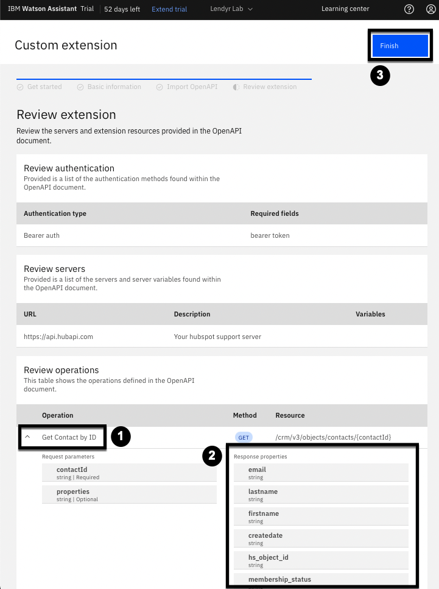
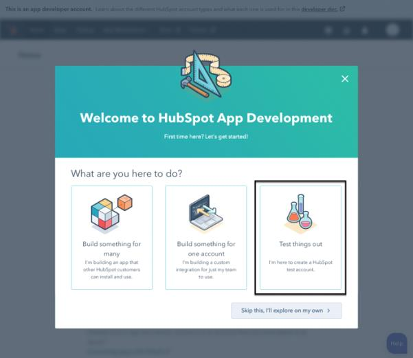
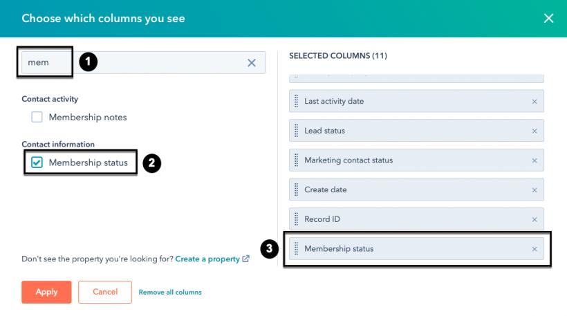
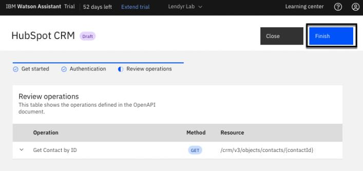
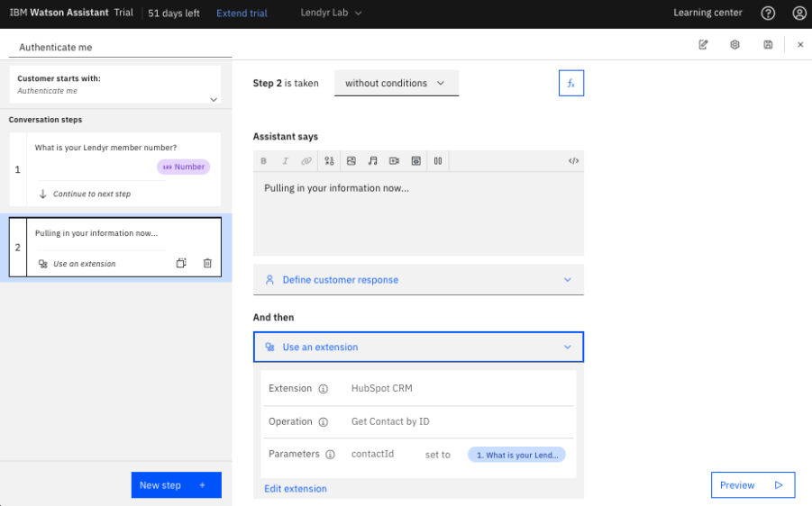
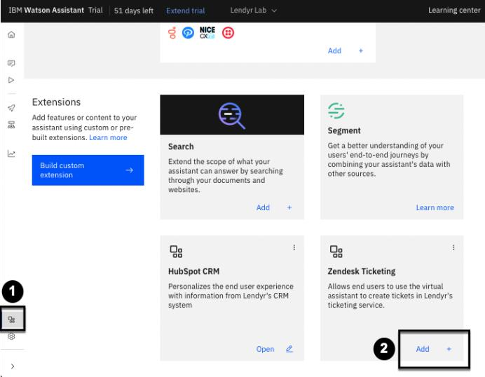
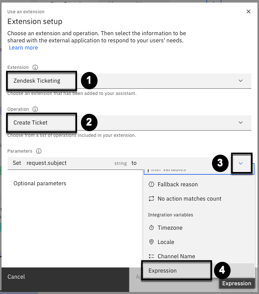
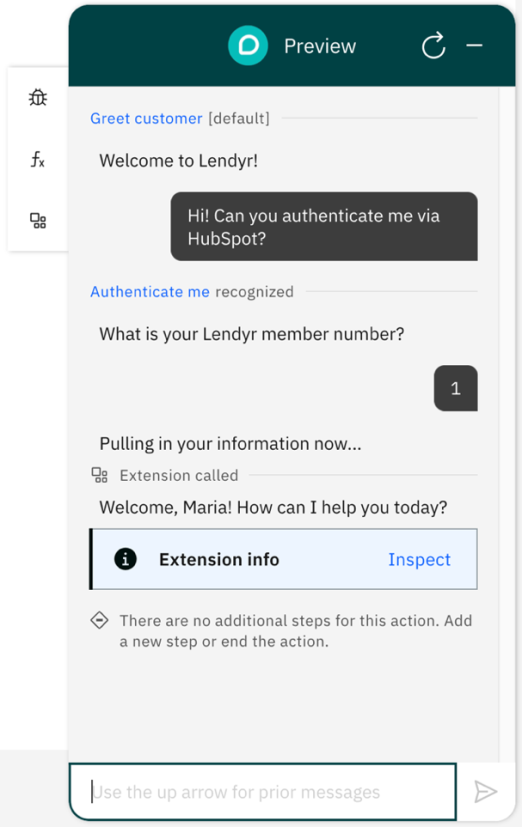

# 105: Extensiones personalizadas

## En esta lección

Aprende a integrar watsonx Assistant con servicios externos, como sistemas CRM, servicios de tickets o bases de datos, con extensiones personalizadas.

## Requisitos previos

Completa esta sección con el asistente que utilizaste en la sección 104 o con tu propio asistente. Si desea utilizar su propio asistente, debe [cargar](https://cloud.ibm.com/docs/watson-assistant?topic=watson-assistant-admin-backup-restore#backup-restore-import) esta [habilidad de Acción](https://raw.githubusercontent.com/CloudPak-Outcomes/Watson-Asst-Lab/main/action-skills/begin-105-action-skill.json) que refleja la habilidad después de completar la sección 104.

Para aprender a crear extensiones personalizadas con aplicaciones de terceros, esta sección requerirá que configures una cuenta de HubSpot CRM, así como una cuenta de Zendesk.

## Presentación de las integraciones

Las secciones anteriores de este laboratorio cubrieron muchas formas nuevas y emocionantes en las que watsonx Assistant facilita la creación de flujos conversacionales. Sin embargo, para que el asistente alcance todo su potencial como solución de asistencia integral, también debe llamar sin problemas a un mundo cada vez mayor de aplicaciones web y extraer información de ellas.

De hecho, cualquiera que haya tenido que crear flujos conversacionales en el mundo real con un asistente virtual dará fe de que casi todos los flujos conversacionales acaban dependiendo de integraciones. Además, uno de los mayores retos a los que se habrán enfrentado es tener que integrar varias interfaces de programación de aplicaciones (API) en la plataforma del asistente virtual -ya sea watsonx Assistant u otra plataforma de IA conversacional- para ofrecer la solución.

### Tipos de integración

Por lo general, watsonx Assistant agrupa las integraciones en tres tipos: integraciones de canal, integraciones de agente en directo o servicio de atención al cliente, y extensiones.

**Las integraciones de canales** conectan tu asistente virtual con tus usuarios finales. Los canales incluyen chat web (como el asistente de Lendyr en Lendyr.com), teléfono (como el asistente de Lendyr en +1 (732) 481- 4918), SMS, WhatsApp, Facebook, etc.

Algunas integraciones de canal pueden incluir una integración de agente en **vivo** o **de** mesa de servicio. Por ejemplo, la integración del canal de chat web puede incluir una integración de service desk con Zendesk Chat, o la integración telefónica puede configurarse con una integración de agente en directo con NICE CXone, un proveedor líder de plataformas de contact center.

Las **extensiones** conectan su asistente virtual a servicios externos, y en sus Acciones, puede definir pasos que interactúen con un servicio externo llamando a una extensión. Las extensiones pueden conectarse a diversas herramientas, como sistemas CRM, servicios de emisión de tickets, bases de datos, motores de búsqueda, etc.

### Página de integraciones

La idea de gestionar todos estos tipos de integraciones puede parecer desalentadora al principio, pero watsonx Assistant te libera del estrés con su página de **integraciones**. La página de integraciones consolida todas tus integraciones de canales y extensiones en un solo lugar.

Utilice el menú izquierdo de su asistente para abrir la página Integraciones. Está en la parte inferior del menú, así que puede que no la veas al principio:

La página Integraciones está organizada en tres secciones (como puede verse a continuación):

1.  Canales esenciales - Los cimientos de cualquier asistente: el chat web o el teléfono.
2.  Extensiones - Personaliza tu asistente conectándote a APIs de terceros.
3.  Canales: despliegue su asistente en canales adicionales, como Slack, Facebook Messenger o SMS y WhatsApp a través de Twilio.

La integración del canal de chat web se configura automáticamente para cada asistente virtual. Las organizaciones que crean asistentes virtuales para el teléfono, Slack, Microsoft Teams u otros canales siguen tendiendo a utilizar el canal de chat web para la redacción y las pruebas. En secciones posteriores de este laboratorio se tratará con más detalle la integración del canal telefónico y otros canales.

## Extensiones

**¿Qué es una prórroga?**

Una extensión es una conexión directa entre watsonx Assistant y la API RESTful de un servicio externo.

Como se puede ver en la captura de pantalla anterior, watsonx Assistant ofrece dos extensiones prediseñadas llamadas **Search** y **Segment (2)**, y también permite a los desarrolladores y constructores crear sus propias **extensiones personalizadas**.

### Buscar extensión

La extensión de búsqueda permite a una organización conectar watsonx Assistant a un servicio de búsqueda. El servicio de búsqueda suele estar conectado a la base de conocimientos existente de la organización. La extensión permite a watsonx Assistant enviar preguntas al servicio de búsqueda, que a su vez busca respuestas relevantes en la base de conocimientos de la organización. watsonx Assistant recibe estas respuestas del servicio de búsqueda y las utiliza para responder a las preguntas de los usuarios finales.

En secciones posteriores de este laboratorio se describen con más detalle la extensión de búsqueda predefinida y las extensiones de búsqueda personalizadas.

### Ampliación de segmento

La extensión Segment permite a una organización conectar watsonx Assistant a Twilio Segment, una plataforma de datos de clientes. Una vez activada la extensión Segment, watsonx Assistant transmite los datos de la conversación a Segment, donde se combinan con otros datos del recorrido del cliente.

Las organizaciones pueden utilizar los numerosos conectores predefinidos de Segment para enviar sus datos a una variedad de destinos, como sistemas CRM o bases de datos en la nube. Las organizaciones pueden utilizar Segment para crear vistas completas del recorrido del usuario final a través de canales y puntos de contacto.

En secciones posteriores de este laboratorio se describe con más detalle la ampliación de Segmentos.

### Extensiones personalizadas

Las extensiones personalizadas combinan la potencia de la integración con una API con la _facilidad_ de uso tanto para desarrolladores como para constructores, lo que reduce el tiempo de obtención de valor y el coste total de propiedad (TCO). Conozcámoslo todo sobre ellas.

**¿Cómo funcionan las extensiones personalizadas?**

Para crear una extensión personalizada, un desarrollador carga una descripción de la API de un servicio externo. La descripción es un archivo de Notación de Objetos JavaScript (JSON) que describe la API del servicio externo según la Especificación OpenAPI. La especificación [OpenAPI](https://github.com/OAI/OpenAPI-Specification/) es un estándar ampliamente adoptado para describir API RESTful. (Para más información sobre las API RESTful, visite [esta](https://www.redhat.com/en/topics/api/what-is-a-rest-api) página de Red Hat).

¿Dónde obtienen los desarrolladores esta descripción de la API de un servicio externo? Dado que OpenAPI es un estándar ampliamente adoptado, muchos proveedores de software publican especificaciones OpenAPI públicamente en sus sitios web o documentación. Si no se dispone fácilmente de una especificación OpenAPI, existen varias formas de crear una desde cero o a partir de información existente, como [IBM App Connect](https://medium.com/ibm-watson/watson-assistant-just-got-connected-a1f46dc9b130) o un [comando cURL](https://medium.com/ibm-watson/from-curl-to-an-extension-under-5-minutes-c4662d95c21a).

Una vez que un desarrollador crea una extensión personalizada en watsonx Assistant, un constructor no técnico puede utilizar la extensión en Acciones. Recuerda que las Acciones tienen pasos, y cada paso puede pedir al usuario final que proporcione una respuesta. Las acciones también almacenan información en variables. Cuando un constructor utiliza una extensión, puede pasar información a la extensión, recopilada en pasos anteriores o almacenada en variables. La extensión también devuelve información a la Acción, y el constructor puede referenciarla en pasos posteriores o almacenarla como variables. Todo esto se hace en la página de Acciones, sin escribir ningún código.

Si tienes problemas para visualizarlo, no pasa nada: ¡construyamos juntos un ejemplo!

**Kits de inicio de extensión personalizados**

Para construir los ejemplos de este laboratorio, se hará referencia a algunos kits de inicio mantenidos por el equipo de desarrollo del Asistente Watson para ayudar a las organizaciones a comenzar con extensiones personalizadas.

Puede consultar los kits de inicio [aquí](https://github.com/watson-developer-cloud/assistant-toolkit/tree/master/integrations/extensions#readme). Los kits de inicio incluyen sistemas CRM (HubSpot), servicios de ticketing (ServiceNow, Zendesk Support), motores de búsqueda (Coveo, Google Custom Search, Magnolia, Watson Discovery), etc.

## Creación de extensiones personalizadas

### Crear una extensión personalizada para un sistema CRM

Uno de los tipos más comunes de extensión personalizada es la integración con un sistema de gestión de relaciones con los clientes (CRM). Los asistentes virtuales suelen extraer información de un sistema CRM para personalizar la experiencia del usuario final.

Por ejemplo:

- El asistente virtual puede saludar al usuario final por su nombre, extrayendo el nombre del perfil del usuario final en el sistema CRM.
- El asistente virtual puede rellenar previamente los campos de un formulario o saltarse los pasos de una acción, de modo que no pide al usuario final información que la organización ya ha aprendido de interacciones anteriores y almacenado en el sistema CRM.
- El asistente virtual puede proporcionar distintos niveles de acceso y servicio en función del estado de afiliación del usuario final en el sistema CRM.
- El asistente virtual puede hacer ofertas especiales para aumentar las ventas o realizar ventas cruzadas al usuario final, extrayendo del sistema CRM una lista de las ofertas con más probabilidades de atraer a este usuario final.

Vamos a construir una extensión personalizada para HubSpot. Comenzarás construyendo la extensión personalizada, y terminarás incorporando la extensión a tus Acciones.

**Descarga la especificación OpenAPI, que describe la API de HubSpot, desde el kit de inicio**

Navega hasta [este enlace](https://raw.githubusercontent.com/watson-developer-cloud/assistant-toolkit/master/integrations/extensions/starter-kits/hubspot/basic/hubspot.basic.openapi.json), que almacena una especificación OpenAPI para la API de HubSpot. Descarga el archivo haciendo clic con el botón derecho en cualquier parte de la página y seleccionando "Guardar página como..." o "Guardar como..." Guarda el archivo en tu sistema, y asegúrate de que la extensión del archivo es **.json**; el nombre del archivo debe ser **hubspot.basic.openapi.json**. (Cámbiale el nombre si es necesario.)

Ahora tienes una descripción de la API de HubSpot.

**Cree una extensión personalizada cargando la especificación OpenAPI en el Asistente Watson**

En watsonx Assistant, utiliza el menú de la izquierda para abrir la página **Integraciones (1** ). A continuación, desplázate hacia abajo y haz clic en el botón **Crear extensión personalizada (** 2):

Esta primera pantalla describe lo que necesitarás para crear la extensión. Tenga en cuenta que el documento OpenAPI JSON, que acaba de obtener, es clave para la configuración. Haga clic en **Siguiente** en la parte superior derecha para pasar a la siguiente pantalla:

La segunda pantalla le pide que nombre y describa la extensión personalizada. Nombra la extensión personalizada **HubSpot CRM** como se muestra en la imagen de abajo **(1)** y añade una descripción, como "Personaliza la experiencia del usuario final con información del sistema CRM de Lendyr" **(2)**. Haz clic en Siguiente (3) en la parte superior derecha para pasar a la siguiente pantalla.

En la siguiente pantalla, arrastre y suelte o haga clic para cargar la especificación OpenAPI que ha descargado y, a continuación, haga clic en **Siguiente** en la parte superior derecha para pasar a la siguiente pantalla:

Tómate un momento para revisar la extensión en la siguiente pantalla. Observa que esta extensión nos permitirá llamar a la API de HubSpot para obtener los detalles de un Contacto por su ID (1 **)**. Puedes hacer clic en la flecha junto a esta operación **Obtener contacto por** ID (1) para ver más detalles:

En la imagen anterior, watsonx Assistant compartirá el **contacttid** del usuario final con la extensión, que llamará a la API de HubSpot y, a continuación, devolverá diversa información, como el **correo electrónico**, el **apellido**, el **nombre** y el **membership_status (2**) del usuario final.

Haz clic en **Finalizar (3)** para crear la extensión personalizada. Ahora deberías poder ver la extensión de HubSpot CRM en tu catálogo de integraciones:

**Crea una cuenta HubSpot y añade algunos datos de usuario final**

A continuación, crearás una cuenta de HubSpot CRM (si no la has creado ya anteriormente), que será la instancia específica de HubSpot con la que se integre la extensión.

Vaya a este enlace para [crear una cuenta de desarrollador de aplicaciones](https://developers.hubspot.com/get-started). _Esta cuenta es gratuita y no requiere tarjeta de crédito_:

Sigue las indicaciones que aparecen al registrarte. HubSpot te pedirá que verifiques tu correo electrónico. Una vez que hayas verificado tu correo electrónico, haz clic en **Probar todo** para crear una cuenta de prueba:

Haga clic en **Gestionar cuentas de** prueba en la siguiente pantalla:

A continuación, haga clic en **Crear cuenta de prueba de aplicación** en la parte superior derecha.

En la ventana emergente, nombre la cuenta de prueba **Laboratorio de extensiones (1)** y haga clic en **Crear (2)**:

Abra la cuenta de prueba en una nueva ventana haciendo clic en su nombre:

A continuación, en la ventana recién abierta, haz clic en **Configuración** (el icono de la rueda dentada en la barra de menús superior):

En la pantalla de Configuración (que se muestra a continuación), haga clic para expandir la opción de menú de la izquierda **Integraciones (1)** y seleccione **Aplicaciones privadas (2)**:

Ahora, crea tu propia aplicación privada HubSpot CRM:

En la siguiente pantalla, introduzca el nombre de su aplicación, por ejemplo **Extensions-Lab (1)**, introduzca una descripción **(2)**, por ejemplo "Personalización de Lendyr con una extensión de cliente a un sistema CRM") y, a continuación, haga clic en **Ámbitos (3)**:

A continuación, establecerá el ámbito de su nueva aplicación HubSpot CRM como una que gestiona tickets de soporte:

1.  Vaya a la pestaña **Ámbitos**.
2.  En el cuadro de **búsqueda**, busque primero tickets y, a continuación, **crm.objects.contacts.read**.
3.  Cuando encuentre **tickets** en esta casilla, selecciónelo. Haga lo mismo para **crm.objects.contacts.read**.
4.  Confirme que ambos aparecen como ámbitos **Seleccionados**.
5.  Haz clic en **Crear aplicación**:

La siguiente pantalla emergente le informa de que se generará un código de acceso. Deberá guardarlo en otro lugar para utilizarlo en el futuro. Haga clic en **Continuar creando**:

En la ventana emergente, haz clic para mostrar el token **(1)**, **cópialo** **(2)** y guárdalo. A continuación, te recomendamos que hagas la **visita rápida a las aplicaciones privadas (3)**:

Una vez completado el recorrido, tendrá que añadir contactos a su sistema CRM. Los contactos son clientes finales a los que su asistente tendrá que dar soporte. Para ello, abra la página Contactos haciendo clic en **Contactos (1)** en el menú superior y, a continuación, en **Contactos (2)** en el menú desplegable:

Observa que, en esta página de Contactos, HubSpot ha creado dos contactos de ejemplo para ti: _Brian Halligan_ y _Maria Johnson_. Cada contacto tiene un conjunto de propiedades asociadas. Estas propiedades son columnas de la tabla Contactos; por ejemplo, número de teléfono y propietario del contacto.

Añadirá una nueva propiedad: estado de afiliación. Haga clic en **Acciones (1)** y, a continuación, en **Editar propiedades (2)**:

A continuación, haga clic en **Crear propiedad**:

A continuación, creará la propiedad con Tipo de objeto: **Contacto (1), Grupo: Información de contacto(2)**, y **Etiqueta:** Estado de **afiliación (**3). **_Asegúrese de que la etiqueta es exactamente_** el estado de afiliación. La especificación OpenAPI que cargaste para crear la extensión espera una etiqueta con ese nombre y ortografía exactos. Puede volver a comprobarlo haciendo clic en el **icono \</> (4)** y observando que el **nombre interno** es exactamente **membership_status (5)**. Cuando esté listo, haga clic en **Siguiente (6)**:

Seleccione **Texto unifilar** como **tipo de** campo **(1)** y, a continuación, **Siguiente (2)**:

Haga clic en **Crear** en la parte inferior derecha:

Observe que una ventana emergente en la parte superior de la pantalla confirma que se ha creado la nueva propiedad:

Ahora, vuelva a la página **Contactos** haciendo clic en **Contactos (1)** en el menú superior y, a continuación, en **Contactos (2)**en el menú desplegable. A continuación, añadirás datos a los contactos de tu sistema CRM. Haz clic en **Editar columnas**:

Busque el **ID de registro (1)** y marque su casilla de verificación **(2)** para añadirlo. Observe que aparece al final de la lista de **columnas seleccionadas (3)**:

A continuación, busque el **Estado de afiliación (1)** y marque su casilla **(2)** para añadirlo. También aparecerá al final de la lista de **columnas seleccionadas (3)**:

Arrastre **ID de registro** y **Estado de afiliación (1)** hacia arriba para que sean la segunda y tercera columnas, respectivamente. **Nombre** será la primera columna. A continuación, haga clic en **Aplicar (2)**:

Su tabla debería parecerse a la siguiente imagen. Seleccione el registro de Brian Halligan haciendo clic en su casilla de verificación **(1)** y, a continuación, haga clic en **Editar (2)**:

En la ventana emergente, seleccione **Estado de afiliación (1)** en el menú desplegable y escriba **Lendyr Topaz (2)** como valor. Haz clic en **Actualizar (3)**:

Ahora debería ver en la tabla Contactos que el estado de afiliación de Brian Halligan es Topacio Lendyr (no se muestra). No cambie el estado de afiliación de María.

¡Enhorabuena! Ya estás listo para trabajar con la extensión personalizada en watsonx Assistant. No cierres todavía la ventana del navegador de HubSpot, es posible que tengas que volver a ella una vez más.

**Añada la extensión personalizada a su asistente virtual**

Anteriormente, creaste una extensión personalizada para HubSpot. Esto le dice a watsonx Assistant cómo conectarse a HubSpot, pero no le dice a watsonx Assistant de qué instancia de HubSpot debe extraer los datos.

En su asistente, vaya a la página **Integraciones** **(1)** y haga clic en Añadir (2) en la tarjeta HubSpot, luego haga clic en **Añadir (3)** en la confirmación emergente.

En la siguiente pantalla, puede leer cómo añadir la extensión personalizada. Cuando esté listo, haga clic en **Siguiente**:

Seleccione **Bearer auth (1)** como tipo de autenticación y, a continuación, pegue el token de acceso que guardó de HubSpot **(2)**. (No necesitas especificar el servidor porque eso se incluyó como parte del archivo JSON proporcionado anteriormente al agregar la integración). Haz clic en **Siguiente (3)**.

Verá un resumen de la extensión personalizada en la página final. Revise las operaciones proporcionadas por la extensión y, a continuación, haga clic en **Finalizar**:

Haga clic en **Cerrar**:

**Como constructor, escriba la extensión en una Acción**

Ahora tienes una extensión personalizada para tu sistema HubSpot CRM, y estás listo para usarla para personalizar la experiencia de los usuarios finales de Lendyr.

Anteriormente señalamos varias formas de personalizar la experiencia del usuario final con datos de CRM. Ahora, simplemente saludará al usuario final por su nombre y almacenará su nombre, correo electrónico y estado de afiliación en el asistente virtual. El almacenamiento de sus datos le permitirá consultarlos en futuras acciones.

Se omitirán algunas capturas de pantalla paso a paso; si no sabe cómo seguir estas instrucciones, consulte la sección 102 de este laboratorio sobre la creación de Acciones.

Abra la _página Acciones_ y cree una _Nueva acción_ desde _cero_. El usuario final debe decir "Autenticarme" para iniciar esta interacción. (No se muestra.)

En el Paso 1, haz que el asistente pregunte "¿Cuál es tu número de socio de Lendyr?" y define la respuesta del cliente como un _número_. Su pantalla debería tener un aspecto similar al siguiente:

Añade un segundo paso. En el paso 2, haz que el asistente diga "Extrayendo tu información ahora...". Cambie **Y después** por "Usar una extensión", lo que abrirá una ventana emergente de **configuración de extensiones**:

En el panel, como se muestra arriba, selecciona **HubSpot CRM** como la extensión **(1), Obtener contacto por ID** como la **Operación (2)**, y establece **contactId** a la respuesta del usuario final al paso 1, **"1. ¿Cuál es tu número de miembro de Lendyr?"**. **(**3)

Observa cómo tú, como constructor, estás configurando fácilmente esta Acción para llamar a la API de HubSpot a través de la extensión. Puedes seleccionar los pasos u otras variables para conectar a la operación con un menú desplegable - no hay código ni complejidad innecesaria.

Haga clic en **Aplicar** cuando haya terminado. El Paso 2 debería tener este aspecto:

Ahora, cree un nuevo paso. En este Paso 3, como has utilizado una extensión en un paso anterior, puedes hacer referencia a la información que la extensión ha devuelto.

En **Asistente dice**, escriba "Bienvenido, " **(1)** y luego haga clic en el icono de variables **(2)**. Veamos qué variables tienes a tu disposición **(3)**:

La lista de variables proporciona una selección de valores a los que puede hacer referencia en su asistente ahora que ha llamado a la extensión. Tenga en cuenta que incluye **Ejecutar con éxito**, que indica si la llamada a la API se ha realizado correctamente, para que pueda gestionar condicionalmente el caso de ID de cliente no reconocidos.

En esta lista, desplácese hacia abajo y haga clic en **body.properties.firstname**. A continuación, como se muestra a continuación **(1)**, escriba un signo de exclamación y una nueva frase: "¿En qué puedo ayudarle hoy?" Por último, cambia **Y luego** por **Finalizar la acción (2)**:

Hay una cosa más que debe hacer. Ahora mismo, la información producida por la extensión no es almacenada por el asistente más allá de esta Acción. En otras palabras, aunque puedes utilizar la variable body.properties.firstname en el Paso 3, no puedes utilizarla en otra Acción.

Vamos a solucionarlo. Haz clic en el icono **fx** del paso 3 para establecer los valores de las variables.

Observe que ahora se muestra la vista **Valores de** variable **(1)**. Haga clic en **Establecer nuevo valor + (2)** y desplácese hasta la parte inferior para seleccionar + **Nueva variable de sesión (3)**:

Creará varias variables de sesión nuevas para almacenar información de HubSpot. **Las** variables de **sesión**se almacenan para toda la sesión del usuario final - todo el tiempo que interactúa con el asistente virtual. Esto te permitirá utilizarlas en todas las acciones.

En la ventana emergente, establece el **Nombre** como **correo electrónico (1)**, selecciona **Texto libre (2)** como tipo y haz clic en **Aplicar (3)**:

De vuelta en la vista del Paso 3, establece el valor de la variable email en body.properties **.email**. Para ello, haz clic en el menú desplegable **(1)**, selecciona **Hubspot CRM (2)** y, por último, elige la propiedad body.properties. **email** (3):

Ahora, repita los pasos anteriores para crear otras tres variables de sesión denominadas: **nombre**, **apellido** y **estado de afiliación**. (No se muestra.) Al hacerlo, establezca cada variable de sesión con su valor correspondiente de la extensión personalizada. Su pantalla debería parecerse a la imagen de abajo; no olvide guardar la Acción haciendo clic en el **icono Guardar**:

Ya está. Ha añadido con éxito una extensión - una conexión a un servicio externo - en una Acción.

Esto puede haberle llevado bastante tiempo. Has pasado bastante tiempo configurando la extensión personalizada y luego configurando HubSpot. Pero tómese un momento para imaginar las dos funciones distintas de un desarrollador y un constructor. El desarrollador habría configurado la extensión personalizada y sacado el token de autenticación de HubSpot. En ese momento, habría enviado un mensaje al constructor y le habría dicho: "Oye, ya puedes empezar". El constructor habría abierto la página de Acciones y se habría puesto directamente a construir. Cada uno se especializa en lo que mejor sabe hacer: el desarrollador no tiene que escribir flujos conversacionales y el constructor no tiene que escribir código. Ese es el poder de las extensiones personalizadas.

**Vea en acción la ampliación personalizada de un sistema CRM**

Antes de continuar, recuerda que el "número de miembro de Lendyr" debe ser uno de los ID de registro en HubSpot, que son 1 y 51 (como se muestra a continuación). Cualquier otro número no funcionará - volverás a solucionar ese problema más adelante.

Ahora, dentro de la ventana Acciones (para poder chatear en modo "depuración"), abre el panel Vista previa. Una vez iniciado el chat, haz clic en el **icono de valores variables (1)**:

A continuación, mantén la conversación mostrada arriba a la **izquierda (2)** diciendo "¡Autentíceme por favor!", seguido de "51". Observa cómo las **variables de acción (** 3) se rellenan y cambian a medida que conversas.

A continuación, inspeccione la extensión. Haga clic en el **icono de actualización (4)** e introduzca las dos expresiones del cliente "¡Hola! ¿Puede autenticarme?" y "1" (5). El asistente llama ahora a la extensión; haga clic en **Impacto (6)** para mostrar el **Inspector de extensiones (7)**. Observe todas las propiedades de su extensión HubSpot CRM.

Ahora puedes cerrar la ventana del navegador de HubSpot.

### Crear una extensión personalizada para un servicio de venta de entradas

Excelente trabajo. Ahora es un buen momento para tomarse un descanso de diez minutos. Si estás en un taller, inclínate hacia tu vecino y pregúntale cómo le va. Cuando estés listo, retomarás con una nueva extensión personalizada para un servicio de venta de entradas.

Hasta ahora, has integrado el asistente virtual de Lendyr con el sistema CRM de Lendyr. Esto _extrae_ información de un servicio externo para personalizar la experiencia del usuario final. Nuestra segunda extensión personalizada _enviará_ información a un servicio externo.

Imaginemos que Lendyr usa Zendesk, un popular producto de software de atención al cliente, para gestionar tickets de atención al cliente, como informes de errores, quejas o solicitudes de asistencia. Lendyr recibe bastante tráfico de su asistente virtual que le pide crear un ticket, pero actualmente no tiene una conexión entre su asistente virtual y Zendesk.

Esto es lo que harás:

1.  Prueba gratuita (sin tarjeta de crédito) de Zendesk
2.  Crea una extensión personalizada para Zendesk en tu asistente
3.  Escribir la extensión personalizada en una Acción
4.  Previsualice la acción para ver su extensión en acción (¡valga el juego de palabras!)

¡Comencemos!

**Prueba gratuita (sin tarjeta de crédito) de Zendesk**

Visita [https://www.zendesk.com/register/](https://www.zendesk.com/register/) para configurar una prueba gratuita. Sigue las instrucciones y, una vez verificado tu correo electrónico, aparecerá una pantalla como esta:

Tenga en cuenta que el URL de su cuenta de Zendesk tendrá un código único llamado dominio de servidor, con el siguiente formato: **https\://\{server-domain}.zendesk.com**. Usando su dominio de servidor único, visite **https\://\{server-domain}.zendesk.com/admin** para ir a la página de su **centro de administración (1)**:

En el menú de la izquierda, vaya a **Aplicaciones e integraciones (2)**, luego haga clic en **API de Zendesk (3)**.

En la siguiente pantalla (no se muestra), acepta las Condiciones de servicio de Zendesk y el Acuerdo de licencia de API y desarrollador de aplicaciones.

A continuación, como se muestra a continuación, abra la pestaña **Configuración** **(1)**, active el **Acceso a token (2)** y haga clic en **Añadir token de API (3)**. **Copie (4)** el token de API, guárdelo en algún sitio y haga clic en **Guardar (5)**:

> **Importante:** Asegúrese de copiar y guardar el token de API. Zendesk no volverá a mostrárselo una vez que haga clic en Guardar o salga de la página.

**Crea una extensión personalizada para Zendesk en tu asistente**

Navegue hasta este [enlace](https://raw.githubusercontent.com/watson-developer-cloud/assistant-toolkit/master/integrations/extensions/starter-kits/zendesk-support/zendesk.openapi.json), que almacena la especificación OpenAPI para la API de Zendesk. Descargue el archivo haciendo clic con el botón derecho en cualquier parte de la página y seleccionando "Guardar página como..." o "Guardar como..." Guarde el archivo en su dispositivo; debería aparecer en su dispositivo como un archivo JSON.

> **Nota:** Si el archivo JSON no se guarda con una extensión de archivo .json, asegúrese de agregarla manualmente cambiando el nombre del archivo. El nombre final del archivo debe ser **zendesk.openapi.json**

En watsonx Assistant, vaya a la **página Integraciones (1)** y haga clic en **Crear extensión personalizada (2):**

En la siguiente pantalla, haga clic en **Siguiente** para pasar al panel de **Introducción** (no se muestra). Esto lo llevará al panel **Información básica (1** ), que se muestra a continuación. Nombre su extensión personalizada **Zendesk Ticketing (2)** y escriba una **descripción (3)**: "Permite a los usuarios finales usar el asistente virtual para crear tickets en el servicio de tickets de Lendyr". Haga clic en **Siguiente (4)**:

Arrastre y suelte la especificación OpenAPI **(1)**, o haga clic para cargarla. Haga clic en **Siguiente (2)**:

Revise la extensión y sus operaciones. Utilizará principalmente **Crear billete**(1). Haga clic en **Finalizar (2)**:

De vuelta en la **página Integraciones (1)**, haz clic en **Añadir + (2)** en la tarjeta de Zendesk Ticketing:

Haga clic en **Añadir** en la ventana emergente resultante (no se muestra). En el panel que aparece a **continuación**, haga clic en **Siguiente**:

En la siguiente pantalla, deberá rellenar varios campos:

1.  En Tipo de **autenticación**, seleccione Autenticación básica.
2.  Para el **nombre de usuario**, escriba **su** dirección de correo electrónico y /token. Por ejemplo, `arvind.krishna@ibm.com/token.`
3.  En Contraseña, pegue el token de API que guardó en la configuración de la API de Zendesk.
4.  Para Servidores, mantenga la opción seleccionada.
5.  Para las variables de servidor, escriba su dominio de servidor único - esta es la primera parte de la URL que ve cuando inicia sesión en su prueba de Zendesk. Por ejemplo, "ibm2023" como la primera parte en [https://ibm2023.zendesk.com.](https://ibm2023.zendesk.com)
6.  Haga clic en **Siguiente**:

En la siguiente pantalla, puedes revisar la integración de Zendesk Ticketing **(1)** y, a continuación, hacer clic en **Finalizar (2)**.

En la pantalla de confirmación final (no mostrada), simplemente haga clic en **Cerrar**.

**Escribir la extensión personalizada en una Acción**

Ahora que la extensión Zendesk Ticketing está configurada, crearás una Acción que la utilice.

Vuelva a la página Acciones, que se muestra a continuación. A continuación, haga clic en **Creado por usted (1)** en el menú desplegable **Variables** de la izquierda. Observa todas las variables que las Acciones de Lendyr utilizan para interactuar con los usuarios finales (2), incluidas las que creaste anteriormente: **correo electrónico**, **nombre**, **apellidos** y **estado de afiliación**. Algunas de ellas tienen tipos, como número o texto libre. Otros pueden configurarse para que tengan un valor inicial. Aprovechará el hecho de que es posible que ya conozca el nombre, la dirección de correo electrónico o el estado de afiliación del usuario final cuando cree el ticket:

A continuación, creará otra Acción. En la pantalla anterior, haga clic en **Creada por usted** en la categoría **Acciones**, luego haga clic en **Nueva acción +**, y Empezar de cero. (Esta secuencia de clics no se muestra, pero es la misma que con todas las Acciones que creó anteriormente).

¿Qué dice su cliente para iniciar esta interacción? "Quiero enviar un ticket de soporte". En **el Paso 1**, **el Asistente de** escritura **dice** "¡Vamos a crear un ticket para ti! Necesitaré reunir alguna información para ayudarte a enviar el ticket". Su nueva Acción debería verse así:

A continuación, cree el paso 2. En este paso, establezca **Asistente dice (1)** a "¿Cuál es su dirección de correo electrónico?" Luego, **Defina** la respuesta del cliente (2) como **Regex (Expresión regular)**:

> Una _expresión regular_ es una secuencia de caracteres que satisface un patrón específico. Un ejemplo es el correo electrónico; contiene un nombre, seguido de "@", que a su vez va seguido de un nombre de dominio.

Se abrirá una ventana emergente. Seleccione **Correo electrónico (1)** como expresión regular y haga clic en **Aplicar (2)**.

Llegados a este punto, tu Acción debería tener este aspecto:

Considere que sólo desea pedir al usuario final su dirección de correo electrónico si aún no la conoce. Por lo tanto, como se muestra a continuación, cambie el **Paso 2 se toma** **sin condiciones** a **Paso 2 se toma con condiciones (1)**. A continuación, cambie la condición por defecto a: el **correo electrónico no está definido (2)**:

Ahora que ha establecido esta condición, su asistente virtual sólo pedirá al usuario final su dirección de correo electrónico si el asistente virtual _no_ la conoce ya.

Añade un nuevo paso - **Paso 3**. Como se muestra a continuación, en **Asistente dice (1)**, escriba: "¿Cuál es su nombre de pila?" Configure **Definir respuesta del** cliente como **Texto libre (**2). De nuevo, sólo querrá preguntar al usuario final por su nombre si aún no conoce su nombre de pila. Cambie **Paso 3 se realiza** **sin condiciones (3)** a **Paso 3 se realiza con condiciones**. Luego cambie la condición a: **firstname is not defined**. El paso 3 debería quedar así:

A continuación, añada el Paso 4. En este paso, establece **Asistente dice: (1)** a "Por favor, describa su problema o situación en detalle. Esta descripción será enviada al equipo de soporte como el ticket". Luego, **Defina la respuesta del** cliente (2) como "Texto libre:"

Crear Paso 5, y establecer **Asistente dice (1)** a: "Creando su ticket..." Cambiar **Y luego (**2) de "Continuar al siguiente paso" a "Usar una extensión:"

En la ventana emergente, seleccione "Zendesk Ticketing" en **Extensión (1)** y "Crear Ticket" en **Operación (2)**. Abra el menú desplegable (3) donde establece **request.** subject como algo, desplácese hasta el final y seleccione **Expression (4)**:

Si elige **Expresión**, podrá introducir texto libre **(1)**. Escriba "Ticket de soporte", como se muestra en la siguiente imagen. A continuación, abra los **parámetros opcionales (2)** y establezca request **.comment.body** en la respuesta del **paso 4 (3)**. Establece request.requester **.name** como la variable de sesión **firstname (** 4). Por último, establece **request.requester.email** como la variable de sesión **email (5)** y haz clic en **Apply (6)**:

> Nota: Tenga cuidado de no establecer accidentalmente **request.requester.** name a la respuesta del Paso **3**, y no establecer **request.requester.email** a la respuesta del **Paso 2**.

Su Acción debería tener ahora este aspecto:

Hay una cosa más que tienes que hacer.

En el paso 5, pasas las variables de sesión **nombre** y **correo electrónico** a la extensión. Estas variables de sesión son donde almacenaste la información de nombre y correo electrónico de HubSpot.

Sin embargo, si el usuario final intenta enviar un ticket de soporte con esta Acción cuando el asistente virtual no ha extraído su información del sistema HubSpot CRM, entonces esas variables de sesión estarán en blanco (también conocidas como "indefinidas" o "no definidas"). Y aunque los pasos dos y tres de esta Acción solicitan el correo electrónico y el nombre de pila cuando esas variables de sesión están en blanco (o "no definidas" / "no definidas"), no estás utilizando esa información cuando llamas a la extensión.

Tenemos que asegurarnos de que su asistente virtual utiliza las respuestas a los pasos dos y tres cuando las variables de sesión email y nombre no están definidas. Para ello, añade el paso 6, y **arrastra y suelta el nuevo paso entre los pasos tres y cuatro**:

**El Paso 6** se convierte ahora en el **Paso 4**. En él,

1.  Establezca una condición, que comprobará si tanto el nombre como el correo electrónico están definidos.
2.  Define la primera condición como **3. ¿Cuál es tu nombre de pila?**
3.  Establezca la segunda condición en **2. Se define ¿Cuál es su dirección de correo electrónico?**

Cuando termine de configurar la condición de paso, haga clic en **fx (1** ) para abrir la vista **Valores variables (2)** y haga clic en **Establecer nuevo valor + (3)**:

Establezca la variable de sesión **firstname (1** ) en la respuesta del **paso 3** siguiendo la secuencia de clics **(2)** y **(3)** que se muestra a continuación:

Nuevamente usando la secuencia de clics mostrada arriba, también establezca la variable de Sesión **email** a la respuesta del Paso **2**. Su Paso 4 debería tener ahora este aspecto:

Si no ves "2. ¿Cuál es tu dirección de correo electrónico?" en la lista de variables de acción, puede tratarse de un error.

Tómese un momento para considerar el comportamiento que ha configurado en esta Acción **(Quiero enviar un ticket de soporte)**. Cuando el usuario final invoca esta Acción, si las variables de sesión **email** y **firstname** _no_ están definidas, el asistente virtual solicita esta información en el Paso 2 y Paso 3. En el Paso 4, si el asistente virtual solicitó y recibió esta información en los Pasos 2 y 3, usted almacena las respuestas a los Pasos 2 y 3 en sus correspondientes variables de sesión.

Ahora, esta información siempre estará en las variables de sesión, por lo que la extensión siempre tendrá el correo electrónico y el nombre correctos para pasar a Zendesk.

Por último, crea un paso de cierre. Sitúate en el paso 6 de forma que añadas un paso al final, y crea el paso 7. Como se muestra a continuación, escriba **(1)** "¡Éxito! Su número de ticket es ". A continuación, escriba **$** o haga clic en el **icono de insertar una variable** y desplácese hacia abajo para seleccionar la variable de **body.request.id (** 2) devuelta por la extensión de tickets de Zendesk en el paso 6 cuando creó el nuevo ticket:

Termine la sección **Asistente dice (1)** con ". Un representante de atención al cliente se pondrá en contacto contigo en los próximos días". Cambia **Y luego (** 2) por "Finalizar la acción". Tu Paso 7 debería tener este aspecto:

¡Fantástico trabajo! Nuestra acción está lista. Recuerda guardarla.

**Previsualice la acción para ver su extensión en acción**

Prueba una conversación en la que no introduzcas información sobre ti a través de HubSpot, como se muestra a continuación. Recuerda visualizarla con las **variables de Acción** visibles como hiciste anteriormente, para que puedas ver cómo se rellenan en tiempo real. Introduce las siguientes expresiones:

- Diga "Quiero enviar un ticket de soporte"
- Introduzca su dirección de correo electrónico (o cualquier dirección de correo electrónico)
- Introduzca su nombre (o cualquier nombre de pila)
- Diga "Quiero ver cómo funciona esta extensión" (la captura de pantalla de abajo captura la conversación cuyo único)

Ahora, ve a ver el ticket que creaste en tu instancia de Zendesk. Para ello, navegue por su navegador hasta **https\://\{server-domain}.zendesk.com/agent/dashboard (1)**, y vea el ticket con asunto 'Ticket de soporte' (2):

Su ticket debe tener un ID de #2. El ID de ticket #1 es un ticket de muestra creado por Zendesk para usted.

> Nota: Zendesk también envía dos correos electrónicos, uno al remitente del ticket y otro al administrador de Zendesk. Dependiendo de los correos electrónicos que haya suministrado, es posible que vea ambos en su bandeja de entrada.

Ahora, prueba una conversación en la que primero extraigas información a través de HubSpot y luego crees un ticket de soporte a través de Zendesk. (Recuerda primero pulsar **Actualizar** para reiniciar la sesión de chat.) De esta manera, estarás aprovechando tanto la extensión de HubSpot como la de Zendesk:

Fíjate en que esta vez el asistente no te ha pedido tu nombre de pila ni tu dirección de correo electrónico, puesto que ya los ha recuperado del sistema CRM de HubSpot.

Vuelva a su panel de control de Zendesk y vea el ticket que acaba de crear. (Tenga en cuenta que es posible que tenga que actualizar la página.) Una vez que haya terminado, ahora puede cerrar la ventana del navegador de Zendesk.

### Depurar una extensión personalizada

Ya ha creado y previsualizado con éxito dos extensiones personalizadas. Ha notado alguna laguna en las acciones, donde las cosas podrían ir mal si el usuario final proporciona una determinada respuesta?

Hay algunas lagunas en las Acciones que has construido más arriba.

- En la Acción **Autenticarme**, no preparó una respuesta alternativa si no puede encontrar al usuario final en el sistema HubSpot CRM.
- En las acciones **Autentifícame** y **quiero enviar un ticket de soporte**, no preparaste respuestas alternativas si la extensión no logra producir una respuesta válida del servicio externo. Por ejemplo, esto podría ocurrir si tus tokens de autenticación caducaran.
- La Acción **Quiero enviar un ticket de** soporte no pide al usuario final que confirme su nombre y correo electrónico antes de enviar el ticket de soporte, por lo que el usuario final no tiene la oportunidad de actualizar su nombre y correo electrónico antes de enviar el ticket.

Cuando algo va mal con una extensión, watsonx Assistant hace que sea fácil encontrar la raíz del problema utilizando el **inspector de extensiones** - algo que este laboratorio tocó brevemente antes.

El inspector de extensiones le permite probar una extensión personalizada, ver la solicitud que envía y las respuestas que devuelve a su acción, y depurar en el panel Vista previa de la página Acciones.

En primer lugar, inspeccionemos una extensión personalizada que funcione correctamente. Ejecute la siguiente conversación con su asistente en el panel Vista previa de la página Acciones:

Esta extensión funciona correctamente: utiliza el número de miembro proporcionado por el usuario final para extraer la información del usuario final del sistema HubSpot CRM. Haz clic en **Inspeccionar (1)** para abrir el **inspector de extensiones** y ver sus detalles:

Como se puede ver arriba, el panel de **inspección de la** extensión muestra los parámetros de solicitud enviados _a_ **(2)**y las propiedades de respuesta recibidas _de_ **(3)** la API de HubSpot a través de la extensión personalizada. Aunque solo almacenas y utilizas un puñado de estas propiedades de respuesta en tu Acción -incluyendo email, firstname, lastname y membership_status- hay muchas más propiedades que se pasan y que proporcionan un contexto útil.

En esta conversación, algo salió mal. Aunque hay dos mensajes de error que dejan claro que algo salió mal, también se puede ver que el asistente virtual dijo "¡Bienvenido, !" **(** 1) Falta el nombre que normalmente vendría del sistema CRM de HubSpot, lo que sugiere que algo salió mal. Haz clic en **Detalles (2)** junto a "Error en la respuesta" para ver una ventana emergente con los errores de ejecución que afectan a la acción.

En la siguiente ventana emergente, amplíe el primer error:

Dependiendo de tu capacidad para analizar la jerga técnica, puede que seas capaz o no de entender estos mensajes de error. No pasa nada: el inspector de extensiones de watsonx Assistant te lo explicará todo en términos fáciles de entender.

Cierre la ventana emergente de errores de ejecución. Ahora haga clic en **Inspeccionar (1)** junto a "Error de extensión". ¿Qué ve? Parece que el cuerpo de la respuesta está completamente en blanco **(2)** - y la propiedad de respuesta de éxito es **falsa (3)**. Esto significa que HubSpot no pudo encontrar un contacto con ID 46. Tal vez recuerdes que tu sistema HubSpot CRM no tiene ningún contacto con el ID 46.

También puede abrir la pestaña **Avanzadas** del inspector de extensiones (no se muestra) para ver la solicitud y la respuesta de esta extensión sin procesar.

Podrías solucionar el problema de este usuario final añadiendo un registro de Contacto a HubSpot con el ID 46. Pero eso no es una solución escalable para otras personas que introducen un número de socio inexistente. Pero esa no es una solución escalable para otras personas que introducen un número de socio inexistente.

Solucionemos este problema en el asistente virtual.

1.  Haga clic en **Autenticarme reconocido** en el panel Vista previa para abrir la Acción.
2.  Haga clic en el **paso 3**.
3.  Añade una condición al paso tres, así que selecciona **con condiciones**.
4.  El paso 3 debe ejecutarse cuando la extensión se ejecute correctamente, así que seleccione **Si se ejecuta correctamente**.
5.  Su condición final debe indicar **2 Ran con éxito == verdadero**.

Ahora sólo saludará al usuario final por su nombre si la extensión consigue obtener su nombre y otra información de HubSpot. Añadamos también un paso que se dará cuando la extensión no consiga encontrar la información del usuario final:

1.  Crear un nuevo paso 4.
2.  Incluir la condición de que **2 Ran con éxito == false**.
3.  **El Asistente de** configuración dice: "Lamentablemente, no he podido introducir tus datos. ¿Quiere intentarlo de nuevo?"
4.  **Defina la respuesta del cliente** como **Confirmación**, que permite al usuario final seleccionar _sí_ o _no_:

A continuación, añade un paso para cuando el usuario seleccione "sí" en el paso anterior, para que pueda intentar introducir de nuevo su número de socio de Lendyr:

1.  Crear un nuevo paso 5.
2.  Añadir la condición de que **4. Por desgracia, yo estaba ... es Sí**.
3.  **Asistente de** Cambio dice a "De acuerdo -"
4.  Cambiar **Y luego** a Volver a preguntar paso(s) anterior(es).

Seleccione todas las casillas de verificación para que su asistente vuelva a preguntar todos los pasos de acción y, a continuación, haga clic en **Aplicar**:

Por último, añada el paso 6 para cuando los usuarios seleccionen "no" en el paso 4:

1.  Haga clic en \*\*Nuevo paso + \*\*.
2.  Añadir la condición de que **4. Por desgracia, yo era ... es No**.
3.  **El Asistente de** Cambios dice: "De acuerdo. ¿En qué más puedo ayudarle hoy?".
4.  Cambie **Y luego** a **Finalizar la acción**.

Su Acción debería tener ahora este aspecto:

¡Bien hecho! Guarda tu Acción, abre el panel de Vista Previa, refresca el panel de Vista Previa, y prueba esta conversación de nuevo. _En este escenario, el usuario final elige intentarlo_ de nuevo:\\\\

Pulse actualizar de nuevo e inténtelo. _En este caso, el usuario final decide no volver a intentarlo_.

¡Enhorabuena! Ahora ya sabe cómo utilizar el Inspector de extensiones para probar, comprender y depurar sus extensiones y las Acciones que las utilizan.

## Reflexiones finales

### ¿Qué valor tienen las extensiones personalizadas?

Las extensiones personalizadas eliminan la necesidad de que un desarrollador cree un proxy o una capa de middleware entre su asistente virtual y otras API. Los desarrolladores pueden conectar el asistente virtual directamente a una API a través de una extensión.

A continuación, los creadores pueden utilizar esas extensiones en Acciones para extraer nueva información o enviar información que el asistente haya recopilado, todo ello sin escribir ningún código. También pueden probar y depurar sus extensiones de forma independiente en watsonx Assistant sin necesidad de acceder a otras API.

¿Qué significa esto para un jefe de producto que supervisa un proyecto de asistente virtual? Sus desarrolladores no necesitan dedicar tiempo a crear un motor de orquestación de servicios (SOE) personalizado para conectar el asistente virtual a servicios externos: pueden conectar el asistente virtual directamente a través de extensiones personalizadas, y pueden actualizar y mantener fácilmente sus extensiones a lo largo del tiempo. A continuación, sus desarrolladores pueden utilizar, probar y depurar las extensiones en la experiencia de creación sin la ayuda de un desarrollador. Los desarrolladores ya no están bloqueados por la disponibilidad de un desarrollador para escribir integraciones en flujos conversacionales, y pueden dotar a su equipo de desarrolladores *no técnicos*precisamente porque no necesitan escribir ningún código para construir flujos conversacionales complejos, integrados y reales.

En resumen, las extensiones combinan la potencia de la integración con una API con la facilidad de uso para desarrolladores y constructores por igual, lo que reduce el tiempo de obtención de valor y el coste total de propiedad.

### ¿Y los webhooks?

Si eres una persona más técnica, puede que sepas que un equipo de desarrollo suele tener dos opciones para conectar su aplicación con el mundo externo: **webhooks** y **llamar a una** API externa. Las extensiones personalizadas permiten a los creadores y desarrolladores llamar a API externas en watsonx Assistant. ¿Qué ocurre con los webhooks?

Los desarrolladores suelen configurar webhooks en watsonx Assistant cuando controlan tanto watsonx Assistant _como_ la API o el servicio externo al que quieren conectarlo. Las series avanzada y experta de este laboratorio tratarán sobre el uso de webhooks con watsonx Assistant.
