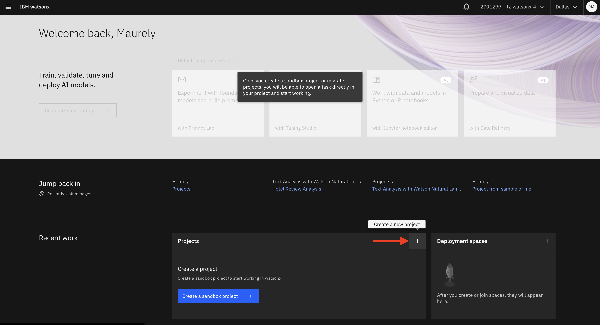
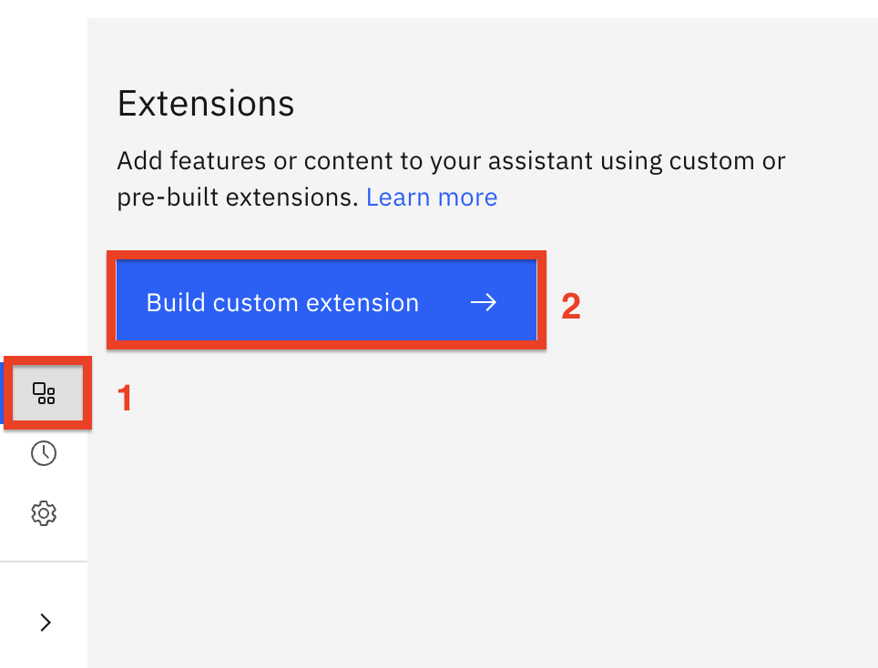
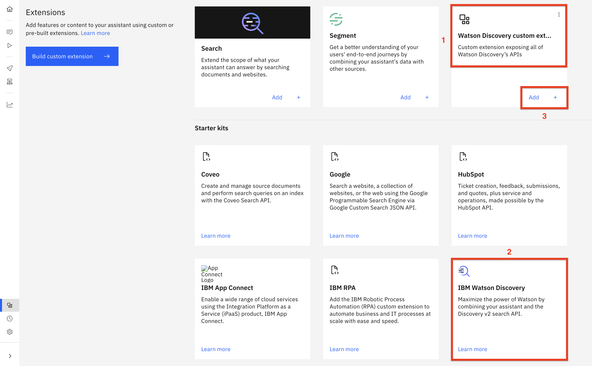
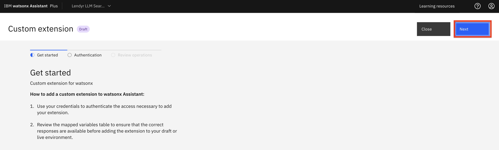
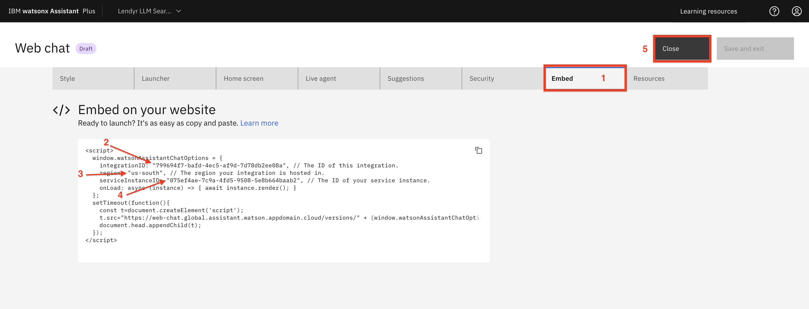
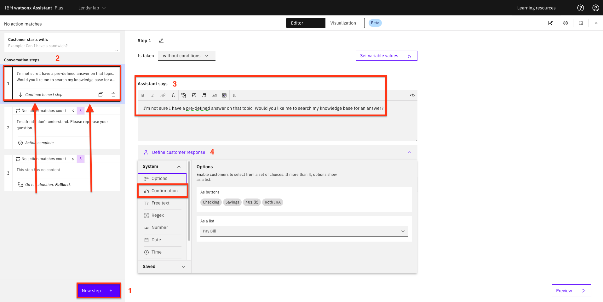

# 207: LLM-powered Conversational Search

## In this section

<QuizAlert text='Heads Up! Quiz material will be flagged like this!'/>

Learn about IBM watsonx Assistant’s large language model (LLM)-powered Conversational Search: what it is, how it works, how to set it up, and how to use it.

## Prerequisites

This section does not have to be done sequentially with the other lab sections. You may either use the watsonx Assistant instance from the previous sections of this lab or create a new one. 
This lesson will provision Assistant and Discovery services from the IBM Technology Zone (TechZone), so you don’t have to start a Watson Discovery trial.

## What is Conversational Search?

This section will focus on Conversational Search, a large language model (LLM)-powered feature that allows your virtual assistant to answer questions conversationally on a wide range of topics.

### Business Context

Virtual assistants are built to answer a wide range of frequently asked questions (FAQs). In watsonx Assistant, builders have historically built anywhere from dozens to hundreds of _Actions_ to answer FAQs.

Over time, answers change as an organization’s processes, products, or services evolve. Builders must periodically manually review the _Actions_ they have built to ensure their answers are accurate and up to date.

_Actions_ that answer FAQs can also be challenging to build because end users can ask questions in different ways. It can be challenging for builders  to write an answer that addresses all these potential questions without sounding robotic or unintelligent.

Conversational Search helps builders answer FAQs more easily by using generative AI (specifically, an LLM) to provide answers. To ensure that generative AI creates accurate, relevant, and up to date answers to FAQs, Conversational Search first searches for relevant information in the company’s knowledge base and then feeds that information into the LLM so that the LLM can generate an answer grounded in the company-specific information.

### General benefits

- **Faster build time:** Conversational Search essentially automates the process of answering FAQs. Builders no longer need to manually write or build _Actions_ to respond to FAQs, saving them dozens of hours of work for the inital build time.

- **Less maintenance required:** Conversational Search generates answers grounded in the company’s knowledge base which contains the company's most recently updated information. As a result, builders no longer need to manually maintain or update _Actions_ to respond to FAQs, saving them hundreds of hours of maintenance.

- **Answers are truly conversational:** Answers generated by Conversational Search are unlikely to sound robotic. They are generated in real-time as a response to the end user’s unique style of questioning. 

### Framework: Retrieval-augmented generation (RAG)

Conversational Search uses an AI framework called retrieval-augmented generation (RAG). RAG is a very popular starting point for enterprises that are just beginning to deploy generative AI. 

RAG has two main benefits: 
 - It ensures that the LLM generating an answer to a question has 
access to the most current, reliable facts relevant to that question.
 - Users (both end users and builders) have access to the LLM’s sources ensuring that its answers can be traced, checked for accuracy, and ultimately trusted.

Before continuing, and if you are not already familiar with RAG, either watch this well-made informational [video](https://www.youtube.com/watch?v=T-D1OfcDW1M) or read this well-written informational [article](https://research.ibm.com/blog/retrieval-augmented-generation-RAG) that were created by the IBM Research team.

### Process

There are two general ways to implement RAG in watsonx Assistant. 
First, you can use Conversational Search, the native, out-of-the-box, no-code feature built in to watsonx Assistant. 
Second, you can set up custom extensions to set up a custom implementation of RAG with low code.
This lab will primarily focus on Conversational Search, the native, no-code pattern built into watsonx Assistant.

If the assistant does not recognize a question and it can't answer it using one of its actions for which it has been trained on, the question will go to Conversational Search.

The Conversational Search process is shown and explained in detail below:

  

  1. The virtual assistant sends the end user’s question to a search tool - in this exercise, Watson Discovery. Watson Discovery has read and processed all relevant corporate documents.

  2. The search tool (Watson Discovery) will then search its content and produce search results in response to the question.

  3. The search tool passes these search results back to the virtual assistant in a list.

  4. At this point, watsonx Assistant could display the results back to the user. However, they would not resemble natural speech; they would look more like a set of search results. Possibly helpful but not summarized and presented concisely and conversationally.

  5. Therefore, watsonx Assistant sends the question and the list of search results to watsonx, which invokes an LLM.
  
  6. In some implementations of RAG, an LLM re-ranks the search results. It may reorder or disregard some of the search results according to how relevant and useful it thinks the search results are to the question. For example, an LLM might decrease the ranking of a search result if it is from a document not recently updated, indicating the information may be outdated. This capability is often called a **neural re-ranker** and is coming soon to watsonx Assistant’s Conversational Search.

  7. The LLM generates an answer to the question using the information in the search results, and it passes this answer back to watsonx Assistant.

  8. The virtual assistant presents this conversational answer to the end user.

### LLMs in Conversational Search

IBM watsonx Assistant commercially and technically **embeds** watsonx.ai large language models, so customers need only purchase watsonx Assistant to embed generative AI functionality into their virtual assistants.

Other watsonx LLMs or non-watsonx LLMs can also be fine-tuned or prompt-engineered to perform RAG or other generative AI use cases. These LLMs can be integrated with watsonx Assistant via custom extensions. This pattern may be preferable to clients who train their own LLMs in-house or want customized functionality beyond what is available natively in watsonx 
Assistant through Conversational Search.

### Demonstrating conversational search

This section of the lab gives you two options to implement Conversational Search with watsonx Assistant.

**Option 1** implements watsonx Assistant, by custom extension, Watson Discovery, and Llama 2.

**Option 2** uses Beta functionality, specifically the watsonx Assistant native Conversational Search feature, which does not require custom extensions or watsonx.ai. The native Conversational Search capability is faster and easier to deploy, however it is still in Beta.

Pick the option most appropriate for your use case or learning needs, and continue.

## Option 1: Setting up conversational search in your virtual assistant using Llama2

> **Important:** This section of this lab assumes you have your TechZone enrionment running.

### Create a watsonx project

1. Navigate to [watsonx](https://dataplatform.cloud.ibm.com/)

2. Once on the main watsonx page, first, ensure you are under the same TechZone account that your watsonx Assistant is in.

    > Note: your TechZone account may be different from the screenshot.

    

3. Create a new project by clicking the **+** button under **Projects**:

    

    a. On the **New project** screen:
      - Enter a **Name** that is meaningful to you.
      - Optionally, enter a **Description**.
      - The **Object storage** service will be automatically populated (your service name will be different from the screenshot)
      - Click **Create**.

      
  
4. You will be redirected to the **Overview** tab of your new watsonx project

      

5. You will need the watsonx project ID to set up the action that calls the watsonx custom extension in Assistant later on. To get the watsonx project ID, select the **Manage (1)** tab, then click **copy (2)**.

    > Note: Save this project ID in a notepad for now, as you will need it shortly. Label it properly, as you will be copying a few more IDs and URLs.

    

6. Next, you will link the automatically provisioned Watson Machine Learning service instance to this new watsonx project. To do this, select **Services & integrations (1)** and click **Associate service + (2)**:

    

7. On the next screen, select the **Watson Machine Learning instance (1)** and click **Associate (2)**. 
    > Note: Your service instance will have a different name than shown in the screenshot.

    

8. Setting up your watsonx extension in Assistant will also require an API key from your IBM Cloud account. 
  To get the API key, in a new browser tab:
   - Navigate to [Manage access and users - API Keys in IBM Cloud](https://cloud.ibm.com/iam/apikeys), which will take you to the following screen. Then, click **Create +**.

       
  
    - On the popup Create IBM Cloud API key screen, enter a **Name** and **Description** then click **Create**.

       

    - When you see the notification API key successfully created, click **Copy**:

        

      Save this API key somewhere safe and accessible. You will need this API key later to set up the watsonx custom extension in Assistant. You can close this IBM Cloud browser tab.

### Load a document into Watson Discovery

1. Go to [My Reservations](https://techzone.ibm.com/my/reservations) on TechZone. Click on your instance tile:

    

2. Click the **Watson Discovery URL**

    

3. On the Watson Discovery launch page, copy the **API Key (1)** and **service URL (2)** and save them. You will need these to configure the Watson Discovery custom extension in watsonx Assistant. Then, click **Launch Watson Discovery (3)**.

    

4. On the welcome page, click **New Project +**

    

5. Enter a **project name (1)** such as `Lendyr documents` and select **Document Retrieval (2)**, then click **Next (3)**.

    

6. Download the [Lendyr FAQ document]((https://ibm.seismic.com/app?ContentId=39aeac7d-8d54-4a71-842c-d7ef019f3ee2)). This is the file you will upload to Watson Discovery. Once downloaded, Enter a **collection name (1)** such as `Lendyr documents`, click **Drag and drop files here or upload (2)**, and hit **Finish (3)**

    

  > Note: The file uploads relatively quickly, however it may take 15 minutes for Watson Discovery to process the document.  To monitor this progress, click **Manage collections** and select the Lendyr documents collection tile

The next screen shows the collection state. The processing will finish when the document becomes available.

7. Lets get the Watson Discovery project ID. You will need it when you configure the watsonx Assistant action. To get the project ID, select **Integrate and deploy (1)**, click the **API Information (2)** tab, and 
copy the **Project ID (3)**. Save it elsewhere with a label.

    

Go back to the document collection, so you can continue to monitor its progress. Once the screen says **1 Documents available**, you can proceed to the next step.

8. Let's ask Watson Discovery a question. To do this, click on **Improve and Customize (1)**, then type `will I earn miles for a balance transfer?` **(2)** in the query window. Note the **search result (3)**.

    

    Watson Discovery provides a helpful answer, but not a conversational one.
    This lab will apply the power of generative language models to produce a more conversational and succinct answer to this question.

### Set up the assistant (brand new instance)

> **Important:** If you completed lab 6 of this lab series and still have your TechZone environment running, skip this part and go to the header, `Setup the assistant (existing instance)`.

1. Go to [My Reservations](https://techzone.ibm.com/my/reservations) on TechZone. Click on your instance tile:

    

2. On your TechZone instance page. click the **watsonx Assistant URL**.

    

3. From the instance launch page, click **Launch watsonx Assistant**:

    
    
4. This is a new assistant, so you will first configure the basics. First, enter its **name (1)**, **description (2)**, and click **Next (3)**.

    

5. Fill out the form asking you how you will use the assistant **(1)** and click **Next (2)**:

    

6. The next screen allows you to customize the look and feel of the Assistant. Customize it to however you want then click the **Next** button.

    

7. On the following preview screen, you have the option to **change the background (1)**. We won’t do that because we’ll embed the assistant into the Lendyr site, but this is a great option to customize the look of an assistant so it feels like it is embedded in a client’s website. Click **Create (2)**.

    

> **Important:** Skip the next part, Set up the assistant (existing instance), and move directly to the header [Add the Watson Discovery extension](#add-the-watson-discovery-extension)

### Set up the assistant (existing instance)

1. In your existing Lendyr Lab assistant, click on Lendyr Lab and **Create New +**. You will now create a new assistant for this lab section. Later, you can move this functionality into your original Lendyr Lab assistant.

    

2. Follow the steps starting from step 4 in the [Set up the assistant (brand new instance)](#set-up-the-assistant-brand-new-instance) section above.

### Add the Watson Discovery extension

Now that you have a Watson Discovery instance setup, a watsonx project ready, and an Assistant configured, you can proceed to add the custom extensions to your assistant.

> Note: Extensions were covered in detail in lab 5 of this lab series.

1. For the Watson Discovery extension, download the OpenAPI specification [watson-discovery-query-openapi.json](https://ibm.seismic.com/app?ContentId=6a2530bc-5cac-4768-9654-8684b73c8357). This is the API specification for the Watson Discovery custom extension.

2. In watsonx Assistant, use the left menu to open the **Integrations (1)** page. Then, scroll down and click the **Build custom extension (2)** button:

    

3. This first screen describes what you’ll need to create the extension. Note that the OpenAPI JSON document, which you just obtained, is key to the setup. Click **Next** to proceed to the next screen.

    

4. The second screen asks you to name and describe the custom extension. Name the custom extension `Watson Discovery custom extension` **(1)** and add a description, like `Custom extension exposing all of Watson Discovery’s APIs` **(2)**. Click **Next (3)** to proceed to the next screen.

    

5. In the next screen, either drag-and-drop or click to upload the [watson-discovery-query-openapi.json](https://ibm.seismic.com/app?ContentId=6a2530bc-5cac-4768-9654-8684b73c8357) OpenAPI spec you downloaded **(1)**, then click **Next (2)** to proceed to the next screen:

    

> **Note:** If you get an error that the file is not in the proper JSON format, try downloading it again with another browser, and assure it has a `.json` extension

6. Take a moment to review the extension on the following screen. This extension will allow us to call Watson Discovery by using its **API Key (1)** which you obtained earlier. Click **Finish (2)**

    

7. You should now be able to see the **Watson Discovery custom (1)** extension in your Integrations catalog:

    Note that it is different from the **IBM Watson Discovery (2)** extension, which is normally used as Assistant’s search skill. The custom skill gives watsonx fuller access to Watson Discovery’s APIs than what the search skill provides. Click **Add + (3)**.

    

    > **Why am I not using the Watson Discovery built-in search extension?**
    > An alternative to creating a custom Watson Discovery extension is to use the [built-in search integration](https://cloud.ibm.com/docs/watson-assistant?topic=watson-assistant-search-add) (also referred to as the Watson Assistant search skill). It is easier to integrate but it does not expose and use all of the API parameters and the full power of Watson Discovery that will be used by watsonx. 
    > For example, Watson Discovery provides an answer _confidence_ for each answer that provides an estimate of the probability that the answer is correct, so a user of Watson Discovery can use that probability to decide whether the answer is plausible enough that it should be emphasized. The built-in search integration in Watson Assistant does not expose the answer confidence because it is designed to provide simple, minimal functionality. 

8. You have created the Watson Discovery custom extension, and now you need to specify which Watson Discovery instance it will access. On the popup window, click **Add**.

    

9. On the following screen, you can read about how to add the custom extension. When ready, click **Next**:

    

10. The following screen asks for **Authentication** details:

    1. Select **Basic auth** as the authentication type.
    2. In the **Username** field, enter `apikey`.
    3. In the **Password** field enter the **Discovery API Key** you saved earlier.
    4. At the bottom of the Authentication pane, under **discovery_url**, fill in the URL for your Discovery instance which you saved earlier. Make sure you enter it withoutthe _https://_ prefix.
    5. Click **Next**.

    

11. You’ll see a summary view of your new custom extension. Click **Finish**:

    

### Add the watsonx custom extension

Next, you will create the watsonx custom extension. First, download the [watsonx OpenAPI specification file](https://ibm.seismic.com/app?ContentId=8481fd6e-c038-4313-b213-7f160f0c35c3). This JSON file defines the watsonx custom extension. 

1. In watsonx Assistant, use the left menu to open the **Integrations (1)** page. Then, scroll down and click the **Build custom extension (2)** button:

    

2. This first screen describes what you’ll need to create the extension. Note that the watsonx OpenAPI JSON document, which you just obtained, is key to the setup. Click **Next** in the top right to proceed to the next screen:

    

3. The second screen asks you to name and describe the custom extension. Name it `watsonx custom extension` **(1)** and add a description, like `Custom extension for watsonx` **(2)**. Click 
**Next (3)** to proceed to the next screen.

    

4. In the next screen, either drag-and-drop or click to upload the [watsonx OpenAPI specification file](https://ibm.seismic.com/app?ContentId=8481fd6e-c038-4313-b213-7f160f0c35c3) **(1)** OpenAPI spec you downloaded, then click **Next (2)** to proceed to the next screen.

    

> **Note:** If you get an error that the file is not in the proper JSON format, try downloading it again with another browser, and assure it has a **.json** extension, in lower case.

5. Click **Finish** to create the custom extension.

    

6. You should now be able to see the **watsonx custom extension (1)** in your Integrations catalog. Click **Add + (2)** so that you can configure a connection to your watsonx project:

    

7. Click **Add** on the popup screen.

    

8. Hit **Next** on the following screen:

    

9. On the Authentication screen:

    1. Choose **OAuth 2.0** as the Authentication type.
    2. Select **Custom apikey** as the Grant type.
    3. Copy and paste the **IBM Cloud** [API key](https://cloud.ibm.com/iam/apikeys) you saved earlier into the Apikey field.
    4. Click **Next**.

        

10. Click **Finish**.

    

### Upload and configure the watsonx actions

1. Next, you will upload the actions your assistant will need, so download the [actions JSON file](https://ibm.seismic.com/app?ContentId=68403304-51c2-430f-88a0-90ce20a28b22).

> **Note:** You should not upload these actions directly into an existing assistant because doing so will overwrite your existing actions. 

> **Note:** If the file downloads with an uppercase **.JSON** extension, you must rename it to lowercase **.json**, otherwise it will not upload correctly.

| **Action** | **Description** |
| --- | --- |
| _Search_ | Connects to Watson Discovery to search for documents related to the user query. The out-of-box **No Action Matches** action has been configured to send all input to this action, so whatever the user enters will be used as the search input. In turn, this action invokes the **Generate Answer** action to generate a response to the query |
| _Generate Answer_ | Configures the query prompt and document passages resulting from the Search actionand calls the action **Invoke watsonx generation API.** It is not meant to be invoked directly, but rather by the **Search** action. |
| _Invoke watsonx generation API_ | Connects to watsonx and, using as context the documents resulting from the search, asks the language model to generate an answer to the user query. It is not meant to be invoked directly, but rather by the **Generate Answer** action |

The actions in this file will use search only when no action matches the user request. They search a complete watsonx project, and as such they are general-purpose and usable with any data set.

2. To upload the JSON file, click **Actions (1)**, and then **Global Settings (2)**:

    

3. Scroll to the right until you are able to see and select the **Upload/Download (1)** tab. There, **drag and drop (2)** the [actions JSON file](https://ibm.seismic.com/app?ContentId=68403304-51c2-430f-88a0-90ce20a28b22), and click **Upload (3)**:

    

4. Click **Upload and replace** at the warning pop-up screen.

    

5. Hit **Close**.

    

The actions JSON file you uploaded also includes variables used by the actions. You need to update two of them with your Discovery and watsonx project IDs.

6. Within the Actions page, under Variables, select the **Created by you (1)** filter, which displays the variables you just uploaded. Click the **discovery_project_id (2)** session variable:

    

7. Copy and paste the **project ID (1)** value you obtained when configuring Watson Discovery and click **Save (2)**.

    

8. Click the **watsonx_project_id** variable:

    

9. Set the **watsonx_project_id (1)** variable to the watsonx project ID you obtained earlier and click **Save (2)**. This tells the assistant which watsonx project will be used for answer generation.

    

### Let's try out the watsonx Assistant

1. Click on **Preview (1)** and enter the same question as before: `will I earn miles for a balance transfer?` **(2)**.

    Note the clear, concise, and conversational answer. Compare this to the excerpt answer provided by Watson Discovery earlier! 

    

2. On the **Preview** page (shown above), click **Customize web chat (3)**. Then, as shown below:

    a. Click on the **Embed** tab.

    b. Copy the value for your assistant’s **integrationID** and paste it into a text document. You will use this value shortly.

    c. Copy the value for your assistant’s **region** and paste it into a text document. You will use this value shortly.

    d. Copy the value for your assistant’s **serviceInstanceId** and paste it into a text document. You will use this value shortly.

    e. Finally, click **Close**.

    

3. Now, take your assistant’s **integrationID**, **region**, and **serviceInstanceId**, and plug them into this URL:

    `https://www.ibm.com/products/watson-assistant/demos/lendyr/demo.html?integrationID=ID_HERE&region=REGION_HERE&serviceInstanceID=ID_HERE`

    Make sure there are no spaces (each paste adds a space!), and then copy and paste your custom URL in your browser.

    If you would like to demo the capabilities built in this section, review the [demo video](https://ibm.seismic.com/app?ContentId=284b5973-427c-43c5-a672-98881791925f) for a recommended flow with other utterances to ask the assistant.

    Congratulations! You have now built the demo and functionality shown in the [demo video](https://ibm.seismic.com/app?ContentId=284b5973-427c-43c5-a672-98881791925f).

### Copy the new functionality to your Lendyr assistant

> **Note:** There are two pre-requisites to being able to complete this last part of the lab. If both of 
these do not apply, you are finished with this lab.
 >   1. You must have completed lab 1 through 7 of the lab series.
 >   2. Both assistants must be running in the same instance of watsonx Assistant (in other words, either under the same TechZone environment, or under the same instance under the same IBM Cloud user ID).

You can copy the LLM-powered search functionality you just created into your version of the Lendyr virtual assistant which you built in the previous lab sections.

> Do not upload the actions to the assistant you previously built; this will overwrite your existing actions. Rather, you will [copy-and-paste](https://cloud.ibm.com/docs/watson-assistant?topic=watson-assistant-copy-action) the actions.

1. First, navigate to your Lendyr Lab assistant, built in labs 1-6. There, reconfigure the watsonx and Watson Discovery extensions by following the respective parts of this section:

    - [Add the Watson Discovery extension](#add-the-watson-discovery-extension).
    - [Add the watsonx custom extension](#add-the-watsonx-custom-extension).

2. Navigate back to your new (LLM-powered) virtual assistant’s Actions page. Select **(1)** each of the three actions, one at a time, and select [Copy to assistant](https://cloud.ibm.com/docs/watson-assistant?topic=watson-assistant-copy-action) **(2)**:

    

3. On the popup screen, check to see that you are pasting your Lendyr Lab assistant, and click **Next**

    

4. On the next screen, note that there are no "conflicts" and click **Apply**:

    

The virtual assistant may ask you to select _Overwrite_ or _Save as new_ for actions and variables. It will have default selections for each action and variable. Do not change the default selections.

5. Switch to the Lendyr assistant you created in labs 1-6 **(1)** and navigate to the **Actions (2)** page.

    Here, you will create an action that will ask the user if they want to try conversational search when the assistant does not recognize the question. To build this action click **Set by assistant (1)**, and then open the **No action matches (2)** action:

    

6. As shown below:
    1. Add a **New step +**.
    2. Drag it up so it’s the first step.
    3. Under **Assistant says**, write: `I'm not sure I have a pre-defined answer on that topic. Would you like me to search my knowledge base for an answer?`
    4. **Define the customer response** as a Confirmation.

        

7. Next, add another step:
    1. Add a **New step +**.
    2. Drag it up so it’s the second step.
    3. Add the **condition**: If Step 1 is Yes.
    4. Under **Assistant says**, write: `OK!`.

        

    5. Scroll to the bottom and change **And then** to **Go to a sub-action**.

        

    6. In the subaction search window appears, select **Search (1)** as the subaction, check the **End this action after the other action is completed (2)** checkbox, and click **Apply (3)**:

        

8. Finally, add another step:
    1. Add another **New step +**.
    2. Drag it up so it’s the third step.
    3. Add the **condition**: If Step 1 is No.
    4. Under **Assistant says**, write: `OK! In that case:`.
    5. **Save** the action.

        
    
    Your Lendyr virtual assistant will now ask the end user if they want to try conversational search when the virtual assistant does not recognize their question.

## Option 2: Setting up the native conversational search (Beta) using IBM Granite

Let’s walk through how to set up watsonx Assistant’s native Conversational Search, which does not require the use of custom extensions or watsonx.ai. This native Conversational Search 
capability is fast and easy to deploy but is still in Beta.

In this lab section, you will either continue working with the assistant you’ve been building in Sections 1-6 of this lab or – if you have not done Sections 1-6 – create a brand new assistant.

### Request the dark beta feature is enabled in Watson Discovery

> **Important:** This section of this lab assumes you have your TechZone environment running.

The native Conversational Search is a dark beta feature and must be [requested](https://form.asana.com/?k=U0gIIpwhM2_LY8r8LC_qDw&d=8612789739828) for it to be available on a per-instance basis. Once the request has been approved, you may proceed with the rest of this section.

### Load a document into Watson Discovery

1. Go to [My Reservations](https://techzone.ibm.com/my/reservations) on TechZone. Click on your instance tile:

    

2. Click the **Watson Discovery URL**

    

3. On the Watson Discovery launch page, copy the **API Key (1)** and **service URL (2)** and save them. You will need these to configure the Watson Discovery custom extension in watsonx Assistant. Then, click **Launch Watson Discovery (3)**.

    

4. On the welcome page, click **New Project +**

    

5. Enter a **project name (1)** such as `Lendyr documents` and select **Document Retrieval (2)**, then click **Next (3)**.

    

6. Download the [Lendyr FAQ document]((https://ibm.seismic.com/app?ContentId=39aeac7d-8d54-4a71-842c-d7ef019f3ee2)). This is the file you will upload to Watson Discovery. Once downloaded, Enter a **collection name (1)** such as `Lendyr documents`, click **Drag and drop files here or upload (2)**, and hit **Finish (3)**

    

  > Note: The file uploads relatively quickly, however it may take 15 minutes for Watson Discovery to process the document.  To monitor this progress, click **Manage collections** and select the Lendyr documents collection tile

The next screen shows the collection state. The processing will finish when the document becomes available.

7. Lets get the Watson Discovery project ID. You will need it when you configure the watsonx Assistant action. To get the project ID, select **Integrate and deploy (1)**, click the **API Information (2)** tab, and 
copy the **Project ID (3)**. Save it elsewhere with a label.

    

Go back to the document collection, so you can continue to monitor its progress. Once the screen says **1 Documents available**, you can proceed to the next step.

8. Let's ask Watson Discovery a question. To do this, click on **Improve and Customize (1)**, then type `will I earn miles for a balance transfer?` **(2)** in the query window. Note the **search result (3)**.

    

    Watson Discovery provides a helpful answer, but not a conversational one.
    This lab will apply the power of generative language models to produce a more conversational and succinct answer to this question.

### Set up the assistant (brand new instance)

> **Important:** If you completed lab 6 of this lab series and still have your TechZone environment running, skip this part and go to the header, [Use your existing assistant](#use-your-existing-assistant).

1. Go to [My Reservations](https://techzone.ibm.com/my/reservations) on TechZone. Click on your instance tile:

    

2. On your TechZone instance page. click the **watsonx Assistant URL**.

    

3. From the instance launch page, click **Launch watsonx Assistant**:

    
    
4. This is a new assistant, so you will first configure the basics. First, enter its **name (1)**, **description (2)**, and click **Next (3)**.

    

5. Fill out the form asking you how you will use the assistant **(1)** and click **Next (2)**:

    

6. The next screen allows you to customize the look and feel of the Assistant. Customize it to however you want then click the **Next** button.

    

7. On the following preview screen, you have the option to **change the background (1)**. We won’t do that because we’ll embed the assistant into the Lendyr site, but this is a great option to customize the look of an assistant so it feels like it is embedded in a client’s website. Click **Create (2)**.

    

> **Important:** Skip the next part, _Use your existing assistant_, and move directly to the header [Add the Search extension](#add-the-search-extension).

### Use your existing assistant

When using your existing instance, there are two steps to deploying the Conversational Search functionality:

1. Add the Search extension, which will connect to your Watson Discovery instance.
2. Invoke the Conversational Search through one or more Actions.

Open your existing Assistant instance, and proceed to _Add the Search extension_

### Add the Search extension

Now that you have a Watson Discovery instance setup and an Assistant configured, you can proceed to add the search extension to your assistant.

1. In watsonx Assistant, use the left menu to open the **Integrations (1)** page. Then, scroll down and click the **Add + (2)** button:

    

2. Select the Watson Discovery search extension:

    

3. Select the instance of Watson Discovery where you loaded the Lendyr FAQs **(1)**, select the **Lendyr documents** project **(2)**, and click **Next (3)**:

    

The following screen is where you map your data schema from Watson Discovery to the title, body, and URL fields that will be used by watsonx Assistant. (Review the product documentation [here](https://cloud.ibm.com/docs/watson-assistant/watson-assistant?topic=watson-assistant-search-add#search-add-configure) for more information about the options on this screen – you will leave the default values in this lab.)

4. First, test the search integration in the Preview window by typing, `Will I earn miles for a balance transfer?` **(1)**. 

    Note that the response is roughly the same answer you got in Watson Discovery earlier:

    

    You have now successfully integrated Watson Discovery with watsonx Assistant!
    You will now take this integration one step further by toggling Conversational Search from **Off to On (2)** and clicking **Save (3)**.

### Add a Search step to an Action

In this lab, you will set up Conversational Search to invoke when the assistant cannot match the end-user question to one of the Actions. The simplest way to do this is to add a Step to an Action provided automatically with each Assistant instance: the _No action matches_ action.

1. To do this, click on the actions which are **Set by assistant (2)**, and select the **No action matches (3)** action:

    

2. Then, as shown below:
    1. Click **New step +**.
    2. Make sure this new step is the first in the sequence (you can drag and drop it in the list).
    3. Under **And then** select **Search for the answer**.

    

3. Next, click **Edit settings (1)**, and in the ensuing popup, select **End the action after returning results (2)**, and click **Apply (3)**:

    

4. Save the action.

### Try it out!

Now that you are finished configuring your assistant, try it out! Click on **Preview** and enter these questions. None of the actions have been trained to answer these questions:

- `Will I earn miles for a balance transfer?`
- `What is Lendyr Bank’s routing number for electronic transactions?`
- `How can I get the 20% discount with the Lendyr AirMiles credit card?`
- `Can I order checks for my Checking account?`
- `Does FDIC insurance cover my brokerage account?`*
- `Where can I learn more about what FDIC covers?`*

*There are no answers to these questions in the FAQs you uploaded to Watson Discovery; the response is provided by the IBM Granite Large Language Model.

Note the clear, concise, and conversational answers. Compare this to the excerpt answer from Watson Discovery earlier!

You have now completed this section of the lab, which also concludes this lab series. You have covered the fundamental concepts and features of watsonx Assistant, and are well-equipped to build and test a simple, powerful virtual assistant – with some practice, of course!

