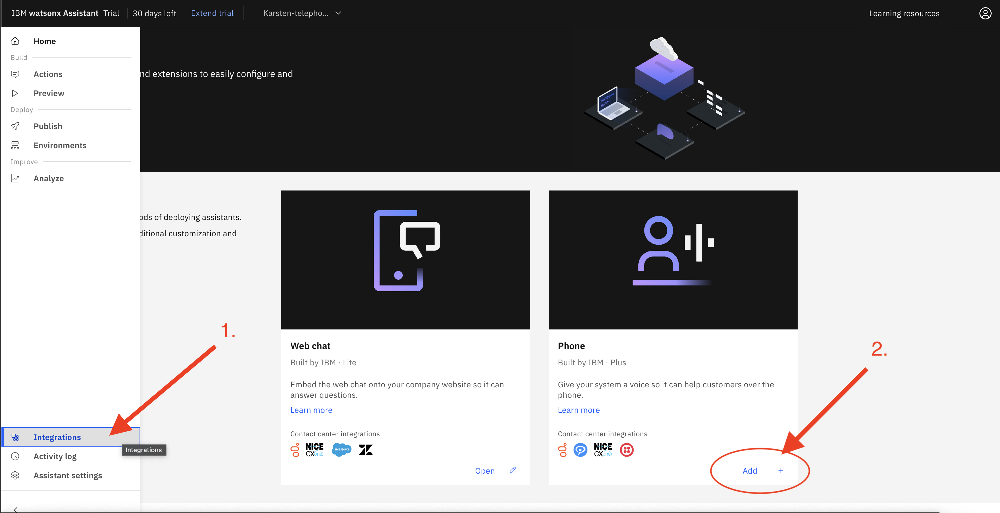
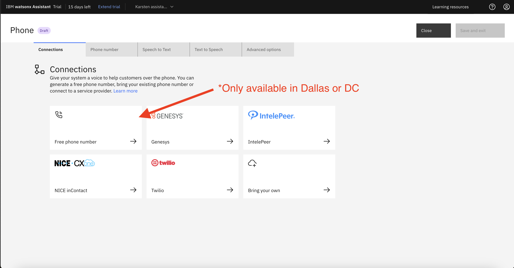
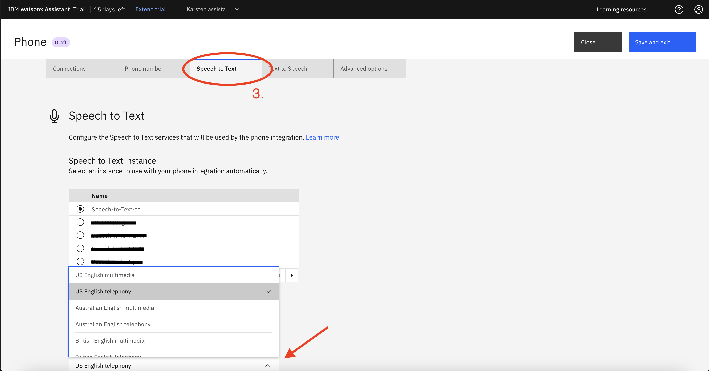
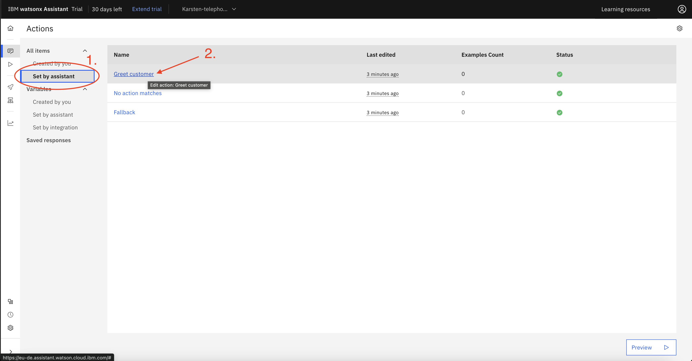
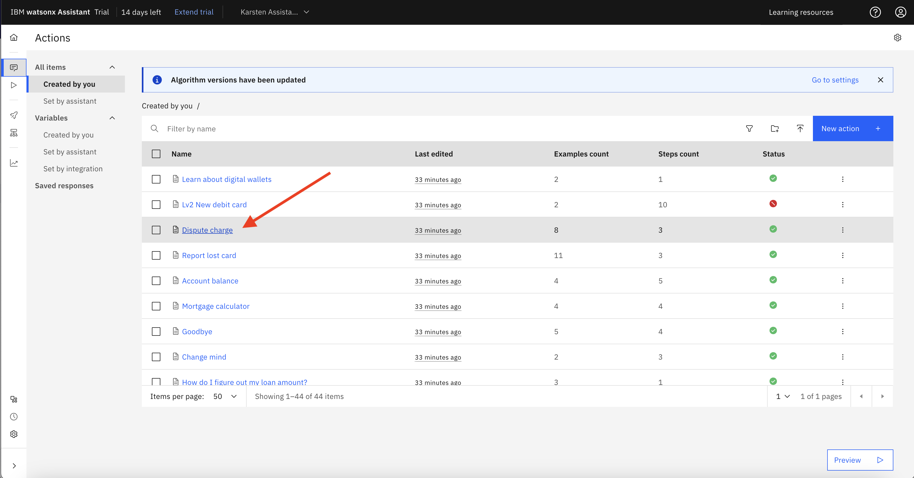

# 202: Teléfono y Discurso

## En esta lección

En esta lección vamos a configurar e integrar acciones web, chat, teléfono y SMS con watsonx Assistant.

## Requisitos previos:

Necesitarás una cuenta Twilio y un Asistente Watsonx actual, puede ser a través de techzone o IBM Cloud.

> **Nota:** Su instancia de Watsonx Assistant deberá estar en **Dallas** o **Washington DC** para poder completar este laboratorio.

Si está empezando con un nuevo asistente, cargue el archivo [action-skill.json.zip](https://raw.githubusercontent.com/ibm-build-lab/VAD-VAR-Workshop/main/content/Watsonx/Assistant/files/202/action-skill.json) en su asistente.

### Ejemplo de telefonía:

Comienza navegando hasta la [demo de integración telefónica](https://www.ibm.com/products/watson-assistant/demos/lendyr/demo.html?page=phone-tour\&section=phone)"Lendyr". Llama al número y sigue las instrucciones para hacerte una idea de cómo funciona.

Número de cuenta: 4532 9876

Pin: 9348

## Conexión de llamadas telefónicas al asistente watsonx:

Hay varias formas de conectar llamadas telefónicas a su asistente a través de la integración telefónica. Para este laboratorio vamos a utilizar intelepeer.

1.  [IntelePeer](https://intelepeer.ai):

    > **Nota**: Esta opción sólo está disponible para números de teléfono de Estados Unidos. Para números de teléfono de fuera de EE.UU., consulte las opciones siguientes.

    IntelePeer es un proveedor de Plataforma de Comunicación como Servicio (CPaaS) que le permite generar y proporcionar automáticamente un número de teléfono gratuito. Cuando los usuarios finales llamen al número de teléfono, IntelePeer recibirá las llamadas entrantes y las reenviará a watsonx Assistant.

<br />

2.  [NICE CXone](https://www.nice.com/resources/cxone-agent-assist-hub) a través de una integración preconfigurada:

    También puede conectar watsonx Assistant a una instancia de NICE CXone, una plataforma de centro de contacto con agentes activos. El centro de contacto NICE CXone recibirá las llamadas telefónicas entrantes y podrá desviarlas a watsonx Assistant. El asistente también puede devolver estas llamadas a NICE CXone si es necesario escalar a un agente en vivo.

<br />

3.  [Troncales SIP](https://en.wikipedia.org/wiki/SIP_trunking); Genesys, IntelePeer, Twilio y más:

    Puede conectar watsonx Assistant a un número de teléfono existente configurando un troncal de Protocolo de Iniciación de Sesión (SIP) de un proveedor como Genesys, IntelePeer o Twilio. El proveedor recibe las llamadas telefónicas entrantes y puede desviarlas a watsonx Assistant. Un troncal SIP es equivalente a una línea telefónica, salvo que funciona a través de Internet.

<br />

Independientemente del método de integración, una vez que una llamada llega a su asistente virtual, la entrada inicial (al igual que todas las respuestas posteriores del usuario final) es de audio. Esta entrada de voz es convertida en texto por IBM Speech to Text (STT) y es utilizada por watsonx Assistant para iniciar una de sus Acciones. Cuando el asistente necesita responder, convierte la respuesta de texto de una Acción (que un constructor ha escrito en Acciones) en audio de voz, utilizando IBM Text to Speech (TTS). A continuación, el asistente habla por teléfono con el usuario final. Como verás en este laboratorio, watsonx Assistant configurará automáticamente IBM TTS y STT para cada asistente virtual - no hay ninguna configuración o facturación asociada con IBM TTS y STT.

## Integración telefónica con IntelePeer:

Para empezar a configurar la integración del teléfono, accede a tu instancia de Watsonx Assistant.

1.  En el menú lateral, haga clic en "Integraciones" y, a continuación

2.  Haz clic en "Añadir +" en el mosaico Teléfono.

    > **Nota**: Esto requiere una cuenta Plus.





La provisión del número de teléfono puede tardar unos minutos. Siguiente,

3.  Haga clic en la pestaña "Voz a texto". Si aún no dispone de una instancia de voz a texto (STT), cree una. En caso contrario, seleccione su instancia de STT y el modelo lingüístico que desea utilizar.



4.  Haga lo mismo con "Texto a voz". Fíjate en las opciones para cambiar la voz utilizada, así como la velocidad de habla.
5.  Haz clic en "Guardar y salir". Ya está listo para probar su asistente. Llama al número y habla con el asistente para ver cómo funciona. Debería ser similar a la demo de Lendyr que vimos al principio del laboratorio.


## Medios de interacción

Debido a la naturaleza de los distintos métodos de interacción, como teléfono (audio), SMS (texto) y web (visual), es posible que tu asistente deba comportarse de forma diferente en cada caso. Por ejemplo, [esta acción](https://www.ibm.com/products/watson-assistant/demos/lendyr/demo.html?section=index\&panel=journeys) en el sitio web de Lendyr guía al usuario a través de la interfaz de usuario. No funcionaría igual de bien por teléfono.

### La variable de integración "Nombre del canal":

Vaya a la página Acciones, haga clic en Establecer por asistente (1) y, a continuación, abra la acción Saludar al cliente (2).



En la sección de condiciones de cada uno de estos pasos, observe el menú desplegable que le permite elegir opciones para el nombre del canal. Esta variable de nombre de canal está integrada en watsonx Assistant y le permite dirigir a los usuarios en función de cómo interactúan con su asistente.


## Configuración de la integración de SMS

A continuación, configuraremos la integración de SMS mediante Twilio. Si aún no lo ha hecho, visite el [sitio web de Twilio](https://www.twilio.com/) y regístrese para obtener una cuenta de prueba gratuita.

> **Nota**: Este laboratorio es inestable, ya que depende de un servicio de terceros (Twilio.) Usted puede encontrar una interfaz de usuario diferente a la mostrada en las capturas de pantalla, y otras cosas pueden haber cambiado y / o dejado de funcionar.

A continuación, haz clic en "Comprar número de teléfono". Tenga en cuenta que es posible que tenga que elegir un número de EE.UU. con el fin de SMS para ser apoyado. Después de las disposiciones de su número, anote:

1.  SID de su cuenta
2.  Su token de autenticación
3.  Tu número de teléfono Twilio


<br />

De vuelta en Watsonx Assistant, navega hasta la página de integraciones y desplázate hasta SMS. (1.) Elige Twilio e introduce tu SID, Auth Token y número de arriba. (2.)

<br />


<br />

Continúa y copia tu webhook URI. Vuelve a Twilio y haz clic en Números de teléfono -> Gestionar -> Números activos. Haz clic en tu número de teléfono y desplázate hasta Configuración de mensajería. En "A message comes in" selecciona Webhook y pega el URI que copiaste de Watsonx Assistant, luego haz clic en guardar.


### Acción SMS

Ahora que ya tenemos configurada la integración de SMS, vamos a configurar una acción que la utilice.

Abra la página de acciones y haga clic en la acción "Impugnar cargo".



En la página del editor de acciones, cree un nuevo paso y asegúrese de que es el primer paso (1.) A continuación, cambie el paso para asegurarse de que se toma "con condiciones" y seleccione "Nombre del canal" es "Teléfono" (2.) Cambie a JSON en el cuadro "Asistente dice" (3.), y reemplace el código con el fragmento JSON a continuación (4.) Por último, después de la respuesta, seleccione "Y entonces" -> "Finalizar la acción", y guárdelo.


```json
{
  "generic": [
    {
      "response_type": "text",
      "values": [
        {
          "text": "I can help you understand charges and file a dispute. I am sending you a link to our mobile-friendly website, where you can walk through a guided journey that will show you how to find and dispute charges."
        }
      ],
      "selection_policy": "sequential"
    },
    {
      "response_type": "user_defined",
      "user_defined": {
        "vgwAction": {
          "command": "vgwActSendSMS",
          "parameters": {
            "message": "Hi! This is the Lendyr virtual assistant. Click the following link to follow a guided journey that will show you how to find and dispute charges. https://www.ibm.com/products/watson-assistant/demos/lendyr/demo.html?section=index&panel=journeys"
          }
        }
      }
    }
  ]
}
```

¡Ya está! Vamos a probarlo. Llama a tu número intelepeer e indica el número de cuenta y el pin utilizados anteriormente. Tras la autenticación, di que quieres impugnar un cargo, y en breve deberías recibir el SMS.

Con esto concluye el laboratorio. Tenga en cuenta que IBM ya dispone de conexiones preconfiguradas a NICE CXone y Genesys, por lo que si utiliza uno de ellos, intente realizar la conexión usted mismo en función de su caso de uso.
