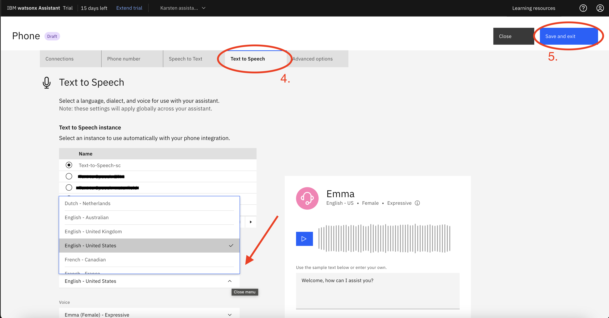
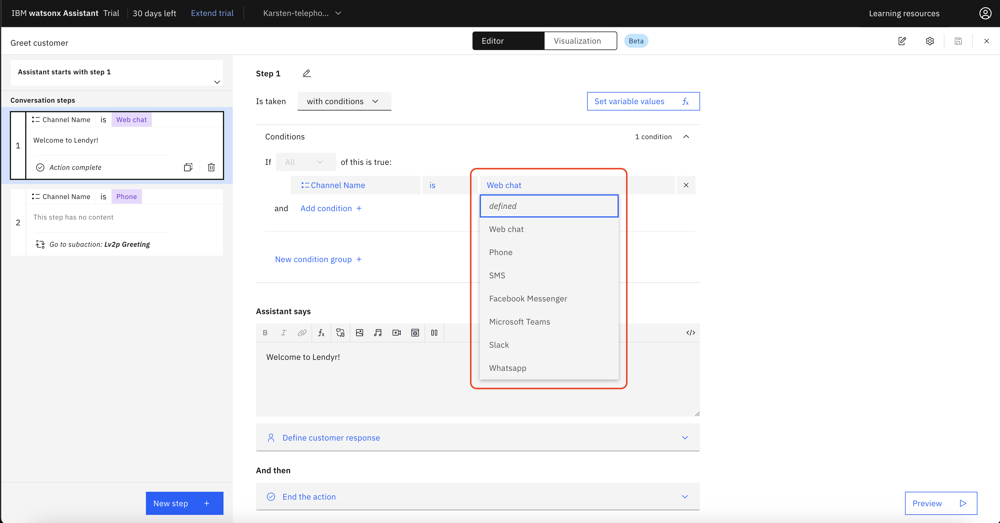
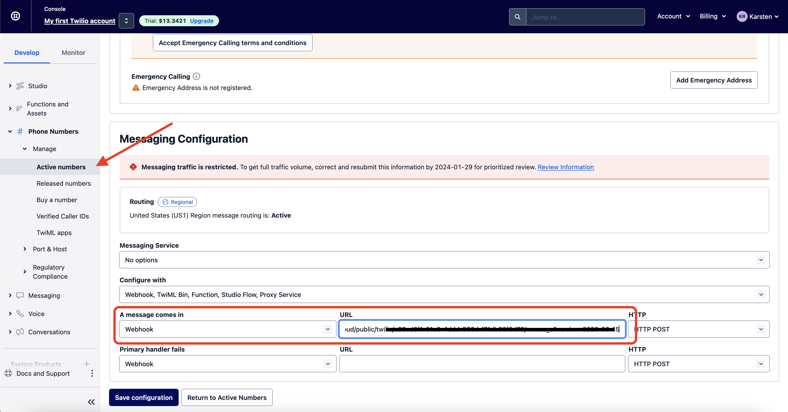

# 205: Phone and Speech

## In this lesson
In this lesson we will be setting up and integrating web, chat, phone and SMS actions with watsonx Assistant.

## Prerequisites:
You will need a Twilio account and a current Watsonx Assistant, this can be through techzone or IBM Cloud.

> **Note:** Your Watsonx Assistant instance will need to be in **Dallas** or **Washington DC** in order to complete this lab.

If you are starting with a new assistant, upload [action-skill.json.zip](https://raw.githubusercontent.com/ibm-build-lab/VAD-VAR-Workshop/main/content/Watsonx/assistant/files/205/action-skill.json.zip) file to your assistant.

### Telephony Example: 

Begin by navigating to the "Lendyr" [phone integration demo](https://www.ibm.com/products/watson-assistant/demos/lendyr/demo.html?page=phone-tour&section=phone). Call the number and follow through the instructions to get an idea of how it works.

Account Number: 4532 9876
Pin: 9348

## Connecting phone calls to watsonx assistant: 

There are several ways to connect phone calls to your assistant via the phone integration. For this lab we will be using intelepeer.

1. [IntelePeer](https://intelepeer.ai):
    > **Note**: This option is only available for United States phone numbers. For non-US phone 
  numbers, see the options below.

    IntelePeer is a Communication Platform as a Service (CPaaS) provider, which allows you to generate and automatically provision a free phone number. When end users call the phone number, IntelePeer will receive the incoming phone calls and forward them to watsonx Assistant.
<br />
2. [NICE CXone](https://www.nice.com/resources/cxone-agent-assist-hub) via a pre-built integration:
    
    You can also connect watsonx Assistant to an instance of NICE CXone, a contact center platform with live agents. The NICE CXone contact center will receive incoming phone calls and can forward them to watsonx Assistant. The assistant can also return these calls back to NICE CXone if it is necessary to escalate to a live agent.
<br />
3. [SIP trunk](https://en.wikipedia.org/wiki/SIP_trunking); Genesys, IntelePeer, Twilio, & more:

    You can connect watsonx Assistant to an existing phone number by configuring a Session Initiation Protocol (SIP) trunk from a provider such as Genesys, IntelePeer, or Twilio. The provider receives incoming phone calls and can forward them to watsonx Assistant. A SIP trunk is equivalent to a telephone line, except it works over the Internet.
<br />

Regardless of integration method, once a call reaches your virtual assistant, the initial input (just like all subsequent replies from the end user) is audio. This voice input is converted into text by IBM Speech to Text (STT) and is used by watsonx Assistant to initiate one of its Actions. When the assistant needs to reply, it converts an Action’s text response (that a builder has written in Actions) into voice audio, using IBM Text to Speech (TTS). This audio is then spoken by the 
assistant to the end user over the phone. As you will see in this lab, watsonx Assistant will automatically configure IBM TTS and STT for each virtual assistant – there is no set-up or billing associated with IBM TTS and STT.

## Phone integration with IntelePeer:

To start setting up phone integration, navigate to your Watsonx Assistant instance. 
1. In the side menu, click "Integrations" and then
2. Click "Add +" in the Phone tile.
    > **Note**: This requires a Plus account.


The phone number may take a few minutes to provision. Next,

3. Click on the "Speech to Text" tab. If you don't already have an instance of Speech to Text (STT), create one. Otherwise select your STT instance and the language model you want to use.  


4. Do the same for "Text to Speech". Note the options to change the voice used, as well as speaking speed.

5. Click "Save and Exit". You're ready to test your assistant! Call the number and speak to the assistant to see how it functions. It should be similar to the Lendyr demo we saw at the start of the lab.



## Interaction Media

Because of the nature of different interaction methods such as phone (audio), SMS (text), and web (visual), your assistant might need to behave differently in each case. For example, [this action](https://www.ibm.com/products/watson-assistant/demos/lendyr/demo.html?section=index&panel=journeys) on the Lendyr website guides the user through the UI. This would not work as well over the phone.

### The "Channel Name" integration variable:

Go to the Actions page, then click Set by assistant (1), and then open the Greet 
customer action (2).


In the conditions section of each of these steps, note the dropdown which allows you to choose options for channel name. This Channel Name variable is built in to watsonx Assistant, and allows you to route users based on how they interact with your assistant.



## Setting up SMS integration

Next we will set up SMS integration using Twilio. If you have not already, head to the [Twilio website](https://www.twilio.com/) and sign up for a free trial account. 

    > **Note**: This lab is unstable as it relies on a 3rd party service (Twilio.) You may encounter a different UI than shown in screenshots, and other things may have changed and / or stopped working.

Next, click "Buy phone number". Note you may have to choose a US number in order for SMS to be supported. After your number provisions, note down:

1. Your account SID
2. Your Auth Token
3. Your Twilio phone number


<br />
Back in Watsonx Assistant, navigate to the integrations page and scroll down to SMS. (1.) Choose Twilio and enter your SID, Auth Token, and number from above. (2.)
<br />


<br />
Continue and copy your webhook URI. Navigate back to Twilio and click Phone Numbers -> Manage -> Active Numbers. Click your phone number and scroll down to Messaging Configuration. Under "A message comes in" select Webhook and paste the URI you copied from Watsonx Assistant, then click save.



### SMS Action

Now that we have the SMS integration set up, let's set up an action that uses it.

Open the actions page and click the "Dispute Charge" action. 


In the action editor page, create a new step and make sure it is the first step (1.) Then change the step to make sure it is taken "with conditions" and select "Channel Name" is "Phone" (2.) Switch to JSON in the "Assistant says" box (3.), and replace the code with the JSON snippet below (4.) Finally, after the response, select "And then" -> "End the action", and save it.


```
{
  "generic": [
    {
      "response_type": "text",
      "values": [
        {
          "text": "I can help you understand charges and file a dispute. I am sending you a link to our mobile-friendly website, where you can walk through a guided journey that will show you how to find and dispute charges."
        }
      ],
      "selection_policy": "sequential"
    },
    {
      "response_type": "user_defined",
      "user_defined": {
        "vgwAction": {
          "command": "vgwActSendSMS",
          "parameters": {
            "message": "Hi! This is the Lendyr virtual assistant. Click the following link to follow a guided journey that will show you how to find and dispute charges. https://www.ibm.com/products/watson-assistant/demos/lendyr/demo.html?section=index&panel=journeys"
          }
        }
      }
    }
  ]
}
```

All done! Let's test it out. Call your intelepeer number and provide the account number and pin used above. After authentication, say you want to dispute a charge, and you should receive the SMS shortly.

This concludes the lab. Note that IBM already has prebuilt connections to NICE CXone and Genesys so if you use one of these try making the connection yourself based on your use case. 
