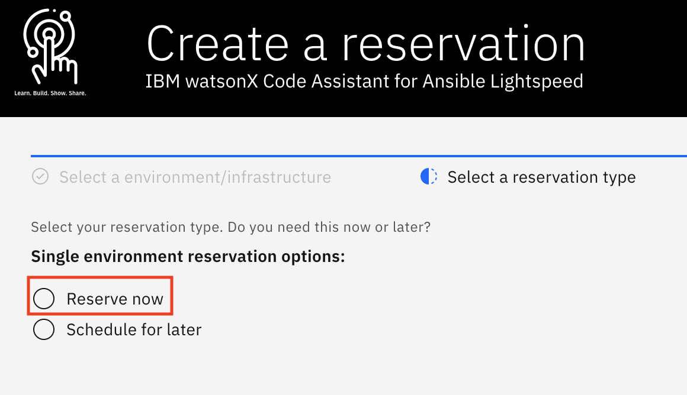
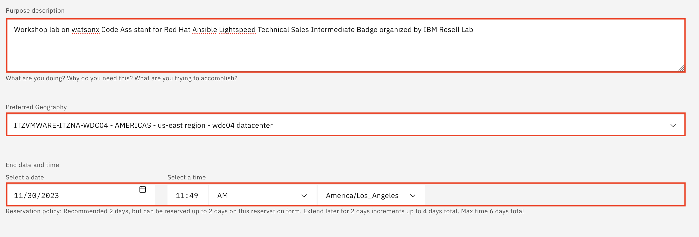
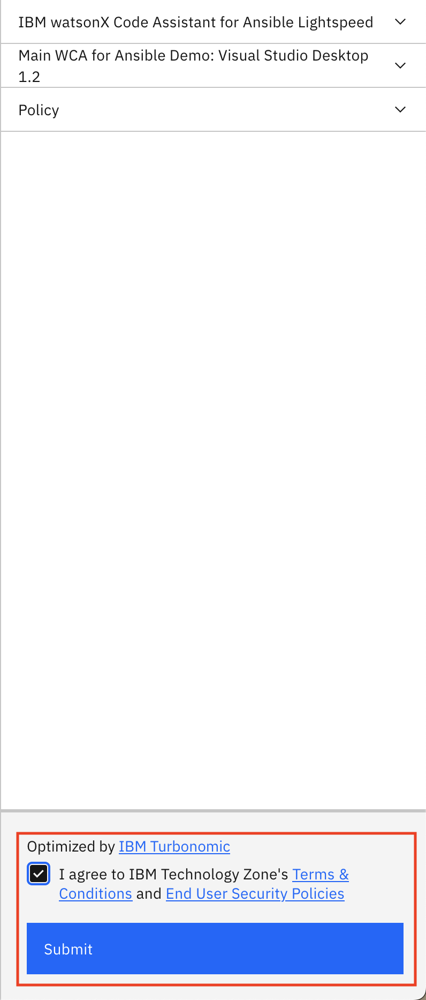
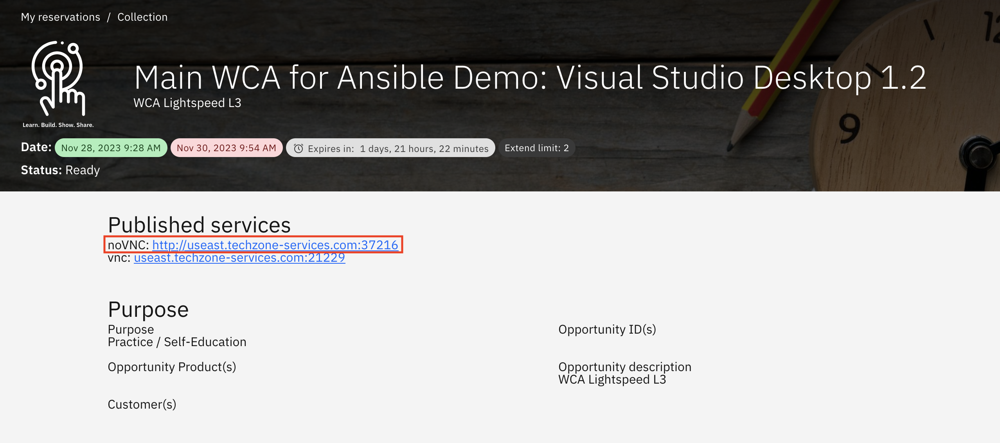
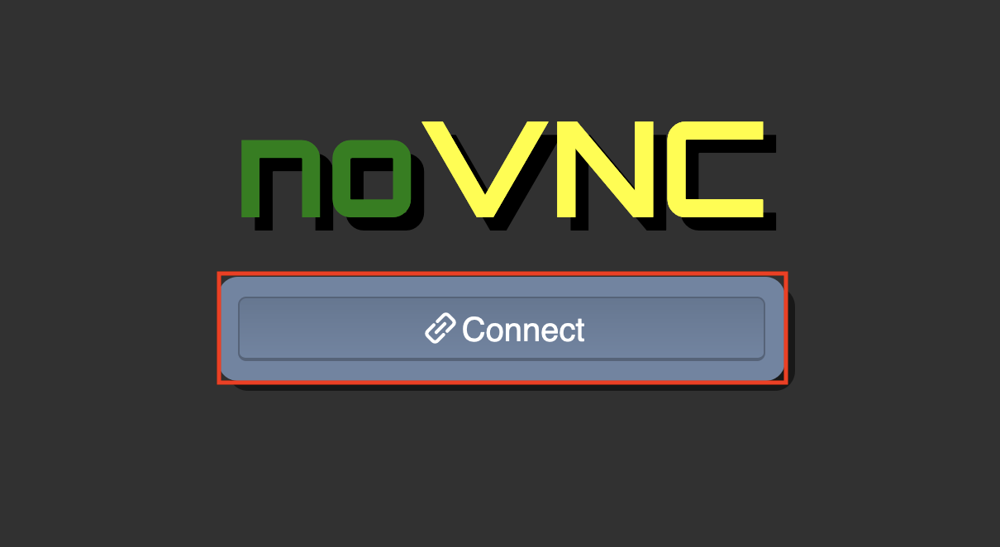
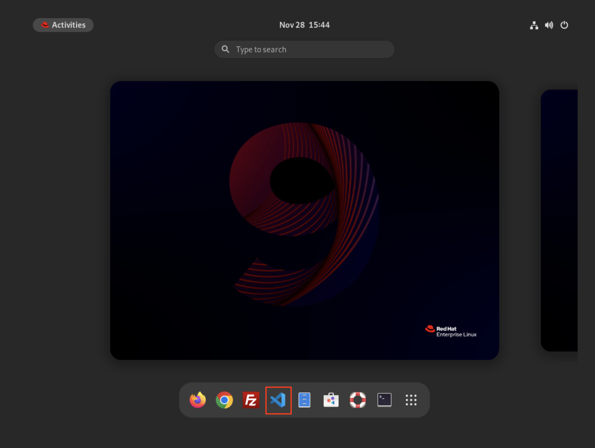
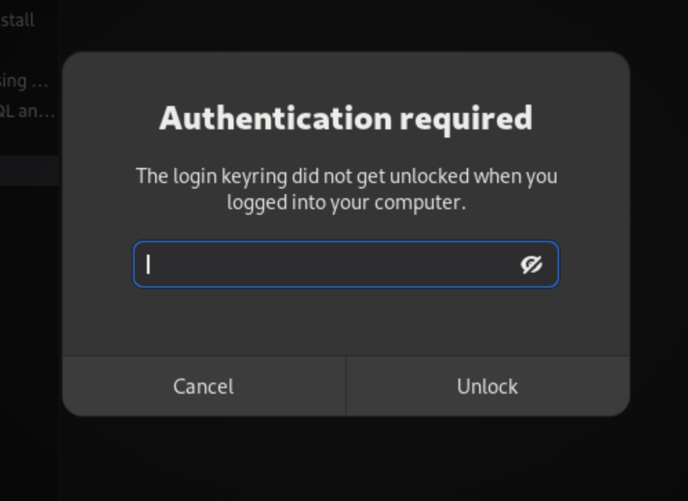
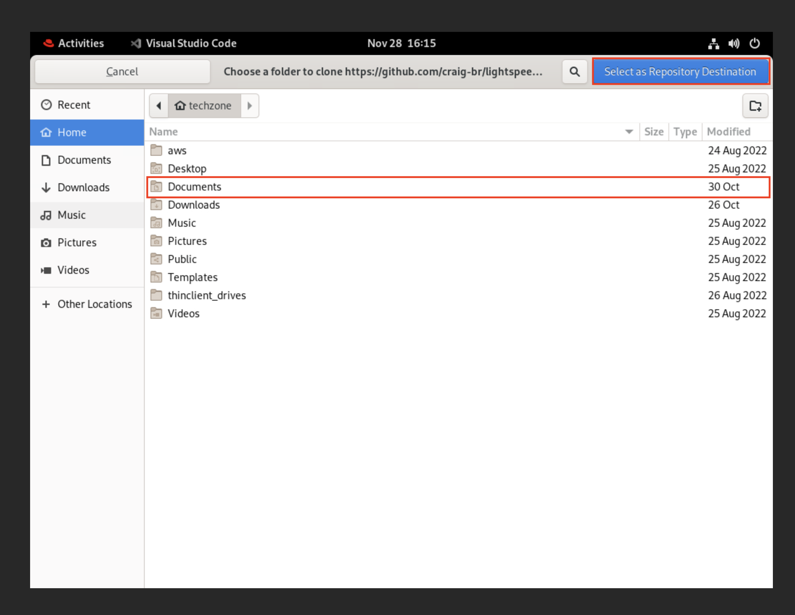
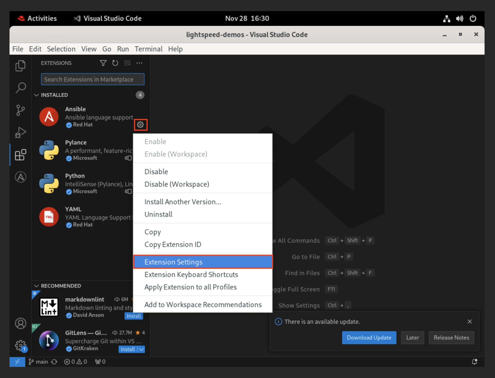
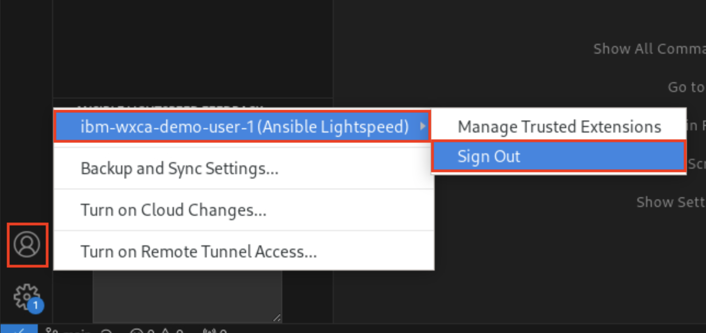

# 101: IBM watsonx Code Assistant (WCA) for Red Hat Ansible Lightspeed Environment Setup

### Goal

The goal of this lab is to provision, access and configure the IBM watsonx Code Assistant (WCA) for Red Hat Ansible Lightspeed IBM Technology Zone Environment for use for the next lab.

## Provision IBM Technology Zone Environment

1. Navigate [here](https://techzone.ibm.com/collection/ibm-watson-x-code-assistant-for-ansible-lightspeed/environments) to reserve and provision a Linux virtual machine (VM) with Visual Studio (VS) Code and IBM watsonx Code Assistant for Red Hat Ansible Lightspeed pre-installed.

2. Select the **Main WCA for Ansible Demo: Visual Studio Desktop 1.2** tile.

  

3. For the reservation type, select the **Reserve now** radio button.

  

4. Accept the default for the reservation **Name**, or provide a name of your choosing. For the Purpose of the reservation, select **Practice / Self-Education**.

  

5. Fill in the **Purpose description** box with the reason you are making the reservation (e.g. `Workshop lab on watsonx Code Assistant for Red Hat Ansible Lightspeed Technical Sales Intermediate Badge organized by IBM Resell Lab`). Then, scroll further down and select your **Preferred Geography** based on your location.(e.g. AMERICAS - us-east region - wdc04 datacenter). Keep the reservation's **End date and time** (by default it’s two days (48 hours) from now; it can’t exceed two days initially, but you can extend the reservation by two days, up to two times, before it expires).

  

6. On the right-side panel, follow the links to read the Terms & Conditions and the End User Security Policies documents. Then, select the checkbox to agree to those terms. Finally, click Submit.

  

  A message in the upper-right corner will briefly appear stating that the reservation has been created. You may also be presented with an opportunity to provide feedback on the process. Feel free to share your feedback.

  Shortly after, you will receive an email from IBM Technology Zone acknowledging receipt of the request and you will receive another email when the provisioning is complete. Provisioning may be as quick as 15 minutes, or it may take an hour or more. If provisioning fails, it may be due to a lack of resources in the geography specified. Try again with the same geography or specify a different one.

  You must now wait until the environment has been provisioned before moving on to the next section. Specifically, you can continue on to the next section once you have received the Reservation Ready on IBM Technology Zone email from IBM Technology Zone.

  Reservation status is available at https://techzone.ibm.com/my/reservations.

## Access & Configure IBM Technology Zone Environment

1. Once you have received the Reservation Ready on IBM Technology Zone email from IBM Technology Zone, access your newly provisioned environment [here](https://techzone.ibm.com/my/reservations) and select the **Main WCA for Ansible Demo: Visual Studio Desktop 1.2** tile.

  

2. Under the **Published services** section, click on the **noVNC** link. This will open a new window.

  

3. In the newly opened window, press **Connect**

  

4. For the password, type `IBMDem0s!` and then press **Send Credentials**. Once logged in, you should see the home desktop for your Linux virtual machine (VM).

5. On the docker, select and open **Visual Studio Code**

  

6. For the **Authentication required** popup in Visual Studio Code, type in `IBMDem0s!` and press **Unlock**.

  

  To begin experimenting with WCA generative AI capabilities, you will first need access to some Ansible Playbooks to generate Tasks with. Playbooks have already been prepared ahead of time, which you will make use of here. You need to clone (replicate) the Playbooks from GitHub to a folder on your local machine. A "clone" request in GitHub is essentially a request to replicate code from the cloud-hosted repository into the local (VS Code and local machine) environment. 

7. To perform a clone request with VS Code, press `CTRL` + `Shift` + `P` to open an executable console at the top of VS Code.

8. Enter `git:clone` into the console and hit `Return` to confirm.

  

9. Now you must specify the public repository from which to clone the data. Copy and paste `https://github.com/craig-br/lightspeed-demos.git` into the console and hit `Return` to confirm.

10. You will be asked to select (using your local machine's file browser) the destination for where the cloned data will be saved locally. Select **Documents** (or your preference) and then confirm by clicking **Select as Repository Destination** to kick off the replication from GitHub to your local machine.

  

11. A prompt will appear asking **Would you like to open the cloned repository, or add it to the current workspace?** — click **Open**.

  

Next, you will need to activate your Ansible Lightspeed Technical Preview extension for VS Code. 

12. On the left sidebar, click the **Extensions** icon (as shown in the screenshot below) to open the marketplace of Microsoft services and open source technologies that can be integrated with VS Code. 

  

13. Locate the installed Ansible extension from the list and click the mechanical "cog" icon (as shown below), located on the right side of the Ansible service tile. From the dropdown list of options, click **Extension Settings**.

  

14. A settings panel for Ansible will fill the screen. Select the **Workspace** toggle option.

  

15. Scroll down the list of settings until you locate the fields **Ansible > Lightspeed** and **Ansible > Lightspeed > Suggestions**. By default, these will be disabled. Click the checkmark icons to the left of **BOTH** entries to **ENABLE** IBM watsonx Code Assistant for Red Hat Ansible Lightspeed Tech Preview features within the VS Code environment.

  The settings will automatically be applied without needing to confirm or "save" manually. Close the Settings tab using the X icon along the top of the taskbar to proceed.

  

16. Due to a token login issue from the environment creation, you have to relogin to Ansible Lightspeed. To do this, on the left sidebar of the VS Code environment, click the **Accounts** icon (as shown in the screenshot below), locate the Ansible Lightspeed user (ex. `ibm-wxca-demo-user-1`), and press **Sign Out**. On the popup, press **Sign Out** again.

  

17. To relogin, click the Ansible icon from the sidebar of the VS Code environment (look for the large "A" icon). A panel will open displaying details about Ansible Lightspeed Login. Click the blue **Connect** button to launch the authorization tool. A popup will appear stating that **The extension Ansible wants to sign in using Ansible Lightspeed** — click **Allow**. You will then be asked about opening an external website — click **Open**.

  

18. Your web browser will then load to a page asking you to login. Click the **Log in with Red Hat** option. Accept any license agreements that accompany the log in request.

  

19. Use the prefilled Red Hat login and press **Next**. For the password, click on the password line to bring up the autofill password for the prefilled login. Select the autofill password and press **Log in**.

  

20. You will be asked to Authorize Ansible Lightspeed for VS Code — click **Authorize**. You will now be brought back to VS Code and successfully relogged into Ansible Lightspeed.

  

### Congratulations, you have reached the end of lab 101.

Click, [lab 102](/watsonx/codeassistant/102) to start next lab.
