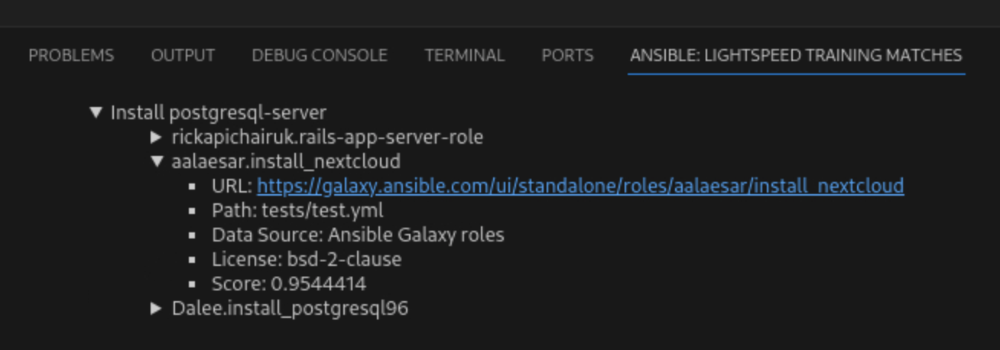

# 102: Generating Code using IBM watsonx Code Assistant (WCA) for Red Hat Ansible Lightspeed

### Goal

The goal of this lab is to experiment with three of the key capabilities of IBM watsonx Code Assistant (WCA) for Red Hat Ansible Lightspeed in Visual Studio (VS) Code:
* AI-generated code recommendations

* Content source matching and source attribution

* Post-processing of AI-generated code for adherence to best practices

## AI-generated code recommendations

> **Ansible Tasks** An Ansible Task is a statement in Ansible's automation script (the YAML-based Playbooks we have been working with) that declares a single action to be executed. This might be installing a package, copying a file, or shutting down a service on a remote machine. Each Task represents an idempotent operation (an action that can be repeated multiple times and deliver the same result every time) that aligns the remote managed node to the specified state, ensuring consistency across multiple executions.

The process of creating AI-generated code recommendations is as simple as modifying the natural language (plain English) Task descriptions of an action that is to be executed, which always start with `- name:` and followed by some description of the task to be performed. Ansible Tasks are often preceded with some `#` comments or documentation — particularly inside the Technical Preview assets. After the natural language description of the automation Task has been set, Generative AI handles the rest.

1. On the left sidebar in VS Code, click the **Explorer** icon (as shown in the screenshot below) to open the Explorer view to view your current working directory.

  

2. From the current working directory in the Explorer, navigate to and open the Ansible Playbook in the following directory: `lightspeed-demos-main/playbooks/infra/install_cockpit/demo_install_cockpit.yml`

    The Playbook code in `demo_install_cockpit.yml` warrants some explanation before we move on with modifications:
      * **Line 2** essentially marks the beginning of the Playbook instructions, the purpose of which is to automate the process of installing and configuring [Cockpit](https://www.redhat.com/en/blog/automate-rhel-web-console-deployments-cockpit-and-certificate-rhel-system-roles) for Red Hat Ansible. Cockpit is an interactive server administration interface that provides a graphical overview of statistics and configurations for a system or systems within a network.
      
      * **Lines 3-4** define variables that will remain static throughout the remainder of the Playbook. These variables will be referenced by the AI-generated code suggestions at a later stage. This is a key capability of the offering and one which you will go into much finer details on later.
      
      * **Lines 6-9** are variables which have been commented out and therefore are invisible to the execution of the Ansible script and not examined by WCA for context when generating code recommendations. You will experiment with how removing the `#` comment blocks impacts the recommendations of task block code. "Uncommenting" these lines of code will make them viable for execution and these lines will afterwards be considered as valid Playbook "context" for AI code generation.


3. Locate **TASK 1** on **Line 15** of the YAML file, which handles installation of Cockpit for Ansible.

    ```yaml
    # - name: Install cockpit package
    ```

    Pay attention to the indentation and characters used on **Line 15**, which in sequence from left to right are as follows:
    * begins with a `TAB` indentation
    
    * a `#` character to "comment out" the line contents
    
    * a whitespace `SPACE` character
    
    * `- name:` which signifies the start of a Task definition
    
    * and finally the natural language description of the Task


4. To generate code for the Task using WCA, first **uncomment** **Task 1** on **Line 15** (remove `#` characters from the start of a line). Highlight the line of code you wish to uncomment and then press `CTRL` + `/`. *Tip: commented out lines of code in VS Code will appear as green text.*

  > **Indentation Levels and Whitespace** Similarly to Python, Ansible and YAML Playbooks are very sensitive to whitespacing and indentation. Indentations (such as the `TAB` in this example) denote different hierarchies and code nesting levels within the YAML structure. You can use whitespaces instead of `TAB` if you prefer, but be sure to keep your indentations consistent: keep using TAB or whitespaces for indenting lines of code, but don't intermix the two.

    Afterwards, Line 15 should look like the following — beginning with a single TAB indentation:

    ```yaml
      - name: Install cockpit package
    ```

5. Now you are ready to begin generating code. Place your cursor at the end of **Line 15** and hit `Return`. Wait for WCA to engage and generate the suggested (in grey, italicized text) code blocks for executing the task.

    This temporary code suggestion is entirely generated by AI. As a user, you have the option to either accept the code recommendation as-given by pressing `TAB` on your keyboard OR you can modify the recommended code by highlighting and replacing the italicized text.

6. Press `TAB` to accept the suggested code and compare with the solution below:

    ```yaml
    # TASK 1
    - name: Install cockpit package
      ansible.builtin.package:
        name: cockpit
        state: present
    ```

    The AI-generated code suggestion invoked the [Fully Qualified Collection Name](https://docs.ansible.com/ansible/latest/collections_guide/collections_using_playbooks.html) (FQCN) - `ansible.builtin.package`. Making use of FQCNs where possible is a recommended best practice and is a prime example of the many ways in which the offering infuses post-processing capabilities within the AI-generated code produced by WCA. 

7. Additional examples of infusing best-practices into AI-generated code recommendations can be found in the following **Task 2 (Line 25)**. Generate the task code block as you did previously, accept the AI-suggested code as given using `TAB`, and once again compare your results with the solution below:

    ```yaml
    # TASK 2
    - name: Copy cockpit.conf.j2 to /etc/cockpit
      ansible.builtin.template:
        src: cockpit.conf.j2
        dest: /etc/cockpit/cockpit.conf
        owner: root
        group: root
        mode: '0644'
    ```

    The AI-generated code recommendation will copy `cockpit.conf` to the target host.

    Take note of the fact that the recommendation included the `mode:` argument and set the Linux file permissions to `0644`, neither of which were things explicitly requested in the Task `- name` description, but are both additions which adhere to best practices around defining Ansible automaton tasks. Setting a file permission to `0644` specifies read and write permissions for User and Group levels within the Linux operating system, and provides only read permissions to all others.

    These additional recommendations stem from a robust example of setting file permissions for the `ansible.builtin.template` module, a recommended best practice from the Ansible Galaxy and Red Hat communities that Lightspeed carried into this AI-generated code recommendation as well.

## Content Source Matching

A powerful capability within WCA is **Content Source Matching** (often referred to as "code explainability"), which attempts to match AI-generated code suggestions to the training data and sources that were utilized in generating the suggested Task code.

These code attribution suggestions are created using a **k-NN** ([K-Nearest Neighbors](https://www.ibm.com/topics/knn#:~:text=Next%20steps-,K%2DNearest%20Neighbors%20Algorithm,of%20an%20individual%20data%20point.)) algorithm that examines Ansible Galaxy and training data repositories in search of the nearest related content to the AI-generated code suggestions.

1. To enable **Content Source Matching** capabilities within WCA, navigate to the main menu bar (very top of your screen) for VS Code and go to **View** > **Open View...** as shown below.

  

2. The console along the top of the VS Code interface is now activated and awaiting a prompt. Enter `view Lightspeed Training Matches` and hit the `Return` key to confirm the selection.

  

  At this point, all future generative AI tasks (such as prompting WCA to generate the code for a Task) will now open a panel at the bottom of the VS Code interface displaying a variety of options: **Problems**, **Output**, **Debug Console**, **Terminal**, **Ports**, **Comments**, and most importantly **Ansible:Lightspeed Training Matches**.

3. Let's experiment with generating some lines of code and inspecting the **Ansible:Lightspeed Training Matches** tab to observe this code explainability feature in action. Open the Ansible Playbook in the following directory: `lightspeed-demos-main/playbooks/infra/install_pgsql_and_pgadmin/demo_install_pgsql.yml`.

4. Within your VS Code environment, attempt to generate code for the task on **Line 7**. The resulting code should look like the following:

  ```yaml
  - name: Install postgresql-server
    ansible.builtin.package:
      name: postgresql-server
      state: present
  ```

  Pay attention to the code attribution details associated with this recommendation, which will be appearing in the panel at the bottom of the VS Code interface once the code recommendation is finalized.

5. **Accept** the AI-generated code suggestions (using the `TAB` key) in order to populate the content source matching tab with details about the code's origins.

  

  The three most likely content sources used in training the IBM watsonx Code Assistant for Red Hat Ansible Lightspeed model — which produced the AI-generated code recommendations — are listed within the **Ansible: Lightspeed Training Matches** tab.

  Clicking the arrow icon to the left of each attribution will expand further details about the source. Information about the **URL**, **Path**, **Data Source**, **License**, **Ansible Type**, and **Score** are displayed (where available) under each listing. Red Hat-certified and maintained collections, as well as contributors to open source projects on Ansible Galaxy, are the primary sources for Ansible Lightspeed model training and are the content sources you are most likely to see matched to AI-generated code recommendations.

  Drilling down into the **URL** field will redirect your web browser back to the precise collections and sources on Ansible Galaxy from which the code recommendations were derived. Here you can learn much richer details about the status of the project, any associated open source repositories involved (such as GitHub), contributions and activities ongoing with the code base, the author(s) involved, and many more intricacies.

## Post-processing of AI-generated code

Another element of code generation that WCA excels at is understanding **context** within the Playbook it is executing against. If a variable or attribute is defined earlier within that Playbook, it will be recalled and referenced — where it makes sense to do so — in the generation of subsequent lines of code.

However, one way to make this feature quite obvious is to take a previously-generated block of Task code, update the value assigned to a named variable earlier in the Playbook, and then regenerate the Task code block. In theory, the newly-generated Task block will use the updated variable name (and differ from how the code block was originally generated).

1. To see this in action, open the Ansible Playbook in the following directory: `lightspeed-demos-main/playbooks/cloud/aws/demo_provision_ec2_instance.yml`. Examine **Line 26** and **Line 33**. **Task 1** (**Line 26**) and **Task 2** (**Line 33**) are responsible for gathering information about a network subnet that is to be provisioned and then creating a virtual private cloud (VPC) definition based on those details.

2. Generate an AI-suggested code block for **Task 1** (**Line 26**) by un-commenting the line, placing the cursor at the end of the line, pressing `RETURN`, and then confirming with `TAB`. Afterwards, generate an AI-suggested code block for **Task 2** but do **not** press `TAB` to confirm the code block.

    The first round of AI-generated code for **Task 1** produces a code block with a `register: subnet_info` line — the result of which is to assign this VPC definition to a variable `subnet_info`.

    The AI-generated code that follows for **Task 2** recommends a code block with `vpc_subnet_id: "{ { subnet_info.subnets[0].subnet_id } }"` as the value associated with the VPC's subnet ID. Critically, the variable `subnet_info` that was generated in the previous Task is also referenced in the second Task. This demonstrates the contextual awareness of WCA in action.

  

3. Now change the name of the variable that was generated from **Task 1** from `subnet_info` to `subnet_name`. Observe how the **Task 2** block is altered after deleting the previously-generated **Task 2** content and re-generate the code block by pressing `RETURN` at the end of the line for **Task 2**.

  You will immediately notice that the new block of task code references the variable `subnet_name` that was modified just a moment ago. Once again, WCA has generated code suggestions that take into account the altered context and variables of the Playbook.

  

## IBM watsonx Code Assistant for Red Hat Ansible Lightspeed L3 Course Quiz
Congratulations! You have completed the necessary labs needed to complete the IBM watsonx Code Assistant for Red Hat Ansible Lightspeed L3 course quiz. The quiz can be found [here](https://learn.ibm.com/course/view.php?id=15649). **Note:** You do not need to watch the videos as the labs have covered all course content except for the quiz. You can click through the lessons and take the quiz.

### Congratulations, you have reached the end of lab 102.

Click, [IBM watsonx Code Assistant](/watsonx/codeassistant) to go to the IBM watsonx Code Assistant home page.
