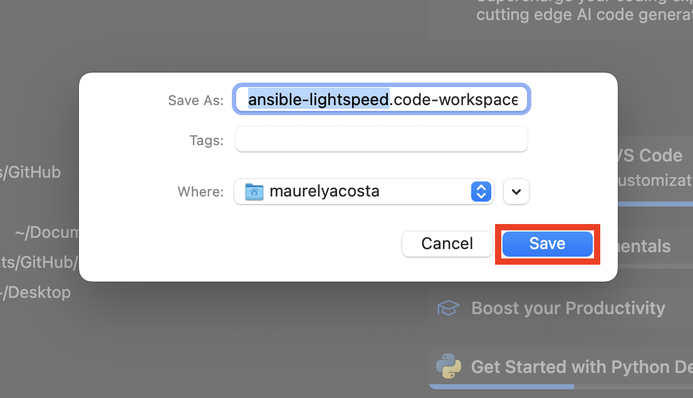
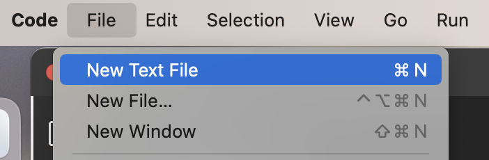
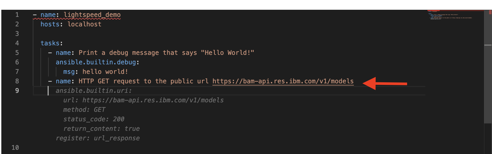
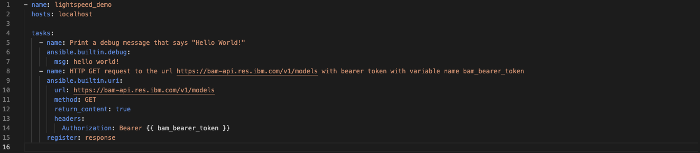
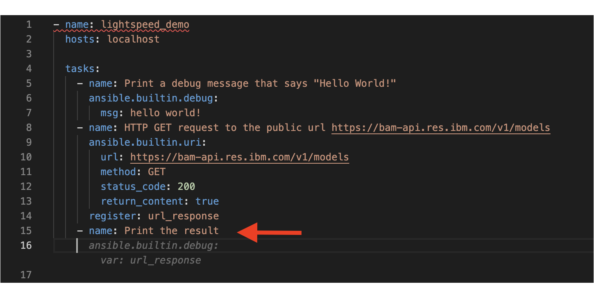

# 104: IBM watsonx Code Assistant

## Goal

The goal of this lab is to help explore/familiarize yourself with some key capabilities available in IBM watsonx Code Assistant (WCA).

## Introduction

IBM watsonx Code Assistant uses a foundation model that is managed by the IBM Research team and trained on [Ansible Galaxy](https://galaxy.ansible.com/), [GitHub](https://github.com/), and other open sources of data. 

The model offers access to Ansible content recommendations through the use of natural language automation descriptions. 

The model is available through a Visual Studio Code (VS Code) extension called **Ansible Lightspeed** with [IBM watsonx Code Assistant](https://www.ibm.com/products/watsonx-code-assistant).


## How to get a recommendation from Ansible Lightspeed

1. Open or create a new workspace. 

    a. You can create a new workspace by selecting **File > Save Workspace As...** 

    

    b. Name the workspace `ansible-lightspeed`. Then click the **Save** button.

    

2. Create a new Ansible playbook by creating a new file called `lightspeed-demo.yml`.

    a. Select **File > New Text File**

    

    b. Click **Select a language** in the new file and a dropdown menu will appear then select **Ansible** 

    

    c. Save the file and name it `lightspeed-demo` with a YAML extension (`.yml` or `.yaml`)

3.  On the bottom-right corner, you should see **Lightspeed**. Ansible Lightspeed is ready for you to write playbooks.

    **Note:** *Check that your Python environment is also selected.*

    

4. Add a new Ansible task with a name in plain English that says `Print debug message that says "Hello World!"`.

    Once you hit the *Enter* key, the suggestion will appear as faded text. 
    
    Lightspeed will recommend code based on the text you typed in the name field in the playbook section.

    

5. You can accept the recommendation by hitting the *Tab* key.

    

6. Let's add a second task to our Playbook. Write a sentence in a new `name` field that says `Print today's date and time`.

    

7. Press the  *Esc* key to decline the recommendation. The faded recommendation should disappear.

8. You can see how simple it is to accept and decline a recommendation. Let's try adding a more advanced task. Create a new task with this sentence `HTTP GET request to the url https://bam-api.res.ibm.com/v1/models with bearer token with variable name bam_bearer_token`.


    

9. Click the *Enter* key and accept the recommendation by pressing the *Tab* key.

    

10. You can either copy and paste your [BAM](https://bam.res.ibm.com/) access token in place of the `{{ bam_bearer_token }}` or you can retrieve your access token from your local environment and assigned it to a variable in your ansible playbook by adding the following code:

    ``` yml
      vars:
        bam_bearer_token: "{{ lookup('env','bam_bearer_token') }}"
    ```

    

11. Add another task with the sentence `Print the result`. Click the *Enter* key and accept the recommendation by pressing the *Tab* key.

    

    **Note**: *Lightspeed also provides source code recommendations in the debugging window beside the terminal. It shows more information if you extend it.*

    

12. You can run your Ansible Playbook with the following terminal command. You should see the tasks we created being executed.

    ```bash
    ansible-playbook lightspeed-demo.yml
    ```

    


    You can continue experimenting with creating new tasks. If you do not get a recommendation that aligns with the intent of your task name, then rephrasing your statement to provide more information on what is desired may lead to better recommendations.

    The actions that you take when a recommendation is provided impact the training process of the model.

    If a recommendation is accepted, and then further edits are performed, then the act of changing the recommendation to something else will be considered a modification of the recommendation. This will tell Ansible and IBM watsonx Code Assistant that the recommendation required extra editing in order to meet the intended use. This information will be used for context in training the model for similar prompts in the future.


