# 101: IBM watsonx Code Assistant (WCA) para la configuración del entorno Red Hat Ansible Lightspeed

### Objetivo

El objetivo de este laboratorio es aprovisionar, acceder y configurar IBM watsonx Code Assistant (WCA) para Red Hat Ansible Lightspeed IBM Technology Zone Environment para su uso en el siguiente laboratorio.

## Provisión de entorno de zona tecnológica de IBM

1.  Navegue [aquí](https://techzone.ibm.com/collection/ibm-watson-x-code-assistant-for-ansible-lightspeed/environments) para reservar y aprovisionar una máquina virtual (VM) Linux con Visual Studio (VS) Code e IBM watsonx Code Assistant para Red Hat Ansible Lightspeed preinstalados.
2.  Seleccione el mosaico **Main WCA for Ansible Demo: Visual Studio Desktop 1.2** tile.

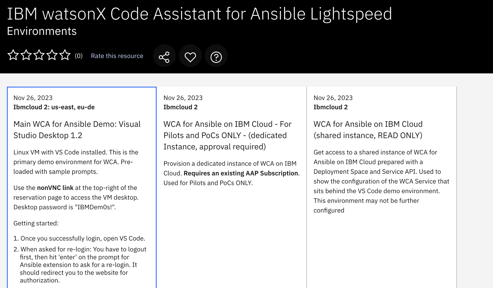

3.  Para el tipo de reserva, seleccione el botón de opción **Reservar ahora**.

4.  Acepte el **nombre** predeterminado para la reserva o introduzca un nombre de su elección. Para el Propósito de la reserva, seleccione **Práctica / Autoformación**.

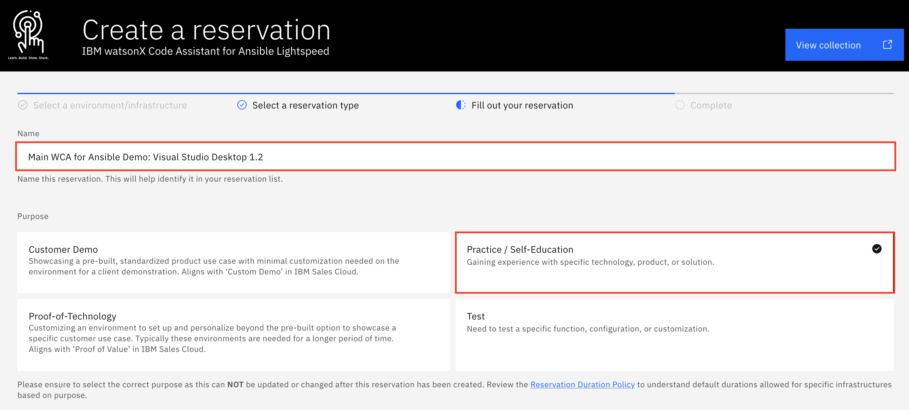

5.  Rellene la casilla **Descripción del propósito** con el motivo por el que realiza la reserva (por ejemplo, `Workshop lab on watsonx Code Assistant for Red Hat Ansible Lightspeed Technical Sales Intermediate Badge organized by IBM Resell Lab`). A continuación, desplácese más abajo y seleccione su **Geografía preferida** en función de su ubicación (por ejemplo, AMÉRICA - región este de EE.UU. - centro de datos wdc04). Mantenga la **fecha y hora de finalización de** la reserva (por defecto son dos días (48 horas) a partir de ahora; inicialmente no puede superar los dos días, pero puede ampliar la reserva dos días más, hasta dos veces, antes de que caduque).

6.  En el panel de la derecha, siga los enlaces para leer los documentos Términos y condiciones y Políticas de seguridad del usuario final. A continuación, marque la casilla para aceptar las condiciones. Por último, haga clic en Enviar.

Aparecerá brevemente un mensaje en la esquina superior derecha indicando que se ha creado la reserva. También se le ofrecerá la oportunidad de dar su opinión sobre el proceso. No dude en compartir sus comentarios.

Poco después, recibirá un correo electrónico de IBM Technology Zone acusando recibo de la solicitud y recibirá otro correo electrónico cuando se haya completado el aprovisionamiento. El aprovisionamiento puede ser tan rápido como 15 minutos, o puede tardar una hora o más. Si el aprovisionamiento falla, puede deberse a la falta de recursos en el área geográfica especificada. Inténtelo de nuevo con la misma zona geográfica o especifique una diferente.

Ahora debe esperar hasta que el entorno se haya aprovisionado antes de pasar a la siguiente sección. Concretamente, podrá continuar con la siguiente sección una vez que haya recibido el correo electrónico Reserva lista en IBM Technology Zone de IBM Technology Zone.

El estado de las reservas puede consultarse en [https://techzone.ibm.com/my/reservations.](https://techzone.ibm.com/my/reservations)

## Acceder y configurar el entorno de la zona tecnológica de IBM

1.  Una vez que haya recibido de IBM Technology Zone el correo electrónico de Reserva lista en IBM Technology Zone, acceda [aquí](https://techzone.ibm.com/my/reservations) a su entorno recién aprovisionado y seleccione el mosaico **Main WCA for Ansible Demo: Visual Studio Desktop 1.2**.

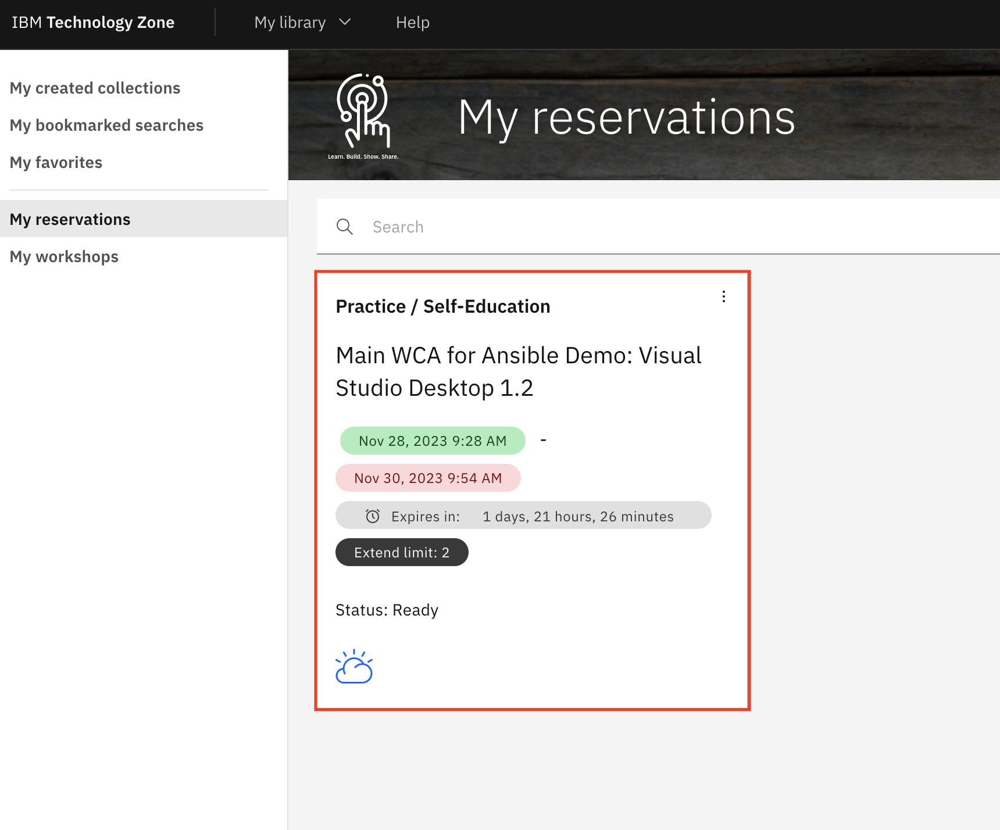

2.  En la sección **Servicios publicados**, haga clic en el enlace **noVNC**. Se abrirá una nueva ventana.

3.  En la ventana recién abierta, pulse **Conectar**

4.  Para la contraseña, escriba `IBMDem0s!` y pulse **Enviar credenciales**. Una vez iniciada la sesión, debería ver el escritorio de inicio de su máquina virtual Linux (VM).
5.  En el docker, seleccione y abra **Visual Studio Code**

6.  En la ventana emergente **Autenticación requerida** en Visual Studio Code, escriba `IBMDem0s!` y pulse **Desbloquear**.

Para empezar a experimentar con las capacidades de IA generativa de WCA, primero necesitarás acceso a algunos Playbooks de Ansible con los que generar Tareas. Los Playbooks ya han sido preparados con antelación, y los utilizarás aquí. Necesitas clonar (replicar) los Playbooks desde GitHub a una carpeta en tu máquina local. Una petición "clone" en GitHub es esencialmente una petición para replicar código desde el repositorio alojado en la nube al entorno local (VS Code y máquina local).

7.  Para realizar una solicitud de clonación con VS Code, pulse `CTRL` + `Shift` + `P` para abrir una consola ejecutable en la parte superior de VS Code.
8.  Introduce `git:clone` en la consola y pulsa `Return` para confirmar.

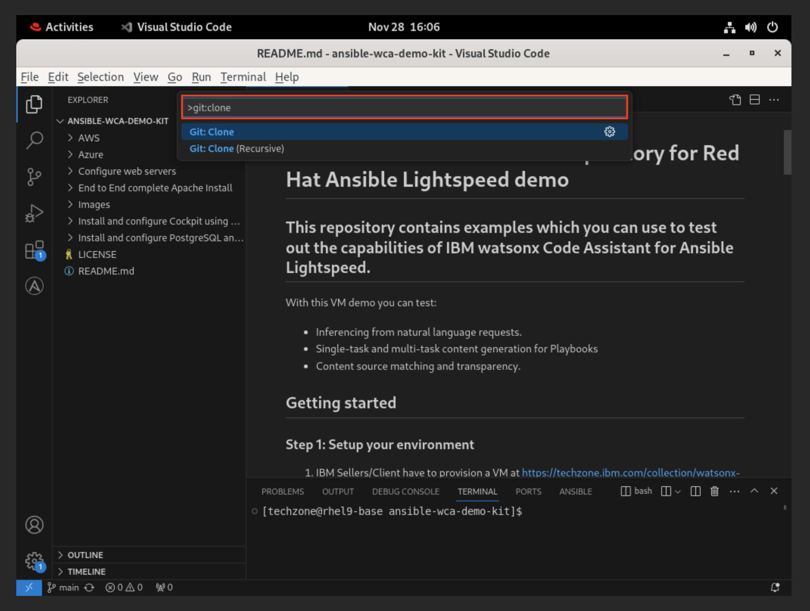

9.  Ahora debes especificar el repositorio público desde el que clonar los datos. Copia y pega `https://github.com/craig-br/lightspeed-demos.git` en la consola y pulsa `Return` para confirmar.

> **Nota:** Puede copiar y pegar utilizando el portapapeles de arriba

10. Se te pedirá que selecciones (utilizando el explorador de archivos de tu máquina local) el destino donde se guardarán localmente los datos clonados. Selecciona **Documentos** (o tu preferencia) y luego confirma haciendo clic en **Seleccionar como destino del repositorio** para iniciar la replicación desde GitHub a tu máquina local.

11. Aparecerá un mensaje preguntando **¿Desea abrir el repositorio clonado o añadirlo al espacio de trabajo actual?** - pulse **Abrir**.

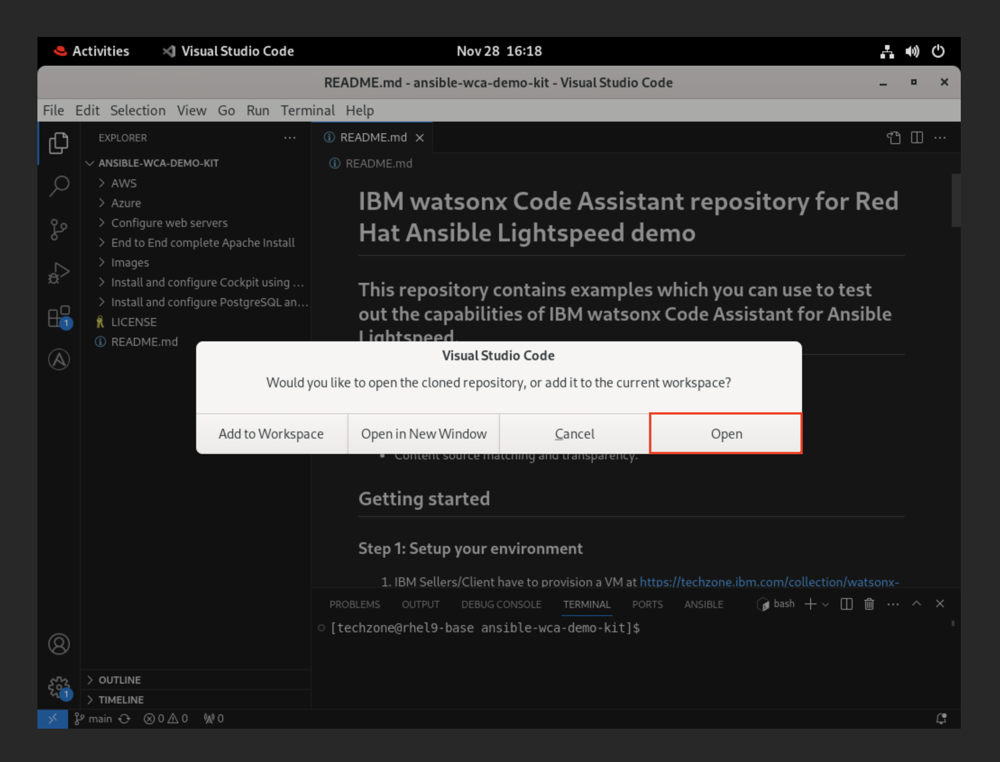

A continuación, deberá activar su extensión Ansible Lightspeed Technical Preview para VS Code.

12. En la barra lateral izquierda, haga clic en el icono **Extensiones** (como se muestra en la siguiente captura de pantalla) para abrir el mercado de servicios de Microsoft y tecnologías de código abierto que pueden integrarse con VS Code.

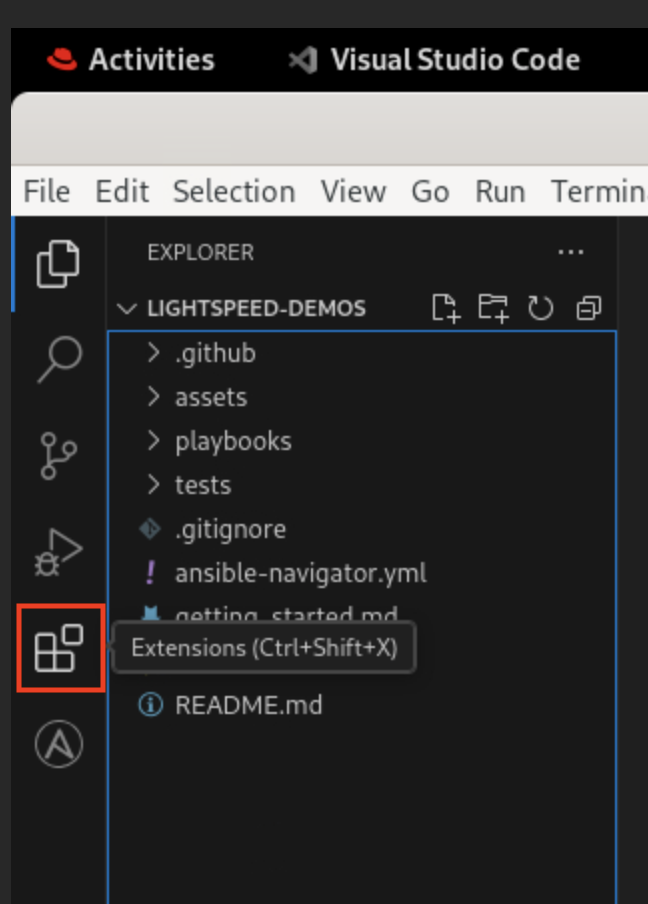

13. Localice en la lista la extensión de Ansible instalada y haga clic en el icono mecánico de "engranaje" (como se muestra a continuación), situado en la parte derecha del mosaico de servicios de Ansible. En la lista desplegable de opciones, haga clic en **Configuración de la extensión**.

14. Un panel de configuración para Ansible llenará la pantalla. Seleccione la opción **Espacio de trabajo**.

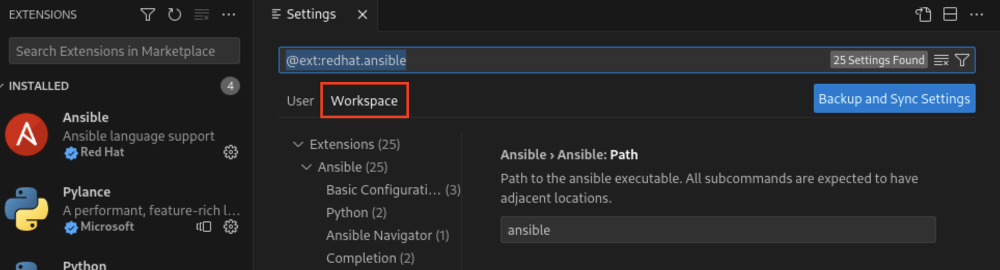

15. Desplácese por la lista de ajustes hasta localizar los campos **Ansible > Lightspeed** y **Ansible > Lightspeed > Sugerencias**. Por defecto, estarán desactivados. Haga clic en los iconos de marca de verificación a la izquierda de **AMBAS** entradas para **HABILITAR** las funciones de IBM watsonx Code Assistant para Red Hat Ansible Lightspeed Tech Preview dentro del entorno VS Code.

Los ajustes se aplicarán automáticamente sin necesidad de confirmarlos o "guardarlos" manualmente. Para continuar, cierre la pestaña Configuración con el icono X situado en la parte superior de la barra de tareas.

16. Debido a un problema con el token de inicio de sesión desde la creación del entorno, tiene que volver a iniciar sesión en Ansible Lightspeed. Para ello, en la barra lateral izquierda del entorno VS Code, haga clic en el icono **Cuentas** (como se muestra en la siguiente captura de pantalla), localice el usuario de Ansible Lightspeed (por ejemplo, `ibm-wxca-demo-user-1`) y pulse **Cerrar** sesión. En la ventana emergente, pulse **Cerrar** sesión de nuevo.

17. Para volver a iniciar sesión, haga clic en el icono Ansible de la barra lateral del entorno VS Code (busque el icono "A" grande). Se abrirá un panel mostrando detalles sobre Ansible Lightspeed Login. Haga clic en el botón azul **Connect** para iniciar la herramienta de autorización. Aparecerá una ventana emergente indicando que **The extension Ansible wants to sign in using Ansible Lightspeed** - click **Allow**. A continuación, se le preguntará acerca de la apertura de un sitio web externo - haga clic en **Abrir**.

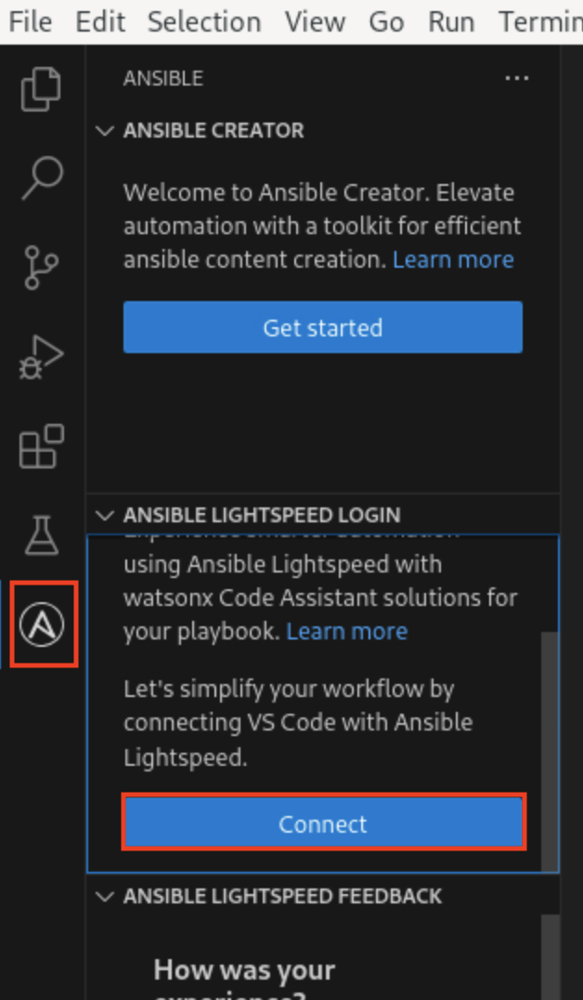

18.  A continuación, su navegador web cargará una página en la que se le pedirá que inicie sesión. Haga clic en la opción **Iniciar sesión con Red Hat**. Acepte los acuerdos de licencia que acompañan a la solicitud de inicio de sesión.

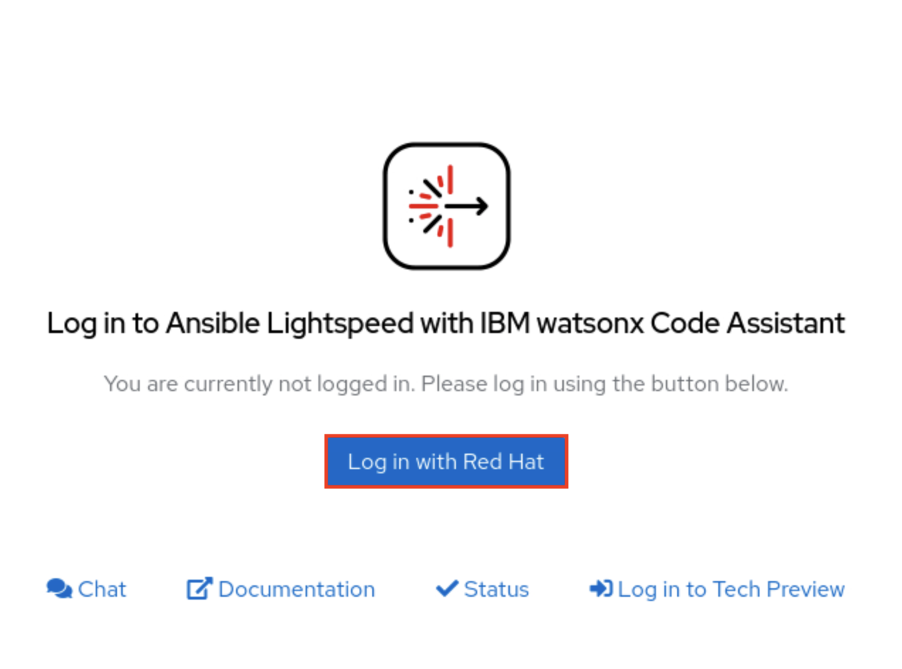

19. Utilice el nombre de usuario de Red Hat rellenado previamente y pulse **Siguiente**. Para la contraseña, pulse en la línea de contraseña para que aparezca la contraseña de autorrelleno para el inicio de sesión rellenado previamente. Seleccione la contraseña de autorrelleno y pulse **Iniciar sesión**.

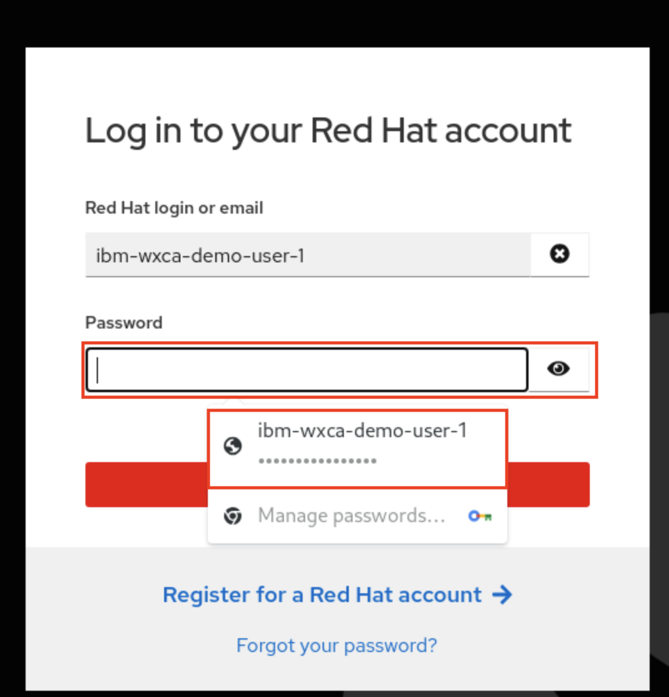

20. Se le pedirá que autorice Ansible Lightspeed para VS Code - haga clic en **Autorizar**. Volverá a VS Code y habrá iniciado sesión en Ansible Lightspeed.

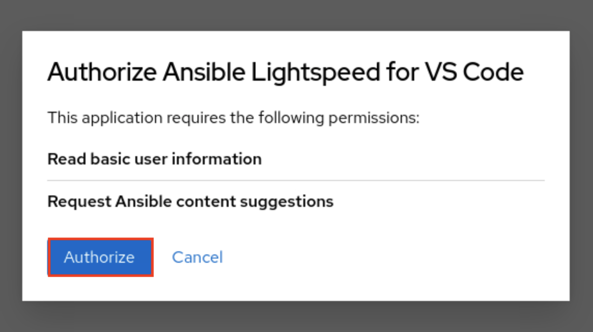

### Enhorabuena, ha llegado al final del laboratorio 101.

Haga clic en, [laboratorio 102](/watsonx/codeassistant/ansible-lightspeed/102) para iniciar el siguiente laboratorio.
