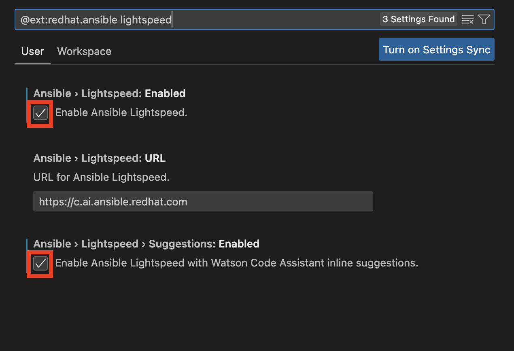
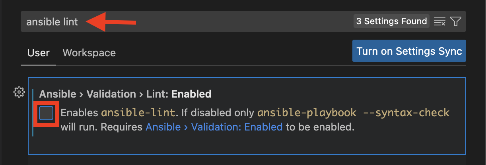
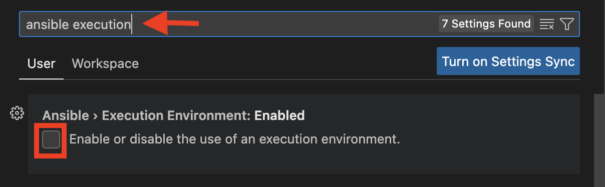
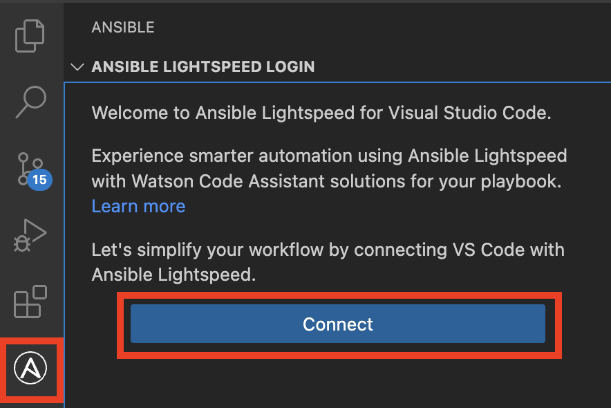
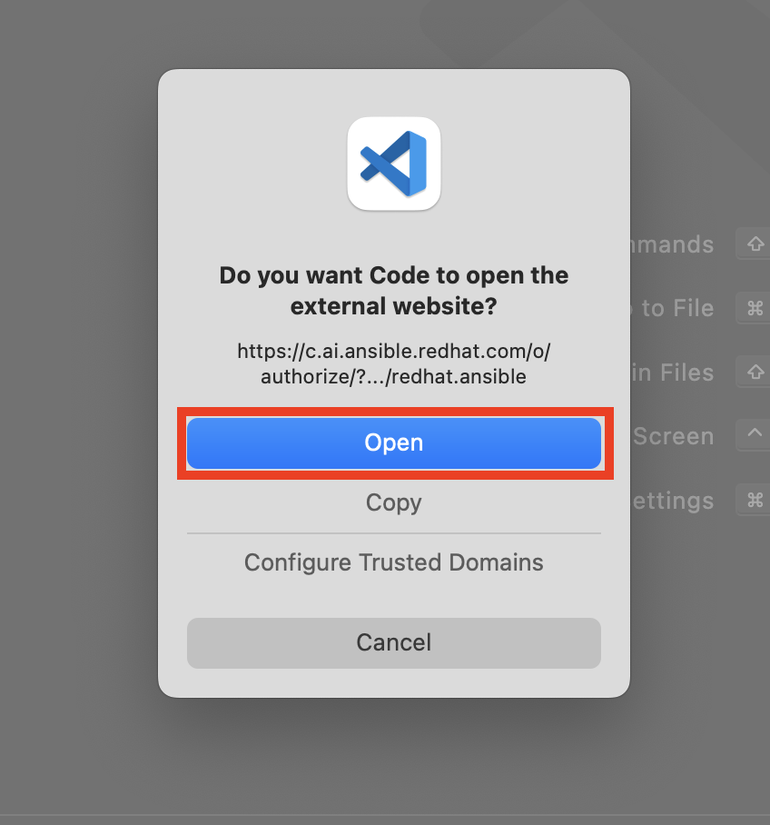
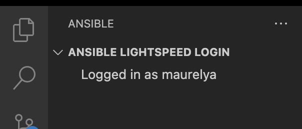

# 103: Configuración del entorno Ansible Lightspeed en VS Code

## Objetivo

El objetivo de este laboratorio es instalar la extensión Ansible Lightspeed y habilitar y autenticar la extensión en VS Code.

## Instalar extensión Ansible en VS Code

1.  Abra la aplicación VS Code.

2.  Haz clic en el icono (1) **Extensiones de** la barra lateral izquierda. A continuación, busque (2) **Ansible** en el cuadro de búsqueda y haga clic en el botón (3) **Instalar**.

    

## Habilitar la extensión Ansible Lightspeed

1.  Después de instalar la extensión Ansible, haga clic en el pequeño icono de engranaje y seleccione la opción **Configuración de la extensión**.

    **Nota:** *Puede que tenga que reiniciar VS Code antes de que todas las opciones de ansible estén disponibles*.

    

2.  En la barra de búsqueda, escriba **lightspeed**

3.  Si aún no están seleccionadas, marque todas las casillas siguientes:

*   Ansible > Lightspeed: **Activado**

*   Ansible > Lightspeed > Sugerencias: **Activado**.

    

**Nota:** Para el *propósito de esta demostración, deshabilitaremos Ansible Lint y Ansible Execution Environment porque no son necesarios para mostrar las características de Ansible Lightspeed y requieren más tiempo de configuración.*

1.  En la barra de configuración de búsqueda, escriba **ansible lint**. Si aún no está deseleccionada, *desmarque* la casilla **Ansible > Validation > Lint: **Enabled****.

    

2.  En la barra de configuración de búsqueda, escriba **ansible execution**. Si aún no está deseleccionada, *desmarque* la casilla **Ansible > Entorno de ejecución: **Activado****.

    **Nota:** *El entorno de ejecución de Ansible requiere un motor de contenedores, por lo que sería necesario instalar Docker o Podman como requisito previo.*

    

## Autenticar Ansible Lightspeed con GitHub

1.  Abra el icono de extensión de Ansible en la parte izquierda de la interfaz de Visual Studio Code y haga clic en **Conectar**.

    

2.  Siga las instrucciones para iniciar sesión en Ansible Lightspeed con IBM watsonx Code Assistant utilizando sus credenciales de GitHub.

    a. Pulse el botón **Permitir**.

    

    b. Pulse el botón **Abrir**.

    

    c. Haga clic en el enlace **Iniciar sesión en Tech Preview**.

    > NOTA: Si tiene una suscripción de pago a Red Hat Ansible Lightspeed, seleccione **Iniciar sesión con Red Hat**.

    

    d. Se le redirigirá a la página de términos y condiciones de IBM y Red Hat.

    

    e. Desplácese hasta la parte inferior de la página de términos y condiciones de IBM y Red Hat y haga clic en el botón **Aceptar**.

    

    f. Aparecerá un diálogo con el título `Authorize Ansible Lightspeed for VS Code`. Haga clic en el botón **Autorizar**

    

    g. Haga clic en el botón **Autorizar ansible**

    

    h. Una vez completado con éxito el flujo de inicio de sesión, deberías ver un mensaje **Logged in as your GitHub id** en la barra lateral de Ansible como el que se muestra a continuación:

    **Nota:** Es *posible que se le pida que permita el acceso a VS Code desde su navegador y viceversa. Asegúrese de permitirlo.*

    

Ahora ya está todo listo para continuar con la siguiente parte de este taller.
