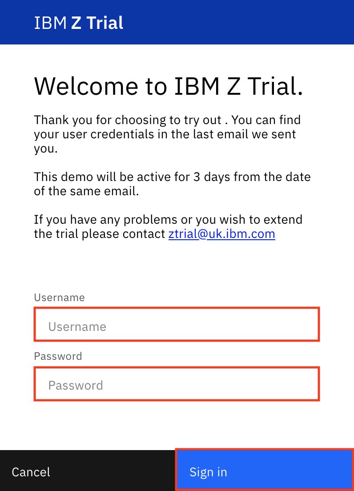
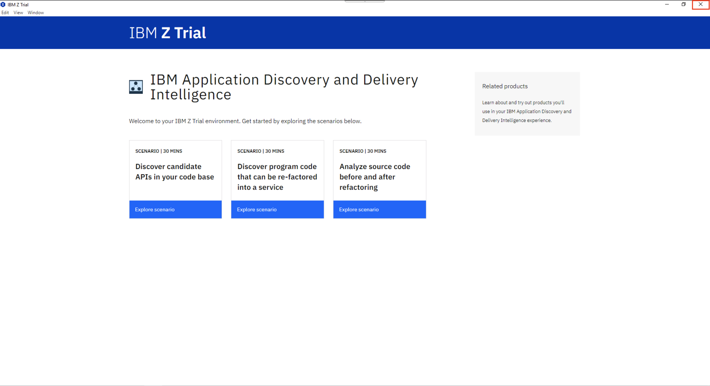

# 111: Configuración del entorno IBM watsonx Code Assistant (WCA) para Z

### Objetivo

El objetivo de este laboratorio es reservar, acceder y configurar IBM watsonx Code Assistant (WCA) for Z Environment para su uso en los próximos laboratorios.

## Reservar entorno de demostración

1.  Reserve el entorno de demostración [aquí](https://learn.ibm.com/mod/page/view.php?id=291032). Las reservas de demostración deben enviarse con un día de antelación. La reserva es accesible hasta unos días.

## Acceder y configurar el entorno

1.  Una vez que haya recibido el punto de acceso web y las credenciales de su entorno de demostración, abra el punto de acceso web e introduzca las credenciales. A continuación, pulse el botón **Iniciar sesión**.

2.  Después de iniciar sesión, si se abre una ventana en la máquina virtual, ciérrela pulsando el botón **X** de la esquina superior derecha para volver al escritorio de la máquina virtual.

### Enhorabuena, ha llegado al final del laboratorio 111.

Haga clic en, [laboratorio 112](/watsonx/codeassistant/z/112) para iniciar el siguiente laboratorio.
