# 112: IBM watsonx Code Assistant (WCA) for Z Application Discovery

### Goal

The goal of this lab is to focus on the **Understand** phase of the mainframe application modernization lifecycle. Going through an application discovery process to understand all the dependencies and relationships in an application is an important first step in any application modernization journey. Architects and developers can spend weeks or months lost trying to understand all the changes needed by reviewing millions of lines of code, hundreds of dependencies, and dated documentation. Using an application discovery tool helps to discover the relationships between application components, and enables developers to visually analyze those relationships, so they can more quickly and safely make changes for a broad set of languages and environments.

## Application Discovery

1. Click on the **IBM Developer for z/OS** icon in the taskbar to open it.

  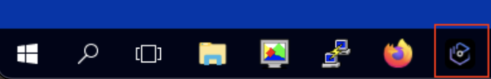

2. A popup will appear asking you to select a directory as workspace. Keep the default directory and press the **Launch** button. **Note:** It might take a couple minutes to load.

  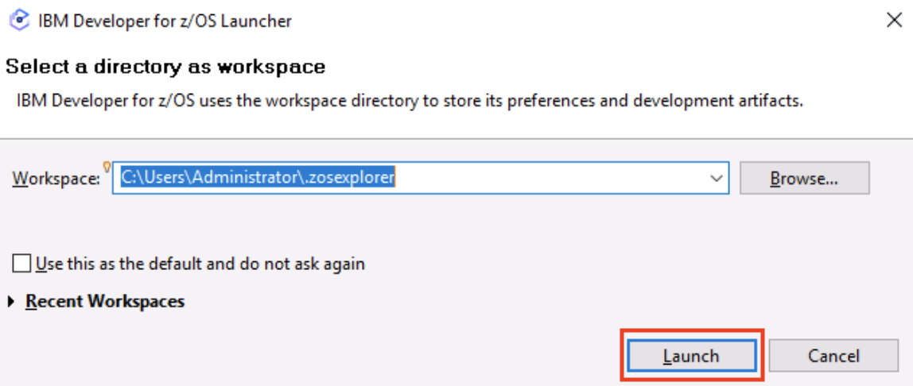

3. The **IBM Developer for z/OS** opens in the **Explore projects** tab. Right-click anywhere below the **quick filter** field and select **Get project list**.

  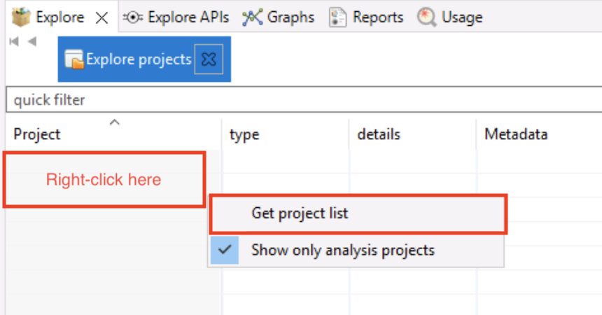

4. Select **GenApp** from the new populated **Project** column.

  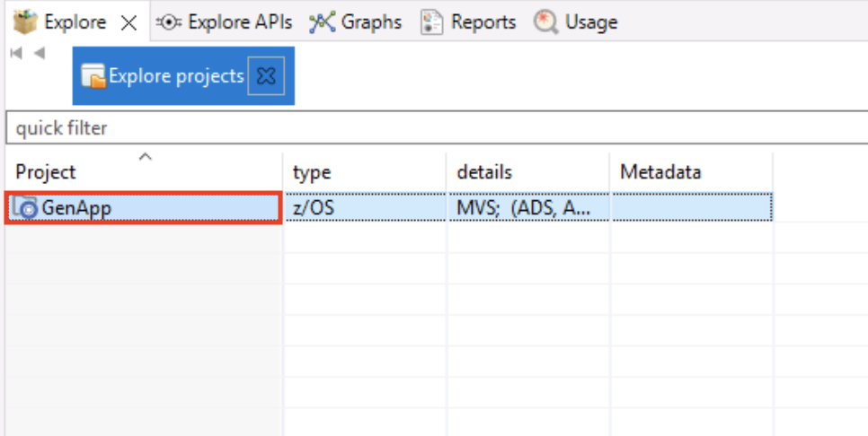

5. A new field with a list of options will appear on the right side of the screen with its own quick filter at the top. In this new field, expand the **Mainframe Graphs** twistie, if not expanded already, and double-click on the **Transaction Callgraph** option. **Note:** It may take a moment for the pop-up needed to do the next step to appear. You will see **executing Transaction Callgraph** at the bottom with a green bar.

  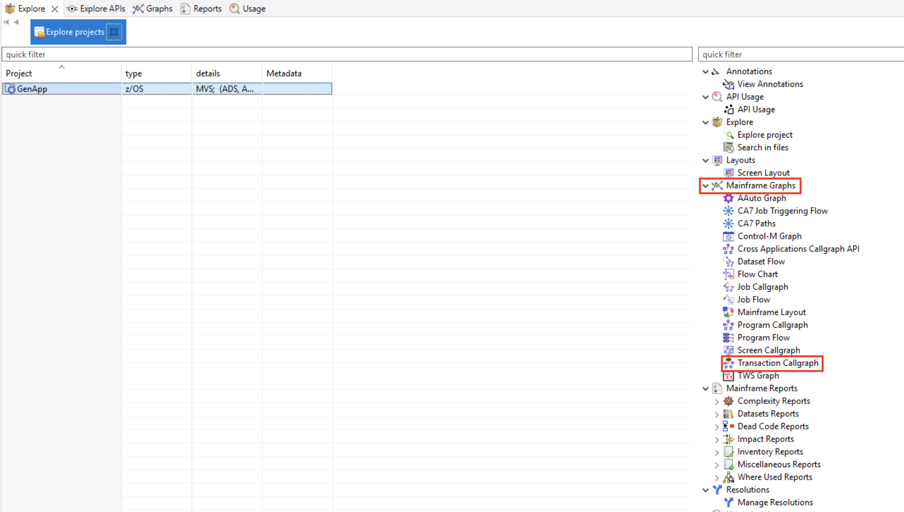

6.  When the **GenApp – Transaction Call Graph Analysis** opens, select everything you see in the **Available transactions** box using the **add all items** button (looks like a fast forward button) to move them to the **Selected transactions** box. Then click the **Finish** button to load all transactions.

  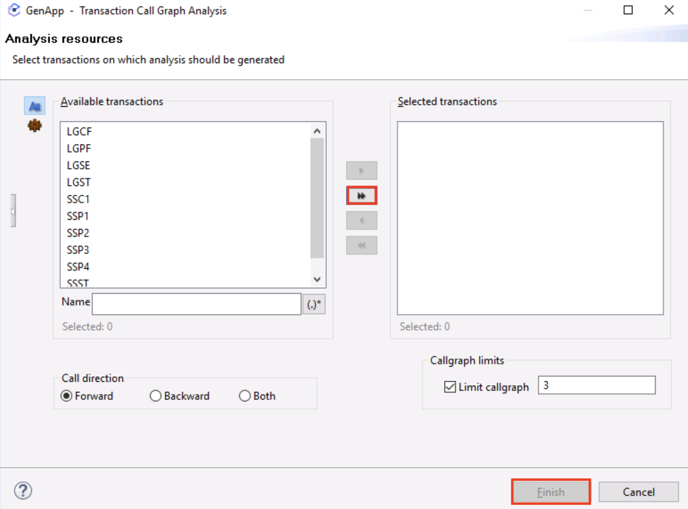

  A call graph will be loaded with all the transactions in this profiled application. (**Note:** it may take a few minutes for the graph to build.)

  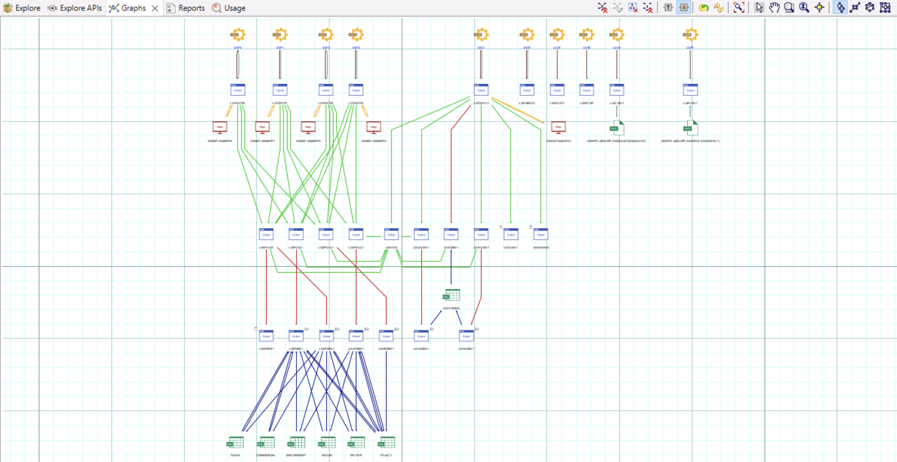

7. Zoom in so you can see the **transaction SSC1**. This transaction is related to the **CUSTOMER** table. The **SSC1** transaction is used to Add, Insert, and Update the 
CUSTOMER table. **SSC1** will be used in the next phase. **Note:** There are some tools in the upper right corner of the graph view to help you navigate and zoom. 

  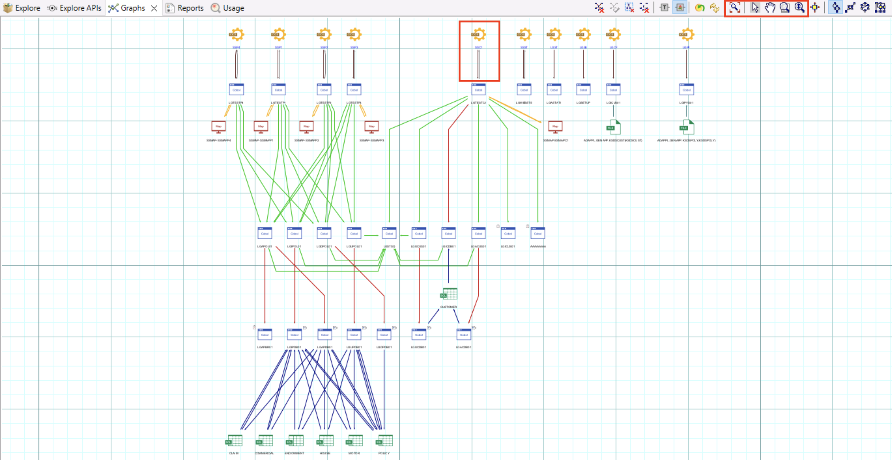

8. Select the **Explore tab**.

  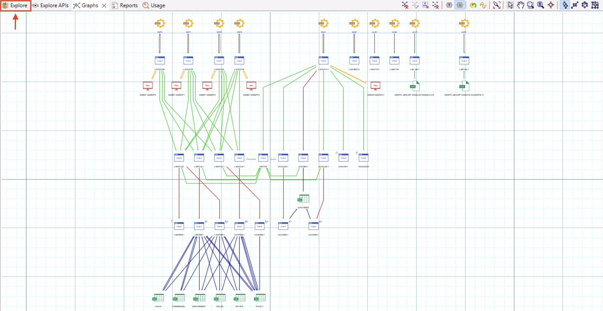

9. Repeat step 5 and double-click on the **Transaction Callgraph** option.

10. This time (unlike in Step 6), only select the **SSC1 transaction** and this time use the **add selected items** icon (it looks like a play button) to just add this transaction to the **Selected transactions** box on the right. Then click the **Finish** button to load the transaction.

  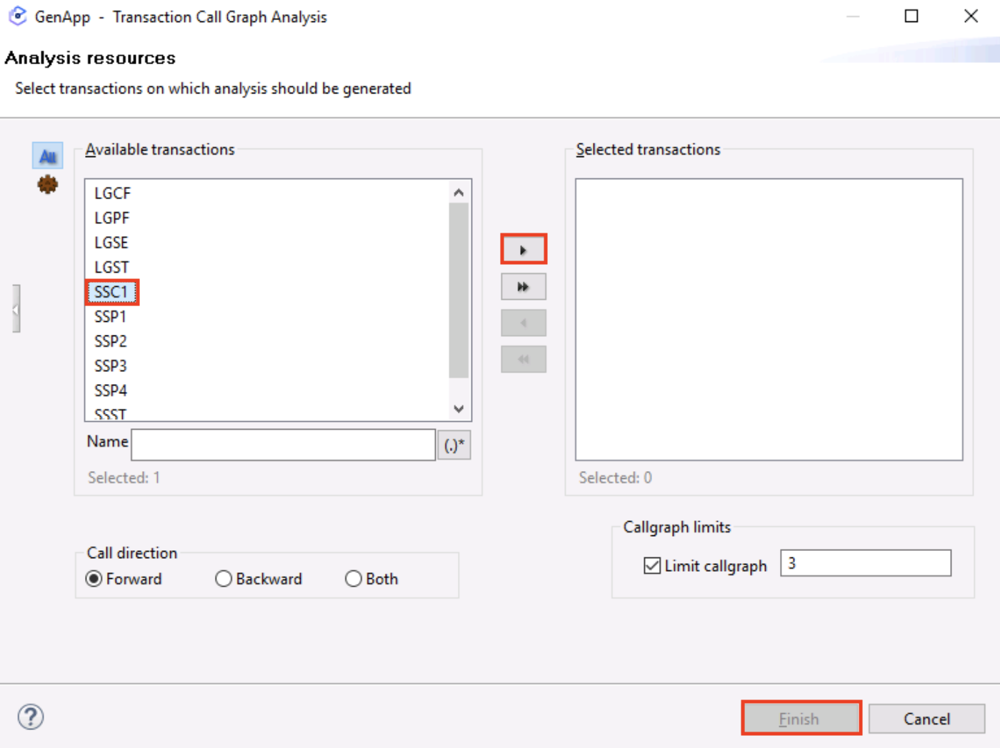

  A call graph will be loaded with the **SSC1** transaction in this profiled application. (**Note:** it may take a few minutes for the graph to build.)

  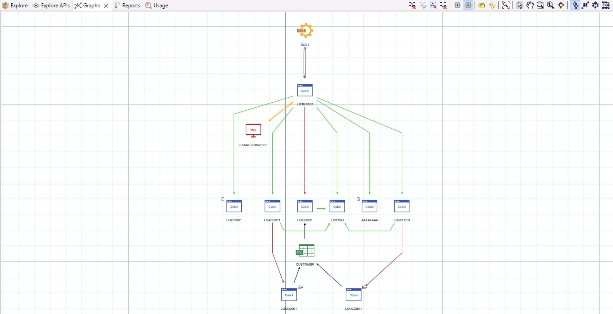

  A transaction callgraph has different components (Use the pan and zoom tools detailed earlier to look more closely at these components). For example: 
      1. The SSCI’s CICS transactions 

      2. The main transaction program (**LGTESTC1**). This program calls the **SSMAPC1** map.

      3. Depending on the function selected, it can perform different operations. In this example: 
        - Add/Insert Customer (LGACUS01)
        - Inquire Customer (LGICUS01)
        - Update Customer (LGUCUS01)

      4. These programs call data access programs that interact with the table **CUSTOMER**. For example:
        - Add/Insert Customer (LGACDB01)
        - Inquire Customer (LGICDB01)
        - Update Customer (LGUCDB01)
        - Writes messages back to the user (LGSTSQ)
        - Unknown program with no source code information (AAAAAAAA)

11. Double-click on the **COBOL LGACDB01** white and blue box. The code opens at the bottom.

  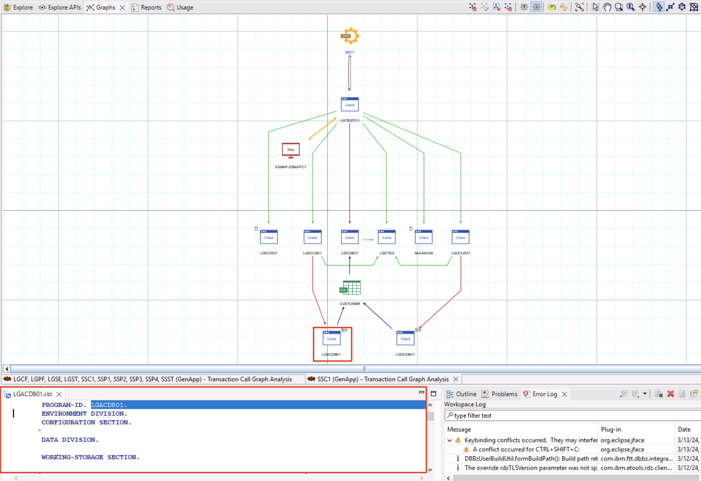

12. Drag the **LGACDB01** code tab at the bottom, to the right side of the graph so you can see the code beside the navigation view. Before you release your button, you will see guardrails where this window will be placed.

  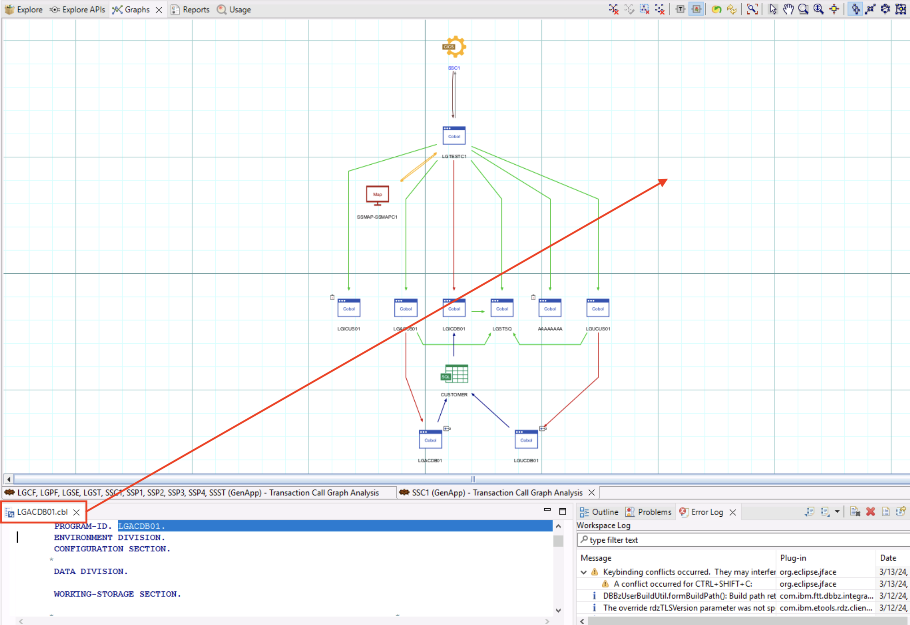

13. In the **LGACDB01.cbl** code, scroll down to the **INSERT-CUSTOMER** section (it is about two thirds of the way down), the main function is to insert a record into the **CUSTOMER** table. This code will be used in the next phase.

  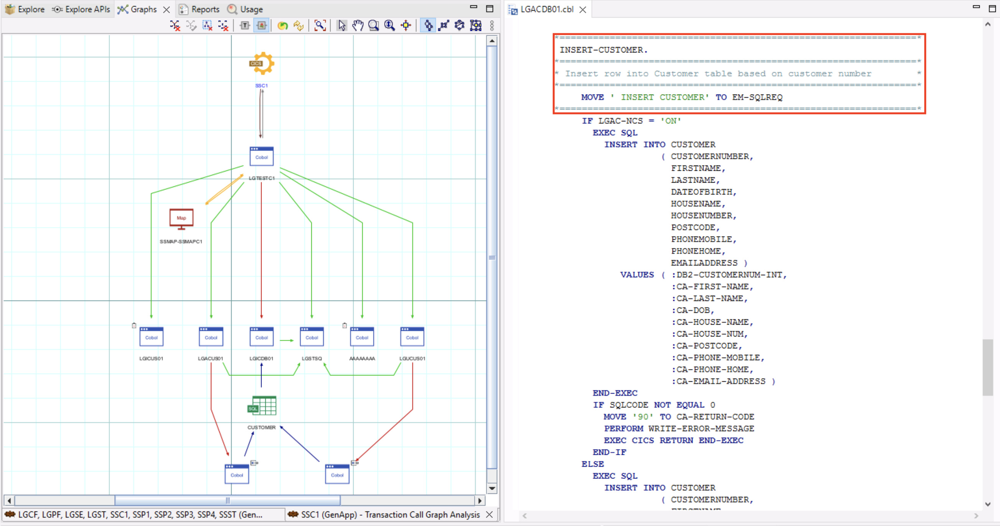

You have successfully completed the **Understand** phase of the mainframe application modernization lifecycle. You will use everything you learned here in the **Refactor** and **Transform** steps in the next labs that follow. In this lab: 

  - You checked an application’s callgraph that showed of its transactions. Then you drilled 
into the **SSC1** transaction to understand its flow and related components.

  -  You looked at the **LGACDB01** data access program and noted how this program is used 
to insert a customer record into the **CUSTOMER** data table.

### Congratulations, you've reached the end of lab 112 using IBM watsonx Code Assistant (WCA) for Z Application Discovery.

Click, **[lab 113](/watsonx/codeassistant/z/113)** to start next lab.
