<QuizAlert text="Heads Up! Quiz material will be flagged like this!" />

# 113: IBM watsonx Code Assistant (WCA) para Z Auto Refactoring

### Objetivo

El objetivo de este laboratorio es centrarse en la fase de **Refactorización** del ciclo de vida de modernización de aplicaciones mainframe para aplicaciones z/OS. IBM aplica una nueva tecnología de refactorización automatizada para identificar rápidamente las partes de la aplicación que hay que refactorizar, en la fase de **Refactorización** del proceso de modernización de aplicaciones. A continuación, el código se extrae en servicios modulares y reutilizables mediante un profundo análisis funcional del código fuente. Al automatizar el proceso de "troceado de código", se mejora la precisión y se reduce el tiempo y los conocimientos necesarios para el desarrollador. Una vez extraído el código objetivo en servicios empresariales, los arquitectos y desarrolladores pueden tomar decisiones relativas a mantener el código en COBOL o convertirlo a Java.

## Refactorización automática

1.  Abre la aplicación **Putty** desde la barra de tareas de la parte inferior.

2.  Seleccione **wca4z-ra** en el cuadro **Sesiones guardadas** (A) y haga clic en **Abrir**.

3.  Tras hacer clic en **Abrir** en el paso anterior, aparecerá el siguiente mensaje de advertencia. Haga clic en **Aceptar**. Esta advertencia sólo aparecerá una vez si vuelve a realizar esta demostración.

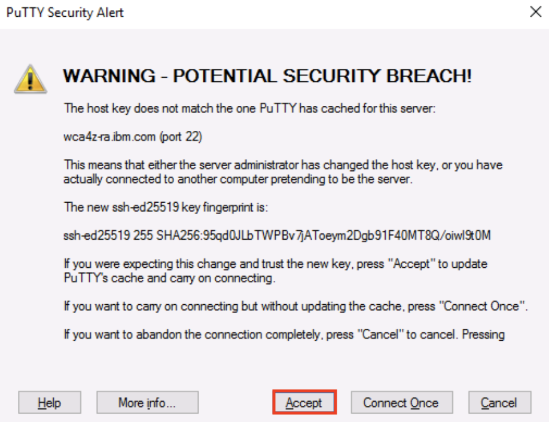

4.  Se ejecutará un script en Putty para iniciar el Asistente de Refactorización. Cuando vea el texto **IBM Watson code assistant for Z Refactoring Assistant started** en la parte inferior de la ventana de Putty, puede cerrarla haciendo clic en el botón **X** de la esquina superior derecha. Se te preguntará **¿Seguro que quieres cerrar la** sesión?. Haz clic en **OK**.

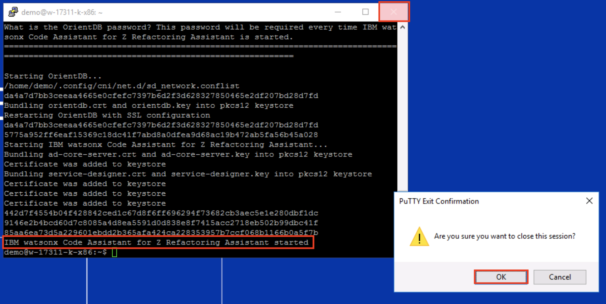

5.  Haz clic en el icono de **Firefox** de la barra de tareas para abrirlo.

6.  Haga clic en el enlace **IBM watsonx Code Assistant for Z Refactoring Assistant** de la **barra de favoritos** de la parte superior.

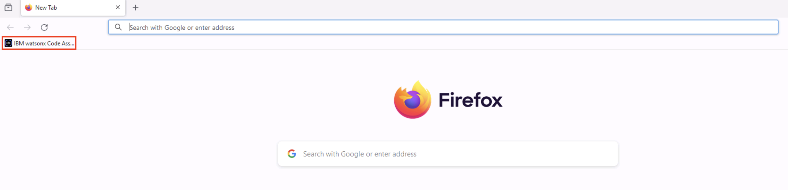

7.  Haga clic en **Iniciar sesión** para acceder a IBM watsonx Code Assistant for Z Refactoring Assistant con las credenciales rellenadas previamente.
8.  Después de crear un proyecto en la fase de **comprensión**, puede crear un espacio de trabajo para trabajar en ese proyecto con **IBM watsonx Code Assistant for Z Refactoring Assistant**. En la pestaña **Mis espacios de trabajo**, haga clic en el botón **Crear espacio de trabajo** de la derecha.

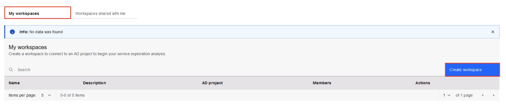

9.  En la ventana de diálogo **Crear espacio de trabajo**, rellene la siguiente información y, a continuación, pulse el botón **Crear**:

*   **Nombre:** `WCA4Z-DEM-WS`
*   **Descripción:** `Workspace for WCA4Z for GenApp application`
*   **Proyecto AD:** seleccione **GenApp**

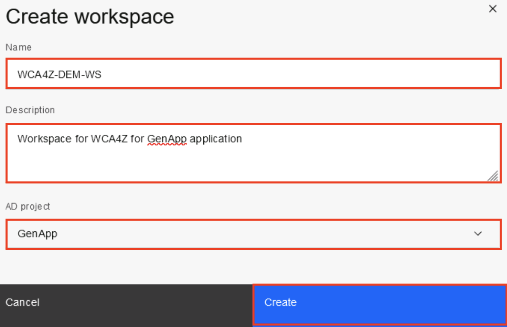

10. Aparecerá la pestaña **Graph** del espacio de trabajo GenApp. Haga clic en la barra de **búsqueda** situada en la parte superior. Aparecerá el menú desplegable **Tipo de artefacto**.

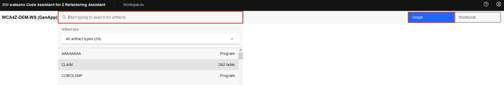

11. Seleccione **Todos los tipos** de artefactos (probablemente sea el valor predeterminado) para ver una lista desplegable de los diferentes tipos de artefactos. Seleccione **Transacciones CICS**.

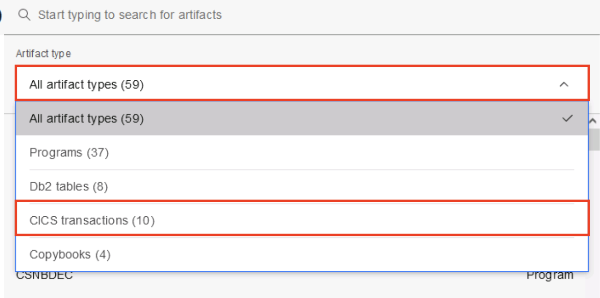

12. En la lista desplegable de transacciones, haga doble clic en el artefacto **SSC1** para abrirlo.

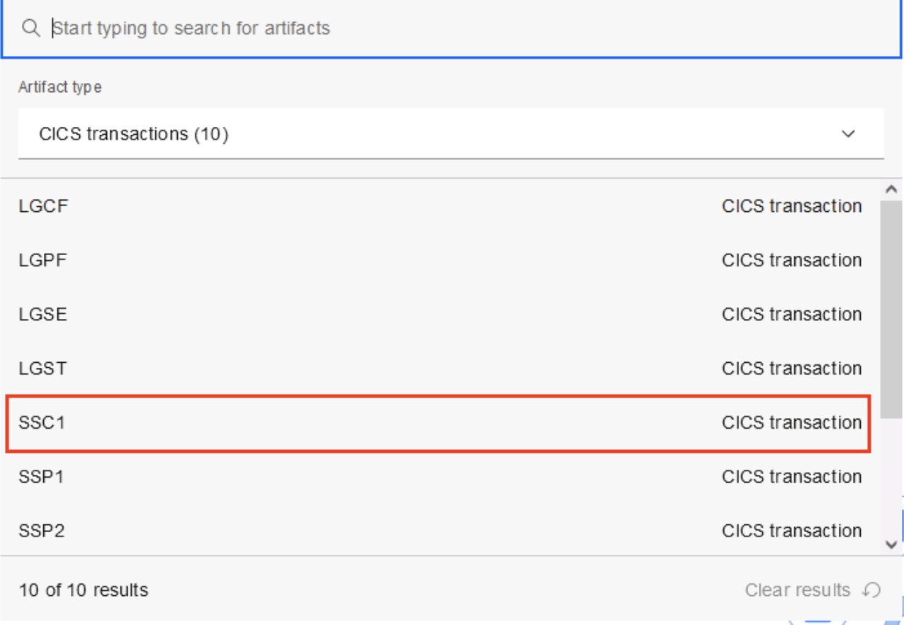

13. Se abre el gráfico de transacciones **SSC1**. Reduzca el zoom en un 30% utilizando el icono de la lupa (abajo a la izquierda) hasta que pueda ver el gráfico de llamadas completo en la ventana. Después de alejar el zoom, debería aparecer el gráfico completo. Localice y haga clic en la tabla **CLIENTE** para resaltar el flujo de dependencias del programa para esta tabla.

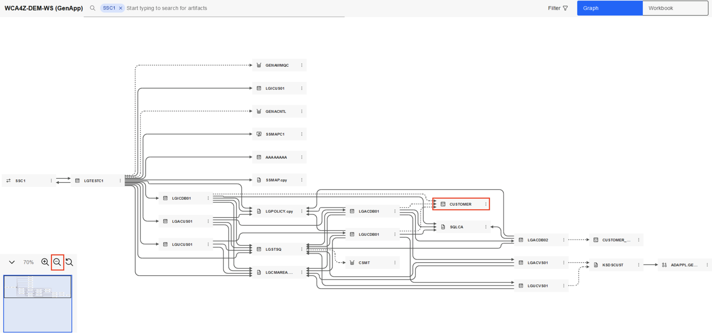

14. En el último laboratorio para la fase de **Comprensión**, usted verificó el callgraph para las transacciones **SSC1** y luego observó la consulta **INSERT-CUSTOMER** en el código **LGACDB01**. Ahora haga clic en el icono de la elipsis (3 puntos) junto a **LGACDB01**. Se le presentan las siguientes acciones:

<QuizAlert text="There is a quiz question on the actions presented from selecting the 3 dots/ellipses beside LGACDB01." />

*   Ver inmuebles
*   Identificar enunciados condicionales
*   Identificar párrafos
*   Identificar tablas/expresiones de acceso a ficheros

Seleccione la opción **Identificar párrafos** para mostrar todos los párrafos del código por orden de importancia.

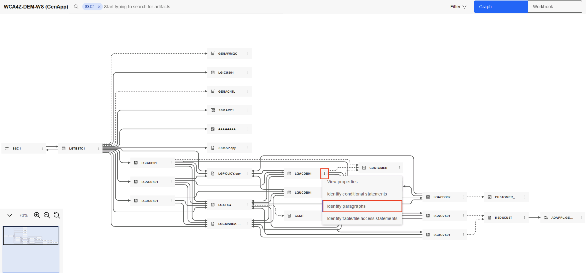

15. La pantalla cambiará a la pestaña Libro de trabajo con un formulario de identificación de párrafos. Podrá ver 3 secciones:

<QuizAlert text="There is a quiz question on the Workbook view." />

*   **Detalles del cuaderno** a la izquierda
*   **Condiciones clave** en la sección central, mostrando los apartados del código por orden de importancia/complejidad
*   **Código del artefacto** en la sección correcta

Haga clic en **INSERTAR-CLIENTE** en el cuadro de **condiciones clave** para saltar a este código de la derecha.

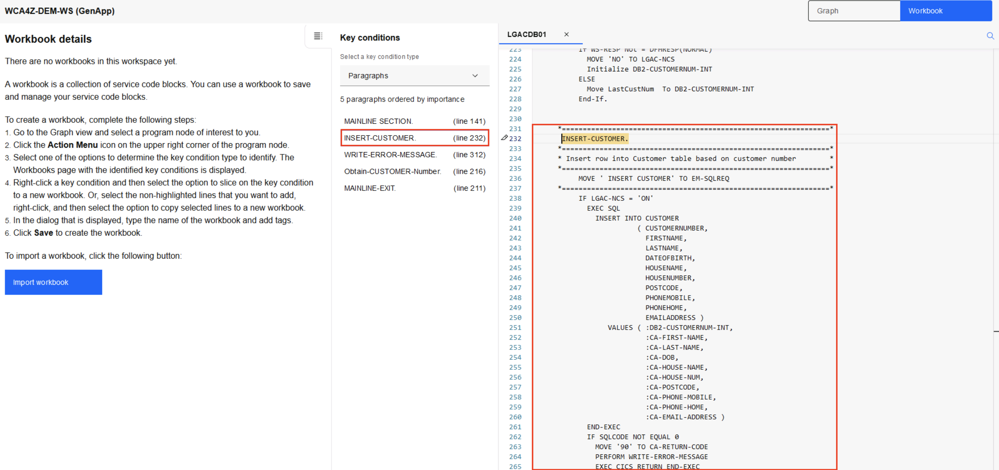

16. Haz clic en el texto **INSERTAR-CLIENTE** (línea 232) en el código, luego haz clic con el botón derecho para ver la opción **Cortar** en párrafo a nuevo libro de trabajo. Haz clic en la opción **Slice** on paragraph to new workbook.

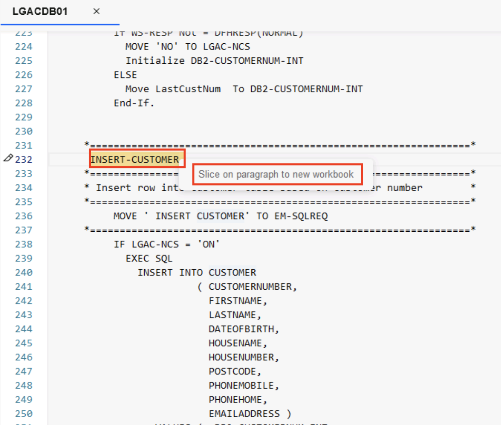

17. Aparecerá la ventana emergente **Cortar a un nuevo** libro de trabajo. Introduzca `LGACDB01` en el campo **Nombre del** libro de trabajo y haga clic en el botón **Guardar**.

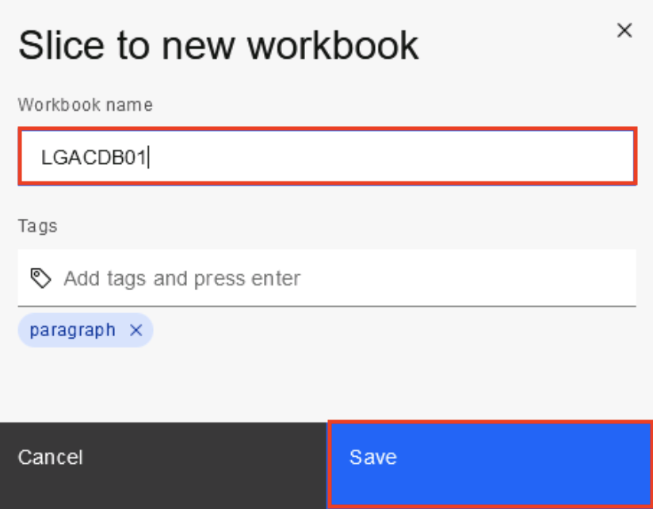

El párrafo de código seleccionado se cortará en un nuevo libro de trabajo (llamado **LGACDB01**) y se mostrará a la izquierda. Observe cómo el código seleccionado se marca con una línea azul punteada en el editor de código de la derecha.

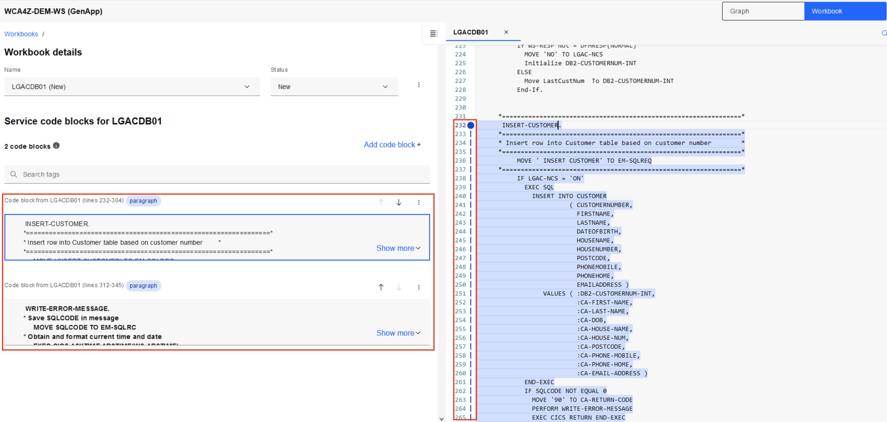

18. En la sección **Detalles del libro de trabajo**, haga clic en el icono de la elipsis (3 puntos) situado junto a **Estado**. Seleccione la opción **Exportar** para exportar el código troceado. Aparecerá la ventana **Exportar Workbox LGACDB01**. Haga clic en **Guardar**.

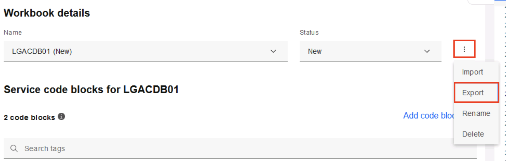

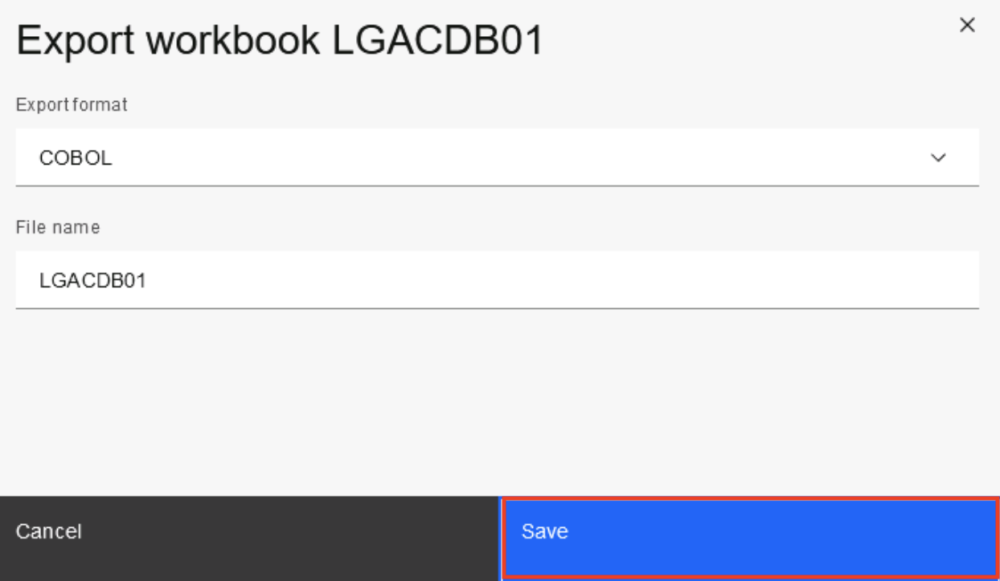

19. Aparecerá una ventana emergente con una ubicación predeterminada para guardar el código en rodajas exportado. Haga clic en **Escritorio** a la izquierda y navegue hasta lo siguiente: **Escritorio\WCAZ Lab Data\nazare-demo-cics-genapp\base\src\cobol**. A continuación, haga clic en **Guardar** para guardar el código exportado. Este libro de trabajo exportado se utilizará en el próximo laboratorio para la fase de **Transformación**.

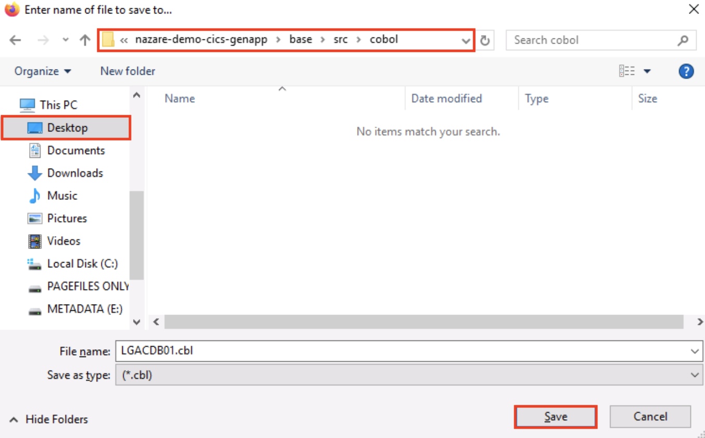

Ha completado con éxito la fase de **Refactorización** del ciclo de vida de modernización de aplicaciones de mainframe. En este laboratorio:

<QuizAlert text="There is a quiz question on the Refactor phase." />

*   Ha utilizado información de la fase de **Comprensión** para seleccionar la transacción **SSC1**
*   Ha utilizado **IBM watsonx Code Assistant for Z Refactoring Assistant** para refactorizar la funcionalidad **INSERT-CUSTOMER** cortando código del artefacto **LGACDB01** en un libro de trabajo.
*   Ha exportado este libro de trabajo para utilizarlo en el próximo laboratorio para la fase de **Transformación**

### Enhorabuena, has llegado al final del laboratorio 113 utilizando IBM watsonx Code Assistant (WCA) for Z Auto Refactoring.

Haga clic en, **[laboratorio 114](/watsonx/codeassistant/z/114)** para iniciar el siguiente laboratorio.
