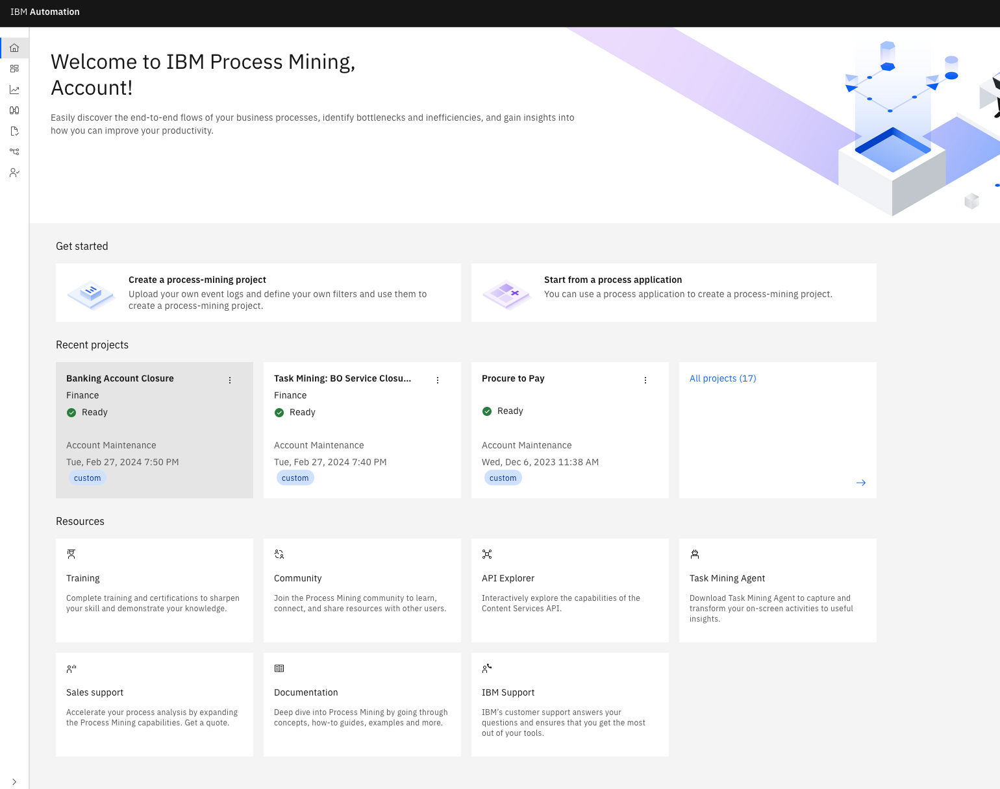
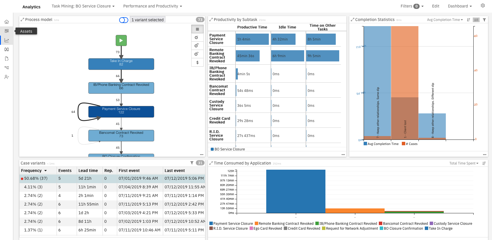
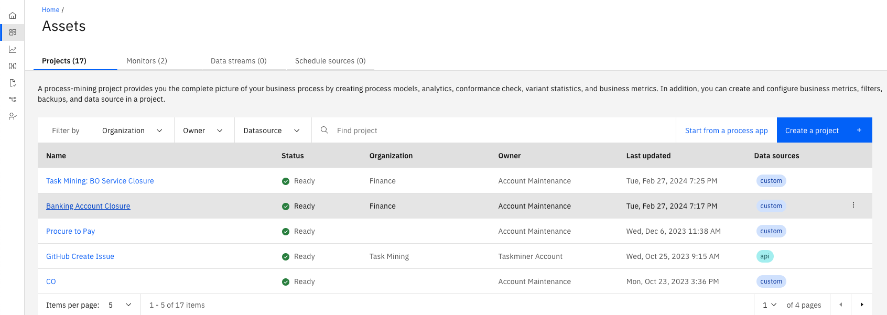
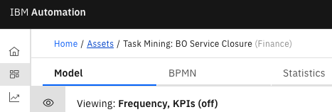
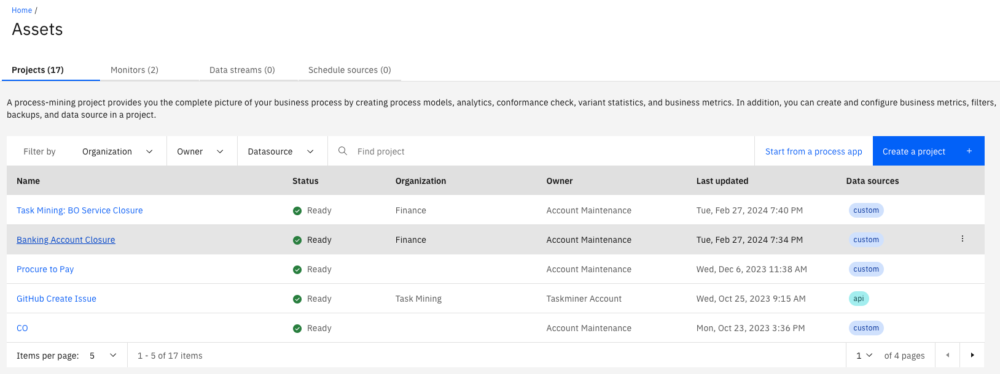

# 102: Minería de procesos y tareas

Hoy, examinaremos cómo se utilizan las capacidades de minería de procesos de IBM para descubrir y analizar procesos empresariales e identificar áreas para mejorar. Utilizaremos un ejemplo de cierre de cuenta de cliente para mostrar cómo la minería de procesos ayuda a una organización a cumplir con los requisitos normativos al mismo tiempo que reduce el coste de ejecución del proceso.

Al utilizar los datos de las aplicaciones empresariales, veremos cómo la minería de procesos descubre y analiza los procesos tal y como son en realidad, no como pensamos-o esperamos-podrían ser. Utilizaremos las capacidades de análisis para encontrar desviaciones de proceso y cuellos de botella. La minería de tareas nos dará una imagen completa del proceso de fin de fin mediante la incorporación de trabajo realizado a nivel de escritorio. A continuación, utilizaremos la simulación para predecir los beneficios de implementar mejoras en el proceso antes de realizar cualquier inversión de automatización.

Vamos a empezar.

## Visualización del proceso

Focus Bank es un banco regional que no cumple con sus requisitos regulatorios. El banco está obligado a completar todas las solicitudes de cierre de cuentas en un plazo de catorce días. El banco sabe que no está logrando este requisito, pero no está seguro de por qué. Además, el banco realizó más de 60.000 cierres de cuentas por año y sospecha que podría reducir los costos de ejecución del proceso. Sin embargo, no está seguro de dónde empezar.

El análisis de procesos en la minería de procesos se inicia con la importación de archivos de registro de las aplicaciones utilizadas en los procesos empresariales. El proceso de cierre de cuentas de Focus Bank utiliza un sistema de servicio al cliente para tomar la solicitud del cliente, una aplicación de acceso a la red para eliminar el acceso en línea a las cuentas y sistemas bancarios para liquidar y eliminar la cuenta.

1.  En Proyectos recientes, pulse **Cierre de cuentas bancarias**.

Los archivos de registro se cargan desde la pestaña Origen de datos. La minería de procesos acepta archivos CSV o XES como origen de datos. Hay una API disponible para cargar archivos de registro mediante programación. Una vez que se ha subido el archivo, se correlaciona con las columnas de datos relevantes. Hay tres columnas obligatorias: ID de proceso, Actividad y Hora. El ID de proceso puede ser cualquier cosa que identifique de forma exclusiva cada instancia de proceso o caso, como el número de solicitud, el número de pedido, etc. Para un análisis más profundo, se recomienda añadir hasta sesenta campos personalizados adicionales. Esto proporcionará datos de contexto más ricos sobre cada caso y mejorará el análisis.

Ahora que se cargan los datos, veamos cómo la minería de procesos proporciona una vista de extremo a extremo del proceso de cierre de la cuenta.

2.  Haga clic en **Modelo** tab (1), y haga clic en **X** (2) para cerrar el **Opciones de visualización**.

Estamos viendo el proceso de extremo a extremo para el proceso de cierre de cuentas de Focus Bank. Esto se proporciona aquí en la perspectiva de vista de modelo.

Los datos de negocio importados de las aplicaciones de Focus Bank se utilizan para crear y visualizar automáticamente el proceso de cierre de cuentas de extremo a extremo, incluidas todas las actividades y vías de acceso. El proceso de cierre de cuenta abarca varios departamentos y aplicaciones empresariales, todos ellos desde los que los algoritmos de minería de procesos correlacionan los datos de negocio.

El color más oscuro de un recuadro de actividad indica que la actividad se ha realizado con más frecuencia. Por ejemplo, eliminar el acceso en línea a la cuenta (aquí etiquetado como 'Cierre de servicio de BO') es azul oscuro porque se realiza para la mayoría de cierres de cuentas. Lo mismo con las líneas de flujo de proceso. Cuanto más oscuras sean las líneas de flujo, más frecuente será la vía de acceso del proceso. Por ejemplo, la línea de flujo de 'Cierre de servicio de BO' a 'Cerrar reserva' se realiza con frecuencia y, por lo tanto, tiene una línea de flujo más oscura.

## Análisis del proceso

A partir de esta visualización, empezaremos a analizar el proceso descubierto. En primer lugar, veremos las diversas vías de acceso de proceso tomadas para completar cada solicitud de cierre de cuenta. Nosotros lo llamamos *análisis variante de caso*.

1.  Haga clic en **Variantes** icon.

Cada solicitud de cierre de cuenta se denomina caso. Una variante de proceso es la vía de acceso exclusiva que un caso tarda en completar el proceso de cierre de cuenta (de principio a fin). Aquí vemos la lista de variantes de proceso únicas con el porcentaje que se sigue. Esto muestra qué vías de acceso se siguen con más frecuencia. Por ejemplo, la vía de acceso seguida más frecuentemente se toma alrededor del 36% del tiempo.

2.  Haga clic en la primera variante (1). Haga clic en **X** (2) para cerrar el **Variantes de proceso**.

Cuando seleccionamos la primera variante de proceso, la visualización se actualiza para mostrar los pasos exclusivos de esa variante. Este camino está tomando casi veinte días en promedio para completar cada solicitud de cierre de cuenta. La variante más frecuente no es cumplir con nuestro requisito regulatorio para completar el cierre de la cuenta en un plazo de catorce días.

3.  Haga clic en **Conformidad** icon.

Hemos completado nuestra primera vista del análisis de procesos. Veamos cómo se comporta el proceso de cierre de cuentas frente a lo que se esperaba.

Las herramientas de modelado de procesos y minería de procesos se complementan muy bien entre sí. Focus Bank había trazado previamente el proceso de cierre de cuentas utilizando IBM Blueworks Live, que es una aplicación de modelado de procesos de colaboración basada en la nube. Publicaron un modelo de referencia para definir cómo pretendían que se realizara el proceso, pero no tenían forma de comparar el modelo de referencia frente al rendimiento del mundo real. Simplemente tenían que esperar que el proceso se estuviera realizando según lo previsto.

Utilizando la herramienta de minería de procesos, el banco ha importado su modelo BPMN (Business Process Modeling Notation) de IBM Blueworks Live. Compararon el modelo (de referencia) documentado con el modelo real (derivado de datos).

4.  En el **Conformidad del modelo** panel, bajo **Opciones de vista de modelo** , seleccione **Modelo de referencia** para mostrar el modelo de referencia (es decir, el modelo BlueWorks Live). A continuación, seleccione **Modelo derivado de datos** para mostrar el modelo basado en datos (es decir, el modelo de minería de procesos). Por último, seleccione **Comparar ambos modelos**.

Al seleccionar 'Referencia', visualizamos el modelo de referencia.

Al seleccionar 'Datos derivados', visualizamos el modelo derivado de datos. El modelo derivado de datos parece más complejo. Hay diferencias entre lo que la gente pensó que el proceso debería ser y lo que realmente está ocurriendo.

Al seleccionar 'Comparar', visualizamos las diferencias entre los dos modelos. Un recuadro resaltado en rojo es una actividad que se produce durante la ejecución del proceso en el mundo real, pero no se incluye en el proceso de referencia. Vemos que hay cinco actividades de este tipo destacadas en rojo. Según se detalla en el gráfico de comparación a la derecha, todas estas actividades: 1) añaden tiempo significativo para completar el cierre de la cuenta, 2) añaden un coste significativo, y 3) se producen con una frecuencia significativa. Lo más notable es la actividad inesperada 'Eliminación completa de la cuenta'. En el modelo de referencia, se esperaba eliminar la cuenta con la actividad 'Cierre de servicio de BO'. Sin embargo, el modelo derivado de datos muestra que se necesitaba un paso adicional, 'Eliminación completa de cuentas', para completar más de 8.000 solicitudes de cierre de cuentas.

Las actividades y las líneas de flujo de proceso que sólo están presentes en el modelo de referencia se muestran utilizando recuadros y flechas amarillas. Las actividades presentes en ambos modelos se muestran utilizando cajas azules (azul oscuro o azul claro dependiendo de la frecuencia). Las flechas negras indican que la línea de flujo de proceso está presente en ambos modelos.

También vemos el impacto del tiempo y el coste en no seguir el modelo de referencia. Cuando se sigue el modelo de referencia, se necesitan unos 18 días por cada caso. Cuando no seguimos el modelo de referencia, se necesita un promedio de más de 26 días.

5.  Vuelva a la pantalla principal pulsando el botón **Conformidad** icon.

La minería de procesos proporciona varias formas de analizar el rendimiento del proceso de cierre de la cuenta. Las dimensiones principales a tener en cuenta son el tiempo, el coste y el retrabajo. Para cada una de estas dimensiones, los indicadores clave de rendimiento (KPI) se definen y visualizan en el análisis.

6.  Haga clic en **Ojo** icon (1) para mostrar el **Opciones de visualización**. Cambiar la **Modo de vista** a **Duración** (2).

Veamos cómo se realiza el proceso de cierre de la cuenta en función del tiempo. 'BO Service Closure' es una de las actividades que se están llevando más tiempo dentro del proceso. En promedio tarda más de una semana en completar la actividad. Dado que casi todos los casos fluyen a través de esta actividad, este es nuestro cuello de botella de proceso fundamental.

7.  Conjunto **Paleta de KPI** a **En**.

A continuación, consideremos la medición de KPI. La definición de ICR para el proceso facilita el análisis de procesos. Los ICR para duraciones de actividad individuales proporcionan información sobre si las duraciones reales están cumpliendo las expectativas.

La vista de ICR indica que dos de las duraciones de actividad promedio (resaltadas en rojo) no cumplen las expectativas, incluido el 'Cierre de servicio de BO'. Además, una actividad para el cierre de cuentas (resaltada en amarillo) está en riesgo de no cumplir con las expectativas.

## Generación de un modelo BPMN

Focus Bank ha generado un diagrama estándar BPMN (Business Process Modeling Notation) del proceso de cierre de cuentas. Al igual que las demás vistas basadas en datos, este modelo se genera a partir de datos de proceso reales.

1.  Haga clic en **BPMN** y esperar a que el modelo genere.

Las actividades de cierre de cuenta, carriles, puntos de decisión y flujos de proceso se muestran en el diagrama BPMN.

## Minería para normas

Dado que el modelo BPMN se ha generado a partir de datos de cierre de cuenta reales, cada punto de decisión del modelo tiene datos reales detrás. Al pulsar cada recuadro de decisión se muestran los resultados de lo que hacemos referencia como descubrimiento de reglas.

1.  Haga clic en **lista desplegable** icon (1) junto a **Crear simulación** Haga clic en **Reglas de decisión de descubrimiento** (2).

2.  Pulse la pasarela de decisión etiquetada **GW-XOR-22** (después **Liquidación de cuentas** ).

Por ejemplo, podemos ver por qué el cierre de la cuenta requiere el paso adicional 'Hacer ajuste'. Se produce basándose en el estado de la solicitud de cierre de cuenta.

Podemos exportar el BPMN y las reglas de minería de decisiones al flujo de trabajo y las herramientas de gestión de decisiones, como IBM Cloud Pak for Business Automation.

3.  Haga clic en **X** en la parte superior derecha para cerrar el **Información de pasarela** pantalla.

4.  Haga clic en **X** de nuevo para cerrar el **Resumen de reglas** pantalla.

5.  Haga clic en **Modelo**.

## Tareas de escritorio de minería

Ahora, centrémonos en el cuello de botella causado por la actividad 'BO Service Closure' que encontramos a través del análisis de duración de la actividad. Identificamos el cuello de botella pero necesitamos más información para entender por qué está sucediendo. La minería de tareas proporciona detalles de lo que está sucediendo durante la actividad 'Cierre de servicio de BO' en el nivel de escritorio.

La minería de tareas complementa la minería de procesos proporcionando análisis de las actividades realizadas en el escritorio de un individuo. La minería de tareas registra, analiza y genera información sobre las interacciones de los usuarios con las aplicaciones de software. Piense en la minería de tareas como reemplazar los estudios tradicionales de tiempo y movimiento.

Podemos combinar la actividad del servidor con la actividad de escritorio para obtener una visión completa de cómo se realiza el proceso, incluyendo dónde individuos o equipos específicos están gastando su tiempo. Este enfoque para procesar el descubrimiento ayuda a identificar oportunidades para la automatización.

Podemos profundizar en la actividad 'Cierre de servicio de BO' para ver los recursos que realizan la actividad. Esta tabla muestra que el grupo de usuarios denominado 'BOC' está realizando la mayor parte del trabajo (96% del tiempo).

1.  Haga clic en **Cierre de servicio de BO** activity (1) and then the **Mostrar estadísticas de actividad** icon (2).

Sobre la **Estadísticas de actividad** página, establecer el **Ver detalles para casos por** a **Recurso**.

En este caso, vamos a querer grabar a los usuarios en el grupo 'BOC', ya que realizan esta actividad el 96% del tiempo. Si es necesario, podríamos grabar varios grupos de usuarios para completar nuestro análisis de minería de tareas. Una vez que se registran los datos de minería de tareas, se integra en el flujo de proceso descubierto en el modelo de minería de procesos.

2.  Cierre el **Estadísticas de actividad** pulsando en la pantalla **X** en la parte superior derecha.

3.  Haga clic en **Iniciar proceso de minería de tareas** icon.

Se abre una nueva ventana con la vista de minería de tareas para la actividad 'Cierre de servicio de BO'. Todas las funciones que hemos revisado para la minería de procesos están disponibles para la minería de tareas. Vemos la frecuencia de cada paso de la actividad de 'Cierre de servicio de BO'. Estos son los pasos de escritorio necesarios para completar esta actividad, como utilizar las aplicaciones de software y los sitios web necesarios para cerrar la cuenta.

4.  En el **Opciones de visualización** panel, bajo **Vista de modelo** , establezca la **Modo de vista** a **Duración** (1). Haga clic en **Variantes** icon (2).

Podemos ver las variantes para esta actividad. La variante más frecuente ocurre poco más del 50% del tiempo. Por lo tanto, automatizar la primera variante impactaría al menos la mitad del cierre total de cuentas.

A continuación, hagamos un análisis más profundo de la tarea 'Cierre de servicio de BO'.

5.  Haga clic en **Análisis** icon.

Las vistas analíticas, como esta, pueden ser creadas por usuarios empresariales y compartidas dentro de su organización. Al descubrir y analizar nuevos procesos, puede crear y compartir nuevas vistas según sea necesario. Este nivel de análisis se utiliza para determinar los beneficios, como el retorno de la inversión (ROI), que se puede realizar desde la automatización.

El modelo de tarea descubierto y las variantes aparecen a la izquierda. Para cada variante, hemos descubierto las subtareas individuales que componen la tarea 'Cierre de servicio de BO'.

En el centro superior, vemos 'Productividad por subtarea'. Cada tiempo de subtarea se compone de:

*   *Tiempo productivo* : Tiempo real empleado en cada subtarea específica
*   *Tiempo desocupado* : Tiempo transcurrido fuera del escritorio o no trabajando en ninguna tarea supervisada

Este análisis revela el impacto potencial de cuánto tiempo ahorraríamos de la automatización. Es bastante común que los analistas basen su análisis de ROI en los tiempos de subtarea totales porque no se dan cuenta o no pueden medir el tiempo de inactividad y el tiempo invertido en otras tareas. Con la minería de tareas, hemos identificado el tiempo real empleado en una tarea específica a medida que construimos nuestro caso de negocio para la priorización.

6.  En el **Tiempo consumido por aplicación** en la parte inferior, pase el puntero del ratón dentro de cualquiera de las actividades para ver el tiempo total empleado en la aplicación.

> Pase el cursor dentro de la barra de una determinada sección de color. Resalte un solo color, como la parte azul o naranja.

En el centro inferior, el panel 'Tiempo consumido por aplicación' muestra el tiempo empleado en las aplicaciones individuales utilizadas para completar la tarea 'Cierre de servicio de BO'. Cada barra representa una aplicación de software desglosada por el tiempo total empleado en realizar cada actividad.

Vamos a salir de la vista de minería de tareas para que podamos pasar a la simulación.

7.  Haga clic en **Activos** para volver a la pestaña Activos.

8.  Pulse en **Cierre de cuentas bancarias**.

9.  Pulse en **Activos** en la indicación de ruta para volver a la pestaña Activo.

10. Pulse en **Cierre de cuentas bancarias**.

## Utilización de la simulación para optimizar el proceso

Identificamos oportunidades para abordar los dos problemas principales con el proceso de cierre de cuenta: (1) tiempo para completar y (2) costo de ejecución. Antes de actuar, es fundamental que el banco comprenda el impacto de los cambios previstos y el resultado esperado. El banco utilizó la simulación para predecir los beneficios de realizar cambios en el proceso.

1.  Haga clic en **BPMN** tab (1) y luego **Crear simulación** (2).

2.  Proporcionar un **Título de simulación** (por ejemplo: **"Cierre de la cuenta"** ) (1), y haga clic en **Crear simulación** (2).

A medida que consideran posibles mejoras en el proceso, el banco compara el proceso modificado con el proceso actualmente en ejecución. Esto les permite identificar qué cambios producen los mayores beneficios empresariales. Por lo tanto, pueden validar el caso de negocio antes de realizar la inversión para cambiar el proceso.

El banco utiliza la simulación para determinar el impacto de los cambios en las actividades individuales y en el proceso global. Se inician con un escenario de simulación que se carga previamente con los datos del proceso de cierre de la cuenta histórica. A partir de ahí, cambian los parámetros de simulación, ejecutan la simulación y comparan el proceso real con el escenario simulado.

Para el proceso de 'Cierre de cuentas', el banco se centra en cumplir con el requisito regulatorio de catorce días para procesar las solicitudes de cierre de cuentas. Su análisis anterior identifica que el cuello de botella del proceso principal es la actividad 'Cierre de servicio de BO'.

3.  Desplácese hacia abajo para mostrar diferentes actividades.

A partir de aquí, el banco comienza con datos de procesos históricos y cambia los niveles de personal, horas de trabajo, rangos de fechas, etc. También podrían filtrar por datos de negocio, como región, para aislar o comparar ubicaciones individuales.

4.  Desplácese hasta el **Cierre de servicio de BO** actividad.

Resalte lo siguiente:

*   **Configuración** -Cambiar la disponibilidad del personal, el tiempo total de servicio y el tiempo de trabajo real
*   **Programación** -Cambiar horas de operación
*   **RPA** -Automatizar una tarea

Utilizando la minería de procesos, el banco identifica el cuello de botella causado por la actividad 'Cierre de servicio de BO'. Además, identifican, utilizando la minería de tareas, que más del 50% de las tareas de esta actividad siguen los mismos pasos para completarse. Sospechan que la actividad podría ser totalmente automatizada, debido al bajo número de variantes de tareas. Simulan el resultado de automatizar este paso con RPA.

5.  Seleccione la opción **Presupuesto general** y cambiar el porcentaje de automatización a **100%**.

6.  Pulse en **Simulación de ejecución**.

Verá los siguientes resultados de simulación:

El banco ahora puede ver los resultados de hacer este cambio desde el modelo "tal cual" en comparación con el modelo "a ser". Con esta nueva automatización, se espera que el banco reduzca el tiempo promedio de cierre de cuenta de extremo a extremo de unos 21 días a menos de 13 días, al mismo tiempo que reduce el costo promedio de cada caso.

El gráfico "Duración y recuento de casos" muestra el proceso tal como está en azul y los resultados simulados en púrpura. En los resultados simulados (púrpura), el tiempo promedio de servicio es mucho más bajo y mucho más estable que los resultados. El número promedio diario de casos activos también es estable. Esto confirma la mejora de rendimiento esperada cuando se utiliza RPA para automatizar la actividad 'BO Service Closure'.

## Resumen

Utilizando un ejemplo de cierre de cuenta de cliente, hemos mostrado cómo se utiliza la minería de procesos para descubrir y analizar procesos de negocio e identificar áreas para mejorar. Antes de la minería de procesos, el banco tenía muy poco conocimiento de cómo mejorar el cumplimiento normativo o reducir el costo.

El banco ha aprovechado la minería de procesos para analizar el proceso actual, incluyendo la comparación del rendimiento del proceso actual con su modelo de referencia. A continuación, identificaron oportunidades para aliviar los problemas. Han utilizado la minería de tareas para profundizar en el nivel de actividad del escritorio. Por último, simularon cómo utilizar la automatización para volver a cumplir y reducir los costes generales.
