# Recursos y preguntas frecuentes

## Recursos de zona tecnológica

### [watsonx.ai](https://techzone.ibm.com/collection/tech-zone-certified-base-images/journey-watsonx)

### [watsonx Assistant y Watson Discovery](https://techzone.ibm.com/collection/watson-enterprise/environments)

## ¿Cómo accedo a una instancia de watsonx.ai?

### Cómo adquirir una instancia de watsonx.ai de Techzone (TZ)

Para obtener acceso a una instancia de watsonx.ai desde TZ, navegue hasta este enlace [aquí](https://ibm.biz/WATSONX-AI-TZ). Una vez ahí:

1. Selecciona **Reservar ahora**

    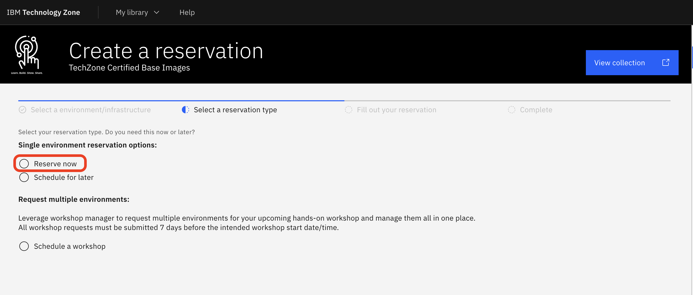

2. Cambie el Nombre de la reserva a *su nombre* watsonx.ai L3 SaaS (1).
3. Seleccione **Práctica/Autoeducación** (2).
4. Para la descripción del Propósito, ingrese **Completar el laboratorio L3** (3).
5. Seleccione su geografía preferida; aquí se elige **nosotros-sur** (4).

    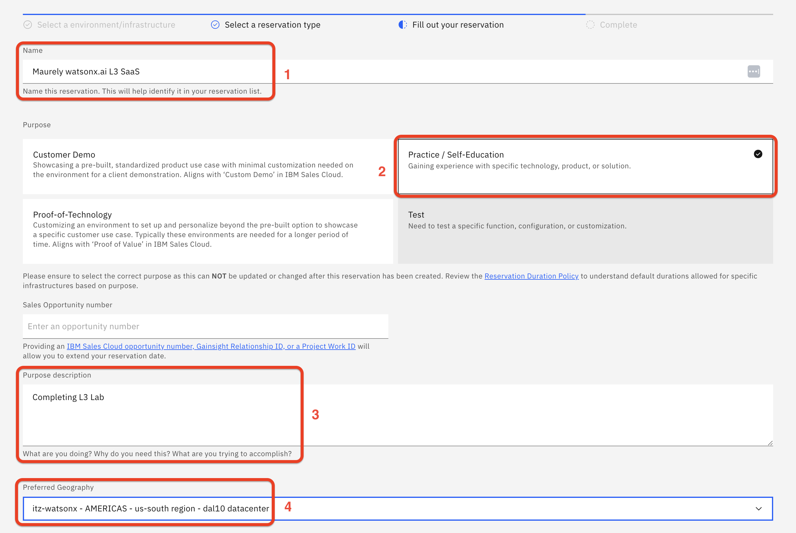

Continúe hasta la parte inferior de la página de reservas:

6. Especifique la fecha y hora de finalización (1).
7. Seleccione el servicio Dedicado (debería ser el predeterminado) (2).
8. Seleccione No (debería ser el valor predeterminado) para instalar Db2 (3).
9. En el lado derecho en la parte inferior, acepte los Términos y condiciones, luego haga clic en **Enviar** (4).

    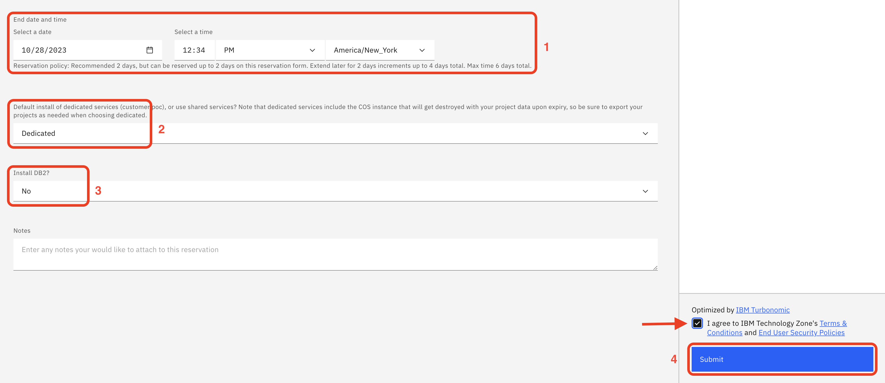

Recibirá un correo electrónico enviado a su dirección de correo electrónico de IBMid informándole que su reserva se está aprovisionando (esto debería suceder dentro de 10 a 15 minutos).

Una vez que se complete el aprovisionamiento de watsonx.ai, recibirá un segundo correo electrónico informándole que está listo para usar.

Este correo electrónico se parece al ejemplo siguiente. Deberá hacer clic en el enlace **AQUÍ** (como se resalta a continuación) para aceptar la invitación.

    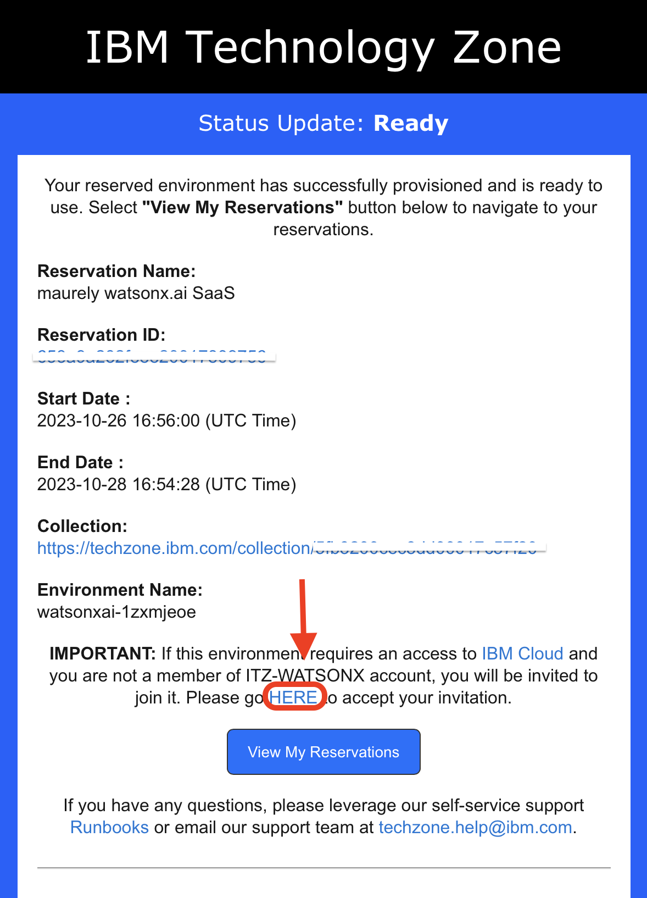

Al hacer clic en **AQUÍ**, accederá a una página de inicio de sesión donde deberá proporcionar su IBMid (y es posible que deba iniciar sesión con sus credenciales si aún no lo ha hecho).

10. Luego verá el elemento Acción requerida. Haga clic en el artículo.
11. Se abre la siguiente página. Haga clic en **Unirse ahora**.

    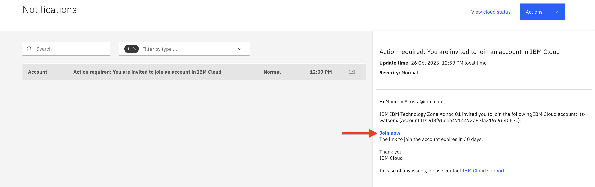

12. Ahora volverá a la página de inicio de sesión de IBM Cloud. Utilice su IBMid para iniciar sesión. Se le solicitará que se una a la cuenta TechZone. Acepte los Términos y condiciones y luego haga clic en **Unirse a cuenta**.

13. Cuando inicies sesión, ve a la barra de menú en la parte superior derecha y selecciona la cuenta `itz-watsonx`.

    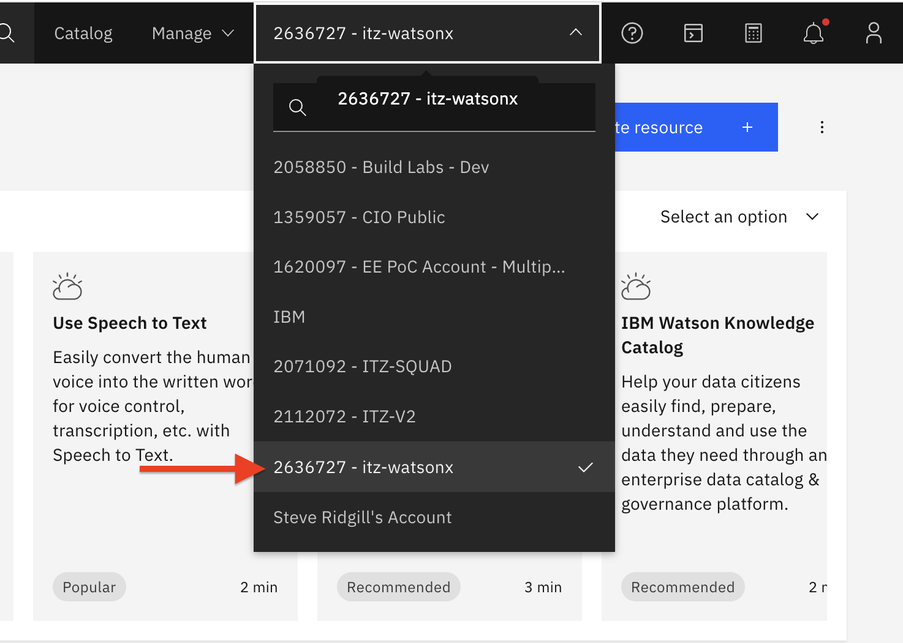

14. En el campo de búsqueda, ingrese `watsonx`. La búsqueda arrojará una lista similar a la siguiente. Haga clic en **watsonx**.

    

15. Ahora verá la página de la plataforma de datos e inteligencia artificial. Haga clic en **Comenzar** en el mosaico de watsonx.ai.

    > Este botón puede decir **Iniciar** si ha aprovisionado una instancia de Watsonx.

    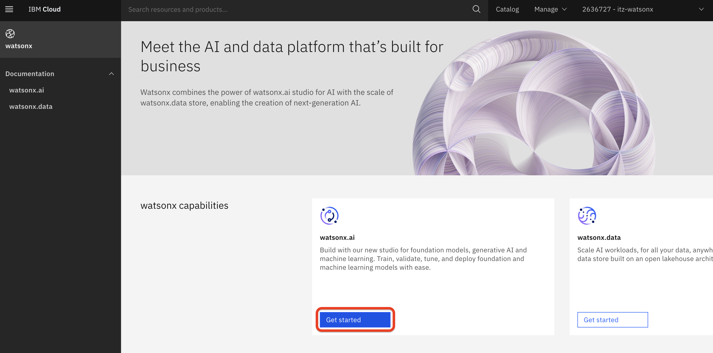

16. Ahora está en la consola watsonx.ai y listo para comenzar a usar su instancia watsonx.ai.

    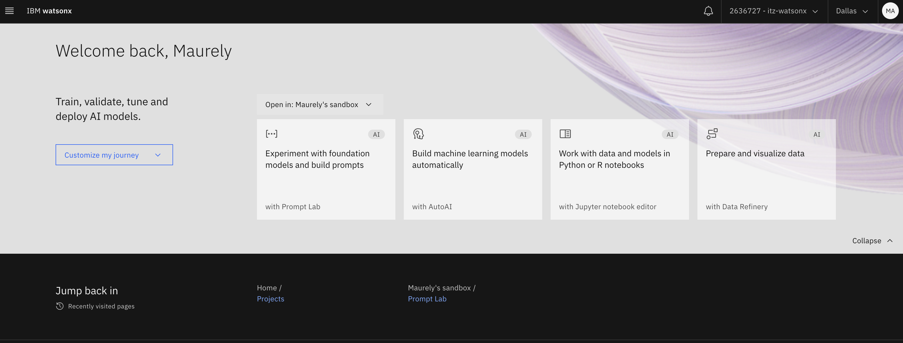

### Cómo adquirir una instancia de watsonx.ai a través de IBM Cloud

**Nota:** La prueba gratuita o lite de la instancia watsonx.ai viene con una asignación de 50 000 tokens al mes.

1. Para registrarse para una prueba gratuita de watsonx.ai, vaya al siguiente enlace [aquí](https://dataplatform.cloud.ibm.com/registration/stepone?context=wx&apps=all)

2. Haz clic en el botón que dice **Crear cuenta o iniciar sesión**

    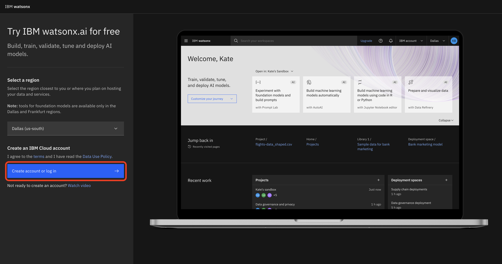

**Nota:** Si actualmente tiene una cuenta de IBM Cloud con una instancia de watsonx.ai, no podrá iniciar una prueba gratuita. Debe crear una nueva cuenta para obtener la instancia de prueba gratuita de watsonx.ai.

3. Una vez que haya iniciado sesión en su cuenta o haya creado una nueva cuenta, será redirigido a la siguiente página. Proporcione su número de teléfono y haga clic en el botón **Continuar**.

    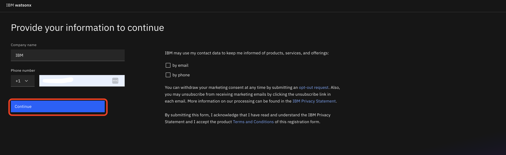

4. Serás redirigido a la página watsonx.ai con un modal que te pedirá que realices un recorrido. Si no desea realizar el recorrido, puede cerrar el modal haciendo clic en la **X** en la esquina superior derecha.

    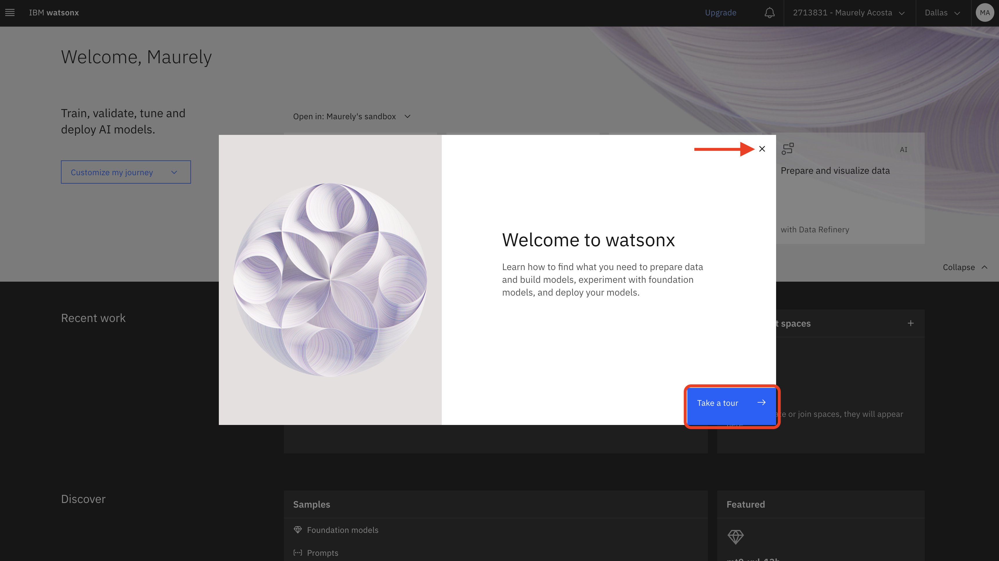

5. Ahora está en la consola watsonx.ai y listo para comenzar a usar su instancia watsonx.ai.

    

### Aceptar la invitación de la cuenta de IBM Cloud del taller y acceder a la plataforma

Si participa en un taller de IBM, se le invitará a una cuenta de cloud de IBM unos días antes de que comience el taller, lo que le dará acceso a una instancia compartida de watsonx.ai que se puede utilizar para completar los laboratorios de taller. El correo electrónico utilizado para registrarse en el taller debe estar asociado a un ID de IBM. Si no es así, deberá crear el ID de IBM antes de poder iniciar sesión en IBM Cloud y aceptar la invitación. Además de la invitación a IBM Cloud, cada participante del taller se añadirá a un proyecto watsonx.ai con el formato de nombre: `VEST-Labs-{Location}-{MMDD}` donde *Location* es la ubicación y *MMDD* indica el mes y el día de su taller.

Siga estos pasos para aceptar la invitación de su cuenta de IBM Cloud:

1.  Inicie sesión en IBM Cloud utilizando su ID de IBM.
2.  Vaya a la [panel de notificaciones ](https://cloud.ibm.com/notifications)y seleccione la invitación de la cuenta para **Cuenta de PoC EE**.

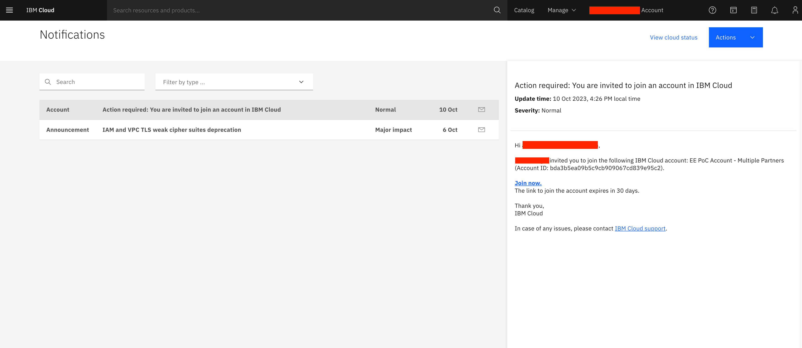

3.  Haga clic en **Join now** enlace para aceptar los términos y condiciones y unirse a la cuenta.

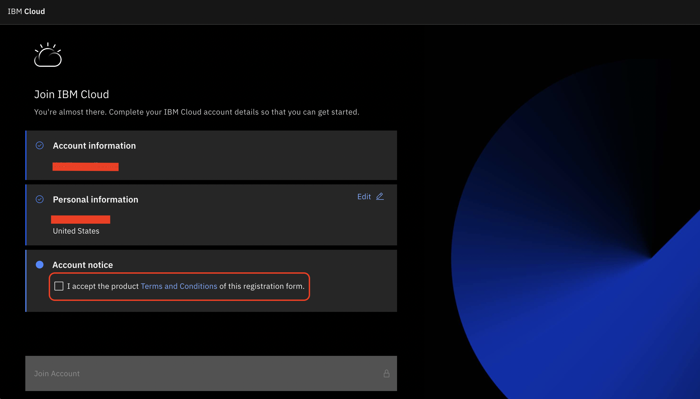

4.  Ahora deberías ver **1620097-Cuenta PoC de EE** en el menú desplegable de la cuenta de IBM Cloud en la parte superior derecha de la pantalla. Asegúrese de que esta cuenta esté seleccionada al realizar laboratorios watsonx.ai.

5.  Antes de añadir un usuario al proyecto del taller. Necesitan iniciar sesión en la plataforma watsonx.ai al menos una vez. Siga las instrucciones siguientes para navegar a watsonx.ai desde la nube de IBM o navegar directamente a la [Consola de watsonx.ai](https://dataplatform.cloud.ibm.com/wx/home?context=wx).

### Acceso a watsonx.ai desde la nube de IBM

Para acceder a watsonx.ai desde IBM Cloud, vaya a la página de visión general de watsonx [aquí](https://cloud.ibm.com/watsonx/overview). Una vez allí:

1.  Haga clic en **Launch** en el interior del **watsonx.ai** en la página. Esto abrirá una nueva pestaña.

    > Este botón puede decir **Get started** si todavía no ha suministrado una instancia de watsonx. Si es el caso, cambie a una cuenta que incluya una instancia de watsonx suministrada, o pulse ese botón y siga los pasos necesarios para suministrar la instancia antes de continuar.

    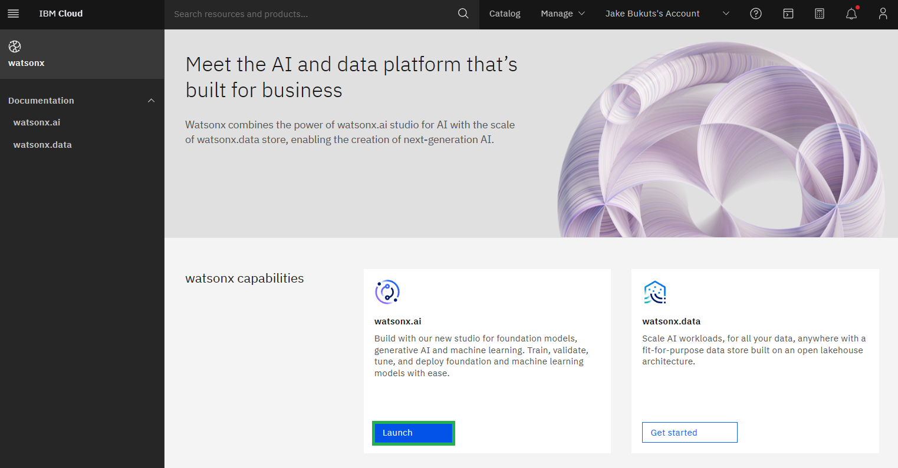

    Puede ver la siguiente página. Seleccione el recuadro de selección para aceptar los términos. Siéntase libre de hacer clic a través del tour o cierre haciendo clic en **X**.

    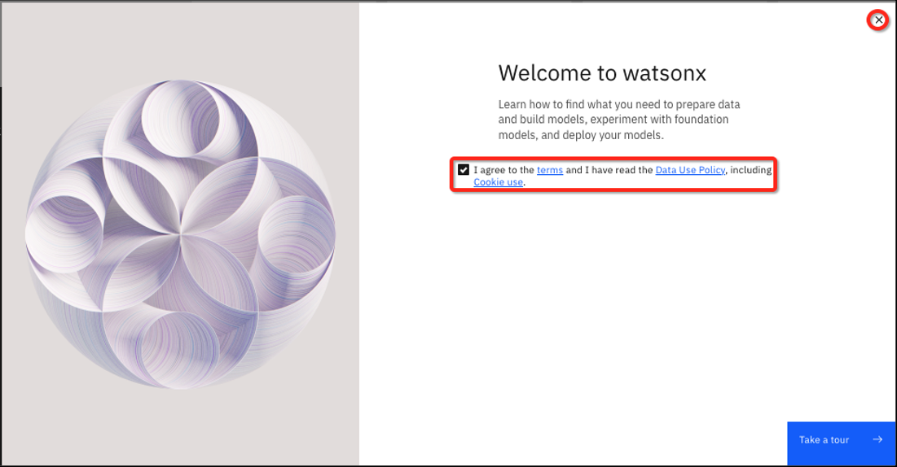

    Después del recorrido, o haciendo clic en la **X**, verá la página principal de watsonx.ai.

### Creación de una nueva sesión de Prompt Lab

Durante el laboratorio de la placa L3, se le puede pedir que inicie una nueva sesión de Prompt Lab. Esto sólo equivale a salir del Prompt Lab y luego volver a abrir para evitar que los resultados de la solicitud de laboratorio se vean afectados por la experiencia previa que se ha realizado en el Prompt Lab.

Cuando se le solicite iniciar una nueva sesión de solicitud, siga estos pasos:

1.  Haga clic en el icono de hamburguesa en la esquina superior izquierda de la consola. A continuación, pulse **Home** enlace.

    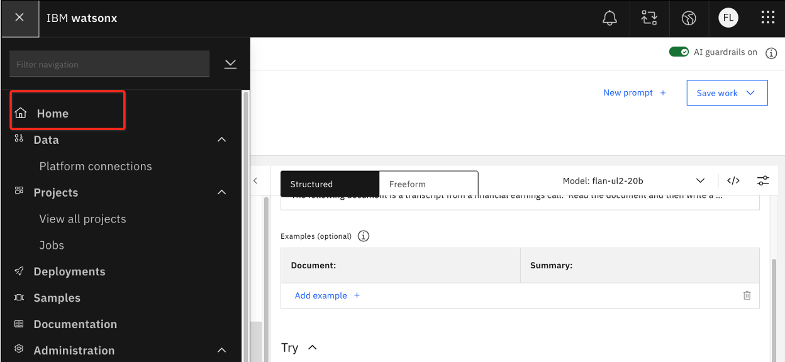

2.  Si has estado activo en tu sesión de solicitud verás un pop up asegurándote de que quieres salir del sitio. haga clic en **Leave**.

3.  Cuando llegue a la página principal de watsonx.ai, simplemente haga clic de nuevo en el Prompt Lab.

    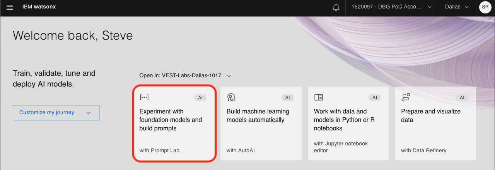

## ¿Cómo importo un cuaderno Jupyter en watsonx.ai?

Si su laboratorio requiere importar un cuaderno jupyter a watsonx.ai, siga estos pasos:

1. Inicie sesión y navegue hasta la página de inicio de watsonx [aquí](https://dataplatform.cloud.ibm.com/wx/home)

2. Haga clic en la tarjeta/mosaico **Work with data and models in Python or R notebooks**.

    

3. Aparecerá una nueva página con un menú modal titulado **Work with data and models in Python or R notebooks**. En este menú, haga clic en la opción **URL** en la navegación de la izquierda.

4. En el campo **Name** escriba un identificador apropiado. Si trabaja en un salón de clases, querrá anteponer su `{uniqueid}`.
    > NOTA: El valor `{uniqueid}` puede ser cualquier cosa que identifique de forma única su activo de los activos de otros estudiantes. Normalmente bastará con un apellido o iniciales. Watsonx.ai no impedirá que se guarden activos con el mismo nombre, por lo que le ayudará a encontrar el cuaderno más adelante.
5. Para la opción **Select runtime** use `Runtime 22.2 on Python 3.10 XXS`. Los tiempos de ejecución más grandes utilizan más tokens o créditos de nube.

6. Para importar desde una URL, seleccione la opción **URL** en el panel izquierdo y complete el cuadro de texto **Notebook URL** con la URL donde está alojado su archivo de cuaderno sin formato. Alternativamente, para importar desde un archivo local, seleccione la opción **Local file** en el panel izquierdo y arrastre y suelte el archivo desde su sistema local a la sección indicada.

7. Una vez que todos los campos obligatorios estén completos, haga clic en el botón **Create**. Luego serás lanzado al cuaderno.

    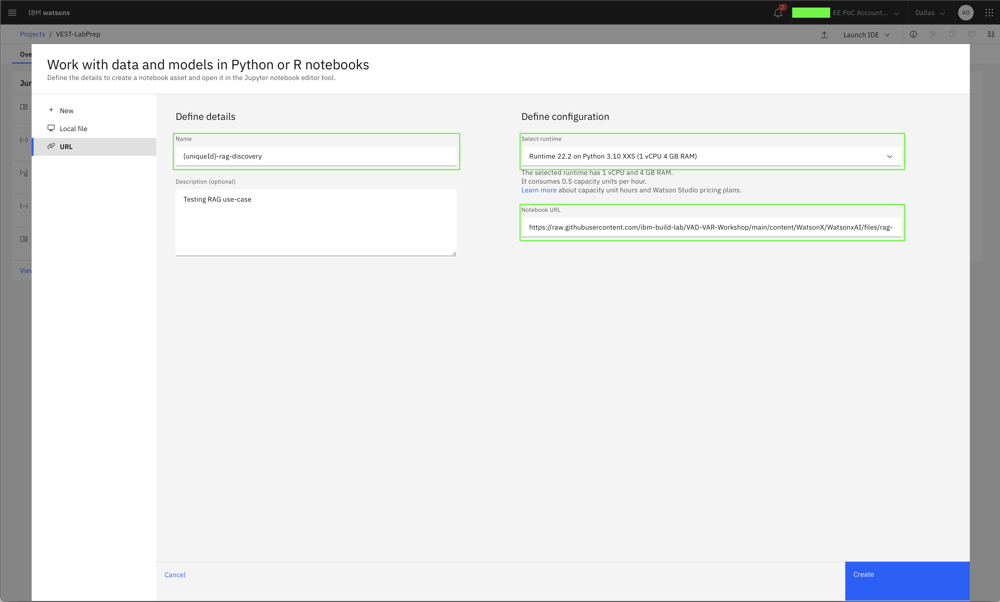
