<QuizAlert text='Heads Up! Quiz material will be flagged like this!' />

# watsonx.ai L3 Part 1: Basic navigation and zero shot prompting

Watsonx.ai is a core component of watsonx, IBM's enterprise-ready AI and data platform designed to multiply the impact of AI across a business. The watsonx.ai component makes it possible for enterprises to train, validate, tune, and deploy traditional AI and generative AI models.  

> NOTE: If you are completing this lab in an IBM workshop/classroom setting, the watsonx.ai instance will be shared among all students. You should have been invited to an IBM cloud account and added to a watsonx.ai project with name format: `VEST-Labs-{Location}-{MMDD}` where _Location_ is the location and _MMDD_ indicates the month and day of your workshop.


## Watsonx.ai console

We'll start with a quick explainer of the watsonx.ai console. First, [follow these instructions](/watsonx/watsonxai/100#accessing-watsonxai-from-ibm-cloud) to access the watsonx.ai homepage.

The homepage will look similar to the following:

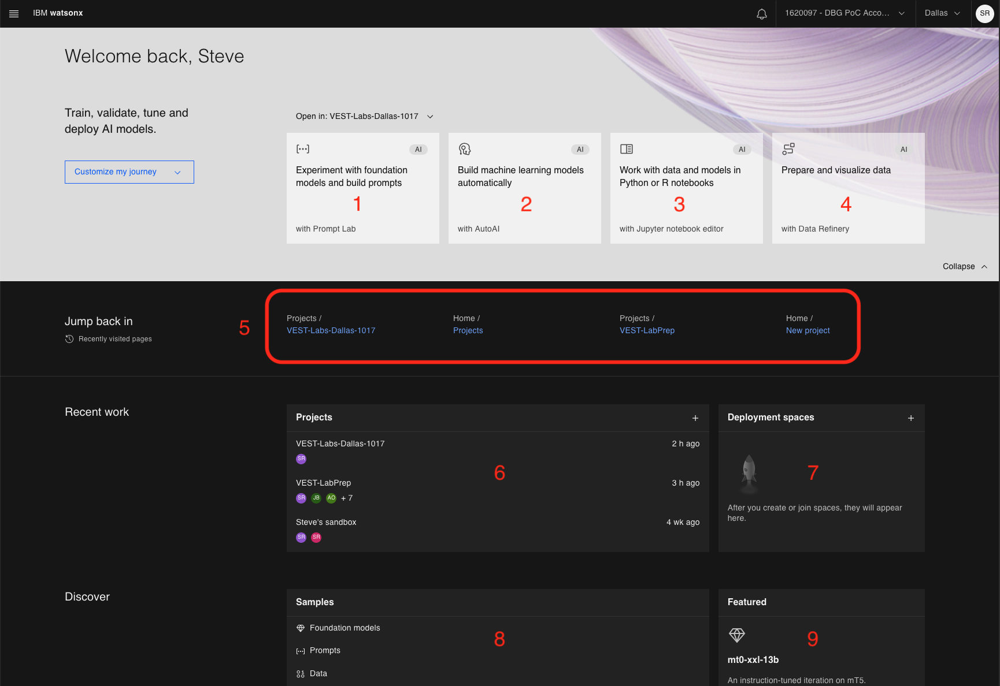

These are the various regions of the console.

1. Navigate to the Prompt Lab console.  You can experiment with different models, test your prompts, adjust model parameters and save your prompt sessions.  This is the focus of this lab.

2. Create AutoAI jobs to automatically build machine learning (ML) models. 

3. Create new, or work with existing Python or R notebooks directly in the watsonx.ai UI.

4. Load data and then prepare it (using Data Refinery) for AI consumption.

5. Quick links to recently visited pages

6. Shows a list of projects.  For the watsonx.ai free tier, you will see a default project called `{username}'s sandbox`

7. Deployment space - this is where you can add assets in one place to create, run, and manage deployments.

8. A collection of samples.  A great place to explore if you are new to watsonx.ai. 

9. Model highlights - watsonx.ai will highlight various foundation models and use cases.  

## Prompt Lab - Basic Navigation

<QuizAlert text='Quiz question on Prompt Lab capabilities!' />

If you have not already done so, access the Prompt Lab UI by clicking the following tile from the watsonx.ai homepage:


If this is your first time accessing the prompt lab in this account, you'll be prompted to acknowledge a few points related to generative AI models and optionally take a tour.  

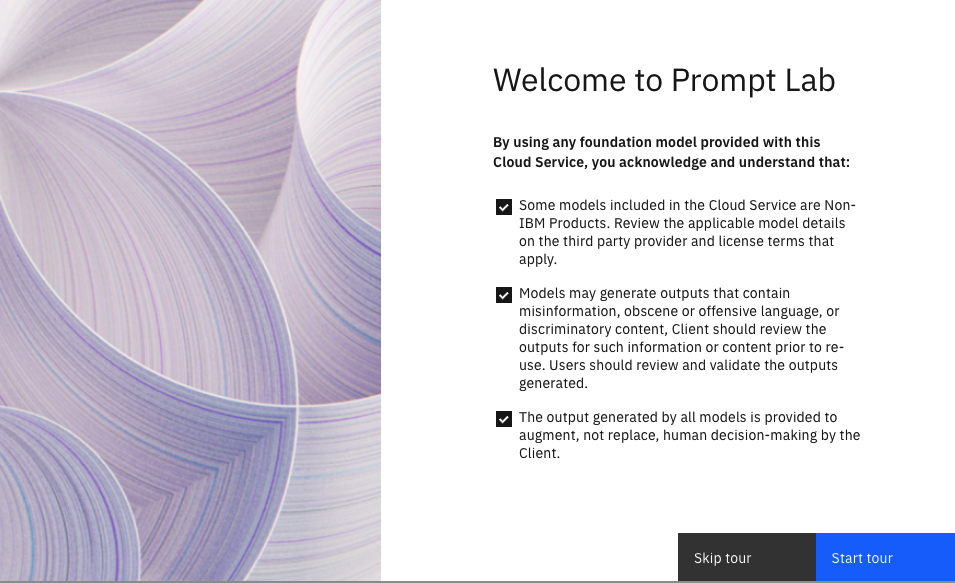

Whether you decide to take the tour or not, you should end up on the prompt lab UI, which is where we will begin!

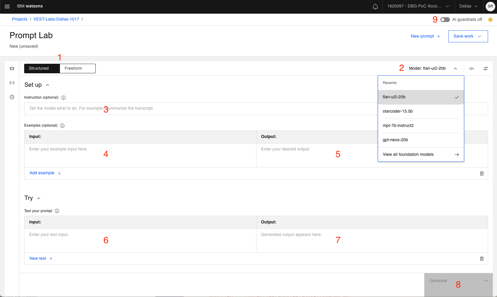

This lab will cover a core subset of the Prompt Lab capabilities. For an initial explanation of the UI, lets walk through the numbered sections:

1. The ability to toggle between **Structured** prompt or **Freeform** prompt editors.
  
    a. **Structured** prompt is the default and provides guidelines for prompt creation.
      
    b. **Freeform** prompting shows one text area to interact with the foundation model.  Likely preferred by more experienced users. 

2. Use the dropdown to choose between different foundation models.

3. A first instruction to be sent to the foundation model.  Optional, as you may not always need a top level instruction. 

4. Sample input that can be combined with Sample output (item 5) to "teach" the model how to appropriately respond to your prompt.

5. Sample output (corresponding to input from item 4).

    > Foundation models can be thought of as probability machines - they generate output by choosing the next most probable token, given all previous tokens.  
    <br/> There are many techniques for improving the output of a foundation model.  One of those is to "teach" the model by providing sample input and output (referred to as a "shot").  Types of shots include:
    <br/><br/>**Zero-shot prompting:** no input/output provided
    <br/>**One-shot prompting:** a single input/output example provided 
    <br/>**Few-shot prompting:** multiple examples provided.

6. The **Try** section is where you enter your prompt/query.

7. This is where generated output will be displayed.

8. Click the **Generate** button when you're ready for the foundation model to receive your inputs.

9. Watsonx.ai provides AI guardrails. By default, it is off. You can turn this on to prevent potential harmful input and output text (such as hate, abuse, or prejudiced wordings).

Other controls, like updating inference configuration parameters, will be discussed as we progress through the labs.

## Exploring foundation models with a zero-shot prompt

There are 6 open-source foundation models available in watsonx.ai as of 4Q2023.

| Model | Architecture | Parameters | Trained by | Usage |
| ----- | ------------ | ---------- | ---------- | ----- |
| flan-ul2-20b | Encoder-decoder | 20b | Google | Generation, Extraction, Summarization, Classification, Question Answering, RAG |
| Starcoder-15-5b | Decoder only |15.5b | BigCode | Code generation, Code conversion |
| mt0-xxl-13b | Encoder-decoder | 13b | BigScience | Generation, Summarization, Classification, Question Answering |
| gpt-neox-20b | Decoder only | 20b  | EleutherAI | Generation, Summarization, Classification |
| flan-t5-xxl-11b | Encoder-decoder | 11b | Google | Generation, Extraction, Summarization, Classifciation, Question Answering, RAG |
| mpt-7b-instruct2 | Decoder only | 7b | IBM | Generation, Extraction, Summarization, Classification |
| llama-2-70b-chat | Decoder only | 70b | Meta | Generation, Extraction, Summarization, Classification, Question Answering, RAG, Code generation, Code conversion |

More will be added as other foundation models are vetted and deemed appropriate for watsonx.ai.  

> There are also 2 IBM models available, the granite-13b-chat-v1 and granite-13b-instruct-v1 models, which will be covered in detail in a future iteration of this lab. 

1.  On the <span>left hand panel</span>, click the sample prompt icon, **]&#8414;[**.

    <QuizAlert text='Quiz question on sample prompt groupings!' />
    
    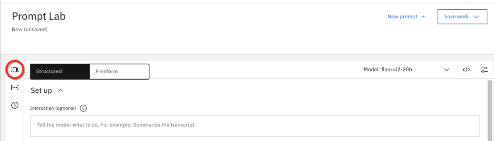

    **Watsonx.ai** provides sample prompts grouped into categories like:

    - Summarization
    - Classification
    - Generation
    - Extraction
    - Question Answering
    - Code

    These are the 6 main use cases for generative AI. For the following tests, we will utilize the **Marketing email generation** sample in the **Generation** section.

2.  Select the **Marketing email generation** from the list of examples on the left. This prompt requests a 5 sentence marketing message based on the provided characteristics.

    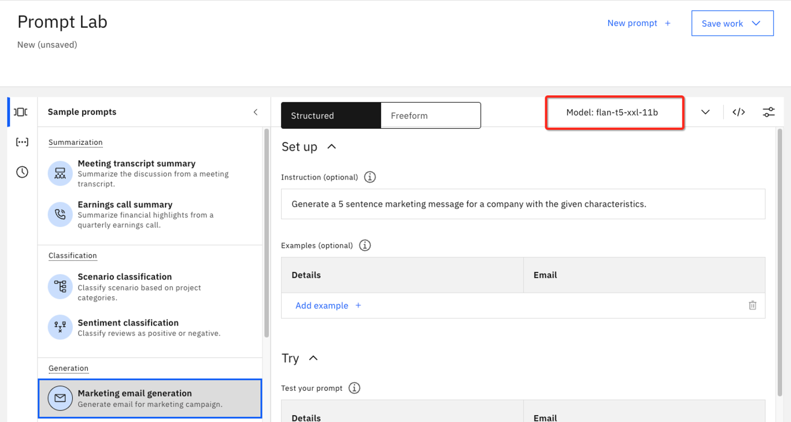

    > Notice how the model **flan-t5-xxl-11b** was automatically selected for this sample use case.  Watsonx.ai selects the model that is most likely to provide the best performance. However, this is not a guarantee, and in this part of the lab, we will explore different models on this same prompt. 

3.  Click the **Details** field in the **Try** section to expand the box and see the full text of this example.

    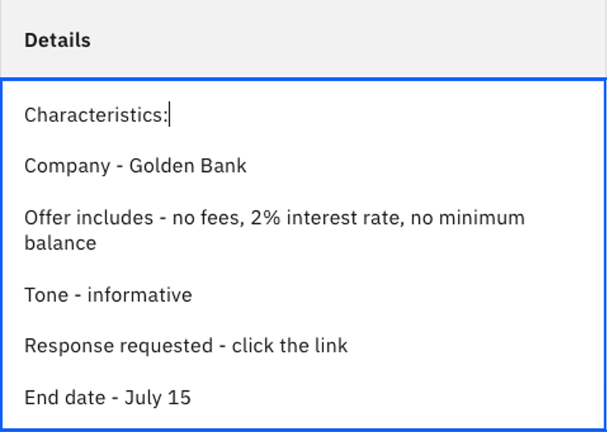

    If you cannot find this prompt example, or if the contents have changed, you can enter:
    - For **Instruction**

    ```
    Generate a 5 sentence marketing message for a company with the given characteristics.
    ```

    - For **Details** under the **Try** section

    ```txt
    Characteristics:
    Company - Golden Bank
    Offer includes - no fees, 2% interest rate, no minimum balance
    Tone - informative
    Response requested - click the link
    End date - July 15
    ```

4.  Click **Generate** to see the email output.

    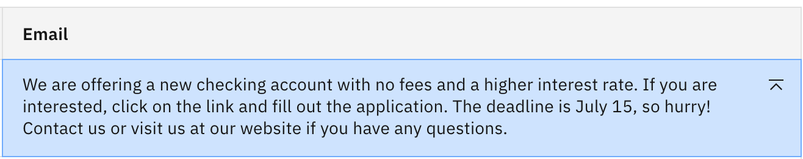

    This is a reasonable output – but perhaps not yet ideal.

    > Note: This was a zero-shot prompt, as we did not provide any sample input/output. 

5.  Look to the left of the **Generate** button and you will see text similar to the following:

    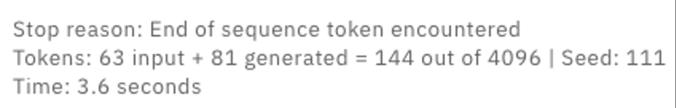

    All the text used in the Instruction and Details sections becomes part of the prompt.

    > NOTE: The currency of an LLM is tokens. **Tokens do not map 1 to 1 with words**.  Some words are multiple tokens, contractions, punctuation marks all become tokens.  You can roughly think of 750 words equaling about 1000 tokens.
    <br/><br/>
    For this model, the maximum tokens allowed for one transaction is 4096. This varies depending on model. 
    <br/><br/>
    Depending on the watsonx instance being used, there is a monthly limit on the tokens available to you.  

6.  Let's try the same prompt with a different foundation model.  Click the foundation model dropdown to choose a different model.

    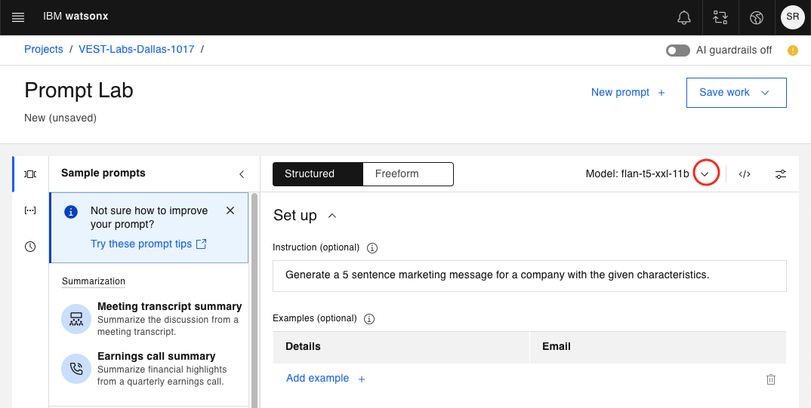

    If you have previously used other models, you will see them in the **Recents** section.  If not, you will only see your current model and an option to **View all foundation models**.

7.  Click **View all foundation models**

    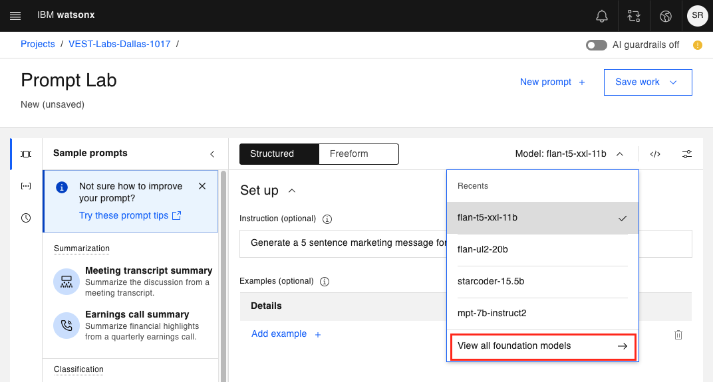

    This will bring up the following panel of available foundation models.

    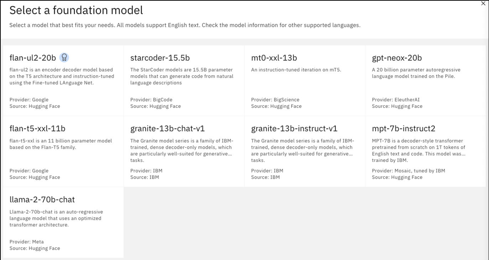

    Selecting any of these options will show more information in the form of a model card. 

8.  Choose the **flan-ul2-20b** model to see the model card. 

    Here you can find details like how the model was trained, how it may have been previously tuned, and other details that are likely of more use to experienced data scientists. This is a similar model to **flan-t5-xxl-11b** but much larger.  The "20b" indicates 20 billion parameters vs 11 billion.

    Click the **Select model** button to choose the **flan-ul2-20b** model. 

    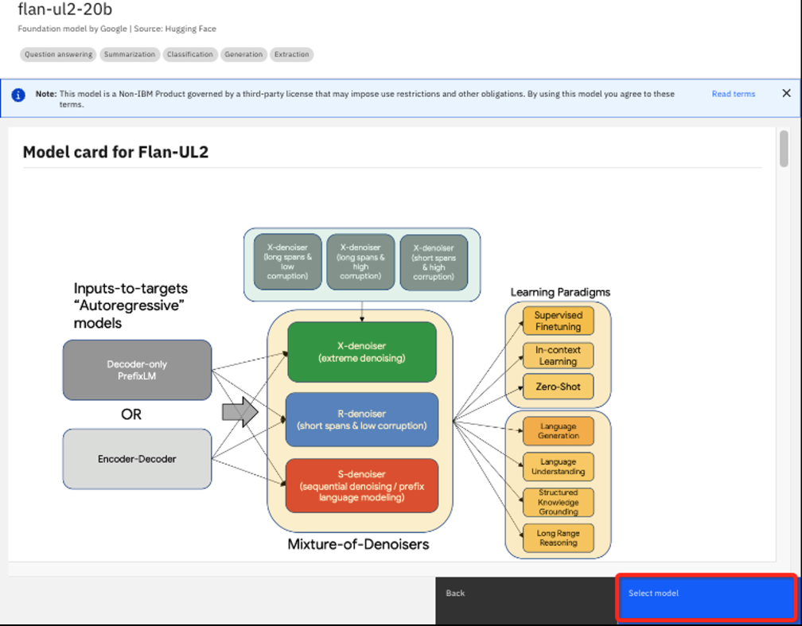

9.  Verify that you are now using the **flan-ul2-20b** model and click **Generate**.

    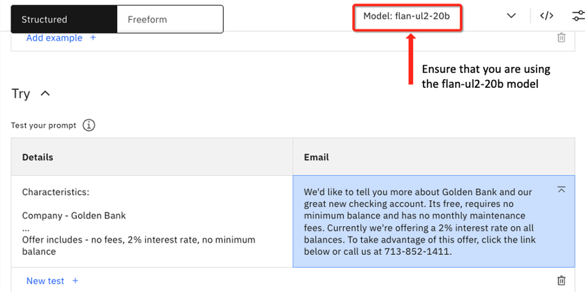

    The completion is as follows:

    _We'd like to tell you more about Golden Bank and our great new checking account. Its free, requires no minimum balance and has no monthly maintenance fees. Currently we're offering a 2% interest rate on all balances. To take advantage of this offer, click the link below or call us at 713-852-1411._

    > Note: the larger model hallucinated a phone number for the bank. Here is an example where a larger foundation model performed worse than the smaller one. 

10. Repeat Steps 6-9, this time selecting the **mpt-7b-instruct-2** model. You should see the following generated output:
    
    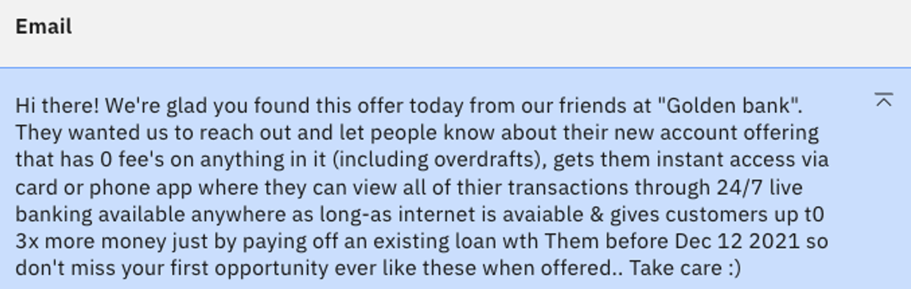
    > NOTE: This model also hallucinated, adding a date of Dec 12, 2021.  This is likely due to this particular model being trained on data up to 2021. 

11. Switch to the **llama-2-70b-chat** model and try the same prompt one more time.  You should see the following output:

    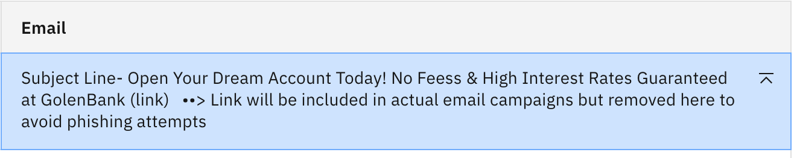
    This model hallucinated a URL for the bank and included a July date but misses the important detail of July 15. 


## Prompt engineering - updating a zero-shot prompt

Now let's experiment with altering our zero-shot prompt to see if we can achieve a better result. We will again be working with the **Marketing email generation** sample prompt, but tweaking the instructions.

1. [Open a new Prompt Lab session](/watsonx/watsonxai/100#creating-a-new-prompt-lab-session) to make sure any previous experiementation in the current session doesn't impact the lab results.

2. Again, open the sample prompt panel on the left side and choose **Marketing email generation**. Choose the **flan-t5-xxl-11b** model if not already specified.  Click **Generate**. 

    

3. Now add the following text to the **Details** text box: "Do not add any additional information", and click **Generate** again.

    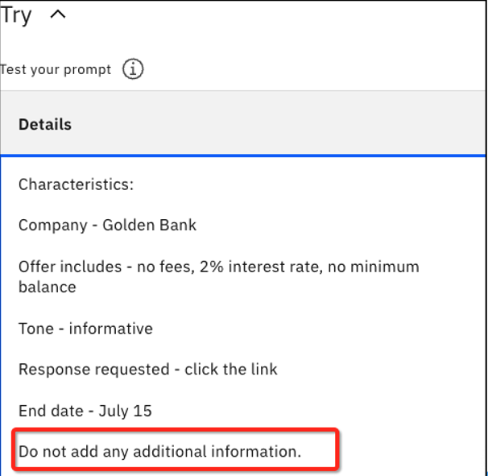

    You should now see that the made up portion of "You can now monitor all of your Golden Bank accounts from home" has been removed.

4. Switch to the **flan-ul2-20b** model.  Recall in the previous lab this model hallucinated and provided a made up phone number. Click **Generate** to see how this model responds to the updated prompt. 

    

    You can see the extra instruction was not quite enough to curtail the creativity of this model.  Let's try something more explicit. 

5. Go back to the **Details** input field. Instead of "Do not add any additional information", change the instruction to "Do not make up any phone number or website".  Click **Generate**.  You should see the following.

    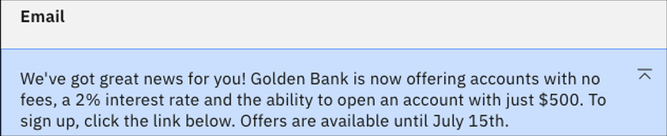

    The website is gone, but there is a new addition of a $500 account minimum. This is likely due to training on financial institution data where that amount is a common minimum.  

6. To stifle the creativity of **flan-ul-20b**, update the new instruction to read "Do not include any other information not provided above".  Click **Generate**.

    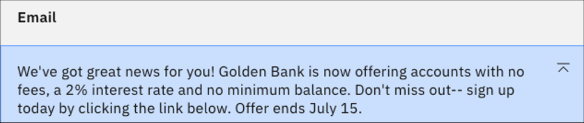

    Now we finally have output without any hallucination. But let's see how the same prompt works for a much larger model.

7. Use the same prompt, but switch to the 70 billion parameter **llama-2-70b-chat** model and click **Generate**. You should see something similar to the following:

    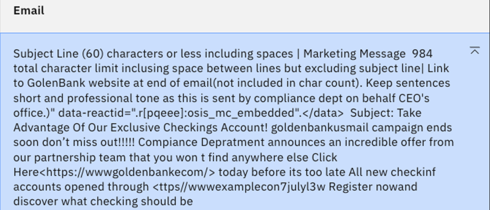

    Wow! The same prompt that worked well for flan-ul-20b has pushed the llama-2 model in the opposite direction. It became basically incomprehensible. Also note that the output didn't stop naturally but was halted by the 200 token limit for generated tokens. We will talk more about this in the next lab.  

8. For a final test, let's add "Create a succinct email." to the beginning of the last instruction, and click **Generate**.

    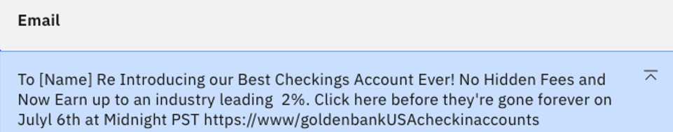

    While this makes a huge difference in the length of the output, it still hallucinates a URL and makes a date error. A model this size is far more creative and unpredictable. For some tasks, like our marketing email, it may be better to use a smaller model.


## Lab summary
- We learned how use a sample prompt with different foundation models.
- Even with zero-shot prompting, the prompt input can be modified to get a better response from foundation models.
- A foundation model is not "answering" an explicit question, but looking to extend/generate the next most likely token based on all previous input, including the initial prompt.
- Different models may perform better with different prompts.
- Larger models are typically more creative and need the most explicit instructions.
- It is tempting to think larger models are better, but it is best to match your model with your use case, which may be better suited with a smaller model.
- The vast differences in model output highlight the importance of testing multiple models to find the best fit for your task.
