<QuizAlert text='¡Atención! ¡El material del cuestionario se marcará así!' />

Esta es la segunda parte del laboratorio de la insignia L3 de watsonx.ai. En el laboratorio anterior, experimentamos con diferentes modelos de cimientos y vimos cómo los ajustes a un mensaje de disparo cero pueden marcar una gran diferencia en el resultado generado.

En este laboratorio, exploraremos otras técnicas para obtener los mejores resultados de un modelo de cimentación.

## Modificación de parámetros

En este laboratorio, continuaremos trabajando en el Prompt Lab y experimentaremos con parámetros configurables del modelo. Si es necesario, [vuelve a la pantalla de inicio de watsonx.ai](/watsonx/watsonxai/100#accessing-watsonxai-from-ibm-cloud) y entra en la interfaz de usuario de Prompt Lab.

Si ya ha estado trabajando en el Prompt Lab, [abra una nueva sesión de Prompt Lab](/watsonx/watsonxai/100#creating-a-new-prompt-lab-session)

1.  En la interfaz de usuario del Laboratorio de avisos, seleccione el icono **]⃞\[** del panel izquierdo para abrir la lista de avisos de muestra. Haga clic en el ejemplo de **generación de correo electrónico** de marketing de la sección Generar. Utilice el modelo **flan-ul2-20b** si aún no se ha especificado.

2.  Comenzaremos de nuevo con una instrucción ligeramente modificada. Edite el campo **Detalles** en la sección **Probar**, añadiendo `Do not add any additional information.` como instrucción final. Haga clic en **Generar**.

    Debería ver el mismo resultado que antes.

    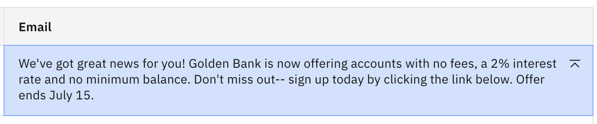

3.  A continuación, modificaremos algunos parámetros de inferencia para ver el impacto en la salida generada. Pero primero, vamos a discutir lo que hacen los parámetros configurables. Abra el panel de configuración haciendo clic en el icono **Parámetros del modelo** que se muestra a continuación.

    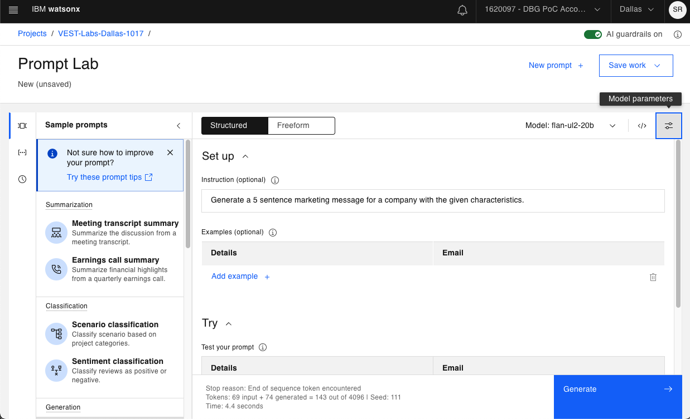

4.  Se abre una lista de parámetros que pueden actualizarse. Todos los modelos utilizan los mismos parámetros de inferencia. Vamos a explicar el propósito de cada uno.

    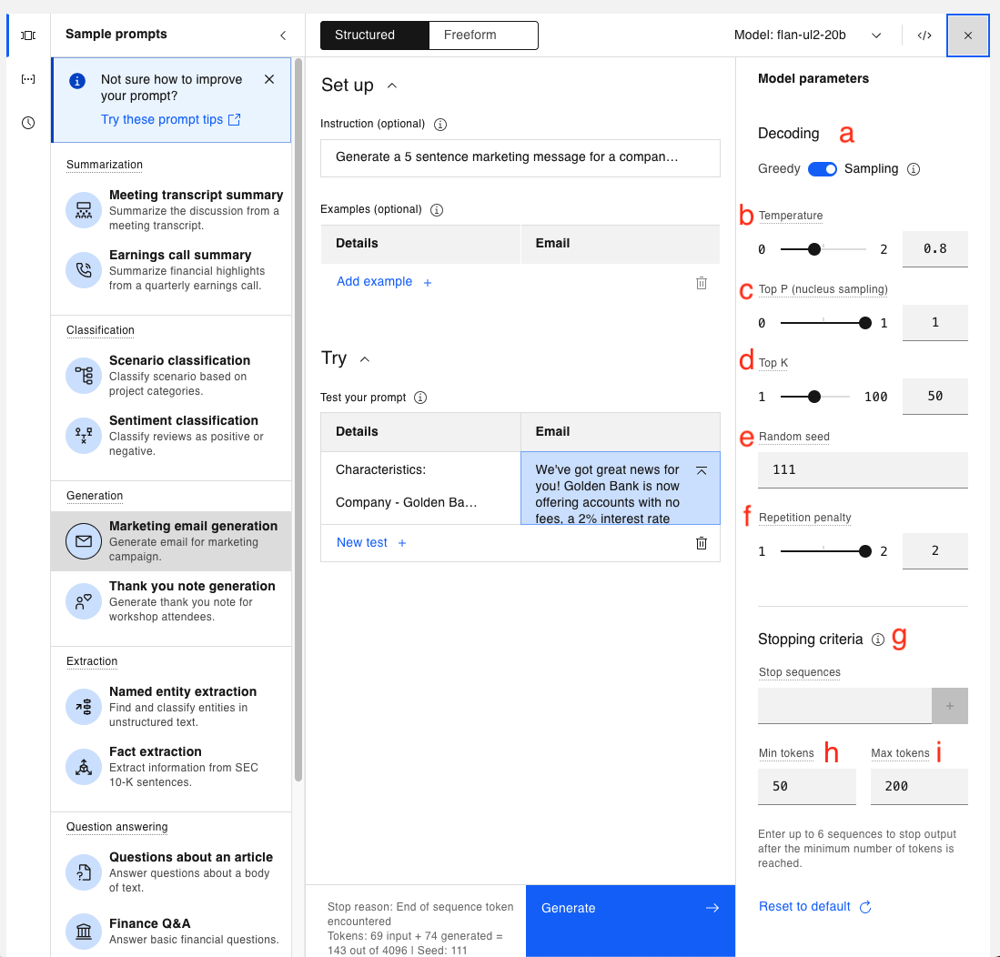


     <QuizAlert text='¡Pregunta del cuestionario relacionada con los parámetros del modelo!' />
    *   **a.** **Decodificación codiciosa** vs. **Decodificación por muestreo** - Así es como el modelo elige los tokens para la salida. Los 4 primeros parámetros (b a e) sólo son visibles en el modo **Muestreo**.

        *   En el modo **codicioso**, el modelo selecciona las fichas de mayor probabilidad en cada paso de la descodificación, y un modelo es menos creativo en ese modo.
        *   En el modo de **muestreo**, el modelo elige la siguiente ficha de un conjunto de fichas más probables, por lo que hay más creatividad, pero también un mayor riesgo de que el resultado no tenga sentido.

    *   **b. Temperatura** - un número en coma flotante que oscila entre 0,0 (que hace que el modelo funcione de la misma manera que si se hubiera seleccionado la decodificación Greedy) y 2,00 (que es la creatividad máxima).

        *   Cuanto mayor sea el valor de **Temperatura**, más "creativo" será el modelo.
        *   El valor por defecto suele ser 0,7, pero en este caso se fija en 0,8. Esto significa que al modelo se le permite cierta creatividad.

    *   **c. Top P (muestreo de núcleos)**: un número de coma flotante que oscila entre 0,0 y 1,0. A alto nivel, al generar una terminación, un modelo calcula la probabilidad de la siguiente palabra basándose en todas las palabras anteriores. **Top P** decide si el modelo elegirá siempre el resultado más probable o si permitirá más aleatoriedad para las siguientes palabras. El muestreo **Top P** elige entre el conjunto más pequeño posible de palabras "siguientes" cuya probabilidad acumulada supere el valor proporcionado para **Top P**.

    *   **d.** **Top K** - un número entero de 1 a 100. A diferencia de **Top P, Top K** no tiene en cuenta la probabilidad de las palabras. En su lugar, el modelo elige la siguiente palabra de entre las **K** más probables para la siguiente salida.

        *   **Top K** = 3, significa que el modelo elegirá aleatoriamente entre las 3 primeras palabras más probables.
        *   Cuanto mayor sea el valor de **Top K**, más aleatorio será el resultado.

    *   **e. Semilla aleatoria** - un número entero en el rango de 1 a 4.294.967.295. En el modo de muestreo, si todo lo demás permanece igual, la actualización de la semilla aleatoria producirá resultados diferentes.

        *   Si la semilla aleatoria sigue siendo la misma, debería obtener los mismos resultados, que es por lo que dejamos el mismo valor para estos laboratorios.
        *   En resumen, la semilla aleatoria es útil para la replicabilidad de los experimentos.

    *   **f. Penalización por repetición** - valor entre 1 y 2 (1 permite la repetición y 2 la prohíbe). Esto se utiliza para contrarrestar la tendencia de un modelo a repetir el texto de la consulta textualmente o quedarse atascado en un bucle en la generación de la misma salida.

    *   **g. Secuencias de parada** - secuencias de caracteres (texto, caracteres especiales, retorno de carro, etc.) utilizadas como indicador de parada por el modelo. La propia secuencia de parada se incluirá en la salida del modelo, pero será la última parte de la salida.

    *   **h. Min tokens** - un entero que especifica el número mínimo de tokens en la salida del modelo.

    *   **i. Max tokens** - un número entero que especifica el número máximo de tokens en la salida del modelo. A veces, cuando la salida generada parece incompleta, el valor de Max tokens puede ser demasiado bajo.

    > Ten en cuenta que se te cobrará o limitará en función del número de fichas utilizadas, así que ten cuidado al establecer el máximo de fichas por encima de lo necesario.

5.  Los valores que ve son los valores predeterminados para el caso de uso de ejemplo **de generación de correos electrónicos de marketing**. Juguemos con los valores y veamos como algunos cambios impactan nuestra salida. Deje el indicador actual en su lugar, y cambie el valor de **Temperatura** de **0.8** a **0.4**.

    

    Haga clic en **Generar**. Ahora debería ver el siguiente resultado.

    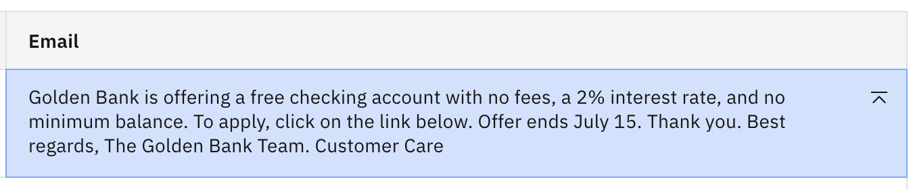

    Fíjate que al bajar la creatividad el resultado cambió bastante, y ahora tenemos un final de agradecimiento bastante largo.

6.  Reajuste el valor de **Temperatura** a **0,8**, y baje el valor de **Top P** de **1** a **0,5**. Esto significa que la siguiente ficha se elegirá aleatoriamente entre las fichas cuya probabilidad colectiva sea superior a 0,5. Vuelva a hacer clic en **Generar**.

    Debería ver resultados muy similares. En este caso, reducir el valor Top P tuvo aproximadamente el mismo efecto que reducir la temperatura.

7.  Ahora actualicemos el valor de Top **K** a 25 y restablezcamos **Top P** a **1,0**.

    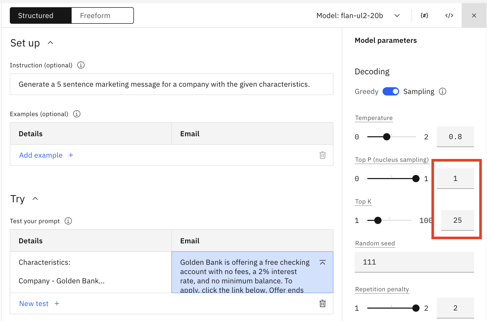

    Haga clic en **Generar**. Debería ver lo siguiente.

    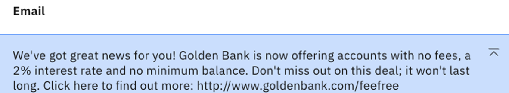

    La salida ha vuelto a ser la original. El modelo elige ahora la siguiente ficha de entre las 25 fichas con mayor probabilidad, por lo que es evidente que la actualización de **Top P** dio como resultado menos de 25 opciones para la siguiente ficha.

8.  Continúe bajando el valor **Top K**. Fíjate en que si lo bajas bastante (hasta aproximadamente 10) deberías ver una salida bastante buena con información precisa.

    

    ¿A qué se debe esta diferencia? La mejor forma de ilustrarlo es con un ejemplo. Supongamos que un modelo ha determinado el siguiente conjunto de posibles tokens siguientes para una entrada concreta:

    | Ficha | Probabilidad |
    | ----- | ------------ |
    | T1    | 0.16         |
    | T2    | 0.15         |
    | T3    | 0.14         |
    | T4    | 0.13         |
    | T5    | 0.12         |
    | T6    | 0.11         |
    | T7    | 0.10         |
    | T8    | 0.09         |

    En este caso, cuando se establece:

    *   **Top P = 0,5**, el modelo elige aleatoriamente entre T1, T2, T3 y T4 (porque las probabilidades suman > 0,5).
    *   **Top K = 50**, el modelo elige al azar entre las 8 fichas (ya que 8 \< 50)

    Por lo tanto, para este caso, es necesario bajar Top **K** a **4** para tener un efecto similar a **Top P = 0,5** por lo que ambas configuraciones están eligiendo entre las 4 fichas superiores.

## Petición de diferentes formatos de salida

Cuando se solicita un LLM, a menudo es beneficioso obtener la salida en un formato específico. Para facilitar la lectura o para agilizar la integración con otra herramienta.

### Listas de preguntas

Recuerde que un modelo de fundamentos no lee e interpreta una indicación como un ser humano. Más bien, consume una serie de palabras tokenizadas y calcula el mejor token siguiente. El concepto de lista es fácil de entender para un humano. Aquí veremos cómo responden algunos LLM.

1.  [Abra una nueva sesión de Prompt Lab](/watsonx/watsonxai/100#creating-a-new-prompt-lab-session) y seleccione la pestaña **Freeform** en lugar de la pestaña **Structured** por defecto. Seleccione "Cambiar de modo" cuando se le pida que cambie al modo de forma libre.

    > Nota: En el modo Freeform, sigue teniendo acceso a todos los ejemplos, modelos y configuración, pero no hay una guía estructural para el prompt.

2.  Abra el panel **Parámetros del modelo**. En el modo **Freeform**, los parámetros por defecto tienen el siguiente aspecto si **no ha seleccionado** una muestra rápida.

    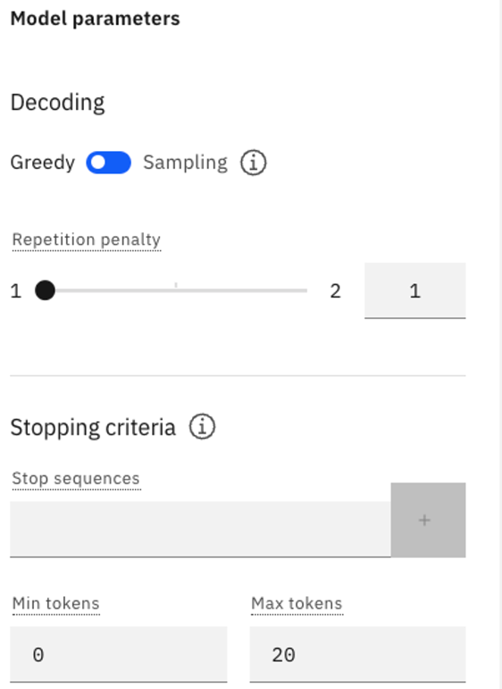

3.  Compruebe que está utilizando la descodificación **Greedy** y cambie el valor de **Max tokens** a 100.

4.  Asegúrese de que está utilizando el modelo **flan-ul2-20b**. Copie y pegue el siguiente texto en el campo de entrada:

    ```txt
    The following paragraph is a consumer complaint.

    Read the following paragraph and list all the issues. I called your helpdesk 
    multiple times and every time I waited 10-15 minutes before I gave up. The first 
    time I got through, the line got cut suddenly and I had to call back. This is just not 
    helpful. When I finally got through like after 3 days (yes, 3 days) your agent kept 
    going over a long checklist of trivial things and asking me to verify, after I 
    repeatedly told the agent that I am an experienced user and I know what I am 
    doing. It was a complete waste of time. After like an eternity of this pointless 
    conversation, I was told that an SME will contact me. That – was 2 days ago. What 
    is the problem with your support system?

    The list of issues is as follows:
    ```

    Haga clic en **Generar**. Debería ver un resultado similar al siguiente:

    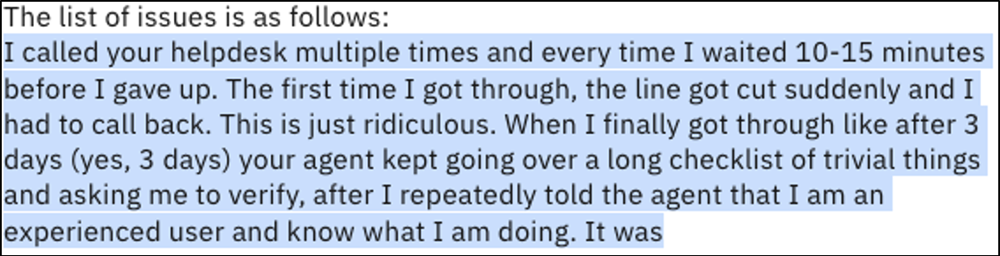

    > **Tenga en cuenta lo siguiente:**
    >
    > \- El modelo no produjo una lista.- El modelo sólo repitió el texto de entrada palabra por palabra.- La salida termina debido al límite de 100 tokens.Los modelos flan (tanto el **flan-ul2-20b** como el **flan-t5-xxl-11b**) parecen percibir "lista" como una instrucción para volver a contar lo que se les dijo anteriormente.

5.  Un método común para obtener la salida de la lista es guiar al modelo iniciando la lista. Elimine la salida anterior y añada un "1." a la última línea de su texto de aviso. Las dos últimas líneas deberían tener el siguiente aspecto:

    ```txt
    The list of issues is as follows:
    1. 
    ```

    Haga clic en **Generar**. Debería ver un resultado como el siguiente:

    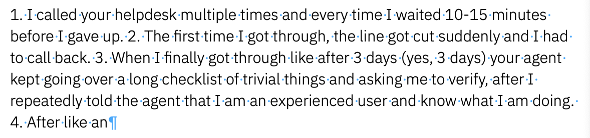

    Se trata sólo de una ligera mejora. Los modelos de flan no parecen muy adecuados para generar una lista con cero indicaciones de disparo.

6.  Cambie el modelo por el modelo **granite-13b-instruct-v2**. Elimine el "1." del mensaje y haga clic en **Generar**. Debería ver algo parecido a lo siguiente:

    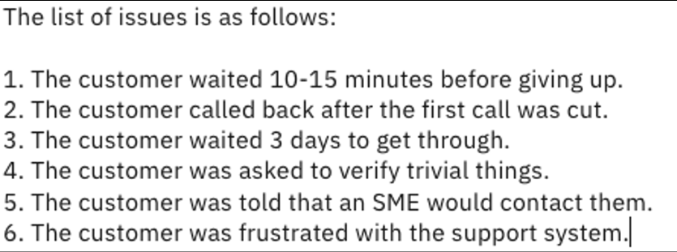

    Esto se parece más a lo que esperaría un ser humano. Para este tipo de peticiones, el modelo **granito-13b-instrucción-v2** es mucho mejor que los modelos flan. Además, el modelo interpretó correctamente que el cliente estaba frustrado con el sistema de asistencia, aunque no lo dijera explícitamente.

### Solicitud de salida JSON

Cuando se usan LLM's programáticamente puede ser ventajoso recuperar los datos generados en un formato que sea fácilmente consumido por el lenguaje de programación. Intentemos utilizar el Prompt Lab para generar un simple archivo JSON.

1.  [Abra una nueva sesión de Prompt Lab](/watsonx/watsonxai/100#creating-a-new-prompt-lab-session) en el modo **estructurado** predeterminado y asegúrese de que está utilizando el modelo **flan-ul2-20b**.

2.  Asegúrese de que está utilizando el modo **Greedy** y ajuste **Max tokens** a **100**.

3.  Copie y pegue lo siguiente en el campo **Entrada** de la sección **Probar**

    ```txt
    Create a JSON file output with the following information

    name: Joe
    age: 25
    Phone: 416-1234-567
    Phone: 547-4034-240
    Address: City: Markham, Street: Warden Avenue, Postal Code: L6G 1C7
    ```

    Haga clic en **Generar**. El modelo **flan-ul2-20b** devuelve lo siguiente:

    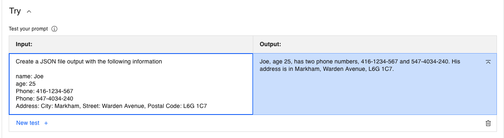

    El modelo flan respondió con una salida en lenguaje natural, que es el punto fuerte del modelo flan. Pero está claro que este no es el JSON solicitado.

4.  Seleccione el modelo **granite-13b-instruct-v2** y haga clic en **Generar**. Debería ver el siguiente resultado.

    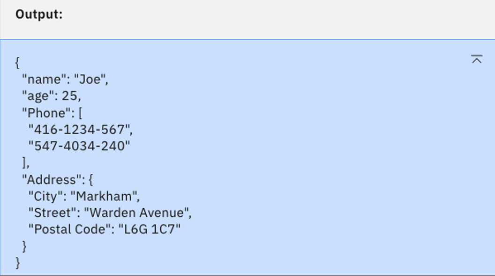

    Este es el JSON válido que estamos buscando. De nuevo, el modelo más pequeño granite-13b-instruct-v2 parece el mejor para el caso de uso.

5.  Ahora vamos a probar con el modelo **codellama-34b-instruct-hf**, que está entrenado para la generación de código. Seleccione este modelo y haga clic en **Generar**. Debería ver:

    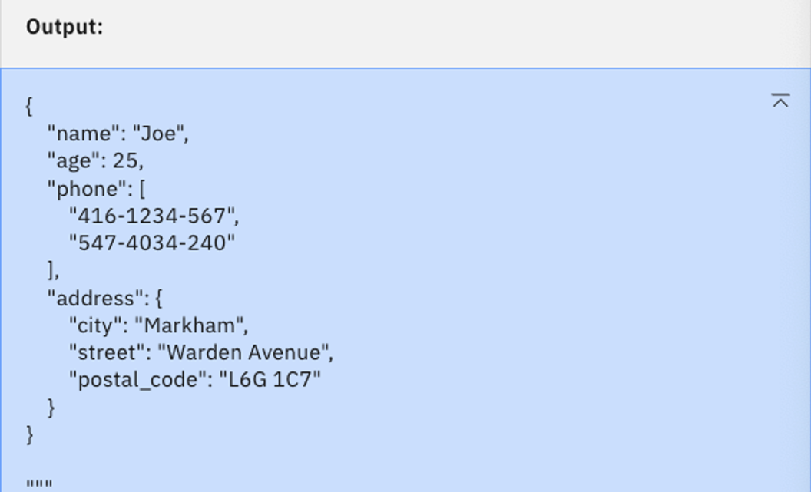

    Aquí tenemos un JSON válido, pero la sangría tiene algunos problemas, y hay mucho espacio en blanco.

6.  Si todavía quisiéramos seguir con el **codellama-34b-instruct-hf**, podemos utilizar **secuencias de parada** para limpiar la salida. Abra el panel **Parámetros del modelo** e introduzca `}↵}` en el cuadro de texto Detener secuencias. (Puede escribir un retorno de carro pulsando la tecla *Intro* o *Retorno* de su teclado). Añadamos también una instrucción para formatear la salida. Las instrucciones actualizadas deben decir: `Create a JSON file output with the following information, and please format it properly.`

     <QuizAlert text='¡Pregunta del cuestionario sobre secuencias de parada!' />

    Debería ver lo siguiente, luego haga clic en el botón azul **+** para añadir la secuencia.

    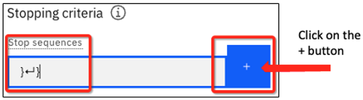

    Con la secuencia de parada añadida, verás esto:

    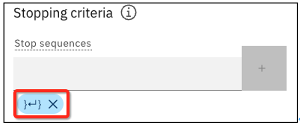

7.  Haga clic en **Generar**. Debería ver el siguiente resultado:

    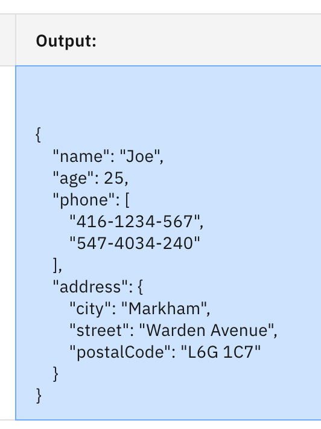

    Ahora tenemos una salida JSON válida. Puede eliminar una **secuencia Stop** haciendo clic en la **X**.

    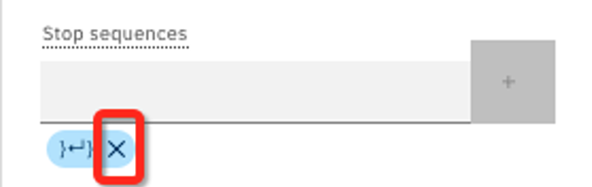

## Resumen de laboratorio

*   Experimentamos con los siguientes parámetros de configuración:

    *   **Temperatura** - un valor más alto se traduce en más creatividad
    *   **Top P** - un valor más bajo significa menos variabilidad
    *   **Top** K - un valor más bajo significa menos variabilidad

*   Tanto **Top P** como **Top K** limitan el número de fichas que el modelo elegirá para determinar la siguiente ficha de la secuencia.

*   Usamos indicaciones de forma libre y decodificación Greedy para pedir una lista.

*   Generamos una salida JSON y utilizamos secuencias de parada para detener la salida del modelo.

*   Es importante elegir el modelo adecuado para la tarea en cuestión, que no es necesariamente el modelo más grande. El modelo **granite-13b-instruct-v2** era el más adecuado tanto para las listas como para la salida JSON. Aunque es más pequeño que los modelos flan, fue entrenado por IBM para seguir las instrucciones de un usuario.
