<QuizAlert text='Heads Up! Quiz material will be flagged like this!' />

# watsonx.ai L3 Part 3: One-shot prompting and saving your work

This is Part 3 of the watsonx.ai L3 badge lab. In this lab, we will show how providing an example input and output (one-shot prompting) can lead to better output. Additionally, we will show how to save your work as a single prompt, as an entire prompt session, or as a Jupyter notebook. 

## One-shot prompting

Thus far, we have used zero-shot prompting and utilized parameter updates, prompt instructions, and thoughtful model selection to obtain desired outputs. Now, let's see how providing a specific example of the desired output for a given input can further improve model output.

1. If you're not already there, navigate back to the Prompt Lab, and [open a new Prompt Lab session](/watsonx/watsonxai/100#creating-a-new-prompt-lab-session)

2. Select the **flan-ul2-20b** model and open the **Model parameters** slide out panel. 

3. Change the number of **Max tokens** from **20** to **100**. 

    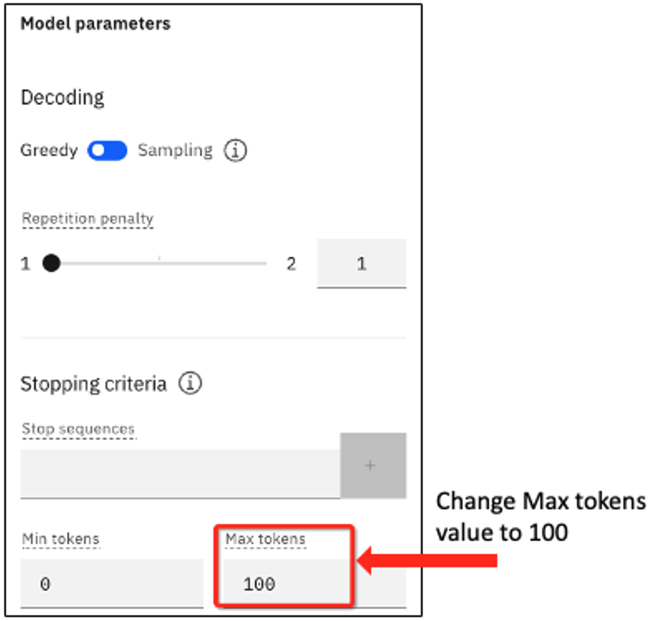

4. Copy and paste the following text into the **Try** section's **Input** field.

    ```txt
    The following paragraph is a consumer complaint. The complaint is about one of these 
    options: credit cards, credit reporting, mortgage and loans, retail banking, or debt 
    collection. Read the following paragraph and list all the issues.

    I called your help desk multiple times and every time I waited 10-15 minutes before I 
    gave up. This is just ridiculous. When I finally got through like after 3 days (yes, 3 days) 
    your agent kept going over a long checklist of trivial things and asking me to verify, after 
    I repeatedly told the agent that I am an experienced user and I know what I am doing, 
    It was a complete waste of time. After like an eternity of this pointless conversation, I 
    was told that an SME will contact me. That - was 2 days ago. What is the problem with 
    your support system?
    ```

    Click **Generate**.  You should see the following output:

    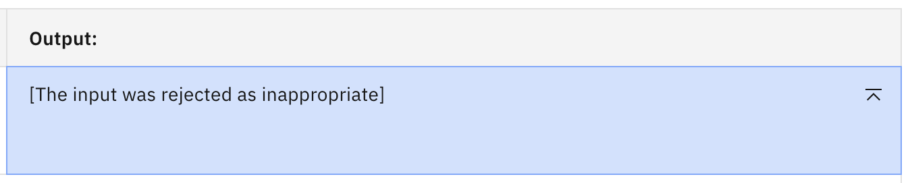

    The AI guardrails are clearly erring on the safe side. Let's turn them off or remove the word "ridiculous" and try again.

    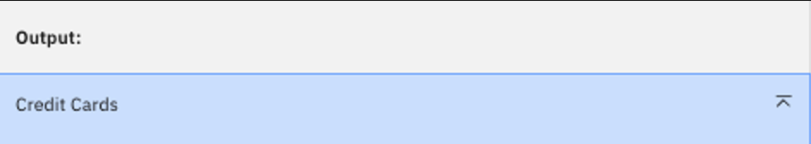

    This is clearly not the desired output. The model took the first part of the prompt and simply determined the complaint was about credit cards. So the model has performed a classification instead of a summarization.

    Let's try to resolve this by giving an example to "teach" the model how to respond properly to the prompt.

5. Copy and paste the following text into the **Set up** section's **Input** field in the optional **Examples** section:

    ```txt
    The following paragraph is a consumer complaint. 
    The complaint is about one of these options: credit cards, credit reporting, mortgages and loans, retail banking, or debt collection. Read the following paragraph and list all the issues.
    
    I bought a GPS from your store and the instructions included are in Spanish, not English. I have to use Google Translate to figure it out. The mounting bracket was broken, and so I need information on how to get a replacement. Moreover, the information seems to be outdated because I cannot see the new roads put in around my house within the last 12 months. 
    ```

6. Copy and paste the following text into the **Set up** section's **Output** field in the optional **Examples** section:

    ```txt
    The list of issues is as follows:
    1) The instructions are in Spanish, not English.
    2) The mounting bracket is broken.
    3) The information is outdated.
    ```

    Your screen should look like this:
    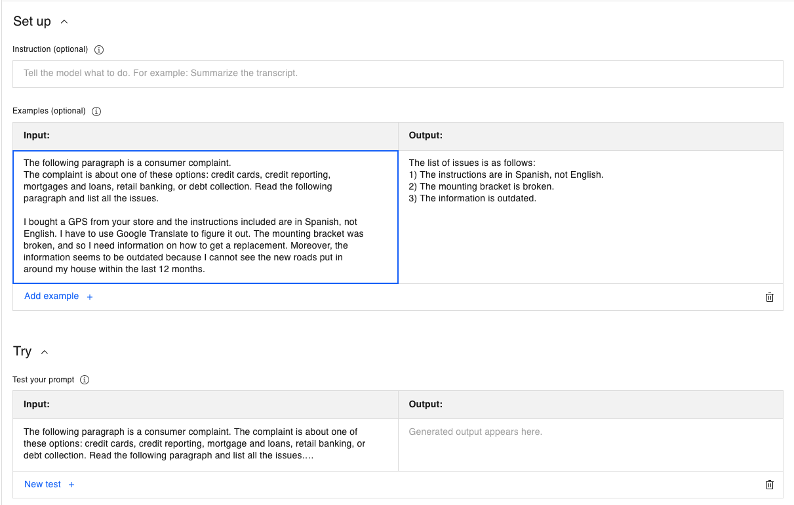

    Click **Generate**. You should now see the following output:

    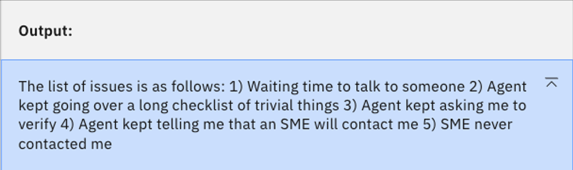

    Now we have vastly improved output. The completion listed all valid issues and put them in a numbered list.

    <Warning text='Do NOT close out the session or remove any information. You will need this for the next section.'/>

## Saving your work

We've seen that finding the best prompt for a job may require many parameter and input modifications. Once the best prompts for a task are identified, watsonx.ai allows you to save your work in the form of a single prompt, an entire prompt session, or a Jupyter notebook, which can also be edited within the watsonx.ai UI.

### Saving a prompt

You can save a "finished" prompt with the following steps. This saves the current state of the prompt, which includes any input, output, and configuration runtime parameters you might have changed. Think of this as taking a snapshot of the panel. Do this when you find a combination that works well for your purpose.

1. You should have the Prompt Lab still open from the previous exercise. However, if not, you can recreate that prompt or use a sample prompt for the sake of this exercise. If using the previously created prompt, you should see this:

    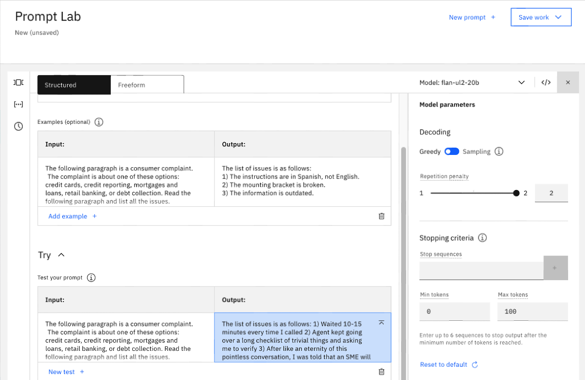

2. Go to the top right and click **Save work** dropdown and choose **Save as**. You should see:

    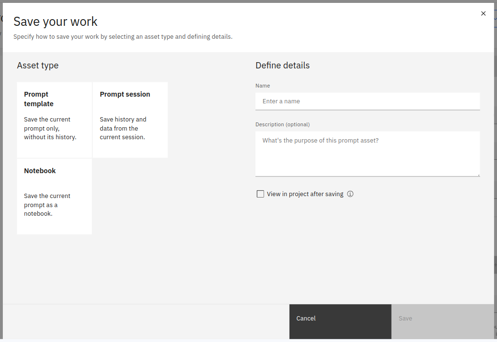

3. Select the **Prompt template** tile, and enter the following contents on the right.
    > NOTE: The `{uniqueid}` value below can be anything that uniquely identifies your saved asset from the assets of other students. Typically a last name or initials will suffice. Watsonx.ai will not prevent assets from being saved with the same name, so this will help you find the asset later. 
    - **Name**: `{uniqueid}_Flan_ul2_prompt_v1`
    - **Description**: Flan ul2 one-shot prompting with list output
    - Select **View in project after saving** checkbox

    You should see this:

    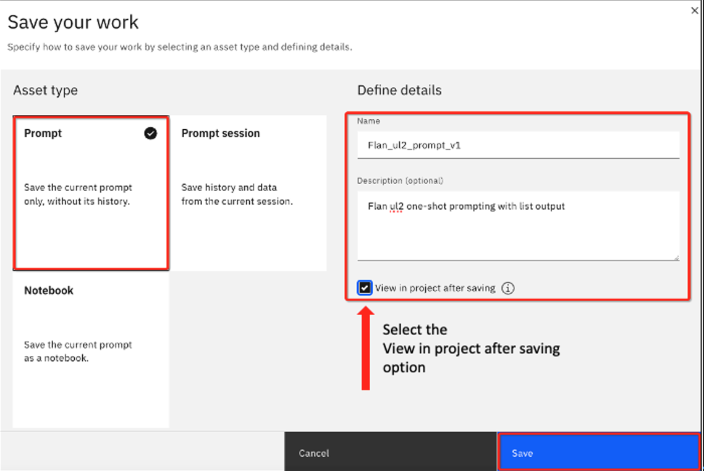

    Click **Save**. Your project will open up to the **Assets** tab.

    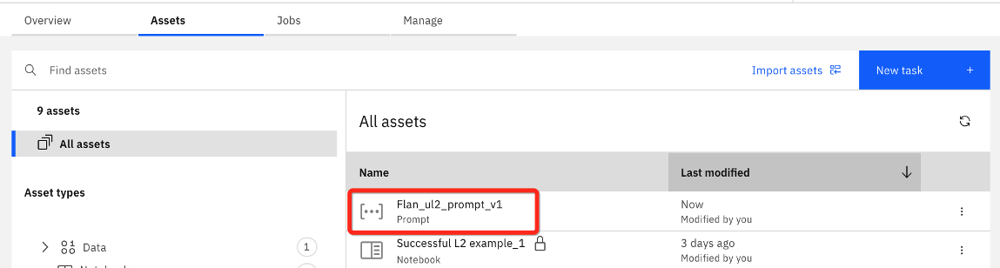

    You should see your saved prompt in the list of All assets.

4. Click on your prompt to load that saved asset in Prompt Lab. 

### Saving a prompt session

<QuizAlert text='Quiz question on saving a prompt session!' />

Saving a prompt snapshot is great when you know you've found the right prompt. However, there may be times when you're not sure or you want to revisit earlier prompt settings. In this case, saving a prompt session is helpful.

This saves the history of your prompt engineering session, tracking the changes in prompt text and configuration parameters (up to 500 steps).

1. First, let's generate a prompt history. On the opened `{uniqueid}_Flan_ul2_prompt_v1`, perform the following steps:
    - Open the **Model parameters** slide out, so we can tweak the parameters and regenerate the output.
    - Change the **Repetition penalty** to 1.8, then click **Generate**
    - Change the **Repitition penalty** to 1.2, then click **Generate**
    - Change the **Decoding** mode from **Greedy** to **Sampling**, then click **Generate**
    - Change **Top P** to 0.5, then click **Generate**
    - Change **Top K** to 25, then click **Generate**

2. Save this session by clicking the **Save Work** button.  You will see the following:

    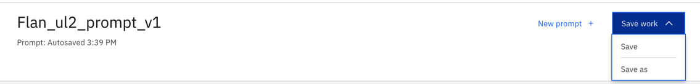

    There are **Save** and **Save as** options. You started with a saved prompt, so if you select **Save** you will be updating that saved prompt. Instead, select **Save as** to save this prompt session to a different asset - this time as a **Prompt session**.

    

3. You will see the **Save your work** panel that you saw previously. Again, for the name, include your unique id that was previously used to save the Prompt.
    - Select the **Prompt session** tile and enter the following information on the right.
    - **Name**: `{uniqueid}_Flan_ul2_prompt_session_v1`
    - **Description**: Updates to Repetition penalty, Top P, and Top K
    - Select **View in project after saving** checkbox
    - Click **Save**

    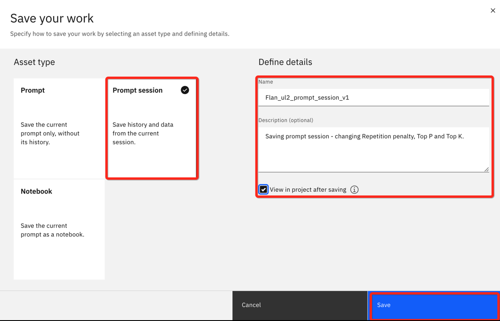

4. On the project Assets tab, you should be able to find the saved prompt session using your uniqueid. 

    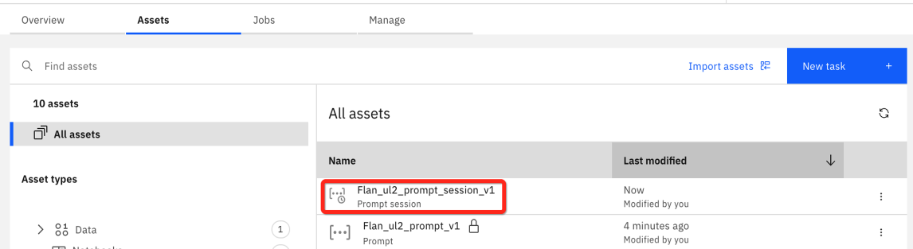

    Select your unique prompt session asset. You will be taken back to the prompt lab and see this, with your unique session name:

    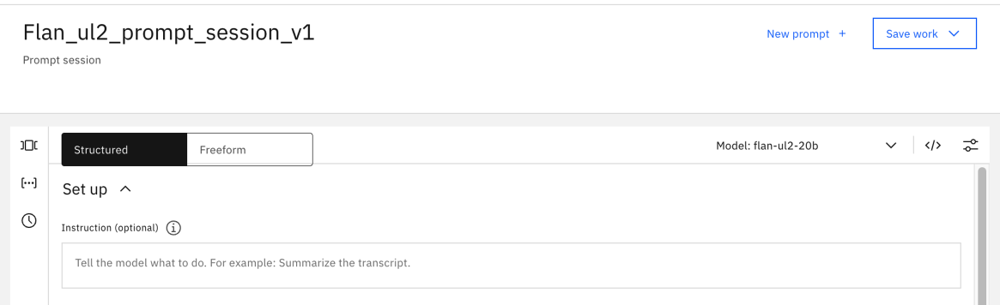

5. Select the clock icon on the left side to view your session history. You should see an entry for each time you clicked Generate before saving the prompt session.

    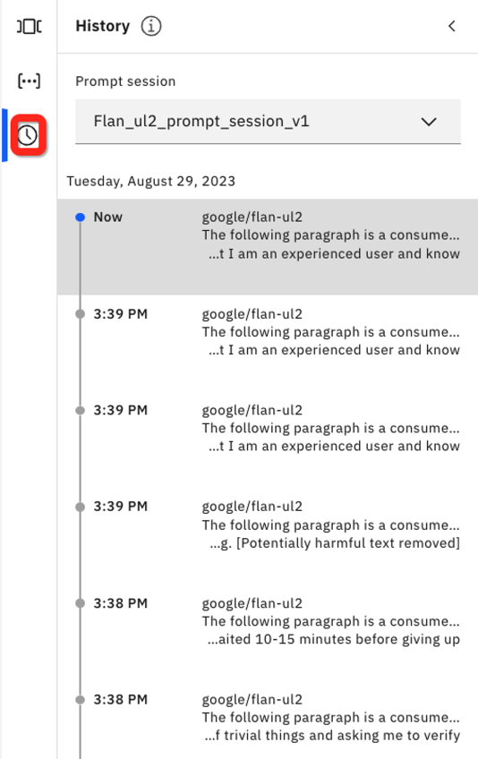

    > NOTE: 
        <br />- Changes are recorded only if you clicked on **Generate** after the change.
        <br />- The session history includes the time of change.
        <br />- You can select a particular step to review the content of the prompt at that step

6. Open the **Model parameters** panel and click on the bottom (oldest) prompt in the list. 

    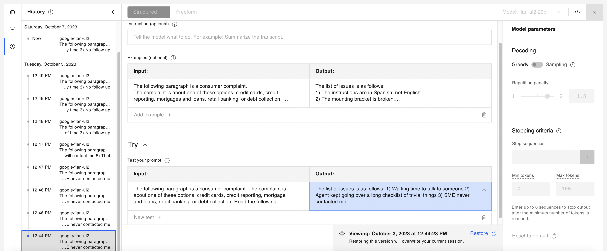

    Notice the parameter panel is read-only and where you would normally see the **Generate** button you see a timestamp for the prompt and an option to restore.

7. Let's suppose we decide the best prompt from our history was when **Top P** was set to **0.5** and Top K was set to **50**. Locate that prompt on the left side, now click the **Restore**. 

    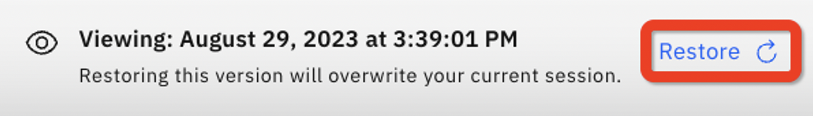

    The selected prompt has become the current prompt for the session.

## Lab Summary
- We used one-shot prompting to greatly improve the output of the flan model. 
- With one-shot prompting, we can teach a model:
    - to focus on the right information to use from the input
    - how to generate a desired output
- One-shot and few-shot patterns work by providing patterns to guide a model to generate output that has the best probability of matching the provided samples.
- Watsonx.ai allows saving of single prompts and also prompt sessions, which allow the user to review their prompts and restore to a previous prompt iteration.

## Watsonx.ai L3 Course Quiz
Congratulations! You have completed the necessary labs needed to complete the watsonx.ai L3 course quiz. The quiz can be found [here](https://learn.ibm.com/course/view.php?id=13452). **Note:** You do not need to watch the videos as the labs have covered all course content except for the quiz. You can click through the lessons and take the quiz.
