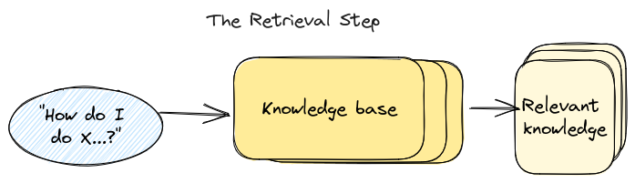
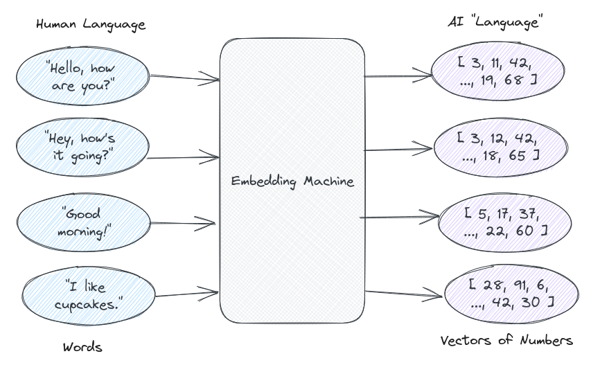
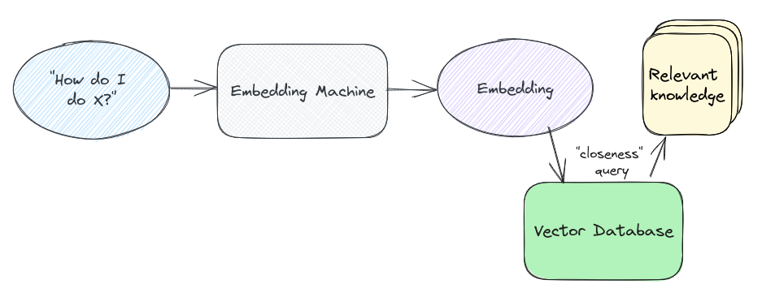

# Integración de VectorDB con modelos de fundación watsonx.ai

Este laboratorio le mostrará cómo podemos utilizar watsonx.ai y una base de datos de vectores para resolver un caso de uso de la generación aumentada de recuperación (RAG). Al combinar los modelos de base de watsonx.ai LLM (Gran Modelo de Lenguaje) con una base de datos de conocimiento existente podemos proporcionar un contexto perspicaz para nuestros modelos de fundación watsonx al generar una respuesta; en este caso vamos a hacer uso de un PDF para proporcionar contexto adicional a las solicitudes dadas a nuestro modelo de fundación watsonx.ai.

## ¿Qué es RAG?

En el laboratorio anterior discutimos qué es RAG o la generación aumentada de recuperación es, para una rápida recapitulación, RAG es un marco de IA para mejorar la calidad de las respuestas generadas por LLM mediante la puesta a tierra del modelo en fuentes externas de conocimiento para complementar el LLM's representación interna de la información.

## ¿Qué son los embeddings y por qué utilizar una VectorDB?

Para establecer una línea base, una base de datos vectorial (Vector DB) es una base de datos especializada que se utiliza para almacenar datos en formato vectorizado, generalmente en forma de matrices con diferentes pares de números. La siguiente pregunta podría ser: *¿Por qué utilizar Vector DB? *; para entender que primero necesitamos entender qué son los embeddings. El lenguaje humano es muy complejo, el cerebro humano es capaz de entender cuando usamos palabras que significan lo mismo o entendemos que ciertas palabras pertenecen a un grupo específico. Por ejemplo, nuestros cerebros son capaces de entender que *"rojo" *y *"azul" *son ambos colores a pesar de que son palabras diferentes, también podemos entender que cuando alguien utiliza las palabras *"feliz" *y *"alegre" *Por lo general, representan la misma emoción o sienten que son dos palabras muy diferentes. Tratar de explicar eso a una máquina es muy difícil, pero el LLM trata de reflejar algo de esta complejidad a su manera, a través de una compleja comprensión de los números. En resumen, un LLM trata de entender el lenguaje humano en un formato que tiene sentido para las máquinas, grupos de números. Sin llegar a complicar el uso de LLM de un traductor para convertir el lenguaje humano en números con los que puede asociarse fácilmente, este traductor suele ser una función de incrustación, y la salida es un vector de números conocidos como *embeddings *. Un simple ejemplo de esto podría ser la frase *"Buenos días" *representado como el siguiente *\[34, 12, 234, 638, 12, ...] *.

Mientras que para los humanos, esto podría no tener ningún sentido, es significativo para una máquina porque estos números representan una especie de cohesión para una máquina para entender adecuadamente el lenguaje humano. Estos vectores se pueden trazar en un gráfico, ya que pueden representar las coordenadas que se pueden trazar, a partir de estas coordenadas podemos determinar cómo cerrar dos embeddings, *o dos trozos de texto *, están entre sí; esta idea de la cercanía es un principio básico detrás *Búsqueda semántica *, que utilizamos cuando queremos consultar o mirar a través de todos nuestros embeddings almacenados para el texto *(o embeddings) *similar a nuestra consulta. Ahora viene nuestra VectorDB, almacena todas nuestras incrustaciones *(junto con los metadatos asociados) *y conceptualmente actúa como una trama de todos los vectores que tenemos almacenados; cuando hacemos una consulta contra nuestra VectorDB puede devolver las embeddings que están más cerca *(distancia más corta) *a nuestra consulta de la trama. Una simple representación visual de esto se puede ver en la siguiente imagen:

## ¿Qué es Chroma DB?

ChromaDB *(o Chroma) *se comercializa como una base de datos para la construcción de aplicaciones A. I, pero en su núcleo se puede simplificar como base de datos para almacenar datos vectorizados como embeddings. La distinción por embeddings es importante porque han surgido embeddings para convertirse en la forma A. I-nativa para representar cualquier tipo de datos (es decir, texto, video, imágenes), lo que los hace ideales para trabajar con todo tipo de herramientas y algoritmos A. I-powered. Una de las cosas que hace que Chroma sea exclusivo de otras bases de datos de embeddings es su naturaleza ligera permitiendo que se ejecute en la memoria si no hay necesidad de persistencia. Ser ligero también le da a Chroma rápido, fácilmente escalable *(al dar soporte a otras bases de datos tradicionales para la persistencia) *y fácil de utilizar la integración de SDKs utilizando Python y Javascript.

## Poniéndolo todos juntos ... RAG con VectorDB

Ahora tenemos suficiente información de fondo, podemos ponerla todos juntos y tratar de entender desde un alto nivel cómo encajan las piezas para RAG usando Vector DB. Como se ha comentado anteriormente, la recuperación de la generación aumentada (RAG) es un enfoque utilizado para mejorar el contexto proporcionado a un LLM (modelo de lenguaje grande) en casos de uso de IA generativa, incluyendo aplicaciones de chatbot y respuesta general de preguntas. La base de datos vectorial se utiliza para mejorar la solicitud de entrada pasada al LLM añadiendo un contexto adicional a la consulta de entrada. En lugar de pasar la solicitud directamente al LLM, *en este caso watsonx.ai *, en el enfoque RAG usted sigue los siguientes pasos:

*   Generar embeddings, que son la salida como vectores, de un conjunto de datos existente que sirve como base de conocimiento-Este conjunto de datos, que añade contexto adicional a la respuesta de LLMs, puede venir en la forma de documentación del producto, datos de investigación, técnicos especificaciones, catálogo de productos y descripciones, y aún más.
*   Almacenar los embeddings de salida del paso anterior en una base de datos Vectorizada. Los vectores son fáciles de indexar y se pueden consultar muy rápido.

Cuando un usuario inicia una solicitud, en lugar de pasarla directamente al LLM, lo aumentamos con un contexto adicional:

*   La solicitud de usuario se pasa al mismo modelo de incrustación utilizado para nuestro conjunto de datos, devolviendo un vector que incluye la representación de la consulta.
*   Esta incrustación se utiliza como la consulta (búsqueda semántica) contra la base de datos vectorial, que devuelve vectores similares.
*   Estos vectores se utilizan para buscar el contenido con el que se relacionan (si no se incluyen directamente junto con los vectores como metadatos).
*   Este contenido se proporciona como contexto junto a la solicitud de usuario original, proporcionando contexto adicional al LLM y permitiendo que devuelva una respuesta que probablemente sea mucho más contextual que la solicitud autónoma.

Con todas esas piezas juntas puedes completar un caso de uso de RAG usando Vector DB sin embargo, hay otras maneras de completar RAG.

## Comparación con Watson Discovery

En el [laboratorio anterior ](/watsonx/watsonxai/106)hemos completado un caso de uso de RAG utilizando Watson Discovery; en este laboratorio hacemos uso de una base de datos Vector en su lugar. Si bien ambas técnicas pueden ser utilizadas para lograr lo mismo, difieren en su enfoque. Watson Discovery se utiliza principalmente como plataforma de análisis y comprensión de documentos, esto funciona muy bien en escenarios en los que se utilizan o necesitan grandes cantidades de documentos para tomar decisiones empresariales. Por ejemplo, una gran empresa que realiza tamizajes a través de grandes cantidades de documentos financieros de la empresa para determinar los conocimientos antes de realizar una fusión o adquisición; o un bufete de abogados que realiza el tamizado a través de sesiones informativas y otros documentos de derecho para llevar a cabo investigaciones legales para precedentes legales. Las bases de datos de vectores funcionan un poco diferentes mediante la creación de embeddings, o matrices de grandes números, de señales de texto que luego se almacenan en una base de datos y se pueden hacer referencia rápidamente cuando se proporciona una consulta de inclusión de entrada de usuario similar al vector . Ambas soluciones logran los mismos resultados para determinar el contexto, sin embargo, su forma de ser implantada es su mayor diferenciador. Con Watson Discovery, puede utilizar un servicio gestionado y una interfaz de usuario elegante para ingerir e incluso anotar documentos para futuras consultas de lenguaje natural; dada su naturaleza gestionada, Watson Discovery también resulta ser una herramienta más fácil de integrar en otros servies utilizando una clave de API simple, URL de servicio e ID de proyecto; sin embargo, esta simplicidad tiene el coste del control granular. Las bases de datos de vectores se pueden utilizar como una *(es decir, PineconeDB) *o sin gestionar *(es decir, ChromaDB) *, a diferencia de Watson Discovery, que sólo se proporciona como una oferta gestionada. Las bases de datos de vectores también proporcionan controles más ajustados, como el uso de diferentes modelos de incrustación (para la vectorización) o los tokenizadores que permiten a los usuarios personalizar la base de datos para que se ajusten mejor a su caso de uso único, lo que puede ser mucho mejor one-size se ajusta a todo el enfoque de Watson Discovery. Este control adicional, viene con una complejidad añadida, lo que hace más difícil integrar fácilmente VectorDB de la misma manera que se puede con Watson Discovery. En general ambos enfoques son capaces de soportar el modelo RAG que se está popularizando con LLM, ya que ya ha completado RAG con Watson Discovery, este laboratorio explorará hacer lo mismo con las bases de datos de Vector.

## Ejecutar el laboratorio VectorDB + watsonx.ai

Para ejecutar el laboratorio para esta sección, empezaremos por iniciar sesión en la plataforma watsonx; después de navegar a la página de inicio de watsonx [aquí ](https://dataplatform.cloud.ibm.com/wx/home), desearemos abrir el editor de Notebook que podemos utilizar para ejecutar el cuaderno asociado con este laboratorio.

> Si no sabe cómo access watsonx.ai o no está seguro de cómo abrir al editor de notebook, siga [este enlace de referencia ](/watsonx/watsonxai/ref103)que le guiará a través del proceso para acceder a watsonx.ai y abrir el editor de notebook Jupyter.

Utilice lo siguiente **URL del cuaderno **para este laboratorio: `https://raw.githubusercontent.com/ibm-build-lab/VAD-VAR-Workshop/main/content/Watsonx/WatsonxAI/files/rag-with-chromadb.ipynb`

¡Buena suerte!
