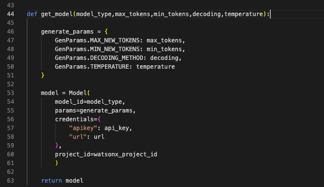
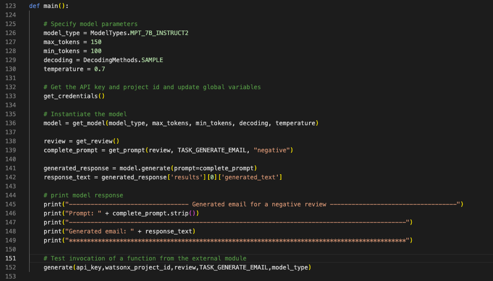
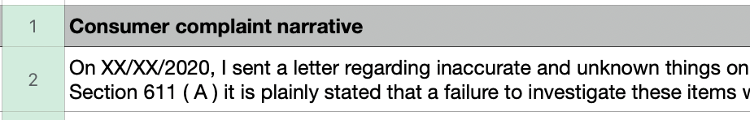
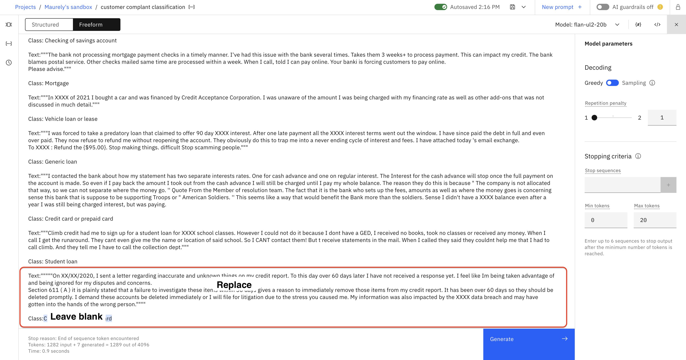
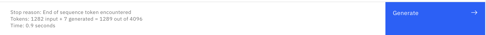
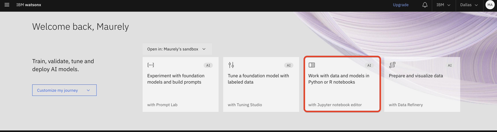
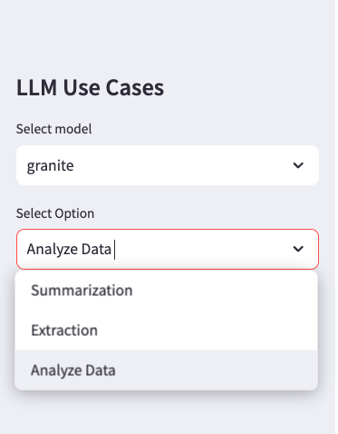

<QuizAlert text='Heads Up! Quiz material will be flagged like this!' />

# Large language model application building blocks

This hands-on exercise will show you how to integrate large language models (LLMs) with client applications. We will review several Python code samples which can be used as “building blocks” for an LLM application.
We will then use a simple UI prototype implemented with [Streamlit](https://streamlit.io/) to show how these building blocks can be invoked from client applications.

Prompt engineering is just one of the steps in the process of integrating LLMs into business applications. It is outside the scope of this guide to provide an introduction to prompt engineering in watsonx.ai. For an introduction to prompt engineering in watsonx.ai, check out the [VEST watsonx.ai L3 Labs](/watsonx/watsonxai)

## Prerequisites

- Access to watsonx.ai.
- Python IDE with Python 3.10 environment
  - We will be using the Python IDE, [Visual Studio Code (VSCode)](https://code.visualstudio.com/)
- You will also need to download the lab files from [this GitHub folder](https://github.com/ibm-build-lab/VAD-VAR-Workshop/tree/main/content/Watsonx/WatsonxAI/109)
  - We will refer to this folder as the _repo_ folder.


## Review scripts for various LLM tasks

In this section we will review 4 Python scripts and 2 notebooks that can be used as building blocks for LLM applications.

> Note: Prompts and model configuration in the scripts may not always return perfect results. If you wish, you can modify prompts and model parameters.

1. Load the following scripts from the repo/scripts folder into your Python IDE:

    - use_case_infererence.py
    - use_case_summary.py
    - use_case_generate.py
    - use_case_transform.py

    As you can tell from the script names, the scripts contain prompts for most common LLM use cases. 
    Each script follows a similar code structure:

     - The _ibm-watson-machine-learning_ library is used to invoke LLMs deployed in watsonx.ai.
     - An IBM Cloud API key and watsonx project id are retrieved from the _.env_ file (environmental file) which we will create in a later step in this lab.
    
        


     - The **get_model()** parameterized function creates a model object that will be used to invoke the LLM in order for the application to get responses for text that you input to the prompt.

        

     - The **get_prompt()** function will create the final prompt that will be passed to the model. The function will use text from a passed in parameter from either the **get_review()** or **get_sample_text()** function which will be analyzed by the LLM.

        > It's possible to organize the code without hardcoding the instruction part of the prompt, but we will not cover it in this lab.

        

     - The **main()** function specifies the model parameters and invokes the other functions. The function prints LLM output to the terminal. 
    
        

     - Lastly, each script contains at least one function that can be called by an external Python module. For example, in _use_case_generate.py_, the function name is **generate**.

2. Prior to running the scripts, create a _.env_ file in the root directory of your project and add your IBM Cloud API key and watsonx project id. 

      > For more information, see [Creating an IBM Cloud API key](https://cloud.ibm.com/docs/account?topic=account-userapikey&interface=ui#create_user_key) and [Looking up your watsonx project ID](https://dataplatform.cloud.ibm.com/docs/content/wsj/analyze-data/fm-project-id.html?context=wx).

3. Open a terminal and navigate to the scripts's location. Run each script. For example you can run one of the scripts with the following command: 

      ``` bash
         python ./use_case_generate.py
      ```

   As you review and run the code, consider the following questions:
      - How can this code be improved?
      - Why results could be different in each execution? 
      - What parameters we can adjust to minimize variability of the model output to make it more deterministic?
      - Why did we implement this code as scripts, and not notebooks?
      - When does it make sense to implement this code as notebooks?


Next, we will review the sample Streamlit application that uses these scripts in real-time.


## Streamlit UI application

Streamlit is an open source framework for creating Web applications. We include it in our workshop because of its ease of use. While customers can use Streamlit, it’s not a requirement 
for integration with watsonx.ai. 


1. Load the sample _Streamlit_ application, _sample_llm_ui_demo.py_, from the repo/scripts folder into your Python IDE.

2. To run this script, you will need to install the streamlit package in your Python environment. 

   ``` bash
      pip install streamlit
   ```

   > Important: If you’re running on Windows, you will need to run this script in an Anaconda Python environment because it’s the only supported Python environment on Windows. Both VS Code and Pycharm can be configured to use Anaconda.

3. Let’s review the application. 

   <QuizAlert text='This will be on the quiz' />

   The majority of the code creates the UI and handles UI interactions. LLMs are invoked on the button click event. Each click will send a request to run a script and inference our prompts.
 
   

4. When you run the script, Python will open the Streamlit UI in your browser in the local url http://localhost:8501.

   If you invoke Python application from a terminal, and not an IDE then use the following 
   command: 

   ``` bash
      streamlit run ./sample_llm_ui_demo.py
   ```

5. Run the application and review results.

   - You can paste different reviews into the Web UI
   - Test the Summary and the Extraction use cases
   - If you want to change model parameters, change them in:
      - _use_case_summary.py_ – function _get_summary()_
      - _use_case_inference_ – function _extract()_

   As you experiment with different models, you will notice that output is not perfect. We’re using the same prompt for all models to keep the code relatively simple. In most production applications the end user will not have a choice of a model, so you will be able to optimize the prompt for the best performance.

   <QuizAlert text='This will be on the quiz' />

   Currently, the llama-70b-2-chat model is one of the best models for zero-shot prompting. 
   While it may seem like an obvious choice to always use llama-70b-2-chat in watsonx.ai, it 
   may not be possible for several reasons:

      - Model availability in the data center (due to resources or licensing)
      - Inference cost
      - Hosting cost (for on-premises or hybrid cloud deployments)

   It may be possible to achieve similar results with other models or with smaller versions of llama by using few-shot prompting or fine-tuning, that’s why it’s important to experiment with multiple models and understand prompt/turning techniques. We encourage you to try other models (for example, granite and mpt-7b) in the **Prompt Lab** to experiment with and optimize the prompt, and then paste it in the respective modules. 


Next, we’ll look into an alternative implementation of a classification use case. 

## Classification

Classification is one of the most established use cases in Natural Language Processing (NLP). Using LLMs for classification has pros and cons. Consider the following when using LLMs for classification:

<QuizAlert text='This will be on the quiz' />

- Pro: LLMs don’t require training data
- Con: Without prompt tuning or fine tuning LLMs will likely produce less accurate results than traditional ML models
- Con: cost of inference (if using a Cloud offering, token count is often used as a charge metric).

For our next use case we will implement the traditional NLP approach because we have labeled 
data, and we would like to “save” our token usage for tasks that can not be completed by traditional NLP models, such as summarization and content generation.

While we will not use the prompt or LLM for deployment for Step 1 of this section we recommend that you complete it to understand the classification capabilities of LLMs.

1. In **watsox.ai** open the **Prompt Lab** and test the prompt using the following instructions.

   - Sample prompt: _Bank_complaint_classification.txt_ (in the repo/prompts folder)
      - The prompt uses the few-shot prompting technique by providing examples in the prompt after the instruction.
   - Model: flan or mpt
   - Decoding: greedy 
      - Since this is a less creative or fact-based use case we will use greedy decoding. Sampling will produce greater variability/creativity in generated content (see [documentation](https://dataplatform.cloud.ibm.com/docs/content/wsj/analyze-data/fm-model-parameters.html?context=wx&audience=wdp) for more information).
   - Sample data: _classification_training_data.csv_ (in the repo/data folder)

   The sample dataset contains labeled data – it was labeled by an analyst who read the notes and assigned the class (category/subject) of a complaint.

   When testing, paste a single cell from the **Consumer complaint narrative** column at the bottom of the prompt and make sure to leave the **Class** blank.

   

   

   While it’s possible to automate testing for all the consumer complaint narrative records and compare it with the classification labels for accuracy, we will not use this approach in the lab because it will use up our _IBM Cloud/watsonx.ai_ service token allocation. 

   You may have noticed that the notes are lengthy, and because of token limitations for each model, we will not be able to send a large number of examples (limited few-shot learning). 
   
   It’s important to understand the following facts about tokens:

   - LLMs have a limit for the number of supported tokens. The maximum number of tokens is usually captured in documentation or in the UI, as you’ve seen in the **Prompt Lab**. 

      

   - The maximum number of tokens includes both input and output tokens, also known as the _context window_. This means that you can’t provide an unlimited number of examples in the prompt. In addition to that, each model has the maximum number of output tokens (see [documentation](https://dataplatform.cloud.ibm.com/docs/content/wsj/analyze-data/fm-models.html?context=wx&audience=wdp)). 

   
   The token constraint limitation can be solved with several approaches. If we need to provide more examples to the model, we can use an approach called Multitask Prompt Tuning (MPT) or fine tuning. We are not covering these advanced approaches in this lab.


At this time, we will switch to the traditional NLP approach.

Watson NLP is a Python NLP library that provides natural language processing functions for 
syntax analysis and for a variety of text processing tasks, such as sentiment analysis, keyword extraction, and classification. 

Watson NLP contains both pre-built models and models than can be trained with data specific for the use case. One of the other advantages of Watson NLP is the support for 20 languages. You can learn more about Watson NLP in [documentation](https://dataplatform.cloud.ibm.com/docs/content/wsj/analyze-data/watson-nlp-block-catalog.html?context=wx&audience=wdp).

2. Import the two sample NLP notebooks from the repo/notebooks folder into your watsonx.ai project in IBM Cloud:

   - _Classify_notes_model_build_
   - _Classify_notes_score_

   For each notebook, do the following instructions:

      a. In watsonx.ai click on the tile **Work with data and models in Python or R notebooks**.

      

      b. Click the **Local file** tab on the left and navigate to the downloaded git repo/notebooks folder to select a notebook. Make sure that the NLP Runtime 23.1 environment is selected.

      c. Click **Create** to import the notebook.

      
   

3. Import the data used by the notebooks into your project

   - _classification_training.csv_
   - _notes_scoring.csv_

   

4. Let’s review the notebooks. Detailed explanation of model training and scoring is provided in each notebook. On a high level, the model building notebook:
   - Uses the prebuilt Watson NLP models for syntax and embeddings.
   - Trains an SVM and an ensemble model using sample data.
   - Evaluates model accuracy.
   - Saves models to the project.

   The model scoring notebook loads the models from the project and scores data. We assume that this model will be deployed for batch scoring. If our goal was to deploy classification for real time scoring, then we could wrapper it into a Python function as described in [documentation](https://dataplatform.cloud.ibm.com/docs/content/wsj/analyze-data/ml-deploy-py-function-write.html?context=wx&audience=wdp).

5. Open the _model building_ (Classify_notes_model_build) notebook  in _Edit_ mode and make the required changes before running it (see instructions in the notebook):

   - Generate a project access token. See instructions [here](https://dataplatform.cloud.ibm.com/docs/content/wsj/analyze-data/token.html?context=cpdaas).
   - Regenerate/update code to load training data.

6. Open the _model scoring_ (Classify_notes_score) notebook in _Edit_ mode and make the required changes before running it (see instructions in the notebook):

   - Generate a project access token. See instructions [here](https://dataplatform.cloud.ibm.com/docs/content/wsj/analyze-data/token.html?context=cpdaas).
   - Regenerate/update code to load scoring data. 

   As you review and run the code, consider the following questions:

   - Why did we implement this code as a notebook, and not scripts?
   - Can this code be implemented in Python scripts outside of watsonx.ai?
   - How can this code be improved?


There are several options for deploying classification model scoring. While it can be deployed for real time scoring, a more common scenario is running scoring as a batch job. A batch job can be invoked on demand. 


In this lab we’re not going to walk through the deployment process. You can read more about batch deployment in [documentation](https://dataplatform.cloud.ibm.com/docs/content/wsj/analyze-data/deploy-batch-details.html?context=wx&audience=wdp). At this time, in watsonx.ai you will need to wrap the model scoring code info a _Python function_ and deploy the function for batch scoring.

You may have noticed that the sample _Streamlit_ application has an **Analyze Data** option in the use case dropdown.

   

7.  Run the Streamlit application and click the **Run Analysis** button.

      

      In our sample application we’re not invoking on-demand batch scoring, but simply providing the file with scoring results.

      

      In a production implementation this function should perform two steps:

      - Invoke the model configured for batch scoring (as described in mentioned documentation)

      - Load results from the data source that was used as the output data source of batch scoring

## Conclusion

You have finished the LLM Application Building Blocks lab. In this lab you learned:

   - How to write work with the watson-machine-learning library to invoke LLMs that perform various tasks.
   - How to write modular code that can be used from client applications.
   - How to implement a classification use case with the Watson NLP library.
   - About a cost-performance tradeoff of the LLM based approach and cases when it makes more sense to leverage traditional ML (classification).
