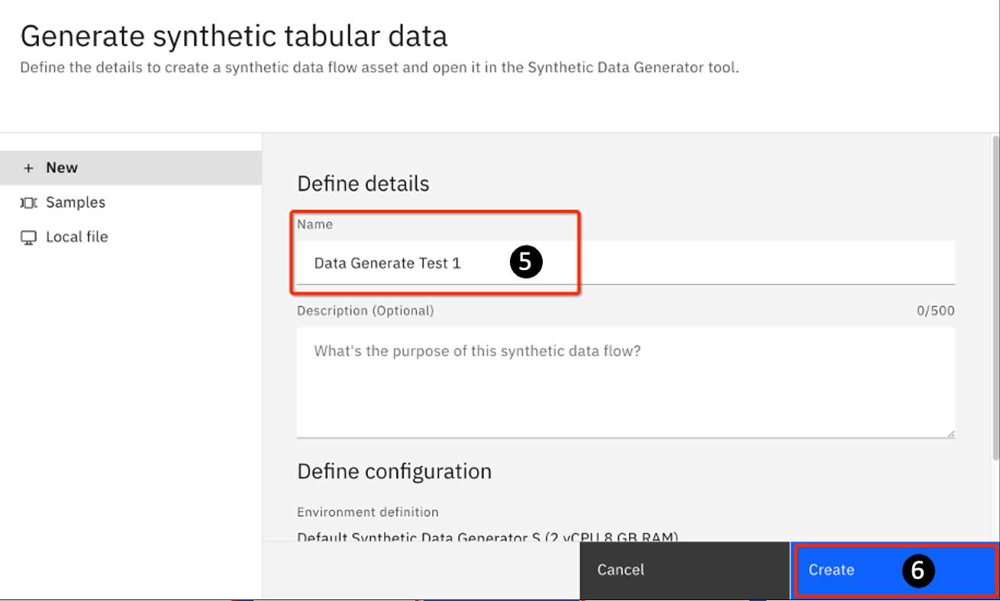
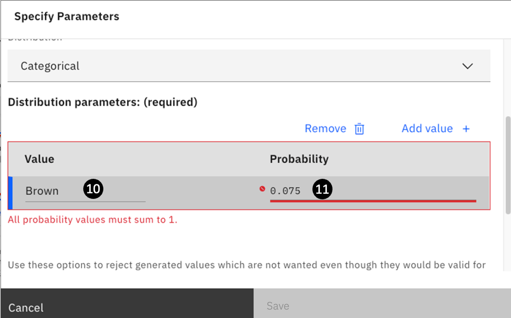
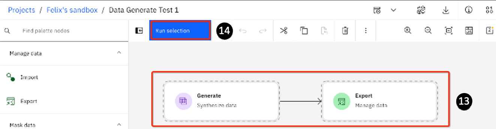
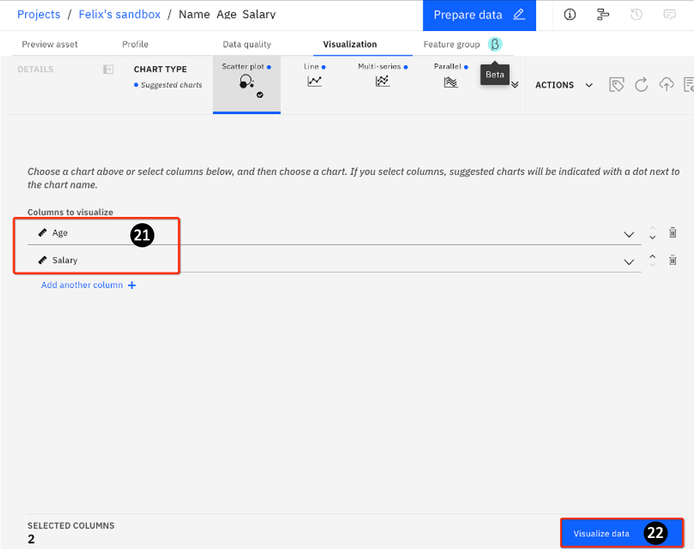
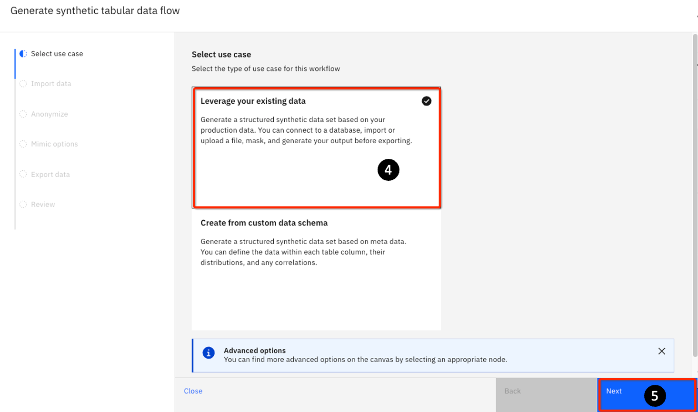
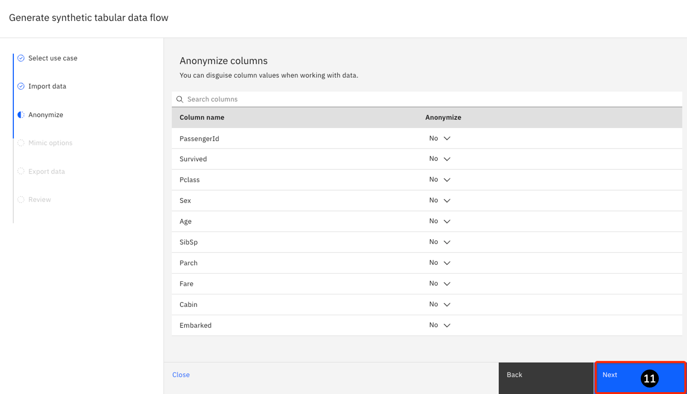
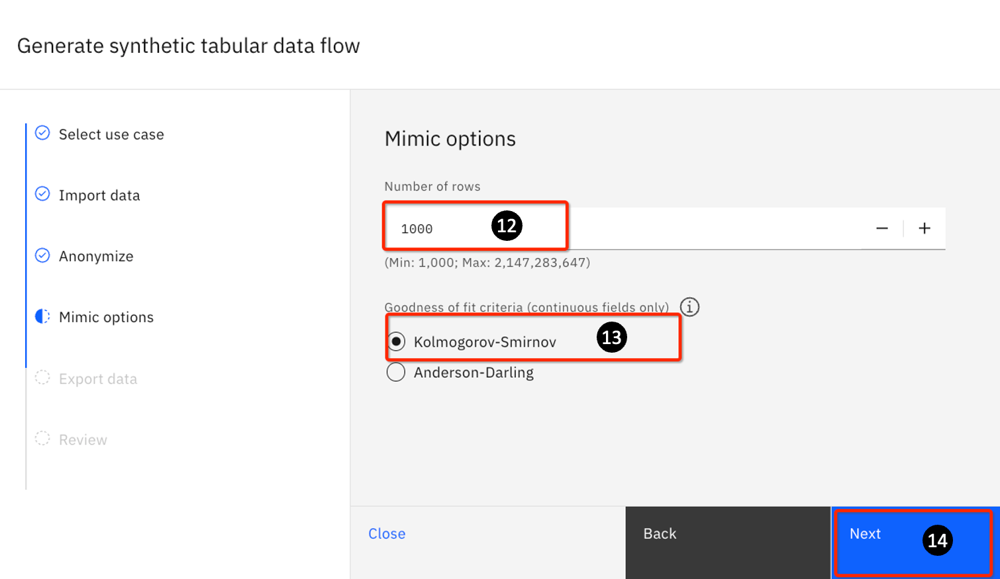
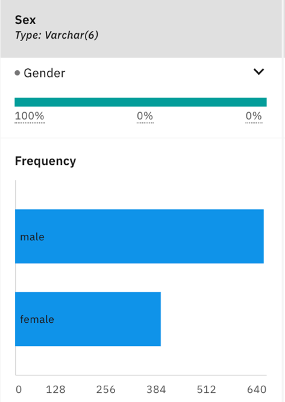

# 206: Generate synthetic data

In this lab, you will be introduced to the following watsonx.ai capabilities:

- New foundation models available since the publication of the original watsonx.ai
    Technical Sales Lab Guide Part 1.
- Generating synthetic data for use with traditional AI or foundation models
    testing/tuning. This lab details two ways to generate synthetic data:
    - Generate: Generate different data sets either from scratch
    - Mimic: Generate new data based on a small existing data set

## Prerequisites

You will need an IBM Cloud account to gain access to the TechZone account that hosts the
various Watson and watsonx services used in this lab.

## Synthetic data generation

Synthetic data is data that is artificially generated using advanced statistics, as opposed to real data, which is gathered by observing real-world events. Synthetic data can be used with watsonx.ai to augment or replace real data for improving AI models, protecting sensitive data, and mitigating bias. Synthetic data can be generated using foundation models to replicate data with the right statistical attributes. Synthetic data can be used for hackathons, product demos, internal prototyping, exploring market behaviors, or a large number of other use cases that require more data or have privacy concerns.

In this section, you will take a break from investigating foundation models to look at synthetic data generation, another important feature of watsonx.ai.

1. Open the watsonx.ai Prompt Lab and click your project.

2. Select the Asset tab.


3. Click New asset


4. Click on the **Generate synthetic tabular data** tile.


5. On the next panel, provide a name such as **Data Generate Test 1**. You can also optionally provide a description in the **Description field**.

6. Click **Create**.



You will see the following message:


As noted in the message, this process may take a few minutes.

> **Note**: sometimes the process may fail. If so, retry by clicking Create again.

7. On the subsequent panel, click on the **First time user** tile.

8. Click **Continue**.


If you click on the **Experienced user** tile and then click Continue, you will be taken to the Synthetic data generation canvas tool for data generation. You can always come back to
the **Welcome to Synthetic Data Generator** wizard by clicking on the **Launch wizard** icon (you may need to scroll or expand your window to see this icon)


9. If you select the **First-time user** tile, you will see a panel showing 2 tiled options:

    - **Leverage your existing data** – Use this to leverage existing data sets and
   generate new synthetic data that resembles (but does not include) your existing
   data. This is an easy way to generate data that is compatible with a specific
   schema.
   - **Create from custom data schema** – Use this to create your own table schema
   and populate it with synthetic data.

You will try both methods in this lab.

Don't select any options yet.


## Create synthetic data by defining customized data schema

In this section, you will create synthetic data from scratch.

1. From the last step from the previous section, click on the **Create from custom data schema** tile.

2. Click **Next**.


3. The **Generate synthetic tabular data flow** page opens. You can set the number of rows to generate – the default is **100,000** rows.

4. You can also define the columns (the schema) of the table.


5. By default, watsonx.ai will generate 100,000 rows. For this exercise, change the **Number of rows** field to the minimum number allowed: **1,000**.


6. Now you will start to define columns. You will define a simple table with an employee's last name, age, and salary range.

On this panel, click **Add column +**.


The following panel appears. Fill in the first 3 fields as follows:

7. **Column**: Enter **Last_Name**
8. **Storage**: Select Enter **String** from the drop-down list
9. **Distribution**: Select **Categorical** from the drop-down list


Since you are defining a string column, the **Distribution** is simply a categorical list of last names. In this case, watsonx.ai is asking you to provide a list of possible outcomes (here is a list of last names, in general, it would be whatever valid values that a string variable can take on). You will need to provide a list and the probability value for each item on that list; the sum must be 1.0.

When you scroll further down, you will see fields for Value and Probability. For the first name of the category, enter the following values:

10. For **Value**: Enter **Brown**.
11. For **Probability**: Enter **0.075**.



12. Notice that the Save button is still grayed out. The reason is stated in **red above: All probability values must sum to 1**. You will need to keep adding additional values until all the probability adds up to 1.0.

Click on **Add value +**.

13. A new row will be added, which you will fill in next.


Carefully add all the values in the following table (they add up to a total of 20 last names); remember you already added the **Brown** row.

| Value   | Probability | Value    | Probability |
|---------|-------------|----------|-------------|
| Brown   | 0.075       | Leung    | 0.096       |
| Gordan  | 0.054       | Wilsom   | 0.019       |
| Newman  | 0.037       | Duncan   | 0.022       |
| Chen    | 0.082       | Wong     | 0.085       |
| Lord    | 0.023       | Kapoor   | 0.072       |
| Muthu   | 0.027       | Allen    | 0.028       |
| Bird    | 0.022       | Thomas   | 0.088       |
| Bentley | 0.024       | Roberts  | 0.054       |
| James   | 0.018       | Martinez | 0.066       |
| Abrams  | 0.029       | Jones    | 0.079       |

> Once you have a list with a probability value adding up to **1.0**, the **Save** button will turn blue; if it doesn't you have an error in the **Probability** numbers ... recheck them.

14. Click **Save** to create the column.


15. You are redirected to the **Generate synthetic tabular data flow** page. Notice that the **Last_Name** column is now added.

16. Click **Add column + **to add another column.


Insert the following data:

17. For **Column**: Enter **Age**

18. For **Storage**: Select **Integer** from the drop-down

19. For **Distribution**: Select **Normal** from the drop-down

With an integer column, you can optionally use a **Categorical** distribution (like you did in
Step 9). In that case, you will need to provide a list of ages and the probability of each, similar to what you did with **Last_Name**. For this lab, you will use a typical normal distribution for number-based items (this is the default assumed by watsonx.ai)

20. Notice that watsonx.ai automatically filled in a mean value of **50**.

21. Watsonx.ai also puts in a default **Stddev** (standard deviation) value of **10**. As you are working with a global company, you might want to have a larger spread of data. Keep the mean value for this lab, but change the **Stddev** to **15** instead of **10**.

22. Click **Save**.

23. The **Generate Synthetic tabular data flow** reopens. The **Last_Name** and **Age** columns are now added.

24. Click **Add column+** to add a third and final column.


25. For the last column, use the following values. For **Column**: Enter **Salary**.

26. For **Storage**: Select **Real** from the drop-down
27. For **Distribution**: Select **Normal** from the drop-down
28. For **Mean**: Enter **140000**
29. For **Stddev**: Enter **35000**
30. Select the **Specify minimum check box**. Enter **80000** for the **Reject values below**: field.

> In this example, you want to ensure that you generate a range where the salary cannot be lower than $80,000. You may want to do this to eliminate a salary that is valid but not desirable. You may also define a maximum. In this lab it is not set.

31. Click **Save**.


33. You are returned to the **Generate synthetic tabular data flow** page. You now see all 3 columns you defined have been added.
    
34. Click **Next** to generate the data.


35. On the next panel, you can specify the output **File name**. Change it to **Name_Age_Salary**.
    
36. Click on the **File Type** drop-down and select **Excel**.
    
37. Click **Next**.


38. On the next page, review the information. If it is correct, click **Save and run**.


The next page shows a graphical representation of the synthetic data generation tasks. There are 3 main areas:

39.  **Generate** – this is where you define how you want to generate your data.

40.  **Export** – this is where you define how you want to export your output; in this lab (Step 1)  you selected the output to be an Excel file with the name **Name_Age_Salary.xls**.

When you click on **Generate and Export**, you will see that dotted lines will now surround
both actions.

41.  **Run selection** – you can separately highlight the **Generate** and **Export** icons to run the code individually (you will need to first run **Generate** pipeline before you can run Export). In most cases, simply select both of the icons to first **Generate** and then **Export** the generated data in one single pass.


42. The pipeline will take some seconds to run (it can vary depending on the availability of resources – anywhere from several seconds to tens of seconds, so be patient if it takes a little longer).

You will see a quick summary with the **Run details**.


43.  Go to the breadcrumb (top left) and click on your project.


Watsonx.ai should open up in your project's **Assets** tab.

44. If not, select the **Assets** tab.

You will see the following (you may have other assets):


45.  **Name_Age_Salary.xls**... the name of the `xls` file.

46. **Data Generate Test 1** ... the name of the Synthetic data flow specified in Step 5 of this lab.


## Using watsonx.ai to examine and update your synthetic data

One of the key points in generating synthetic data is how closely the data resembles real-life
data. It is important to keep in mind that to the AI model, there is no inherent meaning in **Last_Name**, **Age**, and **Salary**. These are simply tokens used. This means that it can sometimes
generate data that is “valid” but perhaps makes little sense (or quite unlikely in real life).

In the last section, you generated a **Name_Age_Salary.xls** file with **1000** rows of synthetic data. This data was generated randomly, so your data may not have the same entries as highlighted below; although if you look carefully, the same type of issues are probably present.

Here are some generated data that clearly exhibit various issues.

- There are 2 names with age 0, 8 names with age < 10, and 30 names < 20. Certainly, you would want to remedy this.
- At the other extreme, there are 28 names of age > 75, with 3 of them older than 90. You probably want to also remedy this.
- One more subtle issue is that many older employees are making a lot less than younger employees. This is possible but the distribution simply looks unreal.

In this section, you will look at how to use watsonx.ai to generate better data.

1.  Ensure you are in the **Assets** tab of your project and click the **Data Generate Test 1 asset**.


2. The Flow page opens. Hover over **Generate** to display 3 vertical dots, then click on them and select **Edit**.


3. Click on the **pencil icon** for the **Age** row.


4.  The **Specify parameters** page opens. Scroll down to find the **Specify minimum**, and **Specify maximum** checkboxes.

5.  Select the **Specify minimum** checkbox.

6.  For **Reject values below**: Enter **21**.

7. Select the **Specify maximum** checkbox

8. For **Reject values above**: Enter **65**.

9. Click **Save**.


10. The **Generate** page opens. Click on **Correlation**.


11. Watsonx.ai automatically finds the columns that can correlate: Age and Salary (there is no correlation between a String and a number). Notice that initially the value of **Correlation** is set to **0** – meaning that there is no correlation. Change the value to **1**.

12. Click **Save**.


13. The **Data Generate Test 1** page opens. Click both **Generate** and **Export**.

14. Click **Run selection**.



15. Click on your project's name on the breadcrumb.


16. Your project should open in the **Assets** tab. If not, select the Assets tab. You should see the newly exported **Name_Age_Salary.xls** file. Click on this file to open it. When you examine the file, the previous issues with employees being too young (< 16) and too old (> 65) are gone.

17. Click **Visualization** on the **Name_Age_Salary** preview page.


18. On the **Visualization** page, click the **Columns to visualize** drop-down.

19. Select **Age**.


20. Click **Add another column +**, then repeat Step 10 to add a **Salary** column:


21. You now have both the **Age** and **Salary** columns added.

22. Click **Visualize data**.



23. You will see something similar to this:


Looking at this though, it does **NOT** look realistic – because this is a perfect correlation – meaning that the older you get, the higher your salary. While this may be a general trend, experience tells you that it is not realistic. You need something with more variance.

24. You realize that setting the value for **Correlation** to **1** previously is the problem. To get a more realistic set of data, repeat Steps 5-13. This time setting the value of Correlation to 0.8 in Step 5. Run through Steps 6-13 to re-generate and visualize the data again.

Now, you should see a scatter plot looking similar to this:


You can other values such as 0.7 if you want. However, this set of data looks reasonable to be used.

### Section summary

In this section, you generated synthetic data to your specifications. IBM watsonx.ai provides a
wide range of capabilities – allowing you to control how the data can be generated, including:

- Columns of different types: string, integer, real, time, date, timestamp
- Different data distributions: normal, binary, binomial, and categorical. This provides the ability to create data that resembles real-life data.
  - You can do “manual” probability assignments to entries. However, keep in mind that as you may be generating hundreds of thousands of rows this can be time-consuming.
- You can define maximum and minimum boundaries for data distribution to reflect real-world data.
- You can define the correlation between different columns to reflect real-world data.

## Create synthetic data by mimicking existing data/schema

Another way to generate a large body of synthetic data is by leveraging existing data. In this section, you will provide a small sample to watsonx.ai and generate a large set of synthetic data that resembles the characteristics of your input data (in distribution, correlation, etc.).

### Adding a data asset to your sandbox project

1. Open the watsonx.ai console and click on the sandbox project.


2. Download this data asset from this [link](https://raw.githubusercontent.com/ibm-build-lab/VAD-VAR-Workshop/main/content/Watsonx/WatsonxAI/files/206/titanic.csv) as a seed file. Store on a local directory. Add the file to your project by clicking on the **Drop data files here** or browse for files link to upload the **titanic.csv** file from a local directory.


3. The sandbox project page opens. You will see that this file shows up in the **Assets** tab.


### Generating data with a seed file

Repeat Steps 1 - 5 from the `Synthetic data generation` section above. For Step 5, use the following values:

1. For **Name**: Enter **Sales data generation with seed**.

2. For **Description**: Enter **Generate a large synthetic sales data set using a seed file**.

3. Click **Generate**.


4. Repeat Steps 6 – 9 from `Synthetic data generation`. Only this time for Step 9, select the **Leverage** your existing data use case on the **Select use case** tab.

5. Click **Next**.



6. The focus is changed to **Import data** task. Click on **Select data from project**.


7. Click on **Data asset**. This will slide open a pane on the right.

8. Select the **titanic.csv** file.

9. Click **Select**.


10. You are returned to the **Generate Synthetic tabular data** flow page. Note that the **titanic.csv** file has now been imported. Click **Next**.


11. Focus now changed to the **Anonymize** task, options are provided to determine if any columns need to be anonymized. For this lab, anonymization is not required. Click **Next**.



12. This tab lets you some **mimic** options. In **mimic**, the synthetic data generated takes on the characteristics of the input data (in terms of data type, distribution, etc.) By default, watsonx.ai will generate 100,000 rows. For this exercise, change **Number of rows** to the minimum number allowed: 1,000.

13. For the **Goodness of fit** criteria, use the default **Kolmogorov-Smirnov**.

Both **Kolmogorov-Smirnov** and **Anderson-Darling** are statistical tests that measure how close are two sets of data (the seed data and the one being generated).

Kolmogorov-Smirnov is a better test for the more sensitive data around the center of the data distribution, whereas Anderson-Darling is more sensitive to the tails.

For this exercise, simply take the default.

14. Click **Next**.



15. For **File Name**: Enter **mimic-output**

16. For **File type**, keep the default value of **CSV**

> Note: There are other formats like - delimited, Excel, JSON, parquet, SAV, XML.

17. Click **Next**.


18. Focus is now on the **Review** task. Click the **Edit** icon repeatedly to step through Steps 5 through 17. Review the information.

```txt
Use case: Leverage your existing data
Import data: titanic.csv
    Number of columns:12
    Anonymize: 0
Mimic options:
    Number of rows: 1000
    Goodness of fit: Kolmogorov-Smirnov
Export data: Export as: mimic-output.csv
```

19. After verification click on **Save and run**.


20. The next page shows a graphical representation of the tasks. There are 4 main areas:

    - **Import** – this is where you define how you want to generate your data.
    - **Mimic** – this is where the data is mimicked.
    - **Generate** – this generates data.
    - **Export** – this is where you define how you want to export your output – in this example, this would be in a CSV file named output.csv.

21. **Run selection** – you can choose to run Generate on its own (to do so, click the **Generate** tile before clicking **Run** selection) before running the **Export** pipeline; or you can choose to run both steps in one pass.

22. Click the **Play** icon to run all nodes in the pipeline.


23. The pipeline will take some seconds to run (it can vary depending on the availability of resources – anywhere from several seconds to tens of seconds, so be patient if it takes a little longer). You will see a quick summary as follows:


24. Go to the breadcrumb and click your project.


25. You will see the following (you may have other assets):

    - CSV: is the output file **mimic-output.csv**
    - Synthetic data flow is the name you used: Sales data generation with seed
    - The original file – **titanic.csv**

Click on **mimic-output.csv** to look at the newly generated dataset. This contains 1000 rows of synthetically generated data.


26. The output should look something like this:


27. Now let's compare the distribution of the original data set and the generated dataset. As you can see, the distributions for gender/sex are similar for both the generated dataset and the original dataset.

**Generated dataset**



**Original dataset**


### Section summary

In this section, you generated synthetic data using an existing dataset. IBM watsonx.ai provides
a wide range of capabilities – allowing you to control how the data can be mimicked, including:

- The number of data points that you want to generate.
- Different methods to generate data - Kolmogorov-Smirnov and Anderson-Darling
- You can also choose to anonymize some columns.
- You can profile the datasets and build correlations between different columns to reflect real-world data.

The advantage of generating data using a seed file is that there is no need to manually define the
data schema. Its distribution will also closely resemble that of the input data. If the input data is a good representation of the overall dataset, the generated data will also resemble the client's business reality.


