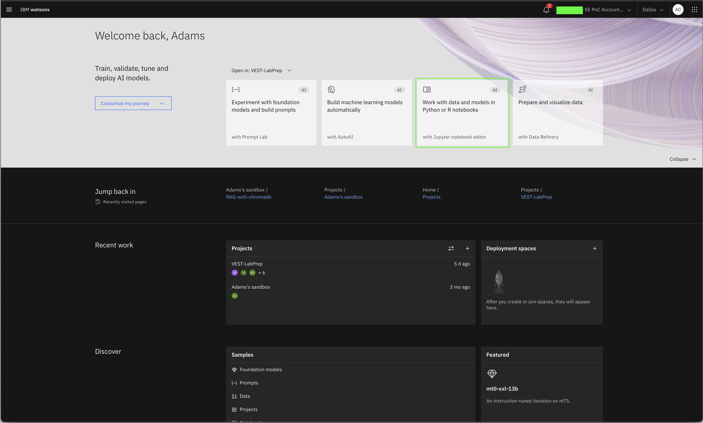

# Referencia: Importación de notebooks en watsonx

## Cómo importar un cuaderno de Jupiter en watsonx utilizando un URL externo

Para empezar a importar este cuaderno de Jupyter de laboratorio en watsonx; puede seguir los pasos siguientes para obtener instrucciones detalladas:

1.  Inicie sesión y navegue hasta el panel de control principal de watsonx dataplatform [aquí](https://dataplatform.cloud.ibm.com/wx/home)

2.  Haga clic en **Trabajar con datos y modelos en cuadernos Python o R **tarjeta/azulejo

    

3.  Una nueva página con un menú modal titulado **Trabajar con datos y modelos en cuadernos Python o R **aparecerá. En este menú, haga clic en **URL **opción en la navegación de la izquierda

4.  En el **Nombre **tipo de campo `{uniqueId}-rag-chromadb`, donde `uniqueId` representa sus iniciales y la ubicación de su taller, tales como: `ao-dallas-rag-chromadb`; también puede añadir una descripción opcional.

5.  Para la **Seleccione la unidad **uso de opciones `Runtime 22.2 on Python 3.10 XXS`, los tiempos de ejecución más grandes utilizan más señales o créditos en la nube.

6.  En el **URL del cuaderno **copia de sección `https://raw.githubusercontent.com/ibm-build-lab/VAD-VAR-Workshop/main/content/Watsonx/WatsonxAI/files/rag-with-chromadb.ipynb` en el campo

7.  Una vez que se hayan rellenado todos los campos necesarios, haga clic en **Crear **. A continuación, se pondrá en marcha en el cuaderno.

    

Después de que el portátil se haya lanzado y creado, puede seguir y ejecutar a través de cada celda del cuaderno para completar el laboratorio. El cuaderno contiene comentarios que explican qué código de cada celda hace, así como cualquier entrada necesaria que es posible que deba proporcionar para poder ejecutar correctamente una célula.

¡Buena suerte!
