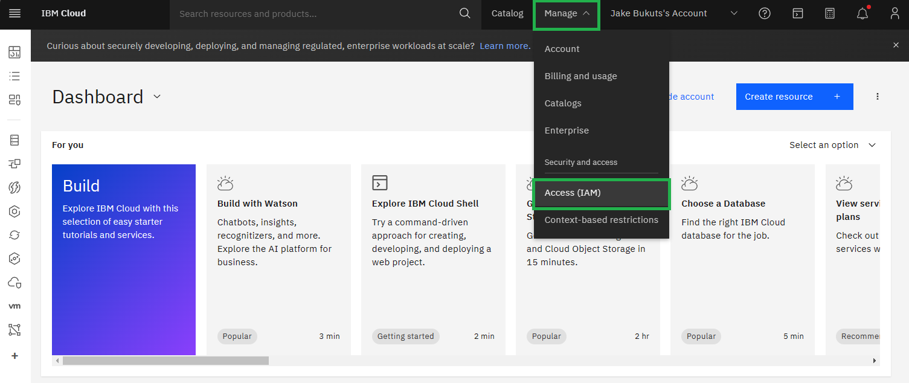
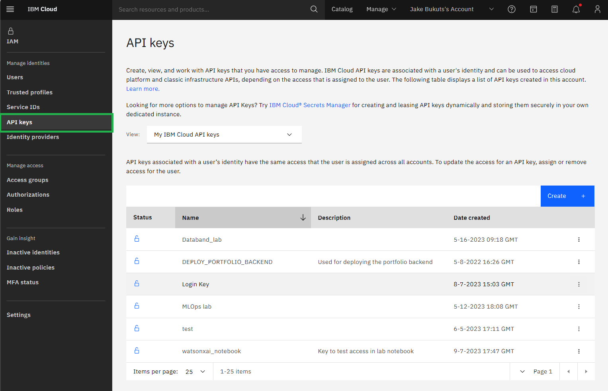
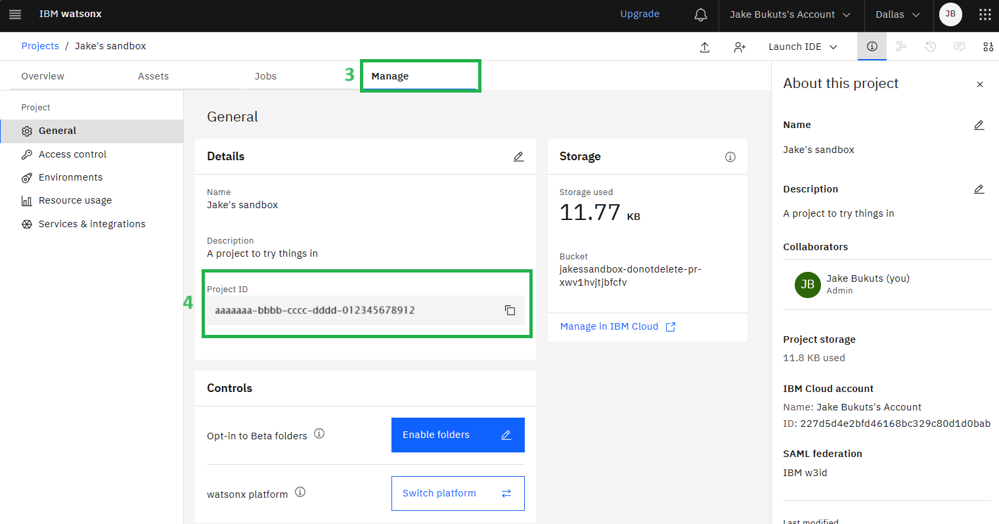
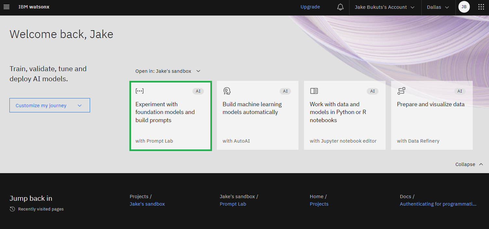
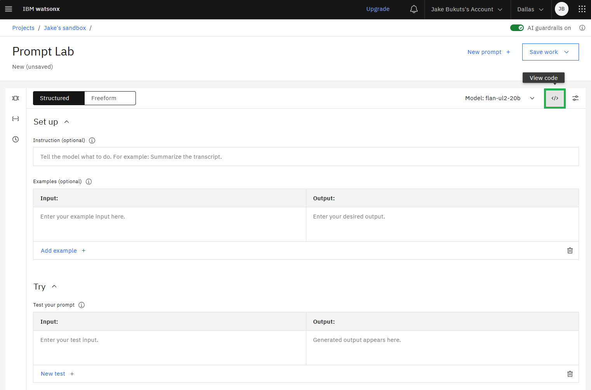
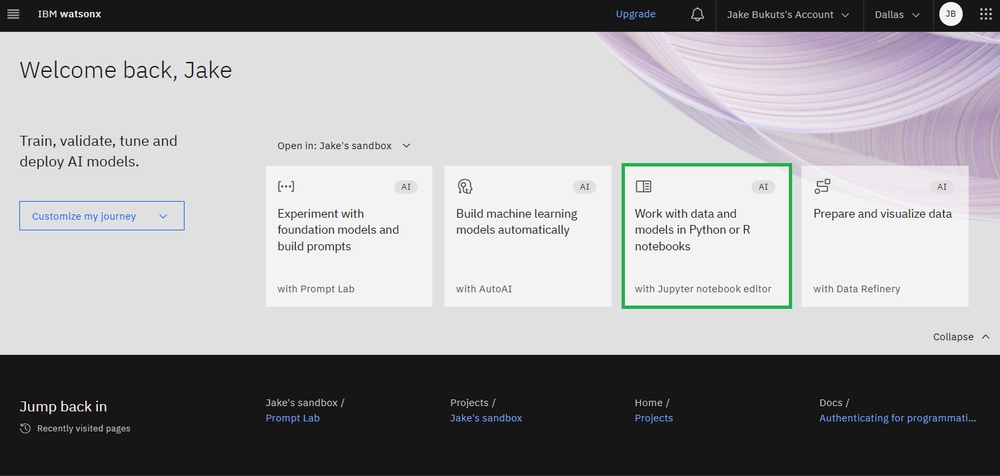
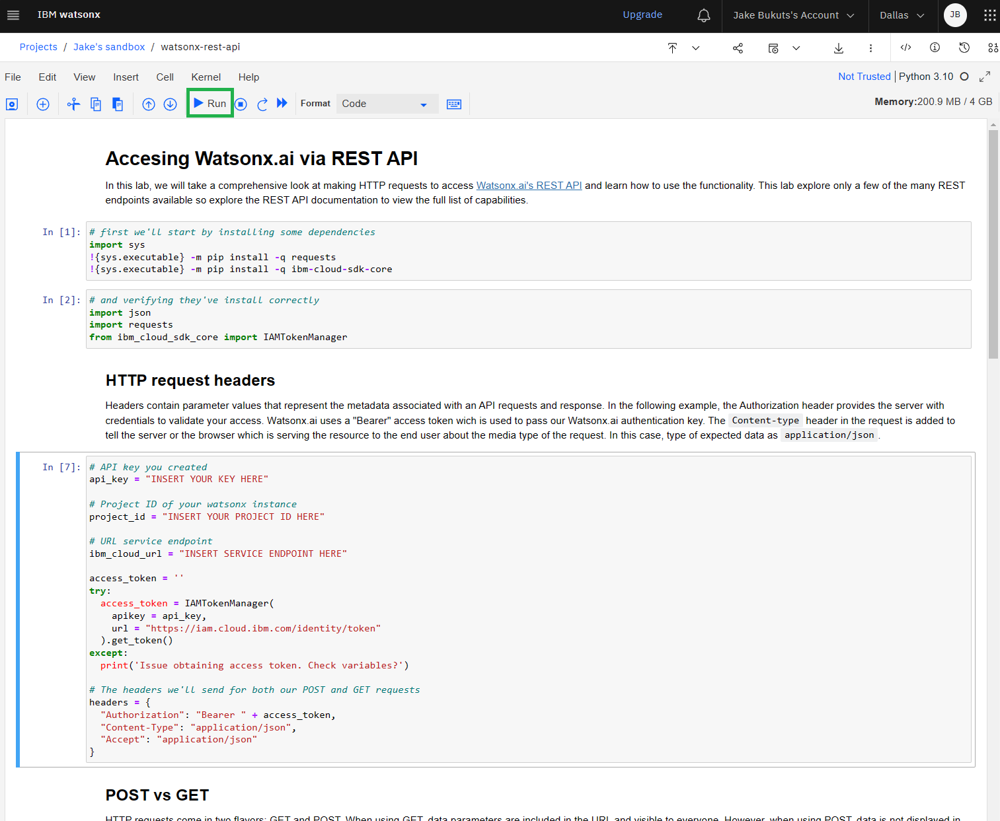

# 1XX: Programmatic Access to watsonx.ai

In this lab we'll explore two ways that we can programmatically access watsonx.ai. We will do this through the use of some open source tools like Python and Jupyter Notebooks.

First though, we'll need to acquire some prerequisites from your IBM Cloud account in order to access the APIs

## Getting prerequisites

### Creating an API Key

In order to authenticate with watsonx externally via an API you will first need to create an API key that's tied to your IBM Cloud Account.

To do this:

1. Start by heading to your [cloud account's dashboard](https://cloud.ibm.com/)
2. Click **Manage** at the top of the page, then **Access (IAM)**

3. In the left-hand navigation menu click **API Keys**

4. A table should appear with a list of your current API keys. Click the **Create +** button on the top-right of the table

5. In the menu that appears given your API key a name and an optional description and click the **Create** button

6. Lastly, A new menu will appear titled **API key successfully created**. Click either the **Copy** or the **Download** button. If clicking copy be sure to immediately store this value in a text file for later use.

With that you have a valid API key.

### Getting your project ID

We now need to find the project ID of your watsonx instance. Start by navigating to the overview page for watsonx [here](https://cloud.ibm.com/watsonx/overview). Once there:

1. Click the **Launch** button inside the **watsonx.ai** card on the page. This will open a new tab.

> This button may instead say **Get started** if you have not yet provisioned a watsonx instance. If that is the case click that button and follow the steps required to provision your instance before continuing.

2. Once in the new tab you should see your project under the **Projects** list in the **Recent work** section. Go ahead and click the relevant project.

3. In the project overview section click the **Manage** tab at the top of the page and choose **General** from the left hand navigation menu.
4. Under the **Details** section there will be a **Project ID** value for you to copy. Copy this value into a text file for later use.

With that you have your Project ID.

### Finding URL endpoint by region

Lastly, you will need the actual URL endpoint that correlates to your instance's region.

As a general rule these are the URLs that correlate with the region seen in the top-right header of the page should be

| Region    | URL                               |
| --------- | --------------------------------- |
| Dallas    | https://us-south.ml.cloud.ibm.com |
| London    | https://eu-gb.ml.cloud.ibm.com    |
| Frankfurt | https://eu-de.ml.cloud.ibm.com    |
| Tokyo     | https://jp-tok.ml.cloud.ibm.com   |

To be safe and get the value:

1. Navigate to the watsonx home page [here](https://dataplatform.cloud.ibm.com/wx/home)
2. Enter the **Prompt Lab** by click the card

3. Once in the prompt lab click the **code \<\/\>** button at the top-right

4. In the code snippet that appears at the right take a note of the highlighted section of the URL after `curl`

Whether you use the table or follow the steps above be sure to copy the value to a safe place for later use.

## Using Jupyter notebooks

Jupyter notebooks are an industry-standard way to work with and visualize data, build models, and more. Now that we have the three values we need as a prerequisite (API key, Project ID, and service endpoint) we can interact with watsonx.ai using one.

### Importing a Notebook into watsonx

To import a notebook into watsonx start by:

1. Navigate to the watsonx home page [here](https://dataplatform.cloud.ibm.com/wx/home)
2. Click the **Work with data and models in Python or R notebooks** card

3. A menu titled **Work with data and models in Python or R notebooks** will appear. In this menu click the **URL** option in the left-hand navigation

4. In the **Name** field type `watsonx-rest-api` and add an optional description

5. For the **Select runtime** option be sure to use `Runtime 22.2 on Python 3.10 XXS`

6. In the **Notebook URL** section copy `https://raw.githubusercontent.com/ibm-build-lab/VAD-VAR-Workshop/main/content/WatsonX/WatsonxAI/files/rest-api.ipynb` into the field

7. Lastly, click the **Create** button. You will then be launched into the notebook.

### Basics of a notebook

After completing the previous steps you should now be viewing the notebook that you just imported. The UI will be split into various cells of both code and text that will be highlighted when you click on them. Depending on what color the cell is highlighted this will determine how you can interact with it:

- **Green**: You are able to edit the selected cell
- **Blue**: You are not in edit mode. _However, double-clicking the cell should change it to green_

When a cell is selected that contains code you can click the **Run** button at the top of the page to actually execute the code contained within the cell. Then, under it, the output of the code will be seen and the next cell will be selected.

Start from the first cell in the notebook and run through each of them in the notebook. The notebook has comments throughout and will explain what the code in each step is doing. Be sure to take the values you saved from the previous section and copy them into the notebook as well when prompted.

