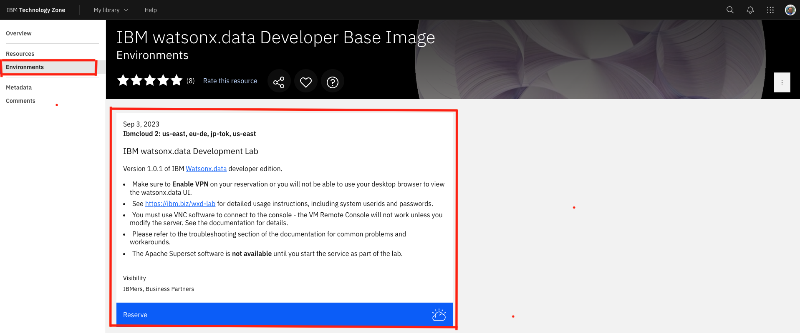
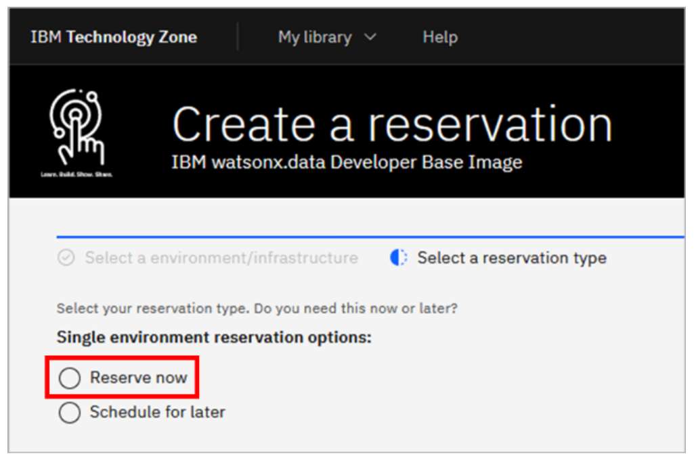
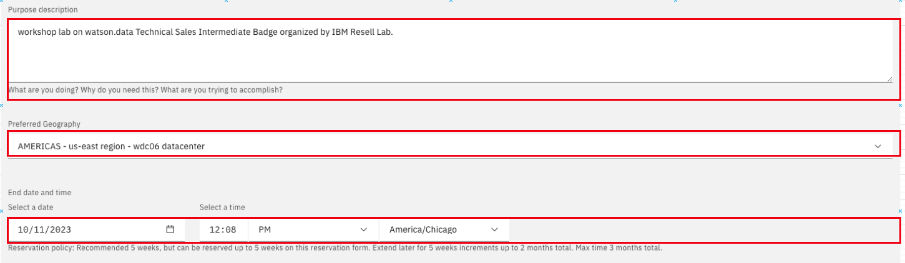
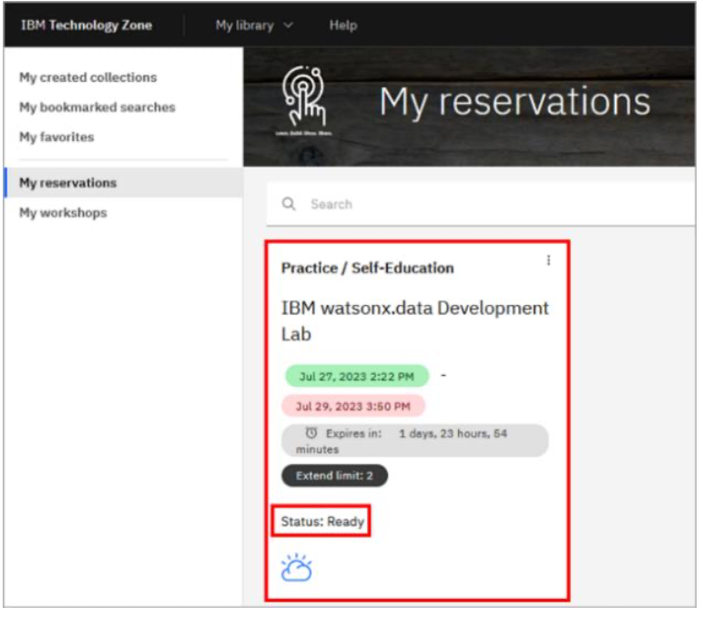
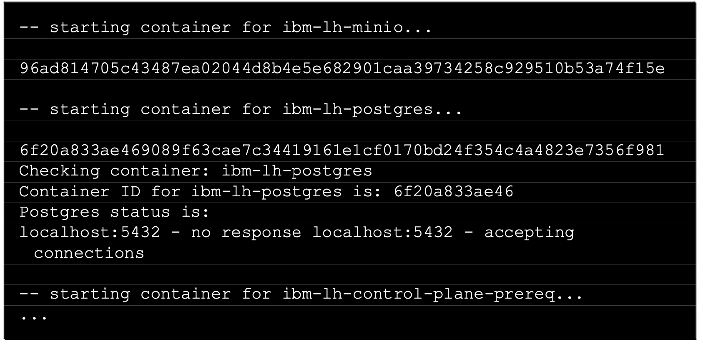

<QuizAlert text='¡Atención! ¡El material del cuestionario se marcará así!' />

## Aprovisionar un entorno watsonx.data desde TechZone

1. Abra la colección de imágenes base de desarrollador de IBM watsonx.data en IBM Technology Zone en: https://techzone.ibm.com/collection/ibm-watsonxdata-developer-base-image. Inicie sesión con su IBMid y acepte los términos y condiciones que se le presenten.

2. Seleccione la pestaña Entornos en el menú del lado izquierdo y haga clic en **IBM watsonx.data Development Lab**

     

3. Para el tipo de reserva, seleccione el botón de opción Reservar ahora.

     

4. Acepte el nombre predeterminado para la reserva o proporcione un nombre de su elección. Para el Propósito de la reserva, seleccione Práctica / Autoformación.

     

5. Complete el cuadro de descripción del Propósito con el motivo por el cual realiza la reserva (por ejemplo, "Taller de laboratorio en watson.data Insignia intermedia de ventas técnicas organizado por IBM Resell Lab"). Luego, desplácese hacia abajo y seleccione su geografía preferida según su ubicación (por ejemplo, AMÉRICA - región este de EE. UU. - centro de datos wdc06). Mantenga la fecha y hora de finalización de la reserva (de forma predeterminada, es dentro de dos días (48 horas); inicialmente no puede exceder los dos días, pero puede extender la reserva dos días, hasta dos veces, antes de que caduque).

     

6. En el panel del lado derecho, siga los enlaces para leer los documentos Términos y condiciones y Políticas de seguridad del usuario final. Luego, seleccione la casilla de verificación para aceptar esos términos. Finalmente, haga clic en Enviar.

     

     Aparecerá brevemente un mensaje en la esquina superior derecha indicando que la reserva ha sido creada. También se le puede presentar la oportunidad de proporcionar comentarios sobre el proceso. No dudes en compartir tus comentarios.

     Poco después, recibirá un correo electrónico de IBM Technology Zone acusando recibo de la solicitud y recibirá otro correo electrónico cuando se complete el aprovisionamiento. El aprovisionamiento puede tardar tan solo 15 minutos o puede tardar una hora o más. Si el aprovisionamiento falla, puede deberse a una falta de recursos en la geografía especificada. Vuelve a intentarlo con la misma geografía o especifica una diferente.

     El estado de la reserva está disponible en https://techzone.ibm.com/my/reservations.

     

     Ahora debe esperar hasta que se haya aprovisionado el entorno antes de pasar a la siguiente sección. Específicamente, puede continuar con la siguiente sección una vez que haya recibido el correo electrónico Reserva lista en IBM Technology Zone de IBM Technology Zone.


## Accediendo al entorno watsonx.data

En esta práctica de laboratorio, interactuará con las interfaces web gráficas (consolas) para watsonx.data, Presto y MinIO Object Store. También ejecutará comandos desde la interfaz de línea de comandos del servidor usando ssh (Secure Shell).

Las URL de la consola y el comando ssh son específicos de su entorno. Se pueden encontrar en los detalles de su reserva de TechZone.

1. Abra el correo electrónico Reserva lista en IBM Technology Zone.
2. Haga clic en el botón Ver mis reservas para ver sus reservas de TechZone (es posible que deba iniciar sesión nuevamente).

     

3. Se abre el mosaico asociado con su reserva y el mosaico debe decir Estado: Listo. Haga clic en este mosaico.

     

4. Desplácese hacia abajo hasta la sección Servicios publicados. Utilizará el comando SSH para el ID de usuario de Watsonx, la consola Presto, la consola MinIO y la interfaz de usuario de Watsonx. Tome nota de estos cuatro datos para poder consultarlos más adelante.

     

## Acceso a la línea de comando

Deberías tener ssh ya instalado en tu computadora (Windows, macOS y Linux). El usuario de Windows puede descargar PuTTY.

Para acceder mediante ssh a su máquina virtual watsonx.data, ejecute el comando ssh proporcionado en los detalles de su reserva (sección de servicios publicados). Será de la siguiente forma:

    ```bash
        ssh -p <port#> watsonx@<hostname>
    ```

    **userid : watsonx**

    **password : (ofrecido durante la sesión)**

La primera vez que ejecute el comando, es posible que reciba un mensaje que indique que no se puede establecer la autenticidad del host. En este caso, responda indicando que desea continuar de todos modos.

Para cambiar a usuario root, puede utilizar el siguiente comando:

    ```bash
        sudo su -
    ```

## watsonx.data Componentes de infraestructura

**Hay cuatro componentes de infraestructura que se pueden configurar en watsonx.data:**

     • Motores: se utiliza un motor de consultas para ejecutar cargas de trabajo con datos en watsonx.data. Watsonx.data admite múltiples motores; Esta práctica de laboratorio utilizará Presto como motor de consultas.

     • Catálogos: los catálogos de metadatos se utilizan para administrar esquemas de tablas y metadatos para los datos que residen en watsonx.data.

     • Depósitos: Watsonx.data almacena datos en un almacenamiento de objetos. Específicamente, los datos se almacenan en depósitos, que son áreas de almacenamiento identificadas dentro del almacenamiento de objetos, similares a las carpetas de archivos. Se admiten AWS Simple Storage Service (S3), IBM Cloud Object Storage (COS) y el almacenamiento de objetos MinIO.

     • Bases de datos: Las bases de datos externas se pueden registrar y utilizar en watsonx.data. Los esquemas y metadatos de los objetos dentro de una base de datos se almacenan en un catálogo watsonx.data.


**Developer Edition viene preconfigurado con los siguientes componentes:**

     • presto-01: este es un motor de consultas de Presto. Se utiliza para interactuar con datos en la casa del lago.

     • iceberg_data: Este es un catálogo de Iceberg, que reside dentro del Hive Metastore (HMS) integrado de watsonx.data. Gestiona tablas que han sido creadas con el formato de tabla abierta Iceberg. Este catálogo está asociado con el depósito de almacenamiento de objetos iceberg-bucket.

     • hive_data: este es un catálogo de Hive, que también reside dentro del HMS integrado. Este catálogo está diseñado para usarse con tablas que no son Iceberg, donde los datos se almacenan en archivos (como Parquet, ORC o CSV), pero no utilizan el formato de tabla Iceberg. Este catálogo está asociado con el depósito de almacenamiento de objetos de hive-bucket.

     • iceberg-bucket: este es un depósito en el almacén de objetos MinIO integrado. Los datos de la tabla almacenados aquí están asociados con el catálogo iceberg_data.

     • hive-bucket: este es un depósito en el almacén de objetos MinIO integrado. Los datos de la tabla almacenados aquí están asociados con el catálogo hive_data.

## Detener e iniciar watsonx.data

En muchos casos, es necesario detener e iniciar el entorno watsonx.data. **Esto es puramente como referencia, así que NO HAGA ESTO AHORA.**

### Deteniendo watsonx.data

1. Abra una sesión SSH y conéctese a la máquina virtual watsonx.data con el ID de usuario de watsonx. Utilice el comando SSH proporcionado en los detalles de su reserva de TechZone, que tiene el siguiente formato:

    ```bash
        ssh -p <port#> watsonx@<hostname>
    ```
2. Cuando se le solicite la contraseña, ingrese **password**.

3. Cambie al usuario root

    ```bash
        sudo su -
    ```
4. Cambie el directorio a los binarios del producto watsonx.data

    ```bash
        cd /root/ibm-lh-dev/bin
    ```
5. Detenga watsonx.data.

    ```bash
        ./stop
    ```
Verá un resultado similar al texto a continuación (este es un extracto y no el resultado completo).

  


6. Verifique el estado de watsonx.data. Si todos los componentes watsonx.data se han detenido, no verá ningún resultado para este comando.


    ```bash
        ./status --all
    ```
### Iniciando watsonx.data

Si actualmente no tiene una terminal abierta como usuario root, siga los pasos 1 a 4 anteriores para hacerlo.

1. Inicie watsonx.data ejecutando los dos comandos siguientes.


    ```bash
        export LH_RUN_MODE=diag
    ```

    ```bash
        ./start
    ```
Los distintos contenedores de componentes tardarán unos minutos en iniciarse. El resultado del comando de inicio debería ser similar al que se muestra a continuación (este es un extracto y no el resultado completo):

  

2. Verifique el estado de watsonx.data:

    ```bash
        ./status --all
    ```
Si watsonx.data se inició correctamente, verá varios contenedores ejecutándose.

  

### Felicitaciones, has llegado al final del laboratorio 101.

Haga clic en [lab 102](/watsonx/watsonxdata/102) para comenzar la siguiente práctica de laboratorio.
