<QuizAlert text='Heads Up! Quiz material will be flagged like this!' />

# Exploring the watsonx.data User Interface

## Starting the watsonx.data User Interface

Administration of the watsonx.data environment is primarily done with the watsonx.data user interface (also known as a console).

1. From your computer, open the watsonx.data console in your browser. The URL can be found in your TechZone reservation details (see the Watsonx UI line in the Published services section)

2. You might receive a warning about a potential security risk. Depends on browser you use, you can proceed to accept the risk. 

3. In the IBM watsonx.data login screen, enter the following credentials and click on Log in button: 

         **Username: ibmlhadmin**

         **Password: password**

   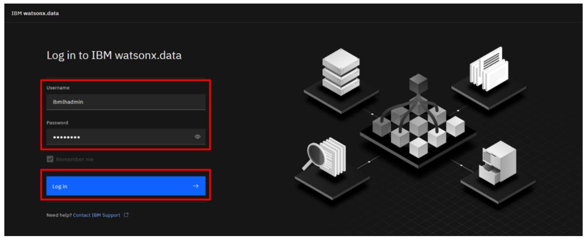

4. You will immediately start in the Home screen for watsonx.data. Scroll down and explore the contents of the page.

   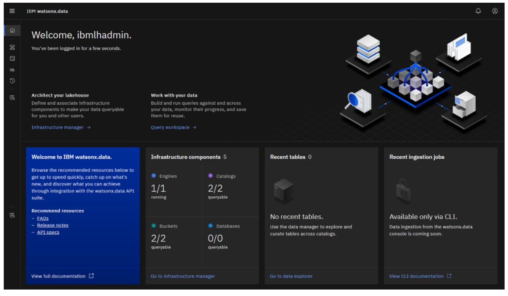

   Included on the page are the following panels from left to right:

         • **Welcome:** Introductory information, including links to documentation

         • **Infrastructure components:** A summary of the engines, catalogs, buckets, and databases that are registered with watsonx.data

         • **Recent tables:** Tables that have recently been explored

         • **Recent ingestion jobs:** Jobs that have recently moved data into watsonx.data

         • **Saved worksheets:** Frequently run queries saved as worksheets, for easier reuse

         • **Recent queries:** Queries that have recently been run or are in the process of being run
  
5. Note the left-side menu. Hover your mouse pointer over the various icons to see what actions or console pages they refer to.

   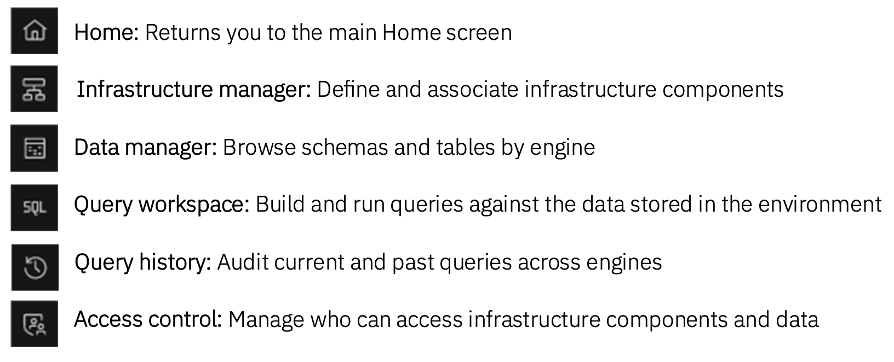

6. Alternatively, click on the hamburger icon in the upper left to expand the left-side menu such that you can see the name beside each icon. To collapse the menu back to the default view, click the X in the upper left.

  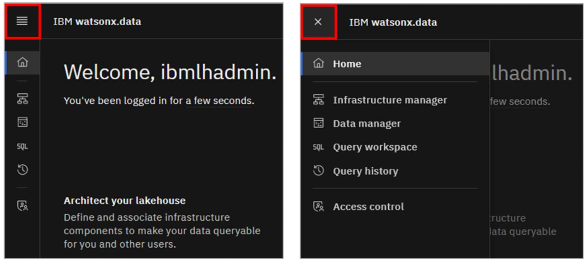

## Infrastructure Manager Page

1. Select the **Infrastructure manager** from the left-side menu.

   The Infrastructure manager page opens with a graphical canvas view of the different infrastructure components currently defined in this watsonx.data environment: Engines (blue layer), Catalogs (purple layer), Buckets (green layer), and Databases (also blue, but not shown).

   > **Note:** Watsonx.data Developer Edition comes pre-configured with a Presto query engine, two catalogs, and two object storage buckets.

   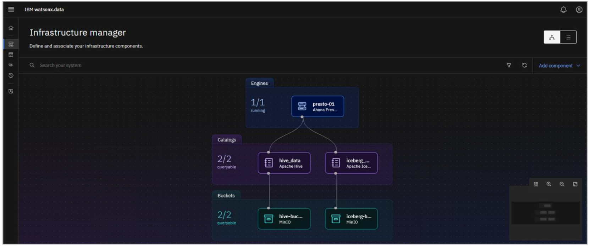

   Each bucket is associated with a catalog (with a 1:1 mapping). When a bucket is added to watsonx.data, a catalog is created for it at the same time, based on input from the user. Likewise, if a database connection is added (for federation purposes), a catalog is created for that database connection as well. Both of these activities will be shown later in the lab.

   Each catalog is then associated with one or more engines. An engine can’t access data in a bucket or a remote database unless the corresponding catalog is associated with the engine.

2. Note the mini-map in the lower left corner. This topology view is rather simple at this point, but as the number of infrastructure components grows, this control       widget gives you a handy way to zoom in and out, auto-arrange the components, or fit the topology diagram to the screen. Try each of the icons to see how they affect the view.

   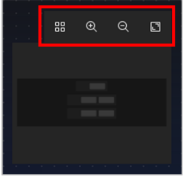

3. Additionally, you can drag and drop the different infrastructure layers across the canvas. Click within the **purple Catalogs area**, hold the mouse button down, and move  the catalogs to a different spot on the canvas.

   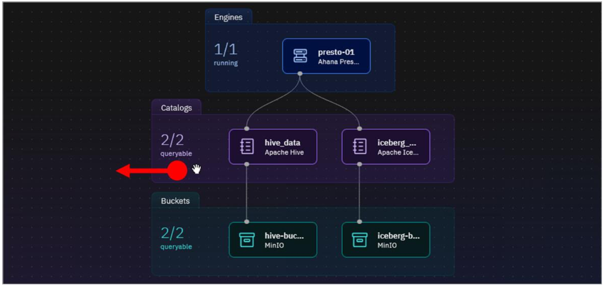

4. Finally, you can pan across the canvas as a whole. Click somewhere in the black background of the canvas, hold the mouse button down, and move your mouse to drag the canvas.

   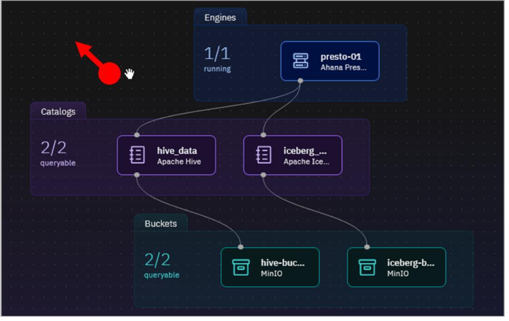

5. In addition to the graphical topology view, infrastructure components can be listed in a table format. Click the **List view** icon in the upper-right to switch to this alternate view.

   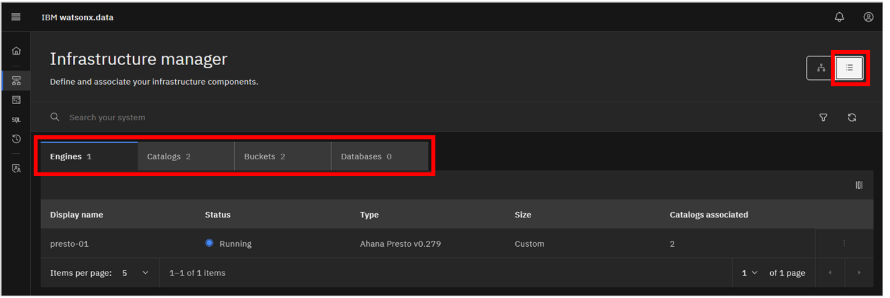

   Tabs exist for each of the Engines, Catalogs, Buckets, and Databases. Explore the different tabs to see what information can be found there.  

6. Click the **Topology view** icon (the icon to the left of the List view icon you just clicked) to switch back to the original graphical view.

   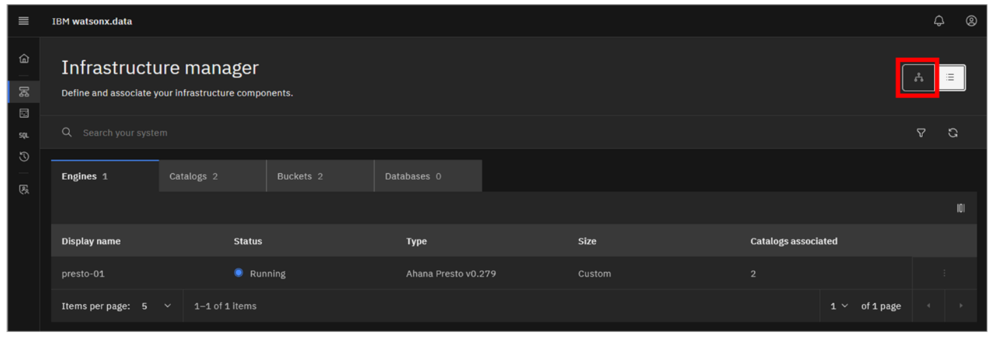

7. You can view details associated with each component. Click the **presto-01** engine tile.

   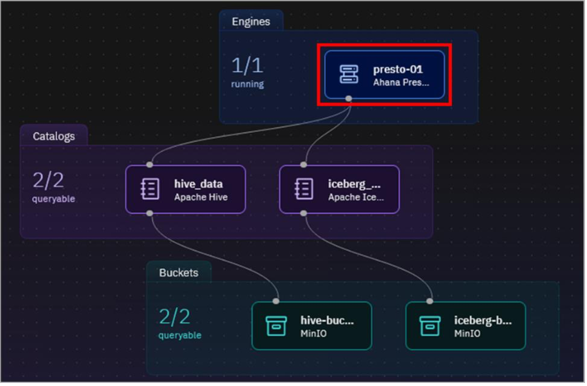

   Details including the Presto software version, the number of coordinator nodes, number of worker nodes, size, and host name are shown.

   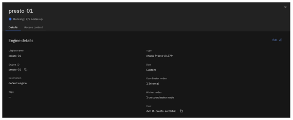

8. Click the X in the upper right corner of the pane to return to the topology view.

9. Repeat the previous two steps for each of the catalogs and buckets, to see what information is available for them.

10. Hover your mouse pointer over the **hive_data** catalog tile – but don’t click on it.

   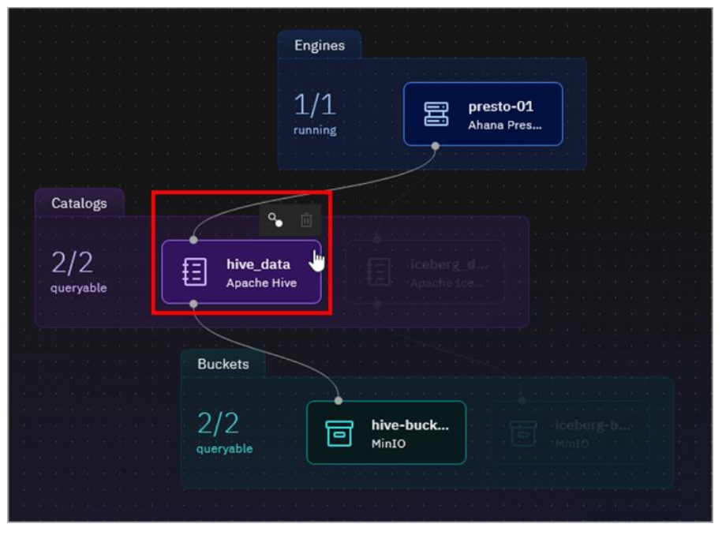

   The catalog tile is highlighted, and icons appear above the tile. In this case there are two icons: **Manage associations** and **Delete**.

11. As the topology gets more complex, it may be difficult to find the components of interest. The console makes this easy by offering a search facility and the ability to filter what is shown (based on component type and/or the state of the component). Click the **Filter** icon to see the filter options available. Click the **Filter** icon again to close the filter options menu.

   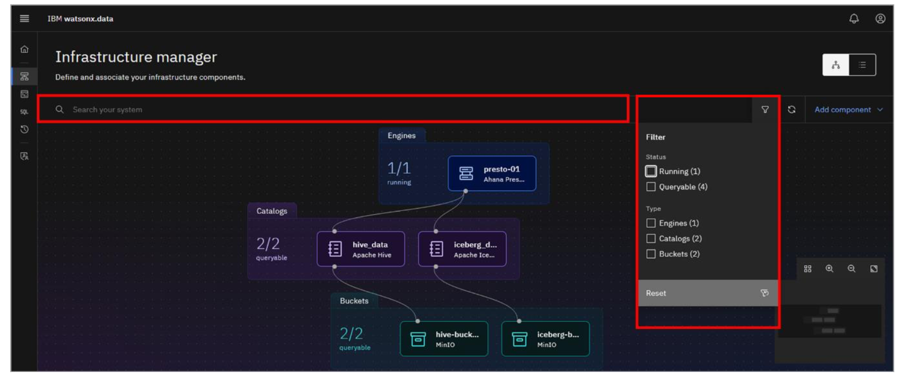


12. Click the Add component dropdown menu.

   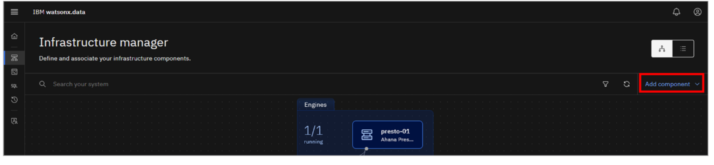

   As this is the Developer Edition of watsonx.data, you are limited in what additional infrastructure components can be modified or added. You are not permitted to add additional engines, but you can add buckets and databases. The act of adding a new bucket or a database connection also adds an associated catalog, and so there is currently no explicit option for adding a catalog.

   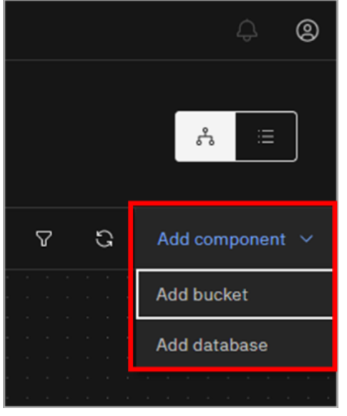


## Data Manager Page

The **Data manager** page can be used to explore and curate your data. It includes a data objects navigation pane on the left side of the page with a navigable hierarchy of **engine > catalog > schema > table**.

In this section you will explore the Data manager page and create your own schema and table.

1. Select the **Data manager** icon from the left-side menu.

   The **Data manager** page opens with a data objects navigation pane on the left side:

   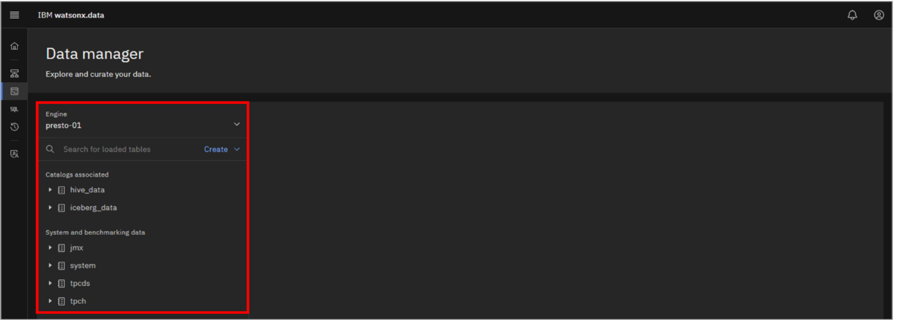

   The top-level navigation point is the query engine. With the engine selected, you can now navigate through the catalogs associated with the selected engine (the catalogs are listed in the **Catalogs associated** section on the left). Currently this includes the two default catalogs, but this is also where you would see any catalogs you explicitly associate with the engine.

2. Expand each of the **hive_data** and **iceberg_data** catalogs by clicking on them.

   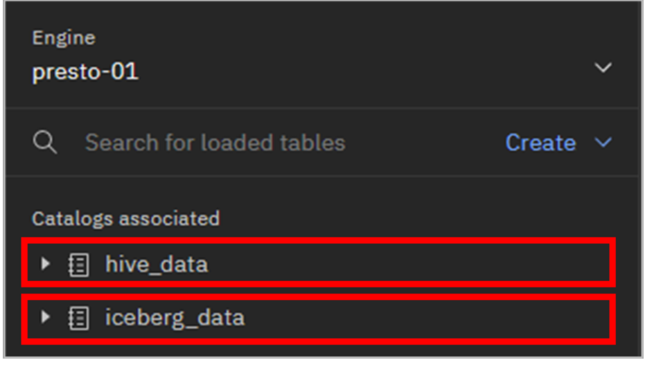

   What do you see in these catalogs? The iceberg_data catalog is empty and the hive_data catalog has some schemas (with tables) in it. These pre-defined catalogs (and any catalogs you create) are empty until you create schemas and tables within them. However, some data has been added to this lab environment to provide you with interesting data to play with. These datasets are specific to this environment and are not included when you install watsonx.data yourself.


   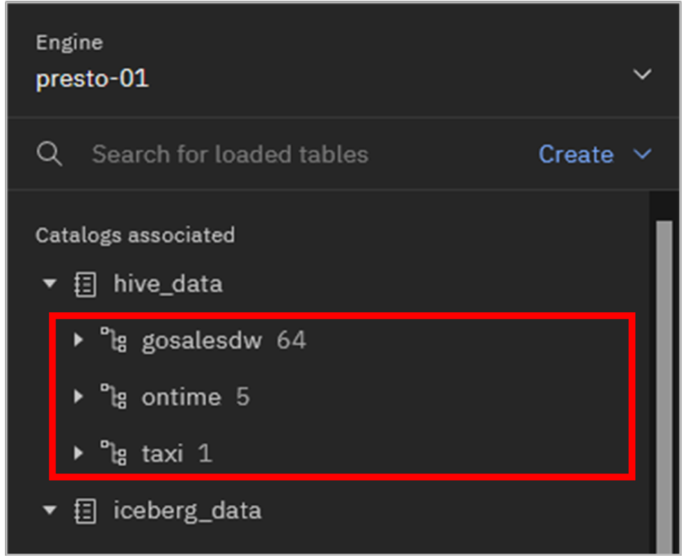

   These three datasets are currently included:

         a. **gosalesdw**: Sales data for the fictional Great Outdoors Company ([description](https://www.ibm.com/docs/en/cognos-analytics/11.0.0?topic=samples-sample-outdoors-company), [schema](https://www.ibm.com/docs/en/cognos-analytics/11.0.0?topic=schemas-warehouse-schema)).

         b. **ontime**: Airline reporting on-time performance dataset ([details](https://dax-cdn.cdn.appdomain.cloud/dax-airline/1.0.1/data-preview/index.html)).

         c. **taxi**: A subset of a Chicago taxi public dataset ([details](https://data.cityofchicago.org/Transportation/Taxi-Trips/wrvz-psew)).


   Additionally, Presto itself (and by extension watsonx.data) includes the TPC-H data set. TPC-H is a decision support benchmark maintained by the Transaction Processing Council (TPC). It is intended to mimic a real-world business workload involving a number of ad-hoc queries running while concurrent modifications are made to the data. The dataset that supports this benchmark includes information on customers, suppliers, orders, part numbers, and more. Datasets of different scale (size) can be generated to test workloads at a different scale.

   The TPC-H sample data (and other sample data) can be found in the **System and benchmarking data** section, which is below the **Catalogs associated** section.
<QuizAlert text="Quiz material: explore all options by expanding other catalogs."/>
3. Expand the **tpch** dataset by clicking on it.

   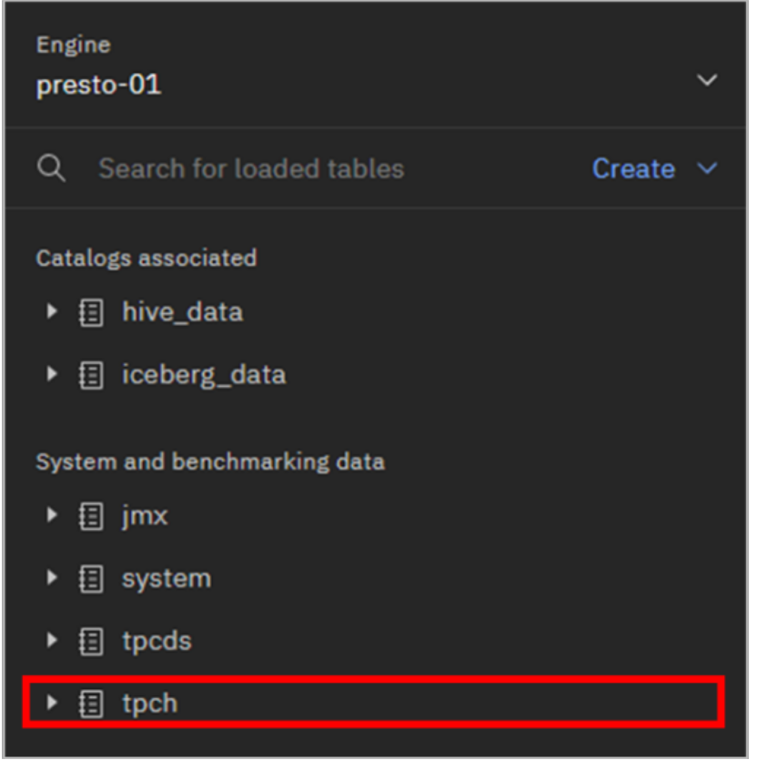

   Once expanded, the next level down is the schema. In the case of the TPC-H (tpch) data, each schema corresponds to a different scale factor of the dataset. The tables in the **sf100000** schema are 10x the size of the tables in the **sf10000** schema, which are 10x the size of the tables in the **sf1000** schema, and so on. The **tiny** schema is the smallest version of the dataset.

4. Expand the **tiny** schema.

   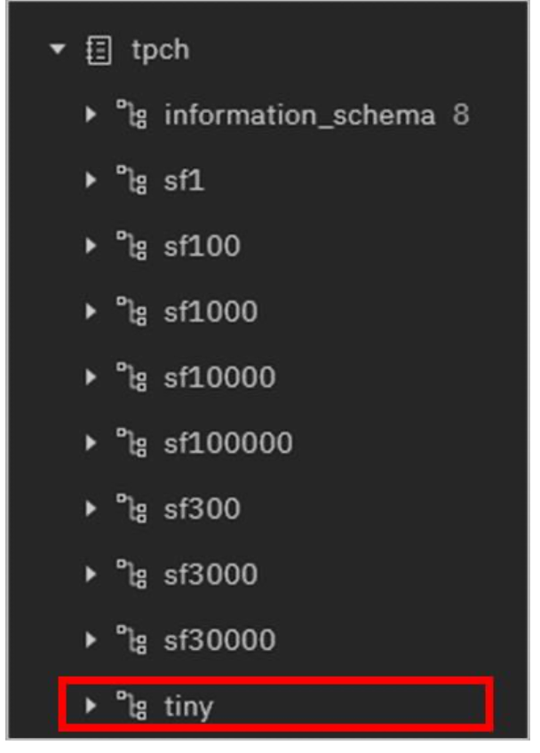

5. Note the tables within this schema. Select the **customer** table. Information about this table is shown in the panel on the right. By default, the **Table schema** (table definition) tab is shown.

   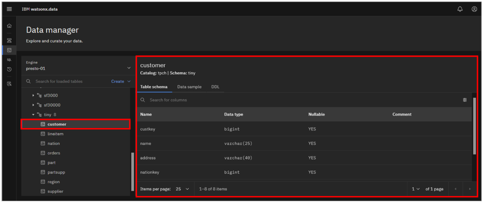

6. Select the **Data sample** tab to see a sample of the data in the customer table.

   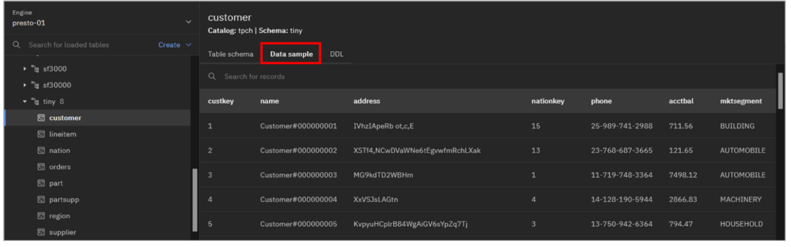

   There are different ways that schemas and tables can be created in Presto. One way is through the use of SQL by running CREATE SCHEMA and CREATE TABLE SQL statements (which could be done in Presto’s command line interface (CLI) or in watsonx.data’s **Query workspace** page). Another approach is to use a third-party database management tool, such as [DBeaver](https://dbeaver.io/).

   You can also use watsonx.data’s **Data manager** page, which allows you to create a schema and upload a data file to define and populate it.

7. Go to the top of the left navigation pane and click the **Create** dropdown menu. Select **Create schema**.

   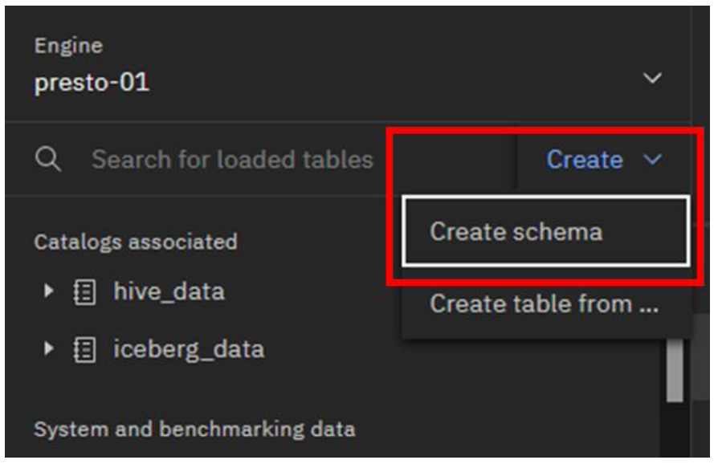

8. In the **Create schema** pop-up window, select/enter the following information, and then click the **Create** button.

         • **Catalog**: iceberg_data

         • **Name**: my_schema

   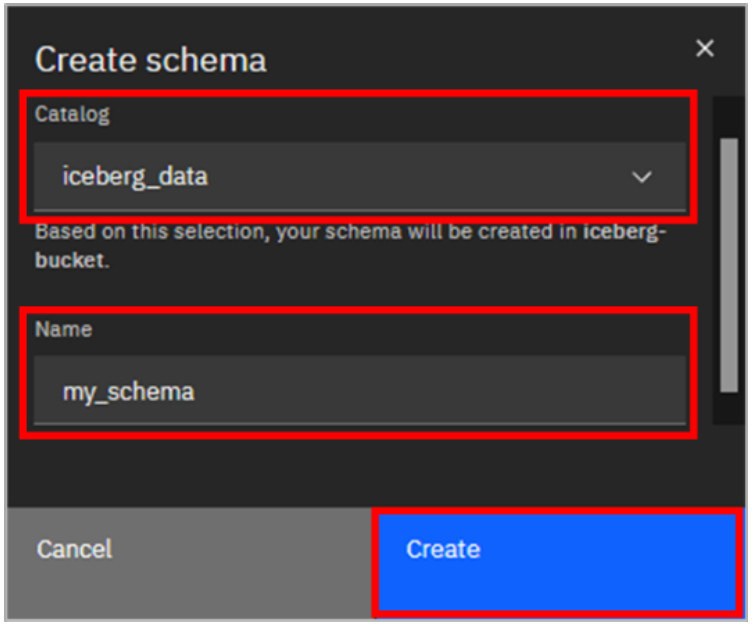

9. Expand the **iceberg_data** catalog. The new schema should be listed (but contains no tables).

   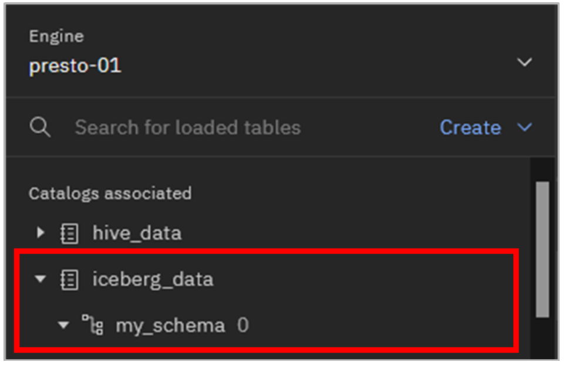

10. Click the **Create** dropdown menu again but this time select **Create table from file**.

   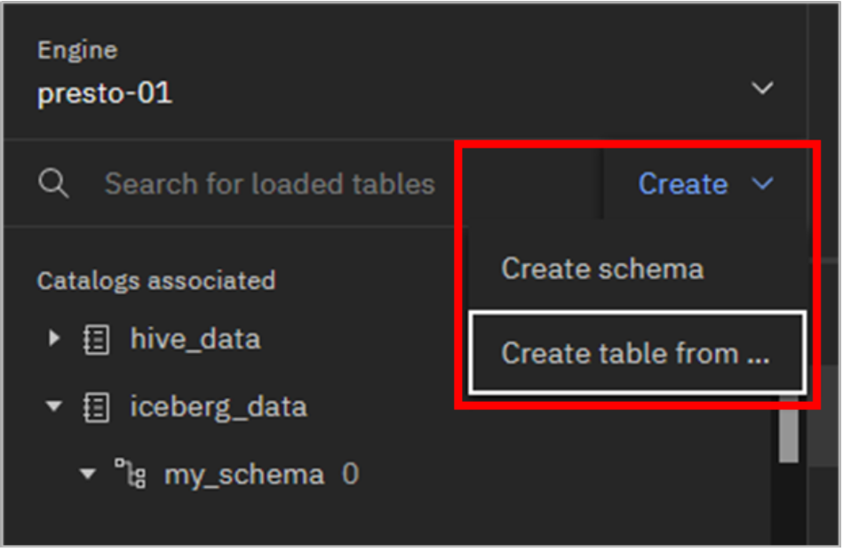

   The **Create table from file** workflow allows you to upload a small (maximum 2 MB file size) .csv, .parquet, .json, or .txt file to define and populate a new table.

11. Download the sample **cars.csv** file to your desktop [link to file](https://raw.githubusercontent.com/ibm-build-lab/VAD-VAR-Workshop/main/content/Watsonx/WatsonxData/files/cars.csv)

12. For the **Source**, click **Drag and drop a file or click to upload**. Locate the **cars.csv** file you downloaded in the previous step and select it for upload (or simply drag and drop the file into this panel).

   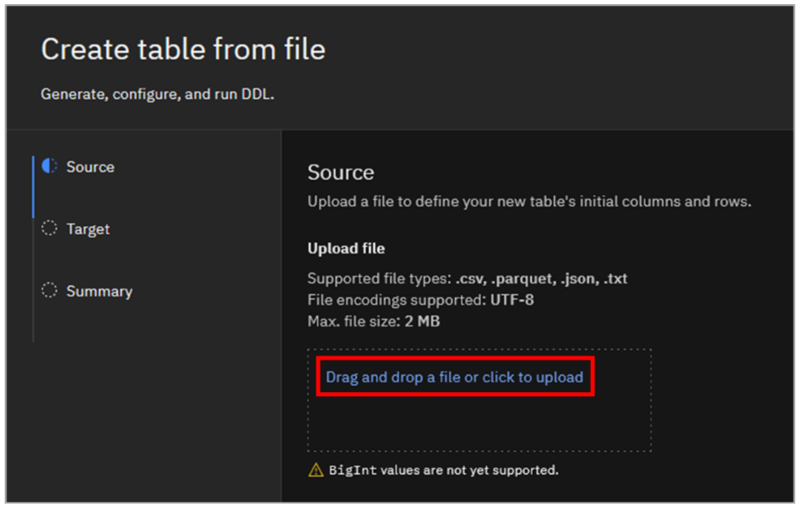

13. Scroll down to view a sample of the data uploaded. The schema of the table is inferred from the data in the file. Click **Next**.

   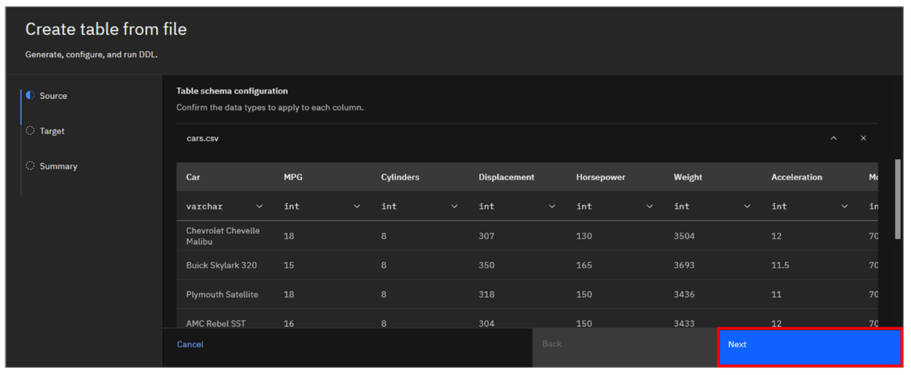

14. For the **Target**, select/enter the following information (some fields are pre-populated and cannot be changed). Once filled in, click **Next**.

         • **Engine**:       presto-01

         • **Catalog**:      iceberg_data  

         • **Schema**:       my_schema

         • **Table name**:   cars

         • **Table format**: Apache Iceberg

         • **Data format**:  Parquet

   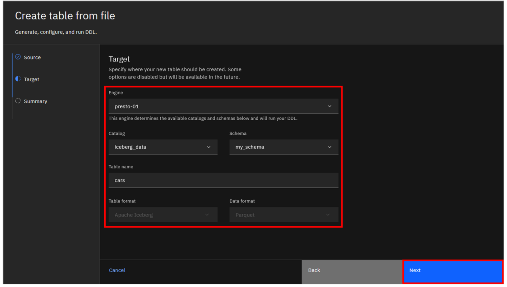

15. Scroll down to review the **Summary**, which includes the Data Definition Language (DDL) that will be used to create the table. You have an opportunity to alter the DDL statement if you wish, but do not change anything for this lab. Click **Create** to create the table.

   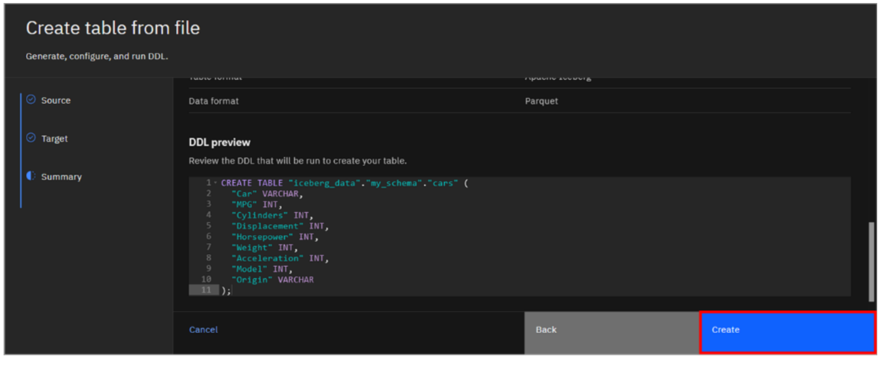

   You may see a pop-up message in the upper-right corner stating that the table is being created and another one after it completes.

   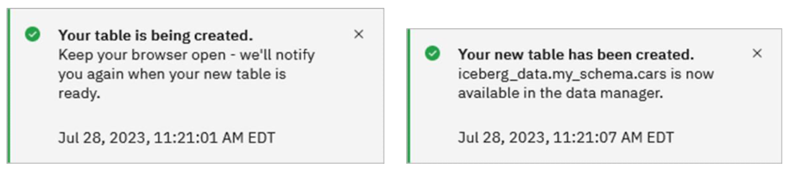

16. Navigate to your new table: **iceberg_data > my_schema > cars**.  

   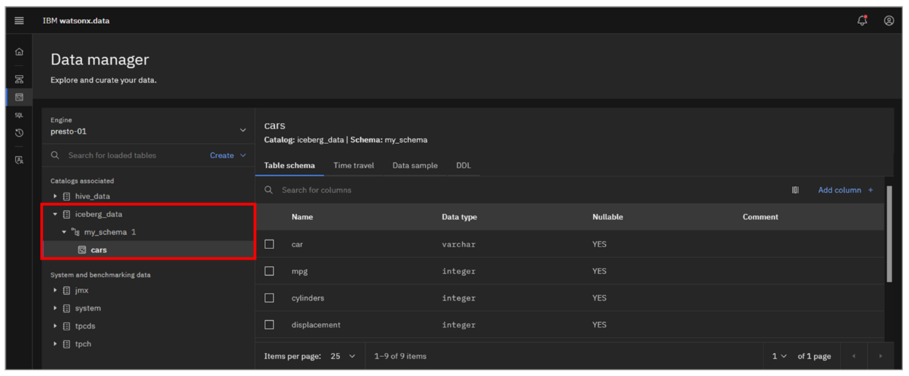

17. Explore the **Table schema**, **Data sample**, and **DDL** tabs. Notice a new tab called **Time travel** that you did not see with the TPC-H dataset earlier. You may view this now, but don’t do anything in there. This topic will be covered later.

18. It is not immediately obvious, but there are additional menu options available for the catalogs, schemas, and tables in the navigation pane. Hover your mouse pointer at the far right of the line for the **cars** table. An **overflow menu** icon (vertical ellipses) appears. Click the **overflow menu** icon to see the option to drop the table (don’t do that now). Click the **overflow menu** icon again to close it.

   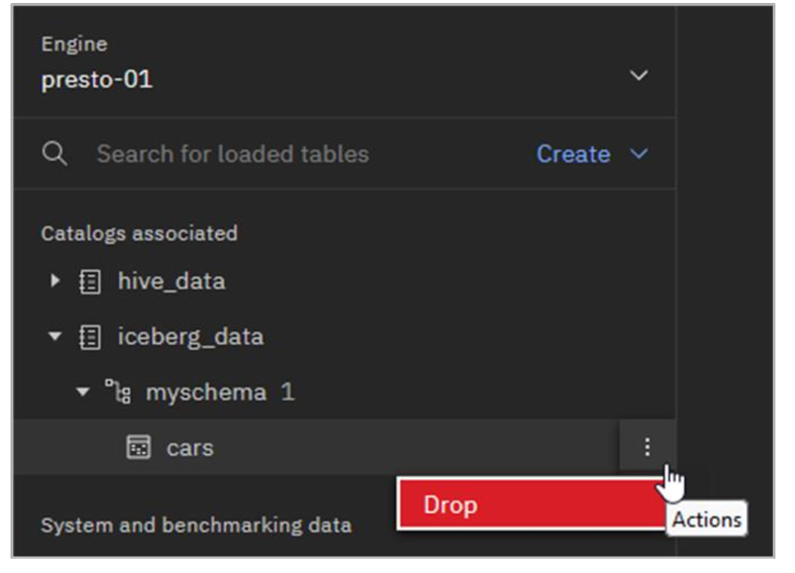


## Query Workspace Page

   Databases and query engines such as Presto have multiple ways that users can interact with the data such as CLI, JDBC. The watsonx.data user interface includes an SQL interface for building and running SQL statements. This is called the **Query workspace**. Users can write or copy in their own SQL statements, or they can use templates to assist in building new SQL statements.

   In addition to one-time execution of SQL statements, SQL statements that need to be run repeatedly can be saved to a worksheet and be run as often as needed later.

1. Select the **Query workspace** icon from the left-side menu.

   The **Query workspace** page opens with a data objects navigation pane on the left side and a
   SQL editor (workspace) pane on the right side.

   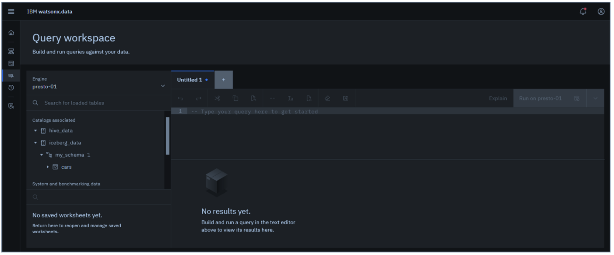

2. Copy and paste the following text into the **SQL worksheet**. Note that the table you are about to query is identified by a 3-part name that includes the catalog, schema,  and table name. Click **Run on presto-01**.

   ```bash
      select car, avg(mpg) as avg_mpg from iceberg_data.my_schema.cars group by car order by car;
   ```
   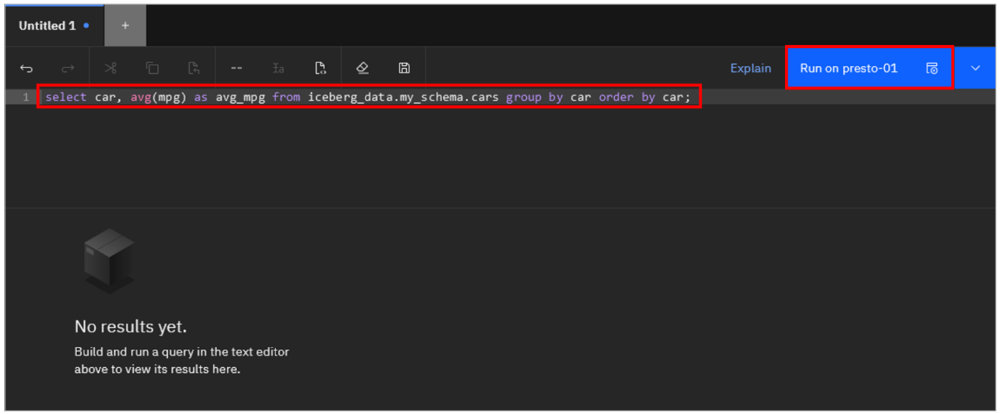

   The query result is displayed at the bottom of the panel.

   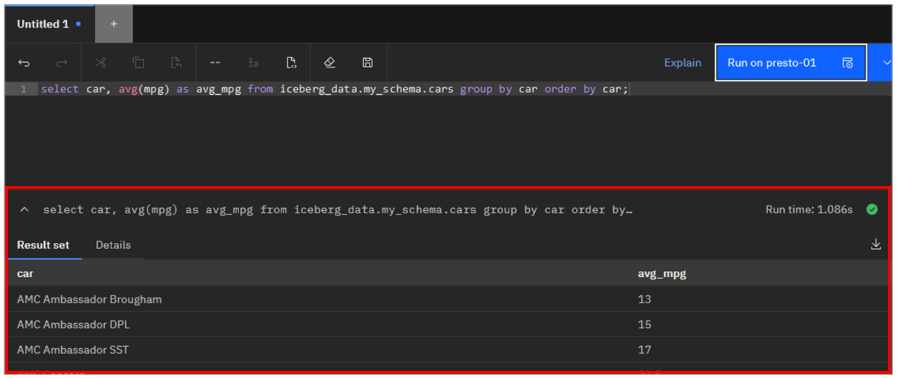
  
   Presto includes an explain facility that shows how Presto breaks up and distributes tasks needed to run a query. A graphical representation of a query’s execution plan – what’s commonly referred to as visual explain – is available from within the Query workspace page. Watsonx.data uses an EXPLAIN SQL statement on the given query to create the corresponding graph, which can be used to analyze and further improve the efficiency of the query.

3. Click the **Explain** button.

   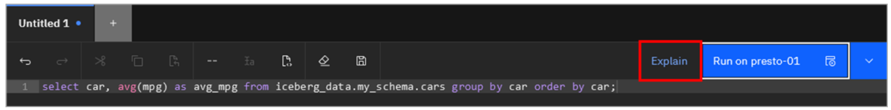

   This shows a graphical representation of the query’s execution plan. For this example, the query execution plan is relatively simple. Feel free to zoom in and explore the different elements of it. Clicking on a particular stage may show additional information in the pane on the right.

   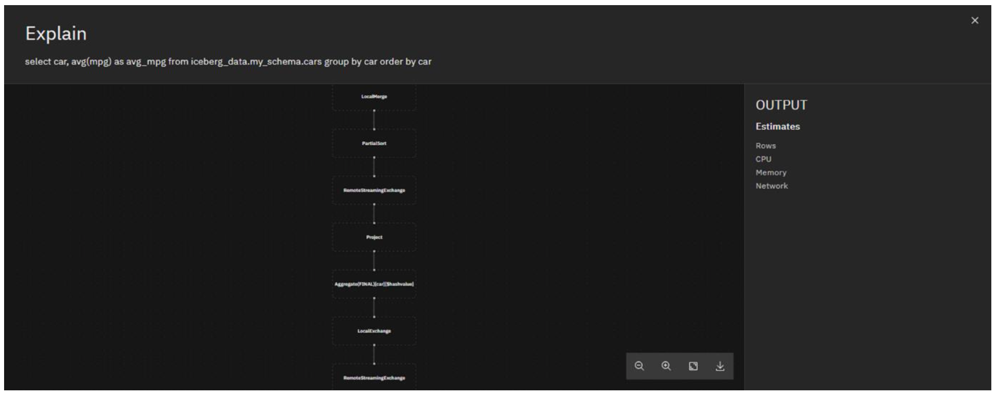

4. Click the **X** in the upper-right corner of the **Explain** window to close it.

   Let’s assume this is a query you will want to run time and time again in the future. To do this, you can save it as a worksheet. While this example just has a single SQL statement, imagine a scenario where you have multiple statements in the workspace editor and in a worksheet.

5. Click the **Save** icon (looks like a disk) in the editor menu above the SQL statement.

   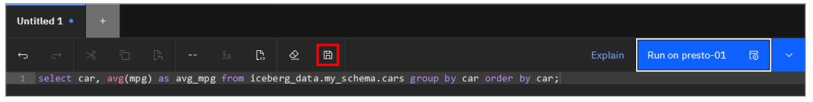

6. In the **Save worksheet** pop-up window, enter **Cars MPG** for the **Name** and then click **Save**.

   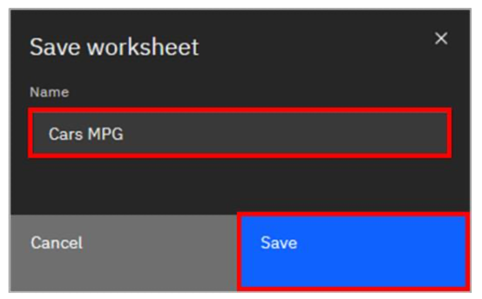

   The worksheet is now displayed at the bottom of the left-side navigation pane.

   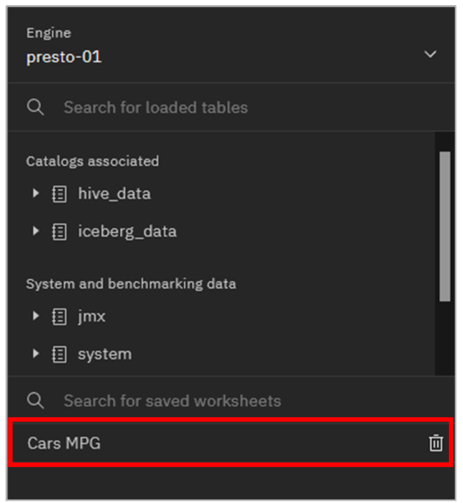

   Any worksheet can be deleted at any time by clicking on the **Delete** icon (looks like a garbage can) to the right of the worksheet name.

7. Click the **+ (New worksheet)** icon at the top of the current worksheet to create a new, empty worksheet.

   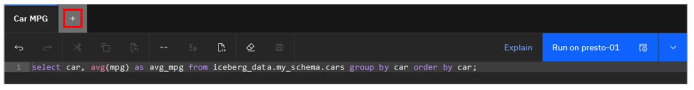

8. Click the **X** in the **Car MPG** tab to close that worksheet. If asked to confirm closing, click **Close**.

   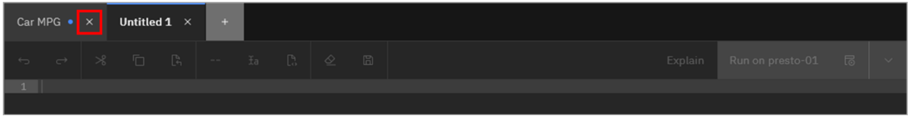

   In addition to writing queries from scratch or copying and pasting queries from elsewhere, the Query workspace interface can also assist in generating SQL for tables that are in watsonx.data. Let’s see what options are available here.

9. On the left-side navigation pane, hover your mouse pointer at the far right of the line for the **iceberg_data** catalog until the **Query templates** icon appears. When you see this icon, click it.

   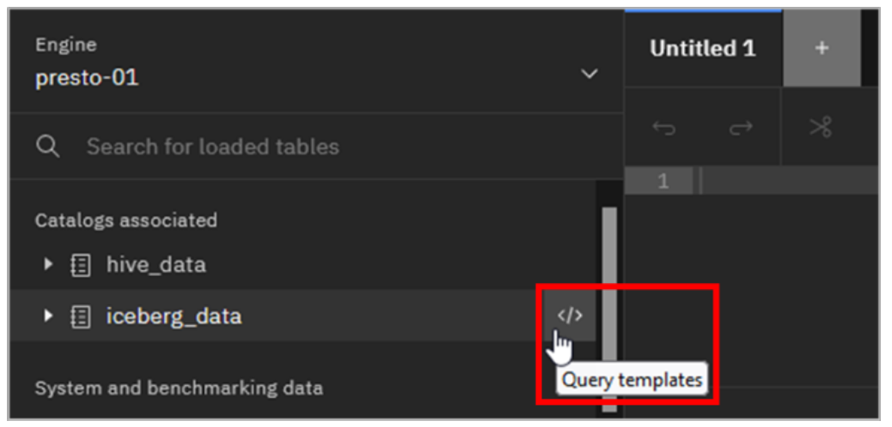

10. The only template for catalogs and schemas is **Generate path**. Click **Generate path**.

   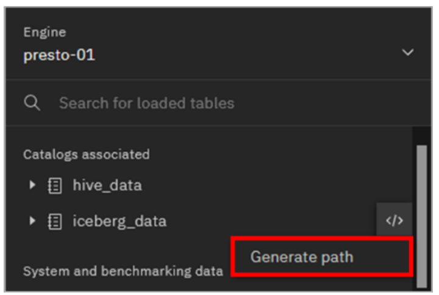

   Notice how the name of the catalog was entered into the worksheet. The same thing can be done for schemas, and for schemas the text that gets entered into the worksheet is in the form of “catalog”.”schema”.

   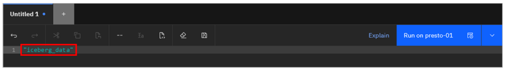

11. Click the **Clear** icon (looks like an eraser) in the menu above the SQL statement. This clears the text that was previously entered.

   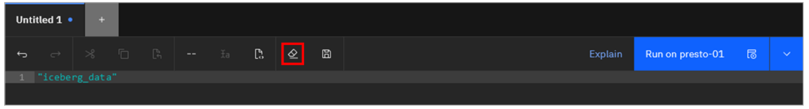

12. Navigate to **iceberg_data > my_schema > cars**. Hover your mouse pointer at the far right of the line for the **cars** table until you see the **Query templates** icon appear. When you see this icon, click it.

   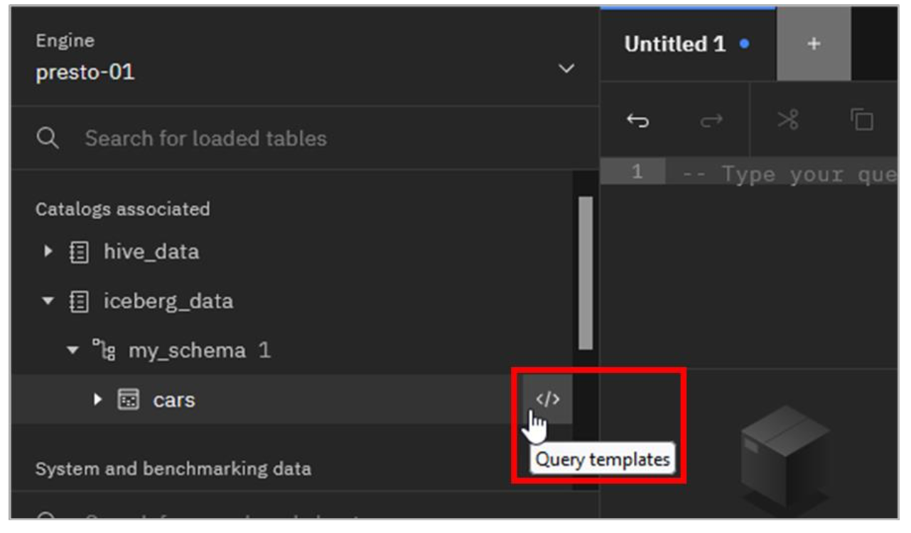

13. As you can see, more templates are available when working with tables than what you saw with the catalog:

   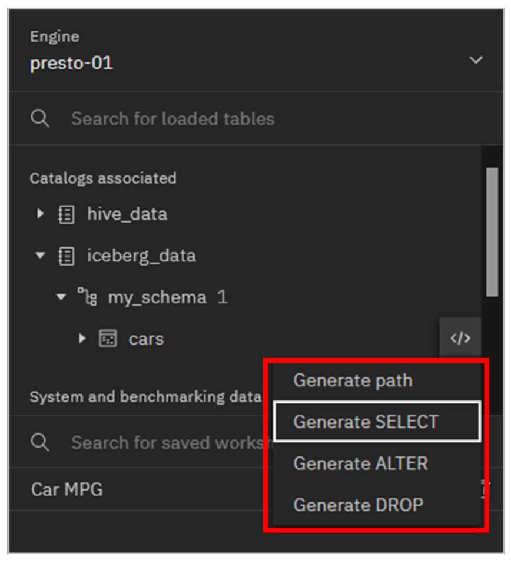

   Selecting **Generate path** generates the table name, as a 3-part name: “catalog”.”schema”.”table”. The other three options can be used to generate SELECT, ALTER, and DROP SQL statements.

14. Click **Generate SELECT**.

15. A basic SELECT statement querying from the cars table is entered into the worksheet. This default statement returns 10 rows of the table including all columns. Click **Run on presto-01**.

   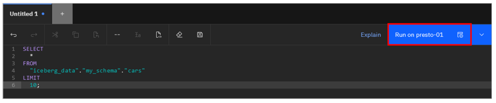

   As before, the result of the query is shown at the bottom of the screen.

   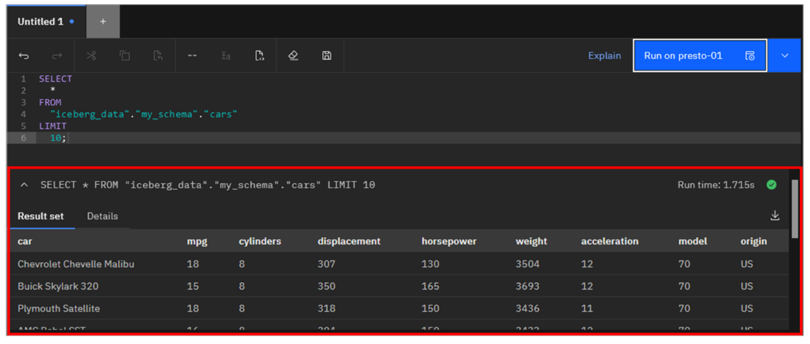

## Query History Page

   The **Query history** page lets you audit currently running queries and queries that ran in the past, across all the engines defined in the environment. This includes queries that users have explicitly run, as well as queries used in the internal management and function of the environment.

1. Select the **Query history** icon from the left-side menu.

   > **Note:** What you see in your list of queries will not match the screenshots shown here.

   The **Query history** page opens with a list of queries currently running and that ran in the past. If the list appears short or not current, click the **Refresh** icon in the upper-right.

   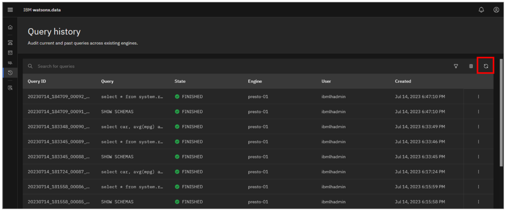

   Included (at the top) is a search bar to find specific queries of interest. The list can also be filtered by the state of the query (for example, FAILED, FINISHED, and RUNNING), the engine that ran the query, and the user that submitted the query. Information including the query text, state, and when the query was run is shown, but you can customize the columns to show more or less information.

2. Click the **Filter** icon on the right (looks like a funnel). Note the filters available. Click the **Filter** icon again to close it.

   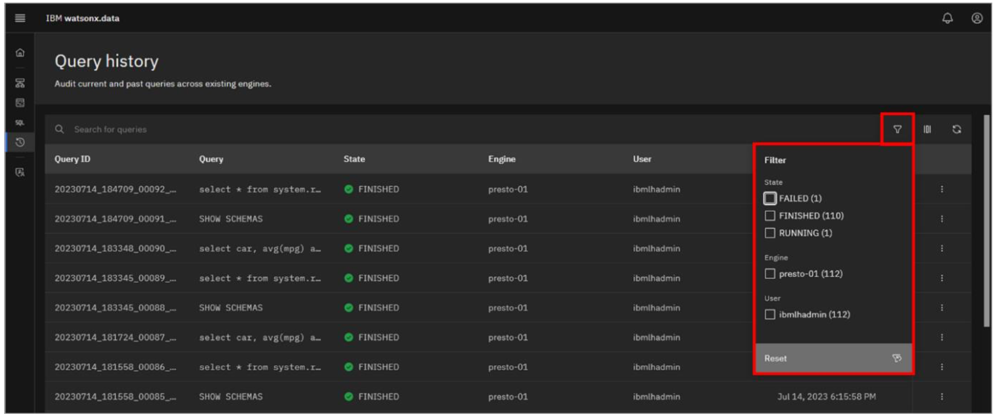

3. Click the **Customize columns** icon (looks like a series of vertical lines; it’s to the right of the **Filter** icon). Note the columns available to display. Click the **Customize columns** icon again to close it.

   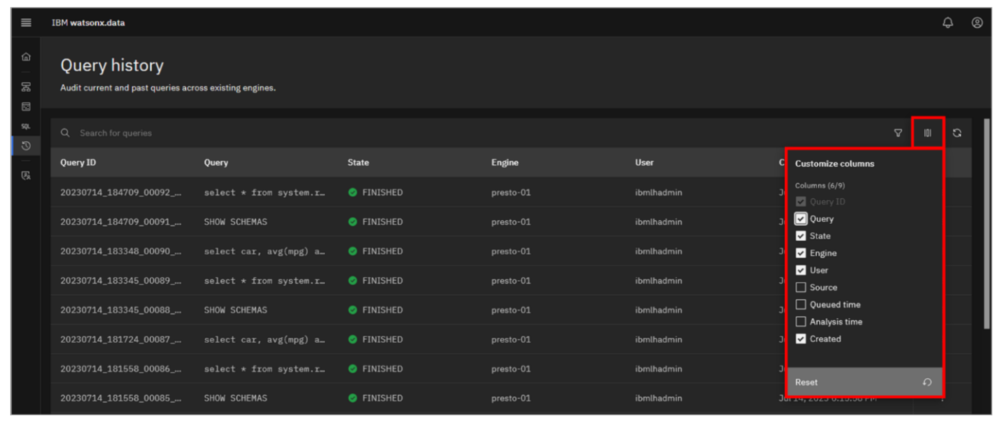

4. Click the **overflow menu** icon (vertical ellipses) at the end of the row for any queries listed. Note the options available. You can view the explain plan for the query and you can bring up the query in the Query workspace. Click the **overflow menu** icon again to close the list.

   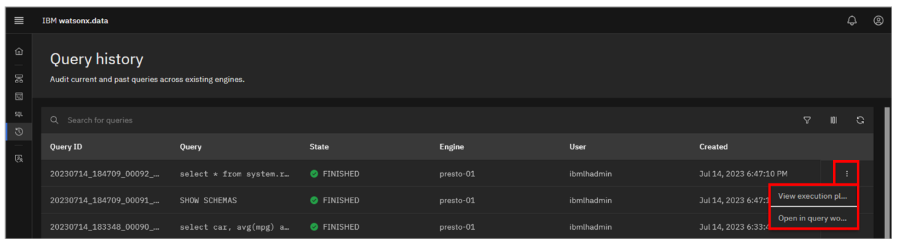

## Access Control Page

   The **Access control** page is used to manage infrastructure access and data access policies.

   Security and access control within watsonx.data are based on roles. A role is a set of privileges that control the actions that users can perform. Authorization is granted by assigning a specific role to a user, or by adding the user to a group that has been assigned one or more roles.

   Access to the data itself is managed through data control policies. Policies can be created to permit or deny access to schemas, tables, and columns.

   In this section you will add a new user and provide them with privileges over the infrastructure and data. Note that it’s not the intention of this lab’s instructions to show the results of these privileges (you will not be logging in with other users), the intention is to highlight the process of how you would assign these privileges in the first place.

1. Open a terminal command window to the watsonx.data server as the root user (remember to use the sudo command to become the **root** user, or you will receive a permission denied error when running the command in the next step). 


2. Run the following command to create a non-administrator user (**User** type) with the username **user1** and password **password1**.

   ```bash
   /root/ibm-lh-dev/bin/user-mgmt add-user user1 User password1
   ```
3. In the watsonx.data user interface running in your browser, click the **Access control** icon from the left-side menu.

   The Access control page opens in the Infrastructure tab, with the currently defined engines (1), catalogs (2), and buckets (2) listed (when you add databases, they will be listed here as well).

4. Click on **presto-01** (it will turn into a hyperlink when you hover over it).

   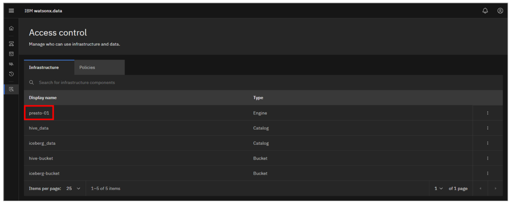

5. Select the **Access control** tab.

   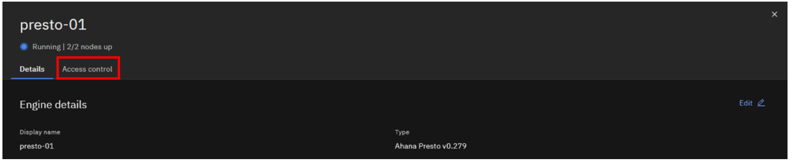

6. Click the blue **Add users** button on the right.

   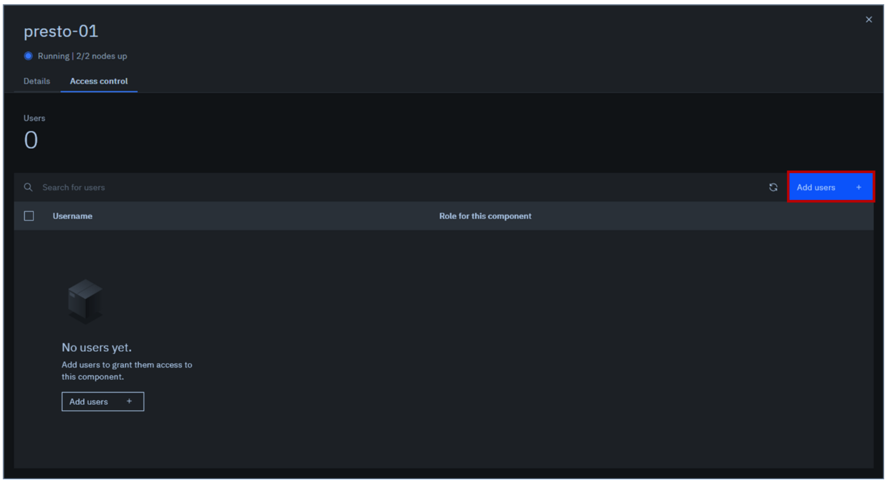

7. The **Add users** pop-up window is displayed. For **Username**, select **user1**. For **Role**, select **User**. Click **Add**.  

   > **Note:** If user1 isn’t listed then cancel the operation, refresh your browser tab and repeat the steps.

   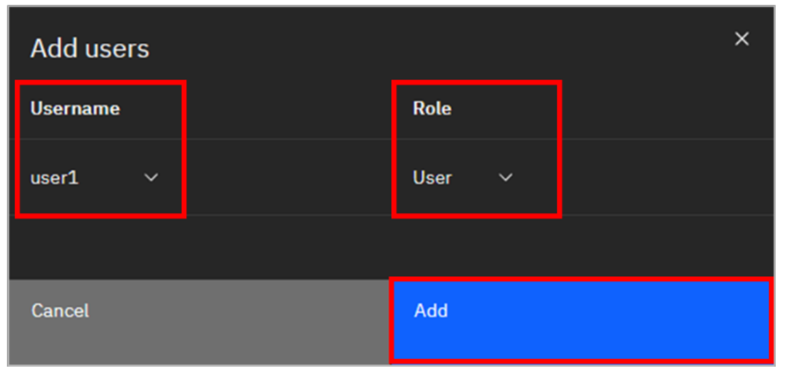

8. Note how the user’s role has been added. Click the **X** in the upper-right corner to close the access controls for the Presto engine.

   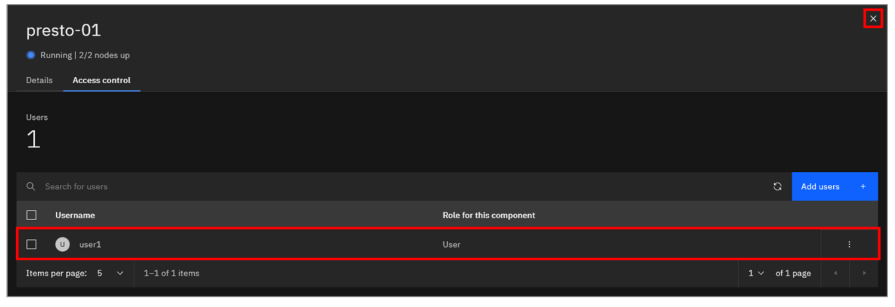

   You can follow the below steps to assign the following permissions:
   
   • iceberg_data (Catalog): User
   
   • iceberg-bucket (Bucket): Reader

   Additionally, a policy has to be created to permit the user to access the table in question.

9. Select the **Policies** tab.

   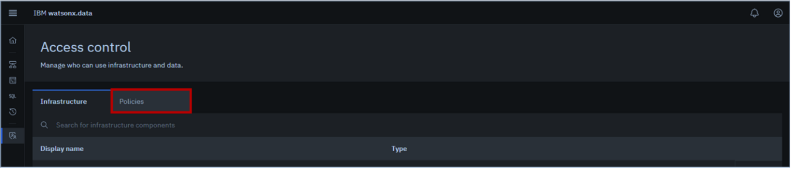

10. Click **Add policy** on the right.

   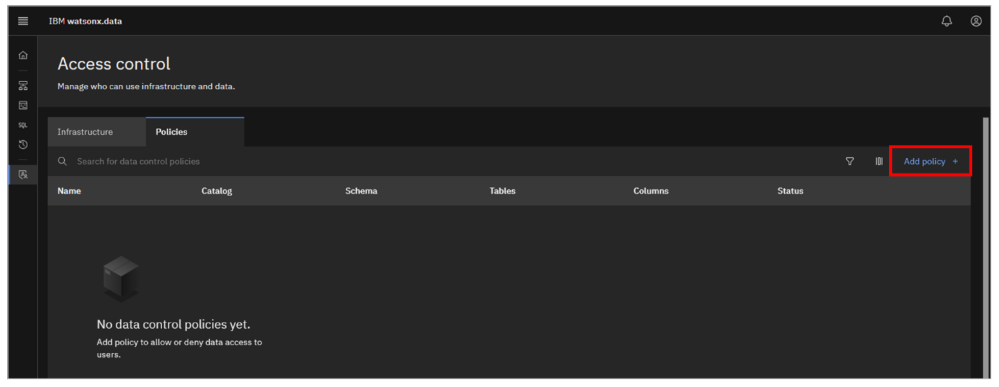

12. Enter **selectcars** in the **Type policy name** field, select **Active** for **Policy status after creation**, and then click **Next**.

   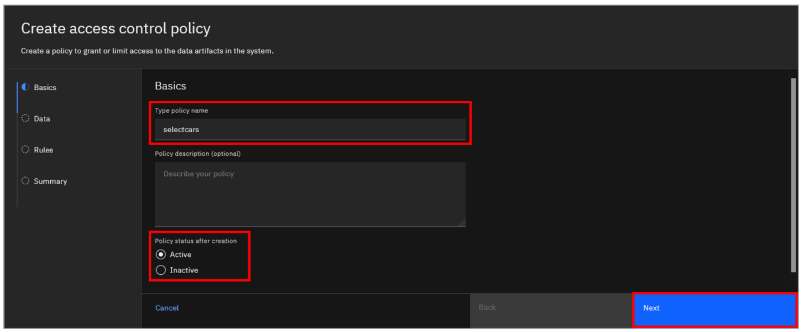

12. Click on the Choose a catalog to get started dropdown and select **iceberg_data**. A list of schemas is then displayed.  

         a. Select the checkbox for the **myschema** schema.

         b. A list of the tables in the schema is then displayed; select the checkbox for the **cars** table.
         
         c. A list of the columns in the table is then displayed; select the checkbox for all columns, which selects **all** columns.
         
         d. Click **Next**.

   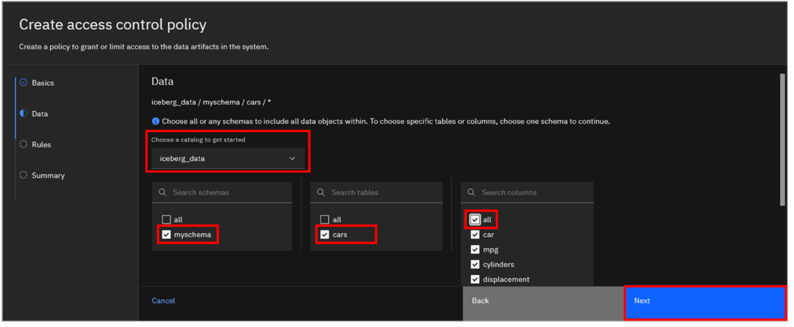

13. One or more rules can now be added to the policy. Click **Add rule** on the right.   

   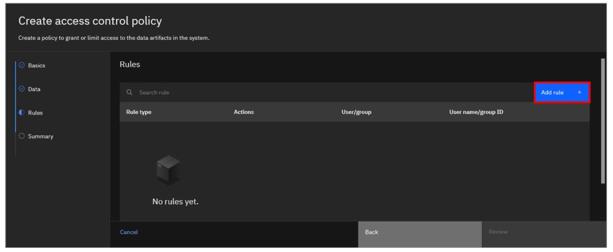

14. Make the following selections and then click the **Add** button:  

         a. For the Rule type, select **Allow**.
         
         b. For **Actions**, select the **select** checkbox.

         c. For **Users/group**, select **Users**.

         d. In the Select user dropdown, select **user1**.

   

15. With the rule added to the policy, click **Review**.

   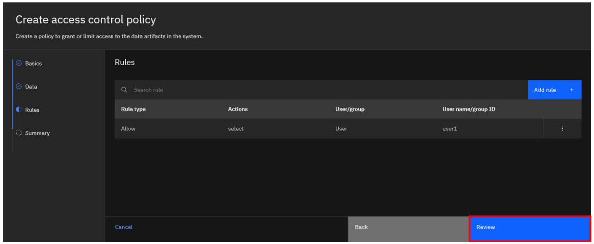

16. Review the policy details you’ve entered and click **Save**.

   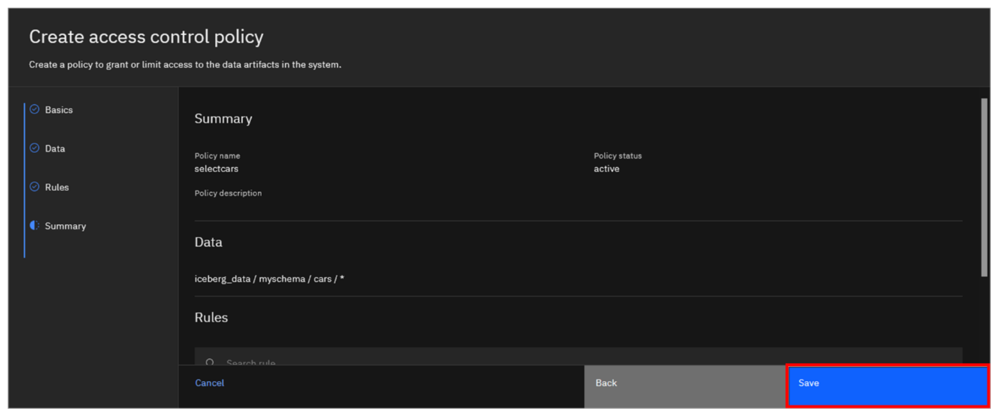

   The policy should now be listed. Because you specified for the policy to be active upon creation, it is in fact active (as you can see by looking at the **Status** column).

   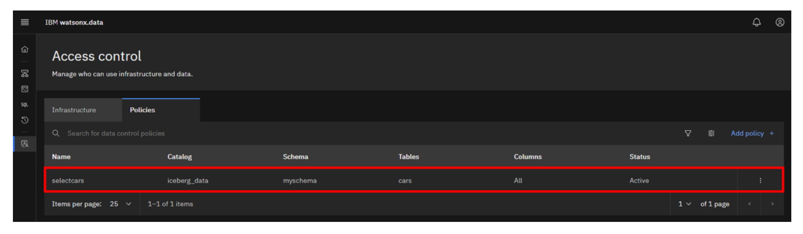

   You have just given **user1** the permissions needed to query the data within the cars table. 

### Congratulations, you've reached the end of lab 102.

Click, [lab 103](/watsonx/watsonxdata/103) to start next lab.
