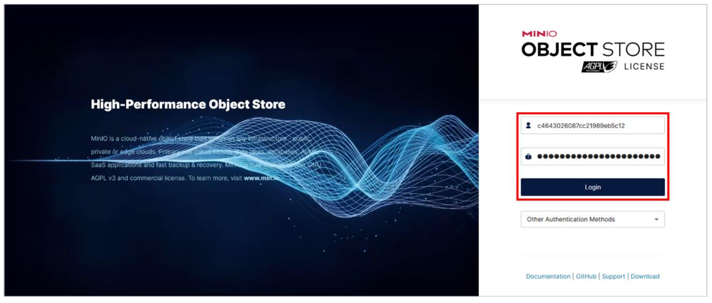
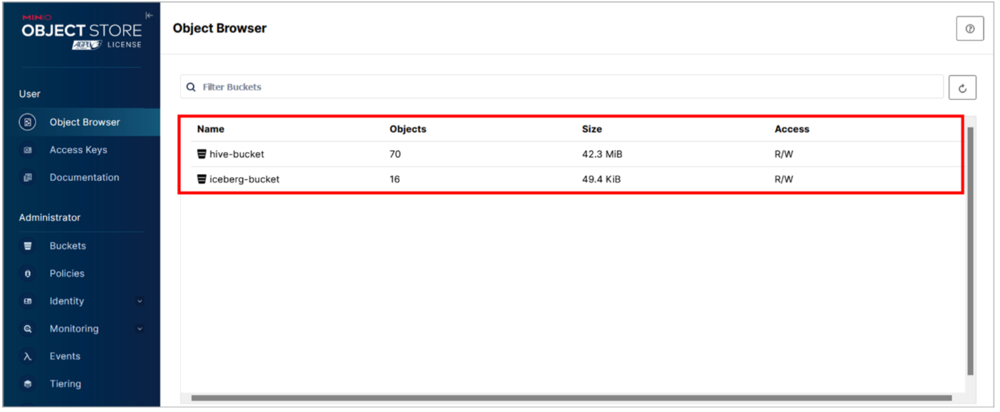
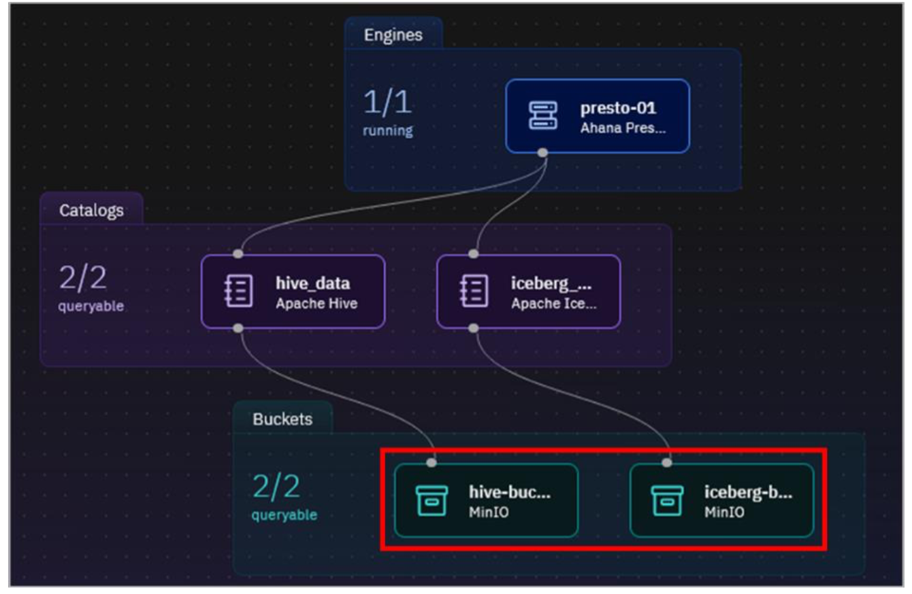
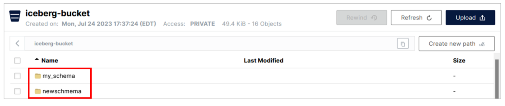
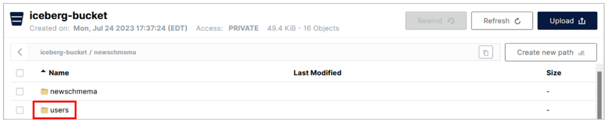
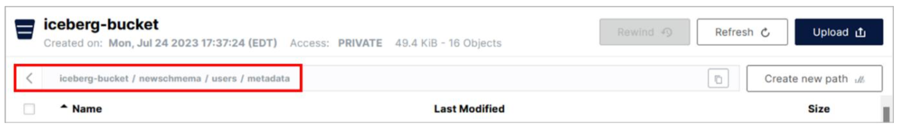

<QuizAlert text="¡Atención! ¡El material del cuestionario se marcará así!" />

# Trabajando con MinIO

## Introducción al almacenamiento de objetos

Uno de los principales atractivos de watsonx.data es que se pueden almacenar grandes cantidades de datos en el almacenamiento de objetos a un coste relativamente bajo, con motores de consulta adecuados (como Presto y Spark) que acceden a los datos de forma simultánea. Esto permite descargar los datos existentes del almacén de datos de la empresa (EDW) de un cliente, donde los requisitos de rendimiento y/o la frecuencia con la que se accede a los datos no justifican los costes de tener esos datos en el almacén (tenga en cuenta que los costes no se limitan al almacenamiento de datos en sí; hay costes en la preparación y el traslado de datos al almacén, costes de almacenamiento adicionales para imágenes de copia de seguridad más grandes, el impacto de ejecutar cargas de trabajo de prioridad relativamente baja al mismo tiempo que cargas de trabajo de prioridad más alta, etc.).

Watsonx.data Developer Edition incluye un almacén de objetos local compatible con S3 llamado MinIO. En lugar de utilizar un almacén de objetos S3 externo (que es ciertamente posible con watsonx.data), este laboratorio utiliza el almacén de objetos local MinIO. Necesitará credenciales MinIO para iniciar sesión y utilizar la consola MinIO. Esto incluye una clave de acceso (nombre de usuario) y una clave secreta (contraseña). Estos valores son específicos de su entorno y se almacenan como variables de entorno en el contenedor Presto.

1.  Abra una ventana de comandos de terminal en el servidor watsonx.data como usuario root.
2.  Ejecute el siguiente comando para extraer y mostrar la clave de acceso (nombre de usuario). Tome nota de esto y guárdelo en un lugar que pueda consultar más adelante.

```bash
  docker exec ibm-lh-presto printenv | grep LH_S3_ACCESS_KEY | sed 's/.*=//'
```

3.  Ejecute el siguiente comando para extraer y mostrar la clave secreta (contraseña). Toma nota de esto y guárdalo en un lugar al que puedas referirte más tarde.

```bash
  docker exec ibm-lh-presto printenv | grep LH_S3_SECRET_KEY | sed 's/.*=//'
```

4.  Abra la consola MinIO en una nueva ventana del navegador. Puede encontrar la URL en los detalles de su reserva de TechZone.

> **Nota:** Es posible que reciba una advertencia sobre un posible riesgo de seguridad, en cuyo caso puede proceder como lo hizo anteriormente con la consola watsonx.data.

5.  Consulte las credenciales MinIO que copió anteriormente e introduzca la clave de acceso para el **Nombre de usuario** y la clave secreta para la **Contraseña**. Haga clic en el botón **Iniciar sesión**.



Se abre la pantalla **del navegador de objetos**. Existen dos cubos por defecto: **hive_bucket** y **iceberg_bucket**. Ya hay una serie de objetos dentro de estos cubos - las tablas pre-pobladas en el **hive_bucket** y las tablas que ha creado en **iceberg_bucket**.



6.  Vuelve a la pantalla **del administrador de infraestructuras** en la consola de **watsonx**.data y observa cómo estos dos buckets se registraron previamente en watsonx.data.



Todas las tablas creadas en el catálogo **hive_data** tienen sus archivos (objetos) en el bucket hive-bucket. Del mismo modo, todas las tablas creadas en el catálogo **iceberg_data** tienen sus archivos (objetos) en **iceberg_bucket**.

7.  Vuelve a la consola MinIO. Haz clic en la fila **iceberg_bucket**.

Hay dos carpetas en la lista, una para cada esquema que se ha creado en el catálogo asociado a este bucket (**iceberg_data**). Watsonx.data utiliza el nombre del esquema para la carpeta cuando la crea (como cuando creó el esquema **mi_esquema** anteriormente en el laboratorio). Recuerde que cuando creó el esquema **newschema** utilizando la CLI de Presto, especificó la ubicación como 's3a://iceberg-bucket/newschema', que coincide con lo que ve aquí.

<QuizAlert text="Material del cuestionario: presta atención a la estructura del objeto S3" />



8.  Haga clic en la fila de la carpeta **newschema**.

En la carpeta **newschema** hay una subcarpeta llamada **users**. Cuando creó la tabla de usuarios en la CLI de Presto, se creó esta subcarpeta con el mismo nombre que la tabla.



9.  Haga clic en la fila de la carpeta de **usuarios**.

Hay dos subcarpetas dentro de la carpeta de la tabla. La carpeta de **datos** contiene los archivos Parquet que contienen los datos reales de la tabla. La carpeta de **metadatos** contiene una serie de archivos de metadatos (de diferentes formatos de archivo de datos) utilizados por Iceberg.


10. Revise los archivos de las carpetas de **datos** y **metadatos**. Verás una mezcla de archivos Parquet y Avro.

Para retroceder en la jerarquía de carpetas, utilice las **migas de pan** situadas en la parte superior del panel de navegación. Si hace clic en el icono \<, accederá a la carpeta principal de la carpeta en la que se encuentra.



### Enhorabuena, has llegado al final del laboratorio 104.

Haga clic en, [laboratorio 105](/watsonx/watsonxdata/105) para iniciar el siguiente laboratorio.
