<QuizAlert text="¡Atención! ¡El material del cuestionario se marcará así!" />

## Consultas federadas

A diferencia de los sistemas de bases de datos tradicionales, Presto no tiene su propia base de datos nativa. En su lugar, Presto permite separar la computación del almacenamiento, con docenas de conectores que permiten a Presto acceder a los datos allí donde se encuentren, ya sea en bases de datos relacionales, bases de datos NoSQL, almacenes de datos, lagos de datos, etc.

Aunque Presto admite una amplia gama de conectores, watsonx.data sólo admite oficialmente un subconjunto de ellos. Esto se debe a que IBM quiere garantizar la calidad, el rendimiento y la seguridad de los conectores antes de añadir soporte (lo que puede requerir la actualización del código fuente del conector para ello). Con el tiempo se añadirán más conectores.

La lista más actualizada de conectores y los tipos de sentencias SQL compatibles puede consultarse [aquí](https://www.ibm.com/docs/en/watsonxdata/1.0.x?topic=watsonxdata-supported-sql-statements). La lista de conectores compatibles crecerá con el tiempo.

En esta sección combinarás datos del almacenamiento de objetos de watsonx.data con datos de bases de datos Db2 y PostgreSQL. Para evitar que tengas que aprovisionar estas bases de datos tú mismo, se han instalado en la misma máquina virtual que watsonx.data y están prepobladas con datos.

> **Nota:** La contraseña del servidor Db2 incrustado caducó en octubre de 2023. Antes de continuar con las instrucciones de esta sección, abra una ventana de comandos de terminal y ejecute los siguientes comandos para solucionar el problema de la contraseña.

```bash
ssh -p <port#> watsonx@<hostname>
```

Cuando se le pida la contraseña, introduzca watsonx.data (no verá la contraseña mientras la escribe).

```bash
sudo su -
```

```bash
docker exec db2server chage -I -1 -m 0 -M 99999 -E -1 db2inst1
```

Una vez solucionado el problema de la contraseña, continúa con los pasos que se indican a continuación.

1.  Seleccione el icono **Administrador de infraestructuras** en el menú de la izquierda.
2.  Haga clic en el menú desplegable **Añadir componente** situado en la parte derecha de la pantalla. Seleccione **Añadir base de datos**.

<QuizAlert text="Material del cuestionario: preste atención al menú Agregar componentes" />

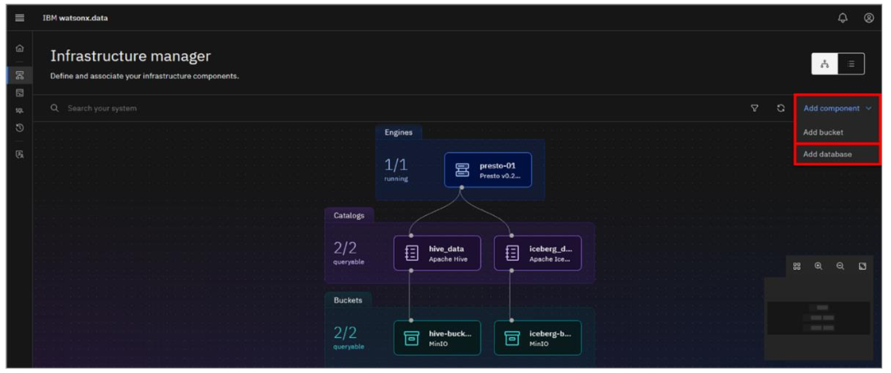

3.  En la ventana emergente **Añadir base de datos**, seleccione/introduzca la siguiente información en la sección **1. Definición de la base de datos**:

*   **Tipo de base de datos**: IBM Db2
*   **Nombre de la base de datos**: GOSALES
*   **Nombre para mostrar**: Db2DW
*   **Nombre de host**: 192.168.252.2
*   **Puerto**: 50000
*   **Nombre de usuario**: db2inst1
*   **Contraseña**: db2inst1
*   **Conexión SSL**: ***Desmarque***

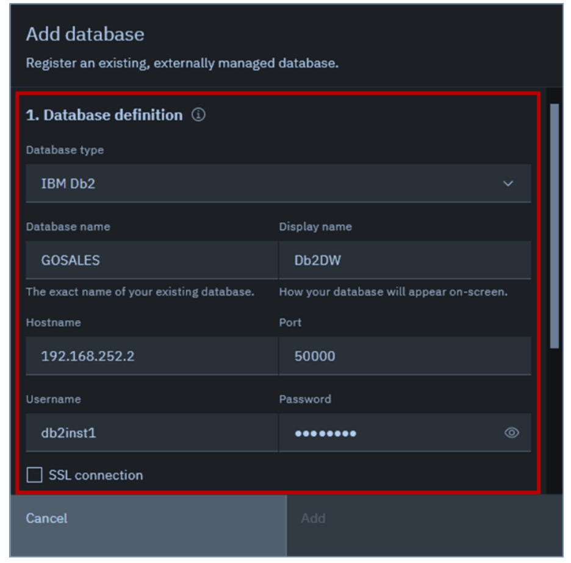

Cuando se añade un nuevo bucket o base de datos a watsonx.data, también se crea un nuevo catálogo.

4.  Desplácese hasta la sección **2. Definición del catálogo asociado**. Introduzca **db2catalog** como **nombre del catálogo**. A continuación, haga clic en **Añadir**.

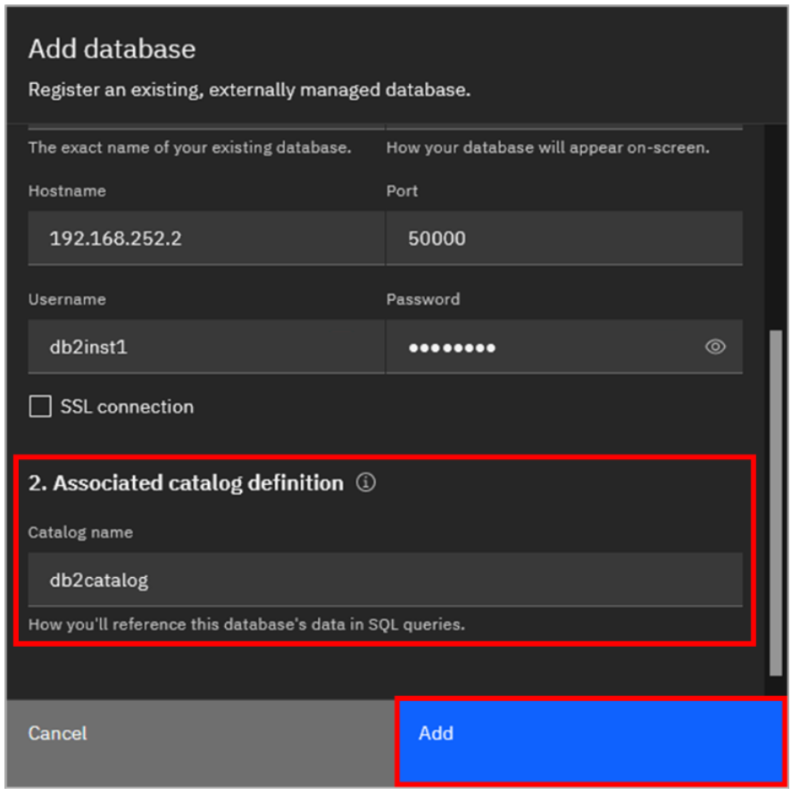

La base de datos **Db2DW** y el catálogo **db2catalog** se han añadido a watsonx.data y ahora se reflejan en la vista de topología de los componentes de infraestructura.


El catálogo **db2catalog** se asocia automáticamente a la base de datos **Db2DW**, pero para poder consultar datos de esta base de datos, el catálogo **db2catalog** también debe estar asociado al motor **presto-01**.

5.  Sitúe el puntero del ratón sobre el mosaico del catálogo **db2catalog** y aparecerá el icono **Gestionar asociaciones** . Haga clic en el icono  **Gestionar asociaciones**.

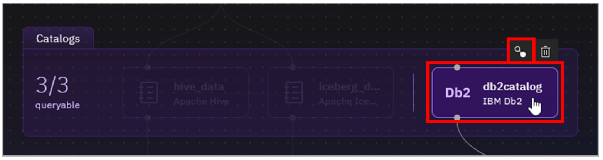

6.  En la ventana emergente **Gestionar asociaciones**, seleccione la casilla del motor **presto-01** y, a continuación, haga clic en **Guardar y reiniciar motor**.

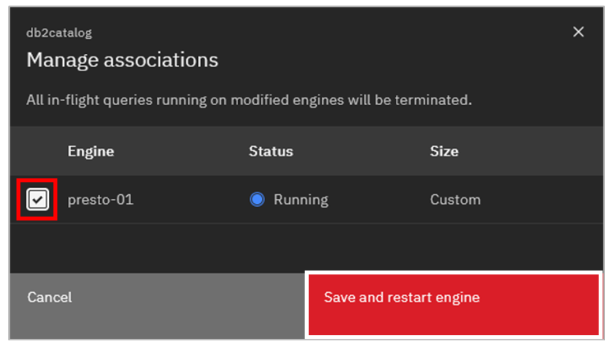

Una línea conecta ahora **presto-01** con **db2catalog**, indicando que están asociados.


A continuación añadirá la base de datos PostgreSQL. La contraseña para la cuenta de administrador PostgreSQL es específica para su entorno y los siguientes pasos la extraerán para usted.

7.  Abra una ventana de comandos de terminal en el servidor watsonx.data como usuario root.
8.  El usuario administrativo de la base de datos PostgreSQL es **admin**. Ejecute el siguiente comando para extraer y mostrar la **contraseña**. Copie el valor mostrado en una ubicación que pueda consultar más adelante.

```bash
docker exec ibm-lh-postgres printenv | grep POSTGRES_PASSWORD | sed 's/.*=//'
```

9.  Repita los pasos 2-6 anteriores para añadir la base de datos PostgreSQL a watsonx.data. Utilice la siguiente información:

*   **Tipo de base de** datos: PostgreSQL(se puede encontrar en Otras bases de datos)
*   **Nombre de la base de datos**: gosales
*   **Nombre para mostrar**: PostgreSQLDB
*   **Nombre de host**: 192.168.252.2
*   **Puerto**: 5432
*   **Nombre de usuario**: admin
*   **Contraseña**: ***La contraseña generada en el paso*** anterior
*   **Nombre del catálogo**: pgcatalog

Con las bases de datos Db2 y PostgreSQL añadidas, la topología debería parecerse a la imagen siguiente.

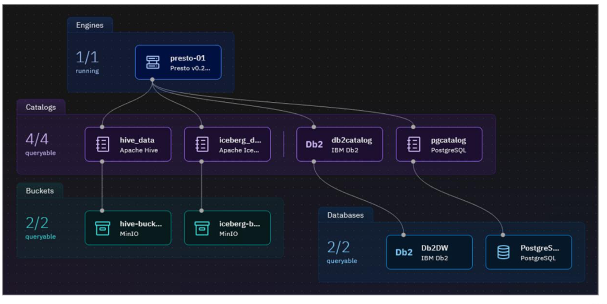

10. Seleccione el icono **Gestor de datos** en el menú de la izquierda.
11. Expanda los catálogos db2catalog y pgcatalog.

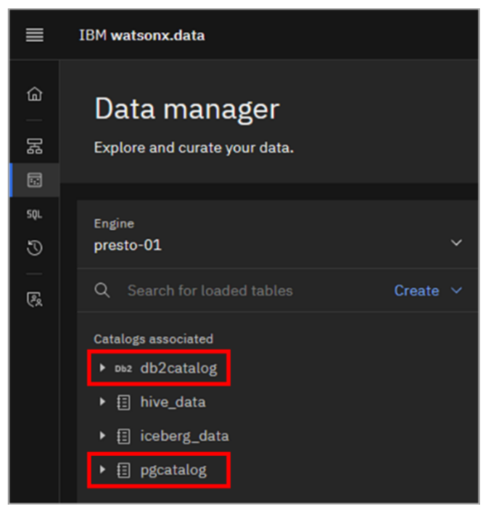

> **NOTA**: Si al intentar activar el 'db2catalog' aparece el error 'db2inst1 password expired' y no se muestra la información del esquema y las tablas, los siguientes pasos te ayudarán a solucionarlo:
>
> 1.  Vuelve a la página del Administrador de Infraestructura y desconecta Presto de db2catalog
> 2.  Pase el ratón por encima del mosaico db2catalog y haga clic en el icono de la papelera para eliminarlo.
> 3.  SSH en su instancia watsonx en la línea de comandos, y cambiar a usuario root.`sudo su -`)
> 4.  Ejecute el siguiente comando Docker para ampliar la caducidad de la contraseña: `docker exec db2server chage -I -1 -m 0 -M 99999 -E -1 db2inst1`
> 5.  Vuelva atrás y siga los pasos 2-6 para volver a añadir la base de datos db2.

Se muestra información sobre el esquema y las tablas de ambas bases de datos. Ambas incluyen un esquema **gosalesdw** idéntico con tablas que contienen datos de ventas de la empresa ficticia Great Outdoors. Recuerde que también existe una copia de estos mismos datos en el almacenamiento de objetos, gestionada por el catálogo **hive\_data**.

Si no ve ninguna tabla asociada al esquema **gosalesdw** en ninguno de los catálogos, puede actualizar el esquema.


> **Nota:** Si por alguna razón la lista de tablas no se actualiza, o si ve aparecer un mensaje en la esquina superior derecha que dice "Se ha ***producido un error al cargar las tablas en gosalesdw",*** similar a la imagen de abajo, aún puede continuar. La información de las tablas está en el catálogo y las consultas que hacen referencia a estas tablas seguirán funcionando. Continúe con el resto del laboratorio.

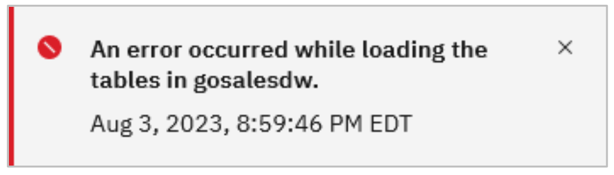

Ahora tiene copias de las tablas de ventas de la empresa Great Outdoors en almacenamiento de objetos (hive\_data), Db2 (db2catalog) y PostgreSQL (pgcatalog). Esto no es algo que se tendría en un escenario del mundo real (después de todo, el beneficio de poder federar el acceso a múltiples fuentes de datos es evitar la duplicación de datos). Sin embargo, se hace aquí con el propósito de resaltar las capacidades de federación de Presto.

Ahora verá cómo puede ejecutar una consulta federada que combine datos de estas tres fuentes de datos.

12. Seleccione el icono **Espacio de trabajo de consulta** en el menú de la izquierda.
13. Copie y pegue la siguiente consulta en la **hoja de cálculo SQL**. Haz clic en **Ejecutar en presto-01**.

Esta consulta de ejemplo podría ser utilizada por la empresa ficticia para determinar qué método de compra está asociado con los pedidos más grandes. La consulta accede a cinco tablas, una de ellas en PostgreSQL, dos en Db2 y dos en el almacenamiento de objetos de watsonx.data.

```bash
select  pll.product_line_en as product, md.order_method_en as order_method, sum(sf.quantity) as total 
  from 
    pgcatalog.gosalesdw.sls_order_method_dim as md, 
    db2catalog.gosalesdw.sls_product_dim as pd, 
    db2catalog.gosalesdw.sls_product_line_lookup as pll,
    hive_data.gosalesdw.sls_product_brand_lookup as pbl,
    hive_data.gosalesdw.sls_sales_fact as sf 
  where
    pd.product_key = sf.product_key
    and md.order_method_key = sf.order_method_key
    and pll.product_line_code = pd.product_line_code 
    and pbl.product_brand_code = pd.product_brand_code
  group by pll.product_line_en, md.order_method_en 
  order by product, order_method;
```

> **Nota:** Si la sentencia SQL se pega en la hoja de cálculo como una sola línea, puede darle un formato agradable haciendo clic en el icono **Formatear hoja de cálculo**.

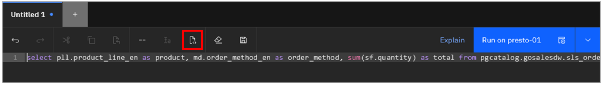

El **conjunto de resultados** de la consulta se encuentra en la parte inferior de la pantalla.

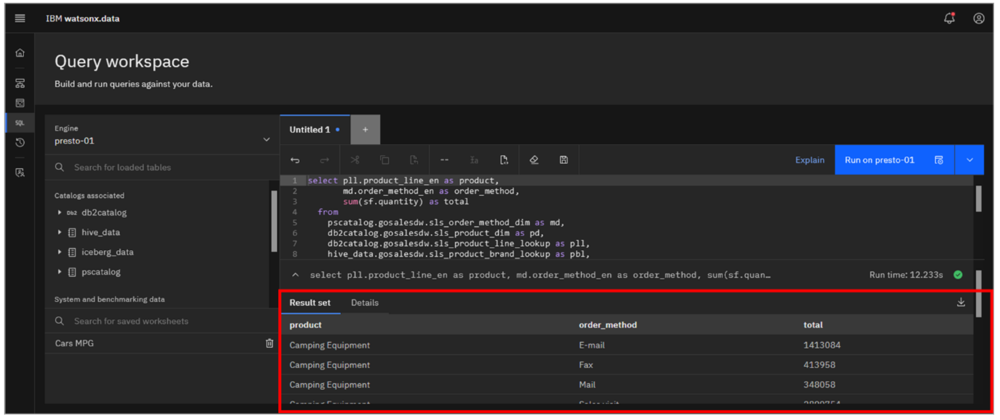

14. Haga clic en el botón **Explicar** de la barra de menús de la hoja de cálculo.

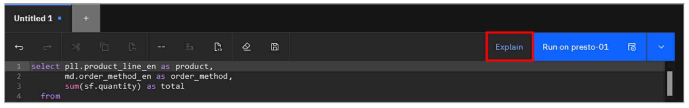

La explicación visual de esta consulta parece mucho más interesante que la mostrada anteriormente. Si se desplaza por la explicación visual, verá cinco nodos hoja **ScanProject** en el árbol. Éstos corresponden a las cinco tablas que se están leyendo.

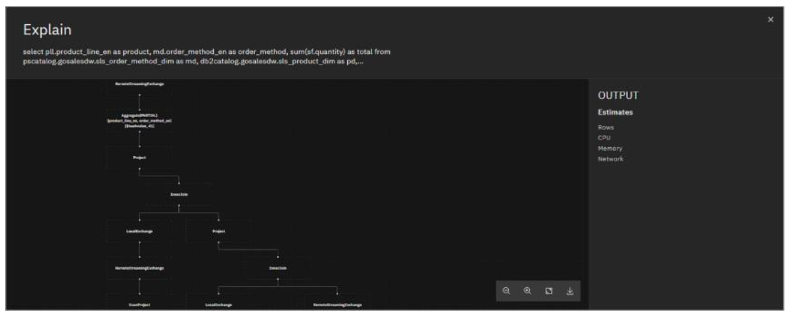

15. Haz clic en la **X** de la esquina superior derecha de la ventana **Explicar** para cerrarla.

**Paso opcional:** Aquí hay otras dos consultas que puede intentar ejecutar también, que combinan datos de las mismas tres fuentes de datos.

1.  La siguiente consulta muestra todos los empleados canadienses y mexicanos, junto con su región y país. Este es el tipo de consulta que podría generar una herramienta de generación de informes, basándose en la información introducida por el usuario.

```bash
select distinct branch_region_dim.region_en region, 
  branch_region_dim.country_en country,
  emp_employee_dim.employee_name employee 
from 
  hive_data.gosalesdw.go_region_dim branch_region_dim,
  pgcatalog.gosalesdw.emp_employee_dim emp_employee_dim,
  db2catalog.gosalesdw.go_branch_dim go_branch_dim
where 
  branch_region_dim.country_en in ('Canada', 'Mexico') and
  branch_region_dim.country_code = go_branch_dim.country_code and
  emp_employee_dim.branch_code = go_branch_dim.branch_code 
order by region, country, employee;
```

2.  En muchas empresas, los departamentos (u organizaciones, como se denominan en este conjunto de datos) son jerárquicos, en el sentido de que un departamento depende de otro, que a su vez depende de otro. Esta consulta muestra los dos departamentos principales de un conjunto determinado de departamentos. Al igual que en la consulta anterior, se trata del tipo de consulta que podría generar una herramienta de elaboración de informes.

```bash
select gosalesdw.go_org_dim.organization_key, 
  go_org_dim_1.organization_parent as org_level1_code, 
  go_org_name_lookup_1.organization_name_en as org_level1_name, 
  gosalesdw.go_org_dim.organization_parent as org_level2_code, 
  go_org_name_lookup_2.organization_name_en as org_level2_name, 
  gosalesdw.go_org_dim.organization_code as org_code, 
  gosalesdw.go_org_name_lookup.organization_name_en as org_name
from  pgcatalog.gosalesdw.go_org_name_lookup  go_org_name_lookup_2 
        inner join
      hive_data.gosalesdw.go_org_dim 
        inner join
      pgcatalog.gosalesdw.go_org_name_lookup
        on hive_data.gosalesdw.go_org_dim.organization_code = pgcatalog.gosalesdw.go_org_name_lookup.organization_code
        on go_org_name_lookup_2.organization_code = hive_data.gosalesdw.go_org_dim.organization_parent
        inner join
      pgcatalog.gosalesdw.go_org_name_lookup go_org_name_lookup_1
        inner join 
      hive_data.gosalesdw.go_org_dim go_org_dim_1
        on go_org_name_lookup_1.organization_code = go_org_dim_1.organization_parent
        on hive_data.gosalesdw.go_org_dim.organization_parent = go_org_dim_1.organization_code
where (hive_data.gosalesdw.go_org_dim.organization_code between '1700' and '5730')
order by org_code;
```

> **Nota:** Pruebe a ejecutar las dos consultas anteriores también desde la CLI de Presto. Debería obtener los mismos resultados en la CLI de Presto que en el área de trabajo de consultas.

## Cuestionario del curso Watsonx.data L3
¡Felicidades! Ha completado los laboratorios necesarios para completar el cuestionario del curso watsonx.data L3. El cuestionario se puede encontrar [aquí](https://learn.ibm.com/course/view.php?id=13171). **Nota:** No es necesario que mire los videos ya que los laboratorios han cubierto todo el contenido del curso, excepto el cuestionario. Puede hacer clic en las lecciones y realizar el cuestionario.

### Enhorabuena, has llegado al final del laboratorio 106.

Haga clic en, [laboratorio 107](/watsonx/watsonxdata/107) para iniciar el siguiente laboratorio.
