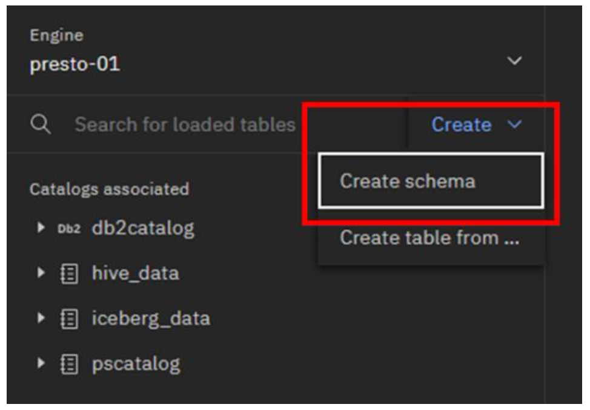
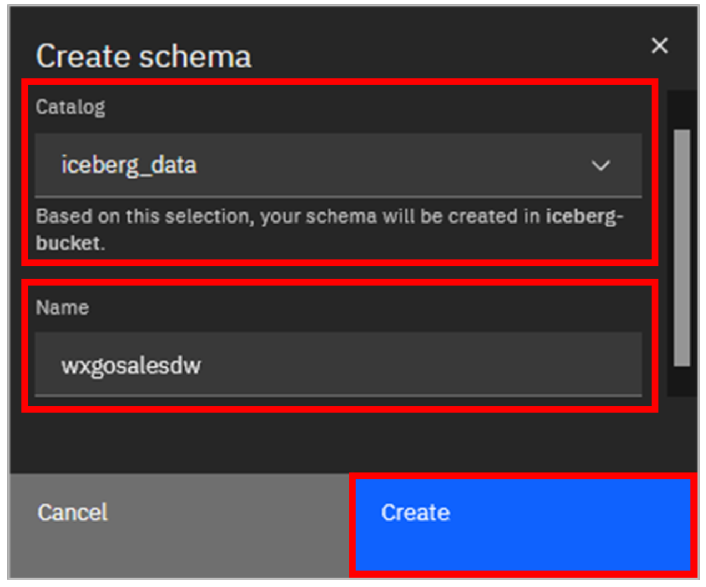
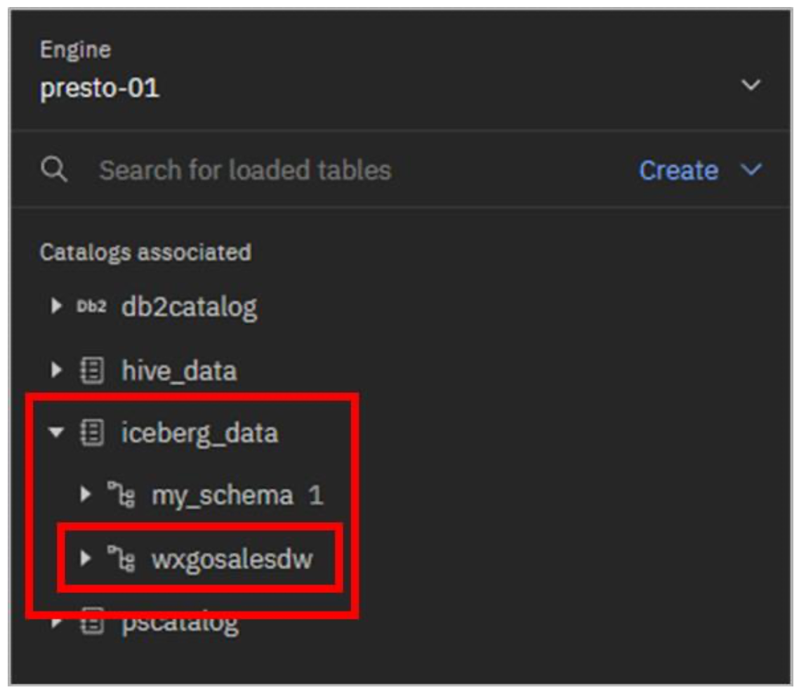
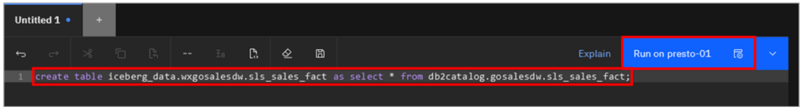
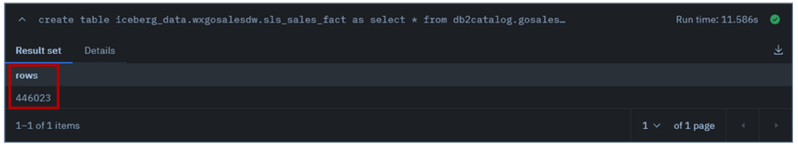

## Offloading Data from a Data Warehouse


With watsonx.data, enterprises can offload data that really doesn’t need to be in the warehouse to lower-cost object storage. With fit-for-purpose engines, data warehousing costs can be reduced by offloading workloads from a data warehouse to watsonx.data. Specifically, applications that need to access this data can query it through Presto (or Spark). This includes being able to combine the offloaded data with the data that remains in the warehouse. This section will show an example of how this can be done with Db2 (but the steps are equivalent for other data warehouse products).

Additionally, external engines that support the Iceberg open table format can also work directly with data in watsonx.data’s object storage. Latest Db2 and Netezza can participate in the watsonx.data ecosystem as well, accessing the lakehouse data in object storage directly (just as Presto and Spark can).

In the [previous Lab](/watsonx/watsonxdata/106) you registered an existing Db2 environment with watsonx.data (calling it **Db2DW**) and created a catalog for it called **db2catalog**.

In this example scenario, you’re going to “move” the **gosalesdw.sls_sales_fact** table from Db2 to watsonx.data’s object storage. It will be created as an Iceberg table, in a new schema you create called **wxgosalesdw**, managed by the **iceberg_data** catalog.

1. Select the Data manager icon from the left-side menu.

2. Go to the top of the navigation pane and click the **Create** dropdown menu. Select **Create schema**. (Note: These steps are using the web interface, but you can also create a schema through SQL.)

  

3. In the **Create schema** pop-up window, select/enter the following information, and then click the Create button:

    - Catalog: iceberg_data
    - Name: wxgosalesdw

  

4. Expand the **iceberg_data** catalog. The new schema should be listed.

  

5. Select the Query workspace icon from the left-side menu.

  To create a new table with the same table definition as the original table, you can use the CREATE TABLE AS SELECT (CTAS) SQL statement.

6. Copy and paste the following SQL into the **SQL worksheet**. Click **Run on presto-01**.

  ```bash
    create table iceberg_data.wxgosalesdw.sls_sales_fact as select * from db2catalog.gosalesdw.sls_sales_fact;
  ```
  

  The result shown at the bottom of the worksheet shows the number of rows that have been inserted from the source table to the new table.

  

  In a real-world scenario, you would then remove the table from the data warehouse. However, to keep the gosalesdw sample dataset intact in your environment, you won’t do that here.

  As a test, you can run a federated query that combines the new table in object storage with existing tables in Db2.

7. Copy and paste the following SQL into the **SQL worksheet**. Click **Run on presto-01**.

  ```bash
    select pll.product_line_en as product, sum(sf.quantity) as total
    from
      db2catalog.gosalesdw.sls_product_dim as pd, 
      db2catalog.gosalesdw.sls_product_line_lookup as pll, 
      hive_data.gosalesdw.sls_sales_fact as sf
    where
      pd.product_key = sf.product_key
      and pll.product_line_code = pd.product_line_code
    group by pll.product_line_en 
    order by product;
  ```

  This business query calculates total sales for each of the high-level product lines. The output should be similar to the image below.


  

### Congratulations, you've reached the end of lab 107.

Click, [lab 108](/watsonx/watsonxdata/108) to start next lab.
