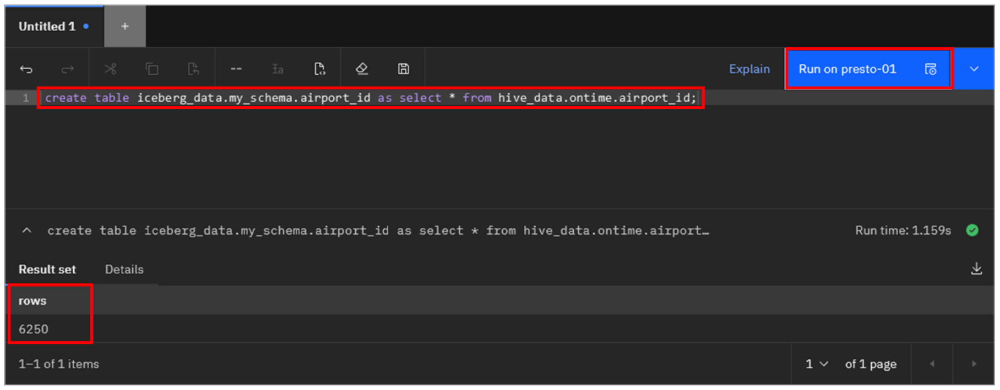
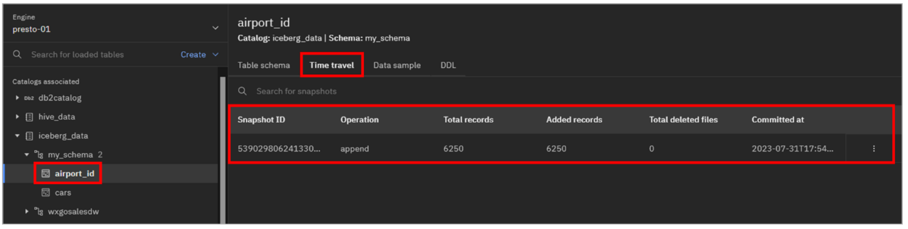
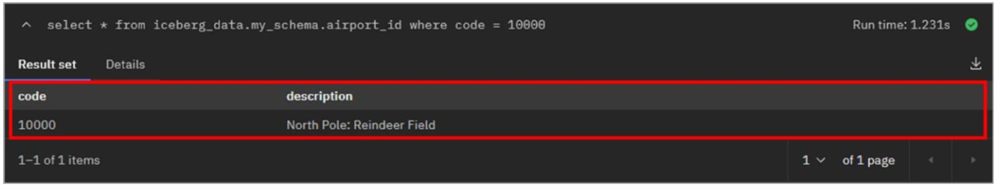
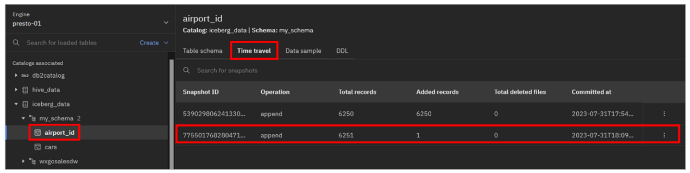
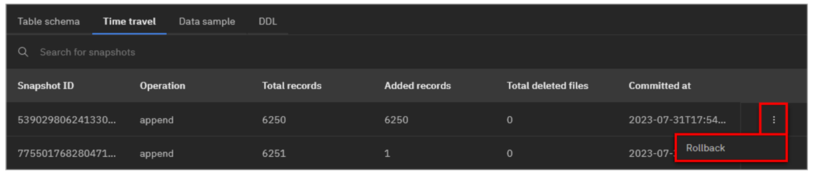
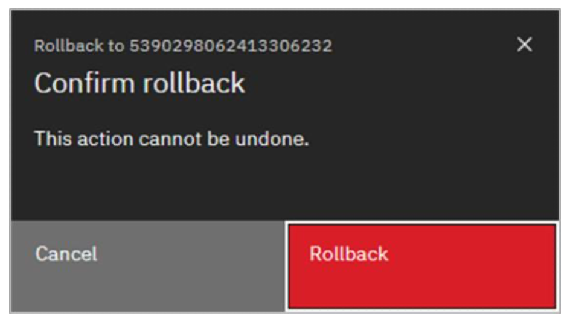
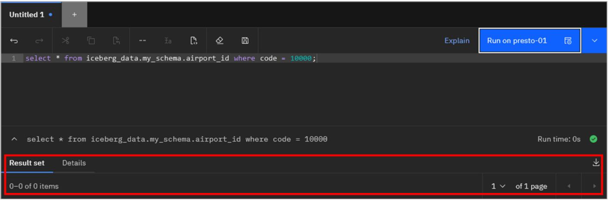
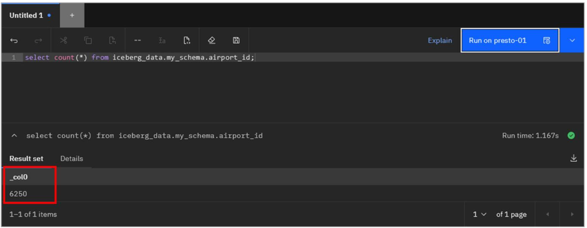

## Tiempo de viaje y retrotracción

El formato de tabla abierta de Iceberg ofrece una serie de ventajas a los usuarios, como la posibilidad de ver una tabla tal y como existía en un momento del pasado. Esta capacidad de viajar en el tiempo es útil de varias maneras. Por ejemplo, tener la posibilidad de consultar datos históricos es útil a efectos de auditoría. O si una aplicación corrompe los datos de la tabla de alguna manera, puede imaginarse el valor de poder revertir rápidamente esos cambios restableciendo la tabla a un estado bueno conocido.

Iceberg utiliza instantáneas para soportar esta capacidad de viaje en el tiempo. Una instantánea representa el estado de una tabla en un momento dado. Cuando se modifican datos en una tabla, como insertar, actualizar o eliminar registros, se crea una nueva instantánea. Existen operaciones de mantenimiento que pueden utilizarse para limpiar instantáneas antiguas que ya no son necesarias.

A partir del tercer trimestre de 2023, watsonx.data aún no admite consultas de desplazamiento en el tiempo. Sin embargo, puede hacer retroceder una tabla a un punto anterior en el tiempo utilizando instantáneas. En esta sección se describe este proceso.

1.  Seleccione el icono **Espacio de trabajo de consulta** en el menú de la izquierda.
2.  Copie y pegue la siguiente sentencia SQL en la **hoja de cálculo SQL**. Haga clic en **Ejecutar en presto-01**.

```bash
  create table iceberg_data.my_schema.airport_id as select * from hive_data.ontime.airport_id;
```



Como se muestra en la salida de arriba después de ejecutar la consulta, hay 6.250 filas en esta tabla.

3.  Seleccione el icono **Gestor de datos** en el menú de la izquierda.

4.  Navegue hasta la tabla **iceberg\_data** > **my\_schema** > **airport\_id** (si no ve la tabla, actualice el esquema). A continuación, seleccione la pestaña **Viaje en el tiempo**.

    

Esta pestaña muestra las instantáneas asociadas a la tabla (identificadas por un **ID de instantánea**). En este momento sólo hay una instantánea y hay 6.250 registros en total (que coinciden con lo que has visto antes).

> **Nota:** Como referencia, también puede obtener información de instantáneas a través de SQL. Por ejemplo (y no es necesario ejecutarlo ahora), esto consultará las instantáneas disponibles para la tabla airport\_id:

```bash
  select * from iceberg_data.my_schema."airport_id$snapshots" order by committed_at;
```

5.  Seleccione de nuevo el icono **Espacio de trabajo de consulta** en el menú de la izquierda.
6.  Copie y pegue la siguiente sentencia SQL en la **hoja de cálculo SQL** y haga clic en *Ejecutar en presto-01*.

```bash
  insert into iceberg_data.my_schema.airport_id values (10000, 'North Pole: Reindeer Field');
```

7.  Copie y pegue (sustituyendo el SQL ya existente) la siguiente sentencia SQL en la **hoja de cálculo SQL** y haga clic en **Ejecutar en presto-01**.

```bash
  select * from iceberg_data.my_schema.airport_id where code = 10000;
```

Debería ver la fila que insertó en el paso anterior.



8.  Copie y pegue (sustituyendo el SQL ya existente) la siguiente sentencia SQL en la **hoja de cálculo SQL** y haga clic en **Ejecutar en presto-01**.

```bash
  select count(*) from iceberg_data.my_schema.airport_id;
```

Debería ver un recuento de 6.251 filas.

9.  Seleccione de nuevo el icono **Gestor de datos** en el menú de la izquierda.

10. Como antes, navegue hasta la tabla **iceberg\_data** > **my\_schema** > **airport\_id**. A continuación, seleccione la pestaña **Time travel**.

    

Observe que ahora se muestran dos instantáneas. Si no ve una segunda instantánea, actualice su navegador y repita este paso.

La segunda instantánea muestra que hay 6.251 filas en total, habiéndose añadido 1 fila en esta nueva versión de la tabla.

Ahora va a hacer retroceder la tabla a la primera instantánea, que representa el estado inicial de la tabla. Esta versión de la tabla no tenía la fila que has añadido.

11. Haga clic en el icono de **menú de desbordamiento** (elipses verticales) situado al final de la fila de la instantánea original (la primera instantánea mostrada, con la **marca de tiempo Committed at** anterior y **6250 registros Added**). Haga clic en **Deshacer**.

    

12. En la ventana emergente **Confirmar reversión**, haga clic en **Reversión**.

    

> **Nota:** Como referencia, la siguiente sentencia SQL realizará la operación de retroceso equivalente (NO EJECUTE ESTO AHORA):

```bash
  call iceberg_data.system.rollback_to_snapshot ('my_schema', 'airport_id', <snapshotID>);
```

13. Seleccione de nuevo el icono **Espacio de trabajo de consulta** en el menú de la izquierda.
14. Copie y pegue la siguiente sentencia SQL en la **hoja de cálculo SQL** y haga clic en **Ejecutar en presto-01**.

```bash
  select * from iceberg_data.my_schema.airport_id where code = 10000;
```

La fila que has añadido antes ya no está.



15. Copie y pegue (sustituyendo el SQL ya existente) la siguiente sentencia SQL en la **hoja de cálculo SQL** y haga clic en **Ejecutar en presto-01**.

```bash
  select count(*) from iceberg_data.my_schema.airport_id;
```



Debería ver un recuento de 6.250 filas, que coincide con el recuento original cuando creó la tabla por primera vez. La tabla ha vuelto al estado en el que estaba cuando se creó por primera vez.

### Enhorabuena, has llegado al final del laboratorio 108.

Con esto concluye el laboratorio L3. Encontrará más recursos de [watsonx.](https://ibm.seismic.com/Link/Content/DCbbPfP64CX3RG4CJPH7bH8XjGBP)data, incluidos otros módulos de demostración, en [la página "IBM watsonx.data Sales Kit " seismic](https://ibm.seismic.com/Link/Content/DCbbPfP64CX3RG4CJPH7bH8XjGBP).

Ya puede [completar el cuestionario](https://learn.ibm.com/course/view.php?id=13178) de IBM watsonx.data para Technical Sales Level 3 Quiz
