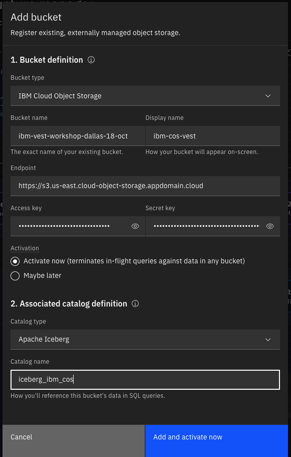
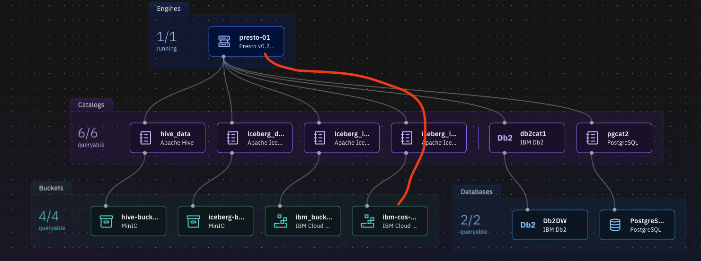
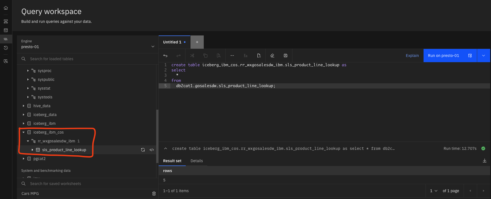
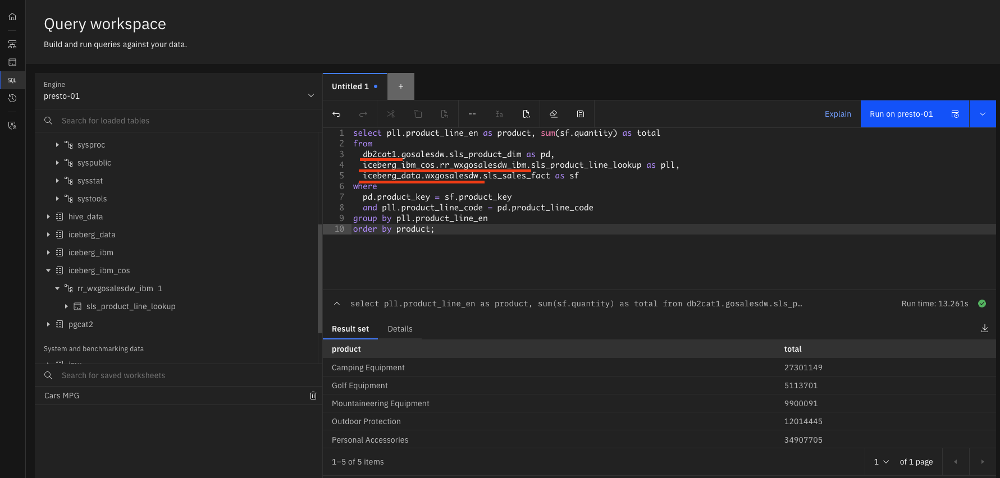
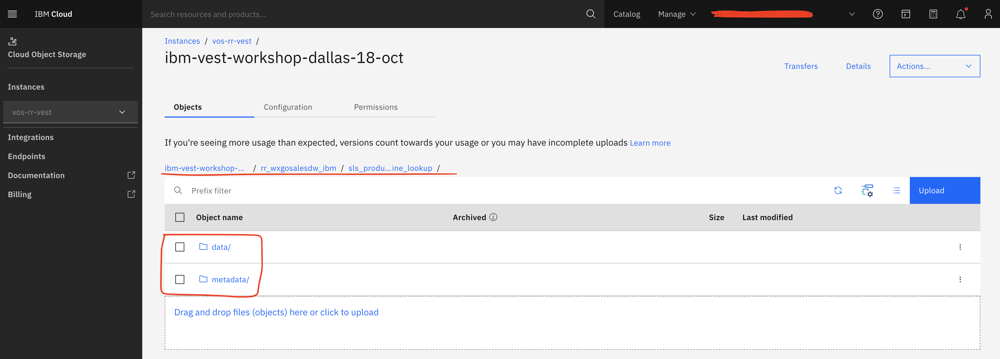

# Working with IBM Cloud COS

The TechZone watsonx.data environment comes pre-configured with presto engine, iceberg and hive catalog associated with MinIO object storage. In this lab, you are going to register IBM Cloud Object Storage (COS) to watsonx.data. 

## Register IBM Cloud Object Storage

1. Select the **Infrastructure manager** icon from the left-side menu.

2. Click the **Add component** dropdown menu at the right-side of the screen. Select **Add bucket**.

3. In the **Add bucket** pop-up window, select/enter the following pieces of information

> **Note:** If you have an IBM Cloud account, you can create your own bucket and use it in this lab. You can also use the following bucket provided for your workshop, but make sure you prefix your schema name with your initials to avoid naming conflicts in the COS bucket.

  Bucket definition section

  - **Bucket type**:  IBM Cloud Object Storage
  - **Bucket name**:	***from slack***
  - **Display name**: ibm-cos-vest
  - **Endpoint**:	    s3.us-south.cloud-object-storage.appdomain.cloud
  - **Access key**:	  **********
  - **Secret key**:	  **********
  - **Activation**:   ***Activate now***

  Associated catalog definition
  
  - **Catalog type**:	Apache Iceberg
  - **Catalog name**:	iceberg_ibm_cos

    

    The **ibm-cos-vest** bucket and **iceberg_ibm_cos** catalog have been added to watsonx.data and are now reflected in the topology view of the infrastructure components.

4. The **iceberg_ibm_cos** catalog is automatically associated with the **ibm-cos-vest bucket**, but to be able to query data from this bucket, the **iceberg_ibm_cos** catalog must also be associated with the **presto-01** engine.

5. Hover your mouse pointer over the **iceberg_ibm_cos** catalog tile and the **Manage associations** icon will appear. Click the **Manage associations** icon.

6. In the **Manage associations** pop-up window, select the checkbox for the **presto-01** engine and then click **Save and restart engine**.

    A line now connects **presto-01** with **iceberg_ibm_cos**, indicating that they’re associated.

  


## Offloading data from a Data Warehouse to Associated bucket

In this example scenario, you’re going to “move” the **sls_product_line_lookup** table from Db2 to watsonx.data’s IBM COS. It will be created as an Iceberg table, in a new schema you will create called **wxgosalesdw_ibm**, managed by the **iceberg_ibm_cos** catalog.

1. Select the **Data manager** icon from the left-side menu.

2. Go to the top of the navigation pane and click the **Create** dropdown menu. Select **Create schema**. 

3. In the **Create schema** pop-up window, select/enter the following information, and then click the **Create** button:

> **Note:** If you are using the shared COS bucket provided for your workshop, prefix the schema name with your initials or some other uniqueid value to avoid naming conflicts in the COS bucket.

    - **Catalog**: iceberg_ibm_cos
    - **Name**: ***uniqueid***_wxgosalesdw_ibm

4. Expand the **iceberg_ibm_cos** catalog. The new schema should be listed.

5. Select the **Query workspace** icon from the left-side menu.

6. Copy and paste the following SQL into the **SQL worksheet**. Click **Run on presto-01**.

  This will create a table called **sls_product_line_lookup** in **iceberg_ibm_cos.wxgosalesdw_ibm(*and your initials as a prefix*)**

  ```bash
  create table iceberg_ibm_cos.wxgosalesdw_ibm.sls_product_line_lookup as select * from db2catalog.GOSALESDW.SLS_PRODUCT_LINE_LOOKUP;
  ```
  

7. As a test, you can run a federated query that combines the new table in IBM COS with the existing tables in MinIO and  Db2 catalog.

  ```bash
  select pll.product_line_en as product, sum(sf.quantity) as total
  from
    db2catalog.GOSALESDW.SLS_PRODUCT_DIM as pd, 
    iceberg_ibm_cos.wxgosalesdw_ibm.sls_product_line_lookup as pll, 
    iceberg_data.wxgosalesdw.sls_sales_fact as sf
  where
    pd.product_key = sf.product_key
    and pll.product_line_code = pd.product_line_code
  group by pll.product_line_en 
  order by product;
  ```

  

8. Login to IBM Cloud and explore the data stored in the bucket.

  


### Congratulations, you've completed L3+ lab 109.

Click, [lab 110](/watsonx/watsonxdata/110) to start next lab.

Click, [watsonx.data](/watsonx/watsonxdata) to go to watsonx.data home page.
