# Visualization of watsonx.data from watsonx.ai

## Explore watsonx.data configurations

In this lab, I have already connected to DB2 data warehouse which has been offloaded to watsonx.data lakehouse. This warehouse contains a classic cars dataset, I will show you how a data scientist can bring the cars dataset to  watsonx.ai and look at the data and do some visualization with it. 

1. I have installed and configured standalone watsonx.data on a IBM Cloud Virtual Server Instance.

2. Login to watsonx.data instance https://wxddev.buildlab.cloud:9443/ using following credential
    - userid:   ibmlhadmin
    - password: ********

3. Click on **Infrastructure manager** icon to see DB2 data warehouse component.

  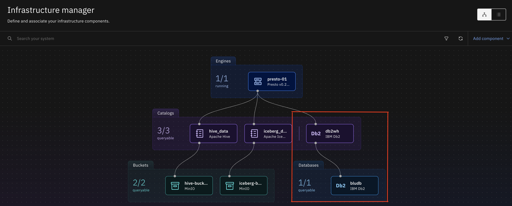

4. Click on **Data manager** icon and expand **db2wh** catalog to see all schemas. You can expand qnf97304 schema to navigate to classic_cars table. 

  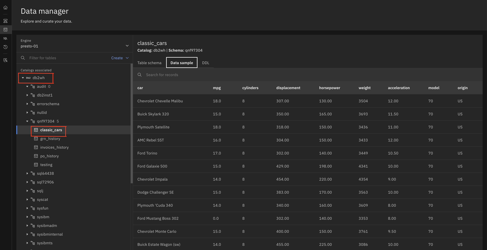

5. classic_cars table has been offloaded to watsonx.data. Expand **iceberg_data -> dsteam -> classic_cars**
 
  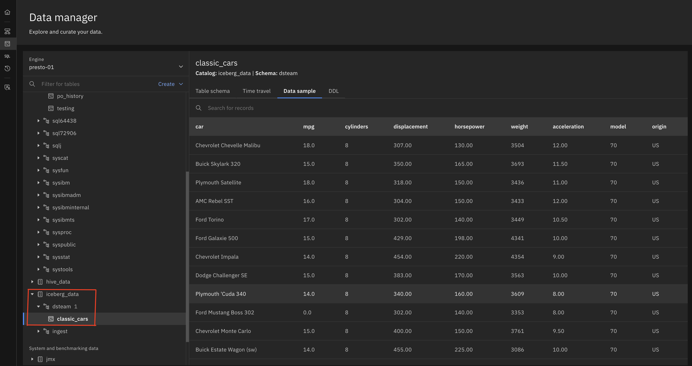

6. In term of controlling access, I have created a user called **alice**, and provided **user** role to **presto-01** engine. A access policy has been also added to provide alice access to only **dsteam** schema. 

7. Click on **Access control** icon from left navigation, and click on **presto-01** and then click on **Access control** tab. 

  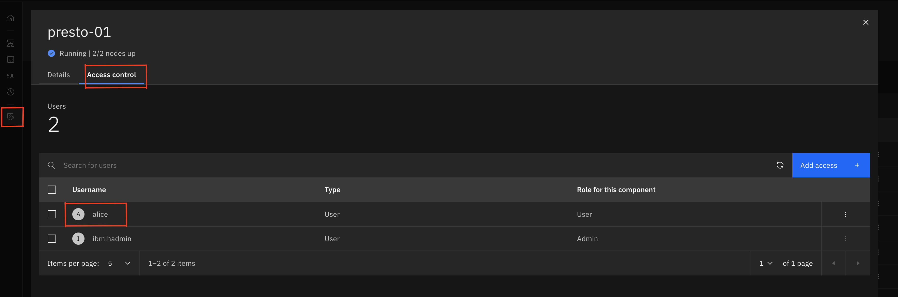

8. Click on X to close the window and click on **Policies** tab to check the policies **dsteam**. Click on **dsteam**. 

  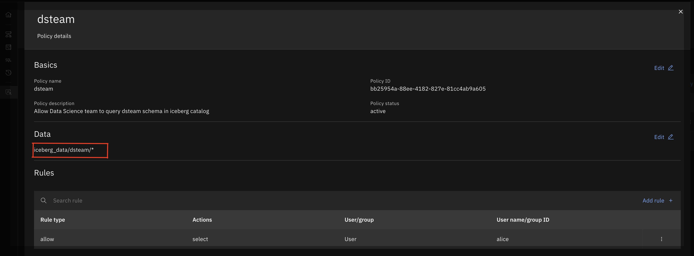

9. I have given user access to **alice** and restricted using policies to provide access to only **dsteam** schema in **inceberg_data** catalog. I have also provided access to some other components. 

## Connect watsonx.data from watsonx.ai

Navigate to your watsonx.ai project which you have used during watsonx.ai lab

1. Follow watsonx.ai [100: Prerequisites and FAQs](/watsonx/watsonxai/100) to login to your watsonx.ai project.

2. click on the hamburger icon in the upper left to expand the left-side menu and click **View all projects**

  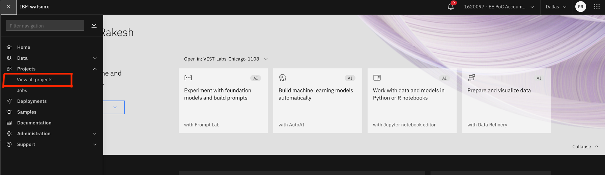

3. Select the project you used to complete your watsonx.ai labs and click on **Assets** tab.

> NOTE: If you are completing this lab in an IBM workshop/classroom setting, the watsonx.ai instance will be shared among all students. You should have been invited to an IBM cloud account and added to a watsonx.ai project with name format: `VEST-Labs-{Location}-{MMDD}` where _Location_ is the location and _MMDD_ indicates the month and day of your workshop.

  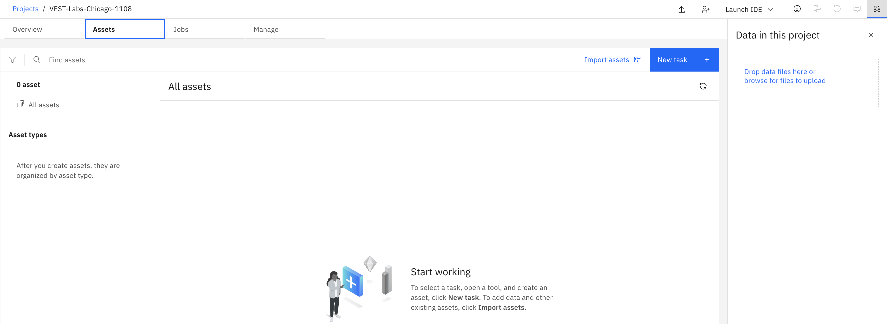

4. You will connect to watsonx.data we have seen in previous steps from your watsonx.ai project. Click on **New task** button from upper right and select **Connect to a data source**

  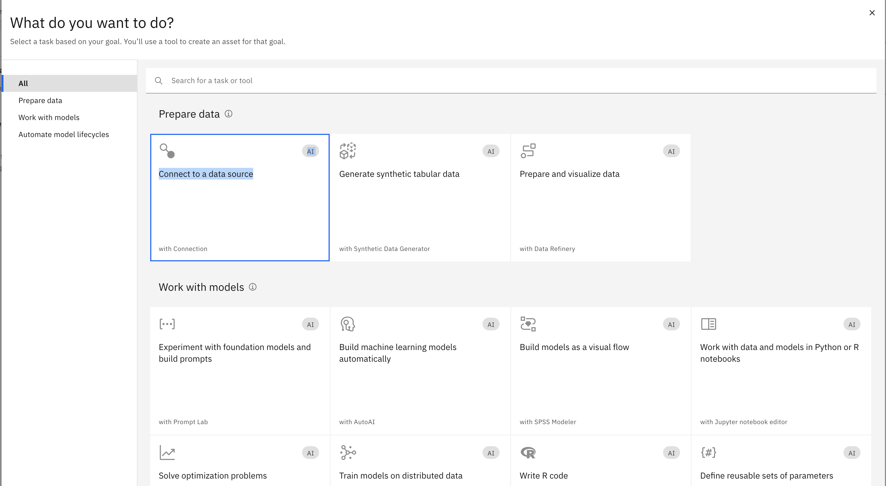

5. You will use Presto connector to connect to data in watsonx.data. Select **Presto** and then click on **Select** button.

  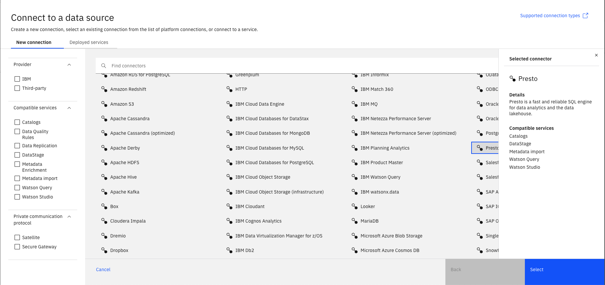

6. Fill the connection detail:

   - **Name:**                    watsonx.data connection
   - **Description:**             Connect watsonx.data using presto connector
   - **Hostname or IP address:**  wxddev.buildlab.cloud
   - **Port:**                    8443
   - **Username:**                alice
   - **Password:**                *from slack*
   - **Port is SSL-enabled:**     Checked
   - **SSL certificate:**         *from slack*

  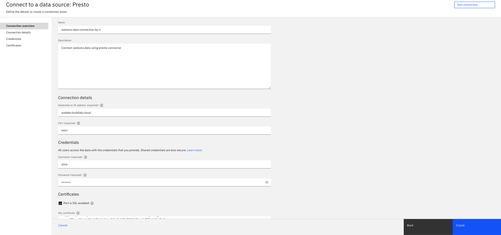

7. After filling all details correctly, you can test the connection before creating the connection. Click on **Test connection**. If you see **The test was successful**. Click **Create** to save the connection information.

  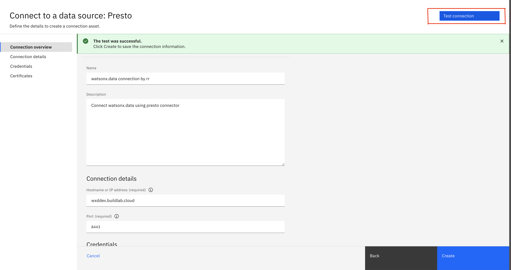

8. You will see saved connection with name **watsonx.data connection** in **Assets** tab

  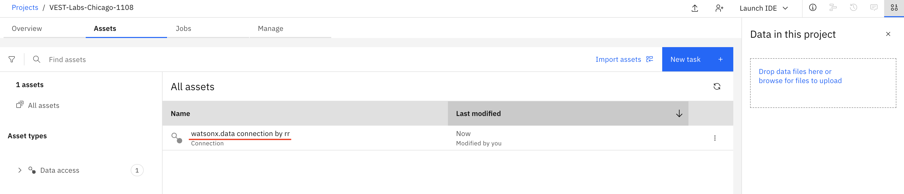

## Data Visualization

We have setup a connection from watsonx.ai over watsonx.data. Now next step is to bring the table from watsonx.data to watsonx.ai.

1. From Assets tab of selected watsonx.ai project, click on **Import assets**. Select the connection you have created **watsonx.data connection**. You can follow the selection to select table in final stage. **watsonx.data connection -> iceberg_data -> dsteam -> classic_cars**. Select **Import** button. You will notice new asset created with table name **classic_cars**

  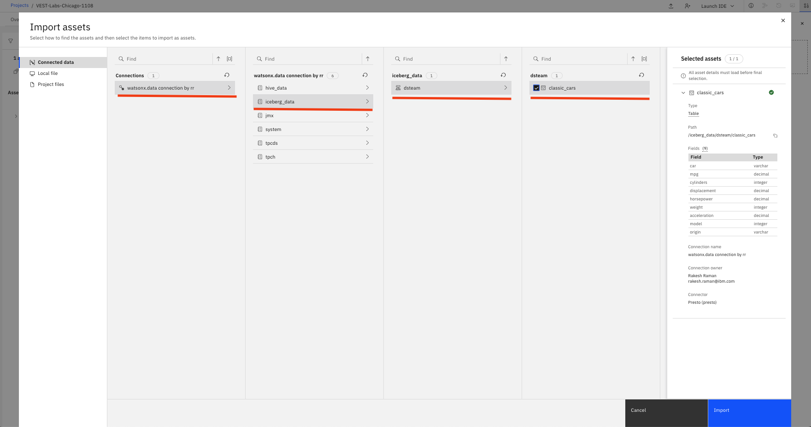

2. You will notice **db2wh** catalogs are not visible on the screen because **alice** has not been given access to **db2wh** catalog.

3. Click on **classic_cars** to preview the data. You will notice 0 mpg value for some of the tables. My objective is to prepare the data by removing cars with 0 mpg and generate some reports. Lets go to data refinery by clicking on **Prepare data** button from upper right. 

  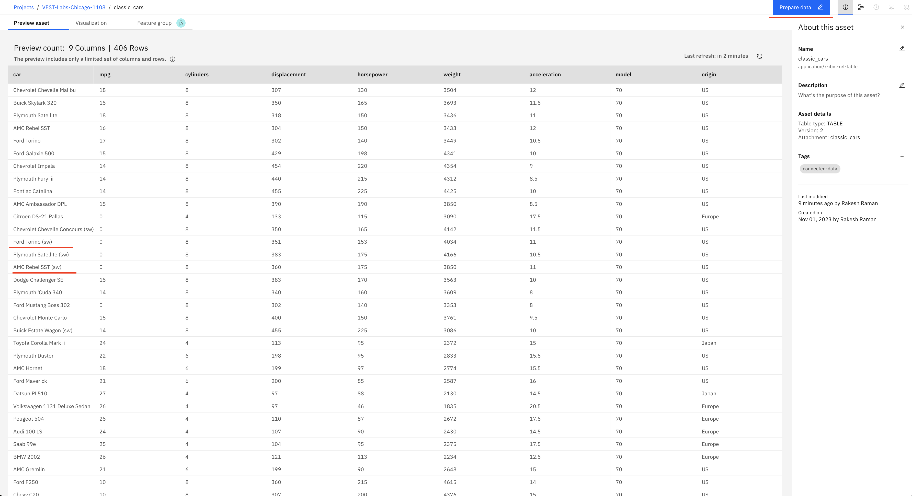

4. In **Data Refinery** page, click on **Profile** tab. You will see statistics of all the columns here, you will notice the minimum value for mpg column is 0. Select the column **mpg** and add refining step by clicking **New step** from lower left.

  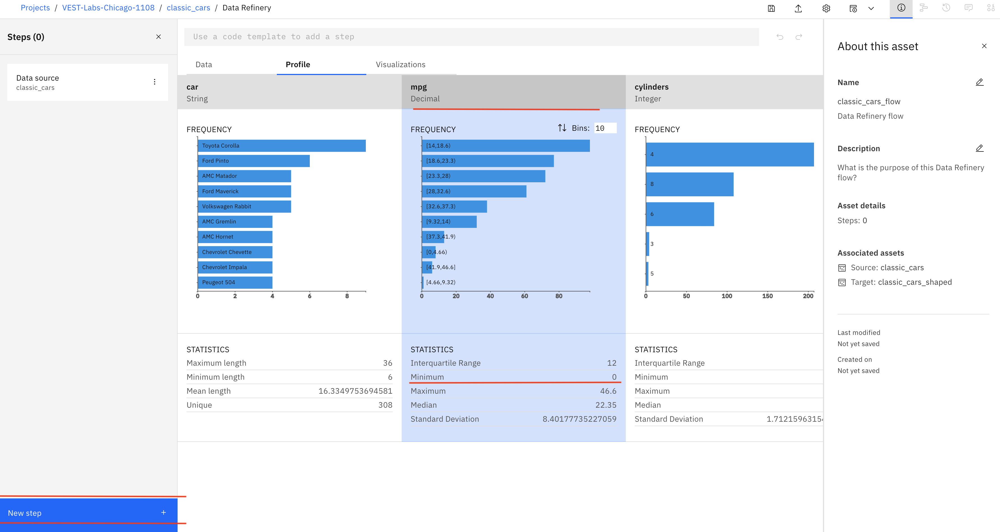

5. Select **Filter** from **CLEANSE** option. Select **mpg** from Columns, **Is not equal to** Operator and Value **0**. Click Apply, you will notice, mpg minimum value is changed to 9.  

  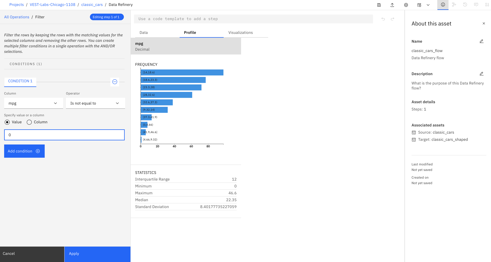

6. Lets us create a job to cleanse this column. Select **Save and create a job** from upper left. 

  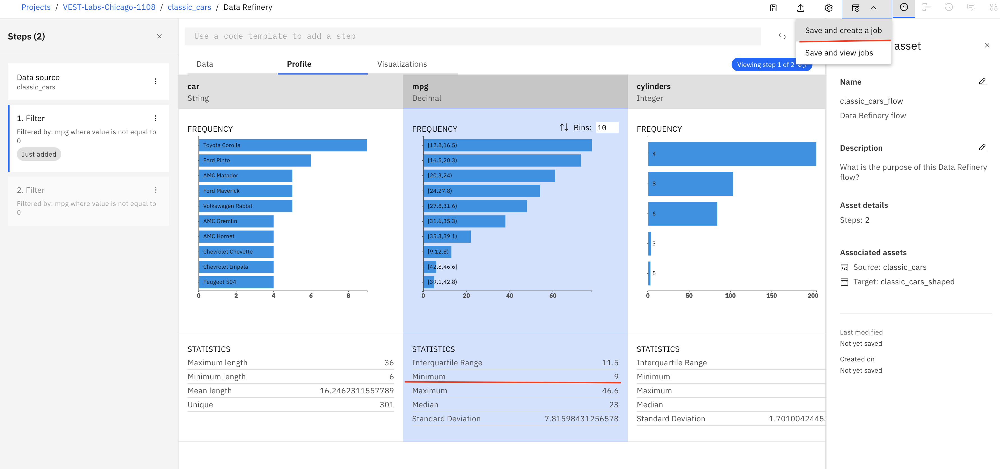

7. Enter the job detail as follow and click on **Create and run**

  - **Name:**         cleanse mpg columns with value 0
  - **Description:**  cleanse mpg columns with value 0
  - **Configure:**    *dont change*
  - **Schedule**      Off
  - **Notify**        On

8. You will get notification on upper right for successful creation of job. You can click on notification detail link to go to job page. Once job is completed, you will recieve another notification. 

  

9. You can navigate to your watsonx.ai project and you will observe new asset called classic_cars_shaped is created and if you go to Jobs tab, you will see newly created job and its status. 

  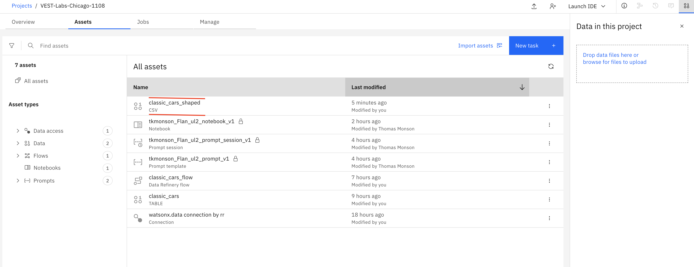 

10. Click on **classic_cars_shaped** asset from the list of asset. You will notice all the rows with mpg value 0 are removed. 

11. Now lets explore data graphically. Click on **Visualization** tab. Select columns for visualization. mpg, cylinder, weight, and origin, then click on **Visualize data** button. 

  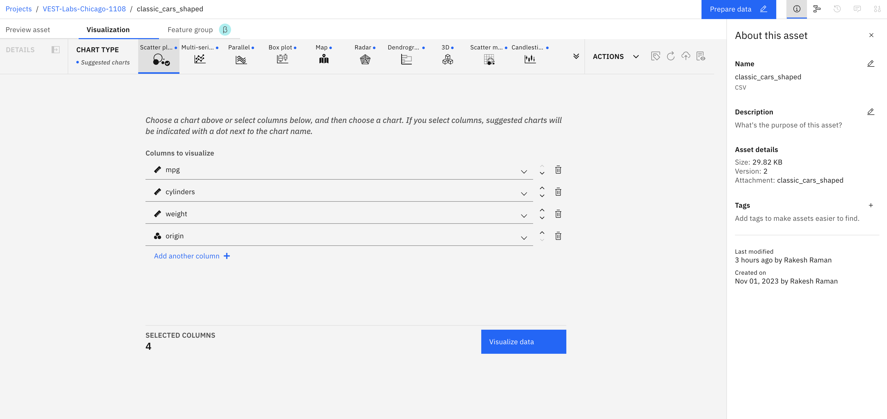 

12. You have option to visualize the data in different chart listed on top of the page. You can slect **Scatter plot chart** for this lab. You can also change the value of the graph attiribute value. 

  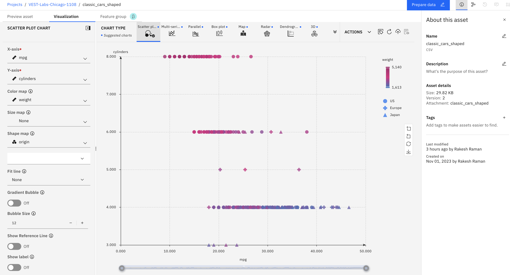 

