<QuizAlert text='Heads Up! Quiz material will be flagged like this!' />

# 202: Using IBM Cloud and Amazon S3 Object Storage

## Goal

The goal of this lab is to integrate IBM watsonx.data with Simple Storage Service (S3) API-compatible object storage hosted by IBM Cloud and Amazon Web Services (AWS).

## Object Storage Overview

Object storage is a type of storage architecture where data is managed as objects. Each object typically includes the data itself, a variable amount of metadata, and a globally unique identifier. As implied by the name, the basic unit of object storage is an object, which are organized in buckets (think of a bucket like a high-level directory or folder). Object storage systems allow retention of massive amounts of structured, semi-structured, and unstructured data, which is well suited for data that is written once and read once or many times. Object storage is low cost, with near unlimited capacity and scalability.

## Prerequisites

### watsonx.data Environment

This lab requires that you already have a provisioned IBM watsonx.data environment. This is done in **[Module 1: Environment Setup](/watsonx/watsonxdata/1)**

### Amazon S3 Object Storage

You must have an Amazon Web Services (AWS) account to be able to use Amazon S3 storage. Create an AWS account and get started with S3 **[here](https://aws.amazon.com/pm/serv-s3/)**

> **Note:** As part of the **[AWS Free Tier](https://aws.amazon.com/free/)**, you can get started with Amazon S3 for free. Upon sign-up, new AWS customers receive 5GB of Amazon S3 storage in the S3 Standard storage class; 20,000 GET Requests; 2,000 PUT, COPY, POST, or LIST Requests; and 100 GB of Data Transfer Out each month.

### IBM Cloud Object Storage (COS)

You must have an IBM Cloud account. If you don’t already have an Object Storage instance provisioned, you must do so. A free “Lite” plan is available that lets you store up to 25 GB of data. Provision an instance of IBM Cloud Object Storage **[here](https://cloud.ibm.com/objectstorage)**.

> **Note:** IBM COS and AWS S3 details will be provided to you by your lab host

## IBM Cloud Object Storage (COS)

> **Note:** IBM COS is available in many different worldwide locations. The instructions in this lab guide use us-south (Dallas) regional object storage but you can use a different region that is physically closer to you instead.

### Create COS Buckets

1. Go **[here](https://cloud.ibm.com/objectstorage)** to access your instance(s) of IBM Cloud Object Storage and select the instance you want to work with. This brings 
you to the Cloud Object Storage page for your instance; by default, you’re in the Buckets tab.

> **Note: If you’re using an existing COS instance that you’ve used in conjunction with other IBM Cloud services, you will see various buckets with seemingly random names. You may explore these buckets if you wish, but do not alter/delete them in any way.**

2. Click the blue **Create bucket** button on the right.

  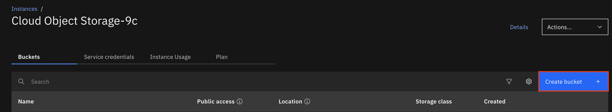

3. Click **Create** at the bottom of the **Create a Custom Bucket** tile.

4. Fill out the following for creating a custom bucket:
  - Enter a unique bucket name. The name must be unique across all IBM COS users, so use `watsonx-data-iceberg-<your initials or unique string>`.

  - Select the **Regional** tile for the Resiliency level.
  
  - Click the **Location** dropdown and select the location where you want your data to be stored; this lab guide uses **United States - Dallas (us-south)**, but you can choose whatever location you want.

  > **Note: Remember the resiliency and location you chose. You will need to provide this information later.**

  - Select the Standard tile for the Storage class.

  - Click the blue **Create bucket** button at the bottom of the page. **Do not change** anything else.

  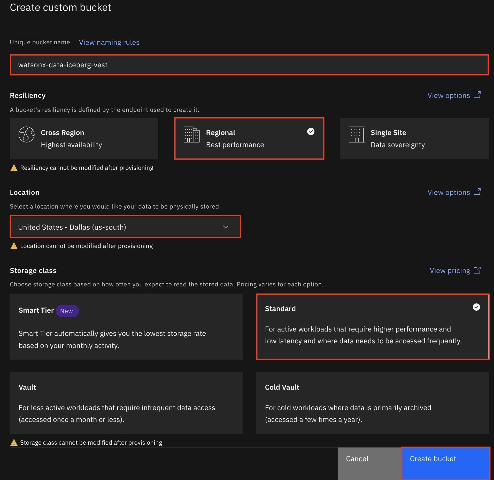

  > **Note: If you get the Enable Versioning for your Bucket pop-up, click Maybe Later.**

  Once the bucket is created, you will be brought to its administration page in the console.

5. Click your **Object Storage instance name** in the breadcrumbs in the top-left of the screen. This returns you to the main page for your object storage instance. You should be in the **Buckets** tab by default.

6. Repeat steps 2-4 to create another object storage bucket called `watsonx-data-hive-<your initials or unique string>` (remember that bucket names **must** be unique among all IBM COS users). Use the same resiliency and location that you specified for the first bucket.

7. Applications connect to COS through an endpoint URL. The endpoint URL you use in an application depends on the location where the data is stored. Select **Endpoints** from the left-side menu.

  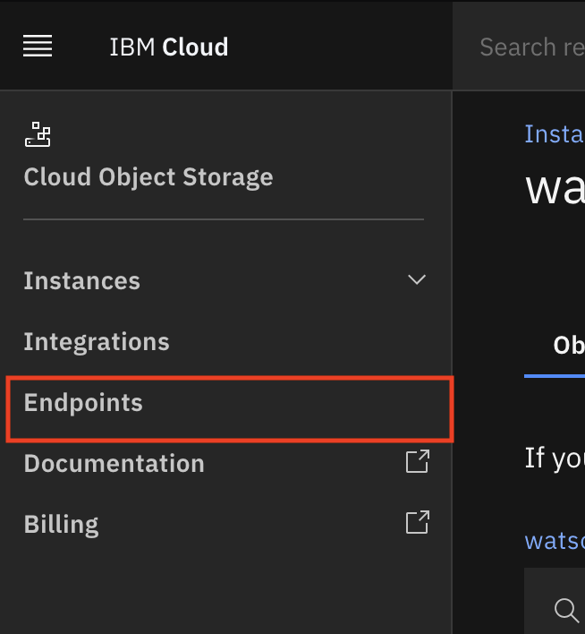

8. A list of endpoints for all regions are displayed. To filter the list, use the **Select resiliency** and **Select location** dropdown menus, and set them to the same values you used earlier when you created your two COS buckets; for example, **Regional** and **United States - Dallas (us-south)**. The only remaining endpoints you will now see are those associated with your region and location. Copy and paste the URL in the **Public** box to a location you can easily reference later. (To make this easier, there is a **Copy to clipboard** icon to the right of the URL.)

  

  <QuizAlert text="There is a quiz question related to how watsonx.data connects to IBM COS"/>

### Generate COS Credentials

For security purposes, any external application accessing object storage must provide a valid set of credentials. Specifically, an access key and a secret access key associated with the object storage instance must be provided.

1. While still in the **Endpoints** screen, scroll down to the bottom of the page. In the **Recommended actions** section, click **Get credentials** in the **Get an API key** tile.

  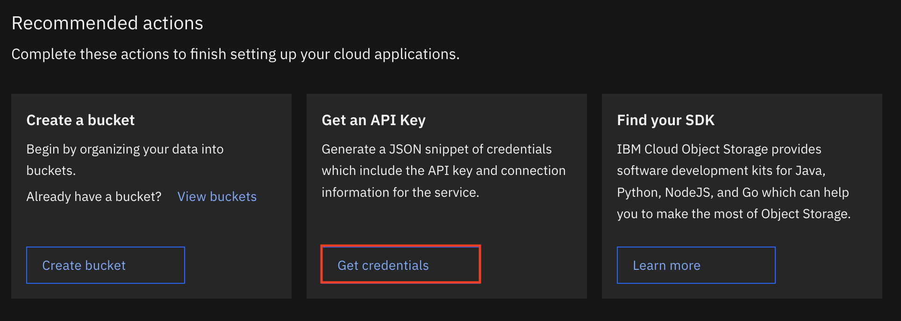

2. Click the blue **New Credential** button on the right.

  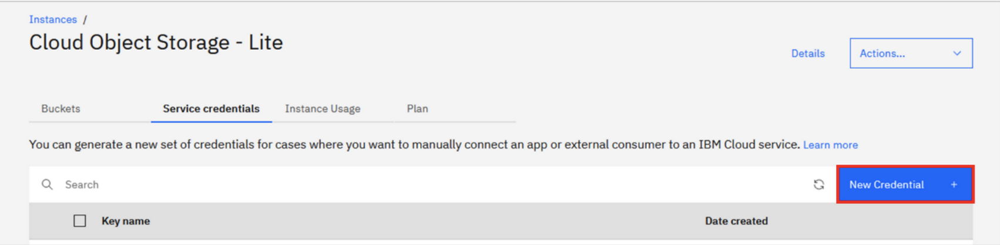

3. In the **Create Credentials** pop-up window, enter the following information, and then click the **Add** button:

  - **Name:** `watsonx.data-access`
  - **Role:** Manager (this provides the permissions that watsonx.data needs)
  - **Include HMAC Credential:** On

  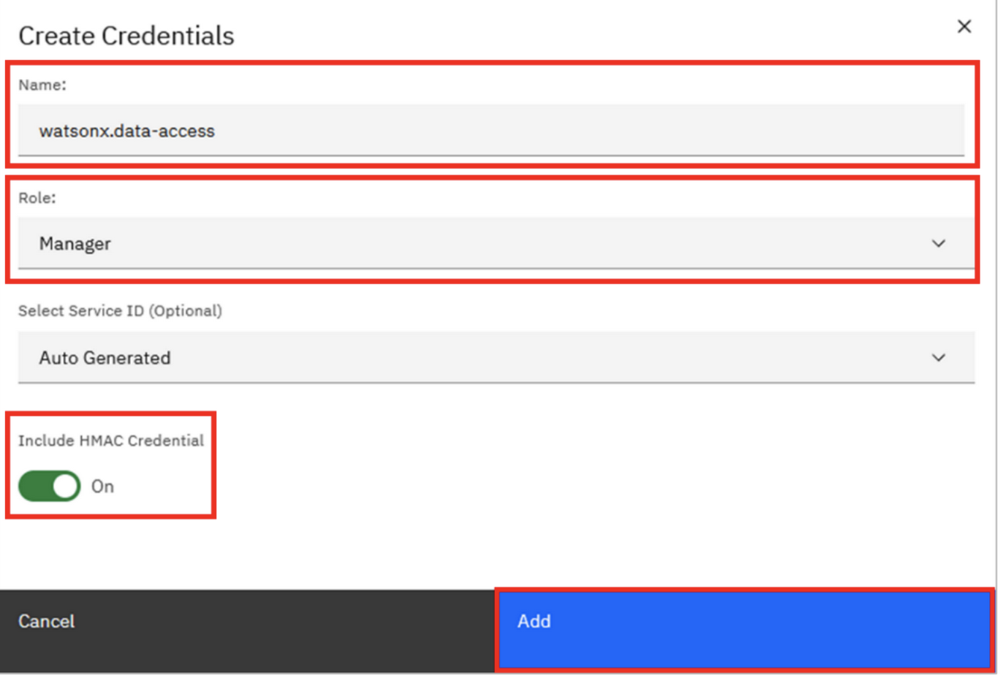

4. Find and expand the twisty for the new credentials you just created. Locate the **access_key_id** and **secret_access_key** fields. Copy and paste the key values for these fields (without the quotes) somewhere for safe keeping. You will need them in the next section.

  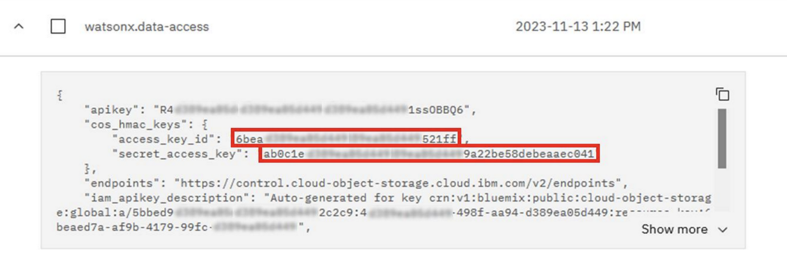

### Add COS Buckets to watsonx.data

With the two buckets created, they can now be added to watsonx.data.

1. Open the console (user interface) for your **watsonx.data environment** in a new browser window. Keep the IBM Cloud Object Storage console open in another window.

  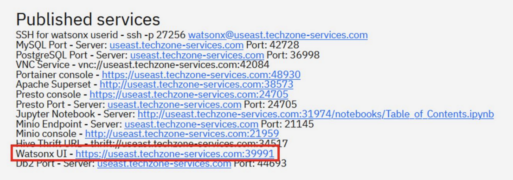

2. In the watsonx.data UI, select the **Infrastructure manager** icon on the left-side menu.

  

3. Click the **Add component** dropdown on the right side and select **Add bucket**.

  

4. In the **Add bucket** pop-up window, enter/select the following information to add the **Iceberg** bucket and then click **Add and activate now**:

  - **Bucket type:** IBM Cloud Object Storage
  - **Region:** Dallas (us-south) (or whatever location you created your bucket in)
  - **Bucket name:** `watsonx-data-iceberg-<your initials or unique string>` (this must match the name of the bucket you created in the previous section)
  - **Display name:** `cos-iceberg-bucket`
  - **Endpoint:** `https://s3.us-south.cloud-object-storage.appdomain.cloud` (or the endpoint you copied earlier; be sure to prefix it with https://)
  - **Access key:** **access_key_id** copied from the credentials you created earlier
  - **Secret key:** **secret_access_key** copied from the credentials you created earlier
  - **Connection status:** Click **Test connection**. If the connection test is successful, **Connection status** will show **Successful**. **Note:** If the test wasn’t successful then you’ll receive an error message as shown below with the reason for the failure. Re-enter all of the fields again and click **Retest** to test the connection again. The most common reasons for an error here are that you mistyped the name of your bucket or pasted one or both of the keys incorrectly.
  - **Activation:** Select **Activate now**
  - **Catalog type:** Apache Iceberg
  - **Catalog name:** `ibmcos_iceberg`

  Your bucket has been added to watsonx.data, but it needs to be associated with the Presto query engine before the bucket can be accessed by it.

  <QuizAlert text="There is a quiz question related to adding the connection to IBM COS"/>

5. In the **Catalogs** section, hover your mouse pointer over the **ibmcos_iceberg** tile and the **Manage associations** icon will appear. Click it.

  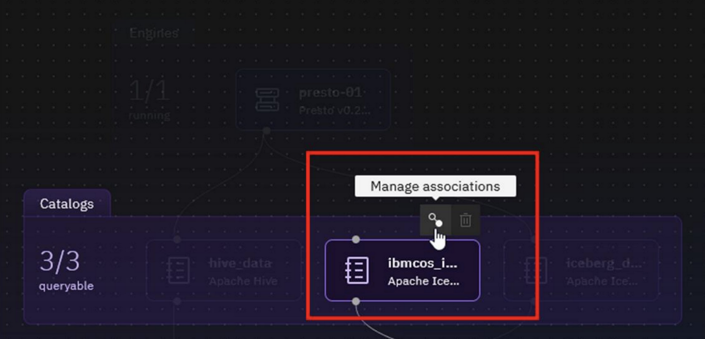

6. In the **Manage associations** pop-up window, select the checkbox for the **presto-01** engine and then click **Save and restart engine**. A line should now connect the **presto-01** tile in the **Engines** section with the **ibmcos_iceberg** tile in the **Catalogs** section. This connection indicates that the resources are now associated.

<QuizAlert text="There is a quiz question related to your database being accessible by the Presto query engine"/>

7. Repeat steps 3-6 to add the second **Hive** bucket to watsonx.data. Use the following information (differences between the previous instructions are “hive” instead of “iceberg”):

  - **Bucket type:** IBM Cloud Object Storage
  - **Region:** Dallas (us-south) (or whatever location you created your bucket in)
  - **Bucket name:** `watsonx-data-hive-<your initials or unique string>`
  - **Display name:** `cos-hive-bucket`
  - **Endpoint:** `https://s3.us-south.cloud-object-storage.appdomain.cloud` (or the endpoint you copied earlier, be sure to prefix it with https://)
  - **Access key:** **access_key_id** copied from the credentials you created earlier
  - **Secret key:** **secret_access_key** copied from the credentials you created earlier
  - **Connection status:** Click **Test connection**. If the connection test is successful, **Connection status** will show **Successful**.
  - **Activation:** Select **Activate now**
  - **Catalog type:** Apache Hive
  - **Catalog name:** `ibmcos_hive`

<QuizAlert text="There is a quiz question related to creating both Hive tables and Iceberg tables"/>

### Use COS Buckets in watsonx.data

In this section you will create a schema and table within each of the two catalogs you just added. The data associated with each catalog will reside in its corresponding object storage bucket.

#### Create a New Iceberg table

1. In the watsonx.data UI, select the **Data manager** icon on the left-side menu.

  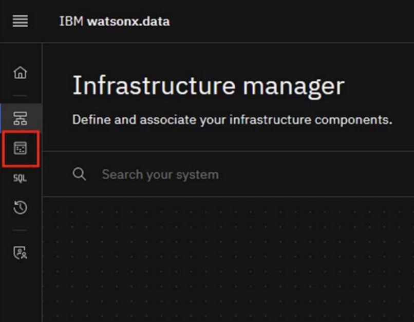

  You should see the two new catalogs listed.

  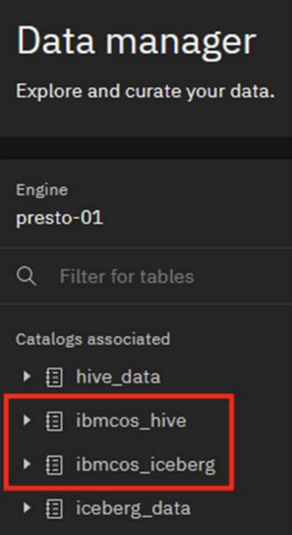

2. Click the **Create** dropdown menu and select **Create schema**.

  

3. In the **Create schema** pop-up window, select **ibmcos_iceberg** for the **Catalog** and enter `sales_schema` for the **Name**. The **Path** field is automatically set based on the schema name, but it can be overridden as needed. However, **do not change** it here. Now click the **Create** button.

4. In the watsonx.data UI, select the **Query workspace** icon on the left-side menu.

  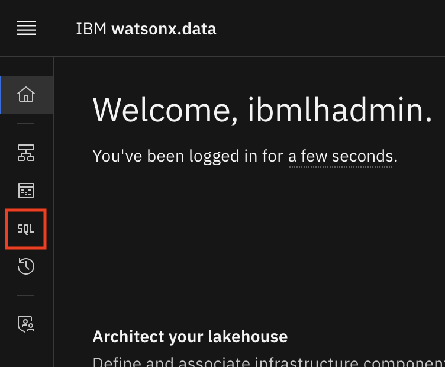

5. Clear the SQL editor and copy and paste the following SQL statements into it. Then click the **Run on presto-01** button on the right.

  ```sql
  CREATE TABLE "ibmcos_iceberg"."sales_schema"."sales" (seller_id INT, year INT, quarter INT, sales_amt DECIMAL (10,2));
  INSERT INTO "ibmcos_iceberg"."sales_schema"."sales" VALUES (1000, 2023, 3, 11435.34);
  INSERT INTO "ibmcos_iceberg"."sales_schema"."sales" VALUES (1000, 2023, 4, 16742.03);
  INSERT INTO "ibmcos_iceberg"."sales_schema"."sales" VALUES (1001, 2023, 3, 8623.78);
  INSERT INTO "ibmcos_iceberg"."sales_schema"."sales" VALUES (1001, 2023, 4, 19912.14);
  ```

6. After the statements in the previous step are finished running, select the **Data manager** icon on the left-side menu.

7. From the left-side navigation menu, select **ibmcos_iceberg** > **sales_schema** > **sales**. This shows the table you just created.

  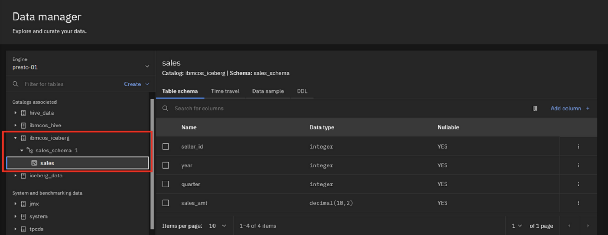

8. Switch to the **IBM Cloud Object Storage** console running in the other browser window you were instructed to leave open earlier.

9. Click on the **Instances** dropdown menu in the left-side menu and select your cloud object storage instance. (If you have multiple instances, select the one you used earlier in the lab.)

  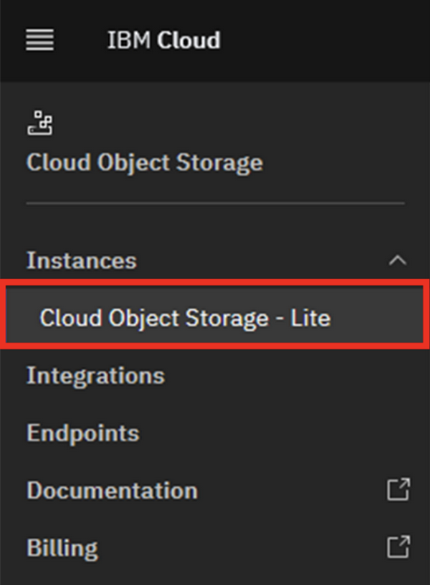

10. Find and click on the `watsonx-data-iceberg-<your initials or unique string>` bucket you created earlier. (Hint: You may want to use the filter above the bucket list if you have a lot of storage buckets.)

11. Note how there is now a folder called **sales_schema**. Click that folder to drill into it.

  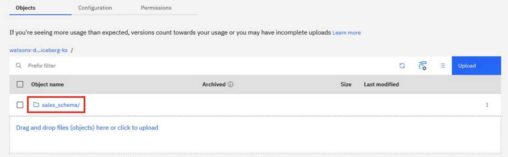

12. There is a folder in here called **sales**. This was created when you created the table in the watsonx.data console. The folder name matches the name of the table. Click the **sales** folder.

13. Within this folder are two subfolders that contain the **data** and **metadata** file associated with this Iceberg **sales** table. Feel free to explore these folders.

Congratulations! You have just experienced how you can create Iceberg tables in IBM Cloud Object Storage.

#### Create a Hive Table on Existing Cloud Object Storage Data

In this section you will create a Hive table based on a data file you upload into the Hive cloud object storage bucket you created earlier. You will also see how you can create an Iceberg version of that Hive table.

1. Locally on your computer, create a folder somewhere called **airline_schema** and within it create a subfolder called **aircraft**.

2. Download the **aircraft.parquet** file from [here](https://raw.githubusercontent.com/ibm-build-lab/VAD-VAR-Workshop/main/content/Watsonx/WatsonxData/files/aircraft.parquet) and place it into that **aircraft** subfolder on your computer. You should now have an **airline_schema** > **aircraft** > **aircraft.parquet** folder/file structure.

3. In the **IBM Cloud Object Storage** console, click on the **Instances** dropdown menu in the left-side menu and select your cloud object storage instance. (If you have multiple instances, select the one you used earlier in the lab.)

  

4. Find and select the `watsonx-data-hive-<your initials or unique string>` bucket.

5. This bucket should be empty. Click the blue **Upload** button on the right.

  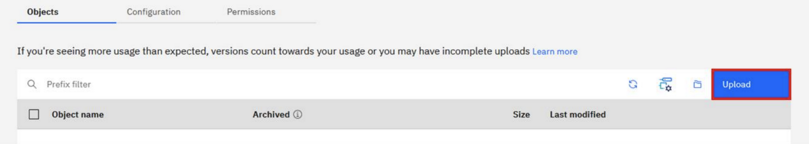

6. In the **Upload** box that appears on the right, scroll down to the **Upload files (objects)** section and click **Upload folders**.

  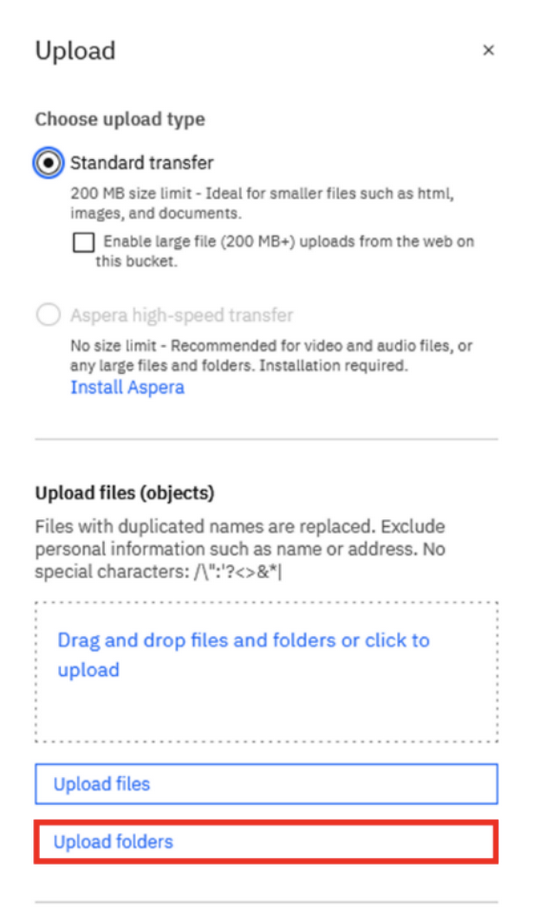

7. Locate the top-level **airline_schema** folder on your laptop (**not** the aircraft subfolder or the aircraft.parquet file within it) and select that folder for upload from your operating system’s dialog box.

8. Click the blue **Upload** button at the bottom-right to upload the folder you just selected (and its contents) into your object storage bucket. Now close any pop-up messages or notifications indicating the upload was successful.

9. The uploaded folders and file show as **airline_schema/aircraft/aircraft.parquet**. The **/** (forward slash) characters indicate path separators. Click the **Refresh** icon. The interface now shows as proper folders, and if you navigate down into the folders, you’ll find the **aircraft.parquet** file.

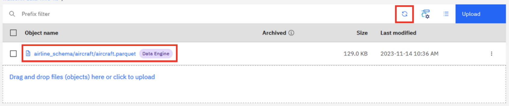

10. Switch back to the **watsonx.data console** and select the **Data manager** icon on the left-side menu.

11. Click on the **Create** dropdown menu and select **Create schema**.

  

12. In the **Create schema** pop-up window, select **ibmcos_hive** for the **Catalog** and enter `airline_schema` for the **Name** (this matches the name of the upper-level folder you just uploaded). Click the **Create** button.

13. Select the Query workspace icon on the left-side menu.

14. Run the following SQL statement to create the **aircraft** table on top of what was just uploaded. **Replace** the bucket name with the name of the Hive bucket you previously created. The table is made up of all Parquet files in the **airline_schema/aircraft** folder.

```sql
create table ibmcos_hive.airline_schema.aircraft
  (tail_number varchar,
  manufacturer varchar,
  model varchar)
with (format = 'Parquet',
  external_location='s3a://watsonx-data-hive-<your initials or unique string>/airline_schema/aircraft')
```
<QuizAlert text="There is a quiz question related to the SQL query table name"/>

15. Clear the SQL editor and run the following SQL statement:

  ```sql
  select * from ibmcos_hive.airline_schema.aircraft
  ```

  Note the data returned. This is coming directly from the Parquet file that you uploaded into object storage. Being able to access Hive files directly in watsonx.data is a great way to bring existing data into the watsonx.data lakehouse ecosystem.

16. Clear the SQL editor and run the following SQL statement to create a new schema in the Iceberg catalog. Replace the bucket name in the location string with the name of the Iceberg bucket you previously created.

  ```sql
  create schema ibmcos_iceberg.airline
    with (location = 's3a://watsonx-data-iceberg-<your initials or unique string>/airline/')
  ```

17. Clear the SQL editor and run the following SQL statement to create the new Iceberg version of the table.

  ```sql
  create table ibmcos_iceberg.airline.aircraft
    as select * from ibmcos_hive.airline_schema.aircraft;
  ```

  The result returned from running this statement is the number of rows inserted into the new table – which should be **13,101**.

  > **Note:** If you get an error stating that the airline schema does not exist, wait 10-20 secondsand try the CREATE TABLE statement above again.

Congratulations! You have just experienced how you can create Hive tables on top of existing data in IBM Cloud Object Storage.

## Amazon Web Services S3

> **Note:** Amazon S3 is available in many different worldwide locations. The instructions in this lab use the **US East (N. Virgina) us-east-1** location, but you can use a different region that is physically closer to you instead.

### Create S3 Buckets

Just like you did in the IBM Cloud Object Storage section, you will create two object storage buckets now in Amazon S3. The first (**watsonx-data-aws-iceberg**) will be used to hold new Iceberg tables that you create. The second (**watsonx-data-aws-hive**) will be used for a Hive table, based on a file you upload. You are provided with instructions for creating one bucket and these instructions can then be repeated for the second one (but pay attention to the subtleties of the differences the second time around).

1. Login to the Amazon S3 service **[here](https://s3.console.aws.amazon.com)**

2. Click the orange **Create bucket** button on the right. **Note:** If you’ve created buckets in your S3 account in the past then you will not see the screen below. Instead, you will be brought to the page listing your existing buckets. There is also an orange **Create bucket** button here, so click that.

  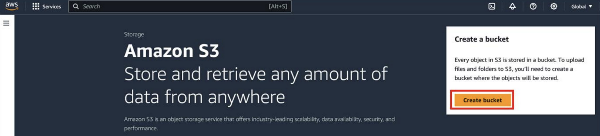

3. In the **Create bucket** page, enter the following information in the **General configuration** section:

  - **Bucket name:** `watsonx-data-aws-iceberg-<your initials or unique string>`
  - **AWS region:** **US East (N. Virgina) us-east-1** (or your preferred location)

  >**Note:** Just like with IBM Cloud Object Storage, bucket names must be unique within the global namespace for S3. Also, the bucket names you specify should be unique in regard to what you created in IBM Cloud Storage as well, since they need to be uniquely identifiable within watsonx.data too.

4. Scroll down to the **Block Public Access** settings for this bucket section. Deselect the **Block all public access** checkbox. Once unchecked, at the bottom of this section will be a warning asking you to acknowledge allowing public access. Select the **I acknowledge** message. In practice you may want to control access through access control lists and policies, but for simplicity in this lab, this bucket will be open to the public (but still secured through credentials that must be provided by any S3 consumers).

  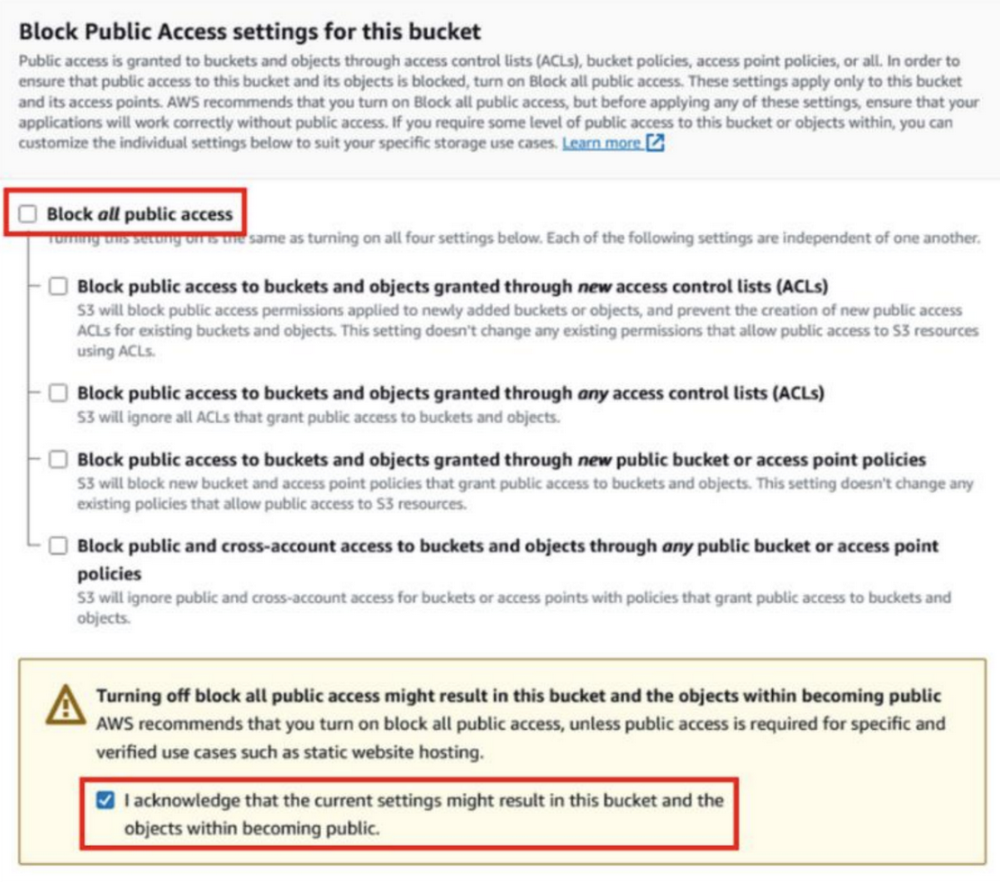

5. Scroll down to view the remaining configuration options. **Do not change** anything else. Click the orange **Create bucket** button at the bottom of this page. Once your bucket is created (you will see a green success message), you will be brought to the **Buckets** page in the console, where you can work with your buckets.

6. Click the orange **Create bucket** button on the right. Repeat steps 3-5 to create another object storage bucket called `watsonx-data-aws-hive-<your initials or unique string>` (remember that bucket names must be unique within the S3 global namespace). Use the same location that you specified for the first bucket.

  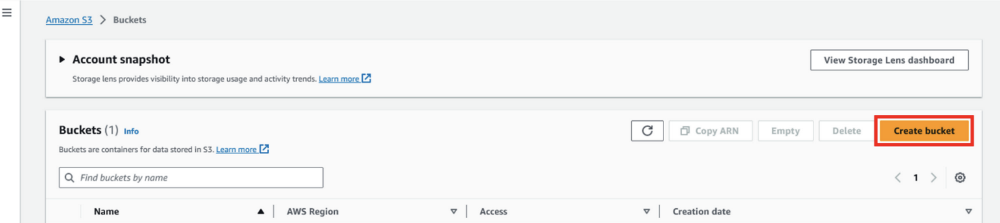

7. Applications connect to an S3 bucket through an endpoint URL. This URL depends on the location where the data is stored. Find the endpoint for your bucket location **[here](https://docs.aws.amazon.com/general/latest/gr/s3.html)** and copy it to a location you can easily reference later. For the example in this lab guide, the location is **US East (N. Virgina) us-east-1**, which the Amazon documentation notes to use the `s3.us-east-1.amazonaws.com` endpoint URL.

### Generate S3 Credentials

1. Click on **your name** (it’s a dropdown menu) in the upper-right corner of the page and then select **Security credentials**.

  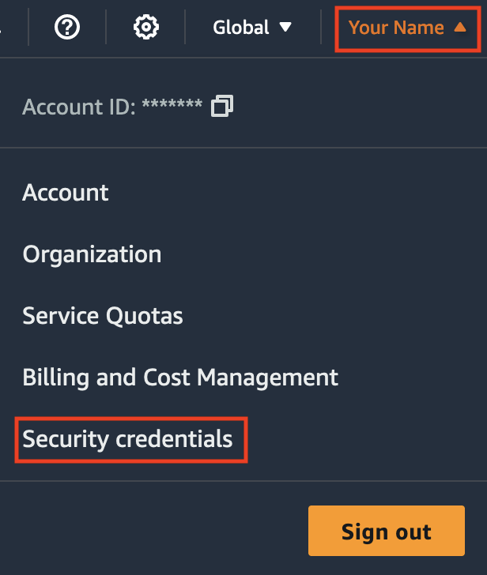

2. Scroll down to the **Access keys** section. Click the **Create access key** button.

  

  > **Note:** If the account you are logging in with is considered a “root user” account, you will be prompted to acknowledge that you are creating a root user access key. Select the **I understand** checkbox and then click the orange **Create access key** button.

3. The newly generated credentials are displayed, which include an **Access key** and a **Secret access key**. Copy both the **Access key** and **Secret access key** to somewhere safe for future reference (you will need them in the next section). It’s important you realize that you can only view the secret access key now at this very moment. You will not be able to see it again later, and so it **must** be copied somewhere for safe keeping (alternatively, you can download the keys as a CSV file). Once the two values are copied off, click the orange **Done** button.

<QuizAlert text="There is a quiz question related to the AWS S3 credentials"/>

### Add S3 Buckets to watsonx.data

1. Open the watsonx.data console (user interface) in a new browser window. Do not close the Amazon S3 console; leave it open in another window.

2. In the watsonx.data UI, select the **Infrastructure manager** icon on the left-side menu.

  

3. Click the **Add component** dropdown on the right side and select **Add bucket**.

  

4. In the **Add bucket** pop-up window, enter/select the following information to add the **Iceberg** bucket and then click **Add and activate now**::

  - **Bucket type:** Amazon S3
  - **Region:** US East (N. Virginia) (or whatever location you created your bucket in)
  - **Bucket name:** `watsonx-data-aws-iceberg-<your initials or unique string>`
  - **Display name:** `s3-iceberg-bucket`
  - **Endpoint:** `https://s3.us-east-1.amazonaws.com` (or the endpoint you copied earlier, be sure to prefix it with https://)
  - **Access key:** **access_key_id** copied from the credentials you created earlier
  - **Secret key:** **secret_access_key** copied from the credentials you created earlier
  - **Connection status:** Click **Test connection**. If the connection test is successful, **Connection status** will show **Successful**. **Note:** If the test wasn’t successful then you’ll receive an error message as shown below with the reason for the failure. Re-enter all of the fields again and click **Retest** to test the connection again. The most common reasons for an error here are that you mistyped the name of your bucket or pasted one or both of the keys incorrectly.
  - **Activation:** Select **Activate now**
  - **Catalog type:** Apache Iceberg
  - **Catalog name:** `s3_iceberg`

5. In the **Catalogs** section, hover your mouse pointer over the **s3_iceberg** tile and the **Manage associations** icon will appear. Click it.

  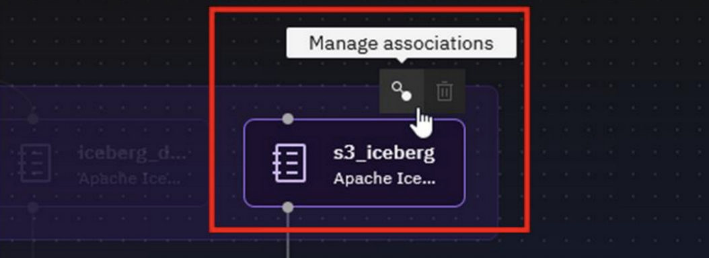

6. In the **Manage associations** pop-up window, select the checkbox for the **presto-01** engine and then click **Save and restart engine**. A line should now connect the **presto-01** tile in the **Engines** section with the **s3_iceberg** tile in the **Catalogs** section. This connection indicates that the resources are now associated.

7. Repeat steps 3-6 to add the second **Hive** bucket to watsonx.data. Use the following information (differences between the previous instructions are “hive” instead of “iceberg”):

  - **Bucket type:** Amazon S3
  - **Region:** US East (N. Virginia) (or whatever location you created your bucket in)
  - **Bucket name:** `watsonx-data-aws-hive-<your initials or unique string>`
  - **Display name:** `s3-hive-bucket`
  - **Endpoint:** `https://s3.us-east-1.amazonaws.com` (or the endpoint you copied earlier, be sure to prefix it with https://)
  - **Access key:** **access_key_id** copied from the credentials you created earlier
  - **Secret key:** **secret_access_key** copied from the credentials you created earlier
  - **Connection status:** Click **Test connection**. If the connection test is successful, **Connection status** will show **Successful**.
  - **Activation:** Select **Activate now**
  - **Catalog type:** Apache Hive
  - **Catalog name:** `s3_hive`

### Use S3 Buckets in watsonx.data

In this section you will create a schema and table within each of the two catalogs you just added. The data associated with each catalog will reside in its corresponding object storage bucket. These steps are very similar to the steps you followed earlier in the IBM Cloud Object Storage section (using the same schemas, tables, and data). The only differences are in regard to the Amazon S3 console and the specification of the S3-specific catalogs and buckets.

#### Create a New Iceberg table

1. Select the **Data manager** icon on the left-side menu. You should see the two new S3-related catalogs listed.

  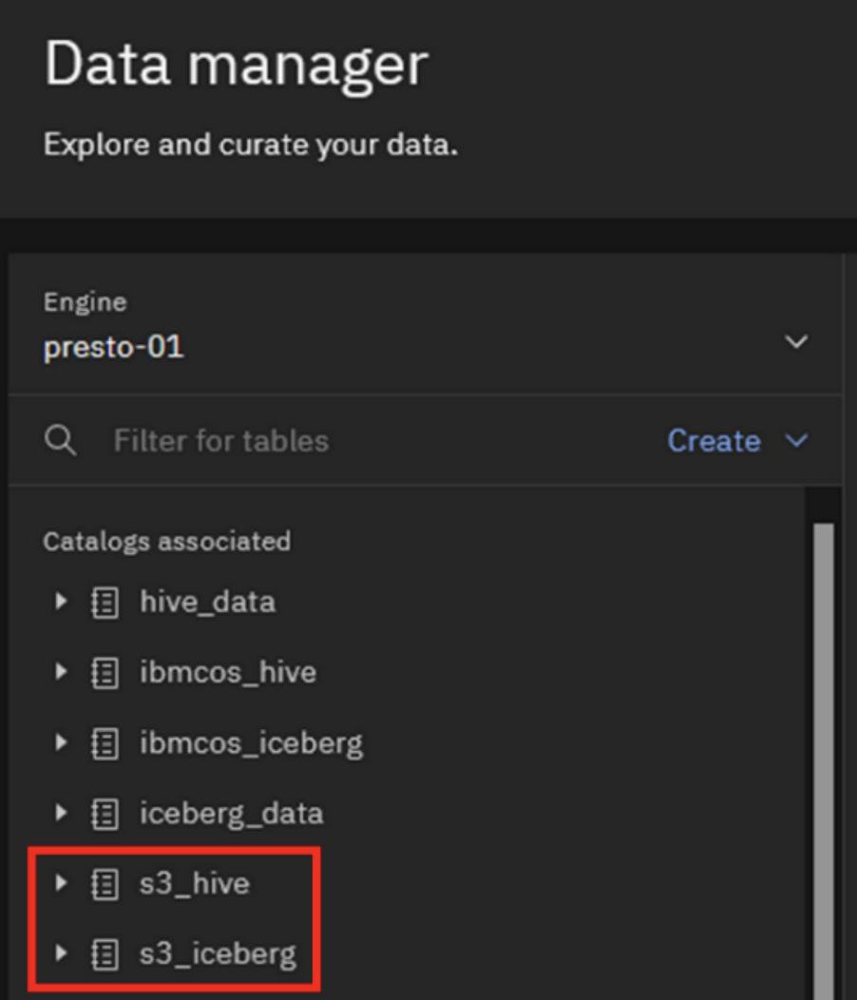

2. Click the **Create** dropdown menu and select **Create schema**.

  

3. In the **Create schema** pop-up window, select **s3_iceberg** for the **Catalog** and enter `s3_sales_schema` for the **Name**. The **Path** field is automatically set based on the schema name, but it can be overridden as needed. However, **do not change** it here. Now click the **Create** button.

4. In the watsonx.data UI, select the **Query workspace** icon on the left-side menu.

  

5. Clear the SQL editor and copy and paste the following SQL statements into it. Then click the **Run on presto-01** button on the right.

  ```sql
  CREATE TABLE "s3_iceberg"."s3_sales_schema"."sales" (seller_id INT, year INT, quarter INT, sales_amt DECIMAL (10,2));
  INSERT INTO "s3_iceberg"."s3_sales_schema"."sales" VALUES (1000, 2023, 3, 11435.34);
  INSERT INTO "s3_iceberg"."s3_sales_schema"."sales" VALUES (1000, 2023, 4, 16742.03);
  INSERT INTO "s3_iceberg"."s3_sales_schema"."sales" VALUES (1001, 2023, 3, 8623.78);
  INSERT INTO "s3_iceberg"."s3_sales_schema"."sales" VALUES (1001, 2023, 4, 19912.14);
  ```

6. After the statements in the previous step are finished running, select the **Data manager** icon on the left-side menu.

7. From the left-side navigation menu, select **s3_iceberg** > **s3_sales_schema** > **sales**. This shows the table you just created.

  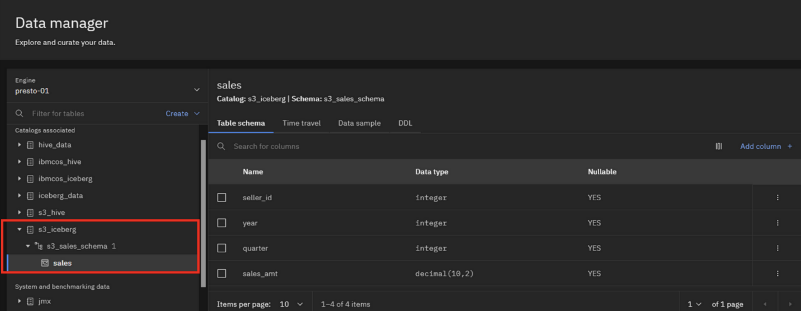

8. Switch to the **Amazon S3** console running in the other browser window you were instructed to leave open earlier. To see your list of buckets, go **[here](https://s3.console.aws.amazon.com/s3/buckets)**

9. Find and click on the `watsonx-data-aws-iceberg-<your initials or unique string>` bucket you created earlier.

10. Note how there is now a folder called **s3_sales_schema**. Click that folder to drill into it.

  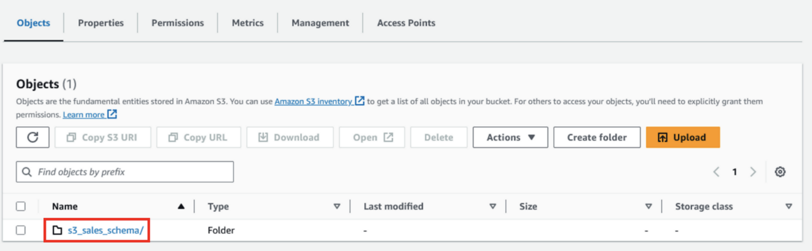

11. There is a folder in here called **sales**. This was created when you created the table in the watsonx.data console. The folder name matches the name of the table. Click the **sales** folder.

12. Within this folder are two subfolders that contain the **data** and **metadata** file associated with this Iceberg **sales** table. Feel free to explore these folders.

Congratulations! You have just experienced how you can create Iceberg tables in Amazon S3 object storage.

#### Create a Hive Table on Existing S3 Object Storage Data

In this section you will create a Hive table based on a data file you upload into the Hive bucket you created earlier. You will also see how you can create an Iceberg version of the Hive table.

1. In the **Amazon S3 console** where you were previously working with the Iceberg bucket, click **Buckets** in the breadcrumbs at the top of the page. This returns you to the main **Buckets** page.

  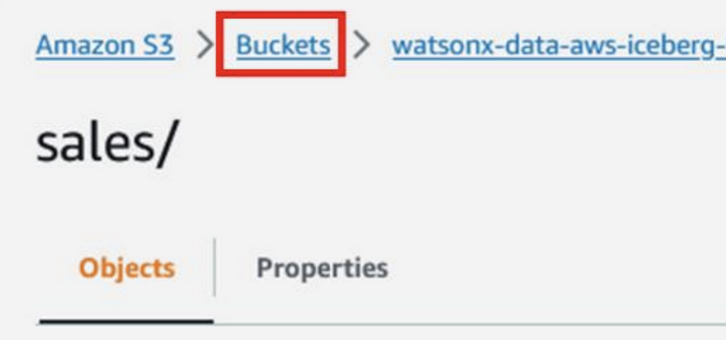

2. Find and click the `watsonx-data-aws-hive-<your initials or unique string>` bucket.

3. This bucket should be empty. Click the **Create folder** button.

  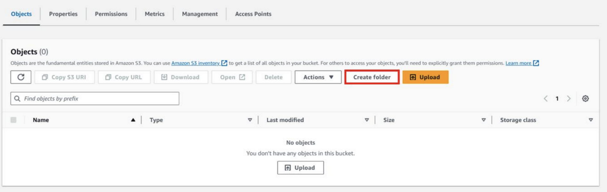

4. In the **Create folder** page, enter `s3_airline_schema` for the **Folder nam**e**. Then scroll down to the bottom of the page and click the orange **Create folder** button.

5. Click on the new **s3_airline_schema** folder to drill into that folder and then follow the previous two steps to create a child folder within the **s3_airline_schema** folder you just created called `aircraft`.

6. Click on the new **aircraft** folder to drill into that folder. Now, click the **Upload** button at the bottom (or the orange **Upload** button on the right).

  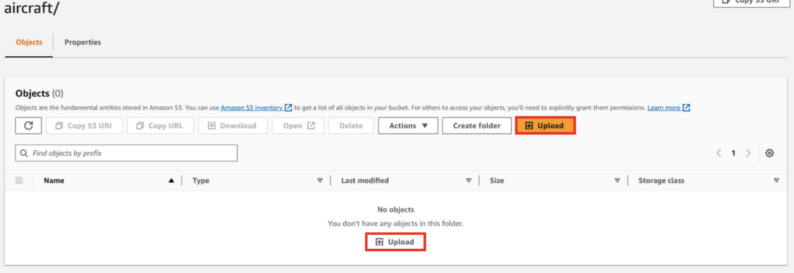

7. In the **Upload** page, click the **Add files** button.

8. Locate and upload the **aircraft.parquet** file you downloaded previously for IBM COS (**do not** select the top-level folder as you did in the IBM COS case, but the actual Parquet file itself).

9. Scroll down to the bottom of the **Upload** page and click the orange **Upload** button. The **aircraft.parquet** file now resides in object storage.

10. Switch back to the watsonx.data console and select the **Data manager** icon on the left-side menu.

11. Click on the **Create** dropdown menu and select **Create schema**.

12. In the **Create schema** pop-up window, select **s3_hive** for the **Catalog** and enter `s3_airline_schema` for the **Name**. Now click the **Create** button.

13. Select the **Query workspace** icon on the left-side menu.

14. Run the following SQL statement to create the **aircraft** table on top of what was just uploaded. **Replace** the bucket name with the name of the Hive bucket you previously created. The table is made up of all Parquet files in the **airline_schema/aircraft** folder.

  ```sql
  create table s3_hive.s3_airline_schema.aircraft
    (tail_number varchar,
    manufacturer varchar,
    model varchar)
  with (format = 'Parquet',
    external_location='s3a://watsonx-data-aws-hive-ks/s3_airline_schema/aircraft')
  ```

15. Clear the SQL editor and run the following SQL statement:

  ```sql
  select * from s3_hive.s3_airline_schema.aircraft
  ```

  Note the data returned. This is coming directly from the Parquet file that you uploaded into object storage. Being able to access Hive files directly in watsonx.data is a great way to bring existing data into the watsonx.data lakehouse ecosystem.

16. Clear the SQL editor and run the following SQL statement to create a new schema in the Iceberg catalog. Replace the bucket name in the location string with the name of the Iceberg bucket you previously created.

  ```sql
  create schema s3_iceberg.s3_airline
    with (location = 's3a://watsonx-data-aws-iceberg-ks/s3_airline/')
  ```

17. Clear the SQL editor and run the following SQL statement to create the new Iceberg version of the table.

  ```sql
  create table s3_iceberg.s3_airline.aircraft
    as select * from s3_hive.s3_airline_schema.aircraft;
  ```

  The result returned from running this statement is the number of rows inserted into the new table – which should be **13,101**.

  > **Note:** If you get an error stating that the airline schema does not exist, wait 10-20 secondsand try the CREATE TABLE statement above again.

Congratulations! You have just experienced how you can create Hive tables on top of existing data in Amazon S3 object storage.

## Combining Everything Together

If you followed all of the instructions in this lab, you now have Hive tables and Iceberg tables in both IBM COS and Amazon S3 object storage.

A benefit of watsonx.data is that you can access and combine data from your different data sources, leaving the data where it resides. This includes object storage, but it also includes other data sources and databases.

To showcase this, the steps below will query the various types of tables across both object storage (IBM and Amazon) platforms.

1. In the watsonx.data UI, select the **Query workspace** icon on the left-side menu.

2. Run the following SQL statement:

  ```sql
  select * from ibmcos_hive.airline_schema.aircraft
    union all
  select * from ibmcos_iceberg.airline.aircraft
    union all
  select * from s3_hive.s3_airline_schema.aircraft
    union all
  select * from s3_iceberg.s3_airline.aircraft
  order by tail_number;
  ```

  The results returned from this query are coming from all four of the source data sources. The source data did not need to be moved or copied into watsonx.data. This is a very powerful capability of watsonx.data.

### Congratulations, you have reached the end of lab 202.

Click, [IBM watsonx.data](/watsonx/watsonxdata) to go to the IBM watsonx.data home page.
