# 201: Apache Spark con watsonx.data

Este laboratorio muestra cómo IBM watsonx.data puede integrarse con Apache Spark como motor de consulta. El entorno de laboratorio utiliza la imagen watsonx.data Developer Edition en un entorno aprovisionado de IBM TechZone. Puede encontrarlo aquí:

https://techzone.ibm.com/collection/ibm-watsonxdata-developer-base-image/environments

Para los ejercicios de este laboratorio, Apache Spark se ejecuta por separado dentro de la imagen (no formaba parte del producto en el momento en que se escribió este laboratorio; este documento se actualizará cuando lo haga). Las ofertas IBM watsonx.data Software as a Service (SaaS) de watsonx.data en IBM Cloud y Amazon Web Services (AWS), requieren que Apache Spark se aprovisione como un servicio independiente[(IBM Analytics Engine](https://cloud.ibm.com/catalog/services/analytics-engine) es el servicio Apache Spark en IBM Cloud).

Este laboratorio requiere que tenga un entorno watsonx.data ya instalado y en funcionamiento. Consulte la sección Requisitos previos e introducción para obtener más información.

Watsonx.data se está desarrollando y publicando de forma ágil. Además de añadir nuevas funciones, es probable que la interfaz web cambie con el tiempo. Por lo tanto, es posible que las capturas de pantalla utilizadas en este laboratorio no sean siempre exactamente iguales a lo que se ve.

## Obtener ayuda

**Ayuda de la guía de laboratorio**: Si necesita ayuda para interpretar alguno de los pasos de este laboratorio, publique sus preguntas en el canal de Slack #data-ai-demo-feedback (solo para IBMers). Los Business Partners pueden solicitar ayuda en el sitio web de Partner Plus Support.

**Entorno** TechZone: Si se encuentra con algún problema relacionado con el entorno TechZone que se utiliza en este laboratorio, incluida la imposibilidad de aprovisionar un entorno, consulte la página de [ayuda de TechZone](https://techzone.ibm.com/help).

**watsonx**.data: La asistencia con el propio producto watsonx.data está disponible en el canal de Slack #watsonxdata-lakehouse-discussion-open-to-all-ibmers (solo IBMers). Además, consulte la documentación de watsonx.data según sea necesario (SaaS, software).

## Primeros pasos

1.  Copie el contenido necesario de los detalles del entorno de IBM TechZone **"Servicios publicados"** en un documento de texto para poder acceder fácilmente a la información durante el ejercicio de laboratorio. La siguiente información es necesaria para este laboratorio Spark:

*   **SSH para watsonx ID de usuario** - `ssh -p 00000 watsonx@region.techzone-services.com`donde `00000` es el número de puerto y `region` es la región que coincide con la reserva de IBM TechZone valores proporcionados.
*   **Jupyter Notebook Server** - `http://region.techzone-services.com:00000/notebooks/Table_of_Contents.ipynb` donde `00000` es el número de puerto que coincide con el valor proporcionado por la reserva de IBM TechZone.

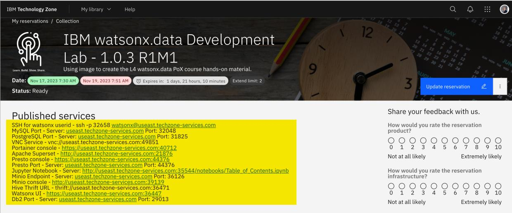

## Iniciar watsonx.data

1.  Abra una ventana de terminal en su ordenador portátil e introduzca el comando SSH watsonx.data proporcionado en la información sobre **"Servicios publicados"** de su reserva de TechZone.
2.  El comando SSH es:

```bash
ssh -p watsonx@region.techzone-services.com
```

> El número de puerto y la información de la región deben coincidir con los servicios de reserva de IBM TechZone que se le han proporcionado para que funcione el comando SSH

> Si se le pregunta si desea proporcionar una huella digital, escriba **sí**. Esto cerrará la conexión SSH. Introduzca el comando de nuevo y este mensaje no se repetirá.

Introduzca **watsonx.data** como contraseña cuando se le solicite. Esta contraseña que escriba será invisible en el terminal.

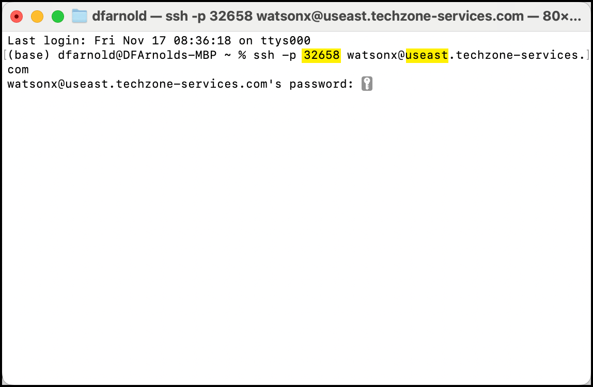

3.  Introduce el comando `sudo su -` para cambiar tu usuario actual a root
4.  Como usuario root, cambie el directorio actual a la ruta `/root/ibm-lh-dev/bin`

```bash
sudo su -
cd /root/ibm-lh-dev/bin
```

> Después de cambiar al usuario root, verá el prefijo root en cada línea de comandos y el símbolo # precediendo la línea de comandos. Por ejemplo:

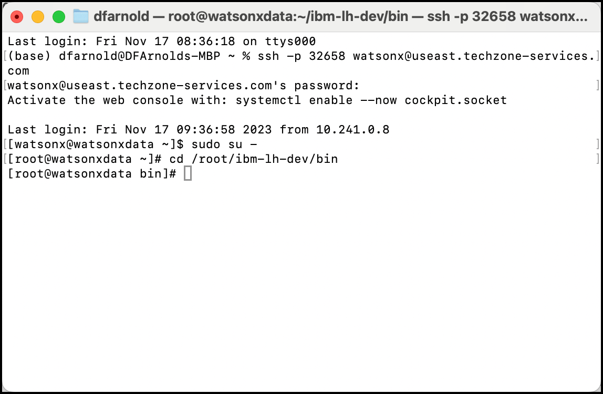

5.  Compruebe el estado de watsonx.data para asegurarse de que todo se ha iniciado y se está ejecutando introduciendo el comando `./status.sh --all`.

> Hay dos guiones ("-") delante de la palabra clave "all".

```bash
./status.sh --all
```

6.  La salida de la línea de comandos debería ser comparable a la del ejemplo siguiente (si se amplía la ventana del terminal, la salida será más legible). Si todos los servicios aparecen como *ejecutándose*, watsonx.data se ha iniciado correctamente.

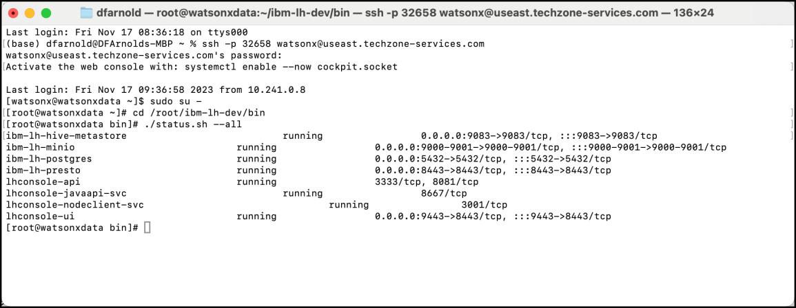

7.  **Mantenga abierta la ventana del terminal** y continúe con la siguiente sección del ejercicio.

## Iniciar el índice de Jupyter Notebook

La imagen de IBM TechZone contiene una tabla de contenidos de Jupyter Notebook que facilita el acceso al cuaderno Apache Spark utilizado en este laboratorio.

1.  Abra un navegador web (Google Chrome y Mozilla Firefox han sido probados y funcionan con este laboratorio) y vaya a la **URL de Jupyter Notebook - Servidor** que registró anteriormente desde la sección **Servicios publicados** de su reserva de TechZone.

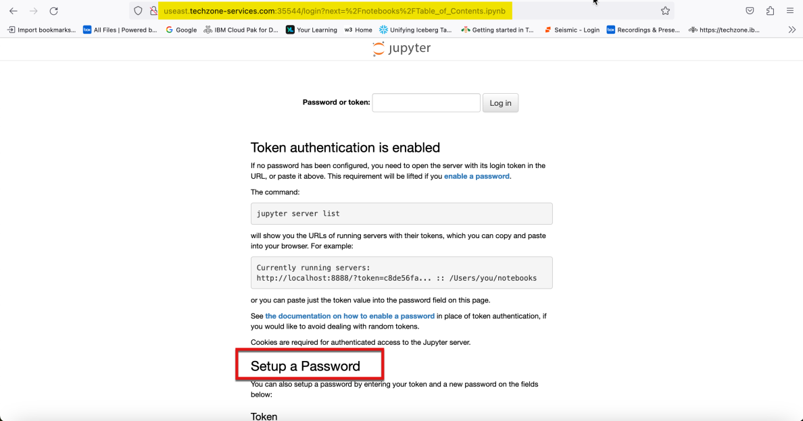

2.  Desplácese hasta la parte inferior de la ventana del navegador hasta que vea la sección **Configurar una** contraseña. La ventana de su navegador debería mostrar ahora los campos **"Token"** y " **Nuevas contraseñas** " junto con un botón para **iniciar sesión y establecer una nueva contraseña**. Deje la ventana del navegador abierta y continúe con el siguiente paso.

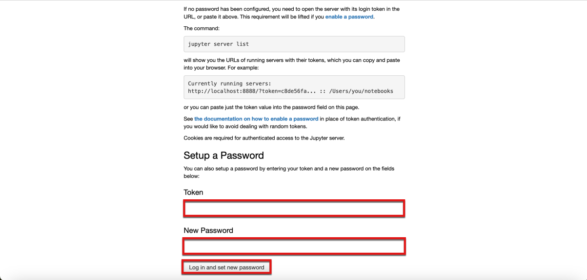

3.  Vuelva a la ventana de terminal que se le indicó que mantuviera abierta anteriormente. Introduzca el comando `jupyter server list`

```bash
jupyter server list
```

4.  Copie el valor del token del primer elemento de la salida del comando

> El valor del token es **watsonx.data**


5.  Vuelva a la ventana del navegador que se le indicó que mantuviera abierta y escriba el **mismo** valor de token en los campos **Token** y **New** Password de la ventana del navegador. A continuación, seleccione el botón **Iniciar sesión y establecer nueva** contraseña.

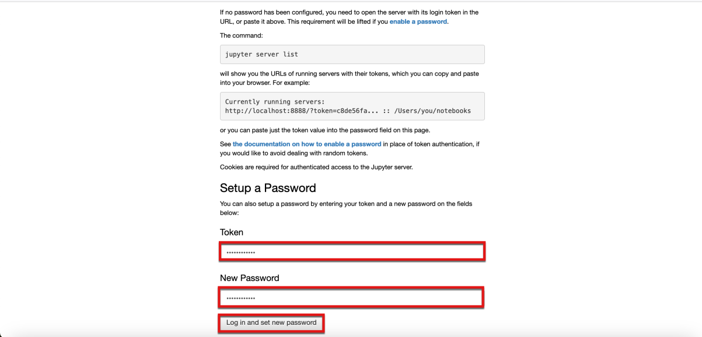

6.  Ahora se muestra el índice Jupyter de este laboratorio.


1.  Desplácese hacia abajo hasta la sección del índice **"Acceso a watsonx.data con Python, Pandas y Apache Spark"**. Haga clic en la flecha azul de la parte inferior derecha de la ficha **"Acceso a watsonx.data con Spark"**.

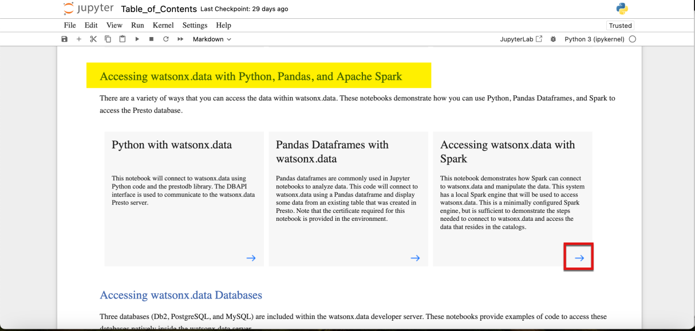

8.  El Jupyter Notebook para este laboratorio que tiene el código Spark se muestra ahora en la ventana del navegador. La segunda sección, **Watsonx.data Development Systems Updates**, detalla todos los elementos que se cambiaron para permitir que Apache Spark se ejecute en la imagen watsonx.data Development Lab. Dado que esta es la imagen que se está utilizando para este ejercicio de laboratorio, estos cambios ya están en efecto, y no hay nada que tengas que hacer para ejecutar Spark en este cuaderno.

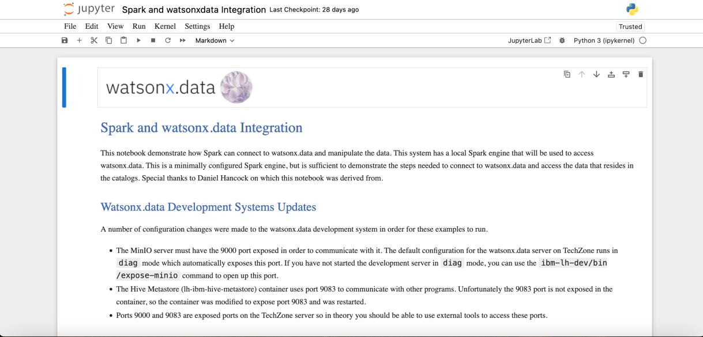

## Uso de Apache Spark en un cuaderno Jupyter con watsonx.data

En esta sección, los flujos de trabajo y comandos de Apache Spark se ejecutarán dentro de un Jupyter Notebook con watsonx.data como lakehouse.

1.  Desplácese hacia abajo hasta la sección **Copiar bibliotecas Spark**. Observa cómo las celdas ejecutables (código) de los cuadernos Jupyter se resaltan con un rectángulo gris.

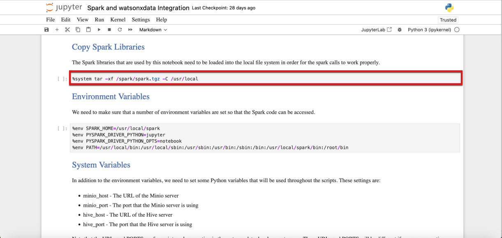

2.  Una celda de Jupyter Notebook puede ejecutarse utilizando dos métodos:

*   Ejecutar celdas individuales haciendo clic en el **icono Ejecutar** (parece un botón de reproducción) de la barra de menús situada en la parte superior del cuaderno.
*   Ejecutar todo el cuaderno pulsando el icono **Avance rápido**

> Como alternativa al icono de menú, también se puede ejecutar una sola celda utilizando la macro de las teclas **Mayús + Intro** mientras la celda está seleccionada.

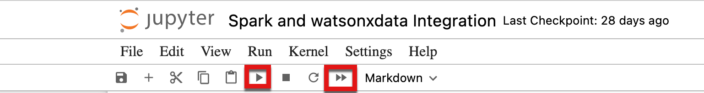

3.  Seleccione la primera celda de código. Observe que la posición actual de la celda se resalta con una barra azul sólida a la izquierda de la celda.

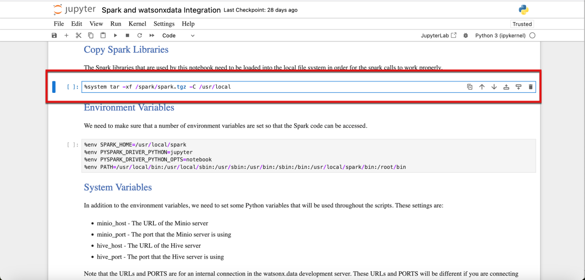

4.  Ejecuta esta primera celda de código

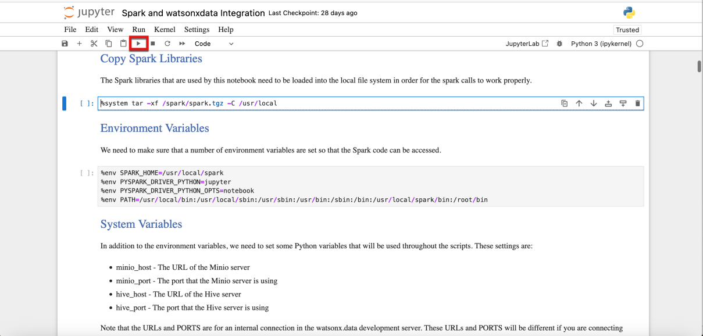

5.  Después de ejecutar una celda de código, debería notar dos diferencias en la celda de código del cuaderno:

*   El **\[]** a la izquierda de la celda cambiará a **\[\*]** durante su ejecución.
*   Cuando finaliza la ejecución, la celda cambia a **\[n]**, donde el número (n) equivale al orden en que se ejecutaron las celdas
*   La salida se muestra directamente debajo de la celda de código (si se produce un error o una advertencia, también se mostrarán debajo de la celda).

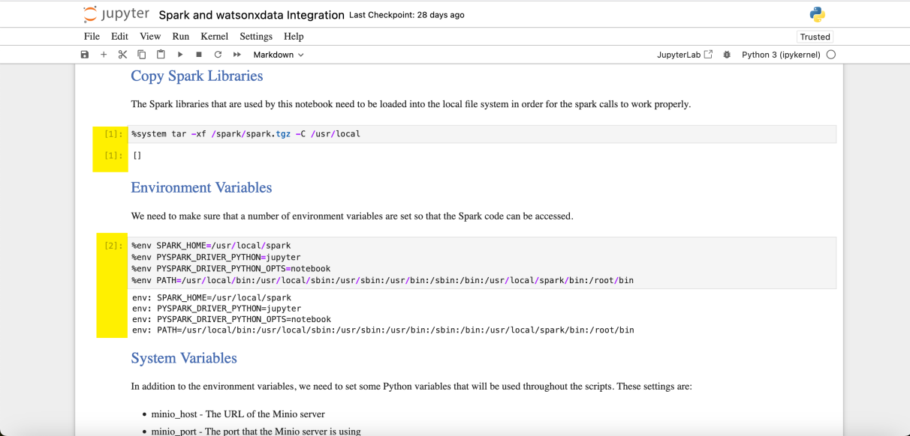

6.  Ejecute todas las celdas de código restantes en orden dentro del cuaderno Jupyter, esperando a que se complete cada celda antes de ejecutar la siguiente celda de código.

<QuizAlert text="Hay una pregunta de prueba relacionada con las tareas que se pueden realizar con Spark Engine." />

> La mejor práctica es esperar hasta que el **[\*]** de las celdas de código que se están ejecutando cambie a un número que indique que el procesamiento de la celda ha finalizado. Esto se debe a que algunas celdas dependen de la salida de celdas anteriores. Por ejemplo, si se necesita una librería Python para una función, hasta que la librería no esté cargada, intentar llamar a la función fallará.

> Ejecutar celdas de marcado (texto o documentación) dentro de un cuaderno está bien, pero no habrá salida ni tiempo de ejecución asignado a este tipo de celdas.

Para tener una idea de lo que estas celdas están haciendo al crear las diferentes tablas a través de SQL aquí hay una captura de pantalla del **gestor de datos** dentro de la consola web watsonx.data después de ejecutar las celdas:

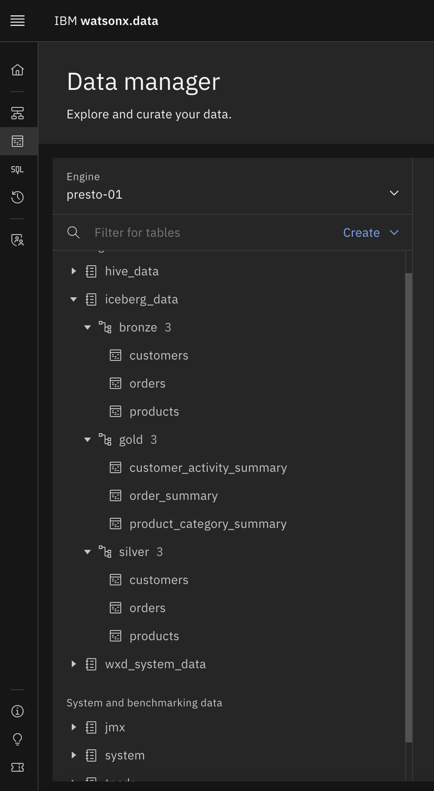

Este Jupyter Notebook creó buckets, tablas, cargó datos y realizó consultas usando Spark. El producto final de la ejecución del notebook limpia el entorno, se limpiará todo el trabajo realizado y se borrará el bucket de almacenamiento.

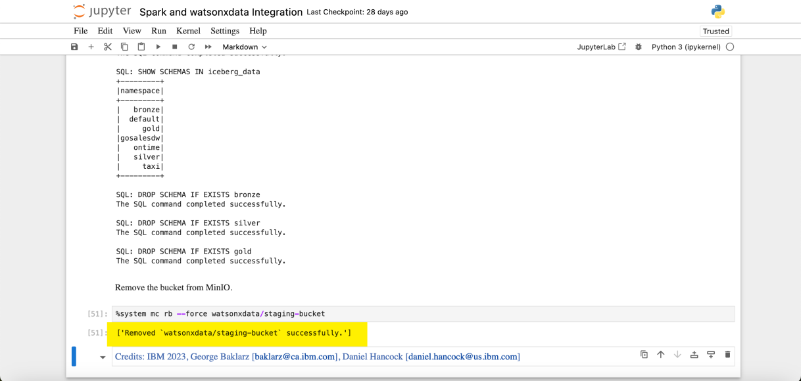

## Resumen

Ya has completado el laboratorio.

En este laboratorio, se utilizó Apache Spark para crear un bucket de almacenamiento, crear tablas, cargar datos y realizar consultas contra esas tablas utilizando Spark SQL. Por último, después del ejercicio de laboratorio se limpió el entorno watsonx.data borrando los datos y eliminando el bucket de almacenamiento.
