<QuizAlert text="Heads Up! Quiz material will be flagged like this!"/>

# 203: Netezza data warehouse modernization

## Goal

The goal of this lab is to showcase how IBM watsonx.data can be used for data warehouse modernization for a Netezza Performance Server as a Service (NPSaaS) instance running on Microsoft Azure to move a workload to watsonx.data.

## Prerequisites

### watsonx.data Environment

This lab requires that you already have a provisioned IBM watsonx.data environment. This is done in **[Module 1: Environment Setup](/watsonx/watsonxdata/1)**

## Setting up a Data Warehouse Connector for Presto

1. Open the console (user interface) for your **watsonx.data environment** in a new browser window.

  

2. In the watsonx.data UI, select the **Data manager** icon on the left-side menu.

  

3. Click the **Create** dropdown menu and select **Create schema**.

  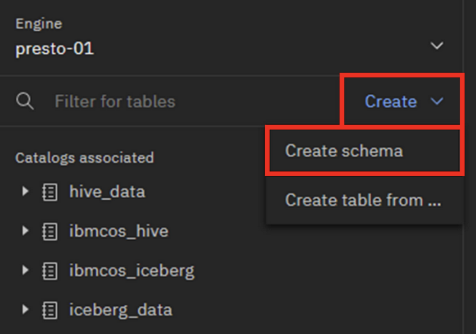

4. In the **Create schema** pop-up window, select **iceberg_data** for the **Catalog** and enter `flight_delay` for the **Name**. The **Path** field is automatically set based on the schema name, but it can be overridden as needed. However, **do not change** it here. Now click the **Create** button. The **flight_delay** schema is now created under the **iceberg_data** bucket.

5. In the watsonx.data UI, select the **Infrastructure manager** icon on the left-side menu.

  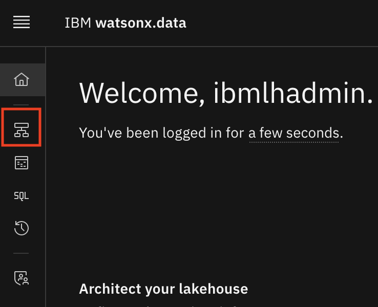

6. Click the **Add component** dropdown on the right side and select **Add database**.

  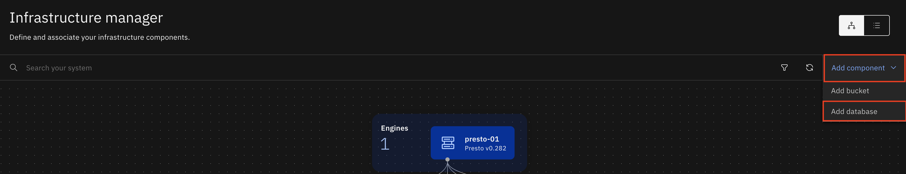

7. In the **Add database** pop-up window, enter/select the following information to add the **Netezza Performance Server as a Service (NPSaaS) database on Microsoft Azure** and then click **Register**:

  > **Note:** Credentials to the Netezza Performance Server as a Service (NPSaaS) database on Microsoft Azure will be provided to you by your lab host

  - **Database type:** IBM Netezza
  - **Database name:** `NZ_FLIGHTS`
  - **Display name:** `NZ_FLIGHTS`
  - **Hostname:** **Get from lab host**
  - **Port:** **Get from lab host**
  - **Username:** **Get from lab host**
  - **Password:** **Get from lab host**
  - **Connection status:** Click **Test connection**. If the connection test is successful, **Connection status** will show **Successful**. **Note:** If the test wasn’t successful then you’ll receive an error message as shown below with the reason for the failure. Re-enter all of the fields again and click **Retest** to test the connection again. The most common reasons for an error here are that you mistyped something incorrectly.
  - **SSL Connection:** Turn on the **SSL connection** toggle switch
  - **Catalog name:** `netezza`

  The Netezza database has been added to watsonx.data, but there is no connection between the Netezza catalog and the Presto (presto-01) engine. The two will need to be linked to use the Presto engine to query the Netezza database.

  <QuizAlert text="There is a quiz question related to adding the connection to Netezza"/>

8. In the **Catalogs** section, hover your mouse pointer over the **netezza** tile and the **Manage associations** icon will appear. Click it.

  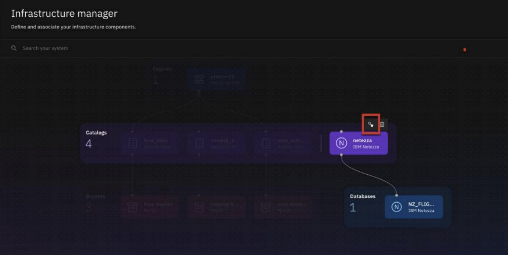

9. In the **Manage associations** pop-up window, select the checkbox for the **presto-01** engine and then click **Save and restart engine**. A line should now connect the **presto-01** tile in the **Engines** section with the **netezza** tile in the **Catalogs** section. This connection indicates that the resources are now associated.

<QuizAlert text="There is a quiz question related to your database being accessible by the Presto query engine"/>

10. In the watsonx.data UI, select the **Data manager** icon on the left-side menu.

11. Select the **netezza** catalog and expand it. The **AIRLINE_DELAY_CAUSE** table should be displayed under the **ADMIN** schema indicating that the database connection is operational and working correctly.
  
  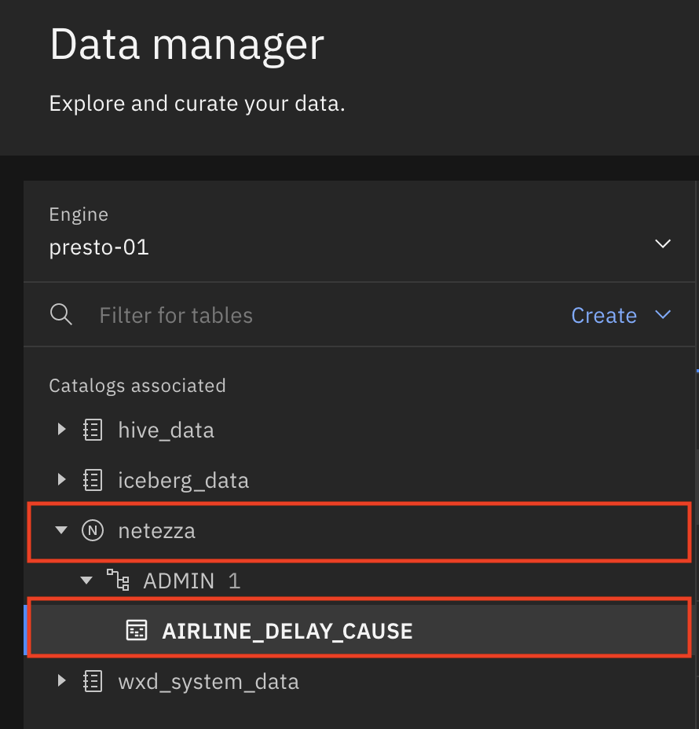

Although this section used an IBM Netezza database connector, the process is identical for configuring the Presto connector for any supported data warehouse. Comparable information will be required for any data warehouse being added (hostname of database, database name, username and password that has privileges on the database, the database port number, and whether the connection is Secure Sockets Layer (SSL) or not).

## Creating tables and loading data within watsonx.data

1. Within the **Data manager** window, select the **AIRLINE_DELAY_CAUSE** table under the **ADMIN** schema and view the **Table schema** tab to see the table structure (column names, data types, and whether the column in nullable).

2. Move to the **Data sample** tab and examine the contents of the table.

  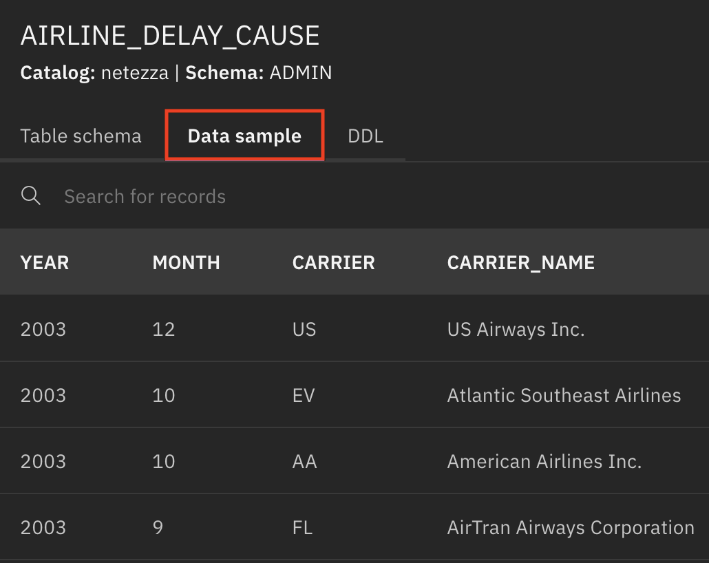

3. To get an idea of the volume of data within the **AIRLINE_DELAY_CAUSE** table, in the watsonx.data UI, select the **Query workspace** icon on the left-side menu.

  

4. Clear the SQL editor and hover over the **\<\/\>** symbol to the right of the **AIRLINE_DELAY_CAUSE** table name and choose the **Generate SELECT** option.

  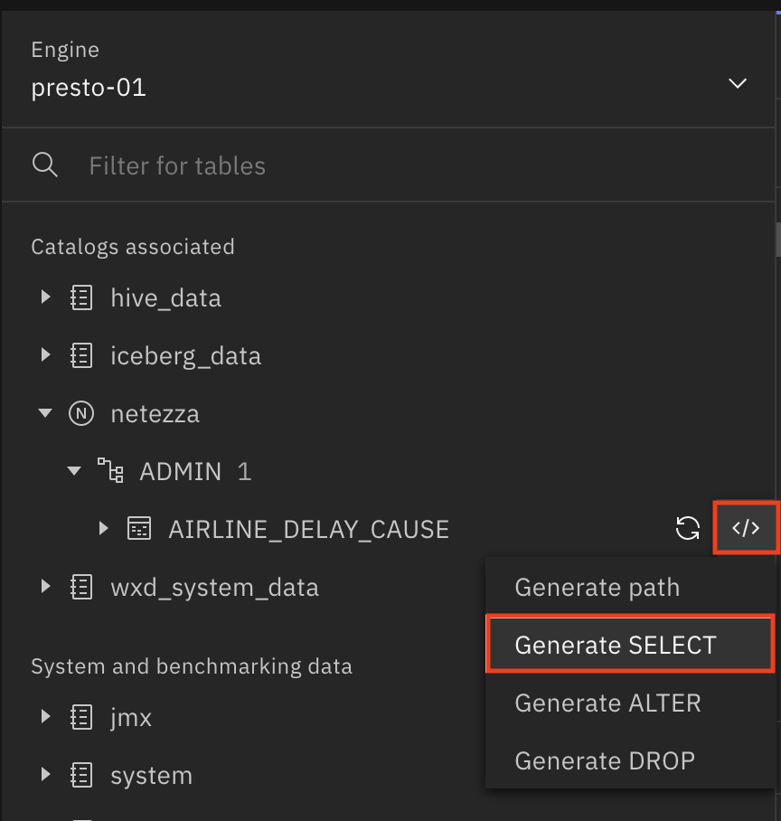
  
  <QuizAlert text="There is a quiz question related to generating query templates in the Query Workspace"/>

5. Edit the generated SQL statement to look like the SQL statement below. Then click the **Run on presto-01** button on the right.

  ```sql
  SELECT
    COUNT(*)
  FROM
    "netezza"."ADMIN"."AIRLINE_DELAY_CAUSE";
  ```

  The Result set in the lower portion of **Query workspace** window indicates that the Netezza **AIRLINE_DELAY_CAUSE** table contains **336,028** rows.

6. To build the CREATE TABLE AS SELECT (CTAS) statement is a two-step process. Clear the SQL editor and hover over the **\<\/\>** symbol to the right of the **flight_delay** schema under the **iceberg_data** entry and choose the **Generate path** option. Within the SQL sub-window add `CREATE TABLE` before the path string and add `."flight_delay_cause" AS` to the right of the path information. Ensure the cursor is at the end of the statement at conclusion of the edit process (after the AS). Your SQL statement should look like the SQL statement below.

  ```sql
  CREATE TABLE "iceberg_data"."flight_delay"."flight_delay_cause" AS 
  ```

7. Continuing with the second step of the CTAS statement, hover over the Netezza **AIRLINE_DELAY_CAUSE** table entry and select the **\<\/\>** symbol to the right of the table name and choose the **Generate SELECT** option. The **SELECT** statement for the Netezza **AIRLINE_DELAY_CAUSE** table should appear after the **CREATE TABLE...AS** portion of the statement. Edit the generated **SELECT** statement to delete the **LIMIT 10** portion (do not delete the semicolon ; delimiter). Your SQL statement should look like the SQL statement below. Then click the **Run on presto-01** button on the right.

  ```sql
  CREATE TABLE "iceberg_data"."flight_delay"."flight_delay_cause" AS SELECT
    *
  FROM
    "netezza"."ADMIN"."AIRLINE_DELAY_CAUSE"
  ;
  ```

  <QuizAlert text="There is a quiz question related to the result set of this SELECT statement"/>

  After the statement execution completes successfully, there should be a new **flight_delay_cause** table under the **flight_delay** schema within the **iceberg_data** catalog. The **CREATE TABLE...** statement will have a green checkmark to the right to show the execution was successful and the rows (count) in the new table are **336,028** (matches the original Netezza table row count).

After a table is created and data is loaded, it is common practice to perform a quick test to ensure that the table data looks reasonable and there are no obvious issues with the new table. Once the **flight_delay_cause** table was loaded as an Iceberg table in the data lakehouse, the row count in the new table matched the original Netezza table’s row count. As another test, let’s verify that the **flight_delay_cause** table contains the expected date range (2003 to 2023) of data. This test will be accomplished using the Data manager and Query workspace portions of the watsonx.data UI.

<QuizAlert text="There is a quiz question related to viewing a table’s column definitions"/>

8. In the watsonx.data UI, select the **Data manager** icon on the left-side menu.

9. Select the **flight_delay_cause** table under the **iceberg_data** catalog and look at the columns defined for the table. Since we want to verify the correct months and years of data have been loaded, the column names needed are **MONTH** and **YEAR**.

  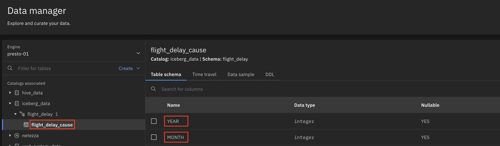

10. In the watsonx.data UI, select the **Query workspace** icon on the left-side menu.

11. Clear the SQL editor and hover over the **\<\/\>** symbol to the right of the **flight_delay_cause** table under the **iceberg_data** entry and choose the **Generate SELECT** option.

12. Edit the generated SQL statement to look like the SQL statement below. Then click the **Run on presto-01** button on the right.

  ```sql
  SELECT
    DISTINCT(YEAR)
  FROM
    "iceberg_data"."flight_delay"."flight_delay_cause"
  ORDER BY
    1;
  ```

  <QuizAlert text="There is a quiz question related to the SQL query table name"/>

13. Scrolling through the Result set at bottom of window (using the **>** key in the lower right) verifies that data for the years **2003** through **2023** are contained in the table. Combined with the earlier row count verification, the **flight_delay_cause** table has been correctly moved to an Iceberg table.

  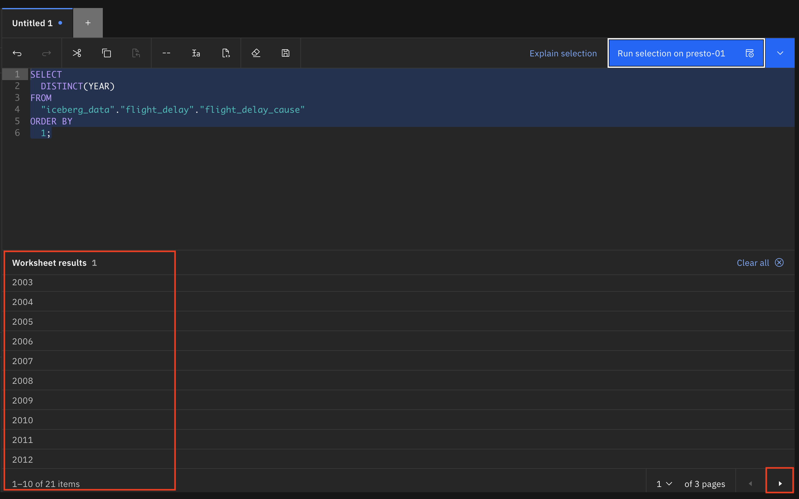

## Object Privileges

After the tables have been created and the data loaded into the data lakehouse, the final step is to ensure that the necessary applications, individuals, or groups/roles have been granted the access required to be able to use the new data within the data lakehouse. This section describes the granting of privileges to the **flight_delay_cause** table that was created in the earlier portion of this lab.

1. In the watsonx.data UI, select the **Access control** icon on the left-side menu.

  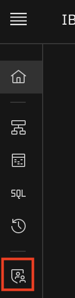

2. Select the **iceberg_data** row to display the Access control (default) window.

  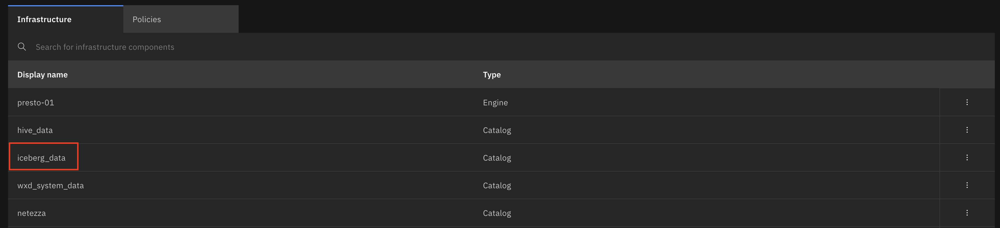

3. By default, the **Admin** role is assigned to the **ibmlhadmin** username (the login used when starting the watsonx.data UI). Additional access can be added by selecting the **Add access** button. Selecting Add access will display all usernames known to the watsonx.data lakehouse and allows these usernames to be granted access to the **iceberg_data** catalog.

4. Select the **Data objects** tab at the top of this window. This will display the **flight_delay_cause** table (as that is the only physical object under **iceberg_data**). The information provided in the tabs is information that is part of other menus within the watsonx.data UI except for **Time Travel** tab. **Time Travel** allows a table to be reverted to earlier versions of the table for recovery from unintended table changes. Since the **flight_delay_cause** table has no other activity except for the initial data load, **Time Travel** is not possible. If there were multiple **Time Travel** entries, then the table could be reverted to earlier versions of the table.

  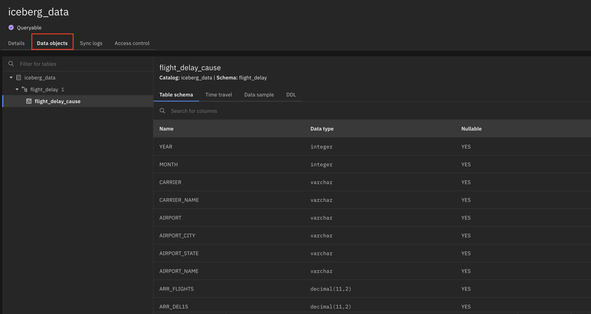

5. Close the **iceberg_data** Access control (default) window.

  

6. On the main **Access control** window, select the **Policies** tab at the top. No policies are defined, as this window has no entries shown. Select the **Add policy** button to understand a watsonx.data policy and what defines a policy.

  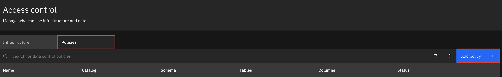

7. The first panel asks for basic information, such as the **policy name** and a **description** (optional). By default, the policy is **Inactive** upon creation, and this is a good practice to maintain (can activate the policy after it is created and verified as correct). Give the policy the name `flightdelaycausepolicy` and select the **Next** button to continue.

8. In the next panel select **iceberg_data** for the catalog, **flight_delay** for the schema, **flight_delay_cause** for the table, **all** for the table columns, and select the **Next** button to continue.

<QuizAlert text="There is a quiz question related to viewing a table’s column definitions"/>

9. The next panel allows rules to be defined by selecting the **Add rule** button. The panel has no rules shown as none are defined by default. Select the **Add rule** button. This displays another window to input that allow specific access rules such as actions (create, drop, alter, insert, select, and truncate) and which groups or users to include in the rule. Select **Allow** for the **Rule type**, **select** for the **Actions**, **Users** for the **Users/groups**, **ibmlhadmin** for the **Select user**, and select the **Add** button to add the new rule. 

  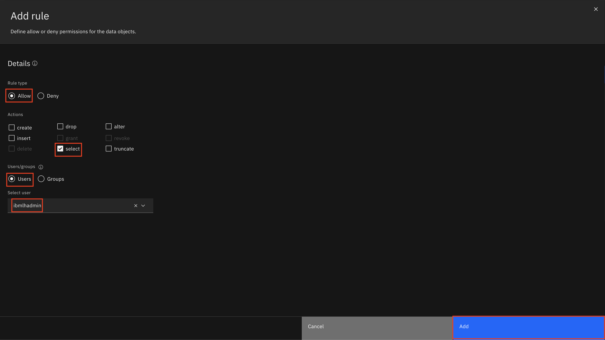

10. Since this watsonx.data Developer image has no additional users (only ibmlhadmin) and no groups defined, there is no need to go further with **Access control**. Select the **Cancel** button to exit out of the **Create access control policy** window.

  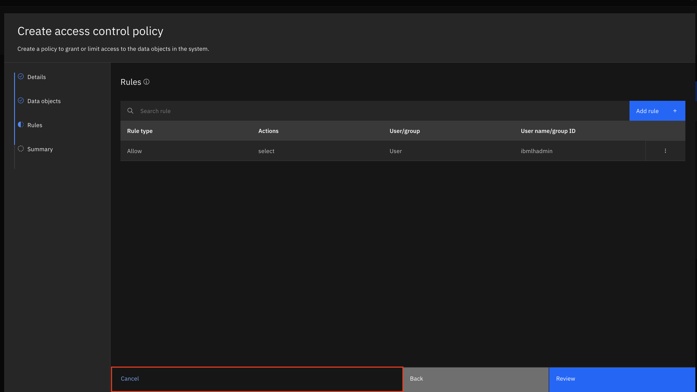

### Congratulations, you have reached the end of lab 203.

Click, [IBM watsonx.data](/watsonx/watsonxdata) to go to the IBM watsonx.data home page.
