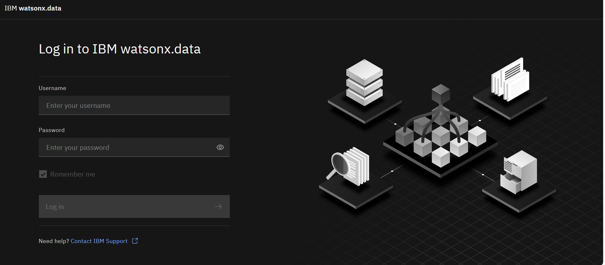
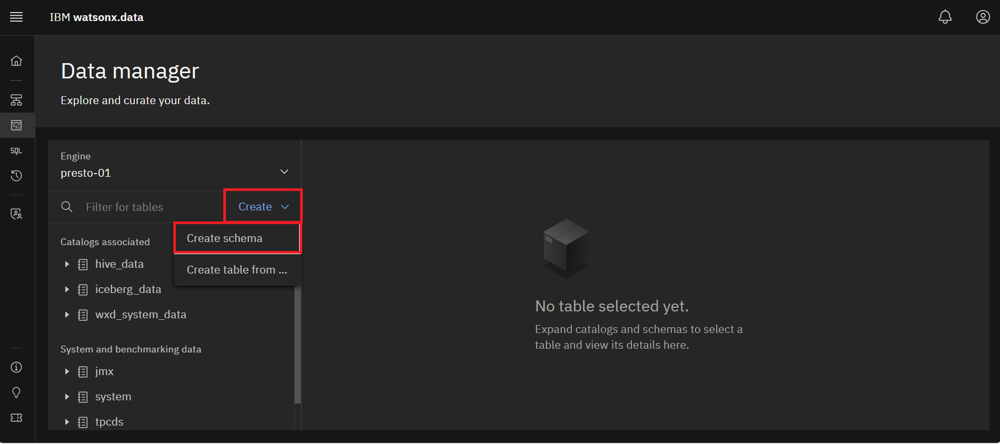
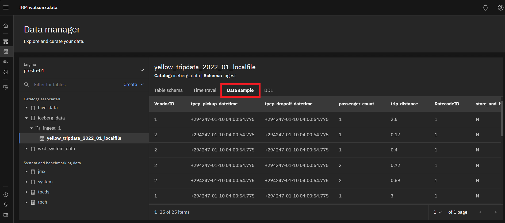
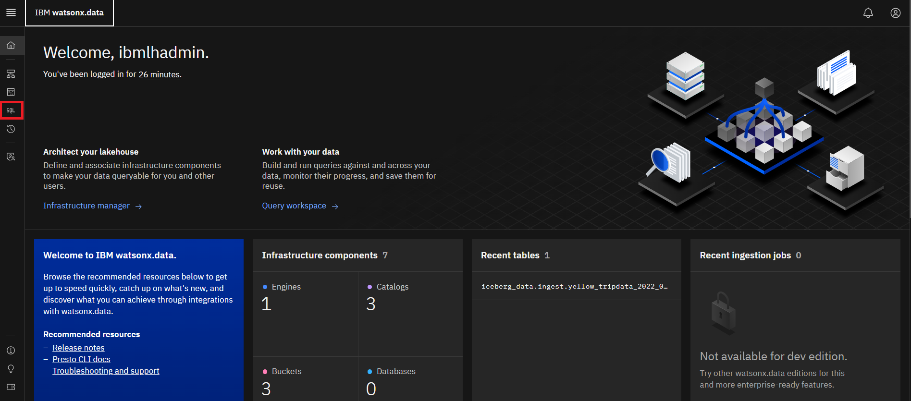
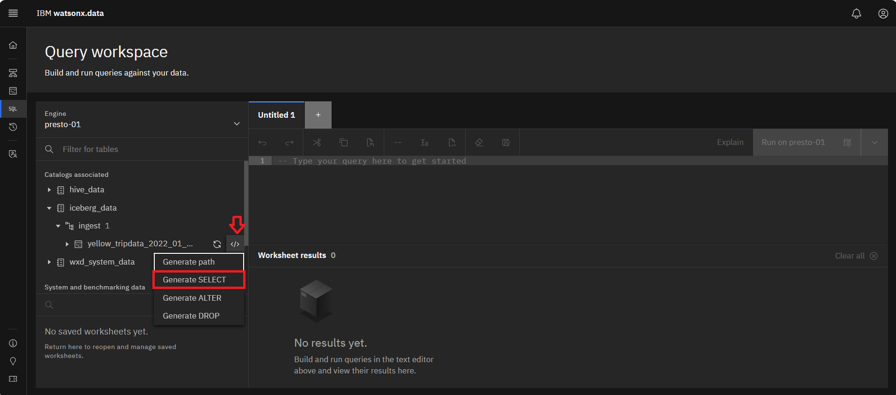
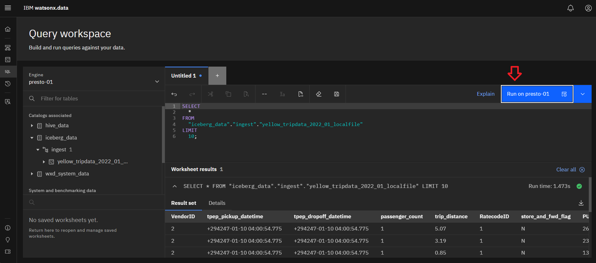

<QuizAlert text="¡Aviso! ¡El material del cuestionario se marcará así!" />

# 204: Ingestión de datos

La ingestión de datos es el proceso de importar y cargar datos en IBM® watsonx.data. Un método consiste en utilizar la pestaña Trabajos de ingestión de la página Gestor de datos para cargar datos de forma segura y sencilla en la consola de watsonx.data \(**NOTA**: Esto sólo está disponible en Standard Edition\). La ingesta de datos en la consola watsonx.data o en la utilidad de línea de comandos ibm-lh admite los formatos CSV y Parquet. Los archivos que se ingieren en un único comando de ingesta deben ser del mismo tipo de formato y esquema. watsonx.data descubre automáticamente el esquema en función del archivo de origen que se está ingiriendo.

También puede cargar o ingestar archivos de datos locales o ingestar datos de fuentes externas utilizando la herramienta ibm-lh. La utilidad de línea de comandos ibm-lh es una interfaz de terminal diseñada para facilitar la interacción con los recursos de watsonx.data.

Este laboratorio utiliza la herramienta de ingesta (ibm-lh) junto con IBM watsonx.data Developer Edition que se ejecuta en este laboratorio. La herramienta de ingesta se instala por separado y debe descargarse después de iniciar IBM watsonx.data. La imagen de laboratorio (Developer Edition) contiene una copia de este código, por lo que no necesitará descargarlo.

En esta sección te conectarás a tu entorno watsonx.data. El servidor watsonx.data inicia automáticamente todos los servicios. Para comprobar el estado del servidor, ejecute los siguientes comandos siguiendo las instrucciones proporcionadas en **Acceso a la línea de comandos** de la sección [1: Configuración del](/watsonx/watsonxdata/1#command-line-access) entorno:

1.  Abra una ventana de terminal e introduzca el siguiente comando para conectarse al servidor watsonx.data.

**Nota:** Sustituya el puerto, la región y el servidor techzone en el siguiente comando SSH por los valores proporcionados para su entorno en el correo electrónico de reserva de TechZone.

```bash
ssh -p port watsonx@region.techzone-server.com
```

2.  Introduzca una contraseña de: **watsonx.data**
3.  Cambie al usuario root introduciendo el siguiente comando:

```bash
sudo su - 
```

4.  Cambie al directorio bin del cliente introduciendo el siguiente comando:

```bash
cd /root/ibm-lh-client/bin
```

### Ingesta de datos en IBM watsonx.data

Antes de ejecutar la utilidad, es necesario recuperar varias credenciales para MinIO y la contraseña del almacén de claves.

1.  Estando aún en el directorio /root/ibm-lh-dev/bin, introduzca los siguientes comandos para extraer las credenciales. Es necesario generar tres líneas de exportación y crear un directorio que se utilizará más adelante en otro script.

```bash
export LH_S3_ACCESS_KEY=$(docker exec ibm-lh-presto \
printenv | grep LH_S3_ACCESS_KEY | sed 's/.*=//')
```

```bash
export LH_S3_SECRET_KEY=$(docker exec ibm-lh-presto \
printenv | grep LH_S3_SECRET_KEY | sed 's/.*=//')
```

```bash
export LH_KEYSTORE_PASSWORD=$(docker exec ibm-lh-presto \
printenv | grep LH_KEYSTORE_PASSWORD | sed 's/.*=//')
```

2.  Ejecute los siguientes comandos para crear el directorio de montaje. El directorio de montaje se utiliza para mover archivos entre este sistema y el contenedor Docker donde se ejecuta la **utilidad de línea de comandos ibm-lh**.

```bash
export staging=/root/ibm-lh-client/localstorage/volumes/infra/staging
```

```bash
mkdir -p ${staging}
cat <<EOF > ${staging}/keys.sh
#!/bin/bash
export access_key=$LH_S3_ACCESS_KEY
export secret_key=$LH_S3_SECRET_KEY
export keystore_password=$LH_KEYSTORE_PASSWORD
EOF
chmod +x ${staging}/keys.sh
```

3.  Ejecute los siguientes comandos para copiar el certificado SSL MinIO desde el contenedor docker al directorio staging. El certificado MinIO SSL es necesario para que la operación de copia tenga lugar. Además, el archivo que desea cargar en watsonx.data se moverá al directorio de archivos staging.

```bash
docker cp ibm-lh-presto:/mnt/infra/tls/lh-ssl-ts.jks \
${staging}/lh-ssl-ts.jks
cp -f /sampledata/yellow_tripdata_2022-01.parquet \
${staging}/
```

### Crear un esquema de colmena para la puesta en escena del archivo de ingesta

Antes de ingestar el archivo, debe crear un nuevo esquema para la tabla que está creando y cargando. Creará el esquema utilizando la interfaz de usuario watsonx.data. Su correo electrónico de reserva de TechZone incluirá la URL de su interfaz de usuario watsonx.data.

1.  Inicie sesión en la consola IBM watsonx.data: La URL de la consola watsonx.data se encuentra en los detalles de su correo electrónico de reserva de TechZone (consulte la línea **Watsonx UI** en la sección Servicios publicados).

    - Introduzca **ibmlhadmin** en el campo **Nombre de usuario**.

    - Introduzca la **contraseña** en el campo **Contraseña**.

    - Haz clic en el botón **Iniciar sesión**.

    

2.  Haga clic en el icono **Gestor de datos** del menú de la izquierda. 

3.  Haga clic en el menú desplegable **Crear** y seleccione **Crear esquema**. 

4.  En el cuadro de diálogo Crear esquema, realice los siguientes pasos:

    - Haga clic en el menú desplegable **Catálogo** y seleccione **hive\_data**.

    - Introduzca **staging** en el campo **Nombre**.

    - Pulse el botón azul **Crear**. 

Debería ver el nuevo esquema de **preparación** en el catálogo **hive\_data** de la sección **Catálogos asociados**.

5.  Repita el paso 3 para crear otro esquema. En el cuadro de diálogo **Crear esquema**, realice los siguientes pasos:

    - Haga clic en el menú desplegable **Catálogo** y seleccione **iceberg\_data**.

    - Introduzca **ingest** en el campo **Nombre**.

    - Pulse el botón azul **Crear**. 

### Ingesta utilizando la utilidad de línea de comandos ibm-lh

Utilizarás la utilidad de línea de comandos ibm-lh para ingestar datos. Por ahora, abandonará la interfaz de usuario de watsonx.data para realizar los siguientes pasos en la ventana de la línea de comandos.

1.  Para acceder a la utilidad de línea de comandos ibm-lh, introduzca el siguiente comando:

```bash
./ibm-lh data-copy
```

2.  Una vez dentro de la utilidad, ejecute el siguiente comando para obtener más detalles sobre la opción de **copia de datos**.

```bash
ibm-lh data-copy --help
```

3.  Ejecute el siguiente comando para salir del contenedor de herramientas.

```bash
exit
```

4.  Ejecute la siguiente secuencia de comandos para introducir los datos del taxi (yellow\_tripdata\_2022\_01.parquet) en la tabla yellow\_tripdata\_2022\_01\_localfile de watsonx.data.

```bash
cat <<EOF > ${staging}/ingest-local.sh
#!/bin/bash
dir=/mnt/infra/staging
cd \${dir}
source ./keys.sh
table_name="iceberg_data.ingest.yellow_tripdata_2022_01_localfile"
file="yellow_tripdata_2022-01.parquet"
export STAGING_S3_CREDS="AWS_SECRET_ACCESS_KEY=\${secret_key}\\
,AWS_ACCESS_KEY_ID=\${access_key}\\
,AWS_REGION=us-east-1\\
,BUCKET_NAME=iceberg-bucket\\
,ENDPOINT_URL=http://ibm-lh-minio:9000"
ibm-lh data-copy \\
 --source-data-files \${dir}/\${file} \\
 --target-tables \${table_name} \\
 --ingestion-engine-endpoint "hostname=ibm-lh-presto-svc,port=8443" \\
 --staging-location s3://iceberg-bucket/ingest/ \\
 --staging-hive-catalog hive_data \\
 --staging-hive-schema staging \\
 --create-if-not-exist \\
 --trust-store-path \${dir}/lh-ssl-ts.jks \\
 --trust-store-password \${keystore_password} \\
 --dbuser ibmlhadmin \\
 --dbpassword password
EOF
```

```bash
sed -i '/^$/d' ${staging}/ingest-local.sh
```

```bash
chmod +x ${staging}/ingest-local.sh
```

5.  Ejecute el siguiente comando para iniciar de nuevo la utilidad de línea de comandos ibm-lh:

```bash
./ibm-lh data-copy 
```

6.  Ahora ejecute el trabajo de ingesta dentro del contenedor de herramientas ejecutando el siguiente comando:

```bash
/mnt/infra/staging/ingest-local.sh
```

7.  Una vez ingestados los datos, salga de la utilidad de línea de comandos.

```bash
exit
```

8.  Vuelva a la interfaz de usuario de IBM watsonx.data. En la sección **Gestor de datos**, expanda el catálogo **iceberg\_data** en el área **Catálogos asociados** y, a continuación, expanda el esquema de **ingesta**. 
9.  Seleccione la tabla **yellow\_tripdata\_2021\_01\_localfile** para ver la definición de la tabla. Seleccione la pestaña **Esquema de la tabla** para ver el esquema de la tabla si no está ya seleccionado. 
10. Seleccione la pestaña **Muestra de datos** para ver una muestra de los datos. 
11. Ahora puede utilizar la interfaz de usuario para ejecutar una consulta con estos datos importados. Seleccione el icono **Espacio de trabajo de consulta (SQL** ) en el menú de la izquierda. 
12. En la línea donde se encuentra la tabla **yellow\_tripdata\_2022\_01\_localfile**, haga clic en el icono **Plantillas de consulta** al final del nombre. Aparecerá una lista desplegable. Seleccione **Generar SELECT** 

Esto genera una sentencia SQL SELECT en la ventana a la derecha del nombre de la tabla. 

13.Para revisar los resultados, ejecute la consulta pulsando el **botón azul Ejecutar en presto-01**. 

### Resumen

En este laboratorio se han ingestado datos usando la utilidad de línea de comandos watsonx.data ibm-lh y se ha ejecutado una declaración de SQL para consultar los datos ingestados.

### Enhorabuena, has llegado al final del laboratorio 204.

Si desea realizar el cuestionario sobre los laboratorios prácticos L4, puede encontrarlo [aquí](https://learn.ibm.com/course/view.php?id=16013)
