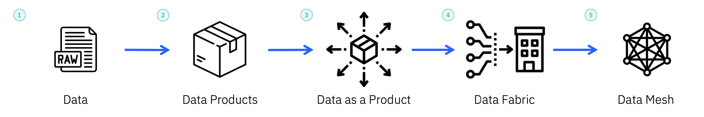

# Términos clave

*   **Almacén de datos**  Depósito centralizado que almacena grandes volúmenes de datos estructurados, semiestructurados y no estructurados procedentes de diversas fuentes de una organización. Está diseñado para apoyar las actividades de inteligencia de negocio (BI), incluyendo informes, análisis y toma de decisiones.

*   **Mercado de datos** Subconjunto o versión especializada de un almacén de datos que se centra en un departamento, función o área temática específicos dentro de una organización. Contiene una colección de datos curada y adaptada que es relevante para un grupo particular de usuarios.

*   **Lago de datos** Arquitectura de almacenamiento que permite a las organizaciones almacenar grandes volúmenes de datos estructurados, semiestructurados y no estructurados en su formato bruto. Se trata de un repositorio central que almacena diversos tipos y formatos de datos sin necesidad de transformación o definición de esquemas.

*   **Casa de lago de datos** Los Data Lakehouses (Casas de lago de dato) están diseñados para ser un lugar para todas las cargas de trabajo, proporcionando soporte para informes, ciencia de datos, IA y aprendizaje automático en los mismos datos, al mismo tiempo, todo en un solo lugar.

*   **Canalización de datos**  Serie de procesos y pasos que extraen, transforman y cargan (ETL) datos de varias fuentes en un destino de destino para su almacenamiento, análisis o consumo. Se trata de un flujo de datos estructurado que garantiza el movimiento fiable y eficiente de los datos a lo largo de las etapas de la canalización.

    

*   **1. Datos** Representa la forma inicial e intacta de información que no ha sufrido ninguna transformación, análisis o interpretación y que suele asociarse a los lagos de datos. Constituye la base del análisis de datos y suele refinarse y organizarse en un formato más accesible dentro de un almacén de datos.

*   **2. Productos de datos** Un paquete de datos completo que contiene tres partes principales

    \- Conjunto de datos procesados: Los datos organizados y analizados que proporcionan respuestas o conocimientos.

    \- Metadatos: Descripción de los datos que explica de dónde proceden, cómo están estructurados y otros detalles importantes.

    \- Patrón de acceso a los datos: Muestra cómo las personas pueden utilizar u obtener los datos, como a través de apps, informes u otras herramientas.

*   **3. Los datos como producto**

    \- Un enfoque operativo para empaquetar los datos de forma que sea más fácil consumirlos.

    \- Los dominios deben considerar los datos analíticos como un producto de primera clase en lugar de considerarlos un subproducto de sus operaciones empresariales. También deben aplicar todos los aspectos del desarrollo de productos para que sean valiosos, útiles, fiables y estén orientados al cliente.

    \- Transforme los datos brutos en un recurso valioso y accesible que proporcione información o perspectivas útiles a los consumidores de datos.

*   **4. Tejido de datos**

    \- Un enfoque arquitectónico para simplificar el acceso a los datos en una organización y facilitar el consumo de datos en régimen de autoservicio. Esta arquitectura es agnóstica con respecto a los entornos de datos, los procesos, la utilidad y la geografía, al tiempo que integra capacidades de gestión de datos de extremo a extremo.

    \- Una estructura de datos automatiza el descubrimiento, la gestión y el consumo de datos, lo que permite a las empresas utilizar los datos para maximizar su cadena de valor proporcionando los datos adecuados en el momento oportuno, independientemente de dónde residan.

    *   Elementos clave del tejido de datos genéricos
    *   Ingesta de datos
    *   Descubrimiento de datos
    *   Tratamiento de datos
    *   Acceso a los datos
    *   Orquestación de datos
    *   Gestión e inteligencia de datos

*   **5. Malla de datos**

    \- Enfoque organizativo de la gestión y distribución de datos dentro de una empresa en el que la responsabilidad de los datos está descentralizada, para tratar los datos como un producto y trasladar la propiedad y la responsabilidad de los datos a los equipos o departamentos que tienen más conocimientos y experiencia sobre esos datos.

    \- Cada dominio actúa como su propio "equipo de producto" de datos, responsable de gestionar y conservar los datos relevantes para sus operaciones o funciones específicas.

    \- Promueve la democratización de los datos y fomenta una infraestructura de datos más ágil y escalable dentro de la organización.
