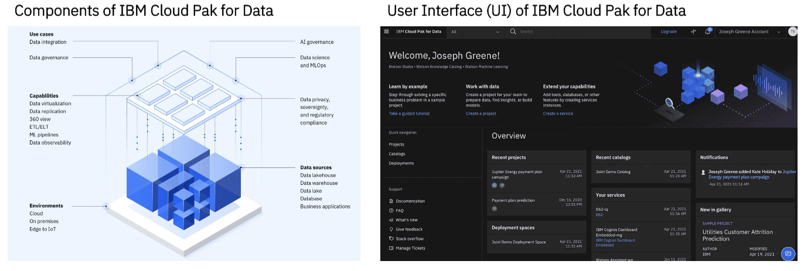
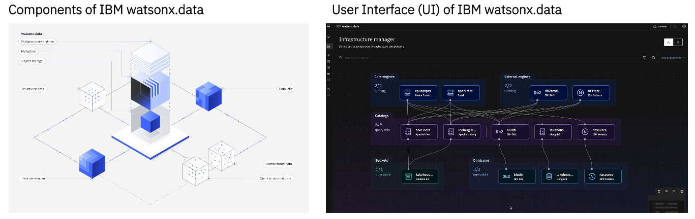
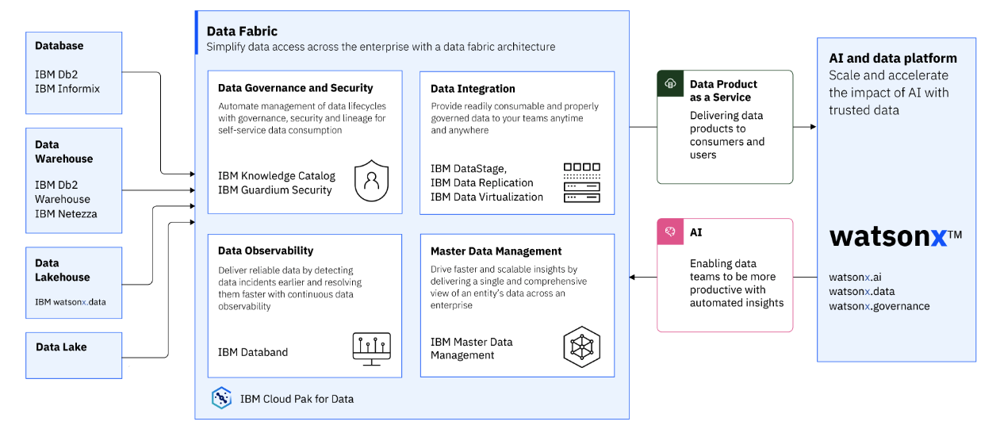
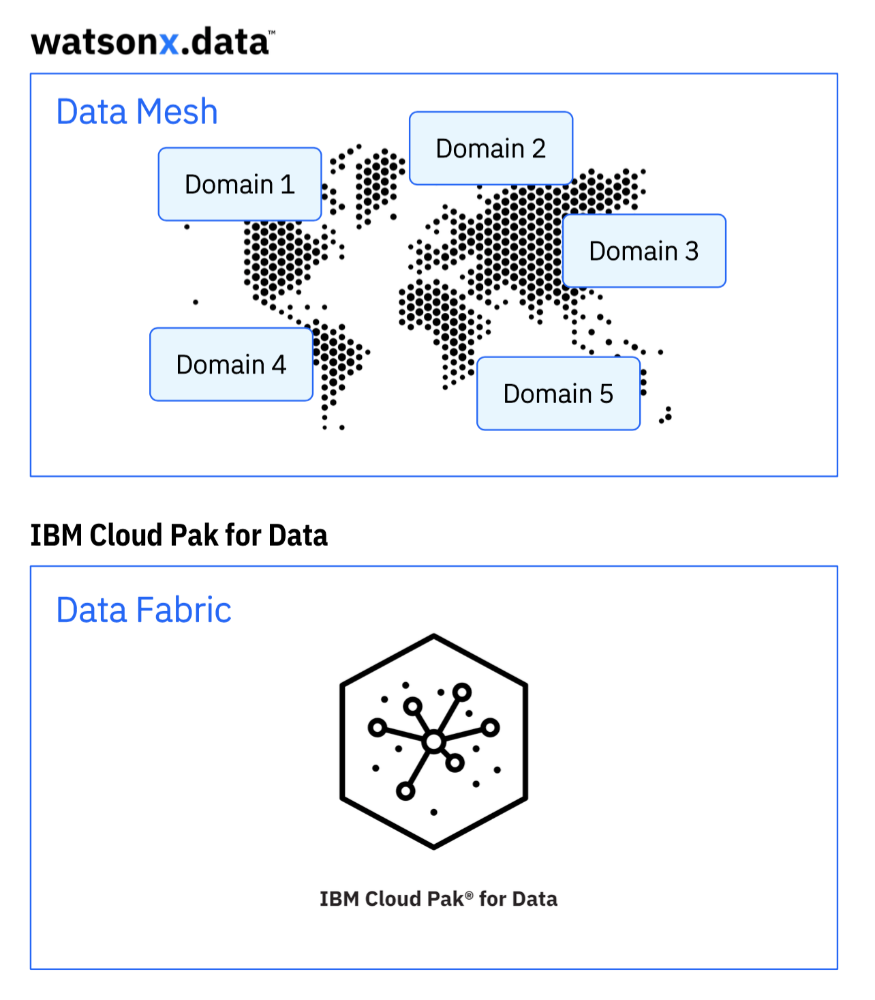

# Los datos como producto: IBM watsonx.data e IBM Cloud Pak for Data

## Tejido de datos (Data Fabric) con IBM

*   El tejido de datos es un enfoque arquitectónico para simplificar el acceso a los datos.

*   IBM Cloud Pak for Data está diseñado para un tejido de datos, sin necesidad de montaje.

    

## Malla de datos (Data Mesh) con IBM

*   La malla de datos es un enfoque organizativo de la gestión y distribución de datos.

*   IBM watsonx.data está diseñado como un data lakehouse, optimizado para todas las cargas de trabajo de datos e IA para habilitar la capacidad de malla de datos.

    

IBM watsonx.data se combina fácilmente con IBM Cloud Pak for Data proporcionando un **tejido de datos** y una solución **de malla de datos** para los clientes.

## Los datos como producto con IBM

*   IBM Cloud Pak for Data y watsonx se combinan para ofrecer la capacidad Data as a Product.

*   IBM Cloud Pak for Data proporciona la canalización de datos, el gobierno de datos y la integración de datos para el procesamiento de datos.

*   IBM Cloud Pak for Data (CP4D) proporciona la plataforma de tejido de datos que proporciona la infraestructura, los servicios esenciales, la gestión y las herramientas de gobierno para su entorno de datos.

*   IBM watsonx.data proporciona la capacidad de malla de datos que permite la gestión separada de cada dominio de datos y permite que esos dominios de datos abarquen varias ubicaciones pero se vean como un único lago de datos.

*   IBM watsonx proporciona el gobierno y los controles de los modelos y componentes de IA para garantizar modelos fiables y explicables.

    

## Algunas preguntas habituales sobre IBM Cloud Pak for Data y watsonx

  
¿IBM watsonx.data reemplazará a IBM Cloud Pak for Data (CP4D)?

  No. IBM watsonx.data no reemplaza a IBM Cloud Pak for Data. Es otra fuente de datos que puede ser parte de la arquitectura de tejido de datos de un cliente.

  IBM Cloud Pak for Data proporciona la estructura de datos para toda la empresa que todos los clientes necesitan para implementar una base de datos moderna para sus negocios.

  Mientras tanto, la plataforma IBM watsonx tiene IA tradicional, IA generativa y modelos de base como la razón subyacente por la que se creó la plataforma.

  
¿Por qué necesitamos IBM watsonx, cuando IBM Cloud Pak for Data (CP4D) ya proporciona capacidades de gobierno y origen de datos?

  IBM Cloud Pak for Data se centra en ofrecer una estructura de datos para las organizaciones, mientras que IBM Watsonx es una plataforma de IA que enfatiza los modelos básicos y la IA generativa, ofreciendo modelos de IA confiables y explicables.

  Watsonx.data sirve como un lago de datos rentable, que gestiona fuentes de datos de nube híbrida y utiliza tecnología de código abierto para el acceso a los datos. Watsonx.governance garantiza la transparencia del modelo. Si la IA no es su objetivo, es posible que Watsonx.ai y la gobernanza no sean necesarios.

  Watsonx complementa IBM CP4D y puede utilizarse con él. Watsonx.data también está disponible como cartucho para mejorar las fuentes de datos de CP4D, permitiendo la malla de datos.

  
Hoy utilizamos un sistema CP4D, que tiene Db2 Warehouse como nuestro repositorio de datos. ¿Qué ventaja nos proporcionaría watsonx.data hoy?

  Si actualmente sus análisis de datos dependen únicamente de Db2 Warehouse, watsonx.data no ofrecerá ningún beneficio inmediato. Sin embargo, si prevé ampliar sus fuentes de datos en el futuro, especialmente con una combinación de datos locales y en la nube, watsonx.data se vuelve valioso.

  Permite una integración perfecta de diversas fuentes de datos en la nube híbrida, lo que le permite agregar datos de prueba de la nube pública y optimizar los costos de consulta de manera eficiente.

  A diferencia del motor de consulta único de Db2 Warehouse, watsonx.data garantiza recursos informáticos rentables, cruciales para la gestión del presupuesto en un entorno de nube donde las necesidades de rendimiento varían.

  
¿En qué se diferencia IBM watsonx.data de otras fuentes de datos disponibles con IBM Cloud Pak for Data (CP4D)?

  Las fuentes de datos como Db2 Warehouse y las bases de datos OEM (MongoDB, SingleStore, EDB, etc.) en IBM CP4D utilizan motores de consulta separados con distintos dialectos SQL, lo que requiere que los usuarios aprendan diferentes sintaxis de consulta.

  Cambiar entre bases de datos es la única forma de optimizar los recursos informáticos, pero requiere cambiar la sintaxis de la consulta.

  IBM watsonx.data ofrece una sintaxis SQL unificada para todas las consultas que acceden a las tablas de Apache Iceberg, incluso si estas tablas están distribuidas en varias ubicaciones de la nube híbrida. Esto permite la separación de datos para crear una arquitectura de malla de datos junto con la estructura de datos de IBM CP4D.

