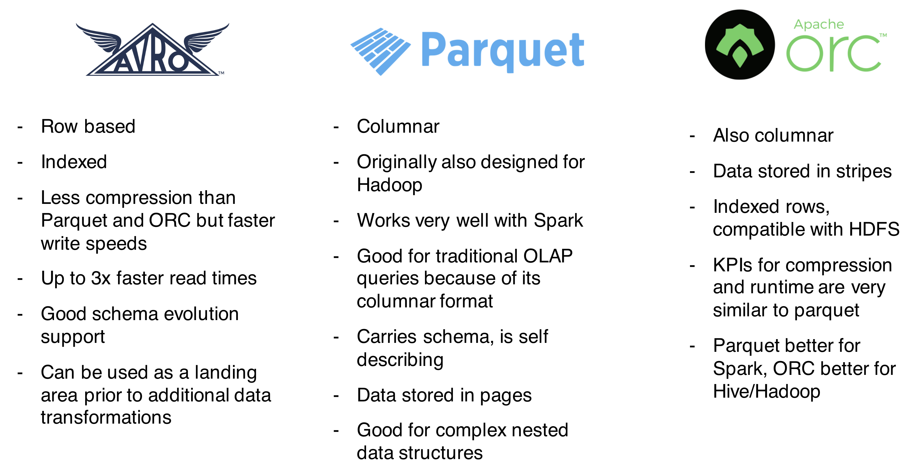
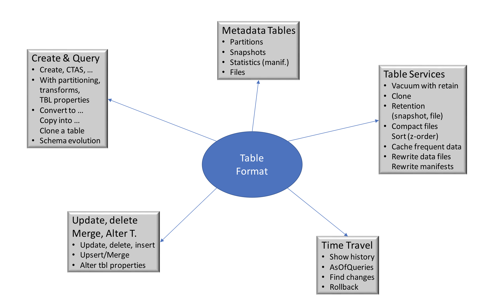

# Tecnologías de código abierto pertinentes

**PrestoDB**

*   Motor de consulta SQL distribuido y de código abierto, diseñado para realizar consultas analíticas rápidas sobre datos de cualquier tamaño.
*   Consultas de datos allí donde se encuentren mediante ANSI SQL en fuentes federadas y diversas.
*   Admite fuentes relacionales y no relacionales
*   También admite tipos de archivo de código abierto (ORC, Parquet, Avro, RCFile, SequenceFile, JSON, Text, CSV)
*   Excelente para conectar herramientas de inteligencia empresarial a diversas fuentes de datos
*   Utiliza una arquitectura similar a los sistemas clásicos de gestión de bases de datos de procesamiento paralelo masivo.
*   Un nodo coordinador trabaja en sincronía con varios nodos trabajadores
*   La consulta se envía al coordinador, que utiliza el motor de consulta y ejecución personalizado de presto para analizar, planificar y programar un plan de consulta distribuido entre los nodos trabajadores.
*   Diseñado para soportar la semántica estándar ANSI SQL, incluyendo consultas complejas, agregación, uniones, uniones izquierda/derecha, subconsultas, funciones de ventana, recuentos distintos y percentiles aproximados.

**Hive (Colmena) Metastore**

Punto central de almacenamiento de toda la metainformación sobre sus almacenes de datos

*   Repositorio central de motores de consulta de Lakehouse

*   Almacena información de metadatos sobre tablas conectadas, vistas, particiones, columnas y sus respectivos esquemas.

*   Almacena información como el esquema de las tablas, sus nombres de columna, tipos e información de partición.

    \- Los motores de consulta utilizan esta información para optimizar la ejecución de las consultas y mejorar el rendimiento.

    \- Rastrea la ubicación de los datos almacenados en los sistemas de almacenamiento, lo que facilita al motor de consulta el acceso a los datos y su procesamiento.

    \- Normalmente se implementa como una base de datos relacional, como MySQL, PostgreSQL u Oracle.

    \- Gestiona el acceso simultáneo y proporciona alta disponibilidad y tolerancia a fallos.

**Formatos de archivo**

**Formatos de tabla de código abierto**

*   Separación de cálculo, datos y almacenamiento
*   Aproveche el almacenamiento de objetos de bajo coste y escalabilidad infinita
*   Normalizado

\- formatos de archivo abiertos (Parquet, ORC, DWRF, JSON, ...)

\- formatos de tabla (Apache Iceberg, LF Delta, Apache Hudi)

*   Acceso mediante motores informáticos escalables de su elección (Presto, Spark, etc.)

**ICEBERG**

Formato de tabla abierta para grandes conjuntos de datos analíticos

*   **Schema Evolution** permite añadir, eliminar, actualizar o renombrar y no tiene efectos secundarios.

*   **La partición oculta** evita los errores del usuario que provocan resultados silenciosamente incorrectos o consultas extremadamente lentas.

*   **La evolución de la disposición de las particiones** puede actualizar la distribución de una tabla a medida que cambian el volumen de datos o los patrones de consulta.

*   **El viaje en el tiempo** permite realizar consultas reproducibles que utilizan exactamente la misma instantánea de tabla, o permite a los usuarios examinar fácilmente los cambios

*   **La reversión de versiones** permite a los usuarios corregir rápidamente los problemas restableciendo las tablas a un buen estado.

*   Los archivos de datos de **filtrado avanzado**  se podan con estadísticas a nivel de partición y columna, utilizando los metadatos de la tabla.

    \- Diseñado originalmente para resolver problemas de corrección en almacenes de objetos en nube eventualmente consistentes.

*   **Funciona con cualquier almacén en la nube** y reduce la congestión de NN cuando está en HDFS, al evitar listados y renombrados.

*   Los cambios en la tabla de **aislamiento serializable** son atómicos y los lectores nunca ven cambios parciales o no comprometidos.

*   **Los escritores concurrentes múltiples** utilizan la concurrencia optimista y reintentarán asegurar que las actualizaciones compatibles tengan éxito, incluso cuando las escrituras entren en conflicto.
