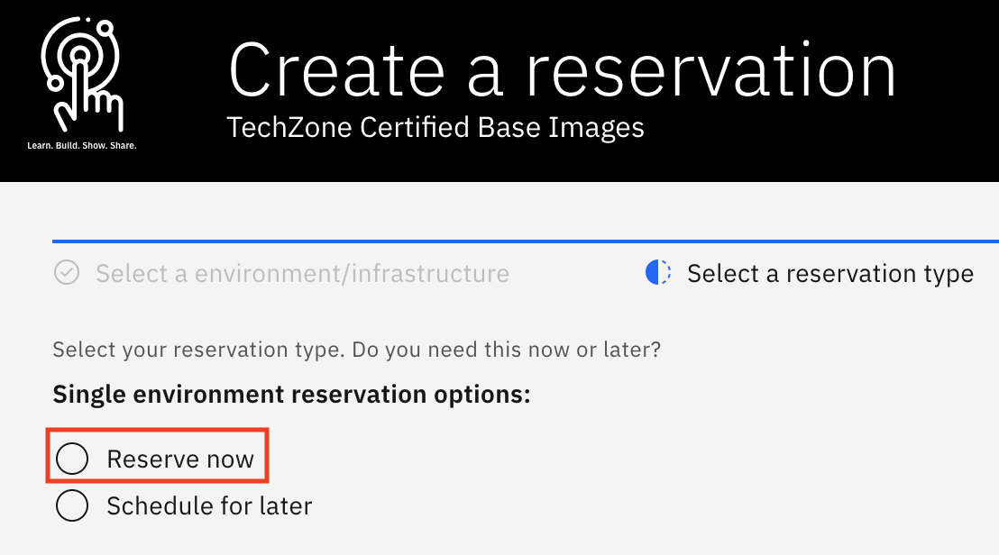
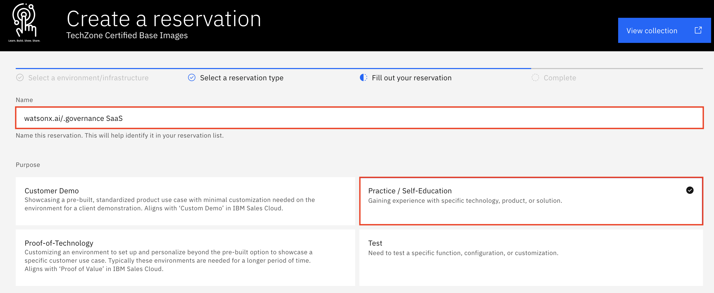
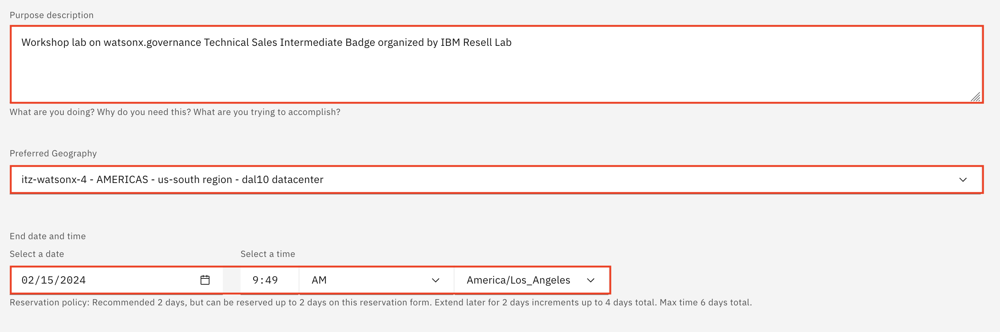
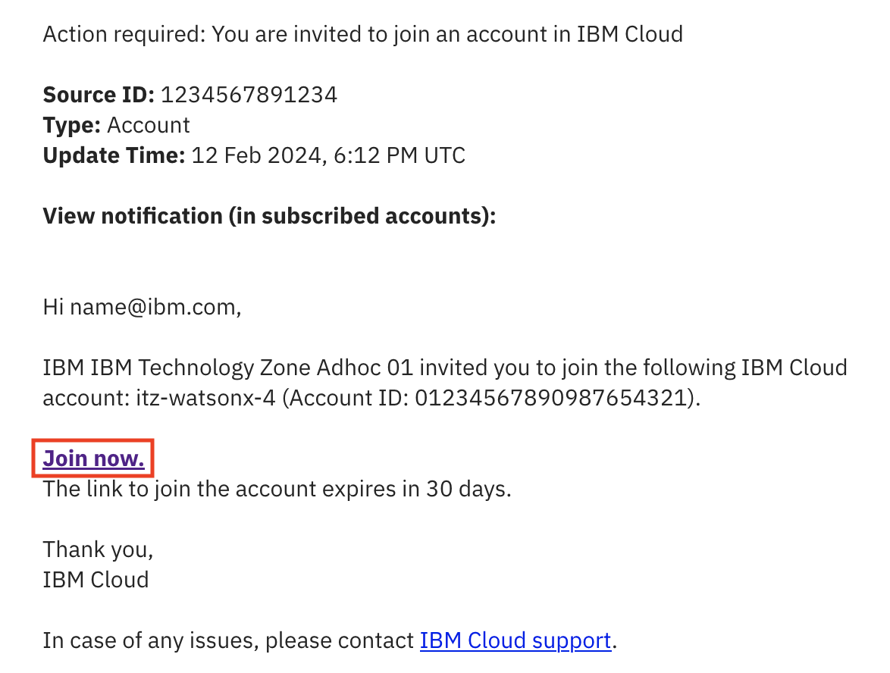
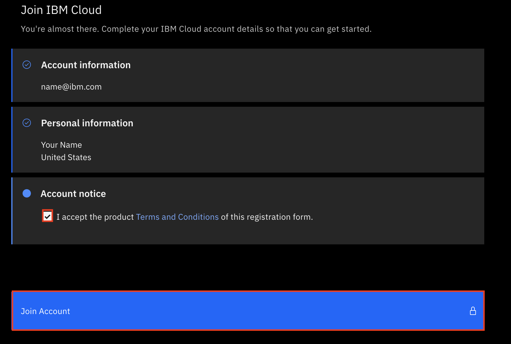
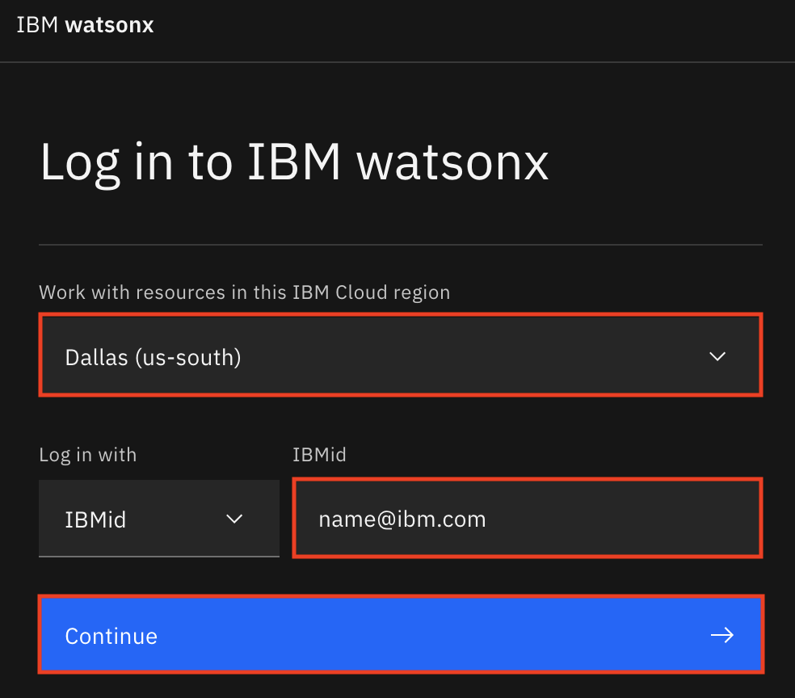
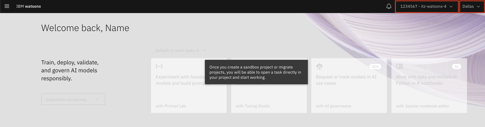

<QuizAlert text='Heads Up! Quiz material will be flagged like this!' />

## Provision a watsonx.governance Environment from TechZone

1. Open the [IBM watsonx.ai/watsonx.governance SaaS base image](https://techzone.ibm.com/my/reservations/create/64b8490a564e190017b8f4eb) in IBM Technology Zone. Sign in with your IBMid and accept any terms and conditions you are presented with.

2. For the reservation type, select the **Reserve now** radio button.

    

3. Accept the default for the reservation **Name**, or provide a name of your choosing. For the **Purpose** of the reservation, select **Practice / Self-Education**.

    

4. Fill in the **Purpose description** box with the reason you are making the reservation (ex. `Workshop lab on watsonx.governance Technical Sales Intermediate Badge organized by IBM Resell Lab`). Then, scroll further down and select your **Preferred geography** based on your location (ex. **AMERICAS - us-south region - dal10 datacenter**). Keep the reservation's **End date and time** (by default it’s two days (48 hours) from now; it can’t exceed two days initially, but you can extend the reservation by two days, up to two times, before it expires).

    

5. On the right-side panel, follow the links to read the Terms & Conditions and the End User Security Policies documents. Then, select the checkbox to agree to those terms. Finally, click **Submit**.

    

    A message in the upper-right corner will briefly appear stating that the reservation has been created. You may also be presented with an opportunity to provide feedback on the process. Feel free to share your feedback.

    Shortly after, you will receive an email from IBM Technology Zone acknowledging receipt of the request and that the reservation has started provisioning. You will receive two more emails when the provisioning is complete: One form IBM Technology Zone confirming provisioning is complete and another from IBM Cloud inviting you to join the IBM Cloud account associated with the environment. Provisioning may be as quick as 15 minutes, or it may take an hour or more. If provisioning fails, it may be due to a lack of resources in the geography specified. Try again with the same geography or specify a different one.

    Reservation status is available at https://techzone.ibm.com/my/reservations.

    You must now wait until the environment has been provisioned before moving on to the next section. Specifically, you can continue on to the next section once you have received both the **Reservation Ready** on IBM Technology Zone email from IBM Technology Zone as well as the IBM Cloud account invitation email from IBM Cloud.

## Accessing the watsonx.governance Environment

1. Open the email from IBM Cloud inviting you to join an IBM Cloud account and press **Join Now**.

  

2. On the page that opened from the previous step, verify your IBM Cloud account information, select the checkbox to agree to those terms after reading the Terms & Conditions and press the **Join Account** button to join the IBM Cloud account.

  

3. Navigate [here](https://dataplatform.cloud.ibm.com/wx/home?context=wx) to the IBM watsonx platform. If propted to, login in with your IBMid and verify you are working with resources in the same IBM Cloud region as your selected **Preferred geography** (ex. **Dallas (us-south)**). Finally, press **Continue**.

  

4. On the IBM watsonx platform home page, verify in the top right that you are signed into the correct account and location. If you are not, select the correct options form the respective dropdown menus.

  

### Congratulations, you've reached the end of lab 1.

To start the L3 Labs, click [lab 102](/watsonx/watsonxgov/102)
