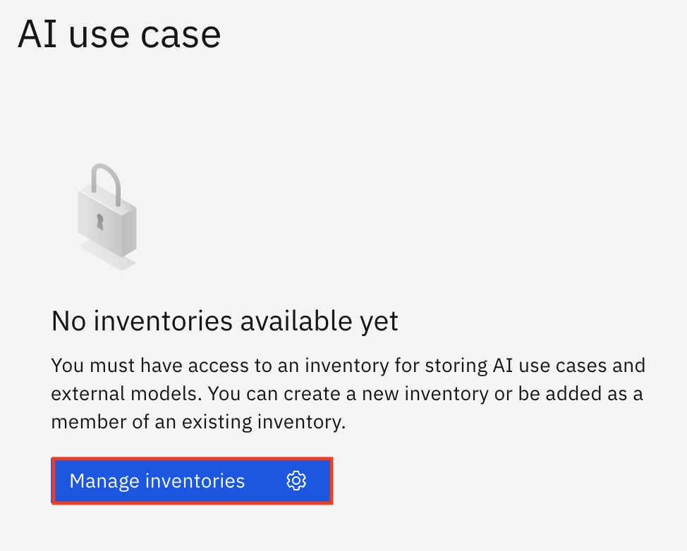
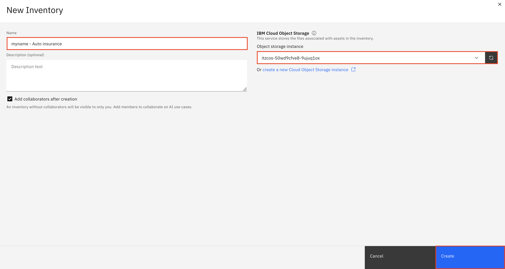
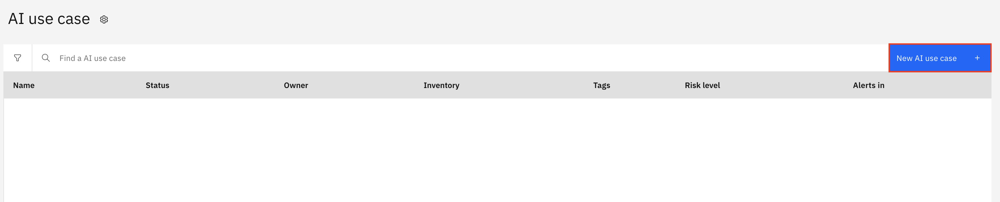
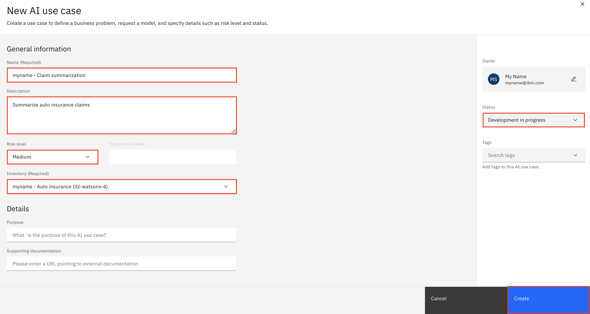
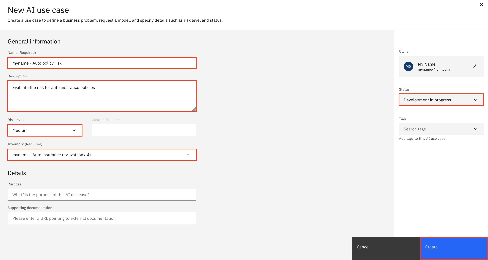

<QuizAlert text="¡Aviso! ¡El material del cuestionario se marcará así!" />

# Definir un caso de uso del modelo de IA

## Caso práctico

En esta serie de laboratorios (Labs 102-106), su cliente es una gran compañía de seguros que está intentando infundir IA en su negocio, al tiempo que cumple con las mejores prácticas y normativas. Mediante la plataforma IBM watsonx, demostrará cómo, con una única solución, pueden gobernar, supervisar y documentar tanto los nuevos modelos generativos de IA como los modelos predictivos tradicionales.

## Crear un inventario modelo

Los casos de uso se recopilan como activos en un inventario de modelos. Es necesario tener acceso a un inventario modelo para completar este laboratorio. Si ya se ha creado un inventario modelo, puede pasar a la siguiente sección del laboratorio.

1.  Inicie sesión en la [plataforma IBM watsonx](https://dataplatform.cloud.ibm.com/wx/home?context=wx).
2.  Haga clic en el **menú de navegación** de la parte superior izquierda para ampliarlo. Localice la sección de **gobernanza de IA** del menú, ampliándola si es necesario, y haga clic en **Casos de uso de IA**.

3.  Haga clic en Gestionar **inventarios**. Se abrirá la pantalla **Gestionar**.

4.  Haga clic en **Nuevo inventario**.
5.  Dé a su inventario un nombre que incluya alguna información identificativa y el propósito para el que se utilizará (ej. `<tus iniciales o cadena única> - Auto Insurance` de automóvil). En este caso, su inventario se ocupará de los modelos de seguros de automóviles. Utilice el menú desplegable **Instancia de almacenamiento** de objetos para seleccionar su servicio de almacenamiento de objetos. Por último, haga clic en **Crear** para crear su inventario.

Una vez creado el inventario, tendrá la posibilidad de añadir colaboradores. Haga clic en la **x** de la parte superior derecha para cerrar la ventana **Establecer colaboradores** y, a continuación, haga clic en la **x** de la parte superior derecha para cerrar la ventana **Gestionar**.

Ha creado correctamente un inventario.

*   Para saber cómo aplicar los principios de gobernanza de la IA a los modelos **generativos** de IA, continúe en [Definir un caso de uso de modelo **generativo** de IA](#define-a-generative-ai-model-use-case)
*   Para saber cómo aplicar los principios de gobernanza de la IA a los modelos **predictivos** de IA, continúe en [Definir un caso de uso de un modelo **predictivo** de IA](#define-a-predictive-ai-model-use-case)

## Definir un caso de uso de un modelo de IA **generativa**

<QuizAlert text="Hay una pregunta de prueba sobre casos de uso de IA." />

Esta parte del laboratorio se centra en la creación y definición de un caso de uso de modelo **generativo** de IA. La solución watsonx.governance permite a las organizaciones agrupar y realizar un seguimiento de sus modelos en función de los casos de uso o los problemas que los modelos intentan resolver. Cada caso de uso almacena y organiza los datos y la información del ciclo de vida de los modelos candidatos en las fases de desarrollo, prueba y producción.

Para este caso de uso, el departamento de reclamaciones de automóviles de la gran compañía de seguros quiere utilizar un modelo de IA generativa para resumir las reclamaciones de seguros de automóviles, lo que creen que reducirá significativamente la carga de trabajo de su departamento de revisión de reclamaciones y mejorará el tiempo de respuesta de las reclamaciones. Sin embargo, han visto noticias sobre posibles problemas con modelos de IA generativa que proporcionan información imprecisa, son propensos a responder con un discurso odioso, agresivo o profano (HAP) o pueden filtrar información de identificación personal (PII). Necesitan poner en marcha un sistema para supervisar y evaluar su modelo con el fin de abordar sus preocupaciones antes de empezar a utilizar el modelo en producción.

1.  Haga clic en el **menú de navegación** de la parte superior izquierda para ampliarlo. Localice la sección de **gobernanza de IA** del menú, ampliándola si es necesario, y haga clic en **Casos de uso de IA**.

2.  Haga clic en el botón **Nuevo** **caso de uso** de IA para abrir la ventana **Nuevo caso de uso de IA**.

3.  En la ventana **Nuevo caso de uso de IA**, rellene la información que aparece a continuación y pulse el botón **Crear**:

*   **Nombre:** Dale a tu caso de uso de IA un nombre que incluya alguna información identificativa y el propósito para el que se utilizará (ej. `<tus iniciales o cadena única> - Claim summarization` de siniestros). En este caso, su caso de uso se ocupará de resumir las reclamaciones de seguros de automóviles.
*   **Descripción:** `Summarize auto insurance claims`
*   **Nivel de riesgo:** Utilice el desplegable para establecer el nivel de riesgo asociado y establezca el nivel en **Medio**. (En un ejemplo real, esto lo realizaría el responsable de gestión de riesgos de una organización).
*   **Inventario:** Seleccione el inventario de modelos que creó en un paso anterior.
*   **Estado:** Haga clic en el desplegable **Estado** en la parte derecha de la pantalla y seleccione **Desarrollo en curso**.

IBM watsonx.governance permite a las organizaciones implementar procedimientos de aprobación formales en torno a los ciclos de vida de sus modelos. Crean un caso de uso para el problema empresarial con el fin de solicitar una mayor exploración y desarrollo (estado **Listo para aprobación de** caso de uso), y pueden actualizar el estado del caso de uso a medida que avanza en el proceso, desde la aprobación inicial (estado **Caso de uso aprobado** ) hasta la asignación de recursos de ingeniería de IA (estado **En espera de desarrollo** ). Para este laboratorio, se moverá directamente a un caso de uso aprobado.

4.  Tómese un momento para revisar la pantalla del caso de uso y observe la pestaña **Acceso**, que permite compartir el caso de uso con otras partes interesadas para permitir la colaboración en el ciclo de vida del modelo.

Ha creado con éxito un caso de uso de un modelo de IA **generativa** para abordar una necesidad empresarial.

### Enhorabuena, has llegado al final del laboratorio 102 de modelos **generativos** de IA.

Haga clic en, **[laboratorio 103](/watsonx/watsonxgov/103)** para iniciar el siguiente laboratorio.

## Definir un caso de uso del modelo de IA **predictiva**

<QuizAlert text="Hay una pregunta de prueba sobre casos de uso de IA." />

Esta parte del laboratorio se centra en la creación y definición de un caso de uso de un modelo de IA **predictiva**. La solución watsonx.governance permite a las organizaciones agrupar y realizar un seguimiento de sus modelos en función de los casos de uso, o problemas que los modelos intentan resolver. Cada caso de uso almacena y organiza los datos y la información del ciclo de vida de los modelos candidatos en las fases de desarrollo, prueba y producción.

En este caso de uso, una compañía de seguros quiere evaluar el riesgo asociado a las pólizas de seguros de automóviles. Su equipo de científicos de datos ha recopilado datos sobre varios "puntos calientes" de accidentes en la zona metropolitana de Chicago, donde los accidentes de tráfico son más frecuentes. Los científicos de datos han descubierto que cuanto más cerca vive un asegurado de un punto conflictivo, más probabilidades tiene de verse implicado en un accidente y presentar una reclamación. Han sugerido incorporar estos datos a otros factores de riesgo conocidos, como la edad, el sexo y el tipo de vehículo del conductor, para construir un modelo de predicción de riesgos basado en IA.

1.  Haga clic en el **menú de navegación** de la parte superior izquierda para ampliarlo. Localice la sección de **gobernanza de IA** del menú, ampliándola si es necesario, y haga clic en **Casos de uso de IA**.

2.  Haga clic en el botón **Nuevo** **caso de uso** de IA para abrir la ventana **Nuevo caso de uso de IA**.

3.  En la ventana **Nuevo caso de uso de IA**, rellene la información que aparece a continuación y pulse el botón **Crear**:

*   **Nombre:** Dale a tu caso de uso de IA un nombre que incluya alguna información identificativa y el propósito para el que se utilizará (ej. `<tus iniciales o cadena única> - Auto policy risk` de automóvil). En este caso, su caso de uso se ocupará de evaluar el riesgo asociado a las pólizas de seguros de automóviles.
*   **Descripción:** `Evaluate the risk for auto insurance policies`
*   **Nivel de riesgo:** Utilice el desplegable para establecer el nivel de riesgo asociado y establezca el nivel en **Medio**. (En un ejemplo real, esto lo realizaría el responsable de gestión de riesgos de una organización).
*   **Inventario:** Seleccione el inventario de modelos que creó en un paso anterior.
*   **Estado:** Haga clic en el desplegable **Estado** en la parte derecha de la pantalla y seleccione **Desarrollo en curso**.

IBM watsonx.governance permite a las organizaciones implementar procedimientos de aprobación formales en torno a los ciclos de vida de sus modelos. Crean un caso de uso para el problema empresarial con el fin de solicitar una mayor exploración y desarrollo (estado **Listo para aprobación de** caso de uso), y pueden actualizar el estado del caso de uso a medida que avanza en el proceso, desde la aprobación inicial (estado **Caso de uso aprobado** ) hasta la asignación de recursos de ingeniería de IA (estado **En espera de desarrollo** ). Para este laboratorio, se moverá directamente a un caso de uso aprobado.

4.  Tómese un momento para revisar la pantalla del caso de uso y observe la pestaña **Acceso**, que permite compartir el caso de uso con otras partes interesadas para permitir la colaboración en el ciclo de vida del modelo.

Ha creado con éxito un caso de uso para un modelo de IA **predictiva** para abordar una necesidad empresarial.

### Enhorabuena, has llegado al final del laboratorio 102 de modelos **predictivos** de IA.

Haga clic en, **[laboratorio 103](/watsonx/watsonxgov/103)** para iniciar el siguiente laboratorio.
