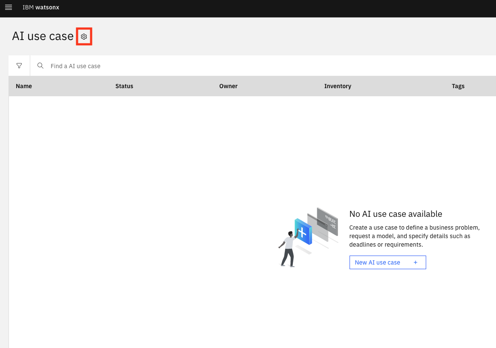
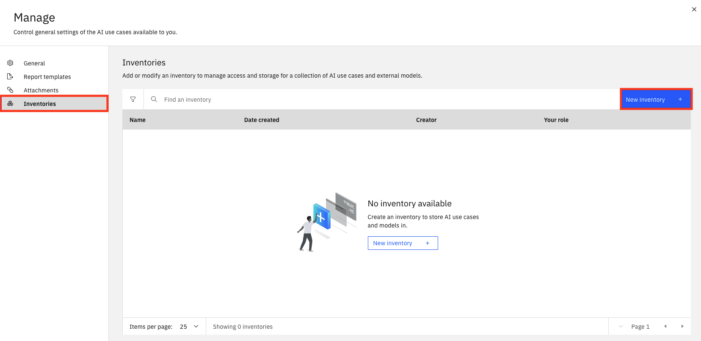

<QuizAlert text='Heads Up! Quiz material will be flagged like this!' />

# Define an AI model use case

## Use Case

In this lab series (Labs 102-106), your client is a large insurance company that is attempting to infuse AI into their business, while complying with best practices and regulations. Using the IBM watsonx platform, you will demonstrate how, with a single solution, they can govern, monitor, and document both new generative AI models and traditional predictive models.

## Create a model inventory

Use cases are collected as assets in a model inventory. Access to a model inventory is required to complete this lab. If a model inventory has already been created, you can skip to the next section of the lab.

1. Sign into the [IBM watsonx platform](https://dataplatform.cloud.ibm.com/wx/home?context=wx).

2. Click on the **Navigation Menu** in the upper left to expand it. Locate the **AI governance** section of the menu, expanding it if necessary, and click on **AI use cases**.

3. Click on the **Manage settings** gear icon. The **Manage** screen will open.

4. Select **Inventories** and then click the **New inventory** button.

5. Give your inventory a name that includes some identifying information and the purpose it will be used for (ex. `<your initials or unique string> - Auto Insurance`). In this case, your inventory will deal with auto insurance models. Use the **Object storage instance** dropdown to select your object storage service. Finally, click **Create** to create your inventory.

Once the inventory has been created, you will have the opportunity to add collaborators. Click the **x** in the upper right to close the **Set collaborators** window, then click the **x** in the upper right to close the **Manage** window.

You have successfully created an inventory. - To learn how to apply AI governance principles to **generative** AI models, continue to [Define a **generative** AI model use case](#define-a-generative-ai-model-use-case) - To learn how to apply AI governance principles to **predictive** AI models, continue to [Define a **predictive** AI model use case](#define-a-predictive-ai-model-use-case)

## Define a **generative** AI model use case

<QuizAlert text='There is a quiz question on AI use cases.' />

This part of the lab focuses on creating and defining a **generative** AI model use case. The watsonx.governance solution allows organizations to group and track their models based on use cases, or issues that models are attempting to solve. Each use case stores and organizes data and lifecycle information for candidate models in development, testing, and production phases.

For this use case, the automotive claims department of the large insurance company wants to use a generative AI model to summarize auto insurance claims, which they believe will significantly reduce the workload for their claim review department and improve claim response time. However, they have seen news reports about potential issues with generative AI models providing inaccurate information, being prone to responding with hateful, aggressive, or profane (HAP) speech, or potentially leaking personally identifiable information (PII). They need to put a system in place to monitor and evaluate their model to address their concerns before they begin using the model in production.

1. Click on the **Navigation Menu** in the upper left to expand it. Locate the **AI governance** section of the menu, expanding it if necessary, and click on **AI use cases**.

2. Click the **New AI use case** button to open the **New AI use case** window.

3. In the **New AI use case** window fill out the information below and then press the **Create** button:

- **Name:** Give your AI use case a name that includes some identifying information and the purpose it will be used for (ex. `<your initials or unique string> - Claim summarization`). In this case, your use case will deal with summarizing auto insurance claims.
- **Description:** `Summarize auto insurance claims`
- **Risk level:** Use the dropdown to set the associated level of risk and set the level to **Medium**. (In a real-world example, this would be performed by the risk management officer of an organization.)
- **Inventory:** Select the model inventory you created in a previous step.
- **Status:** Click on the **Status** dropdown on the right side of the screen and select **Development in progress**.

IBM watsonx.governance allows for organizations to implement formal approval procedures around their model lifecycles. They create a use case for the business problem to request further exploration and development (the **Ready for use case approval** status), and can update the status of the use case as it moves through the process, from initial approval (the **Use case approved** status) to the assigning of AI engineering resources (the **Awaiting development** status). For this lab, you will move directly to an approved use case.

4. Take a moment to review the use case screen, and note the **Access** tab, which allows sharing of the use case with other stakeholders to allow collaboration on the model lifecycle.

You have successfully created a use case for a **generative** AI model to address a business need.

### Congratulations, you've reached the end of lab 102 for **generative** AI models.

Click, **[lab 103](/watsonx/watsonxgov/103)** to start next lab.

## Define a **predictive** AI model use case

<QuizAlert text='There is a quiz question on AI use cases.' />

This part of the lab focuses on creating and defining a **predictive** AI model use case. The watsonx.governance solution allows organizations to group and track their models based on use cases, or issues that models are attempting to solve. Each use case stores and organizes data and lifecycle information for candidate models in development, testing, and production phases.

For this use case, an insurance company would like to assess the risk associated with auto insurance policies. Their data science team has gathered data on various accident "hotspots" in metro Chicago, where traffic accidents happen more frequently. The data scientists have found that the closer a policyholder lives to a hotspot, the more likely they are to be involved in an accident and file a claim. They have suggested incorporating this data with other known risk factors such as driver age, gender, and vehicle type to build an AI risk prediction model.

1. Click on the **Navigation Menu** in the upper left to expand it. Locate the **AI governance** section of the menu, expanding it if necessary, and click on **AI use cases**.

2. Click the **New AI use case** button to open the **New AI use case** window.

3. In the **New AI use case** window fill out the information below and then press the **Create** button:

- **Name:** Give your AI use case a name that includes some identifying information and the purpose it will be used for (ex. `<your initials or unique string> - Auto policy risk`). In this case, your use case will deal with assessing the risk associated with auto insurance policies.
- **Description:** `Evaluate the risk for auto insurance policies`
- **Risk level:** Use the dropdown to set the associated level of risk and set the level to **Medium**. (In a real-world example, this would be performed by the risk management officer of an organization.)
- **Inventory:** Select the model inventory you created in a previous step.
- **Status:** Click on the **Status** dropdown on the right side of the screen and select **Development in progress**.

IBM watsonx.governance allows for organizations to implement formal approval procedures around their model lifecycles. They create a use case for the business problem to request further exploration and development (the **Ready for use case approval** status), and can update the status of the use case as it moves through the process, from initial approval (the **Use case approved** status) to the assigning of AI engineering resources (the **Awaiting development** status). For this lab, you will move directly to an approved use case.

4. Take a moment to review the use case screen, and note the **Access** tab, which allows sharing of the use case with other stakeholders to allow collaboration on the model lifecycle.

You have successfully created a use case for a **predictive** AI model to address a business need.

### Congratulations, you've reached the end of lab 102 for **predictive** AI models.

Click, **[lab 103](/watsonx/watsonxgov/103)** to start next lab.
